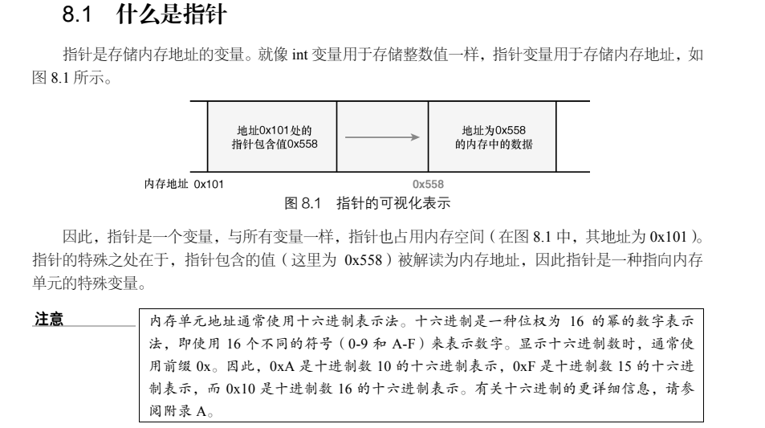
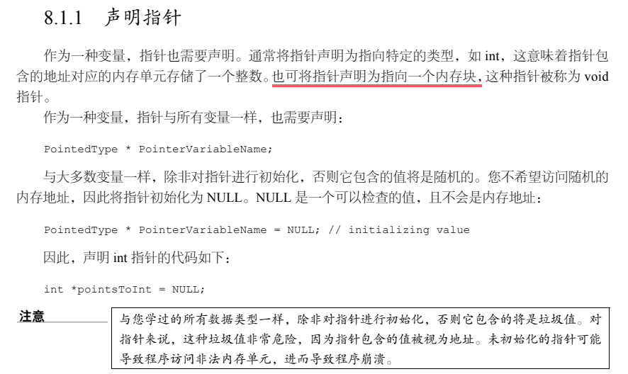
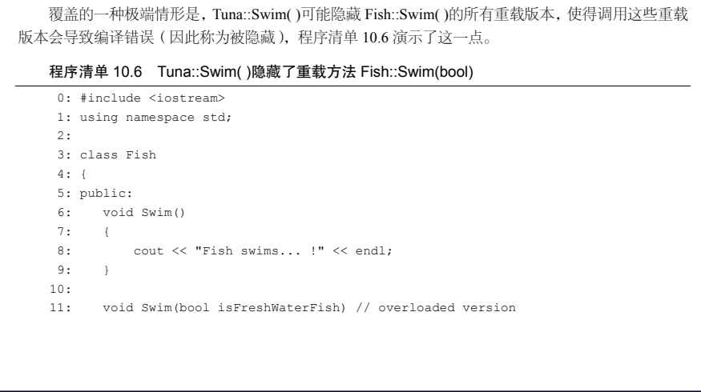
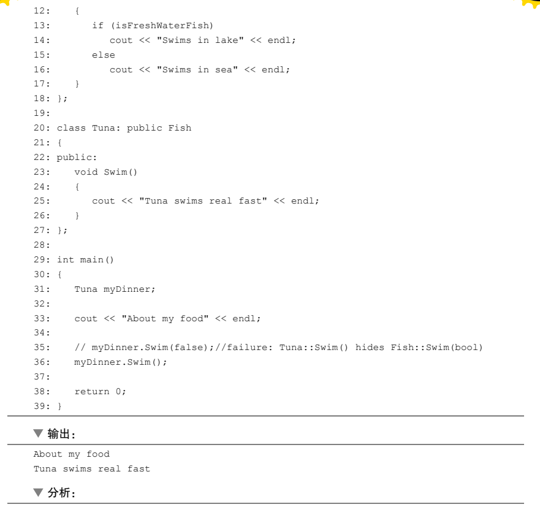
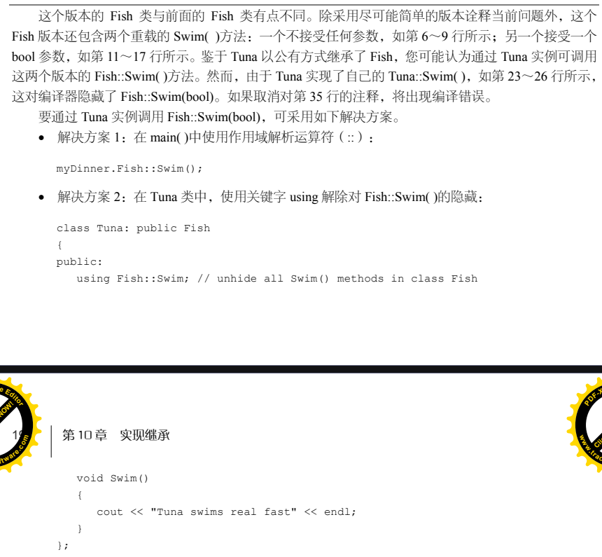
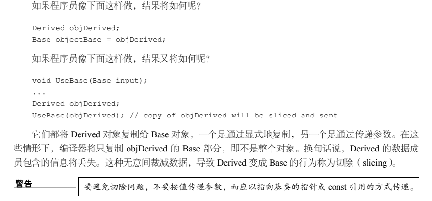
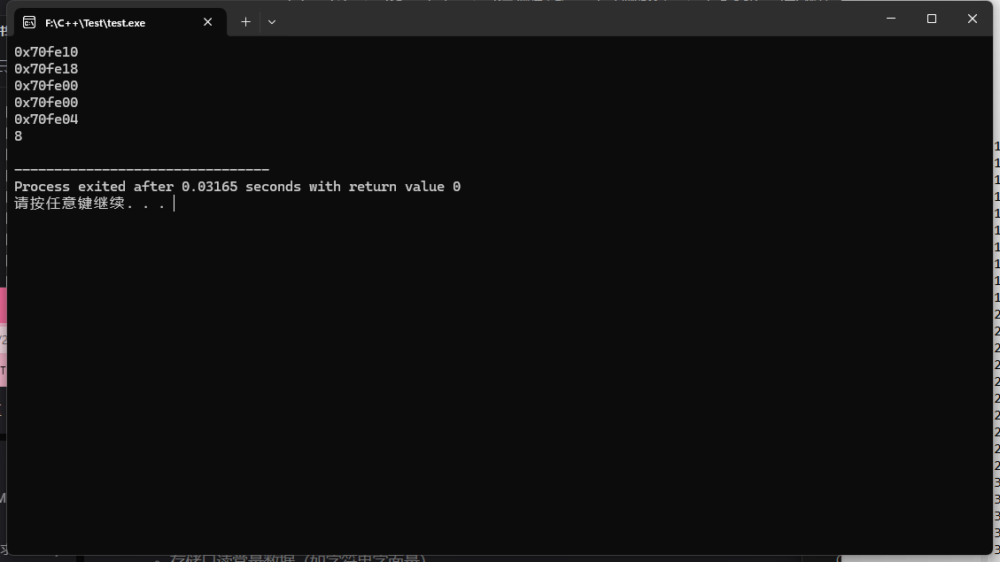
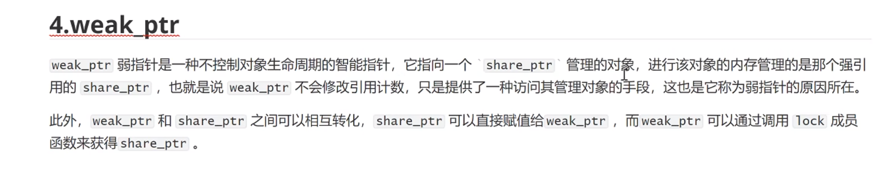

[（已完结）C++深度解析教程 - 目录 - 知乎 (zhihu.com)](https://zhuanlan.zhihu.com/p/653363420)

### 零散小知识

1. 函数声明：`int DemoConsoleOutput();`

   函数定义：`DemoConsoleOutput()`的具体实现

2. override：检查是否正确重写虚函数

   final：

   - ```c++
     class Base final {				// final 修饰类表示该类不能被继承
         // class definition
     };
     ```

   - ```c++
     class Base {
     public:
         virtual void foo() {}
     };
     class Derived final : public Base { 	// Derived类被final修饰，不能被继承
     public:
         void foo() final {} 						// foo函数被final修饰，不能在子类中被重写
     };
     ```

### C++14中的auto

C++11 引入的新功能 auto 让您能够定义这样的变量，即编译器将自动推断其类型，这简化了变量 声明，同时又不影响类型安全。C++14 将这种功能扩展到了返回类型

对于依赖于返回类型自动推断的函数，必须先定义（即实现）再调用。这是因为调用函 数时，编译器必须知道其返回类型。如果这种函数包含多条 return 语句，必须确保根据 它们推断出的返回类型都相同。另外，在递归调用后面，至少得有一条 return 语句。

### 数据溢出计算

以char为例，当char取最大值时，bit位：0111 1111，此时为127；当char取最小值时，bit位：1000 0000，此时为-128

综上，有符号数char为正数时，正常计算，为负数时，结果 = -(2^7 - 后七位数的正数值)，其他有符号整数同理

### C++11初始化列表？？？

> - 初始化列表的初始化方式总是先于构造函数完成的（实际在编译完成时就已经决定了)。

### C++11列表初始化

[列表初始化及decltype_列表初始化类中的结构体-CSDN博客](https://blog.csdn.net/wh9109/article/details/133104216)

[【C++从练气到飞升】24--C++11：列表初始化 | 声明 | STL的升级-CSDN博客](https://blog.csdn.net/m0_68662723/article/details/142185423)

#### C++98中的{}

仅允许使用花括号 { } 对**数组**或者**结构体元素**进行统一的列表初始化

```c++
struct Point
{
	int _x;
	int _y;
};
 
int main()
{
	int arrya1[] = { 1, 2, 3, 4 };//列表初始化，初始化数组
	int array2[5] = { 0 };//列表初始化，初始化数组
	Point p = { 1, 2 };//列表初始化，初始化结构体元素
	Point array3[] = { {1, 2}, {3, 4}, {5, 6} };//列表初始化，初始化结构体数组
	return 0;
}
```

#### C++11中的{}

##### 用于内置类型初始化

使用初始化列表时，可以添加等号（=），也可以不添加，其中new表达式中不可带等号

```c++
int main()
{
	//C++11 中列表初始化应用在内置类型上
	int x1 = 10;
	int x2 = { 20 };
	int x3{ 30 };//不带等号
 
	//C++11 中列表初始化也可以适用于 new 表达式中
	int* p1 = new int[5]{100, 112, 113};
	return 0;
}
```

##### 用于用户自定义的类型初始化

创建对象时也可以使用列表初始化的方式来调用构造函数初始化

> - 如果在 Date 类的构造函数加上 explicit ，那么 Date d3 = { 2022, 1, 3 }; 就会出现编译报错，因为这条语句本质上是因为**多参数的构造函数支持隐式类型转换**。Date d2{ 2022, 1, 2 }; 没事，仍然可以正常运行。
>
> - 如果Date既有多参构造函数，又有initializer_list做参数的构造函数，那么在使用列表初始化的时候，只会调用后者

```c++
class Date
{
public:
	Date(int year, int month, int day) : _year(year), _month(month), _day(day)
	{
		cout << "Date(int year, int month, int day)" << endl;
	}
private:
	int _year;
	int _month;
	int _day;
};
 
int main()
{
	Date d1(2022, 1, 1); // old style
 
	// C++11支持的列表初始化，这里会调用构造函数初始化
	Date d2{ 2022, 1, 2 };
	Date d3 = { 2022, 1, 3 };//本质上是多参数的构造函数支持隐式类型转换，注意此处由于是在初始化阶段，所以调用的是有参构造函数，不是operate=()
    const Date& d1 = { 2003, 10, 18 };//(正确)
	return 0;
}
```

但是如果稍加更改

```c++
// 添加了一个initializer_list作为参数的构造函数
#include <iostream>
#include <initializer_list>
using namespace std;

class Date
{
public:
	Date(int year, int month, int day) : _year(year), _month(month), _day(day)
	{
		cout << "Date(int year, int month, int day)" << endl;
	}

	explicit Date(initializer_list<int> il)
	{
		cout << "Date(initializer_list<int> il)" << endl;
	}

private:
	int _year;
	int _month;
	int _day;
};

int main()
{
	Date d2{ 2022, 1, 2 };		// 编译通过，调用了一元有参构造函数
							  // 我理解成Date d2({ 2022, 1, 2 })
	Date d1 = { 2022, 1, 2 };	// 编译错误：复制列表初始化不能使用标记为“显式”的构造函数
    						  // 也就是说，此处也调用了一元有参构造，而不是三元有参构造
	auto e = { 2022, 1, 2 };
	Date d3 = static_cast<Date>(e);	// 编译通过，调用了一元有参构造函数
    Date d4(2022, 1, 2 );			// 编译通过，调用三元有参构造
	return 0;
}
```

如上：**在添加了一个`initializer_list`作为参数的构造函数之后，使用列表初始化时就只会调用这个构造函数了，只能使用传统方式调用三元有参构造**

##### typeid(变量名).name()

 C++11 标准中，`typeid(变量名).name() `函数返回的是一个 const char*，指向一个以 null 终止的字符串，表示类型的类型名称。

##### initializer_list

一般作为容器中构造函数的参数

```c++
int main()
{
	auto il = { 1, 2, 3 };
	cout << typeid(il).name() << endl;
	return 0;
}
// 输出结果：
// class std::initializer_list<int>
```

##### 用于容器初始化以及赋值

新增 initializer_list 作为参数的构造函数和operator=，创建对象时使用 initializer_list 来调用构造函数初始化

> 需要注意，下面代码中创建 Date 类型的对象 d1，本质上是隐式类型的转换。但是**容器存储的数据个数可多可少，并不确定，所以提供了形参为 initializer_list 的构造函数**，这样就方便我们将任意数量的元素存到容器中。而 Date 作为一个日期类对象，它的三个成员变量是固定的，所以不需要提供形参为 initializer_list 的构造函数。因此**自定义类的列表初始化本质上是隐式类型转换，而容器类的列表初始化本质上是使用 initializer_list 作为形参的构造函数**。

```c++
int main()
{
    //调用vector中形参为 initializer_list 的构造函数
	vector<int> v = { 1,2,3,4 };
	// 这里先隐式转换，调用有参构造创建一个pair对象，再调用形参为 initializer_list 的构造函数
	map<string, string> dict = { {"sort", "排序"}, {"insert", "插入"} };
	//调用vector中形参为 initializer_list 的赋值运算符重载函数
	v = { 10, 20, 30 };
 
	Date d1 = { 2003, 4, 5 };//这里是直接调用3个参数的构造函数 --- 隐式类型转换
 
	return 0;
}
```

##### 防止类型收窄


类型收窄一般是指一些可以使得数据变化或者精度丢失的隐式类型转换。可能导致类型收窄的典型情况
如下:

- 从浮点数隐式地转化为整型数。比如:int a=1.2，这里a实际保存的值为整数1，可以视为类型收窄。

- 从高精度的浮点数转为低精度的浮点数，比如从 long double 隐式地转化为double，或
从double 转为float。如果这些转换导致精度降低，都可以视为类型收窄。

- 从整型（或者非强类型的枚举）转化为浮点型，如果整型数大到浮点数无法精确表示，则也可以视为类型收窄。


- 从整型（或者非强类型的枚举）转化为较低长度的整型，比如:unsigned char=1024，
1024明显不能被一般长度为8位的unsigned char所容纳，所以也可以视为类型收窄。

C++11中，使用初始化列表进行初始化的数据编译器是会检查其是否发生类型收窄的

```c++
int main()
{
	const int x = 1024;
	const int y = 10;

	char a = x;						// 收窄，但可以通过编译
	char* b = new char(1024);		// 收窄，但可以通过编译

	char c = { x };					// 收窄，无法通过编译
	char d = { y };					// 可以通过编译
	unsigned char e{ -1 };			// 收窄，无法通过编译

	float f{ 7 };					// 可以通过编译
	int g{ 2.0f };					// 收窄，无法通过编译
	float* h = new float{ 1e48 };	// 收窄，无法通过编译
	float i = 1.21;					// 可以通过编译

	return 0;
}
```

### decltype

[C++11特性：decltype关键字 - melonstreet - 博客园 (cnblogs.com)](https://www.cnblogs.com/QG-whz/p/4952980.html)

[C++ decltype用法详解-CSDN博客](https://blog.csdn.net/qq_38196982/article/details/118578967)


### C++11 constexpr 关键字


### 左值引用和右值引用

左值与右值这两个概念是从 C 中传承而来的，左值指既能够出现在等号左边，也能出现在等号右边的变量；右值则是只能出现在等号右边的变量。

使用场景：**当函数返回了一个函数内部定义的临时变量时，可以用右值引用接收**

- **左值引用只能绑定左值**

```c++
int a1 = 10;
int& a2 = 10;// 编译错误：非常量左值引用
int& a2 = a1;//编译正确，左值引用可以接受左值
```

- **常量左值引用既可以接收左值，也可以接收右值**

```c++
	int& a = 7;//编译报错：非常量左值引用
	const int& a = 7;//编译正确，常量左值引用可以接收右值
	const int& b = a;//编译正确，常量左值引用可以接收左值
	//常量左值引用可以绑定右值是一条非常棒的特性，但是也存在一个缺点————常量性，一旦使用常量左值引用，表示我们无法在函数内修改该对象的内容（强制类型转换除外），所以需要另一个特性帮助我们完成工作，即右值引用。
```

- **右值引用只能绑定右值，或者通过std::move()绑定左值**，能够有效**延长右值的生命周期，减少对象复制，提升程序性能**；在语法方面，右值引用在类型后加&&

  右值引用既可以作为左值，也可以作为右值，当右值引用有名字的时候为左值：`int&& a = 3;`此时a为左值；右值引用没名字的时候为右值：`move()`的返回值为右值引用，此时右值引用为右值，因为该返回值只能被右值引用接收；

```c++
	int i = 0;
	int& j = i;		//左值引用
	int&& k = 11;	//右值引用
	//上述代码中，k是一个右值引用，如果用k引用i，会引起编译错误，右值引用的特点是可以延长右值的生命周期，对于11，理解可能不是很深，请看下面代码
```

```c++
class X{
public:
    X(){}
    X(const X& x){}
    ~X(){}
    show(){cout<<"show"<<endl;}
}
X make_x(){
    X x1;
    return x1;
}
int main(){
#ifdef 0
    //对于该段代码，一共发生了三次拷贝构造
    //第一次是函数中创建x1临时变量，第二次是返回临时变量，第三次是创建x2
    X x2(make_x());
    x2.show();					//此处是通过make_x()的返回值又构建了一个x2，调用了x2的拷贝构造函数
#endif
    //使用右值引用，只需2次拷贝构造即可实现同样功能
    //第一次是构造x1，第二次是构造x2
    //这里就很好体现出“延长生命周期，减少对象复制”的特点
    X&& x2 = make_x();
    x2.show();					// 此时x2就是make_x()的返回值，x2延长了返回值的生命周期。
}
```

### std::move

[一文读懂C++右值引用和std::move - 知乎 (zhihu.com)](https://zhuanlan.zhihu.com/p/335994370)

- <font color=red>std::move就是将左值转为右值。</font>这样就可以重载到移动构造函数了，移动构造函数将指针赋值一下就好了，不用深拷贝了，提高性能

- 使用场景：**可移动对象在<需要拷贝且被拷贝者之后不再被需要>的场景，建议使用**`std::move`**触发移动语义，提升性能。**

```cpp
class Array {
public:
    ......
 
    // 优雅
    Array(Array&& temp_array) {
        data_ = temp_array.data_;
        size_ = temp_array.size_;
        // 为防止temp_array析构时delete data，提前置空其data_      
        temp_array.data_ = nullptr;
    }
    
public:
    int *data_;
    int size_;
};
```

如何使用：

```cpp
// 例1：Array用法
int main(){
    Array a;
 
    // 做一些操作
    .....
     
    // 左值a，用std::move转化为右值
    Array b(std::move(a));
}
```

- 注意：`std::move`本身移动不了什么，唯一的功能是把左值强制转换成右值，实现等同于一个类型转换：`static_cast<T&&>(lvalue)`，所以单纯的`std::move(xxx)`不会有性能提升，**通常使用`std::move`结合类的构造函数实现移动语义或者通过右值引用延长返回值生命周期**。

```C++
int &&ref_a = 5;
ref_a = 6; 
 
// 等同于以下代码：
 
int temp = 5;
int &&ref_a = std::move(temp);
ref_a = 6;
```

## 

### C++中的运算符

- 逻辑运算符：`!`，`&&`，`||`

- 按位运算符：按位运算符返回的并非布尔值，而是对操作数对应位执行指定运算的结果

  - NOT（～）、AND（&）、OR（ | ）和 XOR（^）

    ```c++
    #include <iostream> 
    #include <bitset> 
    using namespace std; 
     
    int main() 
    { 
    	cout << "Enter a number (0 - 255): "; 
        unsigned short inputNum = 0; 
        cin >> inputNum;  
     
        bitset<8> bitwiseNOT = (~inputNum); 
        cout << "~" << inputBits << " = " << bitwiseNOT << endl;// 以二进制输出按位非的结果
     
        bitset<8> bitwiseAND = (0x0F & inputNum);// 0x0F is hex for 0001111 
        cout << "0001111 & " << inputBits << " = " << bitwiseAND << endl;
        
        return 0;
    }
    ```

  - 按位右移运算符（>>）和左移运算符（<<）

    移位运算符将整个位序列向左或向右移动，其用途之一是将数据乘以或除以 2^n 。
    下面的移位运算符使用示例将变量乘以 2：
    `int doubledValue = num << 1; // shift bits one position left to double value`

    下面的的移位运算符使用示例将变量除以 2：
    `int halvedValue = num >> 1; // shift bits one position right to halve value `

### C++指针





### C++只在栈或堆上实例化对象

[C++只在栈或堆上实例化对象_c++如何实现只在栈上实例化对象?-CSDN博客](https://blog.csdn.net/qq_36652619/article/details/100748669)

[如何定义一个只能在堆/栈上生成对象的类？ - JemmyZhong - 博客园 (cnblogs.com)](https://www.cnblogs.com/jemmyzhong/p/14584743.html)

- 只能在栈上分配类对象

  ```c++
  class A{
  private:
      void* operator new(size_t t){}			// 私有化new操作符
      void operator delete(void* ptr){}	  // 私有化delete操作符
  public:
      A(){}
      ~A(){}
  };
  
   int main()
   {
  	 A* a = new(A);		// 编译失败：函数 "A::operator new" 不可访问
  	 delete a;				// 编译失败：函数 "A::operator delete" 不可访问
       return 0;
   }
  ```

- 只能在堆上实例化对象

  - new的实现过程是：首先调用名为**operator new**的标准库函数，分配足够大的原始为类型化的内存，以保存指定类型的一个对象；接下来运行该类型的一个**构造函数**，用指定初始化构造对象；最后返回指向新分配并构造后的的对象的指针

  - delete的实现过程：对指针指向的对象运行适当的**析构函数**；然后通过调用名为**operator delete** 的标准库函数释放该对象所用内存

  - 由上，为了保证可以在创建对象的时候可以正常使用` operate new`，考虑析构函数的私有化。因在栈上实例化对象之后，对象使用完毕之后自动调用析构函数，而new对象后，要手动调用delete函数才能执行对象的析构函数。

    所以当析构函数被私有化之后，若在栈上实例化对象，编译器先会检查该对象的析构函数是否可用，如果不可用，则会报错。在堆上释放对象时，若不调用delete就不会发现析构函数不可访问。

    这就会引发另外一个问题，使用new操作符在堆上实例化的对象要怎么析构呢？解决办法就是，在类中自定义一个公有函数用来销毁对象，该函数调用delete操作符，这样就可以使用该函数销毁对象而不是直接使用delete操作符了。

  ```c++
  class A{
  public:
      A(){}
      void destroy(){delete this;}
  private:
      ~A(){}
  };
  
  int main()
  {
  	A* a = new(A);	 
  	a->destroy();
  
  	A b;					// 编译错误，因为在栈上创建
      return 0;
  }
  ```

  - 但是上面这种方法由于析构函数的私有化导致无法实现类的继承和多态，所以改进方法如下

    ```c++
    class person
    {
    public:
    	static person* create()
    	{
    		return new person();
    	}
    	void destroy()
    	{
    		delete this;//首先会调用析构函数，在调用free释放空间
    	}
    	virtual void func()
    	{
    		cout << "test person" << endl;
    	}
    protected:		// 构造，析构函数设为protected，保证外界无法访问
        // 1.父子类的函数可以构成重写，从而实现多态。
    	// 2.父子类的对象可以正常释放，只不过父类的对象需要调用特定的destroy函数来释放对象。
    	// 3.当父类指针指向之类对象时，可以动态的释放掉子类的对象，而不是父类的对象。
    	person()
    	{
    		cout << "person()" << endl;
    	}
    	virtual ~person()
    	{
    		cout << "~person()" << endl;
    	}
    	
    };
    int main()
    {
    	person* ptr = person::create();
    	ptr->destroy();
    	return 0;
    }
    
    ```

### Union关键字

[【C++学习笔记】Union关键字](https://www.cnblogs.com/yyehl/p/6652928.html)

```c++
#include <iostream>
#include <bitset>
#include <string>
using namespace std;

union number
{ /*定义一个联合*/
	int i;
	struct
	{ /*在联合中定义一个结构*/
		char first;
		char second;
	}half;
}num;

void main()
{
	num.i = 0x00004241; /*联合成员赋值*/
	cout << num.half.first << num.half.second << endl; // res: AB
	num.half.first = 'a'; /*联合中结构成员赋值*/
	num.half.second = 'b';
	cout << hex << num.i << endl;									// res: 6261
}
```

#### 联合体的妙用

- 查看类成员函数的地址

  ```c++
  #include <iostream>
  using namespace std;
  
  template<typename src_type>
  void* union_cast(src_type src)
  {
  	union {
  		src_type src;
  		void* dst;
  	}u;
  	u.src = src;
  	return u.dst;
  }
  
  class A
  {
  public:
  	void (A::* p1)();	// 此时p1是个成员变量
  	void (*p2)();
  
  	void test() { }		// test是个函数地址
  	virtual void virtest() { }
  	static void stattest() { }
  
  	A() {
  		//取类成员函数地址时：①记得加&；②记得加上范围限定符
  		p1 = &A::test;		// 将函数地址赋给成员变量
  		p1 = &A::virtest;
  		p2 = &A::stattest;
  	}
  };
  
  int main() {
  	A a;
  //	p1为成员变量，需要用实例化对象进行访问，所以a.p1表示访问该成员变量（即函数地址）
  //	由于a.p1指向的是非静态成员函数，所以要通过实例化对象用 .* 进行访问
  	(a.*a.p1)();
  
  //	静态成员函数不用传this，所以较为简单
  	(*a.p2)();
  
  //	如果想访问类成员函数的地址，需要用到我的union_cast函数
  	void* pf1 = union_cast(a.p1);
  	void* pf2 = union_cast(&A::virtest);
  
  	return 1;
  }
  ```

- 判断系统的大小端序

  将**低位字节存储在起始地址**，这称为小端(little-endian)字节序；

  将**高位字节存储在起始地址**，这称为大端(big-endian)字节序。

  ```c++
  int main() {
  	union{
  		int i;
  		char c;
  	};
  	i = 0x01020304;
  	// c为04表示低位存储在起始地址，是小端序
  	printf("%d", c);// 注意转换成int
  }
  ```

- 访问类中的私有变量

  ```c++
  class X {
  public:
  	X() { cout << "1" << endl; }
  	X(const X&& x) { cout << "2" << endl; }
  	~X() {}
  	//virtual void show() { cout << "show" << endl; }
  private:
  	int i = 100;
  };
  
  int main() {
  	X x;
  	union U
  	{
  	public:
  		int i;
  		X x;
          //因为X为非POD类型，所以要自定义union的构造函数并使用 placement new 构造X
  		U() { new(&x) X; }
  		~U() { x.~X(); }
  	}u;
  	cout << u.i << endl;
  
  	system("pause");
  }
  ```

### C++constexpr

https://zhuanlan.zhihu.com/p/20206577

### 在派生类中隐藏基类的方法







### 切除问题



### 私有继承，保护继承，公开继承

[private继承的特点和意义以及何时使用](https://blog.csdn.net/realdonaldtrump/article/details/78289483#)

[Private Inheritance(what, where) ](https://www.cnblogs.com/CHYGO/articles/1901770.html)

```c++
// 私有继承
#include <iostream>
#include <bitset>
#include <string>
using namespace std;

class A {
public:
	void test() {
		cout << "1" << endl;
	}
private:
	int a = 0;
};
// 私有/保护继承：父类作为子类的一部分实现内容
class B : private/protected A // 继承时，将A中所有的protected和public方法设为private/protected。注意，基类的private成员在子类中仍然不可访问
{
public:
	void testb() {
		test();
		a = 4;			// 编译错误：成员A::a不可访问
	}
};

void main()
{
	B b;
	b.testb();
	b.test();			// 编译错误：成员A::test不可访问，从外界来看，A是作为B的一部分实现内容
}
```

```c++
// 保护继承，参考承接上面代码，随着继承层次结构的加深，保护继承将与私有继承有些不同
class C : B		// 此时假设B私有继承A
{
public:
	void testc() {
		testb();			// 编译错误：成员A::test不可访问
		test();
	}
};

class C : B		// 此时假设B保护继承A
{
public:
	void testc() {
		testb();			// 编译正确：成员A::test在C中权限为protected
		test();
	}
};
```

由此看来，私有/保护继承从外界来看相当于“has-a”的关系，是将基类作为子类的一部分实现内容

而共有继承从外界来看相当于“is-a”的关系，子类是从父类中派生出来的类

### 虚继承


### 虚函数，虚指针，虚函数表

虚表指针vptr跟虚函数密不可分，对于有虚函数或者继承于拥有虚函数的基类，对该类进行实例化时，在**构造函数执行时会对虚表指针进行初始化，并且存在对象内存布局的最前面（在继承的情况下，也是将虚表指针放在最前面）**
虚函数表（Virtual Function Table，VFT）位于C++内存模型中的**常量区**，可将虚函数表视为一个包含函数指针的静态数组，其中每个指针都指向相应的虚函数；而虚函数则位于C++内存模型中的**代码区**。

```c++
#include <iostream>
#include <bitset>
#include <string>
using namespace std;

class B
{
public:
	virtual void test() {
	}
	int a = 0;
};

class C {
public:
	void test1() {

	}
	int c = 0;
	int d = 0;
};

int main()
{
	B b;
	cout << &b << endl;			// 对象地址
	cout << &b.a << endl;		// 成员变量地址，与对象地址之间差了8个字节（被虚函数指针占用）

	C c;
	cout << &c << endl;
	cout << &c.c << endl;
	cout << &c.d << endl;

	cout << sizeof(&b) << endl;
	return 0;
}
```



[构造函数不能为虚函数的原因](https://blog.csdn.net/salmonwilliam/article/details/114259314#)

### 运算符重载

[c++基础梳理（九）：运算符重载 - 知乎 (zhihu.com)](https://zhuanlan.zhihu.com/p/636108068)

[运算符重载详解 -上](https://blog.csdn.net/Extreme_wei/article/details/130524717)

[【C++ | 重载运算符】一文弄懂C++运算符重载，怎样声明、定义运算符，重载为友元函数_c++ 重载-CSDN博客](https://blog.csdn.net/wkd_007/article/details/139860064)

- 根据返回的内容判断返回值用引用/非引用

  > 返回的内容是重载函数中定义的临时变量，则返回非引用
  >
  > 返回的内容是对象本身（this指针）
  >
  > - 返回值为引用：使用链式编程。eg：++(++OBJ_NAME)；OBJ_NAME = OBJ_1 = OBJ_2
  > - 返回值为非引用：不使用链式编程

- 后置--/++的伪参数能否用其他类型？

  > 不行，只能用int

- 二元操作符的参数传递理解

  > 两个参数，一个参数随对象通过this指针进行传递

- 运算符重载的两种方法

  > 使用成员函数重载
  >
  > 使用全局函数搭配friend关键字（访问类中的私有成员）进行重载

**运算符格式：**

```c++
返回值类型 operator 运算符(形参列表)	// 一般运算符重载都是搭配着类来使用，eg：++OBJECT_NAME
{
	...
}
```

#### operate<<：

> 流对象入参不能复制，只能引用
>
> 重载时只能声明为友元函数，因为要实现cout在左侧

```c++
class Person {
private:
    std::string name;
    int age;
public:
    Person(string name, int age) : name(name), age(age) {}
    // 声明友元函数，为实现cout在左侧，左移运算符重载只能使用友元函数实现
    friend ostream& operator<<(ostream& os, const Person& person);
};
// 流对象中不能复制，只能引用
ostream& operator<<(ostream& os, const Person& person) {
    os << "Name: " << person.name << ", Age: " << person.age;
    return os;
}
```

#### operate++（前置/后置）：

> 可以用右值引用接收后置++的返回值

```c++
#include<iostream>
#include<string>
using namespace std;
class myinteger {
	friend ostream& operator<<(ostream& cout, const myinteger&& myint);
	friend ostream& operator<<(ostream& cout, const myinteger& myint);
private:
	int mynum;
public:
	myinteger() : mynum(0){}
	// 前置++重载,
	// 前置++返回值有两种形式：①void（无法使用链式编程） ②引用
	myinteger& operator++() {
		mynum++;
		return *this;//返回自身用this
	}
	//后置++重载，
	//占位参数只能是int，不能是其他类型
	myinteger operator++(int) {//返回值只能是非引用，因为temp为临时对象，不过在外面可以通过右值引用来延长temp生命周期
		myinteger temp = *this;
		mynum++;
		return temp;
	}
};

//对于使用了后置++的类来说，传参时需要用右值引用来接收temp的临时对象
ostream& operator<<(ostream& cout, const myinteger&& myint) {
	cout<< myint.mynum;
	return cout;
}

// 对于非临时对象而言，直接使用左值引用即可
ostream& operator<<(ostream& cout, const myinteger& myint) {
	cout << myint.mynum;
	return cout;
}

int main() {
	myinteger myint;
	// 前置递增
	cout << ++(++myint) << endl;
	cout << myint << endl;
	// 后置递增
	cout << myint++ << endl;		// 调用的右值引用的那个重载函数
	cout << myint << endl;
	system("pause");
	return 0;
}
```

#### operate=：

为了实现链式编程，返回值应该使用引用

```c++
class myinteger {
private:
	int mynum;
public:
	myinteger() : mynum(0){}

	myinteger& operator=(const myinteger& myint) {
		if (this != &myint)// 如果两个对象的地址不相同那么就可以进行赋值
		{
			this->mynum = myint.mynum;
		}
		return *this;
	}
};
```

#### operate()：

[C++重载运算：函数调用运算符_重载函数调用运算符-CSDN博客](https://blog.csdn.net/no_O_ac/article/details/104672285)

> 如果类重载了函数调用运算符，则我们可以像使用函数一样使用该类的对象。因为这样的类同时也能存储状态，所以与普通函数想比它们更加灵活。

#### 类型转换运算符重载

- 普通类型 <==> 普通类型

  1. 标准数据类型之间会进行隐式类型安全转换
  2. 转换规则如下：

  

- 普通类型 ==> 类类型

  转换构造函数（不是拷贝构造函数，<font color=red>是只有一个参数的有参构造函数</font>）

  ```c++
  #include <iostream>
  #include <string>
  
  using namespace std;
  
  class Test
  {
  	int mValue;
  public:
  	Test() : mValue(0) {}
  	explicit Test(int i){		// 有参构造函数
  		mValue = i;
  	}
  
  	Test operator + (const Test& p){
  		Test tmpret(mValue + p.mValue);
  		return tmpret;
  	}
  
  	int value(){
  		return mValue;
  	}
  };
  
  int main()
  {
  	Test t1;
  	t1 = 10;  //Error 在 不使用explicit && 有参构造中有且仅有一个参数时，t1=10正确
  	t1 = static_cast<Test>(10);    // t = Test(5);
  
  	Test r;
  	r = t1 + static_cast<Test>(5);   // r = t1 + Test(5);使用了 有参构造 和 operate+重载
  	cout << r.value() << endl;
  
  	return 0;
  }
  ```

- 类类型 ==> 普通类型

  函数原型：`operate Type();`

  >1. 类型转换运算符与一元有参构造函数具有同等的地位
  >
  >2. 使得编译器有能力将对象转化为基本数据类型
  >3. 编译器能够隐式的使用类型转换函数

  ```c++
  #include <iostream>
  #include <string>
  
  using namespace std;
  
  class Test
  {
  	int mValue;
  public:
  	Test(int i = 0) : mValue(i) { }
  	int value() { return mValue; }
  	operator int()
  	{
  		return mValue;
  	}
  };
  
  int main()
  {
  	Test t(100);
  	int i = t;			// 隐式调用了operate int()
  
  	cout << "t.value() = " << t.value() << endl;
  	cout << "i = " << i << endl;
  
  	return 0;
  }
  ```

- 类类型 <==> 类类型

  > 需要用explicit修饰一元有参构造
  >
  > 不过更好的办法是像qt那样将类类型转换函数定义成公共成员函数（str.toInt(); str.toDouble;）

  ```c++
  #include <iostream>
  #include <string>
  
  using namespace std;
  
  class Value
  {
  public:
  	Value(){}
  	Value(Test& t){
  		cout << "一元有参构造" << endl;
  	}
  };
  
  class Test
  {
  	int mValue;
  public:
  	Test(int i = 0) : mValue(1) {}
  	int value(){ return mValue; }
  	operator Value()		// 类型转换运算符重载
  	{
  		Value ret;
  		cout << "operator Value()" << endl;
  		return ret;
  	}
  
  };
  
  int main()
  {
  	Test t(100);
  	Value v = t;	// 一元有参构造函数 和 类型转换运算符 发生冲突，编译器不知道应该调用哪个函数。因此发生了错误。
  					// 解决办法：将 一元有参构造 申明为explicit，这样隐式转换时会调用类型转换运算符
  	return 0;
  }
  ```

#### operator*和operator->及智能指针类的实现

[C++知识点43——解引用运算符和箭头运算符的重载及智能指针类的实现_重载解引用运算符-CSDN博客](https://blog.csdn.net/Master_Cui/article/details/109547953)

#### operate[]：

[C++重载[]（下标运算符）详解-CSDN博客](https://blog.csdn.net/ccc369639963/article/details/122874271)

>operate[ ]必须以成员函数的形式进行重载，格式如下
>
>```c++
>返回值类型& operator[ ] (参数);	// 表示对应元素可读可写
>const 返回值类型 & operator[ ] (参数) const;	// 表示对应元素只读，用于提供给常对象使用
>实际开发中两种形式都应该提供
>```

重载下标运算符“[ ]” 时，认为它是一个双目运算符，例如 X[Y] 可以看成：

```c++
[ ]-----双目运算符;
X-----左操作数;
Y-----右操作数。
也可以看成 X.operate[](Y);
```

```c++
#include <iostream>
using namespace std;
class Array {
public:
	Array(int length = 0) : m_length(length) {
		if (length == 0) {
			m_p = NULL;
		}
		else {
			m_p = new int[length];
		}
	}
	~Array(){ delete[] m_p; }
public:
	int& operator[](int i) {				// 重载operate[]
		return m_p[i];
	}
	const int& operator[](int i) const{		// 重载只读operate[]
		return m_p[i];
	}
public:
	int length() const { return m_length; }
private:
	int m_length;  //数组长度
	int* m_p;  //指向数组内存的指针
};

int main()
{
	Array objarr(1);
	cout << objarr[0] << endl;	// 调用operate[]

	const Array constobjarr(1);
	cout << constobjarr[0] << endl; //  调用只读operate[]
	return 0;
}
```

#### operate"" YourLiteral用户自定义字面量/自定义后缀操作符

[C++11 用户自定义字面量-CSDN博客](https://blog.csdn.net/K346K346/article/details/85322227)

函数原型：`ReturnType operator"" YourLiteral(ParmType value)`

> - 通过实现一个后缀操作符，将 申明了该后缀标识的字面量 转化为 需要的类型（一般时将const char* 或 unsigned long long 转换成对应类的对象）。
>
> - 合法的参数列表：
>
>   ```c++
>   const char *
>   unsigned long long
>   long double
>   const char *, size_t
>   const wchar_t *, size_t
>   const char16_t *, size_t
>   const char32_t *, size_t
>   ```
>
> - 显然需要定义成全局函数

```c++
#include<iostream>
#include<string>
using namespace std;
struct RGBA {
	uint8_t r, g, b, a;
	RGBA(uint8_t r, uint8_t g, uint8_t b, uint8_t a) :r(r), g(g), b(b), a(a) {}
};
// 自定义后缀操作符，将字符串常量转换成RGBA类对象，其中size表示字符串长度
RGBA operator"" _RGBA(const char* str, size_t size) {
	const char* r = nullptr;
	const char* g = nullptr;
	const char* b = nullptr;
	const char* a = nullptr;
	for (const char* p = str; p != str + size; ++p) {
		if (*p == 'r') r = p + 1;
		if (*p == 'g') g = p + 1;
		if (*p == 'b') b = p + 1;
		if (*p == 'a') a = p + 1;
	}
	if (r == nullptr || g == nullptr || b == nullptr) throw;
	if (a == nullptr) {
		return RGBA(atoi(r), atoi(g), atoi(b), 0);
	}
	else {
		return RGBA(atoi(r), atoi(g), atoi(b), atoi(a));
	}
}

// 输出运算符重载
ostream& operator<<(ostream& os, const RGBA& color) {
	return os << "r=" << (int)color.r << " g=" << (int)color.g << " b=" << (int)color.b << " a=" << (int)color.a << endl;
}

int main() {
	//自定义字面量来表示RGBA对象
	cout << "r255 g255 b255 a40"_RGBA << endl;// 这里先调用operate"" _RGBA，后调用operate<<

	system("pause");
	return 0;
}
```

### for_each()

[c++ for_each 用法_c++ foreach用法-CSDN博客](https://blog.csdn.net/u014613043/article/details/50619254)

### 。。。C++类型转换

[C++类型转换：隐式转换和显式转换_c++隐式转换-CSDN博客](https://blog.csdn.net/luolaihua2018/article/details/111996610)

[???C++隐式转换](https://www.cnblogs.com/apocelipes/p/14415033.html#)

#### 隐式转换

- 基本类型之间会隐式转换
- nullptr可以转换为任意类型指针
- 任意类型指针可以转换为void指针
- 子类指针可以转换为父类指针
- 类的隐式转换<font color=red>（最容易产生风险）</font>
  - 单参数构造函数：允许隐式转换特定类型来初始化对象。
  - 赋值操作符：允许从特定类型的赋值进行隐式转换。
  - 类型转换操作符：允许隐式转换到特定类型
  - 初始化列表：多参数的构造函数支持隐式类型转换来初始化对象。

> 对于`Test aa3 = 3`而言，是一个隐式类型转换。首先会调用`Test(int a)`来将3构造成一个Test类型的临时变量，然后再调用拷贝构造函数来构造aa3。**编译器遇到有参构造+拷贝构造->优化为直接调用有参构造。**

```c++
class Test {
public:
	Test(int a):m_val(a) {}
	bool isSame(Test other)
	{
		return m_val == other.m_val;
	}
private:
		int m_val;
};
 
int main(void) {
 
	Test a(10);
	if (a.isSame(10)) //该语句将返回true
	{
		cout << "隐式转换" << endl;
	}
	return 0;
}
```

本来用于两个Test对象的比较，竟然和int类型相等了。这里就是由于发生了隐式转换，实际比较的是一个临时的Test对象。这个在程序中是绝对不能允许的。

#### explicit关键字

```C++
#include <iostream>
using namespace std;

class A {
public:
    A(int x) : m_x(x) {}
private:
    int m_x;
};

class B {
public:
    explicit B(int x) : m_x(x) {}
private:
    int m_x;
};

int main() {
    A a1 = 1;// 可以隐式转换

    B b1 = 2;// 错误：只能显式转换
    B b2 = static_cast<B>(3)// 正确：显式转换
    return 0;
}
```

#### C++类型转换运算符

[C++强制类型转换](https://www.cnblogs.com/chenyangchun/p/6795923.html)

使用方法：`new_type result = cast_operator<new_type> (expression);`

##### static_cast

> - 编译时检查，确保指针被转换为相关类型
>
> - 用途：
>
>   - 用于基类和子类之间指针或引用的转换（向上转换安全，向下转换不安全，因为没有动态类型检查）
>
>   - 用于基本数据类型之间的转换（不保证安全性），以及左值引用转换为右值引用
>
> - static_cast不能转换掉表达式的const、volatile、或者__unaligned属性。

基本数据类型转换：

```c++
char a = 'a';
int b = static_cast<char>(a);//正确，将char型数据转换成int型数据

double *c = new double;
void *d = static_cast<void*>(c);//正确，将double指针转换成void指针

int e = 10;
const int f = static_cast<const int>(e);//正确，将int型数据转换成const int型数据

const int g = 20;
int *h = static_cast<int*>(&g);//编译错误，static_cast不能转换掉g的const属性
```

类的向上和向下转换：

```c++
if(Derived *dp = static_cast<Derived *>(bp)){//下行转换是不安全的
  //使用dp指向的Derived对象  
}
else{
  //使用bp指向的Base对象  
}

if(Base*bp = static_cast<Derived *>(dp)){//上行转换是安全的
  //使用bp指向的Derived对象  
}
else{
  //使用dp指向的Base对象  
}
```

##### dynamic_cast

[C++强制类型转换操作符 dynamic_cast - 狂奔~ - 博客园 (cnblogs.com)](https://www.cnblogs.com/xiangtingshen/p/10851851.html)

语法：

```c++
dynamic_cast<type*>(e);				// 指针转换失败时，返回nullptr
dynamic_cast<type&>(e);		 	  // 引用转换失败时，会抛出std::bad_cast异常
dynamic_cast<type&&>(e);		// 只能转换成指针/引用
```

> - 运行时检查，所以<font color=red>前提是子类重写父类虚函数</font>，比static_cast更安全
>
> - 用途：
>
>   用于基类与子类之间的向下转换（因为转换开销比static_cast大）
>
> - 当 基类指针所指对象为基类类型 时，向下转换失败（和动态多态的使用及条件很像）

```c++
#include<iostream>
using namespace std;

class Base
{
public:
	Base() {};
	virtual void Show() { cout << "This is Base calss"; }
};
class Derived :public Base
{
public:
	Derived() {};
	void Show() override { cout << "This is Derived class"; }
};
int main()
{
	// 基类指针指向子类对象，向下转换成功
	Base* base = new Derived();
	if (Derived* der = dynamic_cast<Derived*>(base))
	{
		cout << "success" << endl;
	}

	// 基类指针指向基类对象，向下转换失败
	Base* base1 = new Base();
	Derived* d = dynamic_cast<Derived*>(base1);
	if(nullptr == d)
	{
		cout << "fail" << endl;
	}

	system("pause");
	return 1;
}
```

##### const_cast

[C++标准转换运算符const_cast - Ider - 博客园 (cnblogs.com)](https://www.cnblogs.com/ider/archive/2011/07/22/cpp_cast_operator_part2.html)

语法：

```c++
const_cast<type*>(e);
const_cast<type&>(e);
const_cast<type&&>(e);// 只能转换成指针/引用
```

> - 用途：
>
>   用来移除变量的const或volatile限定符。
>
> - 使用const_cast后修改result并不会改变expression的值（其中对result的修改是未定义行为，由编译器决定如何处理）但是两者地址是一样的

```c++
int main()
{
	const int a = 10;
	int* b = const_cast<int*>(&a);
	*b = 7;							// 未定义行为，由编译器决定如何处理
	cout << b << " " << &a << endl;	// 两者地址一样
	cout << *b << " " << a << endl;	// *b=7，a=10

	return 0;
}
```

##### reinterpret_cast

[C++标准转换运算符之 reinterpret_cast_reinterpret cast-CSDN博客](https://blog.csdn.net/p942005405/article/details/105783090)

[C++标准转换运算符reinterpret_cast - Ider - 博客园 (cnblogs.com)](https://www.cnblogs.com/ider/archive/2011/07/30/cpp_cast_operator_part3.html)

> - 用途：
>
>   用来处理无关类型之间的转换，强制编译器接受 static_cast 不允许的类型转换；它会产生一个新的值，这个值会有与原始参数（expressoin）有完全相同的比特位。
>
> - 使用场景（指针 <==>整数，类A指针<==>类B指针）：
>
>   - 从指针类型到一个足够大的整数类型
>   - 从整数类型或者枚举类型到指针类型
>   - 从一个指向函数的指针到另一个不同类型的指向函数的指针
>   - 从一个指向对象的指针到另一个不同类型的指向对象的指针
>   - 从一个指向类函数成员的指针到另一个指向不同类型的函数成员的指针
>   - 从一个指向类数据成员的指针到另一个指向不同类型的数据成员的指针
>
> - 转换后的类型值 需要转换回 原始类型，这样才是正确使用reinterpret_cast方式。

```c++
// reinterpret_cast不会对转换做检查，只会指示编译器将 表达式 当成新类型。
#include <iostream>
using namespace std;
class A {
public:
	int m_a;
};

class B {
public:
	int m_b;
};

class C : public A, public B {};

int main()
{
	C c;
	B* br = reinterpret_cast<B*>(&c);
	B* bs = static_cast <B*>(&c);
	cout << &c << " " << br << " " << bs << endl;

	return 0;
}

```

一般用在哈希函数中

### 模板

[C++ 模板基础](https://blog.csdn.net/weixin_45031801/article/details/134358472)

[雾里看花：真正意义上的理解 C++ 模板 - 知乎 (zhihu.com)](https://zhuanlan.zhihu.com/p/655902377)

> 对于编译器而言，仅当模板被使用时，其代码才存在

- 函数模板

  ```c++
  template <class parm1，class parm2，......>		// class可以用typename代替
  return_type 函数名(parmlist)
  {
      函数体
  }
  ```

- 类模板

  ```c++
  template<class  parm1，class parm2，…>		// class可以用typename代替
  class class_type
  { ... };
  ```

- 模板实例化和具体化

  - 实例化：

    ```c++
    HoldsPair<int, double> pairIntDbl;		// 创建模板类的实例
    ```

  - 具体化

    > 不同的 具体化模板函数 就是不同的函数，内存地址也不一样

    ```c++
    #include <iostream>
    using namespace std;
    
    template < typename T1 = int, typename T2 = double>
    class HoldsPair
    {
    private:
    	T1 value1;
    	T2 value2;
    public:
    	HoldsPair(const T1& val1, const T2& val2); // constructor 
    	// Accessor functions 
    	const T1 & GetFirstValue() const;
    	const T2 & GetSecondValue() const;
    };
    
    // specialization of HoldsPair for types int & int here 
    template<>
    class HoldsPair<int, int> 
    {
    private:
    	int value1;
    	int value2;
    public:
    	HoldsPair(const int& val1, const int& val2) // constructor 
    			: value1(val1), value2(val2) {}
    	void GetFirstValue() const{
       		cout << "Returning integer " << value1 << endl;
    	}
    };
    
    int main()
    {
       HoldsPair<int, int> pairIntInt(222, 333);
       pairIntInt.GetFirstValue();
    
     return 0;
    }
    ```

- 模板类和静态成员

  > 模板类的静态成员，由 同种类型的具体化的所有实例 共享
	```c++
	#include <iostream>
	using namespace std;
	
	template<typename T>
	class A {
	public:
		static T stic_a;
	};
	
	template<typename T> T A<T>::stic_a = 0;	// 类中静态成员要初始化
	
	int main()
	{
		A<int > a1;
		a1.stic_a = 10;
		A<int> a2;
		a2.stic_a = 11;
		cout << a1.stic_a << endl;		// cout: 11 用A<int >创建出来的所有对象共用同一个对象
	
		A<double> b1;
		cout << b1.stic_a << endl;		// cout: 0
	
	 return 0;
	}
	```

### C++14参数数量可变的模板

page303

### #error，static_assert和assert

- **#error** 

  - 语法格式：`#error error-message`

  - 预编译期断言，编译程序时，只要遇到`#error`就会生成一个编译错误提示消息，并停止编译。

- **assert**

  - 语法格式：`assert( expression );`

  - 运行期断言，计算表达式，如果结果为 **`false`**，则打印诊断消息并中止程序。

  - 由于NDEBUG宏的存在，`assert()`在release模式下被禁用，因此它仅在debug模式下显示错误消息，如想在release模式下输出，**应使用`#undef NDEBUG`，同时该预编译指令必须放在`#include<cassert>`前面**。

    ```c++
    // 禁用assert()的简要实现
    #ifdef NDEBUG
    #define assert(expr)			(static_cast<void> (0))
    #else
    ......
    #endif
    // 显然，在定义了NDEBUG宏后，assert()被展开为一条无意义的语句，然后被编译器优化掉
    ```

    所以对于对应用程序正确运行至关重要的检查（如检查 `dynamic_cast()` 的返回值）时，为了确保它们在debug模式下也会执行，应使用 if 语句

- **static_assert**
  
  - 语法格式：`static_assert(constant-expression, string-literal);`（注意只能是**常量表达式**和**常量字符串**）
  
  - 编译期断言， 如果指定的常数表达式为 **`false`**，则编译器显示指定的消息，并且编译失败
  
    ```c++
    // static_assert()简要实现
    #define assert_static(e) \
    	do { \
    		enum { assert_static__ = 1 / (e) }; \
    	} while(0)
    ```

### STL容器

#### std::string

STL 提供了一个专门为操纵字符串而设计的模板类：`std::basic_string<T>`，该模板类的两个常用具 体化如下所示。

- std::string：基于 char 的 std::basic_string 具体化，用于操纵**简单字符串**。
- std::wstring：基于 wchar_t 的 std::basic_string 具体化，用于操纵**宽字符串**，通常用于存储支持各种语言中符号的 Unicode 字符。

#### STL set，multiset，map，multimap（红黑树）

[C++ set自定义排序-CSDN博客](https://blog.csdn.net/lv1224/article/details/79789638)

- 自定义排序标准
  - 重载自定义类中的`operate<`
  - 创建自定义排序类，重载`operate()`
  - 使用`decltype`

#### STL unordered_set，unordered_multiset，unordered_map，unordered_multimap（哈希表）

[突破编程_C++_C++11新特性 unordered_multiset](https://blog.csdn.net/h8062651/article/details/136850598)

[C++中set/unordered_set 自定义比较规则](https://blog.csdn.net/Genius_bin/article/details/114002899)

unordered_set底层是以哈希表为基础的一种容器，定义为：

`template <class _Kty, class _Hasher = hash<_Kty>, class _Keyeq = equal_to<_Kty>, class _Alloc = allocator<_Kty>>`

以上为unordered_set()的参数列表，其中后面三个均为可缺省参数，默认为我们提供了`hash<_Kty>`、`equal_to<_Kty>`(_Kty为类模板)

如果unordered_set存储的是自定义类，则可以通过自定义`hash<_Kty>`和`equal_to<_Kty>`实现

- 自定义哈希函数

  `hash<类型>` 的作用是根据传递的参数通过哈希函数生成下标

  ```c++
  class hash_Heroes {
  public:
      size_t operator()(const Heroes& hero)const {
          hash<string> hs;
          return hs(hero.name);//哈希值由对象的name属性决定
      }
  };
  ```

- 自定义比较函数（哈希表中只要判断两对象是否相等即可）

  ```c++
  class equal_to_Heroes {
  public:
      bool operator()(const Heroes& hero1, const Heroes& hero2)const {
          return hero1.name == hero2.name && hero1.age== hero2.age;
      }//只有当姓名与年龄均相同时破判定为相同对象
  };
  ```

### 函数对象与谓词

​	从概念上说，函数对象是用作函数的对象；但从实现上说，函数对象是实现了 `operator()`的类的对象。虽然函数和函数指针也可归为函数对象，<font color=red>但实现了 `operator()`的类的对象才能保存状态（即类的成 员属性的值）</font>，才能用于标准模板库（STL）算法。

C++程序员常用于 STL 算法的函数对象可分为下列两种类型。

- 一元函数：接受一个参数的函数，如 f(x)。如果一元函数返回一个布尔值，则该函数称为谓词。
- 二元函数：接受两个参数的函数，如 f(x, y)。如果二元函数返回一个布尔值，则该函数称为二元 谓词。
  返回布尔类型的函数对象通常用于需要进行判断的算法，如前面介绍的 find()和 sort()。组合两个 函数对象的函数对象称为自适应函数对象。

### lambda表达式

[C++ Lambda表达式基础](https://blog.csdn.net/m0_60134435/article/details/136151698)

[【C++11】lambda表达式详解](https://blog.csdn.net/weixin_45031801/article/details/141063431)

语法格式：`[capture list] (parameter list) -> return type { function body };`（return type可省略）

- capture list 是捕获列表，用于指定 Lambda表达式可以访问的外部变量。捕获列表可以为空，表示不访问任何外部变量，也可以使用默认捕获模式`&`或`=`来表示按引用或按值捕获所有外部变量，还可以混合使用具体的变量名和默认捕获模式来指定不同的捕获方式，C++17 允许在 Lambda表达式的捕获列表中使用 `*this`，从而实现捕获 this 指针。
- parameter list 是参数列表，用于表示 Lambda表达式的参数，可以为空，表示没有参数，也可以和普通函数一样指定参数的类型和名称，还可以在 c++14 中使用 auto 关键字来实现泛型参数。
- return type 是返回值类型，用于指定 Lambda表达式的返回值类型，可以省略，表示由编译器根据函数体推导，也可以使用 -> 符号显式指定，还可以在 c++14 中使用 auto 关键字来实现泛型返回值。
- function body 是函数体，用于表示 Lambda表达式的具体逻辑，可以是一条语句，也可以是多条语句，还可以在 c++14 中使用 constexpr 来实现编译期计算。

可将 lambda 表达式视为包含公有 `operator( )`的匿名结构（或类）。从这种意义上说，lambda 表达式属于函数对象。

编译器见到下述 lambda 表达式时：

`[ ](const int& element) {cout << element << ' '; } `

自动将其展开为类似于结构 `DisplayElement<int>`的表示：
```c++
struct NoName
{
	void operator () (const int& element) const{ 
        cout << element << ' ';
	} 
};
```

使用`lambda`表达式 时由编译器生成一个 空类，为了避免这个自动生成的 空类 引发冲突，会将这个 空类 命名为`lambda_uuid`

> **`uuid`** 是 **通用唯一标识码**，可以生成一个重复率极低的辨识信息，避免类名冲突，这也意味着即便是两个功能完全一样的 **`lambda` 表达式**，也无法进行赋值，因为 **`lambda_uuid`** 肯定不一样 

- lambda在STL中的使用

  ```c++
  #include <algorithm> 
  #include <vector> 
  #include <iostream> 
  using namespace std;
  
  int main()
  {
  	vector <int> numsInVec{ 25, 26, 27, 28, 29, 30, 31 };
  	cout << "The vector contains: {25, 26, 27, 28, 29, 30, 31}";
  
  	cout << endl << "Enter divisor (> 0): ";
  	int divisor = 2;
  	cin >> divisor;
  
  	// Find the first element that is a multiple of divisor 
  	vector <int>::iterator element;
  	element = find_if(numsInVec.begin()
  		, numsInVec.end()
  		, [divisor](int dividend) {return (dividend % divisor) == 0; });	// 按值捕获divisor的一元谓词
  
  	if (element != numsInVec.end())
  	{
  		cout << "First element in vector divisible by " << divisor;
  		cout << ": " << *element << endl;
  	}
  
  	return 0;
  }
  ```

### 智能指针

原理：RAII：利用局部对象自动销毁的特性管理堆内存中资源释放

[c++经验之谈一：RAII原理介绍 - 知乎 (zhihu.com)](https://zhuanlan.zhihu.com/p/34660259)

**（用于在避免悬空指针，内存泄漏，属于模板类的应用）**

#### 智能指针介绍


按理来说当p2=p1时，所有权已经转移到p2身上了，但我在cout<<*p1;时，程序不会报错，只有在运行时才会报错，所以auto_ptr被弃用

即用unique_ptr不允许两者之间的赋值操作，只允许通过move()转移所有权


[shared_ptr在多线程下的安全性问题](https://blog.csdn.net/www_dong/article/details/114418454)

[智能指针的原理及实现](https://blog.csdn.net/lizhentao0707/article/details/81156384)

[万字长文全面详解现代C++智能指针：原理、应用和陷阱 - 知乎 (zhihu.com)](https://zhuanlan.zhihu.com/p/672745555)

#### 智能指针实现

**引用计数变化的几种情况**

1. 新创建对象时 = 1
2. 拷贝赋值时 +
3. 拷贝构造时 +
4. weak_ptr的lock()函数 +
5. 指针离开作用域时 -（引用计数为0时，释放已分配的堆内存）

```c++
/* ---------- shared point ---------- */
template<typename T>
class mshared_ptr {
private:
	int* ref_count;
	T* data_ptr;

public:
    // 无参构造函数
	mshared_ptr() {
		this->data_ptr = nullptr;
		ref_count = nullptr;
	}
	// 有参构造函数
	mshared_ptr(T* data_ptr) {
		this->data_ptr = data_ptr;
		ref_count = new int(1);
	}

	~mshared_ptr() {
		--(*ref_count);
		if (*ref_count == 0)
		{
			delete data_ptr;
			delete ref_count;
		}
	}

	// 拷贝构造，不用像operator=一样考虑那么多，因为这个是构造函数，本来就没值
	mshared_ptr(mshared_ptr<T>& msh_ptr) {
		data_ptr = msh_ptr.data_ptr;
		ref_count = msh_ptr.ref_count;
		++(*ref_count);
	}

	// operate=重载，此处需要防止自我复制，且原引用计数要--
	T& operator= (mshared_ptr<T>& msh_ptr) {
    if(this==&other)
        return *this;
    
    //新指针引用计数要++  
    ++*other._refCount;

	//原指针引用计数要--，如果为0，则释放空间
    if (--*_refCount == 0) {
        delete _ptr;
        delete _refCount;
    }
       
    //重新进行指向 
    _ptr = other._ptr;
    _refCount = other._refCount;
    return *this;
	}

	T* operator-> () {
		return data_ptr;
	}

	T& operator* () {
		return (*data_ptr);
	}
};
```

```c++
/* ---------- weak point ---------- */
template<typename T>
class WeakPtr
{
public:
    WeakPtr() {};

    WeakPtr(const SharedPtr<T> &p) : ptr(p.get())
    {}

    ~WeakPtr()
    {}

    WeakPtr<T>& operator=(const WeakPtr &p)
    {
        ptr = p.ptr;
        return *this;
    }

    // weak_ptr中禁止重载*和->运算符，只能通过lock()获取对应的shared_ptr实例对data_ptr进行访问
    /*T& operator*(){ return *ptr; }
    T* operator->(){ return ptr; }*/

    operator bool()
    {
        return ptr != nullptr;
    }

private:
    // weak point 只引用，不计数
    T *ptr;

};
```

#### shared_ptr中的循环引用

[智能指针中的循环引用与weak_ptr的应用](https://blog.csdn.net/qq_38410730/article/details/105903979)

```c++
class B;
class A {
public:
	// weak_ptr<B> pb;
	shared_ptr<B> pb;
	~A() { cout << "destructor A func" << endl; }
};
class B {
public:
	// weak_ptr<A> pa;
	shared_ptr<A> pa;
	~B() { cout << "destructor B func" << endl; }
};
int main() {
	shared_ptr<A> a(new A());
	shared_ptr<B> b(new B());
	a->pb = b;
	b->pa = a;
	cout << "a use count:" << a.use_count() << endl;
	return 0;
}
// 运行结果：
// a use count:2
```

class A和class B的对象各自被两个智能指针管理，此时的内存布局是一共有4块内存，其中一块属于A，一块属于B，每块内存都被两个指针指向。

在这种情况下，在main函数结束的时候，根据类的析构顺序，智能指针a和b的析构函数先被调用，对应的两个引用计数同时-1，但根据代码实现和栈/堆内存的释放知识可知，在智能指针的析构函数被调用后，只会释放其成员的栈空间（对于智能指针来说是ref_count和data_ptr的地址）。对于堆内存，需要手动调用delete进行释放，但问题是只有引用计数为0时才会调用delete释放，此时引用计数为1，不会进行释放，而在a，b的析构函数调用完后，程序便结束了，于是留下了4块内存。

解决方法很简单，把class A或者class B中的shared_ptr改成weak_ptr即可，由于weak_ptr不会增加shared_ptr的引用计数，所以A object和B object中有一个的引用计数为1，在pa和pb析构时，会正确地释放掉内存


weak_ptr属于弱指针，相对的，shared_ptr属于强指针

**既然weak_ptr并不改变其所共享的shared_ptr实例的引用计数，那就可能存在weak_ptr指向的对象被释放掉这种情况。**这时，就不能使用weak_ptr直接访问对象。那么如何判断weak_ptr指向对象是否存在呢？C++中提供了lock函数来实现该功能。**如果对象存在，lock()函数返回一个指向共享对象的shared_ptr(引用计数会增1)，否则返回一个空shared_ptr。weak_ptr还提供了expired()函数来判断所指对象是否已经被销毁。**

由于weak_ptr并没有重载operator ->和operator *操作符，因此不可直接通过weak_ptr使用对象，同时也没有提供get函数直接获取裸指针。典型的用法是调用其lock函数来获得shared_ptr示例，进而访问原始对象。

#### shared_ptr的线程安全问题

> - shared_ptr的引用计数读写都是线程安全的（都是原子操作）
> - 修改shared_ptr指向是线程不安全的（看例1）
> - 对shared_ptr中的data_ptr进行操作是线程不安全的（看例2）

**例1：**[C++ 智能指针线程安全的问题-CSDN博客](https://blog.csdn.net/weixin_42142630/article/details/121165649)
此处调用了`operator=`的重载，通过上面的实现可知，原引用计数是需要--的，如果线程A在拷贝构造到一半时轮到线程B，线程B此时调用`operator=`，执行完后转回线程A，此时线程A中的data_ptr对应的值可能已经被释放了

**例2：**线程A和线程B访问一个共享的对象，如果线程B在调用该共享对象的成员方法时时间片结束而轮到线程A，线程A析构完该对象后时间片结束轮到线程B，此时线程B再去访问该对象，就会发生错误。此可以通过shared_ptr和weak_ptr来解决共享对象的线程安全问题。

```c++
#include <iostream>
#include <memory>
#include <thread>

class Test {
  public:
    Test(int id) : m_id(id) {}
    void showID() {
      std::cout << m_id << std::endl;
    }
  private:
    int m_id;
};

// 传入shared_ptr参数时，会隐式转换成weak_ptr
void thread2(std::weak_ptr<Test> t) {
  std::this_thread::sleep_for(std::chrono::seconds(2));
  std::shared_ptr<Test> sp = t.lock();	//通过lock()获取对应的shared_ptr，非nulptr时表示未释放
  if(sp)
    sp->showID();                      // 打印结果：2
}

int main()
{
  std::shared_ptr<Test> sp = std::make_shared<Test>(2);
  std::thread t2(thread2, sp);
  t2.join();

  return 0;
}

```

如果想访问对象的方法，先通过t的**lock方法进行提升操作，把weak_ptr提升为shared_ptr强智能指针**。提升过程中，是通过检测它所观察的强智能指针保存的Test对象的引用计数，来判定Test对象是否存活。**ps如果为nullptr，说明Test对象已经析构，不能再访问；如果ps!=nullptr，则可以正常访问Test对象的方法。**

如果设置t2为分离线程t2.detach()，让main主线程结束，sp智能指针析构，进而把Test对象析构，此时showID方法已经不会被调用，因为在thread2方法中，t提升到sp时，lock方法判定Test对象已经析构，提升失败！

**补充：智能指针在观察者模式中的应用**

在多数实现中，观察者通常都在另一个独立的线程中，这就涉及到在多线程环境中，共享对象的线程安全问题(解决方法就是使用上文的智能指针)。这是因为在找到监听者并让它处理事件时，其实在多线程环境中，肯定不明确此时监听者对象是否还存活，或是已经在其它线程中被析构了，此时再去通知这样的监听者，肯定是有问题的。

也就是说，**当观察者运行在独立的线程中时，在通知监听者处理该事件时，应该先判断监听者对象是否存活，如果监听者对象已经析构，那么不用通知，并且需要从map表中删除这样的监听者对象。**其中的主要代码为：

```c++
// 存储监听者注册的感兴趣的事件
unordered_map<int, list<weak_ptr<Listener>>> listenerMap;

// 观察者观察到事件发生，转发到对该事件感兴趣的监听者
void dispatchMessage(int msgid) {
  auto it = listenerMap.find(msgid);
  if (it != listenerMap.end()) {
    for (auto it1 = it->second.begin(); it1 != it->second.end(); ++it1) {
      shared_ptr<Listener> ps = it1->lock();            // 智能指针的提升操作，用来判断监听者对象是否存活
      if (ps != nullptr) {                              // 监听者对象如果存活，才通知处理事件
        ps->handleMessage(msgid);
      } else {
        it1 = it->second.erase(it1);                    // 监听者对象已经析构，从map中删除这样的监听者对象
      }
    }
  }
}
```

#### weak_ptr

**应用场景**

一切应该不具有对象所有权，又想安全访问对象的情况。

**lock()实现**

[C++内存管理：shared_ptr/weak_ptr源码（长文预警） - 知乎 (zhihu.com)](https://zhuanlan.zhihu.com/p/532215950)

该函数线程安全，在该函数中通过while循环的自旋锁不断判断引用计数是否为0（为0表示对应的shared_ptr中的data_ptr已经被释放），然后还要在lock前判断是否有别的线程更改了这个引用计数，在没有更改的时候+1。从判断条件到引用计数+1这段代码通过CAS实现原子操作。

[深入理解 C++ weak_ptr | 编程指北 (csguide.cn)](https://csguide.cn/cpp/memory/how_to_understand_weak_ptr.html#深入理解weak-ptr-资源所有权问题)

[C++11中的智能指针shared_ptr、weak_ptr源码解析 - tomato-haha - 博客园 (cnblogs.com)](https://www.cnblogs.com/tomato-haha/p/17705504.html)

#### enable_shared_from_this


### 异常

异常用于处理逻辑上可能发生的错误

**异常处理工作原理**

​	每当您使用 throw 引发异常时，编译器都将查找能够处理该异常的 catch(Type)。异常处理逻辑首 先检查引发异常的代码是否包含在 try 块中，如果是，则查找可处理这种异常的 catch(Type)。如果 throw 语句不在 try 块内，或者没有与引发的异常兼容的 catch( )，异常处理逻辑将继续在调用函数中寻找。 因此，异常处理逻辑沿调用栈向上逐个地在调用函数中寻找，直到找到可处理异常的 catch(Type)。在 退栈过程的每一步中，都将销毁当前函数的局部变量，因此这些局部变量的销毁顺序与创建顺序相反。（chapter28.4）

**std::exception 类**

​	捕获 std::bad_alloc 时，实际上是捕获 new 引发的 std::bad_alloc 对象。std::bad_alloc 继承了 C++标准类 std::exception，而 std::exception 是在头文件<exception>中声明的。
下述重要异常类都是从 std::exception 派生而来的。

- bad_alloc：使用 new 请求内存失败时引发。
- bad_cast：试图使用 dynamic_cast 转换错误类型（没有继承关系的类型）时引发。
- ios_base::failure：由 iostream 库中的函数和方法引发。

std::exception 类是异常基类，它定义了虚方法 what( )；这个方法很有用且非常重要，详细地描述 了导致异常的原因。在程序清单 28.2 中，第 18 行的` exp.what( )`提供了信息 bad array new length，让用 户知道什么地方出了问题。由于 std::exception 是众多异常类型的基类，因此可使用 `catch(const exception&)`捕获所有将 `std::exception` 作为基类的异常：

```c++
void SomeFunc() 
{ 
   try 
   { 
      // code made exception safe 
   } 
   catch (const std::exception& exp) // catch bad_alloc, bad_cast, etc    { 
      cout << "Exception encountered: " << exp.what() << endl;    } 
}
```

**从 std::exception 派生出自定义异常类**

​	可以引发所需的任何异常。然而，让自定义异常继承 std::exception 的好处在于，现有的异常处理 程序 catch(const std::exception&)不但能捕获 bad_alloc、bad_cast 等异常，还能捕获自定义异常，因为它 们的基类都是 exception。

```c++
#include <exception> 
#include <iostream> 
#include <string> 
using namespace std;

class CustomException : public std::exception
{
	string reason;
public:
	// constructor, needs reason 
	CustomException(const char* why) :reason(why) {}

	// 重写父类what()虚函数
    // 注意noexcept关键字，可避免在what()引发异常
	virtual const char* what() const noexcept
	{
		return reason.c_str();
	}
};

double Divide(double dividend, double divisor)
{
	if (divisor == 0)
		throw CustomException("CustomException: Dividing by 0 is a crime");

	return (dividend / divisor);
}

int main()
{
	cout << "Enter dividend: ";
	double dividend = 0;
	cin >> dividend;
	cout << "Enter divisor: ";
	double divisor = 0;
	cin >> divisor;
	try
	{
		cout << "Result is: " << Divide(dividend, divisor);
	}
	catch (exception& exp)// catch CustomException, bad_alloc, etc 
	{
		cout << exp.what() << endl; 474
			cout << "Sorry, can't continue!" << endl;
	}

	return 0;
}
```

### noexcept修饰符

noexcept 表示其修饰的函数不会抛出异常。在 C++11 中如果 noexcept 修饰的函数抛出了异常，编译器会直接调用 std::terminate () 函数来终止程序的运行。这比基于异常机制的 throw 在效率上会高一些。

语法：

```c++
void excpt_func() noexcept;
void excpt_func() noexcept(constant_expression);// 只能是常量表达式
```

常量表达式的结果会被转换成一个 bool 类型的值。该值为 true，表示函数不会抛出异常；反之，则有可能抛出异常。这里，不带常量表达式的 noexcept 相当于声明了 noexcept (true)，即不会抛出异常。

```c++
#include <iostream>
#include <exception>
using namespace std;

void Throw() { throw 1; }						// 该函数唯一作用是抛出异常
void NoBlockThrow() { Throw(); }		// 该函数会让throw()中抛出的异常继续抛出
void BlockThrow() noexcept {Throw(); }	// 该函数不允许让throw()抛出的异常继续抛出，而是调用terminate()中断程序

int main() {
	try {
		Throw();
	}
	catch (...) {
		cout << "Found throw." << endl; // Found throw.
	}
	try {
		NoBlockThrow();
	}
	catch (...) {
		cout << "Throw is not blocked." << endl; // Throw is not blocked.
	}
	try {
		BlockThrow();					// terminate() called after throwing an instance of 'int'
	}
	catch (...) {
		cout << "Found throw 1." << endl;
	}
	// 编译选项: g++ -std=c++11 2-6-1.cpp
}
```

### noexcept操作符

noexcept作为操作符时，通常用于模板

语法：

```c++
template <class T>
    void fun() noexcept(noexcept(T())) {}
```

这里，fun 函数是否是一个 noexcept 的函数，将由 T () 表达式是否会抛出异常所决定。这里的第二个 noexcept 就是一个 noexcept 操作符。当其参数是一个有可能抛出异常的表达式的时候，其返回值为 false，反之为 true。

```c++
#include <iostream>
using namespace std;

bool judge(int i) noexcept
{
	bool bj = static_cast<bool>(i);
	return true;
}

template<typename Type>
void mswap(Type& x, Type& y) noexcept(noexcept(judge(x)))    //此处先判断judge(x))是否被noexcept修饰，如果是，则mswap也被noexcept修饰。此处noexcept(judge(x))相当于一个一元谓词
{
	throw 1;
	cout << "throw" << endl;
}

int main() {
	int x = 0;
	x++;
	int y = 4;
    
	try {
		mswap(x, y);
	}
	catch (...) {
		cout << "Found throw." << endl; // Found throw.
	}
	// 编译选项: g++ -std=c++11 2-6-1.cpp
}
```

应用场景：

- 移动构造函数（move constructor）
- 析构函数（destructor）。这里提一句，在新版本的编译器中，析构函数是默认加上关键字noexcept的。下面代码可以检测编译器是否给析构函数加上关键字noexcept。

```scss
    struct X
    {
        ~X() { };
    };
    
    int main()
    {
        X x;
        // explicitly marked as noexcept(true)
        static_assert(noexcept(x.~X()), "Ouch!");
    }
```

end 501
