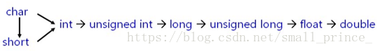
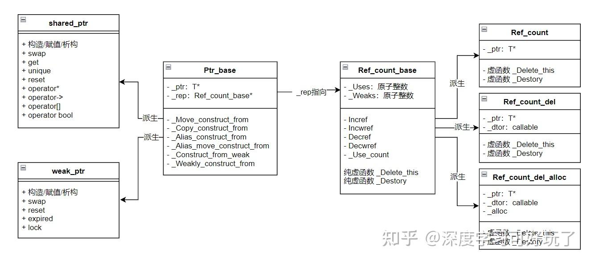

[（已完结）C++深度解析教程 - 目录 - 知乎 (zhihu.com)](https://zhuanlan.zhihu.com/p/653363420)

### 零散小知识

1. 函数声明：`int DemoConsoleOutput();`

   函数定义：`DemoConsoleOutput()`的具体实现

2. override：检查是否正确重写虚函数

   final：

   - ```c++
     class Base final {				// final 修饰类表示该类不能被继承
         // class definition
     };
     ```

   - ```c++
     class Base {
     public:
         virtual void foo() {}
     };
     class Derived final : public Base { 	// Derived类被final修饰，不能被继承
     public:
         void foo() final {} 						// foo函数被final修饰，不能在子类中被重写
     };
     ```

### C++14中的auto

C++11 引入的新功能 auto 让您能够定义这样的变量，即编译器将自动推断其类型，这简化了变量 声明，同时又不影响类型安全。C++14 将这种功能扩展到了返回类型

对于依赖于返回类型自动推断的函数，必须先定义（即实现）再调用。这是因为调用函 数时，编译器必须知道其返回类型。如果这种函数包含多条 return 语句，必须确保根据 它们推断出的返回类型都相同。另外，在递归调用后面，至少得有一条 return 语句。

### 数据溢出计算

以char为例，当char取最大值时，bit位：0111 1111，此时为127；当char取最小值时，bit位：1000 0000，此时为-128

综上，有符号数char为正数时，正常计算，为负数时，结果 = -(2^7 - 后七位数的正数值)，其他有符号整数同理

### C++11初始化列表？？？

> - 初始化列表的初始化方式总是先于构造函数完成的（实际在编译完成时就已经决定了)。

### 聚合类

[聚合类型与POD类型 - Jerry_SJTU - 博客园](https://www.cnblogs.com/jerry-fuyi/p/12854248.html)

> - 聚合类，可以简单当成 成员变量为public的POD类型
> - 不过聚合类的成员可以是非聚合类型。

### C++11列表初始化

[C++的花括号初始化就是用来匹配std::initializer_list构造函数的吗](https://github.com/Mq-b/Loser-HomeWork/discussions/207)

[列表初始化及decltype_列表初始化类中的结构体-CSDN博客](https://blog.csdn.net/wh9109/article/details/133104216)

[【C++从练气到飞升】24--C++11：列表初始化 | 声明 | STL的升级-CSDN博客](https://blog.csdn.net/m0_68662723/article/details/142185423)

#### C++98中的初始化

在C++11之前，初始化对象的方式有多种，包括：

1. 直接初始化：`Type variable(value);`

2. 拷贝初始化：`Type variable = value;`

3. 聚合初始化：`Type variable{value};` 或 `Type variable = {value};`（C++11起叫列表初始化）

4. 默认初始化：`Type variable;`

这些初始化方式依赖于其具体类型

- 基础类型，可以使用拷贝初始化

  ```c++
  int a = 42;
  double b = 1.2;
  ```

- 类类型，在其只有一个参数，且没有声明`explict`的情况下，也可以使用拷贝初始化

  ```c++
  class foo
  {
    int a_;
  public:
    foo(int a):a_(a) {}
  };
  foo f1 = 42;		// 存在隐式转换
  ```

- 非聚合类，可以使用直接初始化，对于不需要参数的则不能添加括号，否则编译器会认为是函数声明。

  ```c++
  foo f1;           // 默认初始化
  foo f2(42, 1.2);
  foo f3(42);
  foo f4();         // 识别为函数声明
  ```

- 聚合类可以使用列表初始化

  ```c++
  struct bar{
  	int a;
  	double b;
  };
  
  bar b = {42, 1.2};
  int a[] = {1, 2, 3, 4, 5};
  ```

- 除了以上初始化方式之外，对于标准容器来说，都是先声明一个对象，然后通过插入的方式进行初始化，不过，std::vector是个例外，其可以从先前使用了聚合初始化的数组分配，如下：

  ```c++
  int arr[] = {1, 2, 3, 4, 5}; // 使用聚合初始化初始化的数组
  
  std::vector<int> vec(std::begin(arr), std::end(arr)); // 使用数组的值初始化 std::vector
  ```

#### C++11列表初始化

在上节中，我们看到在C++11之前有多种初始化方式，开发人员往往需要对每种的场景都需要了解，以防止性能损失或者编译错误，正是为了解决这个问题，自C++11起，引入了统一初始化（**Uniform initialization**），或者叫列表初始化（**List initialization**）。

- 定义：

  列表初始化，用{}方式进行初始化，如下：

  ```c++
  T object {other};   
  T object = {other}; 
  ```

- 分类：

  [列表初始化 (C++11 起) - cppreference.com](https://zh.cppreference.com/w/cpp/language/list_initialization)

  - 直接列表初始化

    **重载决议时会考虑 explicit 和非 explicit 构造函数，且两者都能调用**

    ```c++
    T 对象{ 实参1, 实参2, ... };
    
    T { 实参1, 实参2, ... };				// 使用列表初始化构造临时对象
    
    new T{ 实参1, 实参2, ... };
    
    类 { T 成员{ 实参1, 实参2, ... }; };		// 在类中使用列表初始化来初始化非静态成员变量
    
    类::类() : 成员{ 实参1, 实参2, ... } {...	// 在初始化列表中使用列表初始化
    ```

  - 拷贝列表初始化

    **重载决议时会考虑 explicit 和非 explicit 构造函数，但只能调用非 explicit 构造函数**

    ```c++
    T 对象 = { 实参1, 实参2, ... };			// 会发生隐式转换
    
    // 函数调用表达式中，以花括号包围的初始化器列表作为实参，以列表初始化对函数形参进行初始化
    // 会优先匹配形参为 initializer_list<> 的函数（前提是 {pram_list} 可以转换为initializer_list<>）
    // 如 {1,2,3,4} 就无法转换为 initializer_list<string>
    函数 ({ 实参1, 实参2, ... });				
    
    return { 实参1, 实参2, ... };
    
    // 在具有用户定义的 operator[] 的下标表达式中，以列表初始化对重载运算符的形参进行初始化
    对象 [{ 实参1, 实参2, ... }];
    
    // 构造函数调用，其中花括号包围的初始化器列表用作构造函数实参。以复制初始化对构造函数的形参初始化（注意：此例中的类型 U 不是被列表初始化的类型；但 U 的构造函数的形参是）
    U ({ 实参1, 实参2, ... });
    
    // 在类中使用拷贝列表初始化来初始化非静态成员变量
    类 { T 成员 = { 实参1, 实参2, ... }; };
    ```

    注意：

    **按照c++11标准规定，拷贝列表初始化会先调用普通构造函数，然后再调用拷贝或者移动构造函数，不过编译器有自己的优化，所以具体实现有所不同**

    ```c++
    struct test{
        test(){cout << "init \n"; }
        test(test& t){cout << "test&" << endl;}
        test(test&& t){cout << "test&&" << endl;}
    };
    
    int main(){
        test t1 = {};		// 复制列表初始化
        cout << "---" << endl;
        test t2 = test{};	// 复制初始化
    }
    // stdc++11 -fno-elide-constructors
    // c++17后有复制消除，故体现不出差别
    /*
    init 
    ---
    init 
    test&&
    */
    ```

    注意：

    - 复制列表初始化和复制初始化是两个不同概念

      ```c++
      struct test{
          test(test&& t){cout << "test&&" << endl;}
          test(int i){cout << "i" << endl;}
      };
      
      int main(){
          test t2 = 1;	// 复制初始化
          cout << "---" << endl;
          test t3 = {1};	// 复制列表初始化
      }
      /*
      i
      test&&
      ---
      i
      */
      ```

  - 聚合初始化

    列表初始化的一种形式，当该类为聚合体时，就是聚合初始化

    ```c++
    T 对象 = { 实参1, 实参2, ... };
    
    T 对象 { 实参1, 实参2, ... };
    ```

- 示例：

  - 直接列表初始化

    ```c++
    struct test{
        test(int a, int b) : _a{a}, _b{b}{
            _a = 3;
            _b = 4;		// 注意各初始化的优先级：a, b先是1, 2；随后被更新为2, 3；最后变成3，4
        }
        int _a{1};
        int _b{2};
    };
    
    int main(){
        test a{2, 3};
    }

  - 拷贝列表初始化

    当以下多参构造函数用`explict`修饰时，所有拷贝列表初始化均编译错误，因为只能调用非 explicit 构造函数

    ```c++
    struct test{
        test(int a, int b){ }
        
        // 拷贝列表初始化
        int _a = {1};
        int _b = {2};
    };
    
    test func(test t) {
        // todo...
        return {1, 2};
    }
    
    int main(){
        test t1 = func({1, 2});	// 此处发生了两次拷贝列表初始化，一次移动构造
    }
    ```

    解释：

    - 之所以此处只发生一次移动构造，是因为`return {1, 2};`时，返回值的临时对象由*拷贝列表初始化*调用有参构造函数进行初始化，而不是由局部变量初始化。

    - 在`func()`定义如下时，发生两次有参构造，两次移动构造

      ```c++
      // case 1
      test func(test t) {
          return test{1, 2};
      }
      
      // case 2
      test func(test t) {
          test t2 = {1, 2};
          return t2;
      }
      ```
      
      注意当使用t2构造返回值的临时对象时，是调用的移动构造，因为标准规定return时，需要把t2当成右值来看待

#### 列表初始化的细节

- `{param_list}`的名字，类型：

  `{param_list}`该叫什么？ 我们应该称它为**花括号初始化器列表**

  括号初始化器列表**不是表达式**，**因此它没有类型**，**即`decltype({1,2})`非良构，**没有类型意味着模板类型推导无法推导出与花括号初始化器列表相匹配的类型，因此给定声明`template<class T>void f(T);`则表达式`f({1, 2, 3})`**非良构。**

  对于`auto`而言，在复制列表初始化中将任何*花括号初始化器列表*均推导为`std::initializer_list`

  ```c++
  auto p = { 1,2,3,4,5,6 };//复制列表初始化将花括号初始化器列表推导为std::initializer_list
  auto p2  { 1,2,3,4,5,6 };//无法推导
  ```

- 防止缩窄转换：

  ```c++
  int main() {
      int a = 3;
      bool b = a;		// 编译通过，但此时已经发生了类型收窄，可能这不是我们想要的
      bool b1 = {a};	// 编译失败，检测到发生了类型收窄
      
  //	解决办法：显式转换
      bool b2 = {static_cast<bool>(a)};
  };
  ```

- 初始化方式：

  这里使用直接初始化做例子，其他初始化方式同理

  ```c++
  struct test{
      test(){ }
      test(string a, int b){ }
      test(initializer_list<int> il){ }
      test(test&& t){ }
  };
  
  int main(){
      // 只能匹配有参构造函数
      test t();		// 识别为函数声明
      test t1(2, 4);	// ERROR
      test t2("2", 4);// OK
  
      // 只要可以隐式转换，就优先匹配 参数为initlizer_list<>的构造函数
      test t3{};		// 默认构造
      test t4{2, 4};
      test t5{"2", 4};
  
      // 花括号初始化器列表用作构造函数实参。以复制初始化对构造函数的形参初始化
      // 注意：此例中的类型 test 不是被列表初始化的类型；但 test 的构造函数的形参是
      test t6({});		// 先构造initializer_list临时对象，然后构造test
      test t7({2, 4});    // 同上
      test t8({"2", 4});  // 先构造test临时对象，然后移动构造test
  }
  ```

- 重载决议：

  当进行列表初始化时，如果类中既有 参数为`initlizer_list<>`的构造函数，又有 单参/多参构造函数：

  - 重载决议会优先匹配 参数为`initlizer_list<>`的构造函数

  - 如果匹配不上 参数为`initlizer_list<>`的构造函数，则会拆分`initializer_list<>`，去匹配有相同参数个数，相同参数类型的构造函数。

  - 如果构造函数被explicit修饰，不论时直接列表初始化还是拷贝列表初始化，都会忽略explicit进行重载决议；如果最终绑定的是explicit修饰的构造函数，则使用**拷贝列表初始化**编译失败

    ```c++
    struct test{
        test(int a, int b){ }
        explicit test( initializer_list<int> il ){ }
    };
    
    int main(){
        // 以下两种列表初始化都绑定的是explicit修饰的构造函数
        test t1{1, 2};		// OK
        test t2 = {1, 2};	// 编译失败
    }
    ```

- 类模板形参推导（C++17起）

  **当从类型为当前，或者说正在构造的类模板的特化或特化子级的 单个元素 进行初始化时，复制构造函数优先于列表构造函数。**

  ```c++
  template<typename T>
  struct Test {
      Test() {}
      Test(std::initializer_list<T> il) { cout << "被调用: " << typeid(T).name() << endl; }
      Test(const Test<T>& t) { cout << "复制构造"  << typeid(T).name() << endl; }
  };
  
  template<typename T>
  Test(std::initializer_list<T>) -> Test<T>;
  
  int main() {
      Test<int> a;
      Test t{ a,a };		//被调用         T会推导为Test<int>
      Test t2{ a };		//复制构造       T会推导为int
      
  //	如果希望 Test t2{ a }; 中T被推导为Test<int>, 需要以下做法
      Test t3({ a });		//被调用         T会推导为Test<int>
  }

#### 类型收窄


类型收窄一般是指一些可以使得数据变化或者精度丢失的隐式类型转换。可能导致类型收窄的典型情况
如下:

- 从浮点数隐式地转化为整型数。比如:int a=1.2，这里a实际保存的值为整数1，可以视为类型收窄。

- 从高精度的浮点数转为低精度的浮点数，比如从 long double 隐式地转化为double，或
从double 转为float。如果这些转换导致精度降低，都可以视为类型收窄。

- 从整型（或者非强类型的枚举）转化为浮点型，如果整型数大到浮点数无法精确表示，则也可以视为类型收窄。


- 从整型（或者非强类型的枚举）转化为较低长度的整型，比如:unsigned char=1024，
1024明显不能被一般长度为8位的unsigned char所容纳，所以也可以视为类型收窄。

C++11中，使用初始化列表进行初始化的数据编译器是会检查其是否发生类型收窄的

```c++
int main()
{
	const int x = 1024;
	const int y = 10;

	char a = x;						// 收窄，但可以通过编译
	char* b = new char(1024);		// 收窄，但可以通过编译

	char c = { x };					// 收窄，无法通过编译
	char d = { y };					// 可以通过编译
	unsigned char e{ -1 };			// 收窄，无法通过编译

	float f{ 7 };					// 可以通过编译
	int g{ 2.0f };					// 收窄，无法通过编译
	float* h = new float{ 1e48 };	// 收窄，无法通过编译
	float i = 1.21;					// 可以通过编译

	return 0;
}
```

注意：

- 只有进行常量初始化的时候发生收窄，才会编译报错，这很好理解

### 、、、decltype

[C++11特性：decltype关键字 - melonstreet - 博客园 (cnblogs.com)](https://www.cnblogs.com/QG-whz/p/4952980.html)

[C++ decltype用法详解-CSDN博客](https://blog.csdn.net/qq_38196982/article/details/118578967)

### C++11 constexpr 关键字

[#decltype](../2-深入理解C++11/深入理解C++11.md/#decltype)

### 左值引用和右值引用

[引用声明 - cppreference.cn - C++参考手册](https://cppreference.cn/w/cpp/language/reference)

左值与右值这两个概念是从 C 中传承而来的，左值指既能够出现在等号左边，也能出现在等号右边的变量；右值则是只能出现在等号右边的变量。

使用场景：**当函数返回了一个函数内部定义的临时变量时，可以用右值引用接收**

- **左值引用只能绑定左值**

  作用：左值引用可以用于别名现有对象（可以使用不同的 cv 限定）

```c++
int a1 = 10;
int& a2 = 10;// 编译错误：非常量左值引用
int& a2 = a1;//编译正确，左值引用可以接受左值
```

- **常量左值引用既可以接收左值，也可以接收右值**

```c++
	int& a = 7;//编译报错：非常量左值引用
	const int& a = 7;//编译正确，常量左值引用可以接收右值
	const int& b = a;//编译正确，常量左值引用可以接收左值
	//常量左值引用可以绑定右值是一条非常棒的特性，但是也存在一个缺点————常量性，一旦使用常量左值引用，表示我们无法在函数内修改该对象的内容（强制类型转换除外），所以需要另一个特性帮助我们完成工作，即右值引用。
```

- **右值引用只能绑定右值，或者通过std::move()绑定左值**

  作用：右值引用可以用于[延长临时对象的生命周期](https://cppreference.cn/w/cpp/language/reference_initialization#Lifetime_of_a_temporary)（请注意，常量左值引用也可以延长临时对象的生命周期，但不能通过它们进行修改）
  
  右值引用既可以作为左值，也可以作为右值，当右值引用有名字的时候为左值：`int&& a = 3;`此时a为左值；右值引用没名字的时候为右值：`move()`的返回值为右值引用，此时右值引用为右值，因此该返回值只能被右值引用接收；

```c++
	int i = 0;
	int& j = i;		//左值引用
	int&& k = 11;	//右值引用
	//上述代码中，k是一个右值引用，如果用k引用i，会引起编译错误，右值引用的特点是可以延长右值的生命周期，对于11，理解可能不是很深，请看下面代码
```

```c++
class X{
public:
    X(){}
    X(const X& x){}
    ~X(){}
    void show(){cout<<"show"<<endl;}
};
X make_x(){
    X x1;
    return x1;
}
int main(){
#ifdef 0
    //对于该段代码，一共发生了三次拷贝构造
    //第一次是函数中创建x1，第二次是通过x1创建返回值临时对象，第三次是通过返回值临时对象创建x2
    X x2(make_x());
    x2.show();					//此处是通过make_x()的返回值又构建了一个x2，调用了x2的拷贝构造函数
#endif
    //使用右值引用，只需2次拷贝构造即可实现同样功能
    //第一次是通过默认构造来构造x1，第二次是通过x1移动构造返回值临时对象，然后被x2引用该返回值临时对象，没有发生构造
    X&& x2 = make_x();
    x2.show();					// 此时x2就是make_x()的返回值，x2延长了返回值的生命周期。
}
```

特别强调：

1. 在开启NRVO或者c++17及以上时，只有一次构造

2. x2绑定的不是x1，而是`X make_x()`的返回值，也就是说x2延长的是返回值的生命周期（不考虑NRVO）。

### 引用与临时对象的生命周期

[引用初始化 - cppreference.cn - C++参考手册](https://cppreference.cn/w/cpp/language/reference_initialization)

- 通用规则：

  当一个引用（const T& 或 T&&）**直接绑定**到一个临时对象上时，这个临时对象的生命周期会被延长，直到该引用离开其作用域。

- 例外一：函数的返回值

  > 绑定到 return 语句中函数的返回值的临时对象不会延长：它会在返回表达式的末尾立即销毁。 这样的 return 语句始终返回悬空引用。

  **释义**: 函数体内的任何局部对象的生命周期都严格限制在函数的作用域内。当函数执行完毕后，其栈帧上的所有内容都会被销毁。

  ```c++
  const std::string& get_error_string() {
      return std::string("Error");
  } // 临时对象在此处被销毁
  
  int main() {
      const std::string& ref = get_error_string();
  
      std::cout << ref << std::endl;	// UB!
  }
  ```

  解释：

  - ref是返回值的引用，但是返回值也是一个引用，它引用的是一个局部变量

  - 正确做法如下：

    ```c++
    std::string get_correct_string() {
        return std::string("OK"); 
    }
    ```

- 例外二：函数调用的实参

  >绑定到函数调用中引用参数的临时对象存在到包含该函数调用的完整表达式的末尾：如果函数返回的引用比完整表达式寿命更长，它将变成悬空引用。

  解释：在函数调用中，为函数形参绑定的临时对象，其生命周期只持续到包含该函数调用的**完整表达式**结束为止，而不会被函数内部的引用参数延长。

  ```c++
  #include <string>
  #include <iostream>
  
  void print_and_store(const std::string& s, const std::string** storage) {
      std::cout << "Inside function: " << s << std::endl;
      // 危险操作：在函数外部存储一个指向参数 s 的指针
      *storage = &s; 
  }
  
  int main() {
      const std::string* dangling_ptr = nullptr;
  
      // 完整表达式是 print_and_store(...) 这一整句
      print_and_store(std::string("Temporary"), &dangling_ptr);
  
      // 未定义行为！dangling_ptr 指向的内存已经无效
      std::cout << "Outside function: " << *dangling_ptr << std::endl; 
  }
  ```

- 例外三：构造函数初始化列表

  > 在 [CWG 问题 1696](https://cplusplus.github.io/CWG/issues/1696.html) 解决之前，允许临时对象绑定到构造函数[初始化列表](https://cppreference.cn/w/cpp/language/initializer_list)中的引用成员，并且它仅持续到构造函数退出，而不是与对象存在的时间一样长。 自 [CWG 1696](https://cplusplus.github.io/CWG/issues/1696.html) 以来，这种初始化是非良构的，尽管许多编译器仍然支持它（一个值得注意的例外是 clang）。

  解释：在构造函数的成员初始化列表中，如果一个引用成员绑定到了一个临时对象，该临时对象的生命周期**只持续到构造函数执行完毕**，而不会延长到和新创建的对象生命周期一样长。

  ```c++
  #include <string>
  #include <iostream>
  
  struct Widget {
      const int& ref; // 引用成员
  
      // 构造函数：ref 绑定到了参数 r
      Widget(const int& r) : ref(r) {
          std::cout << "Constructor: ref is '" << ref << "'" << std::endl;
      }
  };
  
  int main() {
      Widget w(10);
  
      // 未定义行为！w.ref 现在是一个悬垂引用
      std::cout << "After construction: ref is '" << w.ref << "'" << std::endl;
  }
  ```

  解释：

  - 在构造函数执行期间，ref 是有效的，但是当构造函数结束后，临时对象被销毁，也就是说临时对象的生命周期只被r延长了，没有被ref延长。

- 例外四：绑定到临时对象的成员

  解释：当一个引用绑定到临时对象的成员（子对象）时，**生命周期延长规则只适用于引用直接绑定到临时对象或子对象本身**。

  ```c++
  #include <string>
  #include <utility>
  #include <iostream>
  
  class Widget {
  public:
      std::string name;
      std::string&& get_name() { return std::move(name); }
  };
  Widget create_widget() { return Widget{"MyWidget"}; }
  
  int main() {
      std::string&& n1 = Widget{"MyWidget"}.name;			// ok
      std::string&& n2 = create_widget().name;			// ok
      std::string&& n3 = create_widget().get_name();		// 悬空引用
      std::string&& n4 = Widget{"MyWidget"}.get_name();	// 悬空引用
  }
  ```

  解释：

  - 根据文档，临时对象的子对象是：

    形式为 e.m 的[类成员访问表达式](https://cppreference.cn/w/cpp/language/operator_member_access#Built-in_member_access_operators)，其中 e 是这些表达式之一，并且 m 指定对象类型的非静态数据成员

    其他的先不谈，不重要。

  - 对于 n1 和 n2 而言，`Widget{"MyWidget"}.name` 和 `create_widget().name`都满足临时对象的子对象的形式，所以适用于生命周期延长规则
  - 对于 n3 和 n4 而言，不满足e.m的格式，所以参考例外一。

- 总结一下：

  > **临时对象**（仅考虑const T&，T&&，不考虑T&）的生命周期不能通过 “传递” 来进一步延长：从临时对象绑定的引用变量或数据成员初始化的第二个引用不会影响其生命周期。

  解释：通常情况下，一个临时对象的生命周期不能通过“传递”它来进一步延长。如果一个临时对象已经绑定到了一个引用上（我们称之为ref_1），那么你再用ref_1去初始化第二个引用（ref_2），这个临时对象的生命周期**不会**因为ref_2的存在而有任何改变。它的生命周期仍然只和**第一个**引用ref_1绑定。

  举个例子：对于上面例外四中的n3和n4，我们可以把`get_name()`的返回值类型改为`std::string`，这样n3和n4就会作为接收name的第一个引用，从而根据例外一的规则正确延长name的生命周期

### 返回值中的左值/右值引用

```c++
int& f() {
    int a = 1;
    return a;//不要返回局部变量的引用，因为：局部变量 'a'的地址可能转义该函数
}

int& f1() {
    int* p = new int(1);
    return *p; // 返回动态分配内存的引用，或者返回一个全局变量之类，可以避免悬空引用
}

int&& f2() {
    int a = 1;
    return move(a);	// 返回值为右值引用时，只能返回一个右值，但此处代码造成了悬空引用
}

int f3() {
    int a = 1;
    return a;
}
```

注意：

- **当返回值为左值引用时，仅能返回左值；当返回值为右值引用时，仅能返回右值**

- 左值引用是引用，右值引用也是引用（**引用本质上是一个对象的别名。它不拥有自己的内存，而是绑定到另一个已经存在的对象上**）。所以他们作为返回值类型时返回的是我们指定的返回值的别名，所以都需要小心悬空引用（`f2()`就是一个经典的悬空引用）

- 对于`int& f()`：返回了局部变量的引用，显然这是一个悬空引用

- 对于`int& f1()`：使用该函数显然没问题，但调用者显然无法知道该引用需要delete，所以会造成内存泄漏

- 对于`int&& f2()`：同样，返回了局部变量的引用，是一个悬空引用

- 当函数返回值为左值引用时，可以访问或修改对象的内部状态，或者可以实现链式调用

  ```c++
  class MyArray {
  private:
      int data[10];
  public:
      int& at(size_t index) {
          return data[index];
      }
  
      const int& at(size_t index) const {
          return data[index];
      }
  };
  
  int main() {
      MyArray arr;
      arr.at(5) = 100; // 正确：通过返回的引用修改了内部成员 data[5]
      const MyArray carr;
      int value = carr.at(5); // 正确：通过返回的引用读取内部成员
      // carr.at(5) = 200; // 编译错误！不能修改 const 对象
  }
  ```

- 当函数返回值为右值引用时，通常是调用`std::move()`，进行资源的移动，如果想延长临时对象的生命周期，直接使用右值引用接收就可以了，不用专门搞一个返回值为右值引用的函数。

[C++表达式的类型与值类别详解-CSDN博客](https://blog.csdn.net/m0_62327743/article/details/134178090)

### std::move

[一文读懂C++右值引用和std::move - 知乎 (zhihu.com)](https://zhuanlan.zhihu.com/p/335994370)

- <font color=red>std::move就是将左值转为右值。</font>这样就可以重载到移动构造函数了，移动构造函数将指针赋值一下就好了，不用深拷贝了，提高性能

- 使用场景：**可移动对象在<需要拷贝且被拷贝者之后不再被需要>的场景，建议使用**`std::move`**触发移动语义，提升性能。**

```cpp
class Array {
public:
    ......
 
    // 优雅
    Array(Array&& temp_array) {
        data_ = temp_array.data_;
        size_ = temp_array.size_;
        // 为防止temp_array析构时delete data，提前置空其data_      
        temp_array.data_ = nullptr;
    }
    
public:
    int *data_;
    int size_;
};
```

如何使用：

```cpp
// 例1：Array用法
int main(){
    Array a;
 
    // 做一些操作
    .....
     
    // 左值a，用std::move转化为右值
    Array b(std::move(a));
}
```

- 注意：`std::move`本身移动不了什么，唯一的功能是把左值强制转换成右值，实现等同于一个类型转换：`static_cast<T&&>(lvalue)`，所以单纯的`std::move(xxx)`不会有性能提升，**通常使用`std::move`结合类的构造函数实现移动语义或者通过右值引用延长返回值生命周期**。

```C++
int &&ref_a = 5;
ref_a = 6; 
 
// 等同于以下代码：
 
int temp = 5;
int &&ref_a = std::move(temp);	// 相当于int &&ref_a = static_cast<int&&>(temp);
ref_a = 6;
```

### C++中的运算符

- 逻辑运算符：`!`，`&&`，`||`

- 按位运算符：按位运算符返回的并非布尔值，而是对操作数对应位执行指定运算的结果

  - NOT（～）、AND（&）、OR（ | ）和 XOR（^）

    ```c++
    #include <iostream> 
    #include <bitset> 
    using namespace std; 
     
    int main() 
    { 
    	cout << "Enter a number (0 - 255): "; 
        unsigned short inputNum = 0; 
        cin >> inputNum;  
     
        bitset<8> bitwiseNOT = (~inputNum); 
        cout << "~" << inputBits << " = " << bitwiseNOT << endl;// 以二进制输出按位非的结果
     
        bitset<8> bitwiseAND = (0x0F & inputNum);// 0x0F is hex for 0001111 
        cout << "0001111 & " << inputBits << " = " << bitwiseAND << endl;
        
        return 0;
    }
    ```

  - 按位右移运算符（>>）和左移运算符（<<）

    移位运算符将整个位序列向左或向右移动，其用途之一是将数据乘以或除以 2^n 。
    下面的移位运算符使用示例将变量乘以 2：
    `int doubledValue = num << 1; // shift bits one position left to double value`

    下面的的移位运算符使用示例将变量除以 2：
    `int halvedValue = num >> 1; // shift bits one position right to halve value `

### C++指针


### C++只在栈或堆上实例化对象

[C++只在栈或堆上实例化对象_c++如何实现只在栈上实例化对象?-CSDN博客](https://blog.csdn.net/qq_36652619/article/details/100748669)

[如何定义一个只能在堆/栈上生成对象的类？ - JemmyZhong - 博客园 (cnblogs.com)](https://www.cnblogs.com/jemmyzhong/p/14584743.html)

- 只能在栈上分配类对象

  ```c++
  class A{
  private:
      void* operator new(size_t t){}			// 私有化new操作符
      void operator delete(void* ptr){}	  // 私有化delete操作符
  public:
      A(){}
      ~A(){}
  };
  
   int main()
   {
  	 A* a = new(A);		// 编译失败：函数 "A::operator new" 不可访问
  	 delete a;				// 编译失败：函数 "A::operator delete" 不可访问
       return 0;
   }
  ```

- 只能在堆上实例化对象

  - new的实现过程是：首先调用名为**operator new**的标准库函数，分配足够大的原始为类型化的内存，以保存指定类型的一个对象；接下来运行该类型的一个**构造函数**，用指定初始化构造对象；最后返回指向新分配并构造后的的对象的指针

  - delete的实现过程：对指针指向的对象运行适当的**析构函数**；然后通过调用名为**operator delete** 的标准库函数释放该对象所用内存

  - 由上，为了保证可以在创建对象的时候可以正常使用` operate new`，考虑析构函数的私有化。因在栈上实例化对象之后，对象使用完毕之后自动调用析构函数，而new对象后，要手动调用delete函数才能执行对象的析构函数。

    所以当析构函数被私有化之后，若在栈上实例化对象，编译器先会检查该对象的析构函数是否可用，如果不可用，则会报错。在堆上释放对象时，若不调用delete就不会发现析构函数不可访问。

    这就会引发另外一个问题，使用new操作符在堆上实例化的对象要怎么析构呢？解决办法就是，在类中自定义一个公有函数用来销毁对象，该函数调用delete操作符，这样就可以使用该函数销毁对象而不是直接使用delete操作符了。

  ```c++
  class A{
  public:
      A(){}
      void destroy(){delete this;}
  private:
      ~A(){}
  };
  
  int main()
  {
  	A* a = new(A);	 
  	a->destroy();
  
  	A b;					// 编译错误，因为在栈上创建
      return 0;
  }
  ```

  - 但是上面这种方法由于析构函数的私有化导致无法实现类的继承和多态，所以改进方法如下

    ```c++
    class person
    {
    public:
    	static person* create()
    	{
    		return new person();
    	}
    	void destroy()
    	{
    		delete this;//首先会调用析构函数，在调用free释放空间
    	}
    	virtual void func()
    	{
    		cout << "test person" << endl;
    	}
    protected:		// 构造，析构函数设为protected，保证外界无法访问
        // 1.父子类的函数可以构成重写，从而实现多态。
    	// 2.父子类的对象可以正常释放，只不过父类的对象需要调用特定的destroy函数来释放对象。
    	// 3.当父类指针指向之类对象时，可以动态的释放掉子类的对象，而不是父类的对象。
    	person()
    	{
    		cout << "person()" << endl;
    	}
    	virtual ~person()
    	{
    		cout << "~person()" << endl;
    	}
    	
    };
    int main()
    {
    	person* ptr = person::create();
    	ptr->destroy();
    	return 0;
    }
    
    ```

### Union关键字

[【C++学习笔记】Union关键字](https://www.cnblogs.com/yyehl/p/6652928.html)

```c++
#include <iostream>
#include <bitset>
#include <string>
using namespace std;

union number
{ /*定义一个联合*/
	int i;
	struct
	{ /*在联合中定义一个结构*/
		char first;
		char second;
	}half;
}num;

void main()
{
	num.i = 0x00004241; /*联合成员赋值*/
	cout << num.half.first << num.half.second << endl; // res: AB
	num.half.first = 'a'; /*联合中结构成员赋值*/
	num.half.second = 'b';
	cout << hex << num.i << endl;									// res: 6261
}
```

#### 联合体的妙用

- 查看类成员函数的地址

  ```c++
  #include <iostream>
  using namespace std;
  
  template<typename src_type>
  void* union_cast(src_type src)
  {
  	union {
  		src_type src;
  		void* dst;
  	}u;
  	u.src = src;
  	return u.dst;
  }
  
  class A
  {
  public:
  	void (A::* p1)();	// 此时p1是个成员变量
  	void (*p2)();
  
  	void test() { }		// test是个函数地址
  	virtual void virtest() { }
      virtual void virtest2() { }
  	static void stattest() { }
  
  	A() {
  		//取类成员函数地址时：①记得加&；②记得加上范围限定符
  		p1 = &A::test;		// 将函数地址赋给成员变量
  		p1 = &A::virtest;
  		p2 = &A::stattest;
  	}
  };
  
  int main() {
  	A a;
  //	p1为成员变量，需要用实例化对象进行访问，所以a.p1表示访问该成员变量（即函数地址）
  //	由于a.p1指向的是非静态成员函数，所以要通过实例化对象用 .* 进行访问
  	(a.*a.p1)();
  
  //	静态成员函数不用传this，所以较为简单
  	(*a.p2)();
  
  //	如果想访问类成员函数的地址，需要用到我的union_cast函数
  	void* pf1 = union_cast(a.p1);
  	void* pf2 = union_cast(&A::virtest2);
  
  	return 1;
  }
  ```

  注意：

  - 在msvc中，虚函数有具体的地址，且在debug模式下，虚函数表空间中虚函数与虚函数的地址之间还有其他内容；但在release模式下，是标准的8字节。而在mingw中，虚函数为偏移量，且不论在debug还是release模式下，虚函数地址之间的间隔都是8字节。

- 判断系统的大小端序

  将**低位字节存储在起始地址（低地址）**，这称为小端(little-endian)字节序（低位存储低字节）；

  将**高位字节存储在起始地址**，这称为大端(big-endian)字节序（低位存储高字节）。

  ```c++
  int main() {
  	union{
  		int i;
  		char c;
  	};
      // 左边是高位，右边是低位
  	i = 0x01020304;
  	// c为04表示低位存储在起始地址，是小端序
  	printf("%d", c);// 注意转换成int
  }
  ```

  注意：

  - **字符串在网络中传输时，不需要注意字节序的问题**，因为字符串相当于一个字符数组，转换成大端序后：①字符只占一个字节，不会变；②数组中各个字符之间的顺序，不会变。所以不需要注意字节序的问题。
  - 但如果是int，就会变。

- 访问类中的私有变量

  ```c++
  class X {
  public:
  	X() { cout << "1" << endl; }
  	X(const X&& x) { cout << "2" << endl; }
  	~X() {}
  	//virtual void show() { cout << "show" << endl; }
  private:
  	int i = 100;
  };
  
  int main() {
  	X x;
  	union U
  	{
  	public:
  		int i;
  		X x;
          //因为X为非POD类型，所以要自定义union的构造函数并使用 placement new 构造X
  		U() { new(&x) X; }
  		~U() { x.~X(); }
  	}u;
  	cout << u.i << endl;
  
  	system("pause");
  }
  ```

### C++constexpr

[C++11关键字constexpr看这篇就够了-CSDN博客](https://blog.csdn.net/yao_hou/article/details/109301290)

https://zhuanlan.zhihu.com/p/20206577

### 、、、在派生类中隐藏基类的方法


### 切除问题


### 、、、私有继承，保护继承，公开继承

[private继承的特点和意义以及何时使用](https://blog.csdn.net/realdonaldtrump/article/details/78289483#)

[Private Inheritance(what, where) ](https://www.cnblogs.com/CHYGO/articles/1901770.html)

```c++
// 私有继承
#include <iostream>
#include <bitset>
#include <string>
using namespace std;

class A {
public:
	void test() {
		cout << "1" << endl;
	}
private:
	int a = 0;
};
// 私有/保护继承：父类作为子类的一部分实现内容
class B : private/protected A // 继承时，将A中所有的protected和public方法设为private/protected。注意，基类的private成员在子类中仍然不可访问
{
public:
	void testb() {
		test();
		a = 4;			// 编译错误：成员A::a不可访问
	}
};

void main()
{
	B b;
	b.testb();
	b.test();			// 编译错误：成员A::test不可访问，从外界来看，A是作为B的一部分实现内容
}
```

```c++
// 保护继承，参考承接上面代码，随着继承层次结构的加深，保护继承将与私有继承有些不同
class C : B		// 此时假设B私有继承A
{
public:
	void testc() {
		testb();			// 编译错误：成员A::test不可访问
		test();
	}
};

class C : B		// 此时假设B保护继承A
{
public:
	void testc() {
		testb();			// 编译正确：成员A::test在C中权限为protected
		test();
	}
};
```

由此看来，私有/保护继承从外界来看相当于“has-a”的关系，是将基类作为子类的一部分实现内容

而共有继承从外界来看相当于“is-a”的关系，子类是从父类中派生出来的类

### 虚继承

[#虚继承](../2-深入理解C++11/深入理解C++11.md/#虚继承实现原理)

### 虚函数，虚指针，虚函数表

虚表指针vptr跟虚函数密不可分，对于有虚函数或者继承于拥有虚函数的基类，对该类进行实例化时，在**构造函数执行时会对虚表指针进行初始化，并且存在对象内存布局的最前面（在继承的情况下，也是将虚表指针放在最前面）**
虚函数表（Virtual Function Table，VFT）位于C++内存模型中的**常量区**，可将虚函数表视为一个包含函数指针的静态数组，其中每个指针都指向相应的虚函数；而虚函数则位于C++内存模型中的**代码区**。

```c++
#include <iostream>
#include <bitset>
#include <string>
using namespace std;

class B
{
public:
	virtual void test() {
	}
	int a = 0;
};

class C {
public:
	void test1() {

	}
	int c = 0;
	int d = 0;
};

int main()
{
	B b;
	cout << &b << endl;			// 对象地址
	cout << &b.a << endl;		// 成员变量地址，与对象地址之间差了8个字节（被虚函数指针占用）

	C c;
	cout << &c << endl;
	cout << &c.c << endl;
	cout << &c.d << endl;

	cout << sizeof(&b) << endl;
	return 0;
}
```


[构造函数不能为虚函数的原因](https://blog.csdn.net/salmonwilliam/article/details/114259314#)

### 运算符重载

[c++基础梳理（九）：运算符重载 - 知乎 (zhihu.com)](https://zhuanlan.zhihu.com/p/636108068)

[运算符重载详解 -上](https://blog.csdn.net/Extreme_wei/article/details/130524717)

[【C++ | 重载运算符】一文弄懂C++运算符重载，怎样声明、定义运算符，重载为友元函数_c++ 重载-CSDN博客](https://blog.csdn.net/wkd_007/article/details/139860064)

- 根据返回的内容判断返回值用引用/非引用

  > 返回的内容是重载函数中定义的临时变量，则返回非引用
  >
  > 返回的内容是对象本身（this指针）
  >
  > - 返回值为引用：使用链式编程。eg：++(++OBJ_NAME)；OBJ_NAME = OBJ_1 = OBJ_2
  > - 返回值为非引用：不使用链式编程

- 后置--/++的伪参数能否用其他类型？

  > 不行，只能用int

- 二元操作符的参数传递理解

  > 两个参数，一个参数随对象通过this指针进行传递

- 运算符重载的两种方法

  > 使用成员函数重载
  >
  > 使用全局函数搭配friend关键字（访问类中的私有成员）进行重载

**运算符格式：**

```c++
返回值类型 operator 运算符(形参列表)	// 一般运算符重载都是搭配着类来使用，eg：++OBJECT_NAME
{
	...
}
```

#### operate<<：

> 流对象入参不能复制，只能引用
>
> 重载时只能声明为友元函数，因为要实现cout在左侧

```c++
class Person {
private:
    std::string name;
    int age;
public:
    Person(string name, int age) : name(name), age(age) {}
    // 声明友元函数，为实现cout在左侧，左移运算符重载只能使用友元函数实现
    friend ostream& operator<<(ostream& os, const Person& person);
};
// 流对象中不能复制，只能引用
ostream& operator<<(ostream& os, const Person& person) {
    os << "Name: " << person.name << ", Age: " << person.age;
    return os;
}
```

#### operate++（前置/后置）：

> 可以用右值引用接收后置++的返回值

```c++
#include<iostream>
#include<string>
using namespace std;
class myinteger {
	friend ostream& operator<<(ostream& cout, const myinteger&& myint);
	friend ostream& operator<<(ostream& cout, const myinteger& myint);
private:
	int mynum;
public:
	myinteger() : mynum(0){}
	// 前置++重载,
	// 前置++返回值有两种形式：①void（无法使用链式编程） ②引用
	myinteger& operator++() {
		mynum++;
		return *this;//返回自身用this
	}
	//后置++重载，
	//占位参数只能是int，不能是其他类型
	myinteger operator++(int) {//返回值只能是非引用，因为temp为临时对象，不过在外面可以通过右值引用来延长temp生命周期
		myinteger temp = *this;
		mynum++;
		return temp;
	}
};

//对于使用了后置++的类来说，传参时需要用右值引用来接收temp的临时对象
ostream& operator<<(ostream& cout, const myinteger&& myint) {
	cout<< myint.mynum;
	return cout;
}

// 对于非临时对象而言，直接使用左值引用即可
ostream& operator<<(ostream& cout, const myinteger& myint) {
	cout << myint.mynum;
	return cout;
}

int main() {
	myinteger myint;
	// 前置递增
	cout << ++(++myint) << endl;
	cout << myint << endl;
	// 后置递增
	cout << myint++ << endl;		// 调用的右值引用的那个重载函数
	cout << myint << endl;
	system("pause");
	return 0;
}
```

#### operate=：

为了实现链式编程，返回值应该使用引用

```c++
class myinteger {
private:
	int mynum;
public:
	myinteger() : mynum(0){}

	myinteger& operator=(const myinteger& myint) {
		if (this != &myint)// 如果两个对象的地址不相同那么就可以进行赋值
		{
			this->mynum = myint.mynum;
		}
		return *this;
	}
};
```

#### operate()：

[C++重载运算：函数调用运算符_重载函数调用运算符-CSDN博客](https://blog.csdn.net/no_O_ac/article/details/104672285)

> 如果类重载了函数调用运算符，则我们可以像使用函数一样使用该类的对象。因为这样的类同时也能存储状态，所以与普通函数想比它们更加灵活。

#### 类型转换运算符重载

- 普通类型 <==> 普通类型

  1. 标准数据类型之间会进行隐式类型安全转换
  2. 转换规则如下：

  

- 普通类型 ==> 类类型

  转换构造函数（不是拷贝构造函数，<font color=red>是只有一个参数的有参构造函数</font>）

  ```c++
  #include <iostream>
  #include <string>
  
  using namespace std;
  
  class Test
  {
  	int mValue;
  public:
  	Test() : mValue(0) {}
  	explicit Test(int i){		// 有参构造函数
  		mValue = i;
  	}
  
  	Test operator + (const Test& p){
  		Test tmpret(mValue + p.mValue);
  		return tmpret;
  	}
  
  	int value(){
  		return mValue;
  	}
  };
  
  int main()
  {
  	Test t1;
  	t1 = 10;  //Error 在 不使用explicit 且 有参构造中有且仅有一个参数时，t1=10正确
  	t1 = static_cast<Test>(10);    // t = Test(5);
  
  	Test r;
  	r = t1 + static_cast<Test>(5);   // r = t1 + Test(5);使用了 有参构造 和 operate+重载
  	cout << r.value() << endl;
  
  	return 0;
  }
  ```

- 类类型 ==> 普通类型

  函数原型：`operate Type();`

  >1. 类型转换运算符与一元有参构造函数具有同等的地位
  >
  >2. 使得编译器有能力将对象转化为基本数据类型
  >3. 编译器能够隐式的使用类型转换函数

  ```c++
  #include <iostream>
  #include <string>
  
  using namespace std;
  
  class Test
  {
  	int mValue;
  public:
  	Test(int i = 0) : mValue(i) { }
  	int value() { return mValue; }
  	operator int()
  	{
  		return mValue;
  	}
  };
  
  int main()
  {
  	Test t(100);
  	int i = t;			// 隐式调用了operate int()
  
  	cout << "t.value() = " << t.value() << endl;
  	cout << "i = " << i << endl;
  
  	return 0;
  }
  ```

- 类类型 <==> 类类型

  > 需要用explicit修饰一元有参构造
  >
  > 不过更好的办法是像qt那样将类类型转换函数定义成公共成员函数（str.toInt(); str.toDouble;）

  ```c++
  #include <iostream>
  #include <string>
  
  using namespace std;
  
  class Value
  {
  public:
  	Value(){}
  	Value(Test& t){
  		cout << "一元有参构造" << endl;
  	}
  };
  
  class Test
  {
  	int mValue;
  public:
  	Test(int i = 0) : mValue(1) {}
  	int toValue(){ return mValue; }	// 推荐
  	operator Value()		// 类型转换运算符重载，不推荐
  	{
  		Value ret;
  		cout << "operator Value()" << endl;
  		return ret;
  	}
  
  };
  
  int main()
  {
  	Test t(100);
  	Value v = t;	// 一元有参构造函数 和 类型转换运算符 发生冲突，编译器不知道应该调用哪个函数。因此发生了错误。
  					// 解决办法：将 一元有参构造 申明为explicit，这样隐式转换时会调用类型转换运算符
  	return 0;
  }
  ```

#### operator*和operator->及智能指针类的实现

[C++知识点43——解引用运算符和箭头运算符的重载及智能指针类的实现_重载解引用运算符-CSDN博客](https://blog.csdn.net/Master_Cui/article/details/109547953)

#### operate[]：

[C++重载[]（下标运算符）详解-CSDN博客](https://blog.csdn.net/ccc369639963/article/details/122874271)

>operate[ ]必须以成员函数的形式进行重载，格式如下
>
>```c++
>返回值类型& operator[ ] (参数);	// 表示对应元素可读可写
>const 返回值类型 & operator[ ] (参数) const;	// 表示对应元素只读，用于提供给常对象使用
>实际开发中两种形式都应该提供
>```

重载下标运算符“[ ]” 时，认为它是一个双目运算符，例如 X[Y] 可以看成：

```c++
[ ]-----双目运算符;
X-----左操作数;
Y-----右操作数。
也可以看成 X.operate[](Y);
```

```c++
#include <iostream>
using namespace std;
class Array {
public:
	Array(int length = 0) : m_length(length) {
		if (length == 0) {
			m_p = NULL;
		}
		else {
			m_p = new int[length];
		}
	}
	~Array(){ delete[] m_p; }
public:
	int& operator[](int i) {				// 重载operate[]
		return m_p[i];
	}
	const int& operator[](int i) const{		// 重载只读operate[]
		return m_p[i];
	}
public:
	int length() const { return m_length; }
private:
	int m_length;  //数组长度
	int* m_p;  //指向数组内存的指针
};

int main()
{
	Array objarr(1);
	cout << objarr[0] << endl;	// 调用operate[]

	const Array constobjarr(1);
	cout << constobjarr[0] << endl; //  调用只读operate[]
	return 0;
}
```

#### operate"" YourLiteral用户自定义字面量/自定义后缀操作符

> - 基础类型->类类型：①通过构造函数进行转换；②通过自定义字面量进行转换

[C++11 用户自定义字面量-CSDN博客](https://blog.csdn.net/K346K346/article/details/85322227)

函数原型：`ReturnType operator"" YourLiteral(ParmType value)`

> - 通过实现一个后缀操作符，将 申明了该后缀标识的字面量 转化为 需要的类型（一般时将const char* 或 unsigned long long 转换成对应类的对象）。
>
> - 合法的参数列表：
>
>   ```c++
>   const char *
>   unsigned long long
>   long double
>   const char *, size_t
>   const wchar_t *, size_t
>   const char16_t *, size_t
>   const char32_t *, size_t
>   ```
>
> - 显然需要定义成全局函数

```c++
#include<iostream>
#include<string>
using namespace std;
struct RGBA {
	uint8_t r, g, b, a;
	RGBA(uint8_t r, uint8_t g, uint8_t b, uint8_t a) :r(r), g(g), b(b), a(a) {}
};
// 自定义后缀操作符，将字符串常量转换成RGBA类对象，其中size表示字符串长度
RGBA operator"" _RGBA(const char* str, size_t size) {
	const char* r = nullptr;
	const char* g = nullptr;
	const char* b = nullptr;
	const char* a = nullptr;
	for (const char* p = str; p != str + size; ++p) {
		if (*p == 'r') r = p + 1;
		if (*p == 'g') g = p + 1;
		if (*p == 'b') b = p + 1;
		if (*p == 'a') a = p + 1;
	}
	if (r == nullptr || g == nullptr || b == nullptr) throw;
	if (a == nullptr) {
		return RGBA(atoi(r), atoi(g), atoi(b), 0);
	}
	else {
		return RGBA(atoi(r), atoi(g), atoi(b), atoi(a));
	}
}

// 输出运算符重载
ostream& operator<<(ostream& os, const RGBA& color) {
	return os << "r=" << (int)color.r << " g=" << (int)color.g << " b=" << (int)color.b << " a=" << (int)color.a << endl;
}

int main() {
	//自定义字面量来表示RGBA对象
	cout << "r255 g255 b255 a40"_RGBA << endl;// 这里先调用operate"" _RGBA，后调用operate<<

	system("pause");
	return 0;
}
```

### for_each()

[c++ for_each 用法_c++ foreach用法-CSDN博客](https://blog.csdn.net/u014613043/article/details/50619254)

### 、、、C++类型转换

[C++类型转换：隐式转换和显式转换_c++隐式转换-CSDN博客](https://blog.csdn.net/luolaihua2018/article/details/111996610)

[？？？先看标准文档：隐式转换 - cppreference.com](https://zh.cppreference.com/w/cpp/language/implicit_conversion)

[？？？好好看，C++隐式转换](https://www.cnblogs.com/apocelipes/p/14415033.html#)

- 引用绑定

  ```c++
  int a = 10;
  int& a1 = a;	// OK
  long &b = a;	// ERROR,无法从“int”转换为“long &”
  ```

  解释：

  1. 首先`a`进行标准隐式转换，转换结果的值类别是右值，左值引用无法绑定右值，所以报错。

- 安全bool

  ```c++
  template <typename T>
  struct SmartPointer {
      //...
      T *ptr = nullptr;
      operator bool() {
          return ptr != nullptr;
      }
  };
  
  auto ptr = SmartPointer<int>();
  if (ptr) {				// 1
      // ptr 是int*的包装，现在我们想取得ptr指向的值
      int value = ptr;	// 2
      // ...
  }
  ```

  - 解释：
    1. 表达式`ptr`可以按语境隐式转换到`bool`类型

    2. 表达式`ptr`可以按语境隐式转换到`bool`类型，`bool`类型通过标准转换序列转化为`int`
    
    3. 按语境隐式转换：
    
       以第一点为例，在`if`语境中，期待类型`bool`，在满足以下条件：
    
       - `SmartPointer<int>`拥有单个转换到`bool`类型的用户自定义转换函数，且
       - `ptr`可隐式转换到`bool`
    
       时，可以使用具有类类型`SmartPointer<int>`的表达式`ptr`，且我们称表达式 `ptr` *按语境隐式转换* 到指定的类型 `bool`（**注意，其中不考虑显式转换函数，虽然在按语境转换到 bool 时会考虑它们。**），第二点同理。
    
  - 解决办法：

    通过`explicit`把它踢出转换序列：

    ```c++
    template <typename T>
    struct SmartPointer {
        T *ptr = nullptr;
        explicit operator bool() {
            return ptr != nullptr;
        }
    };
    auto ptr = SmartPointer<int>();
    if (ptr) {					// 1
        // ptr 是int*的包装，现在我们想取得ptr指向的值
        int value = ptr;		// 2
        // ...
    }
    ```

    解释：

    1. ptr通过用户自定义转换函数，**按语境转换到bool**（在if语境中，期待类型`bool`，且声明`bool t(ptr)`良构，所以可以进行隐式转换，我们称表达式`ptr`按语境转换到`bool`）
    2. `ptr`无法隐式转换为`bool`，报错

- 两步用户定义转换

  ```c++
  struct A{
      A(const std::string &s): _s{s} {}
      std::string _s;
  };
   
  void func(const A &s)
  {
      std::cout << s._s << std::endl;
  }
   
  int main()
  {
      func("test");	// _1
  }
  ```

  解释：

  1. 标准的隐式转换序列为：
     1) 零或一个*标准转换序列*；
     2) 零或一个*用户定义转换*；
     3) 零或一个*标准转换序列*（仅在使用用户定义转换时适用）。
  2. 显然`_1`处出现了两步用户定义转换，这是一个**编译期错误**。

#### 隐式转换

- 基本类型之间会隐式转换
- `nullptr`可以转换为任意类型指针
- 任意类型指针可以转换为void指针
- 子类指针可以转换为父类指针
- 类的隐式转换<font color=red>（最容易产生风险）</font>
  - 单参数构造函数：允许隐式转换特定类型来初始化对象。
  - 赋值操作符：允许从特定类型的赋值进行隐式转换。
  - 类型转换操作符：允许隐式转换到特定类型
  - 初始化列表：多参数的构造函数支持隐式类型转换来初始化对象。

> 对于`Test aa3 = 3`而言，是一个隐式类型转换。首先会调用`Test(int a)`来将3构造成一个Test类型的临时变量，然后再调用拷贝构造函数来构造aa3。**编译器遇到有参构造+拷贝构造->优化为直接调用有参构造。**

```c++
class Test {
public:
	Test(int a):m_val(a) {}
	bool isSame(Test other)
	{
		return m_val == other.m_val;
	}
private:
		int m_val;
};
 
int main(void) {
 
	Test a(10);
	if (a.isSame(10)) //该语句将返回true
	{
		cout << "隐式转换" << endl;
	}
	return 0;
}
```

本来用于两个Test对象的比较，竟然和int类型相等了。这里就是由于发生了隐式转换，实际比较的是一个临时的Test对象。这个在程序中是绝对不能允许的。

- 禁止两次用户自定义的转换

  ```c++
  struct A{
      A(bool b){ }
      A(string bb){ }
      std::string _s;
  };
  
  int main() {
      unsigned long ul1 = 100;
      A a = ul1;		// OK
      
      A aa="aaaa";	// ERROR，MSVC中编译通过，MinGW编译失败
      return 1;
  }
  ```

#### explicit关键字

```C++
#include <iostream>
using namespace std;

class A {
public:
    A(int x) : m_x(x) {}
private:
    int m_x;
};

class B {
public:
    explicit B(int x) : m_x(x) {}
private:
    int m_x;
};

int main() {
    A a1 = 1;// 可以隐式转换

    B b1 = 2;// 错误：只能显式转换
    B b2 = static_cast<B>(3)// 正确：显式转换
    return 0;
}
```

#### C++类型转换运算符

[C++强制类型转换](https://www.cnblogs.com/chenyangchun/p/6795923.html)

使用方法：`new_type result = cast_operator<new_type> (expression);`

##### static_cast

> - 编译时检查，确保指针被转换为相关类型
>
> - 用途：
>
>   - 用于基类和子类之间指针或引用的转换（向上转换安全，向下转换不安全，因为没有动态类型检查）
>
>   - 用于基本数据类型之间的转换（不保证安全性），以及左值引用转换为右值引用
>
> - static_cast不能转换掉表达式的const、volatile、或者__unaligned属性。

基本数据类型转换：

```c++
char a = 'a';
int b = static_cast<char>(a);//正确，将char型数据转换成int型数据

double *c = new double;
void *d = static_cast<void*>(c);//正确，将double指针转换成void指针

int e = 10;
const int f = static_cast<const int>(e);//正确，将int型数据转换成const int型数据

const int g = 20;
int *h = static_cast<int*>(&g);//编译错误，static_cast不能转换掉g的const属性
```

类的向上和向下转换：

```c++
if(Derived *dp = static_cast<Derived *>(bp)){//下行转换是不安全的
  //使用dp指向的Derived对象  
}
else{
  //使用bp指向的Base对象  
}

if(Base*bp = static_cast<Derived *>(dp)){//上行转换是安全的
  //使用bp指向的Derived对象  
}
else{
  //使用dp指向的Base对象  
}
```

##### dynamic_cast

[C++强制类型转换操作符 dynamic_cast - 狂奔~ - 博客园 (cnblogs.com)](https://www.cnblogs.com/xiangtingshen/p/10851851.html)

语法：

```c++
dynamic_cast<type*>(e);				// 指针转换失败时，返回nullptr
dynamic_cast<type&>(e);		 	  // 引用转换失败时，会抛出std::bad_cast异常
dynamic_cast<type&&>(e);		// 只能转换成指针/引用
```

> - 运行时检查，所以<font color=red>前提是子类重写父类虚函数</font>，比static_cast更安全
>
> - 用途：
>
>   用于基类向子类的转换（下行转换，转换开销比static_cast大）
>
> - 当 基类指针所指对象为基类类型 时，向下转换失败（和动态多态的使用及条件很像）

```c++
#include<iostream>
using namespace std;

class Base
{
public:
	Base() {};
	virtual void Show() { cout << "This is Base calss"; }
};
class Derived :public Base
{
public:
	Derived() {};
	void Show() override { cout << "This is Derived class"; }
};
int main()
{
	// 基类指针指向子类对象，向下转换成功
	Base* base = new Derived();
	if (Derived* der = dynamic_cast<Derived*>(base))
	{
		cout << "success" << endl;
	}

	// 基类指针指向基类对象，向下转换失败
	Base* base1 = new Base();
	Derived* d = dynamic_cast<Derived*>(base1);
	if(nullptr == d)
	{
		cout << "fail" << endl;
	}

	system("pause");
	return 1;
}
```

##### const_cast

[C++标准转换运算符const_cast - Ider - 博客园 (cnblogs.com)](https://www.cnblogs.com/ider/archive/2011/07/22/cpp_cast_operator_part2.html)

语法：

```c++
const_cast<type*>(e);
const_cast<type&>(e);
const_cast<type&&>(e);// 只能转换成指针/引用
```

> - 用途：
>
>   用来移除变量的const或volatile限定符。
>
> - 使用const_cast后修改result并不会改变expression的值（其中对result的修改是未定义行为，由编译器决定如何处理）但是两者地址是一样的

```c++
int main()
{
	const int a = 10;
	int* b = const_cast<int*>(&a);
	*b = 7;							// 未定义行为，由编译器决定如何处理
	cout << b << " " << &a << endl;	// 两者地址一样
	cout << *b << " " << a << endl;	// *b=7，a=10

	return 0;
}
```

##### reinterpret_cast

[C++标准转换运算符之 reinterpret_cast_reinterpret cast-CSDN博客](https://blog.csdn.net/p942005405/article/details/105783090)

[C++标准转换运算符reinterpret_cast - Ider - 博客园 (cnblogs.com)](https://www.cnblogs.com/ider/archive/2011/07/30/cpp_cast_operator_part3.html)

> - 用途：
>
>   用来处理无关类型之间的转换，强制编译器接受 static_cast 不允许的类型转换；它会产生一个新的值，这个值会有与原始参数（expressoin）有完全相同的比特位。
>
> - 使用场景（指针 <\==>整数，类A指针<==>类B指针）：
>
>   - 从指针类型到一个足够大的整数类型
>   - 从整数类型或者枚举类型到指针类型
>   - 从一个指向函数的指针到另一个不同类型的指向函数的指针
>   - 从一个指向对象的指针到另一个不同类型的指向对象的指针
>   - 从一个指向类函数成员的指针到另一个指向不同类型的函数成员的指针
>   - 从一个指向类数据成员的指针到另一个指向不同类型的数据成员的指针
>
> - 转换后的类型值 需要转换回 原始类型，这样才是正确使用reinterpret_cast方式。

```c++
// reinterpret_cast不会对转换做检查，只会指示编译器将 表达式 当成新类型。
#include <iostream>
using namespace std;
class A {
public:
	int m_a;
};

class B {
public:
	int m_b;
};

class C : public A, public B {};

int main()
{
	C c;
	B* br = reinterpret_cast<B*>(&c);
	B* bs = static_cast <B*>(&c);
	cout << &c << " " << br << " " << bs << endl;

	return 0;
}

```

一般用在哈希函数中

### 、、、模板

[C++ 模板基础](https://blog.csdn.net/weixin_45031801/article/details/134358472)

[雾里看花：真正意义上的理解 C++ 模板 - 知乎 (zhihu.com)](https://zhuanlan.zhihu.com/p/655902377)

> 对于编译器而言，仅当模板被使用时，其代码才存在

- 函数模板

  ```c++
  template <class parm1，class parm2，......>		// class可以用typename代替
  return_type 函数名(parmlist)
  {
      函数体
  }
  ```

- 类模板

  ```c++
  template<class  parm1，class parm2，…>		// class可以用typename代替
  class class_type
  { ... };
  ```

- 模板实例化和具体化

  - 实例化：

    ```c++
    HoldsPair<int, double> pairIntDbl;		// 创建模板类的实例
    ```

  - 具体化

    > 不同的 具体化模板函数 就是不同的函数，内存地址也不一样

    ```c++
    #include <iostream>
    using namespace std;
    
    template < typename T1 = int, typename T2 = double>
    class HoldsPair
    {
    private:
    	T1 value1;
    	T2 value2;
    public:
    	HoldsPair(const T1& val1, const T2& val2); // constructor 
    	// Accessor functions 
    	const T1 & GetFirstValue() const;
    	const T2 & GetSecondValue() const;
    };
    
    // specialization of HoldsPair for types int & int here 
    template<>
    class HoldsPair<int, int> 
    {
    private:
    	int value1;
    	int value2;
    public:
    	HoldsPair(const int& val1, const int& val2) // constructor 
    			: value1(val1), value2(val2) {}
    	void GetFirstValue() const{
       		cout << "Returning integer " << value1 << endl;
    	}
    };
    
    int main()
    {
       HoldsPair<int, int> pairIntInt(222, 333);
       pairIntInt.GetFirstValue();
    
     return 0;
    }
    ```

- 模板类和静态成员

  > 模板类的静态成员，由 同种类型的具体化的所有实例 共享
	```c++
	#include <iostream>
	using namespace std;
	
	template<typename T>
	class A {
	public:
		static T stic_a;
	};
	
	template<typename T> T A<T>::stic_a = 0;	// 类中静态成员要初始化
	
	int main()
	{
		A<int > a1;
		a1.stic_a = 10;
		A<int> a2;
		a2.stic_a = 11;
		cout << a1.stic_a << endl;		// cout: 11 用A<int >创建出来的所有对象共用同一个对象
	
		A<double> b1;
		cout << b1.stic_a << endl;		// cout: 0
	
	 return 0;
	}
	```

### 、、、C++14参数数量可变的模板

page303

### #error，static_assert和assert

- **#error** 

  - 语法格式：`#error error-message`

  - 预编译期断言，编译程序时，只要遇到`#error`就会生成一个编译错误提示消息，并停止编译。

- **assert**

  - 语法格式：`assert( expression );`

  - 运行期断言，计算表达式，如果结果为 **`false`**，则打印诊断消息并中止程序。

  - 由于NDEBUG宏的存在，`assert()`在release模式下被禁用，因此它仅在debug模式下显示错误消息，如想在release模式下输出，**应使用`#undef NDEBUG`，同时该预编译指令必须放在`#include<cassert>`前面**。

    ```c++
    // 禁用assert()的简要实现
    #ifdef NDEBUG
    #define assert(expr)			(static_cast<void> (0))
    #else
    ......
    #endif
    // 显然，在定义了NDEBUG宏后，assert()被展开为一条无意义的语句，然后被编译器优化掉
    ```

    所以对于对应用程序正确运行至关重要的检查（如检查 `dynamic_cast()` 的返回值）时，为了确保它们在debug模式下也会执行，应使用 if 语句

- **static_assert**
  
  - 语法格式：`static_assert(constant-expression, string-literal);`（注意只能是**常量表达式**和**常量字符串**）
  
  - 编译期断言， 如果指定的常数表达式为 **`false`**，则编译器显示指定的消息，并且编译失败
  
    ```c++
    // static_assert()简要实现
    #define assert_static(e) \
    	do { \
    		enum { assert_static__ = 1 / (e) }; \
    	} while(0)
    ```

### STL容器

#### std::string

STL 提供了一个专门为操纵字符串而设计的模板类：`std::basic_string<T>`，该模板类的两个常用具 体化如下所示。

- std::string：基于 char 的 std::basic_string 具体化，用于操纵**简单字符串**。
- std::wstring：基于 wchar_t 的 std::basic_string 具体化，用于操纵**宽字符串**，通常用于存储支持各种语言中符号的 Unicode 字符。

#### STL set，multiset，map，multimap（红黑树）

[C++ set自定义排序-CSDN博客](https://blog.csdn.net/lv1224/article/details/79789638)

- 自定义排序标准
  - 重载自定义类中的`operate<`
  - 创建自定义排序类，重载`operate()`
  - 使用`decltype`

#### STL unordered_set，unordered_multiset，unordered_map，unordered_multimap（哈希表）

[突破编程_C++_C++11新特性 unordered_multiset](https://blog.csdn.net/h8062651/article/details/136850598)

[C++中set/unordered_set 自定义比较规则](https://blog.csdn.net/Genius_bin/article/details/114002899)

unordered_set底层是以哈希表为基础的一种容器，定义为：

`template <class _Kty, class _Hasher = hash<_Kty>, class _Keyeq = equal_to<_Kty>, class _Alloc = allocator<_Kty>>`

以上为unordered_set()的参数列表，其中后面三个均为可缺省参数，默认为我们提供了`hash<_Kty>`、`equal_to<_Kty>`(_Kty为类模板)

如果unordered_set存储的是自定义类，则可以通过自定义`hash<_Kty>`和`equal_to<_Kty>`实现

- 自定义哈希函数

  `hash<类型>` 的作用是根据传递的参数通过哈希函数生成下标

  ```c++
  class hash_Heroes {
  public:
      size_t operator()(const Heroes& hero)const {
          hash<string> hs;
          return hs(hero.name);//哈希值由对象的name属性决定
      }
  };
  ```

- 自定义比较函数（哈希表中只要判断两对象是否相等即可）

  ```c++
  class equal_to_Heroes {
  public:
      bool operator()(const Heroes& hero1, const Heroes& hero2)const {
          return hero1.name == hero2.name && hero1.age== hero2.age;
      }//只有当姓名与年龄均相同时破判定为相同对象
  };
  ```

### 函数对象与谓词

​	从概念上说，函数对象是用作函数的对象；但从实现上说，函数对象是实现了 `operator()`的类的对象。虽然函数和函数指针也可归为函数对象，<font color=red>但实现了 `operator()`的类的对象才能保存状态（即类的成 员属性的值）</font>，才能用于标准模板库（STL）算法。

C++程序员常用于 STL 算法的函数对象可分为下列两种类型。

- 一元函数：接受一个参数的函数，如 f(x)。如果一元函数返回一个布尔值，则该函数称为谓词。
- 二元函数：接受两个参数的函数，如 f(x, y)。如果二元函数返回一个布尔值，则该函数称为二元 谓词。
  返回布尔类型的函数对象通常用于需要进行判断的算法，如前面介绍的 find()和 sort()。组合两个 函数对象的函数对象称为自适应函数对象。

### lambda表达式

[C++ Lambda表达式基础](https://blog.csdn.net/m0_60134435/article/details/136151698)

[【C++11】lambda表达式详解](https://blog.csdn.net/weixin_45031801/article/details/141063431)

语法格式：`[capture list] (parameter list) -> return type { function body };`（return type可省略）

- capture list 是捕获列表，用于指定 Lambda表达式可以访问的外部变量。捕获列表可以为空，表示不访问任何外部变量，也可以使用默认捕获模式`&`或`=`来表示按引用或按值捕获所有外部变量，还可以混合使用具体的变量名和默认捕获模式来指定不同的捕获方式，C++17 允许在 Lambda表达式的捕获列表中使用 `*this`，从而实现捕获 this 指针。
- parameter list 是参数列表，用于表示 Lambda表达式的参数，可以为空，表示没有参数，也可以和普通函数一样指定参数的类型和名称，还可以在 c++14 中使用 auto 关键字来实现泛型参数。
- return type 是返回值类型，用于指定 Lambda表达式的返回值类型，可以省略，表示由编译器根据函数体推导，也可以使用 -> 符号显式指定，还可以在 c++14 中使用 auto 关键字来实现泛型返回值。
- function body 是函数体，用于表示 Lambda表达式的具体逻辑，可以是一条语句，也可以是多条语句，还可以在 c++14 中使用 constexpr 来实现编译期计算。

可将 lambda 表达式视为包含公有 `operator()`的匿名结构（或类）。从这种意义上说，lambda 表达式属于函数对象。

编译器见到下述 lambda 表达式时：

`[ ](const int& element) {cout << element << ' '; } `

自动将其展开为类似于结构 `DisplayElement<int>`的表示：
```c++
struct NoName
{
	void operator () (const int& element) const{ 
        cout << element << ' ';
	} 
};
```

使用`lambda`表达式 时由编译器生成一个 空类，为了避免这个自动生成的 空类 引发冲突，会将这个 空类 命名为`lambda_uuid`

> **`uuid`** 是 **通用唯一标识码**，可以生成一个重复率极低的辨识信息，避免类名冲突，这也意味着即便是两个功能完全一样的 **`lambda` 表达式**，也无法进行赋值，因为 **`lambda_uuid`** 肯定不一样 

- lambda在STL中的使用

  ```c++
  #include <algorithm> 
  #include <vector> 
  #include <iostream> 
  using namespace std;
  
  int main()
  {
  	vector <int> numsInVec{ 25, 26, 27, 28, 29, 30, 31 };
  	cout << "The vector contains: {25, 26, 27, 28, 29, 30, 31}";
  
  	cout << endl << "Enter divisor (> 0): ";
  	int divisor = 2;
  	cin >> divisor;
  
  	// Find the first element that is a multiple of divisor 
  	vector <int>::iterator element;
  	element = find_if(numsInVec.begin()
  		, numsInVec.end()
  		, [divisor](int dividend) {return (dividend % divisor) == 0; });	// 按值捕获divisor的一元谓词
  
  	if (element != numsInVec.end())
  	{
  		cout << "First element in vector divisible by " << divisor;
  		cout << ": " << *element << endl;
  	}
  
  	return 0;
  }
  ```

### 智能指针

原理：RAII：利用局部对象自动销毁的特性管理堆内存中资源释放

[c++经验之谈一：RAII原理介绍 - 知乎 (zhihu.com)](https://zhuanlan.zhihu.com/p/34660259)

**（用于在避免悬空指针，内存泄漏，属于模板类的应用）**

#### 智能指针介绍


按理来说当p2=p1时，所有权已经转移到p2身上了，但我在cout<<*p1;时，程序不会报错，只有在运行时才会报错，所以auto_ptr被弃用

即用unique_ptr不允许两者之间的赋值操作，只允许通过move()转移所有权


[shared_ptr在多线程下的安全性问题](https://blog.csdn.net/www_dong/article/details/114418454)

[智能指针的原理及实现](https://blog.csdn.net/lizhentao0707/article/details/81156384)

[万字长文全面详解现代C++智能指针：原理、应用和陷阱 - 知乎 (zhihu.com)](https://zhuanlan.zhihu.com/p/672745555)

#### 智能指针实现

**引用计数变化的几种情况**

1. 新创建对象时 = 1
2. 拷贝赋值时 +
3. 拷贝构造时 +
4. weak_ptr的lock()函数 +
5. 指针离开作用域时 -（引用计数为0时，释放已分配的堆内存）

```c++
/* ---------- shared point ---------- */
template<typename T>
class mshared_ptr {
private:
	int* ref_count;
	T* data_ptr;

public:
    // 无参构造函数
	mshared_ptr() {
		this->data_ptr = nullptr;
		ref_count = nullptr;
	}
	// 有参构造函数
	mshared_ptr(T* data_ptr) {
		this->data_ptr = data_ptr;
		ref_count = new int(1);
	}

	~mshared_ptr() {
		--(*ref_count);
		if (*ref_count == 0)
		{
			delete data_ptr;
			delete ref_count;
		}
	}

	// 拷贝构造，不用像operator=一样考虑那么多，因为这个是构造函数，本来就没值
	mshared_ptr(mshared_ptr<T>& msh_ptr) {
		data_ptr = msh_ptr.data_ptr;
		ref_count = msh_ptr.ref_count;
		++(*ref_count);
	}

	// operate=重载，此处需要防止自我复制，且原引用计数要--
	T& operator= (mshared_ptr<T>& msh_ptr) {
    if(this==&other)
        return *this;
    
    //新指针引用计数要++  
    ++*other._refCount;

	//原指针引用计数要--，如果为0，则释放空间
    if (--*_refCount == 0) {
        delete _ptr;
        delete _refCount;
    }
       
    //重新进行指向 
    _ptr = other._ptr;
    _refCount = other._refCount;
    return *this;
	}

	T* operator-> () {
		return data_ptr;
	}

	T& operator* () {
		return (*data_ptr);
	}
};
```

```c++
/* ---------- weak point ---------- */
template<typename T>
class WeakPtr
{
public:
    WeakPtr() {};

    WeakPtr(const SharedPtr<T> &p) : ptr(p.get())
    {}

    ~WeakPtr()
    {}

    WeakPtr<T>& operator=(const WeakPtr &p)
    {
        ptr = p.ptr;
        return *this;
    }

    // weak_ptr中禁止重载*和->运算符，只能通过lock()获取对应的shared_ptr实例对data_ptr进行访问
    /*T& operator*(){ return *ptr; }
    T* operator->(){ return ptr; }*/

    operator bool()
    {
        return ptr != nullptr;
    }

private:
    // weak point 只引用，不计数
    T *ptr;

};
```

#### shared_ptr中的循环引用

[智能指针中的循环引用与weak_ptr的应用？？？](https://blog.csdn.net/qq_38410730/article/details/105903979)

```c++
class B;
class A {
public:
	// weak_ptr<B> pb;
	shared_ptr<B> pb;
	~A() { cout << "destructor A func" << endl; }
};
class B {
public:
	// weak_ptr<A> pa;
	shared_ptr<A> pa;
	~B() { cout << "destructor B func" << endl; }
};
int main() {
	shared_ptr<A> a(new A());
	shared_ptr<B> b(new B());
	a->pb = b;
	b->pa = a;
	cout << "a use count:" << a.use_count() << endl;
	return 0;
}
// 运行结果：
// a use count:2
```

class A和class B的对象各自被两个智能指针管理，此时的内存布局是一共有4块内存，其中一块属于A，一块属于B，每块内存都被两个指针指向。

在这种情况下，在main函数结束的时候，根据类的析构顺序，智能指针a和b的析构函数先被调用，对应的两个引用计数同时-1，但根据代码实现和栈/堆内存的释放知识可知，在智能指针的析构函数被调用后，只会释放其成员的栈空间（对于智能指针来说是ref_count和data_ptr的地址）。对于堆内存，需要手动调用delete进行释放，但问题是只有引用计数为0时才会调用delete释放，此时引用计数为1，不会进行释放，而在a，b的析构函数调用完后，程序便结束了，于是留下了4块内存。

**但是这么讲有点绕，而且在实际使用中，很难避免这种情况的发生，所以我们需要换一种方式总结：**

**为了避免循环引用，我们需要尽量不在类中创建`shared_ptr<>`的变量，因为对于`shared_ptr<>`我们期望可以在当前作用域结束之后，`shared_ptr<>`可以自动释放进行`_Uses--`操作，这要求`shared_ptr<>`最好是一个栈变量。而对于一个类对象来说，我们有可能把它创建在堆上，此时类中的智能指针成员变量的释放时机就是类对象的释放时机，而堆上的类对象的释放时机由程序员控制，此时很容易造成循环引用，解决办法是使用`weak_ptr<>`。**

解决方法很简单，把class A或者class B中的shared_ptr改成weak_ptr即可，由于weak_ptr不会增加shared_ptr的引用计数，所以A object和B object中有一个的引用计数为1，在pa和pb析构时，会正确地释放掉内存


weak_ptr属于弱指针，相对的，shared_ptr属于强指针

**既然weak_ptr并不改变其所共享的shared_ptr实例的引用计数，那就可能存在weak_ptr指向的对象被释放掉这种情况。**这时，就不能使用weak_ptr直接访问对象。那么如何判断weak_ptr指向对象是否存在呢？C++中提供了lock函数来实现该功能。**如果对象存在，lock()函数返回一个指向共享对象的shared_ptr(引用计数会增1)，否则返回一个空shared_ptr。weak_ptr还提供了expired()函数来判断所指对象是否已经被销毁。**

由于weak_ptr并没有重载operator ->和operator *操作符，因此不可直接通过weak_ptr使用对象，同时也没有提供get函数直接获取裸指针。典型的用法是调用其lock函数来获得shared_ptr示例，进而访问原始对象。

#### shared_ptr的线程安全问题

> - shared_ptr的引用计数读写都是线程安全的（都是原子操作）
>
> - 修改shared_ptr指向是线程不安全的（看例1）
>
>   解决办法：①使用`atomic<>`。②使用互斥锁
>
> - 对shared_ptr中的data_ptr进行操作是线程不安全的（看例2）
>
>   解决办法：①正常环境下用互斥锁。②观察者模式观察者中用`weak_ptr<>`，这样就不会影响到被观察者中的引用计数

**例1：**[C++ 智能指针线程安全的问题-CSDN博客？？？](https://blog.csdn.net/weixin_42142630/article/details/121165649)
此处调用了`operator=`的重载，通过上面的实现可知，原引用计数是需要--的，如果线程A在拷贝构造到一半时轮到线程B，线程B此时调用`operator=`，执行完后转回线程A，此时线程A中的data_ptr对应的值可能已经被释放了

**例2：**线程A和线程B访问一个共享的对象，如果线程B在调用该共享对象的成员方法时时间片结束而轮到线程A，线程A析构完该对象后时间片结束轮到线程B，此时线程B再去访问该对象，就会发生错误。此可以通过shared_ptr和weak_ptr来解决共享对象的线程安全问题。

```c++
#include <iostream>
#include <memory>
#include <thread>

class Test {
  public:
    Test(int id) : m_id(id) {}
    void showID() {
      std::cout << m_id << std::endl;
    }
  private:
    int m_id;
};

// 传入shared_ptr参数时，会隐式转换成weak_ptr
void thread2(std::weak_ptr<Test> t) {
  std::this_thread::sleep_for(std::chrono::seconds(2));
  std::shared_ptr<Test> sp = t.lock();	//通过lock()获取对应的shared_ptr，非nulptr时表示未释放
  if(sp)
    sp->showID();                      // 打印结果：2
}

int main()
{
  std::shared_ptr<Test> sp = std::make_shared<Test>(2);
  std::thread t2(thread2, sp);
  t2.join();

  return 0;
}

```

如果想访问对象的方法，先通过t的**lock方法进行提升操作，把weak_ptr提升为shared_ptr强智能指针**。提升过程中，是通过检测它所观察的强智能指针保存的Test对象的引用计数，来判定Test对象是否存活。**ps如果为nullptr，说明Test对象已经析构，不能再访问；如果ps!=nullptr，则可以正常访问Test对象的方法。**

如果设置t2为分离线程t2.detach()，让main主线程结束，sp智能指针析构，进而把Test对象析构，此时showID方法已经不会被调用，因为在thread2方法中，t提升到sp时，lock方法判定Test对象已经析构，提升失败！

**补充：智能指针在观察者模式中的应用**

[weak_ptr 的几个应用场景？？？](https://blog.csdn.net/qq_53111905/article/details/122240842)

在多数实现中，观察者通常都在另一个独立的线程中，这就涉及到在多线程环境中，共享对象的线程安全问题(解决方法就是使用上文的智能指针)。这是因为在找到监听者并让它处理事件时，其实在多线程环境中，肯定不明确此时监听者对象是否还存活，或是已经在其它线程中被析构了，此时再去通知这样的监听者，肯定是有问题的。

也就是说，**当观察者运行在独立的线程中时，在通知监听者处理该事件时，应该先判断监听者对象是否存活，如果监听者对象已经析构，那么不用通知，并且需要从map表中删除这样的监听者对象。**其中的主要代码为：

```c++
// 存储监听者注册的感兴趣的事件
unordered_map<int, list<weak_ptr<Listener>>> listenerMap;

// 观察者观察到事件发生，转发到对该事件感兴趣的监听者
void dispatchMessage(int msgid) {
  auto it = listenerMap.find(msgid);
  if (it != listenerMap.end()) {
    for (auto it1 = it->second.begin(); it1 != it->second.end(); ++it1) {
      shared_ptr<Listener> ps = it1->lock();            // 智能指针的提升操作，用来判断监听者对象是否存活
      if (ps != nullptr) {                              // 监听者对象如果存活，才通知处理事件
        ps->handleMessage(msgid);
      } else {
        it1 = it->second.erase(it1);                    // 监听者对象已经析构，从map中删除这样的监听者对象
      }
    }
  }
}
```

### 智能指针源码分析

> 模板实现部分建议后续复习完模板编程再来看

[必看：shared_ptr代码解读](https://zhuanlan.zhihu.com/p/627041592)

[必看：从零开始写一个shared_ptr](https://zhuanlan.zhihu.com/p/386631678)

[C++11中的智能指针shared_ptr、weak_ptr源码解析 - tomato-haha - 博客园 (cnblogs.com)](https://www.cnblogs.com/tomato-haha/p/17705504.html)

[浅析 shared_ptr：MSVC STL 篇 | KC的废墟堆](https://kingsamchen.github.io/2018/03/16/demystify-shared-ptr-and-weak-ptr-in-msvc-stl/)

[从源码看std::weak_ptr1. 序 本篇文章来讲解一下weak_ptr, weak_ptr一般也都是和share - 掘金](https://juejin.cn/post/7112987636007960606)

#### 智能指针结构



#### _Ref_count_base

引用计数块基类

`_Uses`：强引用计数，初始值为1，表示有多少个指针（shared_ptr）指向需要管理的对象资源

`_Weaks`：弱引用计数，初始值为1，表示是否有shared_ptr指向需要管理的对象（当share_ptr初始化的时候设为1，当_Uses=0时-1）以及持有该引用计数块的weak_ptr的个数。

注意：

1. `_Weaks`的逻辑：如果 _Weaks初始化不为1，则weak_ptr在释放时，需要通过 _Uses 和 _Weaks 两个变量的值来判断是否释放引用计数块, 这需要使用互斥锁实现（原子操作难以同时判断，因为无法将两个原子操作缩减为一条汇编指令）

2. `_Incref_nz()`

   ```c++
   bool _Incref_nz() noexcept { // increment use count if not zero, return true if successful
       auto& _Volatile_uses = reinterpret_cast<volatile long&>(_Uses);
       long _Count = __iso_volatile_load32(reinterpret_cast<volatile int*>(&_Volatile_uses));
       while (_Count != 0) {
           const long _Old_value = _INTRIN_RELAXED(_InterlockedCompareExchange)(&_Volatile_uses, _Count + 1, _Count);
           if (_Old_value == _Count) {
               return true;
           }
           _Count = _Old_value;
       }
       return false;
   }
   ```

   使用了一个比较/交换操作，类似于`compare_exchange_weak()`，保证`_Uses`安全增加

3. `_Destory()`，`_Delete_this()`（纯虚函数，由子类自己实现）

   - `_Destory()` 释放指针指向资源（对于通过`make_shared<>`构造的资源，该函数仅调用资源析构函数，不释放内存）
   - `_Delete_this()` 释放控制块自身的资源

4. 减少引用计数的逻辑

   ```c++
   void _Decref() noexcept { // decrement use count
       if (_MT_DECR(_Uses) == 0) {
           _Destroy();
           _Decwref();
       }
   }
   void _Decwref() noexcept { // decrement weak reference count
       if (_MT_DECR(_Weaks) == 0) {
           _Delete_this();
       }
   }
   ```

   解释：

   - 先减少`_Uses`，如果为0，则释放管理的资源；然后减少`_Weaks`，如果为0，则释放引用计数块。

#### _Ptr_base

`shared_ptr`和`weak_ptr`的基类

`element_type* _Ptr{nullptr};`：管理对象的指针，其中`using element_type = remove_extent_t<_Ty>;`，意思是诸如`int`，`int[Nx]`，`int[]`都会被转换为`int`

`_Ref_count_base* _Rep{nullptr};`：引用计数基类

注意：

1. 本身的构造函数：

   ```c++
   _Ptr_base(const _Ptr_base&)            = delete;
   _Ptr_base& operator=(const _Ptr_base&) = delete;
   constexpr _Ptr_base() noexcept = default;
   ~_Ptr_base() = default;
   ```

2. 提供给子类的构造函数：

   ```c++
   // implement shared_ptr's (converting) move ctor and weak_ptr's move ctor
   template <class _Ty2>
   void _Move_construct_from(_Ptr_base<_Ty2>&& _Right) noexcept;
   
   // implement shared_ptr's (converting) copy ctor
   template <class _Ty2>
   void _Copy_construct_from(const shared_ptr<_Ty2>& _Other) noexcept;
   
   // implement shared_ptr's aliasing ctor（别名构造，用来指向一个已经被智能指针管理的对象的成员，具体见后续分析）
   template <class _Ty2>
   void _Alias_construct_from(const shared_ptr<_Ty2>& _Other, element_type* _Px) noexcept;
   
   // implement shared_ptr's aliasing move ctor
   template <class _Ty2>
   void _Alias_move_construct_from(shared_ptr<_Ty2>&& _Other, element_type* _Px) noexcept;
   
   // implement shared_ptr's ctor from weak_ptr, and weak_ptr::lock()
   template <class _Ty2>
   bool _Construct_from_weak(const weak_ptr<_Ty2>& _Other) noexcept;
   
   // implement weak_ptr's ctors
   template <class _Ty2>
   void _Weakly_construct_from(const _Ptr_base<_Ty2>& _Other) noexcept;
   
   // implement weak_ptr's copy converting ctor（用于weak_ptr，当子类虚继承父类时使用，具体见后续分析）
   template <class _Ty2>
   void _Weakly_convert_lvalue_avoiding_expired_conversions(const _Ptr_base<_Ty2>& _Other) noexcept;
   
   // implement weak_ptr's move converting ctor（用于weak_ptr，当子类虚继承父类时使用，具体见后续分析）
   template <class _Ty2>
   void _Weakly_convert_rvalue_avoiding_expired_conversions(_Ptr_base<_Ty2>&& _Other) noexcept;
   ```
   
   解释：（仅看源码，具体分析见后续）
   
   - `_Alias_construct_from`
   
     ```c++
     template <class _Ty2>
     void _Alias_construct_from(const shared_ptr<_Ty2>& _Other, element_type* _Px) noexcept {
         // implement shared_ptr's aliasing ctor
         _Other._Incref();
         _Ptr = _Px;
         _Rep = _Other._Rep;
     }
     ```
   
   - `owner_before`
   
     [必看：owner_before/](https://cplusplus.com/reference/memory/shared_ptr/owner_before/)
   
     [想看就看](https://www.zhihu.com/question/24816143)
   
     `operator<()`，比较的是stored pointer；而`owner_before()`比较的是owner pointer，可用于排序，比如用作map的key
   
     ```c++
     template <class _Ty2>
     bool owner_before(const _Ptr_base<_Ty2>& _Right) const noexcept { // compare addresses of manager objects
         return _Rep < _Right._Rep;
     }
     ```
   
     ```c++
     template <class _Ty1, class _Ty2>
     bool operator<(const shared_ptr<_Ty1>& _Left, const shared_ptr<_Ty2>& _Right) noexcept {
         return _Left.get() < _Right.get();
     }
     ```
   
   - `_Weakly_convert_lvalue_avoiding_expired_conversions`
   
     ```c++
     template <class _Ty2>
     void _Weakly_convert_lvalue_avoiding_expired_conversions(const _Ptr_base<_Ty2>& _Other) noexcept {
         // implement weak_ptr's copy converting ctor
         if (_Other._Rep) {
             _Rep = _Other._Rep; // always share ownership
             _Rep->_Incwref();
             if (_Rep->_Incref_nz()) {
                 _Ptr = _Other._Ptr; // keep resource alive during conversion, handling virtual inheritance
                 _Rep->_Decref();
             } else {
                 _STL_INTERNAL_CHECK(!_Ptr);
             }
         } else {
             _STL_INTERNAL_CHECK(!_Ptr && !_Rep);
         }
     }
     ```

#### shared_ptr<_Ty>

[必看：构造函数中的模板解析](https://blog.csdn.net/qq_41824928/article/details/107227424)

[这个一定一定要看：浅析 shared_ptr](https://kingsamchen.github.io/2018/03/16/demystify-shared-ptr-and-weak-ptr-in-msvc-stl/)

仅分析重要函数，具体细节见源码

`shared_ptr<_Ty>` 本身不存储任何数据，所有数据都交给`_Ptr_base<_Ty>`进行存储，管理

对于需要管理的资源，通过`make_shared<>()`或`new`创建的智能指针中一共会有两个变量存储该资源的指针：

- 一个是stored pointer 存储指针（由`_Ptr_base`存储，**负责访问该对象的数据**，使用`shared_ptr::get()`等函数时可以访问该变量）
- 一个是owned pointer 所有者指针（由`_Ref_count_base`的子类存储，**负责该对象的生存周期管理**，当使用`_Destory()`释放管理的资源时会访问该变量）

`shared_ptr<_Ty>`释放资源时需要有两块资源需要释放，一个是管理的资源，一个是引用计数块。其中管理的资源在`_Uses`减为0通过引用计数基类的子类实现的`_Destroy()`释放；引用计数块在`_Weaks`减为0时通过引用计数基类的子类实现的`_Delete_this()`释放

构造时可以传入自定义的 删除器 或者 删除器+构造器

1. `void _Set_ptr_rep_and_enable_shared(_Ux* const _Px, _Ref_count_base* const _Rx)`

   ```c++
   template <class _Ux>
   void _Set_ptr_rep_and_enable_shared(_Ux* const _Px, _Ref_count_base* const _Rx) noexcept { // take ownership of _Px
       this->_Ptr = _Px;
       this->_Rep = _Rx;
       if constexpr (conjunction_v<negation<is_array<_Ty>>, negation<is_volatile<_Ux>>, _Can_enable_shared<_Ux>>) {
           if (_Px && _Px->_Wptr.expired()) {
               _Px->_Wptr = shared_ptr<remove_cv_t<_Ux>>(*this, const_cast<remove_cv_t<_Ux>*>(_Px));
           }
       }
   }
   ```

   解释：

   - 该方法仅会在构造函数中被调用

   - `if constexpr`语句就是通过检查`_Ux`中是否含有`_Esft_type`类型来判断`_Ux`是否继承自`enable_shared_from_this`，如果继承且`_Px->_Wptr`未被初始化，则初始化该指针。也就是说，`enable_shared_from_this`中的`_Wptr`是在构造的时候被赋值的。

2. `shared_ptr(_Ux* _Px)`

   ```c++
   template <class _Ux,
       enable_if_t<conjunction_v<conditional_t<is_array_v<_Ty>, _Can_array_delete<_Ux>, _Can_scalar_delete<_Ux>>,
                       _SP_convertible<_Ux, _Ty>>,
           int> = 0>
   explicit shared_ptr(_Ux* _Px) { // construct shared_ptr object that owns _Px
       if constexpr (is_array_v<_Ty>) {
           _Setpd(_Px, default_delete<_Ux[]>{});
       } else {
           _Temporary_owner<_Ux> _Owner(_Px);
           _Set_ptr_rep_and_enable_shared(_Owner._Ptr, new _Ref_count<_Ux>(_Owner._Ptr));
           _Owner._Ptr = nullptr;
       }
   }
   ```

   解析：

   - 指针为数组类型时的情况暂不考虑

   - `_Can_scalar_delete<_Ux>`：判断能否调用`_Ux`的析构函数

   - `_SP_convertible<_Ux, _Ty>`：判断`_Ux*`能否转换为`_Ty*`（一般允许的情况是 **子类->父类** ，不允许通过 **用户自定义转换函数** 进行转换）

   - `_Temporary_owner<_Ux>`：RAII式管理，用于保证触发异常后自动释放`_Px`资源，防止内存泄漏

     至于为啥`new _Ref_count<_Ux>(_Owner._Ptr)`不需要RAII式管理呢，这是因为[“保证的复制省略”](https://cppreference.cn/w/cpp/language/copy_elision)，该指针会在该函数的参数部分直接构造，如果此时出现异常，会由于`noexcept`说明符而直接调用`terminate()`。

3. `shared_ptr(const shared_ptr<_Ty2>& _Right, element_type* _Px) noexcept`

   ```c++
   template <class _Ty2>
   shared_ptr(const shared_ptr<_Ty2>& _Right, element_type* _Px) noexcept {
       // construct shared_ptr object that aliases _Right
       this->_Alias_construct_from(_Right, _Px);	// 具体实现见_Ptr_base一节
   }
   ```

   解释：

   - cppreference：

     构造 `shared_ptr`，与 `_Right` 的初始值共享所有权信息，但保有无关且不管理的指针 `_Px`。若此 `shared_ptr` 是离开作用域的组中的最后者，则它将调用最初 `_Right` 所管理对象的析构函数。然而，在此 `shared_ptr` 上调用 `get()` 将始终返回 `_Px` 的副本。程序员负责确保只要此 `shared_ptr` 存在，此 `_Px`就保持合法，例如在典型使用情况中，其中 `_Px` 是 `_Right` 所管理对象的成员，或是 `_Right.get()` 的别名（例如向下转型，其中`_Px`是父类，`_Right`是子类）。

   - cplusplus：

     共享指针并不拥有`_Px`，也不会管理它的内存；而是和`_Right`共同拥有`_Right`管理的对象，并且增加`_Right`的一个计数，同时负责`_Right`指向对象的内存管理；这种构造形式一般用来指向一个已经被智能指针管理的对象的成员；

   - 使用示例：

     ```c++
     // eg1
     struct test {
         int* a = new int{};
     };
     
     int main(){
         shared_ptr<test> spt = make_shared<test>();
         shared_ptr<int> spa{spt, spt->a};
         // 此时spt和spa管理的是同一块内存，使用的是同一个引用计数器，但是两者的get()返回的是不同的对象
         // 显然其中spa.get()是spt.get()的成员变量
     }
     // eg2
     class parent1 {
     public:
         parent1(){}
         ~parent1(){delete pa;};
         int* pa = new int{3};
     };
     class parent2 {
     public:
         parent2(){}
         ~parent2(){delete pa;};
         int* pa = new int{3};
     };
     class child : public parent1, public parent2{
     public:
         child(){}
         ~child(){delete ca;};
         int* ca = new int{4};
     };
     
     int main(){
         shared_ptr<child> spch = make_shared<child>();
         shared_ptr<parent1> sppa1{spch, static_cast<parent1*>(spch.get())};
         shared_ptr<parent2> sppa2{spch, static_cast<parent2*>(spch.get())};
         // 其中spch，sppa1，sppa2管理的是同一块内存，使用的是同一个引用计数器，但是三者的get()返回的是不同的对象
         // 这三者显然是继承关系
     }
     ```

   - 实现原理：

     拿上面的eg1举例，`spt`和`spa`的所有者指针相同，都指向`test*`。而两者的存储指针不同，其中`spt`的存储指针指向`test*`的，而`spa`的存储指针指向 test 对象中的`int*`。所以显然地，使用别名构造时，程序员应当保证`_Px`已经被`_Right`所管理。

#### make_shared

直接看源码：

```c++
template <class _Ty, class... _Types>
shared_ptr<_Ty> make_shared(_Types&&... _Args) { // make a shared_ptr to non-array object
    const auto _Rx = new _Ref_count_obj2<_Ty>(_STD forward<_Types>(_Args)...);
    shared_ptr<_Ty> _Ret;
    _Ret._Set_ptr_rep_and_enable_shared(_STD addressof(_Rx->_Storage._Value), _Rx);
    return _Ret;
}
```

解释：

- **_Ref_count_obj2（管理资源和引用技术块的类，与诸如`_Ref_count`等其他子类有类似的结构）**

  ```c++
  template <class _Ty>
  class _Ref_count_obj2 : public _Ref_count_base { // handle reference counting for object in control block, no allocator
  public:
      template <class... _Types>
      explicit _Ref_count_obj2(_Types&&... _Args) : _Ref_count_base() {
          {
              // 其实就是placement new原地构造函数
              _STD _Construct_in_place(_Storage._Value, _STD forward<_Types>(_Args)...);
          }
      }
  
      ~_Ref_count_obj2() noexcept override { } // 什么也不做，在_Destroy中析构
  
      union {
          _Wrap<remove_cv_t<_Ty>> _Storage;
      };
  
  private:
      void _Destroy() noexcept override { // destroy managed resource
          _STD _Destroy_in_place(_Storage._Value); // 其实就是placement delete
      }
  
      void _Delete_this() noexcept override { // destroy self
          delete this;
      }
  };
  ```

  解析：

  - 为什么使用`union`：[先看这里](https://zh.cppreference.com/w/cpp/language/union)，*匿名联合体* 是不同时定义任何变量（包括联合体类型的对象、引用或指向联合体的指针）的无名的联合体定义。**也就是说，除非显式使用布置new，否则匿名联合体中的成员不会被初始化。**

    ```c++
    class ACT {
    public:
        ACT(){cout << "111" << endl;}
        ~ACT(){cout << "222" << endl;}
        int aca;
    };
    struct warp {
        ACT a;
    };
    
    class Avvv {
    public:
        Avvv() { }
        ~Avvv() { }
        double b;
        union {
            warp aaa;
        };
    };
    int main(){
        Avvv av;
    }
    ```

    解释：

    - 此时创建 Avvv 的对象，从创建到销毁，都不会输出"111"或者"222"；这使得我们的warp对象和类中其他对象的资源创建和释放分开（内存分配不会分开），可以达到make_shared<>的目的，即将管理资源和引用计数块分配进同一块内存，但是在不同时间析构，此时如果想创建/释放aaa资源，需要使用布置new和delete显式进行操作。

  - `_Wrap<>`：用于对`_Ty`的包装，可能是为了防止在析构数组类时一直报警告C4624（前提是该数组类型将析构函数隐式声明为删除）

    先看`_Wrap<>`的实现：

    ```c++
    #pragma warning(push)
    #pragma warning(disable : 4624) // '%s': destructor was implicitly defined as deleted
    template <class _Ty>
    struct _Wrap {
        _Ty _Value; // workaround for VSO-586813 "T^ is not allowed in a union"
    };
    #pragma warning(pop)
    ```

    解释：

    - [C4624](https://learn.microsoft.com/zh-cn/cpp/error-messages/compiler-warnings/compiler-warning-level-1-c4624?view=msvc-170)：析构函数隐式定义为已删除
    - 在本例中，可能出现的情况是：匿名union中，`_Storage`的成员`_Value`包含用户自定义函数等其他不符合匿名union定义的设定，此时会导致`_Storage`的构造，析构函数被隐式删除，造成警告（但其实就算去掉也不会有警告，因为我们压根就没调用`_Storage`的构造，析构函数）

  - `delete operator` 的等价形式是：

    ```c++
    this->~destructor();
    
    ::operator delete(this);
    
    //所以delete this会先析构，再释放内存，如果不使用union，这里可能会造成重复释放
    ```

优点：

1. 异常安全(Exception-Safety)

   在C++17之前，在某种情况下构造一个`std::shared_ptr`不一定是安全的. 看看下面的案例:

   ```c++
   void F(const std::shared_ptr<Lhs> &lhs, const std::shared_ptr<Rhs> &rhs) { /* ... */ }
   
   F(std::shared_ptr<Lhs>(new Lhs("foo")),
     std::shared_ptr<Rhs>(new Rhs("bar")));
   ```

   C++允许按任意顺序执行子表达式(arbitrary order of evaluation of subexpressions)(这个在C++17更新后就不再是问题了), 一个可能的执行顺序是:

   ```c++
   new Lhs("foo"))
   new Rhs("bar"))
   std::shared_ptr<Lhs>
   std::shared_ptr<Rhs>
   ```

   假设在第2步`new Rhs("bar"))`的时候出现了一个exception, 比如是内存耗尽(out of memory)的exception, 或者构造函数里的exception，那么第1步里分配的内存地址就没有保存在任何地方, 所以这块内存永远回收不了, 内存泄露了.

   那么怎么解决呢? 一个方法如下:

   ```c++
   auto lhs = std::shared_ptr<Lhs>(new Lhs("foo"));
   auto rhs = std::shared_ptr<Rhs>(new Rhs("bar"));
   F(lhs, rhs);
   ```

   另一个更好的方法就是用`std::make_shared`:

   ```c++
   F(std::make_shared<Lhs>("foo"), std::make_shared<Rhs>("bar"));
   ```

   **这是因为`std::make_shared`中所涉及的函数都有使用`noexcept`说明符，如果出现异常会直接调用`terminate()`**

2. 减少开销(Reduce overhead)

   一次性分配一整块内存来使用可以减少碎片化内存, 减少使用临时变量, 也减少了和内核的交流。

#### weak_ptr

**应用场景**

一切应该不具有对象所有权，又想安全访问对象的情况。

先来看看`weak_ptr<>`的部分重要实现：

```c++
_EXPORT_STD template <class _Ty>
class weak_ptr : public _Ptr_base<_Ty> {
public:
    // Primary template, the value is used when the substitution fails.
    template <class _Ty2, class = const _Ty2*>
    static constexpr bool _Must_avoid_expired_conversions_from = true;

    // Template specialization, the value is used when the substitution succeeds.
    template <class _Ty2>
    static constexpr bool
        _Must_avoid_expired_conversions_from<_Ty2, decltype(static_cast<const _Ty2*>(static_cast<_Ty*>(nullptr)))> = false;

    constexpr weak_ptr() noexcept {}

    weak_ptr(const weak_ptr& _Other) noexcept {
    	this->_Weakly_construct_from(_Other); // same type, no conversion
	}
    
    template <class _Ty2, enable_if_t<_SP_pointer_compatible<_Ty2, _Ty>::value, int> = 0>
    weak_ptr(const weak_ptr<_Ty2>& _Other) noexcept {	
        constexpr bool _Avoid_expired_conversions = _Must_avoid_expired_conversions_from<_Ty2>;
        
        if constexpr (_Avoid_expired_conversions) {
            this->_Weakly_convert_lvalue_avoiding_expired_conversions(_Other);
        } else {
            this->_Weakly_construct_from(_Other);
        }
    }

    ~weak_ptr() noexcept {
        this->_Decwref();
    }

    bool expired() const noexcept {
        return this->use_count() == 0;
    }

    shared_ptr<_Ty> lock() const noexcept { // convert to shared_ptr
        shared_ptr<_Ty> _Ret;
        (void) _Ret._Construct_from_weak(*this);
        return _Ret;
    }
};
```

解释：

我们主要看两个比较难的函数（其他代码自己看源码）：

1. `weak_ptr(const weak_ptr<_Ty2>& _Other) noexcept`

   这个函数中涉及到了`_Ptr_base`中的两个函数，实现分别是：

   ```c++
   template <class _Ty2>
   void _Weakly_convert_lvalue_avoiding_expired_conversions(const _Ptr_base<_Ty2>& _Other) noexcept {
       // implement weak_ptr's copy converting ctor
       if (_Other._Rep) {
           _Rep = _Other._Rep; // always share ownership
           _Rep->_Incwref();
           if (_Rep->_Incref_nz()) {
               _Ptr = _Other._Ptr; // keep resource alive during conversion, handling virtual inheritance
               _Rep->_Decref();
           } else {
               _STL_INTERNAL_CHECK(!_Ptr);
           }
       } else {
           _STL_INTERNAL_CHECK(!_Ptr && !_Rep);
       }
   }
   template <class _Ty2>
   void _Weakly_construct_from(const _Ptr_base<_Ty2>& _Other) noexcept { // implement weak_ptr's ctors
       if (_Other._Rep) {
           _Ptr = _Other._Ptr;
           _Rep = _Other._Rep;
           _Rep->_Incwref();
       } else {
           _STL_INTERNAL_CHECK(!_Ptr && !_Rep);
       }
   }
   ```

   两者的区别很明显，结合该构造函数的实现，可以得出如下结论：

   当`_Ty2`为子类，`_Ty`为父类（也就是使用子类的`weak_ptr`构造父类的`weak_ptr`）时，会调用该函数，如果`_Avoid_expired_conversions`为`true`，则需要保证在使用子类`weak_ptr`构造父类`weak_ptr`时，管理的资源仍然存活，这是为了处理虚继承的情况，可以参考[#虚继承下的内存布局](../2-深入理解C++11/深入理解C++11.md/#虚继承实现原理)。

   - 为什么需要处理虚继承的情况：

     1. **在虚继承的情况下，如果使用子类指针给父类指针赋值时，需要通过子类的虚基类指针找到父类，此时如果子类对象已被delete，会导致非法内存访问（悬空指针）**，示例如下：

        ```c++
        struct parent {
            void f() {
                cout << "parent f" << endl;
            }
        };
        
        struct child :virtual public parent{
        
        };
        int main(){
        	child* t = new child{};
        	delete t;
        	parent* t1 = t;	// error, Access violation reading location，如果改为普通继承，则可以正常打印 "parent f"
        	t1->f();
        }
        ```

        对应到源代码中，如果直接使用`_Ptr = _Other._Ptr;`则在虚继承的情况下很可能报错！

   - 如何在编译期判断是否为虚继承，以及为什么能这么判断：

     - 怎么做：

       ```c++
       // Primary template, the value is used when the substitution fails.
       template <class _Ty2, class = const _Ty2*>
       static constexpr bool _Must_avoid_expired_conversions_from = true;
       // Template specialization, the value is used when the substitution succeeds.
       template <class _Ty2>
       static constexpr bool
           _Must_avoid_expired_conversions_from<_Ty2, decltype(static_cast<const _Ty2*>(static_cast<_Ty*>(nullptr)))> = false;
       ```

       其中`_Ty`为基类，`_Ty2`为子类

     - 为什么：

       “指向 *cv1* `Base` 的指针”类型的右值(C++11 前)纯右值(C++11 起)在满足以下所有条件时可以显式转换到“指向 *cv2* `Derived` 的指针”：

       - `Derived` 是完整类类型。
       - `Base` 是 `Derived` 的基类
       - *cv1* 是不多于 *cv2* 的 cv 限定。

        如果*表达式* 是[空指针值](https://zh.cppreference.com/w/cpp/language/pointer#.E7.A9.BA.E6.8C.87.E9.92.88)，那么结果是*目标类型* 的空指针值。否则，结果是指向*表达式* 指向的 `Base` 类型对象的外围 `Derived` 类型对象的指针。

        如果满足以下任意条件，那么程序非良构：

       - `Base` 是 `Derived` 的[虚基类](https://zh.cppreference.com/w/cpp/language/derived_class#.E8.99.9A.E5.9F.BA.E7.B1.BB)。
       - `Base` 是 `Derived` 的某个虚基类的基类。
       - 不存在从“指向 `Derived` 的指针”到“指向 `Base` 的指针”的合法[标准转换](https://zh.cppreference.com/w/cpp/language/implicit_conversion)。

        如果*表达式* 既不是空指针值，实际上也不指向某个 `Derived` 类型对象的基类子对象，那么行为未定义。

       参考：`N4950 [expr.static.cast]/12` 或 [static_cast 转换 - cppreference.com](https://zh.cppreference.com/w/cpp/language/static_cast)

2. `shared_ptr<_Ty> lock() const noexcept`

   先看看相关函数实现：

   ```c++
   shared_ptr<_Ty> lock() const noexcept { // convert to shared_ptr
       shared_ptr<_Ty> _Ret;
       (void) _Ret._Construct_from_weak(*this);
       return _Ret;
   }
   template <class _Ty2>
   bool _Construct_from_weak(const weak_ptr<_Ty2>& _Other) noexcept {
       // implement shared_ptr's ctor from weak_ptr, and weak_ptr::lock()
       if (_Other._Rep && _Other._Rep->_Incref_nz()) {
           _Ptr = _Other._Ptr;
           _Rep = _Other._Rep;
           return true;
       }
       return false;
   }
   bool _Incref_nz() noexcept { // increment use count if not zero, return true if successful
       auto& _Volatile_uses = reinterpret_cast<volatile long&>(_Uses);
       long _Count = __iso_volatile_load32(reinterpret_cast<volatile int*>(&_Volatile_uses));
       while (_Count != 0) {
           const long _Old_value = _INTRIN_RELAXED(_InterlockedCompareExchange)(&_Volatile_uses, _Count + 1, _Count);
           if (_Old_value == _Count) {
               return true;
           }
           _Count = _Old_value;
       }
       return false;
   }
   ```

   `_Incref_nz()`具体看[#_Ref_count_base](#_Ref_count_base)，该函数线程安全，在该函数中通过while循环的自旋锁不断判断引用计数是否为0（为0表示对应的shared_ptr中的data_ptr已经被释放），然后还要在lock前判断是否有别的线程更改了这个引用计数，在没有更改的时候+1。从判断条件到引用计数+1这段代码通过CAS实现原子操作，用atomic重写如下：
   
   ```c++
   bool incref_nz(atomic_int& _uses) {
   	int old_val = _uses.load(std::memory_order_relaxed);
   	while (old_val != 0) {
   		if (_uses.compare_exchange_strong(old_val, old_val + 1)) {
   			return true;
   		}
   	}
   	return false;
   }
   ```

#### ...enable_shared_from_this

为什么：

[【编程技巧】深入理解 std::enable_shared_from_this 与 shared_from_this：现代 C++ 编程指南-CSDN博客](https://blog.csdn.net/qq_21438461/article/details/142532830)

实现：

[c++enable_shared_from_this源代码分析(from visutal studio 2017) - 个人文章 - SegmentFault 思否](https://segmentfault.com/a/1190000020861953)

用法与用途：

**用于获取该对象的`shared_ptr<>`，防止同一个对象由不同的`shared_ptr<>`管理，多用于异步任务执行时保证该对象不被销毁**

```c++
class test : public enable_shared_from_this<test> {
public:
    shared_ptr<test> get_shared() {
        return shared_from_this();					// _3
        // return shared_ptr<test>{this};			_4
    }
    void f() {
        // do sth...
        this_thread::sleep_for(1s);
        cout << "access test " << a << endl;
        // do sth...
    }
    int a = 2;
};

int main(){
    {
        shared_ptr<test> tst = make_shared<test>();	// 此时_Wptr已被初始化
        // thread t{&test::f, tst->get()};		   	 _1
        thread t{&test::f, tst->get_shared()};		// _2
        t.detach();
    }
    cout << "thread end" << endl;
    this_thread::sleep_for(2s);
}
```

解释：

- 如果使用`_1`处代码替换`_2`处代码，则最终在`f()`里访问`a`的时候`tst`已被释放，属于未定义行为。
- 如果`get_shared()`使用`_4`处代码替换`_3`处代码，则会导致多个shared_ptr管理同一个对象，造成资源重复释放

看看部分重要实现：

```c++
template <class _Ty>
class enable_shared_from_this { // provide member functions that create shared_ptr to this
public:
    using _Esft_type = enable_shared_from_this;

    shared_ptr<_Ty> shared_from_this() {
        return shared_ptr<_Ty>(_Wptr);
    }

    weak_ptr<_Ty> weak_from_this() noexcept {
        return _Wptr;
    }

protected:
    constexpr enable_shared_from_this() noexcept : _Wptr() {}

    enable_shared_from_this(const enable_shared_from_this&) noexcept : _Wptr() {
        // construct (must value-initialize _Wptr)
    }

    enable_shared_from_this& operator=(const enable_shared_from_this&) noexcept { // assign (must not change _Wptr)
        return *this;
    }

    ~enable_shared_from_this() = default;

private:
    template <class _Yty>
    friend class shared_ptr;

    mutable weak_ptr<_Ty> _Wptr;
};

```

解释：

- `_Wptr`什么时候赋值的

  在构造`shared_ptr<>`的时候赋值的

- `_Esft_type`的作用

  构造`shared_ptr<>`的时候，使用SFINAE访问`_Esft_type`，如果访问成功，说明该类继承自`enable_shared_from_this<>`，继而设置`_Wptr`指针

- 看看源码，理解以上两点：

  ```c++
  template <class _Ux,
      enable_if_t<conjunction_v<conditional_t<is_array_v<_Ty>, _Can_array_delete<_Ux>, _Can_scalar_delete<_Ux>>,
                      _SP_convertible<_Ux, _Ty>>,
          int> = 0>
  explicit shared_ptr(_Ux* _Px) { // construct shared_ptr object that owns _Px
  	_Temporary_owner<_Ux> _Owner(_Px);
  	_Set_ptr_rep_and_enable_shared(_Owner._Ptr, new _Ref_count<_Ux>(_Owner._Ptr));	// _1
  	_Owner._Ptr = nullptr;
  }
  
  template <class _Ux>
  void _Set_ptr_rep_and_enable_shared(_Ux* const _Px, _Ref_count_base* const _Rx) noexcept { // take ownership of _Px
      this->_Ptr = _Px;
      this->_Rep = _Rx;
      if constexpr (conjunction_v<negation<is_array<_Ty>>, negation<is_volatile<_Ux>>, _Can_enable_shared<_Ux>>) {
          if (_Px && _Px->_Wptr.expired()) {		// _2
              _Px->_Wptr = shared_ptr<remove_cv_t<_Ux>>(*this, const_cast<remove_cv_t<_Ux>*>(_Px));
          }
      }
  }
  
  template <class _Yty, class = void>
  struct _Can_enable_shared : false_type {}; // detect unambiguous and accessible inheritance from enable_shared_from_this
  
  template <class _Yty>
  struct _Can_enable_shared<_Yty, void_t<typename _Yty::_Esft_type>>		// _3
      : is_convertible<remove_cv_t<_Yty>*, typename _Yty::_Esft_type*>::type { // _4
      // is_convertible is necessary to verify unambiguous inheritance
  };
  ```

#### 考考你

[看这：浅析 shared_ptr：MSVC STL 篇 ](https://kingsamchen.github.io/2018/03/16/demystify-shared-ptr-and-weak-ptr-in-msvc-stl/)

- Why Virtual Dtor is Not Necessary When Deleting From a Base Pointer

  ```c++
  //eg
  shared_ptr<parent> sp = make_shared<child>();
  shared_ptr<parent> sp1 = new child{};
  ```

  自己阅读源码，会发现，不论是通过`make_shared<>`还是通过`new`初始化的`shared_ptr<>`，其推导的所有者指针的类型都是`child*`，所以后续在释放的时候一定会调用正确的析构函数

- 为什么`weak_ptr::lock()`要使用cas操作而不是直接将`_Uses`加1

  因为`lock()`中有一个比较/交换操作，要先判断`_Uses`是否为0，再加一，这两步显然不能合成为一个原子操作，所以需要使用cas保障线程安全

### 异常

异常用于处理逻辑上可能发生的错误

**异常处理工作原理**

​	每当您使用 throw 引发异常时，编译器都将查找能够处理该异常的 catch(Type)。异常处理逻辑首 先检查引发异常的代码是否包含在 try 块中，如果是，则查找可处理这种异常的 catch(Type)。如果 throw 语句不在 try 块内，或者没有与引发的异常兼容的 catch( )，异常处理逻辑将继续在调用函数中寻找。 因此，异常处理逻辑沿调用栈向上逐个地在调用函数中寻找，直到找到可处理异常的 catch(Type)。**在 退栈过程的每一步中，都将销毁当前函数的局部变量，因此这些局部变量的销毁顺序与创建顺序相反。**（chapter28.4）

**std::exception 类**

​	捕获 std::bad_alloc 时，实际上是捕获 new 引发的 std::bad_alloc 对象。std::bad_alloc 继承了 C++标准类 std::exception，而 std::exception 是在头文件<exception>中声明的。
下述重要异常类都是从 std::exception 派生而来的。

- bad_alloc：使用 new 请求内存失败时引发。
- bad_cast：试图使用 dynamic_cast 转换错误类型（没有继承关系的类型）时引发。
- ios_base::failure：由 iostream 库中的函数和方法引发。

std::exception 类是异常基类，它定义了虚方法 what( )；这个方法很有用且非常重要，详细地描述 了导致异常的原因。在程序清单 28.2 中，第 18 行的` exp.what( )`提供了信息 bad array new length，让用 户知道什么地方出了问题。由于 std::exception 是众多异常类型的基类，因此可使用 `catch(const exception&)`捕获所有将 `std::exception` 作为基类的异常：

```c++
void SomeFunc() 
{ 
   try 
   { 
      // code made exception safe 
   } 
   catch (const std::exception& exp) // catch bad_alloc, bad_cast, etc    { 
      cout << "Exception encountered: " << exp.what() << endl;    } 
}
```

**从 std::exception 派生出自定义异常类**

​	可以引发所需的任何异常。然而，让自定义异常继承 std::exception 的好处在于，现有的异常处理 程序 catch(const std::exception&)不但能捕获 bad_alloc、bad_cast 等异常，还能捕获自定义异常，因为它 们的基类都是 exception。

```c++
#include <exception> 
#include <iostream> 
#include <string> 
using namespace std;

class CustomException : public std::exception
{
	string reason;
public:
	// constructor, needs reason 
	CustomException(const char* why) :reason(why) {}

	// 重写父类what()虚函数
    // 注意noexcept关键字，可避免在what()引发异常
	virtual const char* what() const noexcept
	{
		return reason.c_str();
	}
};

double Divide(double dividend, double divisor)
{
	if (divisor == 0)
		throw CustomException("CustomException: Dividing by 0 is a crime");

	return (dividend / divisor);
}

int main()
{
	cout << "Enter dividend: ";
	double dividend = 0;
	cin >> dividend;
	cout << "Enter divisor: ";
	double divisor = 0;
	cin >> divisor;
	try
	{
		cout << "Result is: " << Divide(dividend, divisor);
	}
	catch (exception& exp)// catch CustomException, bad_alloc, etc 
	{
		cout << exp.what() << endl; 474
			cout << "Sorry, can't continue!" << endl;
	}

	return 0;
}
```

### noexcept修饰符（说明符）

noexcept 表示其修饰的函数不会抛出异常。在 C++11 中如果 noexcept 修饰的函数抛出了异常，编译器会直接调用 std::terminate () 函数来终止程序的运行。这比基于异常机制的 throw 在效率上会高一些。

语法：

```c++
void excpt_func() noexcept;
void excpt_func() noexcept(constant_expression);// 只能是常量表达式
```

常量表达式的结果会被转换成一个 bool 类型的值。该值为 true，表示函数不会抛出异常；反之，则有可能抛出异常。这里，不带常量表达式的 noexcept 相当于声明了 noexcept (true)，即不会抛出异常。

```c++
#include <iostream>
#include <exception>
using namespace std;

void Throw() { throw 1; }						// 该函数唯一作用是抛出异常
void NoBlockThrow() { Throw(); }		// 该函数会让throw()中抛出的异常继续抛出
void BlockThrow() noexcept {Throw(); }	// 该函数不允许让throw()抛出的异常继续抛出，而是调用terminate()中断程序

int main() {
	try {
		Throw();
	}
	catch (...) {
		cout << "Found throw." << endl; // Found throw.
	}
	try {
		NoBlockThrow();
	}
	catch (...) {
		cout << "Throw is not blocked." << endl; // Throw is not blocked.
	}
	try {
		BlockThrow();					// terminate() called after throwing an instance of 'int'
	}
	catch (...) {
		cout << "Found throw 1." << endl;
	}
	// 编译选项: g++ -std=c++11 2-6-1.cpp
}
```

### noexcept操作符

noexcept作为操作符时，通常用于模板

语法：

```c++
template <class T>
    void fun() noexcept(noexcept(T())) {}
```

这里，fun 函数是否是一个 noexcept 的函数，将由 T () 表达式是否会抛出异常所决定。这里的第二个 noexcept 就是一个 noexcept 操作符。当其参数是一个有可能抛出异常的表达式的时候，其返回值为 false，反之为 true。

```c++
#include <iostream>
using namespace std;

bool judge(int i) noexcept
{
	bool bj = static_cast<bool>(i);
	return true;
}

template<typename Type>
void mswap(Type& x, Type& y) noexcept(noexcept(judge(x)))    //此处先判断judge(x))是否被noexcept修饰，如果是，则mswap也被noexcept修饰。此处noexcept(judge(x))相当于一个一元谓词
{
	throw 1;
	cout << "throw" << endl;
}

int main() {
	int x = 0;
	x++;
	int y = 4;
    
	try {
		mswap(x, y);
	}
	catch (...) {
		cout << "Found throw." << endl; // Found throw.
	}
	// 编译选项: g++ -std=c++11 2-6-1.cpp
}
```

应用场景：

- 移动构造函数（move constructor）
- 析构函数（destructor）。这里提一句，在新版本的编译器中，析构函数是默认加上关键字noexcept的。下面代码可以检测编译器是否给析构函数加上关键字noexcept。

```scss
    struct X
    {
        ~X() { };
    };
    
    int main()
    {
        X x;
        // explicitly marked as noexcept(true)
        static_assert(noexcept(x.~X()), "Ouch!");
    }
```

end 501
