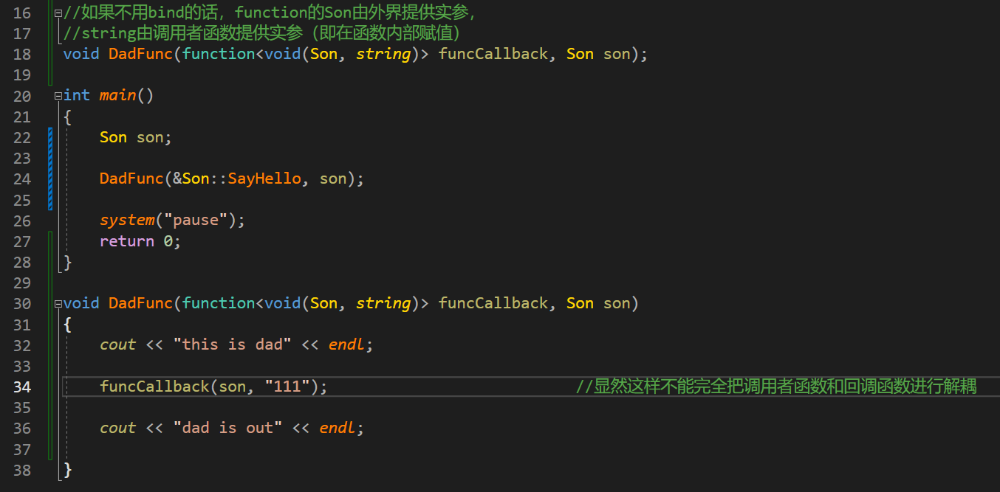
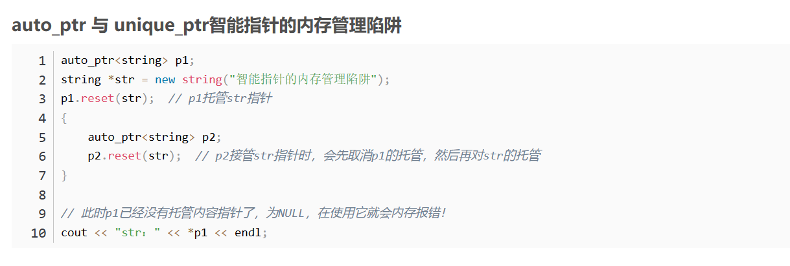

### 零散小知识

- C++11中，原子类型被视为一种库特性，而非语言特性，因其可以通过库的方式来实现

- 复制及再抛出异常（page6）

- 并行动态初始化和析构（page6）

- c++11中允许对非静态成员变量使用sizeof操作

- 模板的默认参数应该从右至左指定（page66）

- 模板的显式实例化定义、外部模板声明和使用与全局变量的定义、外部申明和使用类似（page68）

- 局部和匿名类型可以作为模板实参（page72）

- 创建只在栈上分配内存的类：用`=delete`修饰`operator new/delete`（page251）

  创建只在堆上分配内存的类：私有化析构函数
  
- 常量成员函数中，可以修改类型为引用的成员变量，因为修改的不是引用本身，而是引用的值。

- 交换两变量时，用`swap()`或者用中间变量交换就行，不要用异或：[例子](https://github.com/microsoft/STL/pull/5215)

### 变长参数的宏定义以及\__VA_ARGS__

[#、##、__VA_ARGS__和##__VA_ARGS__的作用_x-7sstre2oueujsp-CSDN博客](https://blog.csdn.net/q2519008/article/details/80934815)

page40

```c++
void log_print(const char *, const char *, int, const char *, ...);
#define WRITE_LOG(LOGTEXT, ...) do{ \
    log_print(__FILE__, __FUNCTION__, __LINE__, LOGTEXT, ##__VA_ARGS__);\
}while(0);

void log_print(const char *, const char *, int, const char *, ...){
	// 函数申明
}
// 应用
```

### #error，static_assert和assert

用于排除逻辑上不可能存在的状态

- **#error** 

  - 语法格式：`#error error-message`

  - 预编译期断言，编译程序时，只要遇到`#error`就会生成一个编译错误提示消息，并停止编译。

- **assert**

  - 语法格式：`assert( expression );`

  - 运行期断言，计算表达式，如果结果为 **`false`**，则打印诊断消息并中止程序。

  - 由于NDEBUG宏的存在，`assert()`在release模式下被禁用，因此它仅在debug模式下显示错误消息，如想在release模式下输出，**应使用`#undef NDEBUG`，同时该预编译指令必须放在`#include<cassert>`前面**。

    ```c++
    // 禁用assert()的简要实现
    #ifdef NDEBUG
    #define assert(expr)			(static_cast<void> (0))
    #else
    ......
    #endif
    // 显然，在定义了NDEBUG宏后，assert()被展开为一条无意义的语句，然后被编译器优化掉
    ```

    所以对于对应用程序正确运行至关重要的检查（如检查 `dynamic_cast()` 的返回值）时，为了确保它们在debug模式下也会执行，应使用 if 语句

- **static_assert**

  - 语法格式：`static_assert(constant-expression, string-literal);`（注意只能是**常量表达式**和**常量字符串**）

  - 编译期断言， 如果指定的常数表达式为 **`false`**，则编译器显示指定的消息，并且编译失败

    ```c++
    // static_assert()简要实现
    #define assert_static(e) \
    	do { \
    		enum { assert_static__ = 1 / (e) }; \
    	} while(0)
    ```
    
    `do {} while(0)`的妙用：
    
    [代码使用do...while(0)的好处_do while 0 的好处-CSDN博客](https://blog.csdn.net/m0_60069998/article/details/128971920)

### 异常

异常用于处理逻辑上可能发生的错误

**异常处理工作原理**

​	每当您使用 throw 引发异常时，编译器都将查找能够处理该异常的 catch(Type)。异常处理逻辑首 先检查引发异常的代码是否包含在 try 块中，如果是，则查找可处理这种异常的 catch(Type)。如果 throw 语句不在 try 块内，或者没有与引发的异常兼容的 catch( )，异常处理逻辑将继续在调用函数中寻找。 因此，异常处理逻辑沿调用栈向上逐个地在调用函数中寻找，直到找到可处理异常的 catch(Type)。在 退栈过程的每一步中，都将销毁当前函数的局部变量，因此这些局部变量的销毁顺序与创建顺序相反。（chapter28.4）

**std::exception 类**

​	捕获 std::bad_alloc 时，实际上是捕获 new 引发的 std::bad_alloc 对象。std::bad_alloc 继承了 C++标准类 std::exception，而 std::exception 是在头文件<exception>中声明的。
下述重要异常类都是从 std::exception 派生而来的。

- bad_alloc：使用 new 请求内存失败时引发。
- bad_cast：试图使用 dynamic_cast 转换错误类型（没有继承关系的类型）时引发。
- ios_base::failure：由 iostream 库中的函数和方法引发。

std::exception 类是异常基类，它定义了虚方法 what( )；这个方法很有用且非常重要，详细地描述 了导致异常的原因。在程序清单 28.2 中，第 18 行的` exp.what( )`提供了信息 bad array new length，让用 户知道什么地方出了问题。由于 std::exception 是众多异常类型的基类，因此可使用 `catch(const exception&)`捕获所有将 `std::exception` 作为基类的异常：

```c++
void SomeFunc() 
{ 
   try 
   { 
      // code made exception safe 
   } 
   catch (const std::exception& exp) // catch bad_alloc, bad_cast, etc    { 
      cout << "Exception encountered: " << exp.what() << endl;    } 
}
```

**从 std::exception 派生出自定义异常类**

​	可以引发所需的任何异常。然而，让自定义异常继承 std::exception 的好处在于，现有的异常处理 程序 catch(const std::exception&)不但能捕获 bad_alloc、bad_cast 等异常，还能捕获自定义异常，因为它 们的基类都是 exception。

```c++
#include <exception> 
#include <iostream> 
#include <string> 
using namespace std;

class CustomException : public std::exception
{
	string reason;
public:
	// constructor, needs reason 
	CustomException(const char* why) :reason(why) {}

	// 重写父类what()虚函数
    // 注意noexcept关键字，可避免在what()引发异常
	virtual const char* what() const noexcept
	{
		return reason.c_str();
	}
};

double Divide(double dividend, double divisor)
{
	if (divisor == 0)
		throw CustomException("CustomException: Dividing by 0 is a crime");

	return (dividend / divisor);
}

int main()
{
	cout << "Enter dividend: ";
	double dividend = 0;
	cin >> dividend;
	cout << "Enter divisor: ";
	double divisor = 0;
	cin >> divisor;
	try
	{
		cout << "Result is: " << Divide(dividend, divisor);
	}
	catch (exception& exp)// catch CustomException, bad_alloc, etc 
	{
		cout << exp.what() << endl; 474
		cout << "Sorry, can't continue!" << endl;
	}

	return 0;
}
```

### noexcept修饰符

> - `noexcept()`修饰符中只能存放常量表达式
> - `noexcept()`操作符中是不求值语境，所以该操作符的返回值显然是个编译期的bool常量

`noexcept` 表示其修饰的函数不会抛出异常。在 C++11 中如果 `noexcept` 修饰的函数抛出了异常，编译器会直接调用 `std::terminate ()` 函数来终止程序的运行。这比基于异常机制的 throw 在效率上会高一些。

语法（两种表达形式）：

```c++
void excpt_func() noexcept;
void excpt_func() noexcept(constant_expression);// 只能是常量表达式
```

常量表达式的结果会被转换成一个 bool 类型的值。该值为 true，表示函数不会抛出异常；反之，则有可能抛出异常。这里，不带常量表达式的 noexcept 相当于声明了 noexcept (true)，即不会抛出异常。

```c++
#include <iostream>
#include <exception>
using namespace std;

void Throw() { throw 1; }						// 该函数唯一作用是抛出异常
void NoBlockThrow() { Throw(); }		// 该函数会让throw()中抛出的异常继续抛出
void BlockThrow() noexcept {Throw(); }	// 该函数不允许让throw()抛出的异常继续抛出，而是调用terminate()中断程序

int main() {
	try {
		Throw();
	}
	catch (...) {
		cout << "Found throw." << endl; // Found throw.
	}
	try {
		NoBlockThrow();
	}
	catch (...) {
		cout << "Throw is not blocked." << endl; // Throw is not blocked.
	}
	try {
		BlockThrow();					// terminate() called after throwing an instance of 'int'
	}
	catch (...) {
		cout << "Found throw 1." << endl;
	}
	// 编译选项: g++ -std=c++11 2-6-1.cpp
}
```

### noexcept操作符

noexcept作为操作符时，通常用于模板

语法：

```c++
template <class T>
    void fun() noexcept(noexcept(T())) {}
```

这里，fun 函数是否是一个 noexcept 的函数，将由 T () 表达式是否会抛出异常所决定。这里的第二个 noexcept 就是一个 noexcept 操作符。当其参数是一个有可能抛出异常的表达式的时候，其返回值为 false，反之为 true。

```c++
#include <iostream>
using namespace std;

bool judge(int i) noexcept
{
	bool bj = static_cast<bool>(i);
	return true;
}

template<typename Type>
void mswap(Type& x, Type& y) noexcept(noexcept(judge(x)))    //此处先判断judge(x))是否被noexcept修饰，如果是，则mswap也被noexcept修饰
{
	throw 1;
	cout << "throw" << endl;
}

int main() {
	int x = 0;
	x++;
	int y = 4;
    
	try {
		mswap(x, y);
	}
	catch (...) {
		cout << "Found throw." << endl; // Found throw.
	}
	// 编译选项: g++ -std=c++11 2-6-1.cpp
}
```

应用场景：

- 移动构造函数（move constructor）
- 析构函数（destructor）。这里提一句，在新版本的编译器中，析构函数是默认加上关键字noexcept的。下面代码可以检测编译器是否给析构函数加上关键字noexcept。

```scss
    struct X
    {
        ~X() { };
    };
    
    int main()
    {
        X x;
        // explicitly marked as noexcept(true)
        static_assert(noexcept(x.~X()), "Ouch!");
    }
```

### C++11初始化列表？？？

> - 初始化列表的初始化方式总是先于构造函数完成的（实际在编译完成时就已经决定了)。

### 聚合类型和POD类型

[C++变量的存储类别（动态存储、静态存储、自动变量、寄存器变量、外部变量） - DoLittleDo - 博客园](https://www.cnblogs.com/DoLittleDo/p/5805742.html)

[聚合类型与POD类型 - Jerry_SJTU - 博客园](https://www.cnblogs.com/jerry-fuyi/p/12854248.html)

> - 聚合类，可以简单当成成员变量为public的POD类型
> - 不过聚合类的成员可以是非聚合类型。

### C++11列表初始化

[C++的花括号初始化就是用来匹配std::initializer_list构造函数的吗](https://github.com/Mq-b/Loser-HomeWork/discussions/207)

[列表初始化及decltype_列表初始化类中的结构体-CSDN博客](https://blog.csdn.net/wh9109/article/details/133104216)

[【C++从练气到飞升】24--C++11：列表初始化 | 声明 | STL的升级-CSDN博客](https://blog.csdn.net/m0_68662723/article/details/142185423)

#### C++98中的初始化

在C++11之前，初始化对象的方式有多种，包括：

1. 直接初始化：`Type variable(value);`

2. 拷贝初始化：`Type variable = value;`

3. 聚合初始化：`Type variable{value};` 或 `Type variable = {value};`（C++11起叫列表初始化）

4. 默认初始化：`Type variable;`

这些初始化方式依赖于其具体类型

- 基础类型，可以使用拷贝初始化

  ```c++
  int a = 42;
  double b = 1.2;
  ```

- 类类型，在其只有一个参数，且没有声明`explict`的情况下，也可以使用拷贝初始化

  ```c++
  class foo
  {
    int a_;
  public:
    foo(int a):a_(a) {}
  };
  foo f1 = 42;		// 存在隐式转换
  ```

- 非聚合类，可以使用直接初始化，对于不需要参数的则不能添加括号，否则编译器会认为是函数声明。

  ```c++
  foo f1;           // 默认初始化
  foo f2(42, 1.2);
  foo f3(42);
  foo f4();         // 识别为函数申明
  ```

- 聚合类可以使用列表初始化[（聚合体，聚合初始化）](https://zh.cppreference.com/w/cpp/language/aggregate_initialization#.E5.AE.9A.E4.B9.89)

  ```c++
  struct bar{
  	int a;
  	double b;
  };
  
  bar b = {42, 1.2};
  int a[] = {1, 2, 3, 4, 5};
  ```

- 除了以上初始化方式之外，对于标准容器来说，都是先声明一个对象，然后通过插入的方式进行初始化，不过，std::vector是个例外，其可以从先前使用了聚合初始化的数组分配，如下：

  ```c++
  nt arr[] = {1, 2, 3, 4, 5}; // 使用聚合初始化初始化的数组
  
  std::vector<int> vec(std::begin(arr), std::end(arr)); // 使用数组的值初始化 std::vector
  ```

#### C++11列表初始化

在上节中，我们看到在C++11之前有多种初始化方式，开发人员往往需要对每种的场景都需要了解，以防止性能损失或者编译错误，正是为了解决这个问题，自C++11起，引入了统一初始化（**Uniform initialization**），或者叫列表初始化（**List initialization**）。

- 定义：

  列表初始化，用{}方式进行初始化，如下：

  ```c++
  T object {other};   
  T object = {other}; 
  ```

- 分类：

  [列表初始化 (C++11 起) - cppreference.com](https://zh.cppreference.com/w/cpp/language/list_initialization)

  - 直接列表初始化

    **重载决议时会考虑 explicit 和非 explicit 构造函数，且两者都能调用**

    ```c++
    T 对象{ 实参1, 实参2, ... };
    
    T { 实参1, 实参2, ... };				// 使用列表初始化构造临时对象
    
    new T{ 实参1, 实参2, ... };
    
    类 { T 成员{ 实参1, 实参2, ... }; };		// 在类中使用列表初始化来初始化非静态成员变量
    
    类::类() : 成员{ 实参1, 实参2, ... } {...	// 在初始化列表中使用列表初始化
    ```

  - 拷贝列表初始化

    **重载决议时会考虑 explicit 和非 explicit 构造函数，但只能调用非 explicit 构造函数**

    ```c++
    T 对象 = { 实参1, 实参2, ... };			// 会发生隐式转换
    
    // 函数调用表达式中，以花括号包围的初始化器列表作为实参，以列表初始化对函数形参进行初始化
    // 会优先匹配形参为 initializer_list<> 的函数（前提是 {pram_list} 可以转换为initializer_list<>）
    // 如 {1,2,3,4} 就无法转换为 initializer_list<string>
    函数 ({ 实参1, 实参2, ... });				
    
    // 在以花括号包围的初始化器列表作为返回表达式的 return 语句中，以列表初始化对返回的对象进行初始化
    return { 实参1, 实参2, ... };
    
    // 在具有用户定义的 operator[] 的下标表达式中，以列表初始化对重载运算符的形参进行初始化
    对象 [{ 实参1, 实参2, ... }];
    
    // 构造函数调用，其中花括号包围的初始化器列表用作构造函数实参。以复制初始化对构造函数的形参初始化（注意：此例中的类型 U 不是被列表初始化的类型；但 U 的构造函数的形参是）
    U ({ 实参1, 实参2, ... });
    
    // 在类中使用拷贝列表初始化来初始化非静态成员变量
    类 { T 成员 = { 实参1, 实参2, ... }; };
    ```

  - 聚合初始化[（聚合体，聚合初始化）](https://zh.cppreference.com/w/cpp/language/aggregate_initialization#.E5.AE.9A.E4.B9.89)

    列表初始化的一种形式，当该类为聚合体时，就是聚合初始化

    ```c++
    T 对象 = { 实参1, 实参2, ... };
    
    T 对象 { 实参1, 实参2, ... };
    ```

- 示例：

  - 直接列表初始化

    ```c++
    struct test{
        test(int a, int b) : _a{a}, _b{b}{
            _a = 3;
            _b = 4;		// 注意各初始化的优先级：a, b先是1, 2；随后被更新为2, 3；最后变成3，4
        }
        int _a{1};
        int _b{2};
    };
    
    int main(){
        test a{2, 3};
    }
    ```

  - 拷贝列表初始化

    当以下多参构造函数用`explict`修饰时，所有拷贝列表初始化均编译错误，因为只能调用非 explicit 构造函数

    ```c++
    struct test{
        test(int a, int b){ }
        
        // 拷贝列表初始化
        int _a = {1};
        int _b = {2};
    };
    
    test func(test t) {
        // todo...
        return {1, 2};
    }
    
    int main(){
        test t1 = func({1, 2});	// 此处发生了两次拷贝列表初始化，一次移动构造
    }
    ```

    解释：

    - 之所以此处只发生一次移动构造，是因为`return {1, 2};`时，在以花括号包围的初始化器列表作为返回表达式的 return 语句中，以列表初始化对返回的对象进行初始化，而不是由局部变量初始化。

    - 在`func()`定义如下时，发生两次有参构造，两次移动构造

      ```c++
      // case 1
      test func(test t) {
          return test{1, 2};
      }
      
      // case 2
      test func(test t) {
          test t2 = {1, 2};
          return t2;
      }
      ```

#### 列表初始化的细节

> - `{}`与`initializer_list<>`的联系
>   1. 两者之间其实没啥关系
>   2. 当使用**复制列表初始化**（不是复制初始化）时，`auto`会将`{}`推导为`initializer_list`
>   3. 在构造函数中，使用`{}`会优先和参数为`initializer_list`的构造函数进行匹配

- `{param_list}`的名字，类型：

  `{param_list}`该叫什么？ 我们应该称它为**花括号初始化器列表**

  括号初始化器列表**不是表达式**，**因此它没有类型**，**即`decltype({1,2})`非良构，**没有类型意味着模板类型推导无法推导出与花括号初始化器列表相匹配的类型，因此给定声明`template<class T>void f(T);`则表达式`f({1, 2, 3})`**非良构。**

  对于`auto`而言，在复制列表初始化中将任何*花括号初始化器列表*均推导为`std::initializer_list`

  ```c++
  auto p = { 1,2,3,4,5,6 };//复制列表初始化将花括号初始化器列表推导为std::initializer_list
  auto p2  { 1,2,3,4,5,6 };//无法推导
  ```

- 防止缩窄转换：

  ```c++
  int main() {
      int a = 3;
      bool b = a;		// 编译通过，但此时已经发生了类型收窄，可能这不是我们想要的
      bool b1 = {a};	// 编译失败，检测到发生了类型收窄
      
  //	解决办法：显式转换
      bool b2 = {static_cast<bool>(a)};
  };
  ```

- 初始化方式：

  这里使用直接初始化做例子，其他初始化方式同理

  ```c++
  struct test{
      test(){ }
      test(string a, int b){ }
      test(initializer_list<int> il){ }
      test(test&& t){ }
  };
  
  int main(){
      // 只能匹配有参构造函数
      test t();		// 识别为函数声明
      test t1(2, 4);	// ERROR
      test t2("2", 4);// OK
  
      // 只要可以隐式转换，就优先匹配 参数为initlizer_list<>的构造函数
      test t3{};		// 默认构造
      test t4{2, 4};
      test t5{"2", 4};
  
      // 花括号初始化器列表用作构造函数实参。以复制初始化对构造函数的形参初始化
      // 注意：此例中的类型 test 不是被列表初始化的类型；但 test 的构造函数的形参是
      test t6({});		// 先构造initializer_list临时对象，然后构造test
      test t7({2, 4});    // 同上
      test t8({"2", 4});  // 先构造test临时对象，然后移动构造test
  }
  ```

- 重载决议：

  当进行列表初始化时，如果类中既有 参数为`initlizer_list<>`的构造函数，又有 单参/多参构造函数：

  - 重载决议会优先匹配 参数为`initlizer_list<>`的构造函数

  - 如果匹配不上 参数为`initlizer_list<>`的构造函数，则会拆分`initializer_list<>`，去匹配有相同参数个数，相同参数类型的构造函数。

  - 如果构造函数被explicit修饰，不论时直接列表初始化还是拷贝列表初始化，都会忽略explicit进行重载决议；如果最终绑定的是explicit修饰的构造函数，则使用拷贝列表初始化编译失败

    ```c++
    struct test{
        test(int a, int b){ }
        explicit test( initializer_list<int> il ){ }
    };
    
    int main(){
        // 以下两种列表初始化都绑定的是explicit修饰的构造函数
        test t1{1, 2};		// OK
        test t2 = {1, 2};	// 编译失败
    }
    ```

- 类模板形参推导（C++17起）

  **当从类型为当前，或者说正在构造的类模板的特化或特化子级的 单个元素 进行初始化时，复制构造函数优先于列表构造函数。**

  ```c++
  template<typename T>
  struct Test {
      Test() {}
      Test(std::initializer_list<T>) { puts("被调用"); }
      Test(const Test<T>&) { puts("复制构造"); }
  };
  
  template<typename T>
  Test(std::initializer_list<T>) -> Test<T>;
  
  int main() {
      Test<int> a;
      Test t{ a,a };		//被调用         会推导为Test<Test<int>>
      Test t2{ a };		//复制构造       会推导为Test<int>
      
  //	如果希望 Test t2{ a }; 中Test类型被推导为 Test<Test<int>>, 需要以下做法
      Test t3({ a });		//被调用         会推导为Test<Test<int>>
  }
  ```

#### 类型收窄


类型收窄一般是指一些可以使得数据变化或者精度丢失的隐式类型转换。可能导致类型收窄的典型情况
如下:

- 从浮点数隐式地转化为整型数。比如:int a=1.2，这里a实际保存的值为整数1，可以视为类型收窄。

- 从高精度的浮点数转为低精度的浮点数，比如从 long double 隐式地转化为double，或
从double 转为float。如果这些转换导致精度降低，都可以视为类型收窄。

- 从整型（或者非强类型的枚举）转化为浮点型，如果整型数大到浮点数无法精确表示，则也可以视为类型收窄。


- 从整型（或者非强类型的枚举）转化为较低长度的整型，比如:unsigned char=1024，
1024明显不能被一般长度为8位的unsigned char所容纳，所以也可以视为类型收窄。

C++11中，使用初始化列表进行初始化的数据编译器是会检查其是否发生类型收窄的

```c++
int main()
{
	const int x = 1024;
	const int y = 10;

	char a = x;						// 收窄，但可以通过编译
	char* b = new char(1024);		// 收窄，但可以通过编译

	char c = { x };					// 收窄，无法通过编译
	char d = { y };					// 可以通过编译
	unsigned char e{ -1 };			// 收窄，无法通过编译

	float f{ 7 };					// 可以通过编译
	int g{ 2.0f };					// 收窄，无法通过编译
	float* h = new float{ 1e48 };	// 收窄，无法通过编译
	float i = 1.21;					// 可以通过编译

	return 0;
}
```

注意：

- 只有进行常量初始化的时候发生收窄，才会编译报错，这很好理解

### 成员变量的就地初始化

[C++11 快速初始化成员变量 - kaizenly - 博客园 (cnblogs.com)](https://www.cnblogs.com/Braveliu/p/12227564.html)

> - C++11中，允许就地地使用 `=` 或者 `{}` 对**非静态成员变量**进行列表初始化。
> - 对于**非常量的静态成员变量**而言，需类内申明，类外初始化。（保证编译时，类静态成员的定义最后只存在于一个目标文件中）
> - 对于**常量的静态成员变量**而言，需就地初始化。
> - 初始化列表的效果总是优先于就地初始化。

```c++
struct C
{
    C(int i, int j) :c(i), d(j){};

    int c;
    int d;
};

struct init
{
    // 对成员变量就地使用列表初始化
    int a = 1;
    string b{ "hello" };
    C c{ 1, 3 };
};
```

### define/const？？？

[？？？#define 宏定义看这一篇文章就够了-CSDN博客](https://blog.csdn.net/m0_69519887/article/details/133960037)

define是在编译的**预处理阶段**起作用；而const是在**编译、运行**的时候起作用

宏不检查类型，一般来说加上一个大括号；const会检查数据类型

- `do { } while(0)`的技巧
- `#`的作用
- `##`的作用
- `##__VA_ARGS`的作用

### const/static？？？

- **static**

  [C/C++之static函数与普通函数](https://www.cnblogs.com/ht-927/p/4726574.html)

  - static修饰普通全局变量/函数
    隐藏。所有不加static的全局变量和函数具有全局可见性，可以在其他文件中使用，**加了之后只会初始化一次，且只能在该文件所在的编译模块（即申明该函数/变量的文件）中使用（所以静态全局变量在.cpp文件中声明，定义）**

  - static修饰普通局部变量

    改变了局部变量的存储位置，从原来的栈中存放改为静态存储区。但是作用域仍为局部作用域，局部静态变量在离开作用域之后，并没有被销毁，而是仍然驻留在内存当中，直到程序结束，只不过我们不能再对他进行访问。

  - static修饰类的成员变量/成员函数
    static成员变量：只与类关联，不与类的对象关联。定义时要分配空间，可以被非static成员函数任意访问。
    static成员函数：不具有this指针，无法访问类对象的普通成员变量和普通成员函数； 不能被声明为const、虚函数和volatile；可以被非static成员函数任意访问

- **const**

  [C++ const？？？](https://www.runoob.com/w3cnote/cpp-const-keyword.html)

  - 不考虑类的情况
    const常量在定义时必须初始化，之后无法更改，成为以一个**编译期常量**；const形参可以接收const和非const类型的实参

  - 考虑类的情况
    const成员变量：只能通过构造函数初始化列表进行初始化，并且必须有构造函数；

    const成员函数：const对象只能调用const成员函数；且只有mutable修饰的数据的值可以改变

- 补充知识：

  ```c++
  #include<iostream>
   
  using namespace std;
   
  int main(void)
  {
      const int a = 7;
      int *p = (int*)&a;
      *p = 8;
      cout << a << endl;		// 7
      cout << p << " " << &a << endl;	// 0x5ffe54 0x5ffe54
  }
  ```

  解释：

  - 两者值不同，地址相同，这与`const_cast<>`中的那个例子很相似
  - 将`const int`改为`volatile const int`之后，`a`的值变为8；但是同样的操作放在`const_cast<>`中不成立。且在使用`volatile`修饰后，`*p`和`a`两个变量的地址不一样

### inline/static？？？


### 虚函数/动态多态原理？？？

[？？？C++虚函数的底层实现原理详解_虚函数底层实现原理-CSDN博客](https://blog.csdn.net/lewele001/article/details/120198316)

```c++
class A {
public:
	virtual void test() { }
	virtual void test1() { }
	double a = 1;
};

class B : public A {
public:
	void test() override { }
	void test1() override { }
	int b;
};

int main() {
	B b;
	cout << &b << endl;
	cout << &(b.a) << endl;
	cout << &(b.b) << endl;
}
```

解释：

- 对于B的对象的内存模型而言，虚函数指针位于内存布局的开头，该指针属于子类中的基类对象，内存布局如下：

  ```c++
  class B size(24):
          +---
   0      | +--- (base class A)
   0      | | {vfptr}
   8      | | a
          | +---
  16      | b
          | <alignment member> (size=4)
          +---
  
  B::$vftable@:
          | &B_meta
          |  0	// 0表示这张虚函数表对应的虚表指针在内存中的分布，下面是该虚表指针对应的虚函数
   0      | &B::test
   1      | &B::test1
  // 左侧的 0 表示的是虚函数的序号，并不是和上面的类的内存布局左侧的数字 8 一样表示的是相较于起始内存地址的偏移量，所以对于多个虚函数而言，序号将依次为0，1，2...
  ```

#### 考考你

- 以下代码的输出是：

  ```c++
  class Base {
  public:
  	int a = 1;
  	virtual void print(int n = 2) {
  		cout << "base: " << a + n << endl;
  	}
  };
  
  class derive: public Base {
  public:
  	int b = 3;
  	virtual void print(int n = 10) {
  		cout << "derive: " << b + n << endl;
  	}
  };
  
  int main() {
  	Base* arr = new derive[10];
  	arr[7].print();		// #1
  
  	Base* ptr = new derive{};
  	ptr->print();		// #2
  
      return 0;
  }
  ```

  答案：

  ```c++
  // 答案一：
  derive: 5
  derive: 5
  // 答案二：
      未定义行为，可能造成运行时错误
  ```

  解析：

  ```c++
  Base* arr = new derive[10];
  // 未定义行为，
  // 在msvc的derive类布局中，会先给Base做内存对齐，再给derive做内存对齐，所以sizeof(Base)==16，sizeof(derive)==24
  //		sizeof(Base)*3 == sizeof(derive)*2。arr[6].print()能正常输出
  // 但是在gcc中，sizeof(Base)==sizeof(derive)==16。arr[7].print();	正常输出
  // 所以在derive的内存空间里加上sizeof(Base)，本身就是未定义行为，
  // 需要学完内存序之后再来看
  arr[7].print();		// #1
  
  Base* ptr = new derive{};
  // 先看这个吧：
  // 编译器走到print()这个函数时，会对print()这个名字进行名字查找并绑定
  // 由于该名字左边是成员访问符->，所以会进行限定名字查找，绑定到Base类的print函数中。
  // 然后再在运行期通过虚函数指针访问print()的定义
  ptr->print();		// #2
  ```

### 虚继承实现原理

> 空类的大小为1，为的是区分不同的类对象。

[C++虚继承原理与类布局分析 - 千松 - 博客园](https://www.cnblogs.com/ThousandPine/p/18111381)

#### 普通继承

```c++
class A{
public:
	int a1;
	int a2;
};

class B{
public:
	int b1;
	int b2;
};

class C : public B, public A{
public:
	int d1;
	int d2;
};
```

解释：

- 内存布局：

  ```c++
  class C size(24):
          +---
   0      | +--- (base class A)
   0      | | a1
   4      | | a2
          | +---
   8      | +--- (base class B)
   8      | | b1
  12      | | b2
          | +---
  16      | c1
  20      | c2
          +---
  ```

- 由上内存布局可得，`C*`转换为`A*`和`B*`时的操作出现了差异，以下判断语句均为`true`

  ```c++
  C c;
  (void *)(A *)&c == (void *)&c;
  (void *)(B *)&c > (void *)&c;
  (void *)(B *)&c == (void*)(sizeof (A) + (char *)&c);
  // 对于普通继承而言，子类对象转换为父类对象时，只要知道子类地址即可，不需要访问子类对象。
  ```
  
  解释：
  
  - 在C的对象c中：
    1. C的地址就是A的地址
    2. B的地址比C的地址大
    3. B的地址比C的地址大`sizeof(A)`个字节

#### 虚继承

> - 对于普通继承而言，子类对象的地址转换为父类对象的地址时，只要知道子类地址即可，**不需要访问子类对象**，即可获取到父类对象地址。
> - 显然对于虚继承而言，子类对象的地址转换为父类对象的地址时，不仅需要知道子类地址，**而且需要访问子类对象**才能得到父类对象地址（这个在子类`weak_ptr`转换为父类`weak_ptr`时有坑，详情见对应的构造函数）。
> - 哪个子类使用了虚继承，那这个vbptr就属于哪个子类，和虚函数指针不同，虚函数指针属于对应的父类。

```c++
class A
{
public:
	int a1;
	int a2;
};

class B : virtual public A
{
public:
	int b1;
	int b2;
};

```

解释：

- 内存布局：

  ```c++
  class B size(24):
          +---
   0      | {vbptr}
   8      | b1
  12      | b2
          +---
          +--- (virtual base A)
  16      | a1
  20      | a2
          +---
  
  B::$vbtable@:
   0      | 0
   1      | 16 (Bd(B+0)A)
  vbi:       class  offset o.vbptr  o.vbte fVtorDisp
                 A      16       0       4 0
  ```

  解释：

  - 只要出现**子类虚继承基类**，则必定发生两种行为（==很重要==）：
    1. 子类布局的起始位置增加了`vbptr`指针，该指针指向`vbtable`（哪个子类使用了虚继承，那这个vbptr就属于哪个子类）
    2. 基类的实例数据副本放在子类末尾
  - 对于虚表`vbtable`而言：
    - 首先需要知道，对于`OF (Xd(Y+n)Z)`表示的是：在`X`类中，`Y`类的地址+`n`个偏移字节可以得到`Y`的`vbptr`，`Y`的`vbptr`到Z类的入口的偏移量为`OF`个字节
    - ` 0      | 0`表示：该虚基类表对应的`vbptr` + 0个偏移字节即可得到持有该表的类的首地址（由`B::$vbtable@:`可知：@后面为空，即该`vbtable`属于B）
    - ` 1      | 16 (Bd(B+0)A)`表示：B类中，B的地址+0个偏移字节即可获取到B的`vbptr`，B的`vbptr`到A类入口的偏移量为16

#### 菱形继承

```c++
class A{
public:
	int a1;
	int a2;
};

class B : public A{
public:
	int b1;
	int b2;
};

class C : public A{
public:
	int c1;
	int c2;
};

class D : public B, public C{
public:
	int d1;
	int d2;
};

```

解释：

- 内存布局：

  ```c++
  class D size(40):
          +---
   0      | +--- (base class B)
   0      | | +--- (base class A)
   0      | | | a1
   4      | | | a2
          | | +---
   8      | | b1
  12      | | b2
          | +---
  16      | +--- (base class C)
  16      | | +--- (base class A)
  16      | | | a1
  20      | | | a2
          | | +---
  24      | | c1
  28      | | c2
          | +---
  32      | d1
  36      | d2
          +---
  ```

  解释：

  - 显然，在C类中，有两份A类的副本，有问题

#### 虚继承解决菱形继承

```c++
class A{
public:
	int a1;
	int a2;
};

class B : virtual public A{
public:
	int b1;
	int b2;
};

class C : virtual public A{
public:
	int c1;
	int c2;
};

class D : public B, public C{	
public:
	int d1;
	int d2;
};
```

解释：

- 内存布局：

  ```c++
  class D size(48):
          +---
   0      | +--- (base class B)
   0      | | {vbptr}
   8      | | b1
  12      | | b2
          | +---
  16      | +--- (base class C)
  16      | | {vbptr}
  24      | | c1
  28      | | c2
          | +---
  32      | d1
  36      | d2
          +---
          +--- (virtual base A)
  40      | a1
  44      | a2
          +---
  
  D::$vbtable@B@:
   0      | 0
   1      | 40 (Dd(B+0)A)
  
  D::$vbtable@C@:
   0      | 0
   1      | 24 (Dd(C+0)A)
  vbi:       class  offset o.vbptr  o.vbte fVtorDisp
                 A      40       0       4 0
  ```

  解释：

  - 请结合[#虚继承](#虚继承)理解
  - 在继承完之后，B类和C类中A的实例化数据副本发生了合并

#### 共用虚基类表

```c++
class A{
public:
	int a1;
	int a2;
};

class B : virtual public A{
public:
	int b1;
	int b2;
};

class C : virtual public A, public B {
public:
	int c1;
	int c2;
};
```

解释：

- 内存布局：

  ```c++
  class C size(32):
          +---
   0      | +--- (base class B)
   0      | | {vbptr}
   8      | | b1
  12      | | b2
          | +---
  16      | c1
  20      | c2
          +---
          +--- (virtual base A)
  24      | a1
  28      | a2
          +---
  
  C::$vbtable@:
   0      | 0
   1      | 24 (Cd(B+0)A)
  vbi:       class  offset o.vbptr  o.vbte fVtorDisp
                 A      24       0       4 0
  ```

  解释：

  - 请结合[#虚继承](#虚继承)理解
  - 在继承完之后，B类和C类中`vbptr`发生了合并（当派生类同时进行虚继承和非虚继承的情况下，只要非虚继承的基类中存在`vbptr`指针，那么派生类的虚继承就会与之共用一个`vbptr`和`vbtable`。）


#### 练习题：

画出D类的内存布局：

```c++
class A{
public:
	int a1;
	int a2;
};

class B : virtual public A{
public:
	int b1;
	int b2;
};

class C : virtual public A{
public:
	int c1;
	int c2;
};

class D : virtual public B, public C{
public:
	int d1;
	int d2;
};
```

答案：

```c++
class D size(48):
        +---
 0      | +--- (base class C)
 0      | | {vbptr}
 8      | | c1
12      | | c2
        | +---
16      | d1
20      | d2
        +---
        +--- (virtual base A)		// 好像继承的逻辑是先普通继承，后虚继承
24      | a1
28      | a2
        +---
        +--- (virtual base B)
32      | {vbptr}
40      | b1
44      | b2
        +---

D::$vbtable@C@:
 0      | 0
 1      | 24 (Dd(C+0)A)
 2      | 32 (Dd(D+0)B)	// 发现没有，C类和D类的vbptr和vbtable合并了

D::$vbtable@B@:
 0      | 0
 1      | -8 (Dd(B+0)A)
vbi:       class  offset o.vbptr  o.vbte fVtorDisp
               A      24       0       4 0
               B      32       0       8 0
```

### 虚继承+虚函数

```c++
class A{
public:
	virtual void test(){}
	int a1;
	int a2;
};

class B : virtual public A{
public:
	virtual void test() {}
	int b1;
	int b2;
};
```

解释：

- 内存布局：

  ```c++
  class B size(32):
          +---
   0      | {vbptr}
   8      | b1
  12      | b2
          +---
          +--- (virtual base A)
  16      | {vfptr}
  24      | a1
  28      | a2
          +---
  
  B::$vbtable@:
   0      | 0
   1      | 16 (Bd(B+0)A)
  
  B::$vftable@:
          | -16
   0      | &B::test
  ```

  解释：

  - 结合前两章看

#### （一）指针的定义

- 一级指针：是一个指针变量，该指针指向的地址保存着一个普通变量；

- 二级指针：是一个指针变量，该指针指向的地址保存着一级指针的地址；

- 例如：

  ```c++
  int a1[5] = {1, 2, 3, 4, 5};
  int a2[5] = { 10, 20, 30, 40, 50 };
  int a3[5] = { 100, 200, 300, 400, 500 };
  int a4[5] = { 1000, 2000, 3000, 4000, 5000 };
  int a5[5] = { 10000, 20000, 30000, 40000, 50000 };
  int* p[5] = { a1, a2, a3, a4, a5 };
    
  int** pp = p;
  cout << *(*(pp + 1) + 4) << endl;	// 50
  ```

  解释：

  - 进行`operator + ()`时，加的是`sizeof(指针指向的地址中存储的类型)`

  - `pp + 1`时加的是`sizeof(int*)`，因为pp指向的的地址中存放的是`int*`，会加8个字节
  - `*pp + 1`时加的是`sizeof(int)`，理由同上。

### 继承构造函数

page75

> - 为了避免二义性，尽量不要在构造函数中使用默认参数，且继承构造函数不会继承默认参数
> - ` using Base::Base`是**隐式声明继承的**。即假设一个继承构造函数不被相关的代码使用，编译器不会为之产生真正的函数代码，这样比透传基类各种构造函数更加节省目标代码空间。
> - 继承构造函数只会初始化基类中的成员变量，如果想初始化子类独有的成员变量，通过**就地初始化**解决。
> - 基类的构造函数被声明为**私有**或者派生类是从基类**虚继承**的，那么就不能在派生类中声明继承构造函数。
> - 一旦使用了继承构造函数，编译器就不会为派生类生成默认构造函数。
> - 派生类继承了多个基类的时候。多个基类中的部分构造函数可能导致派生类中的继承构造函数的函数名、参数相同，解决办法就是**显式的继承类的冲突构造函数**。

```c++
class Base {
public:
    Base(int x) {
        // 基类构造函数
    }
};
class Derived : public Base {
public:
    using Base::Base; // 继承基类的所有构造函数，也就是继承构造函数
};
int main() {
    Derived d(10); // 直接使用继承来的基类构造函数
    return 0;
}
```

```c++
struct A
{
	A(int) {}
};
struct B
{
	B(int) {}
};
struct C :A, B
{
	using A::A;
	using B::B;
	C(int i) :A(i), B(i) {}		// 显式的继承类的冲突构造函数解决冲突
};

int main() {
	C c(1);
}
```

`Derived`类通过`using Base::Base;`语句继承了`Base`类的所有构造函数。因此，在创建`Derived`类的实例时，我们可以直接使用`Base`类的构造函数来初始化`Derived`对象。

[#总结](#继承构造函数)

### 委派构造函数

[C++11之委派构造函数](https://blog.csdn.net/qq_45254369/article/details/126771257)

page80

#### 使用方法

> - 用于减少构造函数中的重复代码
> - 概念：**将构造的任务分派给一个目标构造函数来完成**。（eg1）
> - **委派构造函数**：初始化列表中调用“基准版本”的构造函数就是委派构造函数。
>   **目标构造函数**：被调用“基准版本”构造函数就是目标构造函数。
> - 委派构造函数不能使用 初始化列表 初始化成员变量（eg1）
> - 目标构造函数的执行总是**先于**委派构造函数。因此需要避免目标构造函数和委托构造函数体中初始化同样的成员。（eg1）

```c++
// eg1
class Info
{
public:
	Info() :Info(1, 'a') {}				// 委派构造函数，使用目标构造函数完成委派构造函数的初始化
    
	Info(int i) : Info(i, 'a') { type = i; }		// 可能出错，委派构造函数中应避免对同样的成员变量进行多次初始化
	Info(char ch) : Info(1, ch) {} 					// 正确，委派构造函数
    
    // 错误，构造函数中不能同时使用委托构造函数和初始化列表，不过可以用链式委托完成相似的功能
    Info(int i, char ch, int j)
        : Info(i, ch)
        , typej(j)
    {}

private:
	Info(int i, char ch) :type(i), name(ch) { type += 1 }	// 目标构造函数
	int type{ 1 };
	char name{ 'a' };
    int typej{ 0 };
};
int main()
{
    Info info(5);
    cout << info.type << endl;	// 此时输出的值为5：首先会调用目标构造函数，此时type=6；然后调用委托构造函数体，此时type=5，显然这并不符合我们的预期
    return 0;
}
```

#### 链式委托

`Info()`委派`Info(int)`进行构造工作，然后`Info(int)`委派`Info(int， char)`。这就是**链式委托**。

```c++
// 链状委派构造函数
class Info
{
public:
	Info() :Info(1) {}
	Info(int i) : Info(i, 'a') {}	// Info(int i) 既是目标构造函数，也是委派构造函数

private:
	Info(int i, char ch) :type(i), name(ch) {}

public:
	int type{ 1 };
	char name{ 'a' };
};
```

#### 委托环

链状委派没有任何问题，但是形成环形链状委派也叫**委派环**（delegation cycle）就会导致**构造死循环**

```c++
// 委派环
class Info
{
public:
    // 编译错误
	Info(int i) : Info('c') {}
	Info(char ch) : Info(2) {}

private:
	int type{ 1 };
	char name{ 'a' };
};

```

#### 使用场景

##### 构造模板函数

使用构造模板函数作为目标函数，分别使用vector，deque来初始化list容器

```c++
class Test
{
private:
	template<class T>
	Test(T first, T last) :m_list(first, last) {}

public:
	Test(vector<int>& v) :Test(v.begin(), v.end()) {}
	Test(deque<int>& d) : Test(d.begin(), d.end()) {}

private:
	list<int> m_list;
};
```

##### 异常处理

[构造函数与函数try块_构造函数里用trycatch](https://blog.csdn.net/laixingjun/article/details/9152487)

```c++
class Test
{
public:
	Test(double d)
		try : Test(1, d)			// 函数try块不仅可以用于初始化列表，还可以用于委派构造函数
	{
		cout << "Run the body" << endl;
	}
	catch (...)
	{
		cout << "caught exception." << endl;
	}

private:
	Test(int i, double d)
	{
		cout << "going to throw" << endl;
		throw 0;
	}
	int type;
	double data;
};

int main()
{
	Test info(5);
	return 0;
}

```

### new/delete，malloc/free

- new的实现过程是：

  首先调用名为**operator new**的标准库函数，分配足够大的原始为类型化的内存，以保存指定类型的一个对象；接下来运行该类型的一个**构造函数**，用指定初始化构造对象；最 后返回指向新分配并构造后的的对象的指针

  

  new的注意事项：

  

  ```text
  这些是可替换的签名：
  	普通的单个对象的new和delete（无参数，出错时抛出bad_alloc异常）
  	普通的数组new和delete（同上）
  	不抛出异常的单个对象的new和delete（接受一个nothrow参数，出错时返回NULL）
  	不抛出异常的数组new和delete（同上）
  placement new和delete签名（接受一个内存地址参数，什么也不做）不能被用户程序替换。
  ```

  不抛异常的new操作符：`int* a = new(nothrow) int(2);`

- delete的实现过程：对指针指向的对象运行适当的**析构函数**；然后通过调用名为**operator delete** 的标准库函数释放该对象所用内存

  

**相同点**

- 都可用于内存的动态申请和释放

**不同点**

- 前者是C++运算符，后者是C/C++语言标准库函数

- new自动计算要分配的空间大小，malloc需要手工计算

- new是类型安全的，malloc不是。例如：

  ```c++
  int* p = new float[2]; //编译错误
  int* p = (int*)malloc(2 * sizeof(double));//编译无错误
  ```

**free()如何知道释放内存块的大小**

[free()如何知道释放内存块的大小 - 知乎 (zhihu.com)](https://zhuanlan.zhihu.com/p/98859924)

举个例子：假设你用malloc需要申请100字节，实际是申请了104个字节。把前4字节存成该块内存的实际大小，并把前4字节后的地址返回给你。 free释放的时候会根据传入的地址向前偏移4个字节 从这4字节获取具体的内存块大小并释放。

### 右值引用，移动语义，完美转发

#### 左值引用和右值引用？？？

左值与右值这两个概念是从 C 中传承而来的，左值指既能够出现在等号左边，也能出现在等号右边的变量；右值则是只能出现在等号右边的变量。

使用场景：**当函数返回了一个函数内部定义的临时变量时，可以用右值引用接收**

- **左值引用只能绑定左值**

```c++
int a1 = 10;
int& a2 = 10;// 编译错误：非常量左值引用
int& a2 = a1;//编译正确，左值引用可以接受左值
```

- **常量左值引用既可以接收左值，也可以接收右值**

```c++
	int& a = 7;//编译报错：非常量左值引用
	const int& a = 7;//编译正确，常量左值引用可以接收右值
	const int& b = a;//编译正确，常量左值引用可以接收左值
	//常量左值引用可以绑定右值是一条非常棒的特性，但是也存在一个缺点————常量性，一旦使用常量左值引用，表示我们无法在函数内修改该对象的内容（强制类型转换除外），所以需要另一个特性帮助我们完成工作，即右值引用。
```

- **右值引用只能绑定右值，或者通过std::move()绑定左值**，能够有效**延长右值的生命周期，减少对象复制，提升程序性能**；在语法方面，右值引用在类型后加&&

  **右值引用既可以作为左值，也可以作为右值**，当右值引用有名字的时候为左值：`int&& a = 3;`此时a为左值；右值引用没名字的时候为右值：`move()`的返回值为右值引用，此时右值引用为右值，因为该返回值只能被右值引用接收；

```c++
	int i = 0;
	int& j = i;		//左值引用
	int&& k = 11;	//右值引用
	//上述代码中，k是一个右值引用，如果用k引用i，会引起编译错误，右值引用的特点是可以延长右值的生命周期，对于11，理解可能不是很深，请看下面代码
```

```c++
class X{
public:
    X(){}
    X(const X& x){}
    ~X(){}
    void show(){cout<<"show"<<endl;}
};
X make_x(){
    X x1;
    return x1;
}
int main(){
#ifdef 0
    //对于该段代码，一共发生了一次普通构造，两次次拷贝构造（类X中没有移动构造）
    //第一次是调用构造从函数中创建x1临时变量，第二次是拷贝构造出一个临时值作为make_x返回值，第三次是拷贝构造出x2
    X x2(make_x());
    x2.show();					//此处是通过make_x()的返回值又构建了一个x2，调用了x2的拷贝构造函数
#endif
    //使用右值引用，只需一次构造，一次拷贝构造即可实现同样功能
    //第一次是构造x1，第二次是构造x2
    //这里就很好体现出“延长生命周期，减少对象复制”的特点
    X&& x2 = make_x();
    x2.show();					// 此时x2就是make_x()的返回值，x2延长了返回值的生命周期。
}
```

> 而在开启NRVO的情况下，只有一次构造

#### std::move

[一文读懂C++右值引用和std::move - 知乎 (zhihu.com)](https://zhuanlan.zhihu.com/p/335994370)

> - <font color=red>std::move就是将左值转为右值。</font>这样就可以重载到移动构造函数了，移动构造函数将指针赋值一下就好了，不用深拷贝了，提高性能
>
> - move本质上就是一个`static_cast<X&&>`，强制转换为右值
>
> - 使用场景：**可移动对象在<需要拷贝且被拷贝者之后不再被需要>的场景，建议使用**`std::move`**触发移动语义，进行指针的拷贝，提升性能。**
>
> - 移动语义一定会修改临时变量的值，所以不能用`const Array&&`接收
>
> - 移动构造和拷贝构造必须同时提供（unique_ptr除外），且拷贝构造一定要加const
>
> - 移动构造函数中，右值引用形参是一个左值
>
> - 移动构造函数应声明为noexcept

```cpp
class Array {
public:
    ......
 
    // 优雅
    Array(Array&& temp_array) {
        data_ = temp_array.data_;
        size_ = temp_array.size_;
        // 为防止temp_array析构时delete data，提前置空其data_      
        temp_array.data_ = nullptr;
    }
    
public:
    int *data_;
    int size_;
};
```

如何使用：

```cpp
// 例1：Array用法
int main(){
    Array a;
 
    // 做一些操作
    .....
     
    // 左值a，用std::move转化为右值
    Array b(std::move(a));
}
```

- 注意：`std::move`本身移动不了什么，唯一的功能是把左值强制转换成右值，实现等同于一个类型转换：`static_cast<T&&>(lvalue)`，所以单纯的`std::move(xxx)`不会有性能提升，**通常使用`std::move`结合类的构造函数实现移动语义或者通过右值引用延长返回值生命周期**。

```C++
int &&ref_a = 5;
ref_a = 6; 
 
// 等同于以下代码：
 
int temp = 5;
int &&ref_a = std::move(temp);
ref_a = 6;
```

#### 向成员传递的移动语义

> - 写了移动构造函数之后一定要写一个对应的拷贝构造函数（eg1）

```c++
// eg1
class HugeMem
{
public:
	HugeMem(int size) {
		sz = size;
		c = new int[sz];
	}
	~HugeMem() {
		delete[] c;
	}
	HugeMem(HugeMem&& hm) {
		sz = hm.sz;
		c = hm.c;
		hm.c = nullptr;
	}

	int* c;
	int sz;
};
class Moveable
{
public:
	Moveable() : i(new int(3)), h(1024) { }
	~Moveable() { delete i; }
	Moveable(Moveable&& m) noexcept // 移动构造函数应声明为noexcept，因为如果在m.i = nullptr之前抛出异常，会导致在调用函数中的m.i依然可以访问
		: i(m.i)
		, h(move(m.h))	// 移动语义向成员变量的传递
	{
		m.i = nullptr;
	}

	int* i;
	HugeMem h;
};

Moveable GetTemp() {
	Moveable tmp = Moveable();
	return tmp;
}

int main() {
	Moveable a(GetTemp());
	return 0;
}
```

首先，`GetTemp()`返回一个类型为Moveable的临时变量（右值），随后调用Moveable的移动构造函数（注意在移动构造函数中，该返回值被一个右值引用接收，转换成了左值）。此时，m为左值，m.i，m.h也都为左值。

然后，在移动构造函数的初始化列表中，完成了对i的赋值，同时调用了HugeMem中的移动构造函数完成了对成员变量h的赋值；在函数体中，通过`m.i = nullptr`完成对地址的置空，防止重复释放（HugeMem的初始化同理），不过这里可以讲两个比较有趣的点

- 如果我们把`h(move(m.h))`改成`h(m.h)`，会发现编译报错，这是因为`h(m.h)`会调用拷贝构造函数，而在重载了移动构造函数之后，拷贝构造函数被隐藏，因此报错，所以**移动构造和拷贝构造必须同时提供**，只声明其中一种的话，类都仅能实现一种语义（诸如`unique_ptr`例外）。
- 如果我们对Moveable中的每一个构造函数与析构函数中都加上cout语句的话，会发现在整个程序中，只创建了一个Moveable的对象，这可能是因为编译器的返回值优化，g++/clang++中使用`"-fno-elide-constructors"`关闭返回值优化即可（page103）。

#### 函数栈帧，new/delete

[EBP 和 ESP 详解_ebp和esp-CSDN博客](https://blog.csdn.net/yu97271486/article/details/80425089)

[C/C++ 函数调用过程，压栈出栈_基础](https://www.cnblogs.com/wiesslibrary/p/15727311.html)

[一个实例深入了解函数进栈出栈过程_进阶](https://blog.csdn.net/qq_37655329/article/details/121836108)

- 压栈时动态分配（new）所得的内存

  

  - **注意：new实际分配的内存大小固定为16的倍数**
  - 红色：以图一为例：0041要拆分为`0040 + 0001`，其中0040表示new时分配的内存大小（16进制），0001表示当前内存是new（0000则表示delete，delete时会将0040-0040的内存块全部释放掉）
  - 灰色：debug模式下分配的内存，用于保存调试信息
  - 淡绿色（pad）：填充字段，将内存大小固定为16的倍数
  - 深绿色：new出来所可以访问的对象
  
- 压栈时动态分配（new）所得的数组

  

  - 大部分和上面一样，唯一的区别是需要注意可访问的部分

- array delete

  

  - 如果不用array delete 会导致数组中1-n的对象没有调用析构函数，造成堆内存泄漏，但是栈内存不会泄漏，因为调用delete一定会调用free，调用free一定会释放它所申请的内存，只是会少调用析构函数，所以[delete[]对内置类型可以省略]([https://www.cnblogs.com/hazir/p/new_and_delete.html)。
  
  - 一定要看：
  
    > 当我们写一个new表达式时，共有两个函数被调用：一个是用于内存分配的operator new, 另一个是对象的构造函数。如果在第一步，内存申请成功了，然后在执行对象的构造函数时被抛出了异常，如果不处理申请到的内存就会造成内存泄漏问题。 编译器会这么做：它会查找到与oeprator new函数的参数相同的oeprator delete的函数，然后调用该operator delete进行内存的释放,如果没有找到对应的函数编译器什么也不做。 因此，如果你想自定义placement new函数的话，你也需要定义一个对应的placement delete函数，该函数**只会在new一个对象时如果内存申请成功但是构造失败的时候调用**，用于防止内存泄漏， **正常情况下是不会被调用的**。
  
    new ， delete，sizeof都是C++中的关键字，不是函数
  
    new表达式主要做了两件事情：
  
    1. 调用operator new函数为对象的创建分配内存（operator new就是对malloc的封装）
    2. 若成功分配内存，在其上调用类的构造函数；
  
    delete表达式则是执行了new的逆过程 ：
  
    1. 调用指针所指向对象的析构函数，
    2. 调用operator delete释放指针所指向的内存（operator delete就是对free的封装）。
  
    [？？？浅谈 C++ 中的 new/delete 和 new[\]/delete[] - hazir - 博客园](https://www.cnblogs.com/hazir/p/new_and_delete.html)
  
    [？？？C++ 涨知识！new和delete知识总结(全面详细)_c++ new-CSDN博客](https://blog.csdn.net/qq_44443986/article/details/114800593)
  
    [？？？深入学习C++的new/delete机制 - 知乎](https://zhuanlan.zhihu.com/p/438100558)
  
    [？？？《Effective C++》读书笔记———定制new与delete - 殷大侠 - 博客园](https://www.cnblogs.com/yinheyi/p/12900305.html)
  
    [？？？std::set_new_handler - cppreference.cn - C++参考手册](https://cppreference.cn/w/cpp/memory/new/set_new_handler)
  
    [？？？可以参考：EffectiveC++ | 49 了解 new-handler 行为 - 知乎](https://zhuanlan.zhihu.com/p/621194847)

#### 返回值优化？？？

[C++的那些事——返回值优化 - 知乎 (zhihu.com)](https://zhuanlan.zhihu.com/p/588852649)

[深入浅出RVO、NRVO以及std::move的策略与影响 - 知乎 (zhihu.com)](https://zhuanlan.zhihu.com/p/665538550)

[c++中返回值优化（RVO）和命名返回值优化（NRVO）介绍_nrvo优化-CSDN博客](https://blog.csdn.net/lr_shadow/article/details/123332927)

> - 返回值优化在编译期完成（Linux编程.docx中看编译阶段）

```c++
class HasPtrMem {
public:
    HasPtrMem() {
        cout << "construct" << endl;
    }
    HasPtrMem(const HasPtrMem& rhs) {	// 注意拷贝构造函数一定要加const，否则接收不了右值
        cout << "copy construct" << endl;
    }
    HasPtrMem(HasPtrMem&& rhs) {
        cout << "move Construct" << endl;
    }

    ~HasPtrMem() {
        cout << "destruct" << endl;
    }
};

HasPtrMem GetTemp() {
    HasPtrMem t;
    return t;
}

int main() {
    HasPtrMem a = GetTemp();
    // 只会有两次构造，因为不会有 临时对象->b 的移动构造
    HasPtrMem&& b = GetTemp();
    return 0;
}
```


- 根据函数栈帧相关知识
  - `GetTemp()`中创建的变量t存放在当前函数（`GetTemp()`）的栈帧中
  - `HasPtrMem`的临时对象存放在`GetTemp()`的返回地址
  - `main()`中创建的对象a存放在`main()`的函数栈中
  
- 注意在`GetTemp()`中构造出来的变量虽然是左值，**但是在`return t`会直接把`t`当右值表达式进行重载决议**，这是标准中非常特殊的规定，所以上面的两处拷贝构造其实用移动构造表述更准确

- 在开启RVO/NRVO的情况下，编译器会让`GetTemp()`中的t直接创建在a的位置上，因此只会调用一次构造函数

- 无法优化的场景

  对于这些场景，不论是C++11还是C++17，都会取消掉对应的返回值优化，或者复制省略

  - 对象类型与返回值类型不一致时，编译器无法优化（比如常见的错误是对在函数内对返回值对象使用了std::move操作），比如：
  
    ```c++
    // 将此函数代替上面的GetTemp()，会导致编译器无法进行返回值优化，最终导致会进行两次构造（一次构造，一次移动构造），多一次移动构造是因为由HasPtrMem&&向HasPtrMem的构造
    HasPtrMem GetTemp() {
        HasPtrMem t;
        return move(t);
    }
    ```

  - 返回对象依赖于运行时的分支依赖，比如：
  
    ```c++
    vector<int> GetArray() {
      vector<int> obj1;
      vector<int> obj2;
      if (..) {
          return obj1;
      } else {
          return obj2;
      }
    }
    ```

  - 其它场景还有：
  
    - 返回全局变量
    - 返回函数参数

#### 移动语义实现高性能置换

```c++
template <class T>
void swap(T& a, T& b)
{
    T tmp(move(a));
    a = move(b);
    b = move(tmp);
}
```

- 如果T是可以移动的，那么移动构造和移动赋值将会被用于这个置换。整个过程，代码都只会按照移动语义进行指针交换，不会有资源的释
放与申请。
- 而如果T不可移动却是可拷贝的，那么拷贝语义会被用来进行置换。这与普通的置换语句是相同的

#### move_if_noexcept

该函数用于替代`move()`。该函数在类的移动构造函数没有noexcept 关键字修饰时返回一个左值引用从而使变量可以使用拷贝语义，而在类的移动构造函数有noexcept 关键字时，返回一个右值引
用，从而使变量可以使用移动语义。

```c++
int main() {
	Moveable a;
	Moveable b(move_if_noexcept(a));

	// 编译选项: g++ -std=c++11 2-6-1.cpp
}
```

#### C++值类别

[值类别 - cppreference.cn - C++参考手册](https://cppreference.cn/w/cpp/language/value_category)

> 值类别是表达式的性质，而非对象

每个 C++ [表达式](https://cppreference.cn/w/cpp/language/expressions)（运算符及其操作数、字面量、变量名等）都由两个独立的属性描述：*[类型](https://cppreference.cn/w/cpp/language/type)*和*值类别*。每个表达式都有某种非引用类型，并且每个表达式都恰好属于三个主要值类别之一：[*prvalue*](https://cppreference.cn/w/cpp/language/value_category#prvalue)、[*xvalue*](https://cppreference.cn/w/cpp/language/value_category#xvalue) 和 [*lvalue*](https://cppreference.cn/w/cpp/language/value_category#lvalue)。

- lvalue（左值）：有身份的值， 之所以叫左值是因为历史原因，这种值可以在赋值表达式的左侧。
- prvalue（纯右值）没有身份的表达式，不能取地址，是实实在在的右值。
- xvalue（将亡值，“eXpiring” value）：和字面意思一样，快要消亡的值，它和lvalue的区别就在于即将消亡，所以它也是有身份的，这类对象的资源是可以被复用的。

```c++
oid f(int&& a) { }// 要求a为右值表达式，亡值，纯右值

int f1(){return 1;}

int main() {
    int&& p = 1;
    //f(p); p从值类别上来说，是一个左值

    // 返回类型是对象的右值引用的函数调用或重载运算符表达式，例如 std::move(x) 是亡值表达式
    f(move(p));

    // 转换到对象的右值引用类型的类型转换表达式，例如 static_cast<char&&>(x); 是亡值表达式
    f(static_cast<int&&>(p));

    // 字面量，即含义就是字面意思的常量
    // 除了字符串字面量之外的字面量，例如42，true，nullptr 都是纯右值表达式
    f(1);   // 纯右值表达式

    // 返回类型为非引用的函数调用表达式，是亡值表达式
    f(f1());

    int a;
    int& b = a;
    using T = decltype(b);

    forward<int>(a);
    forward<int&>(a);
}
```

注意，判断一个**表达式**的值类别为左值还是右值，不是根据其值类型是左值引用还是右值引用来判断，以下几点可用于判断其值类别：

- 如果可以获取表达式的地址，则表达式为**左值**。

- 如果表达式的类型是左值引用，则该表达式是**左值**。`T&, const T&`

  ```c++
  class test {
  public:
  };
  test& f() {	// 严格来说，f()的返回值是泛左值，或是将亡值
      test t;	// 垂悬
      return t;
  }
  int main(){
      auto&& a = f();	// a被推导为test&
  }
  ```

- 否则，表达式为**右值**。从概念上（通常也是事实上）右值对应于临时对象，例如从函数返回或通过隐式类型转换创建的对象。大多数 Literals 值也是右值

由上，如果函数的返回值是一个右值引用，则该函数调用表达式是右值表达式，但是需要注意**右值引用也是一个引用**，和左值引用一样，**不要返回局部变量的右值引用**，容易造成[垂悬引用](https://zh.cppreference.com/w/cpp/language/reference)

```c++
// 以下结果均关闭rvo/nrvo，且c++11
class test {
public:
    test(){cout << "test\n";}
    test(test&){cout << "test&\n";}
    test(test&&){cout << "test&&\n";}
    ~test(){cout << "~test\n";}
};
/******************************************************************/
test&& f1() {
    test t1;			// 返回值是局部变量的右值引用，最后会导致垂悬引用
    return move(t1);
}
{
    test&& a = f1();
    cout << "---" <<endl;
    // test
    // ~test
    // ---
}
/******************************************************************/
// 如果想返回一个局部变量，不要返回左值引用/右值引用，直接返回就好了
test f() {
    test t;
    return t;
}
{
    test&& a1 = f();
    cout << "---" <<endl;
    // test
    // test&&
    // ~test
    // ---
    // ~test
}
```

在许多经典的著名的文档和书籍中，会提到无需过度的担心函数返回的开销。编译器可以运用许多的优化，还有包括库的实现，移动语义等等，所以使用右值引用当返回值没有太大意义

#### 万能引用（引用折叠）

[【万能引用（引用折叠）】＆【完美转发】](https://cloud.tencent.com/developer/article/2382293)

在模板中用的比较多

- 引用折叠：

    ```c++
  typedef const int T;
  typedef T& TR;
  TR& v = 1;			// 该申明再C++98中导致编译错误
  ```

    其中`TR& v=1`这样的表达式会被编译器认为是不合法的表达式，而在C++11中，一
旦出现了这样的表达式，就会发生引用折叠，即将复杂的未知表达式折叠为已知的简单表达式，具体如下图。

    

    **右值引用的右值引用折叠成右值引用，所有其他组合均折叠成左值引用**。

- 万能引用的定义以及参数推导

  ```c++
  template<typename T>
  void func( T&& param){
      
  }
  func(5);  //15是右值， param是右值引用
  int a = 10; //
  func(a); //x是左值, T被推导为int&，param是左值引用
  ```

  解释：

  - 这里的`&&`是一个未定义的引用类型，称为通用引用 [Universal References](https://isocpp.org/blog/2012/11/universal-references-in-c11-scott-meyers)

    它必须被初始化，`T&&`是左值引用还是右值引用**只**取决于调用方传入的实参的值类别，**如果传入的实参是一个左值，则T被推导为T&的形式，此时T&&是一个左值引用；如果传入的实参是一个右值，则T被推导为T的形式，此时T&&就是一个右值引用。**

    证明：
  
    ```c++
    template<typename T>
    constexpr char judeg_v[2]{"T"};
    
    template<typename T>
    constexpr char judeg_v<T&>[3]{"T&"};
    
    template<typename T>
    constexpr char judeg_v<T&&>[4]{"T&&"};
    
    template<typename Ty>
    void test(Ty&& y) {
        cout << judeg_v<Ty> << endl;
    }
    
    int main(){
        int i;
        int& j = i;
        int&& k = move(i);
    
        test(i);
        test(j);
        test(k);
        test(move(i));
        cout << judeg_v<int&&> << endl;
    }
    /***********输出***********
    T&
    T&
    T&
    T
    T&&
    ***********输出***********/
    ```
  
  - **注意，只有当发生自动类型推断时（如函数模板的类型自动推导，或`auto`关键字），`&&`才是一个`Universal References`。**

#### 完美转发？？？

[转发引用 - cppreference.com](https://zh.cppreference.com/w/cpp/language/reference#.E8.BD.AC.E5.8F.91.E5.BC.95.E7.94.A8)

[std::forward - cppreference.com](https://zh.cppreference.com/w/cpp/utility/forward)

[C++11 中的通用引用 -- Scott Meyers ： 标准 C++](https://isocpp.org/blog/2012/11/universal-references-in-c11-scott-meyers)

- 完美转发原理：

  ```c++
  template <class _Ty>
  constexpr _Ty&& forward(remove_reference_t<_Ty>& _Arg) noexcept {
      return static_cast<_Ty&&>(_Arg);
  }
  
  template <class _Ty>
  constexpr _Ty&& forward(remove_reference_t<_Ty>&& _Arg) noexcept {
      static_assert(!is_lvalue_reference_v<_Ty>, "bad forward call");
      return static_cast<_Ty&&>(_Arg);
  }
  ```

  解释：

  1. `remove_reference_t<_Ty>`是个不推导语境，所以使用forward时必须显式指明推导类型
  1. 该模板的调用表达式到底是返回一个泛左值还是右值，取决于用户显式指明的类型，与`_Arg`无关，也就是说：
     - 如果`_Ty`形如`_Ty&`，根据引用折叠，该调用表达式的返回值的类型是左值引用，其值类别是**泛左值**。
   - 如果`_Ty`形如`_Ty`，根据引用折叠，该调用表达式的返回值的类型是右值引用，其值类别是**右值**。
     - 如果`_Ty`形如`_Ty&&`，根据引用折叠，该调用表达式的返回值的类型是右值引用，其值类别是**右值**。
3. 由于`_Args`也可以为泛左值或是右值，所以：
     - `forward<_Ty>(_Arg)`可以将泛左值转发为左值（✔）
   - `forward<_Ty>(_Arg)`可以将泛左值转发为右值（✔）
   - `forward<_Ty>(_Arg)`可以将右值转发为右值（✔）（一般来说，在转发函数里用不到）
   - `forward<_Ty>(_Arg)`可以将右值转发为泛左值（❌）`static_assert()`禁止该转换
  4. 由上，如果直接使用`forward<>()`，那么该模板和`move()`不仅没啥区别，还需要额外指明推导类型，正确用法如下点所示

- 转发函数通用格式：

  当 t 是[转发引用](https://zh.cppreference.com/w/cpp/language/reference#.E8.BD.AC.E5.8F.91.E5.BC.95.E7.94.A8)（被声明为到无 cv 限定函数模板形参的右值引用的函数实参）时，此重载将实参转发给另一个函数，带有它被传递给调用方函数时的[值类别](https://zh.cppreference.com/w/cpp/language/value_category)。

  ```c++
  void IrunCodeActuallyy(int&& t) { }
  template <typename T>
  void IamForwording(T&& t){
  	IrunCodeActuallyy(forward<T>(t));	// move 和 forward 在实际实现上差别并不大。
  }
  int main() {
  	IamForwording(1);
  }
  ```

  注意，如果想用完美转发，需要注意以下事项：

  - `IamForwording`函数参数必须指定为`T&&`，否则无法接收右值，也不叫万能引用

  - `forward`模板必须加，且必须显式指明模板参数为`T`（也可以是`T&&`，不可以是`T&`）

  - 在这种语境下，`T&&`叫万能引用，`t`叫转发引用

- **实际应用：**

  - 用于包装函数：

    ```c++
    #include <iostream>
    using namespace std;
    
    template <typename T, typename U>
    void PerfectForward(T&& t, U& Func)
    {
    	cout << t << "\tforwarded..." << endl;
    	Func(forward<T>(t));
    }
    void RunCode(int& x) {}
    void RunHome(int&& y) {}
    void RunComp(double& z) {}
    
    int main() {
    	PerfectForward(1, RunCode);
    	PerfectForward(2, RunHome);
    	PerfectForward(2.3, RunComp);
    
    	return 1;
    }
    ```

  - 实现make_pair，make_unique

#### move和forward的区别

- move源码

  ```c++
  template <class _Ty>
  constexpr remove_reference_t<_Ty>&& move(_Ty&& _Arg) noexcept {
      return static_cast<remove_reference_t<_Ty>&&>(_Arg);
  }
  ```

- forward源码

  ```c++
  template <class _Ty>
  constexpr _Ty&& forward(remove_reference_t<_Ty>& _Arg) noexcept {
      return static_cast<_Ty&&>(_Arg);
  }
  
  template <class _Ty>
  constexpr _Ty&& forward(remove_reference_t<_Ty>&& _Arg) noexcept {
      static_assert(!is_lvalue_reference_v<_Ty>, "bad forward call");
      return static_cast<_Ty&&>(_Arg);
  }
  ```

- 区别：

  1. forward的函数形参`remove_reference_t<_Ty>`是个不推导语境，所以使用forward时必须显式指明推导类型
  2. move在使用时忽略推导类型的引用，强制将_Arg的值类型转换为右值引用；forward则会保留推导类型的引用，所以在返回时会发生引用折叠，所以会根据指定的推导类型返回左值引用或者右值引用
  3. 从返回值的角度来说，`move()`的返回值的类型一定是右值引用，值类别一定是右值；`forward<>()`的返回值类型要么是左值引用，要么是右值引用，值类别与调用转发函数时传入的函数实参保持一致，要么是泛左值，要么是右值。

### 运算符重载

[c++基础梳理（九）：运算符重载 - 知乎 (zhihu.com)](https://zhuanlan.zhihu.com/p/636108068)

[运算符重载详解 -上](https://blog.csdn.net/Extreme_wei/article/details/130524717)

[【C++ | 重载运算符】一文弄懂C++运算符重载，怎样声明、定义运算符，重载为友元函数_c++ 重载-CSDN博客](https://blog.csdn.net/wkd_007/article/details/139860064)

- 根据返回的内容判断返回值用引用/非引用

  > 返回的内容是重载函数中定义的临时变量，则返回非引用
  >
  > 返回的内容是对象本身（this指针）
  >
  > - 返回值为引用：使用链式编程。eg：++(++OBJ_NAME)；OBJ_NAME = OBJ_1 = OBJ_2
  > - 返回值为非引用：不使用链式编程

- 后置--/++的伪参数能否用其他类型？

  > 不行，只能用int

- 二元操作符的参数传递理解

  > 两个参数，一个参数随对象通过this指针进行传递

- 运算符重载的两种方法

  > 使用成员函数重载
  >
  > 使用全局函数搭配friend关键字（访问类中的私有成员）进行重载

**运算符格式：**

```c++
返回值类型 operator 运算符(形参列表)	// 一般运算符重载都是搭配着类来使用，eg：++OBJECT_NAME
{
	...
}
```

#### operate<<：

> 流对象入参不能复制，只能引用
>
> 重载时只能声明为友元函数，因为要实现cout在左侧

```c++
class Person {
private:
    std::string name;
    int age;
public:
    Person(string name, int age) : name(name), age(age) {}
    // 声明友元函数，为实现cout在左侧，左移运算符重载只能使用友元函数实现
    friend ostream& operator<<(ostream& os, const Person& person);
};
// 流对象中不能复制，只能引用
ostream& operator<<(ostream& os, const Person& person) {
    os << "Name: " << person.name << ", Age: " << person.age;
    return os;
}
```

#### operate++（前置/后置）：

> - 可以用右值引用接收后置++的返回值

```c++
#include<iostream>
#include<string>
using namespace std;
class myinteger {
	friend ostream& operator<<(ostream& cout, const myinteger&& myint);
	friend ostream& operator<<(ostream& cout, const myinteger& myint);
private:
	int mynum;
public:
	myinteger() : mynum(0){}
	// 前置++重载,
	// 前置++返回值有两种形式：①void（无法使用链式编程） ②引用
	myinteger& operator++() {
		mynum++;
		return *this;//返回自身用this
	}
	//后置++重载，
	//占位参数只能是int，不能是其他类型
	myinteger operator++(int) {//返回值只能是非引用，因为temp为临时对象，不过在外面可以通过右值引用来延长temp生命周期
		myinteger temp = *this;
		mynum++;
		return temp;
	}
};

// 使用常量左值引用作为形参，既可以接收左值，也可以接收右值
ostream& operator<<(ostream& cout, const myinteger& myint) {
	cout << myint.mynum;
	return cout;
}

int main() {
	myinteger myint;
	// 前置递增
	cout << ++(++myint) << endl;
	cout << myint << endl;
	// 后置递增
	cout << myint++ << endl;		
	cout << myint << endl;
	system("pause");
	return 0;
}
```

#### operate=：

为了实现链式编程，返回值应该使用引用

```c++
class myinteger {
private:
	int mynum;
public:
	myinteger() : mynum(0){}

	myinteger& operator=(const myinteger& myint) {
		if (this != &myint)// 如果两个对象的地址不相同那么就可以进行赋值
		{
			this->mynum = myint.mynum;
		}
		return *this;
	}
};
```

#### operate()：

[C++重载运算：函数调用运算符_重载函数调用运算符-CSDN博客](https://blog.csdn.net/no_O_ac/article/details/104672285)

> 如果类重载了函数调用运算符，则我们可以像使用函数一样使用该类的对象。因为这样的类同时也能存储状态，所以与普通函数想比它们更加灵活，用该类创建的对象叫函数对象。

#### 类型转换运算符重载

- 普通类型 <==> 普通类型

  1. 标准数据类型之间会进行隐式类型安全转换
  2. 转换规则如下：

  

- 普通类型 ==> 类类型

  转换构造函数（不是拷贝构造函数，<font color=red>是只有一个参数的有参构造函数</font>）

  ```c++
  #include <iostream>
  #include <string>
  
  using namespace std;
  
  class Test
  {
  	int mValue;
  public:
  	Test() : mValue(0) {}
  	explicit Test(int i){		// 有参构造函数
  		mValue = i;
  	}
  
  	Test operator + (const Test& p){
  		Test tmpret(mValue + p.mValue);
  		return tmpret;
  	}
  
  	int value(){
  		return mValue;
  	}
  };
  
  int main()
  {
  	Test t1;
  	t1 = 10;  //Error 在 不使用explicit && 有参构造中有且仅有一个参数时，t1=10正确
  	t1 = static_cast<Test>(10);    // t = Test(5);
  
  	Test r;
  	r = t1 + static_cast<Test>(5);   // r = t1 + Test(5);使用了 有参构造 和 operate+重载
  	cout << r.value() << endl;
  
  	return 0;
  }
  ```

- 类类型 ==> 普通类型

  函数原型：`operate Type();`

  >1. 类型转换运算符与一元有参构造函数具有同等的地位
  >
  >2. 使得编译器有能力将对象转化为基本数据类型
  >3. 编译器能够隐式的使用类型转换函数

  ```c++
  #include <iostream>
  #include <string>
  
  using namespace std;
  
  class Test
  {
  	int mValue;
  public:
  	Test(int i = 0) : mValue(i) { }
  	int value() { return mValue; }
  	operator int()
  	{
  		return mValue;
  	}
  };
  
  int main()
  {
  	Test t(100);
  	int i = t;			// 隐式调用了operate int()
  
  	cout << "t.value() = " << t.value() << endl;
  	cout << "i = " << i << endl;
  
  	return 0;
  }
  ```

- 类类型 <==> 类类型

  > 一元有参构造和类型转换运算符可能发生冲突，需要用explicit修饰一元有参构造
  >
  > 不过更好的办法是像qt那样将类类型转换函数定义成公共成员函数（str.toInt(); str.toDouble;）

  ```c++
  #include <iostream>
  #include <string>
  
  using namespace std;
  
  class Value
  {
  public:
  	Value(){}
  	Value(Test& t){
  		cout << "一元有参构造" << endl;
  	}
  };
  
  class Test
  {
  	int mValue;
  public:
  	Test(int i = 0) : mValue(1) {}
  	int value(){ return mValue; }
  	operator Value()		// 类型转换运算符重载
  	{
  		Value ret;
  		cout << "operator Value()" << endl;
  		return ret;
  	}
  
  };
  
  int main()
  {
  	Test t(100);
  	Value v = t;	// 一元有参构造函数 和 类型转换运算符 发生冲突，编译器不知道应该调用哪个函数。因此发生了错误。
  					// 解决办法：将 一元有参构造 申明为explicit，这样隐式转换时会调用类型转换运算符
  	return 0;
  }
  ```

#### operator*和operator->及智能指针类的实现

[C++知识点43——解引用运算符和箭头运算符的重载及智能指针类的实现_重载解引用运算符-CSDN博客](https://blog.csdn.net/Master_Cui/article/details/109547953)

#### operate[]：

[C++重载[]（下标运算符）详解-CSDN博客](https://blog.csdn.net/ccc369639963/article/details/122874271)

>operate[ ]必须以成员函数的形式进行重载，格式如下
>
>```c++
>返回值类型& operator[ ] (参数);	// 表示对应元素可读可写
>const 返回值类型 & operator[ ] (参数) const;	// 表示对应元素只读，用于提供给常对象使用
>实际开发中两种形式都应该提供
>```

重载下标运算符“[ ]” 时，认为它是一个双目运算符，例如 X[Y] 可以看成：

```c++
[ ]-----双目运算符;
X-----左操作数;
Y-----右操作数。
也可以看成 X.operate[](Y);
```

```c++
#include <iostream>
using namespace std;
class Array {
public:
	Array(int length = 0) : m_length(length) {
		if (length == 0) {
			m_p = NULL;
		}
		else {
			m_p = new int[length];
		}
	}
	~Array(){ delete[] m_p; }
public:
	int& operator[](int i) {				// 重载operate[]
		return m_p[i];
	}
	const int& operator[](int i) const{		// 重载只读operate[]
		return m_p[i];
	}
public:
	int length() const { return m_length; }
private:
	int m_length;  //数组长度
	int* m_p;  //指向数组内存的指针
};

int main()
{
	Array objarr(1);
	cout << objarr[0] << endl;	// 调用operate[]

	const Array constobjarr(1);
	cout << constobjarr[0] << endl; //  调用只读operate[]
	return 0;
}
```

#### operate"" YourLiteral用户自定义字面量/自定义后缀操作符

[C++11 用户自定义字面量-CSDN博客](https://blog.csdn.net/K346K346/article/details/85322227)

函数原型：`ReturnType operator"" YourLiteral(ParmType value)`

> - 通过实现一个后缀操作符，将 申明了该后缀标识的字面量 转化为 需要的类型（一般时将const char* 或 unsigned long long 转换成对应类的对象）。
>
> - 合法的参数列表：
>
>   ```c++
>   const char *
>   unsigned long long
>   long double
>   const char *, size_t
>   const wchar_t *, size_t
>   const char16_t *, size_t
>   const char32_t *, size_t
>   // 最后四个对于字符串相当有用，因为第二个参数会自动推断为字符串的长度。
>   ```
>
> - 显然需要定义成全局函数

```c++
#include<iostream>
#include<string>
using namespace std;
struct RGBA {
	uint8_t r, g, b, a;
	RGBA(uint8_t r, uint8_t g, uint8_t b, uint8_t a) :r(r), g(g), b(b), a(a) {}
};
// 自定义后缀操作符，将字符串常量转换成RGBA类对象，其中size表示字符串长度
RGBA operator"" _RGBA(const char* str, size_t size) {
	const char* r = nullptr;
	const char* g = nullptr;
	const char* b = nullptr;
	const char* a = nullptr;
	for (const char* p = str; p != str + size; ++p) {
		if (*p == 'r') r = p + 1;
		if (*p == 'g') g = p + 1;
		if (*p == 'b') b = p + 1;
		if (*p == 'a') a = p + 1;
	}
	if (r == nullptr || g == nullptr || b == nullptr) throw;
	if (a == nullptr) {
		return RGBA(atoi(r), atoi(g), atoi(b), 0);
	}
	else {
		return RGBA(atoi(r), atoi(g), atoi(b), atoi(a));
	}
}

// 输出运算符重载
ostream& operator<<(ostream& os, const RGBA& color) {
	return os << "r=" << (int)color.r << " g=" << (int)color.g << " b=" << (int)color.b << " a=" << (int)color.a << endl;
}

int main() {
	//自定义字面量来表示RGBA对象
	cout << "r255 g255 b255 a40"_RGBA << endl;// 这里先调用operate"" _RGBA，后调用operate<<

	system("pause");
	return 0;
}
```

### C++类型转换？？？

[C++类型转换：隐式转换和显式转换_c++隐式转换-CSDN博客](https://blog.csdn.net/luolaihua2018/article/details/111996610)

[???C++隐式转换](https://www.cnblogs.com/apocelipes/p/14415033.html#)

[#看这里](../1-21天学通C++第8版/21Day.md/#C++类型转换)

#### 隐式转换

- 基本类型之间会隐式转换
- nullptr可以转换为任意类型指针
- 任意类型指针可以转换为void指针
- 子类指针可以转换为父类指针
- 类的隐式转换<font color=red>（最容易产生风险）</font>
  - 单参数构造函数：允许隐式转换特定类型来初始化对象。
  - 赋值操作符：允许从特定类型的赋值进行隐式转换。
  - 类型转换操作符：允许隐式转换到特定类型
  - 初始化列表：多参数的构造函数支持隐式类型转换来初始化对象。

> 对于`Test aa3 = 3`而言，是一个隐式类型转换。首先会调用`Test(int a)`来将3构造成一个Test类型的临时变量，然后再调用拷贝构造函数来构造aa3。**编译器遇到有参构造+拷贝构造->优化为直接调用有参构造。**

```c++
class Test {
public:
	Test(int a):m_val(a) {}
	bool isSame(Test other)
	{
		return m_val == other.m_val;
	}
private:
		int m_val;
};
 
int main(void) {
 
	Test a(10);
	if (a.isSame(10)) //该语句将返回true
	{
		cout << "隐式转换" << endl;
	}
	return 0;
}
```

本来用于两个Test对象的比较，竟然和int类型相等了。这里就是由于发生了隐式转换，实际比较的是一个临时的Test对象。这个在程序中是绝对不能允许的。

#### 隐式转换的坑？？？

注意**只有**诸如`int a = 1; int b = a; int& c = a;`中，a，b，c的赋值才没有发生隐式转换。

但是`int a = 1; const int b = a; long c = a;`中，b，c的赋值是发生了隐式转换的。

#### explicit关键字

> - 用于禁止在创建对象时发生隐式转换
> - **只适用于构造函数，不能用于拷贝构造等其他构造函数或普通函数。**

```C++
#include <iostream>
using namespace std;

class A {
public:
    A(int x) : m_x(x) {}
private:
    int m_x;
};

class B {
public:
    explicit B(int x) : m_x(x) {}
private:
    int m_x;
};

int main() {
    A a1 = 1;// 可以隐式转换

    B b1 = 2;// 错误：只能显式转换
    B b2 = static_cast<B>(3)// 正确：显式转换
    return 0;
}
```

#### C++类型转换运算符

[C++强制类型转换](https://www.cnblogs.com/chenyangchun/p/6795923.html)

使用方法：`new_type result = cast_operator<new_type> (expression);`

##### 基类与子类之间的转换

> - 向上转换（用static_cast）
>   - **子类指针->子类对象 转换为 基类指针->子类对象**（向上转换，内存安全，用static_cast）
>   - 子类指针->基类对象 转换为 基类指针->基类对象（编译错误，子类指针不能指向基类对象）
> - 向下转换（用dynamic_cast）
>   - **基类指针->子类对象 转换为 子类指针->子类对象**（向下转换，内存不安全，dynamic_cast会进行运行时检查，检查指向的是否为子类对象，保证内存安全，static_cast则不会，但在访问子类对象专属的成员变量时两者都能正常运行）
>   - 基类指针->基类对象 转换为 子类指针->基类对象（运行时错误。同上，但在访问子类专属的成员变量时dynamic_cast运行时会抛异常，static_cast会导致指针越界访问）

##### static_cast

> - 编译时检查，确保指针被转换为相关类型
> - 用途：
>
>   - 用于将 子类指针->子类对象 转换为 基类指针->子类对象（向上转换，显然是安全的）
>   - 用于基本数据类型之间的转换（不保证安全性），以及左值引用转换为右值引用
> - static_cast不能转换掉表达式的const、volatile、或者__unaligned属性。
> - 子类对象的成员数量>=父类的成员数量，所以下行转换（子类指针指向父类对象）不安全

基本数据类型转换：

```c++
char a = 'a';
int b = static_cast<char>(a);//正确，将char型数据转换成int型数据

double *c = new double;
void *d = static_cast<void*>(c);//正确，将double指针转换成void指针

int e = 10;
const int f = static_cast<const int>(e);//正确，将int型数据转换成const int型数据

const int g = 20;
int *h = static_cast<int*>(&g);//编译错误，static_cast不能转换掉g的const属性
```

类的向上和向下转换：

```c++
// 下行转换是不安全的，因为不会检查bp指向的是不是子类对象
if(Derived *dp = static_cast<Derived *>(bp)){
  //使用dp指向的Derived对象  
}
else{
  //使用bp指向的Base对象  
}

if(Base*bp = static_cast<Derived *>(dp)){//上行转换是安全的
  //使用bp指向的Derived对象  
}
else{
  //使用dp指向的Base对象  
}
```

##### dynamic_cast

[C++强制类型转换操作符 dynamic_cast - 狂奔~ - 博客园 (cnblogs.com)](https://www.cnblogs.com/xiangtingshen/p/10851851.html)

语法：

```c++
dynamic_cast<type*>(e);				// 指针转换失败时，返回nullptr
dynamic_cast<type&>(e);		 	  // 引用转换失败时，会抛出std::bad_cast异常
dynamic_cast<type&&>(e);		// 只能转换成指针/引用
```

> - 运行时检查，所以<font color=red>前提是子类重写父类虚函数</font>，比static_cast更安全
>
> - 用途：
>
>   用于将 基类指针->子类对象 转换为 子类指针->子类对象（向下转换，转换开销比static_cast大）
>
> - 当 基类指针所指对象为基类类型 时，向下转换失败（和动态多态的使用及条件很像）

```c++
#include<iostream>
using namespace std;

class Base
{
public:
	Base() {};
	virtual void Show() { cout << "This is Base calss"; }
};
class Derived :public Base
{
public:
	Derived() {};
	void Show() override { cout << "This is Derived class"; }
};
int main()
{
	// 基类指针指向子类对象，向下转换成功
	Base* base = new Derived();
	if (Derived* der = dynamic_cast<Derived*>(base))
	{
		cout << "success" << endl;
	}

	// 基类指针指向基类对象，向下转换失败
	Base* base1 = new Base();
	Derived* d = dynamic_cast<Derived*>(base1);
	if(nullptr == d)
	{
		cout << "fail" << endl;
	}

	system("pause");
	return 1;
}
```

##### const_cast

[C++标准转换运算符const_cast - Ider - 博客园 (cnblogs.com)](https://www.cnblogs.com/ider/archive/2011/07/22/cpp_cast_operator_part2.html)

语法：

```c++
const_cast<type*>(e);
const_cast<type&>(e);
const_cast<type&&>(e);// 只能转换成指针/引用
```

> - 用途：
>
>   用来移除变量的const或volatile限定符。
>
> - 使用const_cast后修改result并不会改变expression的值（其中对result的修改是未定义行为，由编译器决定如何处理）但是两者地址是一样的

```c++
int main()
{
	const int a = 10;
	int* b = const_cast<int*>(&a);
	*b = 7;							// 未定义行为，由编译器决定如何处理
	cout << b << " " << &a << endl;	// 两者地址一样
	cout << *b << " " << a << endl;	// *b=7，a=10

	return 0;
}
```

##### reinterpret_cast

[C++标准转换运算符之 reinterpret_cast_reinterpret cast-CSDN博客](https://blog.csdn.net/p942005405/article/details/105783090)

[C++标准转换运算符reinterpret_cast - Ider - 博客园 (cnblogs.com)](https://www.cnblogs.com/ider/archive/2011/07/30/cpp_cast_operator_part3.html)

> - 用途：
>
>   用来处理无关类型之间的转换，强制编译器接受 static_cast 不允许的类型转换；它会产生一个新的值，这个值会有与原始参数（expressoin）有完全相同的比特位。
>
> - 使用场景（指针 <\==>整数，类A指针<==>类B指针）：
>
>   - 从指针类型到一个足够大的整数类型
>   - 从整数类型或者枚举类型到指针类型
>   - 从一个指向函数的指针到另一个不同类型的指向函数的指针
>   - 从一个指向对象的指针到另一个不同类型的指向对象的指针
>   - 从一个指向类函数成员的指针到另一个指向不同类型的函数成员的指针
>   - 从一个指向类数据成员的指针到另一个指向不同类型的数据成员的指针
>
> - 转换后的类型值 需要转换回 原始类型，这样才是正确使用reinterpret_cast方式。

```c++
// reinterpret_cast不会对转换做检查，只会指示编译器将 表达式 当成新类型。
#include <iostream>
using namespace std;
class A {
public:
	int m_a;
};

class B {
public:
	int m_b;
};

class C : public A, public B {};

int main()
{
	C c;
	B* br = reinterpret_cast<B*>(&c);
	B* bs = static_cast <B*>(&c);
	cout << &c << " " << br << " " << bs << endl;

	return 0;
}

```

一般用在哈希函数中

### 空基类优化???

[C++惯用法之空基类优化-CSDN博客？？？](https://blog.csdn.net/haokan123456789/article/details/136333944)

> 当空类作为基类时，只要不会与同一类型的另一个对象或子对象分配在同一地址，就不需要为其分配任何空间

#### 非空基类在子类中的内存布局

```c++
struct A {
	int av;
};

struct B : A{
    int vvv;
	A vv;
};

int main()
{
	B b;
	cout << hex << &b << endl;		// 00000037EEB3FCA8：子类对象地址
	cout << hex << &b.vvv << endl;	// 00000037EEB3FCAC：int变量地址
	cout << hex << &b.vv << endl;	// 00000037EEB3FCB0：基类子对象地址

	return 0;
}
```

显然，int变量地址与子类对象地址不一样，中间隔了四个字节，这个四个字节其实是继承的基类对象的地址。也就是说：**继承关系时，基类和派生类地址相同。**

#### 空基类在子类中的内存布局

```c++
struct A { };	// 空基类

struct B : A{
    int vvv;
	A vv;
}
```

解释：

- 内存布局：

  ```c++
  class B size(8):
          +---
   0      | +--- (base class A)	// 空类A作为B类的基类，且该类的类型和vvv的类型不同
          | +---
   0      | vvv
   4      | A vv
          | <alignment member> (size=3)
          +---
  ```

  显然，此时会发现int变量地址与子类对象地址一致，因为此时基类对象为空基类，**当空类作为基类时，不需要为其分配空间，前提是这样做不会导致它被分配到与其他对象或者同类型的子对象相同的地址上**。这个就叫做**空基类优化技术**。

#### 取消空基类优化的情况

此段代码在msvc和g++中表现不一样，msvc对于下面两种情况依然用了空基类优化

```c++
// eg1
struct A { };	// 空基类

struct B : A {
	A vv;
	int vvv;
};

int main()
{
	B b;
	cout << hex << &b << endl;		// 0x5ffe98：子类对象地址
	cout << hex << &b.vv << endl;	// 0x5ffe99：基类子对象地址（msvc中两者地址相同）
	cout << hex << &b.vvv << endl;	// 0x5ffe9c：int变量地址

	return 0;
}
```

显然，初始化B的时候，由于基类对象地址与基类子对象地址会重合，所以取消了空基类优化。

```c++
// eg2
#include <iostream>
class EmptyClass{ };
class EmptyFoo : public EmptyClass{ };// 如果取消继承EmptyClass，则最终结果为：1, 1, 1
class NoEmpty :public EmptyClass,  public EmptyFoo{ };
int main(){
    std::cout << sizeof(EmptyClass) << std::endl; //输出：1
    std::cout << sizeof(EmptyFoo) << std::endl; //输出：1
    std::cout << sizeof(NoEmpty) << std::endl; //输出：2（msvc中为1）
}
```

显然，EmptyClass地址和EmptyFoo地址重合，所以取消空基类优化（两者属于继承关系，显然为同一类型）

#### 应用分析

- 使用空基类优化减少占用的内存

  ```c++
  struct A { };	// 空基类
  
  struct B {
  	A vv;
  	int vvv;
  };
  
  struct B1 : private A {
  	int vvv;
  };
  
  int main()
  {
  	cout << sizeof(B) << endl;	// 8：A为基类子对象，不会用到空基类优化
  	cout << sizeof(B1) << endl;	// 4：A为空基类，运用了空基类优化
  
  	return 0;
  }
  ```

- std::tuple


### POD类型？？？

[POD - cppreference.com](https://zh.cppreference.com/w/cpp/language/classes#POD_.E7.B1.BB)

page116

> - 如果一个类型既是Trivial类型又是Standard layout类型，那么它就是POD类型。
> - 常用于：兼容C语言，网络通信等。

POD（Plain Old Data，平凡旧数据）是C++中的一个概念，它指的是一种可以**通过简单内存复制进行复制和传输的数据类型**。POD类型的对象可以通过`memcpy`或其他等价的操作进行复制，而且它们的内存布局是完全透明和可预测的。

在C++中，POD类型可以分为两类：trivial（平凡）类型和standard layout（标准布局）类型。

*简旧数据类*（POD） 是满足以下所有条件的类：

| 它是[聚合体](https://zh.cppreference.com/w/cpp/language/aggregate_initialization)<br />没有用户声明的复制赋值运算符<br />没有用户声明的析构函数并且<br />没有具有非简旧数据类类型（或这种类型的数组）或者引用类型的非静态数据成员。 | (C++11 前) |
| ------------------------------------------------------------ | ---------- |
| 它是平凡类，<br />它是标准布局类，并且<br />没有具有非简旧数据类类型（或这种类型的数组）的非静态数据成员。 | (C++11 起) |

*简旧数据结构体* 是非联合体的简旧数据类。*简旧数据联合体* 是满足简旧数据类条件的联合体。

#### 平凡类型

平凡类/结构体定义如下：

- 拥有平凡的构造/析构函数

  不申明**默认构造/析构函数**，**拷贝构造函数**，**移动构造函数**，或使用`=default`显式申明默认版本的构造/析构函数时，该构造/析构函数为"平凡化的"

  由上，trivial类型是一种没有任何特殊语义的类型，它的行为完全由其数据成员决定。例如，一个只包含基本类型（如int、char）成员的struct就是一个trivial类型。

- 拥有平凡的拷贝，移动赋值运算符

  同上

- 不能包含虚函数与虚基类

```c++
struct trival{
    int x;
    trival()=default;
};
struct notrival{
    int y;
    trival();
}
// 可以使用 is_trival<T>::value 来判断
```

#### 标准布局类型

标准布局的类/结构体定义如下：

- 所有非静态成员拥有相同的访问权限
- 存在继承关系时
  - 非静态成员不能同时出现在子类和基类之间
  - 多重继承时，非静态成员不能同时出现在多个基类之间
- 类中第一个非静态成员类型与其基类不同（空基类优化相关知识）
- 没有虚函数和虚基类
- **所有非静态数据成员均符合标准布局类型，其基类也符合标准布局**。

可以使用`is_standard_layout<T>::value`来判断

### 非受限联合体

[【C++11新特性：13】—— C++11非受限联合体](https://blog.csdn.net/heli200482128/article/details/128935288)

[联合体声明 - cppreference.com](https://zh.cppreference.com/w/cpp/language/union)

page124

#### 定义

- 联合体是一个结构体
- 它的所有成员相对于基地址的偏移量都为0
- 此结构空间要大到足够容纳最"宽"的成员；
- 其内存对齐方式要适合其中所有的成员；
- **任何非引用类型都可以成为联合体的数据成员**，这种联合体即非受限联合体（C++11）
- 静态成员变量不能作为联合体的数据成员（静态成员函数可以）（C++11）

#### 语法

```c++
// 非受限联合体，需要创建对象后才能使用
union u {
	int a;
	double b;
};
// 非受限的匿名联合体，只能创建在类中，或者用static关键字创建在全局中，不用创建对象也能使用
union {
	int a;
    double b;
};
```

#### 注意事项

**如果非受限联合体内有一个非 POD 的成员，而该成员拥有自定义的构造函数，那么这个非受限联合体的默认构造函数将被编译器删除；其他的特殊成员函数，例如默认拷贝构造函数、拷贝赋值操作符以及析构函数等，也将被删除，**此时无法创建非受限联合体的对象。

所以如果要在非受限联合体中使用非 POD 的成员，应使用placement new，并自己为非受限联合体定义构造函数。代码如下：

```c++
#include <string>
using namespace std;
union U {
    string s;
    int n;
public:
    U() { new(&s) string; }
    ~U() { s.~string(); }
};
int main() {
    U u;
    return 0;
}
```

构造时，采用 placement new 将 s 构造在其地址 &s 上，这里 placement new 的唯一作用只是调用了一下 string 类的构造函数。注意，在析构时还需要调用 string 类的析构函数。

#### placement new

语法：

```c++
new (place) Type(args...);
// place是一个指针，指向预分配的内存地址
// Type是要创建的对象类型
// args...是传递给构造函数的参数列表
```

`placement new`利用已经申请好的内存来生成对象，它不再为对象分配新的内存，而是将对象数据放在 address 指定的内存中。在本例中，`placement new`使用的是 s 的内存空间。

#### 枚举式类

当非受限的匿名联合体运用于类的声明时，这样的类被称为“枚举式类”：

```c++
class Student {
public:
	Student(bool g, int a) : gender(g), age(a) {}
	bool gender;
	int age;
};
class Singer {
public:
	enum Type { STUDENT, NATIVE };
	Singer(bool g, int a) : s(g, a) { t = STUDENT; }
	Singer(int i) : id(i) { t = NATIVE; }
	~Singer() {}
private:
	Type t;
	union {		// 显然如果在非受限的匿名联合体中使用非POD成员，则不用自定义构造/析构函数
		Student s;
		int id;
	};
};

int main() {
	Singer (true, 13);
	Singer(310217);

	return 0;
}
// 上面的代码中使用了一个匿名非受限联合体，它作为类 Singer 的“变长成员”来使用，这样的变长成员给类的编写带来了更大的灵活性。
```

### 内联名字空间

> - 内联名字空间可以和内联函数进行类比，两者都很相似，可以理解成**在父命名空间中展开了inline关键字修饰的子命名空间**。此时只要声明父命名空间即可使用inline关键字修饰的子命名空间中的成员。
> - 内联名字空间通常用来实现 ”根据编译器支持的C++版本调用不同代码“ 等类似用途。

原理：

[C++内联命名空间：原理剖析与实战应用](https://blog.csdn.net/qq_21438461/article/details/141871754)

语法：

```c++
// 命名空间
namespace np{
    // ...
}
// 内联命名空间
inline namespace ilnp{
    // ...
}
```

例子：

```c++
namespace NameA {
    inline namespace NameB {                            // 声明为inline
        struct Example {};
    }

    inline namespace NameC {                            // 声明为inline
        template<typename T> class Class {};
        Example exC;                                    // 不用打开名字空间NameB也能使用，显然此时会发现inline已经破坏了封装性
    }
}

namespace NameA {
    template<> class Class<Example> {};                // 使用内联名字空间还能在不打开名字空间的情况下，进行模板特化（不用inline修饰则会编译失败）
}

using namespace NameA;
int main()
{
    Example ex;                                         // 不用打开名字空间NameB也能使用
    Class<Example> classEx;
    return 0;
}
```

实际用途：

```c++
// 根据编译器支持的C++版本调用不同代码
namespace NameA {
#if __cplusplus == 201103L
    inline
#endif //  __cplusplus
    namespace cpp11 {
        struct Example {};
    }

#if __cplusplus < 201103L
    inline
#endif //  __cplusplus
    namespace cppold {
        struct Example {};
    }
}

using namespace NameA;
int main()
{
    Example ex;                     // 根据编译器的C++版本默认选择inline版本
    cppold::Example ex;
    cpp11::Example ex;
    return 0;
}
```

参数关联名称查找（ADL）：

[c++ - What are the pitfalls of ADL? - Stack Overflow](https://stackoverflow.com/questions/2958648/what-are-the-pitfalls-of-adl)

该特性允许编译器在命名空间内找不到函数名称的时候，在参数的命名空间内查找函数名字：

```c++
namespace ns_adl{
    struct A{};
    void ADLFunc(A a){} // ADLFunc定义在namespace ns_adl中
}
int main(){
    ns_adl::A a;
    ADLFunc(a); // ADLFunc无需声明命名空间
}
```

### auto

[auto](https://zh.cppreference.com/w/cpp/keyword/auto) 是一个**占位类型说明符**，不会进行推导。它指定了后续会被替换的*占位类型*，替换的类型通常通过[初始化器](https://zh.cppreference.com/w/cpp/language/initialization)推导得到。

> - auto占位符在**编译期**起作用（不合标准的无法通过编译），auto修饰的变量必须初始化
> - **形式如auto&&，表示万能引用**，即既可以为左值引用，也可以为右值引用
> - 用 auto 来声明多个变量类型时，**只有第一个变量用于 auto 的类型推导**，然后推导出来的数据类型被作用于其他的变量。所以不允许这些变量的类型不同。
> - 声明为auto的变量**无法带走原始表达式的cv限制符**（即volatile和const属性），但auto&可以
> - 推导地址时，使用auto* 和auto没啥区别；但如果想声明引用，必须用auto&
> - auto从表达式推导出类型后，进行类型定义时，允许一些冗余的符号。比如`cv 限制符`，`&`，`*`，如果推导出的类型已经有了这些属性，冗余的符号则会被忽略。
> - 在结构体/类中，**非静态auto类型不能成员变量**
> - auto不能作为函数参数，不能作为模板实例化类型
> - auto不能带走static关键字

```c++
int main() {
	int x = 1;
	const int xx = 1;

	auto x1 = &x;
	auto* x2 = &x;			// x1和x2的类型都一样

	auto& y1 = x, y2 = 1.3f; // auto被推导为int，所以y2的类型也为int，与右值类型不匹配，报错
	auto& z = xx;			// xx为const，所以z也为const

	auto&& i = move(x);		// i推导为右值引用
	auto&& i1 = xxx;		// i1推导为左值引用

	return 0;
}
```

auto的const和volatile规则：

```c++
    int num = 1;
    const auto a = num;             // const int类型
    const auto& b = num;            // const int&类型
    volatile auto* c = &num;        // volatile int*类型

    auto d = a;                     // int类型，auto无法带走const属性
    auto& e = a;                    // const int类型，auto引用可以
    auto f = c;                     // int*类型，auto无法带走volatile属性
    auto& g = c;                    // volatile int*类型，auto引用可以
```

auto不能使用的情况：

```c++
void func(auto x) {}            // auto不能作为函数参数

struct stu {
    auto var = 10;              // 非静态auto类型不能成员变量
    static const auto var = 10; // 编译通过
};

int main()
{
    char x[3] = { 0 };
    auto y = x;
    auto z[3] = x;             // auto不能作为数组类型

    std::vector<auto> v = { 1 };   // auto不能作为模板实例化类型

    return 0;
}
```

### RTTI？？？


### decltype

[《深入理解C++11》笔记-decltype](https://blog.csdn.net/WizardtoH/article/details/80964987)

[C++11特性：decltype关键字 - melonstreet - 博客园 (cnblogs.com)](https://www.cnblogs.com/QG-whz/p/4952980.html)

[C++ decltype用法详解-CSDN博客](https://blog.csdn.net/qq_38196982/article/details/118578967)

> - decltype是一个类型推导运算符，在**编译期**起作用，decltype修饰的变量不用初始化
> - 当推导的类型包括`cv 限制符`，`&`，`&&`同时还额外声明了这些属性时，冗余的符号则会被忽略（冗余的`*`不可被忽略）
> - 推导地址时，使用`decltype(var_name)* `和`decltype(var_name)`有区别；
> - decltype可以带走cv限制符，但如果对象声明中有cv限制符时，该对象的cv 限制符不会出现在其成员的类型推导结果中。
> - decltype不能带走static关键字

语法：`decltype(expr);`

#### decltype推导四规则

[decltype 说明符 (C++11 起) - cppreference.com](https://zh.cppreference.com/w/cpp/language/decltype)

- 如果type是一个没有带括号的标记符表达式(可以理解为变量名称)或类成员访问表达式，那么decltype(type)就是type对应的类型。此外，如果type是一个重载的函数，则会导致编译失败。
- 否则，如果 *表达式* 的[值类别](https://zh.cppreference.com/w/cpp/language/value_category)是*将亡值*，则 `decltype` 产生 `T&&`；
- 否则，如果 *表达式* 的值类别是*左值*，或者该变量被括号包围（`decltype((i))`），则 `decltype` 产生 `T&`；
- 否则，如果 *表达式* 的值类别是*纯右值*，则 `decltype` 产生 `T`。

```c++
struct S { double d; } s;
int func(int);
int func(double);
int&& rvalue();
const bool isvalue(int);

int main()
{
    int i = 0;
    int arr[5] = { 0 };
    int* ptr = arr;

    decltype(arr) var1;   // int[5]，不带括号的标记符表达式
    decltype(ptr) var2;   // int*，不带括号的标记符表达式
    decltype(s.d) var3;   // double，不带括号的成员访问表达式
    decltype(func) var4;  // 编译失败，是重载的函数，否则var4被定义为函数类型

    decltype(rvalue()) var5 = 1; // int&&，将亡值

    // 左值推导为类型的引用
    decltype((i)) var6 = i;     // int&带括号的左值
    decltype(++i) var7= i;      // int&,++i返回i的左值
    decltype(arr[3]) var8 = i;  // int&,[]返回i的左值
    decltype(*ptr) var9 = i;    // int&,*返回i的左值
    decltype("lvalue") var10 = "lvalue";  // const char(&)[], 字符串字面常量为左值

    // 以上都不是,推导为本类型
    decltype(1) var11;    // int，处理字符串字面常量以外的值为右值
    decltype(i++) var14;  // int， i++返回右值
    decltype((isvalue(1))) var15; // bool,圆括号可以忽略，有问题！！！！去vscode上试试

    return 0;
}
```

#### cv限制符的继承与冗余的符号

上一篇中说到auto不能带走cv限制符(`const`、`volatile`)，`decltype`是能够带走的。不过，如果创建类对象时有`const`或`volatile`限制符，使用`decltype`推导时，其成员不会继承cv限制符。

```c++
struct st{
	int i = 0;
};

int main()
{
	int i = 0;
	int& j = i;
	decltype(i)& var1 = i;     // int& 类型
	decltype(j)& var2 = i;     // int& 类型，推导出的类型已经有引用，冗余的引用会被忽略

	int* ptr = &i;
	//decltype(ptr)* var3 = &i;    // 编译失败，int**裂隙不能指向int*类型
	decltype(ptr)* var4 = &ptr;    // int**类型，推导出的类型是指针，不会被忽略

	const int k = 0;
	decltype(k) var5 = 1;          // const int类型
	const decltype(k) var6 = 1;    // const int类型,推导出的类型已经有const，冗余的const会被忽略
	const st cst;
	decltype(cst.i) var7;			// int类型，decltype推导时，成员不继承对象的cv限制符

	return 0;
}
```

decltype推导的类型有时候会忽略一些冗余的符号，包括const、volatile、引用符号&。

### 数组指针

[数组指针基础](https://blog.csdn.net/Martin0316/article/details/105776435)

[数组指针进阶](https://www.cnblogs.com/Chary/p/16098192.html)

> - 对于数组arr[5]而言，arr表示数组首个元素地址，&arr表示数组地址，两者值相同，意义不同
>
>   ```c++
>   int arr[5] = {};
>   int* p1 = arr;	// OK
>   int* p2 = &arr; // ERROR: “int (*)[5]”类型的值不能用于初始化“int *”类型的实体
>   ```
>
> - 对于指针而言，调用`operator+()`时加的是`sizeof(指针指向的地址所对应的类型)`
>
>   ```c++
>   int a = 1;
>   int* p = &a;
>   auto p1 = p + 1; // p1比p大了四个字节，因为sizeof(int)==4
>                                                     
>   int a[5];
>   int* p = a;
>   auto p1 = p + 1; // p1比p大了四个字节，因为a表示的是数组首个元素的地址，所以p指向的地址中存储的是int，然后sizeof(int)==4
>   ```
>
>   

- 定义：

  数组指针即定义一个指向数组的指针变量，形如：

  ```c++
  int(*p)[n]; // n为要定义的个数。 
  // 变量p的类型是int(*)[5]

- 使用typedef简化：

  ```c++
  typedef int(*pArr)[4]; // pArr是一个指针类型，该指针指向一个可容纳4个int数据的数组
  pArr pa;	// 相当于 int(*pa)[4]
  ```

- 注意事项：

  - 记得加*

    ```c++
    typedef int(PointArr1)[4];	// 这个不是数组指针，相当于直接定义了一个数组类型
    PointArr1 pa1 = { 1,2,3,4 };
    cout << pa1[1] << endl;
    ```

  - **&arr表示 整个数组 的首地址，该地址解引用后表示数组中第0个元素的首地址（虽然两者值一样）**

    **arr表示这个数组的 第0个元素 的首地址，两个地址值加1时的逻辑不同**

    ```c++
    typedef int(*PointArr)[4];	// PointArr是一个指向数组的指针，该数组可以存放4个int型数据。
    int arr[4];
    PointArr pa = &arr;	// &arr表示 整个数组 的首地址，进行+1操作时，加的是sizeof(arr)，也就是16字节
    int* paa = arr;		// arr表示这个数组的 第0个元素 的首地址，&arr和arr值一样，但进行+1操作时，加的是sizeof(int)
    (*pa)[1] = 1;		//pa表示整个数组的首地址，解引用后(即*pa)表示数组中第0个元素的首地址
    cout << *((*pa)+1) << endl;	// 相当于(*pa)[1]
    cout << *(paa+1) << endl;	// 相当于paa[1]
    ```

  - 一维数组指针接收二维数组

    ```c++
    int a[][4] = { {1,2,3,4},{5,6,7,8} };	
    PointArr p1 = a;				// a表示二维数组第0行数据（一维数组）的地址，与 PointArr p1 = &a[0] 等效
    cout << *(*(p1+1)+1) << endl;	// *(p1+1)单独使用时表示的是第 1 行数据，因为使用整行数据没有实际的含义，所以放在表达式中会被转换为第 1 行数据的首地址
    								// *(*(p1+1)+1)表示的是第 1 行第一个元素，是int型数据，有实际意义，可以直接访问
    ```

    解释：

    - 这里之所以可以`PointArr p1 = a;`，是因为：
      1. p1是`int(*)[4]`类型，表示数组地址；同时a表示数组首元素地址，在`int[2][4]`类型的数组中，数组首元素地址的类型为`int(*)[4]`，显然p1和a两者类型相同，所以可以互相赋值
      2. 从上一点也能看出，如果我们把p1类型换成`int(*)[5]`或者其他非`int(*)[4]`类型的数组类型，则编译失败，因为`int(*)[]`，`int(*)[N]`，`int(*)[N+1]`是三个不同的类型，如果希望互相转换，可以使用`void*`。
      3. 对于`cout << **a << endl;`而言，a是数组首元素的地址，而此处的数组首元素是个数组，所以a是个数组地址，所以`*a`表示数组首元素的地址，而此时，数组首元素是一个int型数据，所以`**a`会直接访问1。
  
  - 定义二维数组指针没意义
  
    ```c++
    typedef int(*PointArr1)[2][4];		// 编译报错：二维数组指针定义没意义
    PointArr1 p11 = {*a[0], *a[1]};
    cout << p11[0][1] << endl;
    ```
  
- [#复习](#数组指针)

- 问问你

  以下不同的cout语句的区别

  ```c++
  int arr[4] = {1, 2, 3, 4};
  int (*arr1)[4];
  arr1 = &arr;
  cout << (*arr1)[3] << endl;
  cout << (**arr1) << endl;
  cout << (*arr) << endl;
  cout << arr1[3] << endl;    // 和 arr1 + 3 一样
  cout << arr + (sizeof(arr) / sizeof(arr[0])) * 3 << endl;
  cout << &arr + 3 << endl;
  ```

  ```c++
  4					// arr1是数组地址，数组地址，数组地址，所以想访问数组的数据需要解引用访问
  1					// arr1是数组地址，解引用后为数组首元素的地址，再解引用才能访问首元素
  1					// arr是数组首元素的地址，所以arr的类型是int*，对其解引用，则类型为int，访问数组首元素
  0xe6d7dffdf0		// arr1是数组地址，所以arr1+3实际是arr1+3*sizeof(arr1)，且因为未对结果解引用，所以arr1[3]的类型依然为int (*)[4]，也就是说arr1[3]实际上是个地址。如果对该结果进行解引用，则行为未定义
  0xe6d7dffdf0		// 重点要知道arr是数组首元素地址即可
  0xe6d7dffdf0		// 同上，arr是数组首元素地址，所以&arr是数组地址
  ```

### 函数指针

[函数指针基础](https://blog.csdn.net/qq_27825451/article/details/103081289)

[指针，函数，数组](https://blog.csdn.net/qq_27825451/article/details/103087048)

[函数指针进阶](https://blog.csdn.net/m0_71503225/article/details/135895313)

> - **函数指针首先是个指针**，它指向的值是个函数；**指针函数首先是个函数**，它的返回值是个指针。根据这点去理解其他类似于”指针数组“，”数组指针“的概念。
>
> - 阅读函数指针时，从内往外看；简化函数指针的时候，从外往内看
>
> - 注意当函数指针作为函数返回值时，函数声明与函数指针的区别
>
> - 对于函数`void func();`而言，func和&func都表示函数地址，两者值相同（数组中两者意思不同）
>
> - `typedef int (*FUNC)(int, int);`表示申明了一个函数指针类型
>
>   `typedef int (FUNC)(int, int);`表示申明了一个函数类型，使用该类型创建的变量只准定义，不准赋值
>
>   `int (FUNC)(int, int);`表示一个函数声明，只能定义，不能创建变量。

- 定义：

  函数指针即定义一个指向函数的指针变量，形如：

  ```c++
  int (*p)(int, int); 
  // 这个函数的类型是有两个整型参数，返回值是个整型。对应的函数指针类型：
  // int (*) (int, int);  
  ```

  **其中，`int (*p)(int,int)`可以理解成`int (*)(int,int) p`**

- 注意事项：

  ```c++
  typedef int (*FUNC)(int, int);      //定义一个FUNC代表 int(*)(int, int) 类型
  // 也许你会想，定义了函数指针之后，赋值是地址传递，那能不能用值传递呢？答案是不能，原因如下：
  // 首先你要明白，之所以对*FUNC要加括号，是因为优先级：()>[]> *，如果不加括号就变成了int* FUNC(int, int);是个指针函数
  // 所以对于int (FUNC)(int, int);而言，括号加不加都一样，在去掉括号后，就变成了一个函数类型的申明，使用示例如下：
  class A {
  public:
  	typedef int (FUNC)(int, int);
  	FUNC fu;				// 此时FUNC是个函数类型，声明出fu后，fu相当于是个函数声明
  };
  void A::fu() { }
  ```

- 函数指针作为函数的返回值

  语法：

  ```c++
  int (*AFunction(char *ch, int(*p)(int,int)))(int, int);
  // 表示AFunction(char *ch,int (*p)(int,int))的返回值为：
  // 类型为int (*)(int, int)的函数
  ```

  - **其中，`int (*AFunction(char *ch,int (*p)(int,int)))(int, int);`可以理解成：**

    **`int (*)(int, int) AFunction(char *ch, int (*)(int,int) p);`**

  - **该语句是一个函数声明，表示声明了一个叫AFunction的函数，而非函数指针。因为根据优先级关系，AFunction先和右边的括号结合，再和左边的*号结合，所以AFunction不是指针，是它的返回值是指针**

    **如果想声明一个函数指针，应该写成这样：**

    **`int (*(*AFunction)(char *ch, int(*p)(int,int)))(int, int);`**

- 使用typedef 简化指针定义

  简化函数指针的时候，从外往内看

  ```c++
  typedef int (*Pointer)(int,int); 	//Pointer等价于类型 int (*)(int,int)，int (*)(int,int)是类型名，Pointer是别名
  Pointer p = add; //但是这里由于C语言语法的关系，我们不能写成 int (*)(int,int) Pointer 这样的形式
  ```

  通过`typedef`就能将函数指针的定义统一成“**类型 变量**”的形式，我们再看一个复杂例子：

  ```c++
  typedef int (*FUNC)(int, int);      //定义一个FUNC代表 int(*)(int, int) 类型
  typedef FUNC(*pfuncAFun)(const char*, FUNC);//定义一个pfuncAFun代表 FUNC(*)(const char*, FUNC) 类型
  
  int add(int a, int b){
  	return a + b;
  }
  // int (*AFunction(const char* ch, int(*p)(int, int)))(int, int)
  FUNC AFunction(const char * ch, FUNC p) //这实际上就是 “类型名称 对象名称”，相比于上面未简化的函数表达式清晰不少
  {
  	if (ch == "add"){
  		return p;
  	}
  	else
  		return NULL;
  }
  
  int main() {
  //	int (*(*p)(const char*, int(*)(int, int)))(int, int) = AFunction;//注意要用(*p)表示指针
  	pfuncAFun p = AFunction; // 相比上面复杂的类型声明，此处简单不少
  //	pfuncAFun p = &AFunction; 注意AFunction和&AFunction都表示函数地址，两者值相同
      
  	FUNC p1 = p("add", add);
  //	FUNC p1 = (*p)("add", add); 正常调用时，不论是否对p解引用，都可以正常运行该函数。
  
  	return 1;
  }
  ```

- 练习题：

  ```c++
  (*(void(*)())0)();
  // void(*)()：函数指针类型，我们定义为X
  // (void(*)())0：即(X)0，将0强制转换为void(*)()类型的函数指针，将该指针定义为Y
  // (*(void(*)())0)()：即(*Y)()，表示解引用调用0地址处的函数
  ```

  ```c++
  void (*signal(int, void(*)(int)))(int);
  // 1.signal是一个函数声明
  // 2.signal 函数有两个参数，第一个参数的类型是int，第二个参数的类型是 void(*)(int) 函数指针类型
  // 3.该函数指针指向的函数有一个int类型的参数，返回类型是void
  // 4.signal函数的返回类型也是void(*)(int) 函数指针类型，该函数指针指向的函数有一个int类型的参数，返回类型是void
  ```
  
  ```c++
  int (*(*pf())())();
  //	分析的时候由内向外
  //  pf先与()结合，所以pf是函数申明，
  //	int (*(*X)())();   // 简化成该形式，显然X是pf函数的返回值类型，是函数指针类型，之后要把(*X)放在一起看，(*X)为X解引用后对应的函数名
  //	int (*Y)();		  // 显然Y是(*X)()的返回值类型，是函数指针类型
  //	简化的时候由外向内
  //	typedef int(*PF_I)();
  //	typedef PF_I(*PF_PFI)();
  //	PF_PFI pf() { return nullptr; }
  ```
  
  技巧：
  
  1. 先找名字
  2. 看名字先和谁结合
     - 如果先和`*`结合，则该名字为**指针**，要把`(*名字)`当成一个整体，该整体表示一个函数名
     - 如果先和`()`结合，则该名字为**函数声明**，要把`名字(param_list)`当成一个整体，该整体表示一个函数声明，其中名字的左边表示该函数的返回值。
  3. 逐层分析。

### 函数指针数组

- 定义：

  函数指针数组指的是数组里存放的是函数指针：

  ```c++
  int (*FuncArr[5])(int,int);
  // 声明了一个叫FuncArr的数组，该数组能存5个函数指针
  // 其中函数指针的格式为：返回值为int，参数为int,int
  ```

### 函数指针数组的指针

- 定义：

  指向函数指针数组的指针是一个指针，指针指向一个数组，数组的元素都是函数指针。

  ```c++
  int (*(*pFuncArr)[5])(int,int);
  // 声明了一个叫pFuncArr的指针，该指针指向一个数组
  // 该数组能存5个函数指针
  // 其中函数指针的格式为：返回值为int，参数为int,int
  ```

- 练习题：

  简化`int (*(*pFuncArr)[5])(int,int)`

  ```c++
  using PFUNC = int(*)(int, int);
  using PFUNCARR = PFUNC(*)[5];
  
  int (*(*pFuncArr)[5])(int,int);
  PFUNCARR pFuncArrtest = pFuncArr;	// 可以正常赋值，说明简化成功
  
  //int (*pFuncArr[5])(int,int);
  //PFUNCARR pFuncArrtest = &pFuncArr;// 此时注意pFuncArr是个数组而非数组指针，所以需要取址
  ```

### C++11中的函数指针

[函数指针进阶](https://www.cnblogs.com/lvchaoshun/p/7806248.html)

[成员函数指针 - cppreference.com](https://zh.cppreference.com/w/cpp/language/pointer#.E6.88.90.E5.91.98.E6.8C.87.E9.92.88)

> - 使用auto进行推断时，auto* 和auto没有区别，都会推断为函数指针
> - 使用函数类型作为函数形参时，调用自动转换为函数指针
> - 类函数指针赋值要使用 **&**
> - `&T::value` 是[成员指针](https://zh.cppreference.com/w/cpp/language/pointer#.E6.88.90.E5.91.98.E6.8C.87.E9.92.88)的语法，不区分是数据成员还是成员函数，如果有这个成员 `value`，`&类名::成员名字` 自然合法
> - 使用 `(实例对象).*函数指针` 或者 `(实例对象)->*函数指针`调用函数指针所指向的**类非静态成员函数**

- typedef与decltype组合简化函数类型/函数指针类型的声明

  ```c++
  void test() { }
  int main() {
  	typedef decltype(test)* pfu2;	// ①记得加*，否则变成了函数类型声明；②decltype无法推导重载函数
  	pfu2 pfuu1 = test;
  
  	return 1;
  }
  ```
  
- 使用auto定义函数类型/函数指针类型

  ```c++
  void test() { }
  // 推导地址时，使用auto* 和auto没啥区别
  auto pf = add;//pf为指向add的指针
  auto *pf = add;//pf为指向add的指针  
  ```

- 函数指针作为形参

  ```c++
  typedef decltype(test) add2;  
  typedef decltype(test)* PF2;//推导地址时，使用decltype()* 和decltype()有区别；
  
  void fuc2 (add2 add);//函数类型形参，调用自动转换为函数指针
  void fuc2 (PF2 add);//函数指针类型形参，传入对应函数(指针)即可  
  ```

- 使用decltype优化返回值为函数指针的函数声明

  ```c++
  decltype(testa)* fuc2(int a);//明确知道返回哪个函数，可用decltype关键字推断其函数类型,
  ```

- 使用追踪返回类型优化返回值为函数指针的函数

  ```c++
  auto fuc2(int a) -> decltype(testa)* //fuc2返回函数指针为void(*)()
  {
  	return testa;
  }
  ```

- 通过函数指针调用类成员函数

  [类成员函数指针](https://www.runoob.com/w3cnote/cpp-func-pointer.html)

  > - 类函数指针赋值要使用`&`，访问要用`*`解引用（与普通函数指针不同）
  > - 使用 `(实例对象).*函数指针` 或者 `(实例对象)->*函数指针`调用函数指针所指向的**类非静态成员函数**（静态成员函数不用）
  > - 取类成员函数地址时：**①记得加&；②记得加上范围限定符**
  > - 声明指向非静态类成员函数的指针时，记得加范围限定符，静态的话则不用
  > - 对类成员函数取址时：
  >   - 为**非静态成员函数**时，只能通过联合体进行取址，获得的是该函数在内存中的实际地址
  >   - 为**虚函数**时，只能通过联合体进行取址，其地址在编译时期是未知的，获得的是一个索引值
  >   - 为**静态成员函数时**，可以直接访问其地址

  - 通过普通函数指针调用类成员函数

    ```c++
    #include <iostream>
    using namespace std;
    
    template<typename src_type>
    void* union_cast(src_type src)
    {
    	union {
    		src_type src;
    		void* dst;
    	}u;
    	u.src = src;
    	return u.dst;
    }
    
    class A
    {
    public:
    	void test(void) { }
    
    	virtual void virtest() { }
    
    	static void stattest() { }
    };
    void test() {}
    
    int main() {
    //	声明指向非静态类成员函数的指针时：①记得加范围限定符
    	void(A::*pf)();		// 声明了一个void(A::*)()类型的变量
    	pf = &A::test;
    	pf = &A::virtest;
    
    //	声明指向静态类成员函数的指针时：不用加范围限定符
    	void(*statpf)();
    	statpf = &A::stattest;	//初始化的时候和普通成员函数一样。
        
    //	使用.*调用指针指向的函数
        A a;
        (a.*pf)();
        statpf();//静态成员函数可以直接访问
    
    //	如果想访问类成员函数的地址，需要用到我的union_cast函数
    	void* pf1 = union_cast(&A::test);	//输出为实际地址
    	void* pf2 = union_cast(&A::virtest);//g++输出为0x1，msvc输出为实际地址
    
    	return 1;
    }
    
    ```

  - 通过类成员函数指针调用类成员函数

    除了函数调用有区别，其余都一样

    ```c++
    #include <iostream>
    using namespace std;
    
    template<typename src_type>
    void* union_cast(src_type src)
    {
    	union {
    		src_type src;
    		void* dst;
    	}u;
    	u.src = src;
    	return u.dst;
    }
    
    class A
    {
    public:
    	void (A::* p1)();	// 此时p1是个成员变量
    	void (*p2)();
    
    	void test() { }		// test是个函数地址
    	virtual void virtest() { }
    	static void stattest() { }
    
    	A() {
    		//取类成员函数地址时：①记得加&；②记得加上范围限定符
    		p1 = &A::test;		// 将函数地址赋给成员变量
    		p1 = &A::virtest;
    		p2 = &A::stattest;
    	}
    };
    
    int main() {
    	A a;
    //	p1为成员变量，需要用实例化对象进行访问，所以a.p1表示访问该成员变量（即函数地址）
    //	由于a.p1指向的是非静态成员函数，所以要通过实例化对象用 .* 进行访问
    	(a.*a.p1)();
    
    //	静态成员函数不用传this，所以较为简单
    	(*a.p2)();
    
    //	如果想访问类成员函数的地址，需要用到我的union_cast函数
    	void* pf1 = union_cast(a.p1);
    	void* pf2 = union_cast(&A::virtest);
    
    	return 1;
    }
    ```

- 总结（以下几种也是回调函数的常用方式）

  调用类非静态成员函数的几种方式（**以下不论哪种，都需要先定义一个完整类型的对象**）：

  `virtest()`的调用与`test()`的调用同理

  1. 使用lambda表达式（推荐）：

     ```c++
     A a;
     auto func = [&a]() {
         a.test();	
     };
     func();
     ```

     如果想将func当作函数实参进行传递，则格式如下：

     ```c++
     void test(const function<void()>& f) {
         f();
     }
     test(func);	// 调用A::test()
     ```

     注意：

     - test函数的形参类型不能为`function<void()>&`，因为：

       当使用func传递给f时，因为func和f两者的类型不同，因此会发生[#隐式转换](../1-21天学通C++第8版/21Day.md/#C++类型转换)，func通过用户定义转换函数进行转换后的结果是一个[#右值](#C++值类别)，左值引用无法接收右值，所以编译失败。

  2. 使用普通函数指针：

     ```c++
     A a;
     using PFUNC = void(A::*)();
     PFUNC p = &A::test;
     (a.*p)();
     ```

  3. 使用类成员函数指针：

     ```c++
     A a;
     (a.*a.p1)();
     ```

  4. 使用`bind()`（最好别用，用lambda即可）

     ```c++
     auto func = bind(&A::test, &a);
     func();
     ```

### 回调函数

#### 普通函数的函数回调


  理解：

  现在我要开发一个方便大伙表白的函数，这个函数名叫做表白神器，在这个函数里干三件事。1. 表白之前的场地布置等准备活动。2. 表白时的动作以及我对女生说的话。3. 表白之后的场地打扫等收尾活动。在这三件事情中，第1，3条都是可以确定的事情，只有第2件事情不确定，因为每个人的做法都不一样，这个时候就可以用到函数指针，那么用户在调用表白函数时只需要传入自己准备好的个性化表白函数指针，即可有一个完整的表白流程。这种函数调用的方法就叫函数的回调，其中个性化表白函数就叫回调函数。

  **对于回调函数需要注意两点：**（在和普通函数调用对比之后，我注意到两点不同的地方）

1. 在表白神器中不能直接调用个性化表白函数，因为不同的用户有不同的个性化表白函数，我根本不知道这个表白神器具体被谁调用。
2. 采用函数指针传参的形式，使不同用户在调用同一个表白神器时，可以根据自己的情况调用不同的个性化表白函数，使函数整体的灵活性更强。
3. 很明显，通过以上2点，对于我的需求而言，我只能使用回调函数来实现

  **回调函数的传参方式：**

1. 由调用者函数提供实参

   

2. 由外界提供实参

   

#### 类成员函数的函数回调

[关于C++ 回调函数(callback) 精简且实用_c++回调函数_zhoupian的博客-CSDN博客](https://blog.csdn.net/zhoupian/article/details/119495949)

##### 静态函数


##### 非静态函数

**std::function：**

function<>的实例对象封装各种可调用的实体，包括函数指针，lambda表达式，类的成员函数，普通函数

[C++11中的std::function_std::function 大小__大猪的博客-CSDN博客](https://blog.csdn.net/u013654125/article/details/100140547)

封装类的非静态成员函数：


封装函数指针：


**std::bind**

bind用来绑定函数的某些参数的，在函数的回调之中，可以用来将 类的非静态成员函数 中的第一个参数与具体对象绑定，但注意对于参数列表中的剩余参数，必须显示指明或者用placeholders::_1 / _2 / _3……指定。他的返回值是一个可调用的实体，可以选择用function<>接受

[C++11中的std::bind__大猪的博客-CSDN博客](https://blog.csdn.net/u013654125/article/details/100140328)

使用bind配合function实现函数的回调（耦合度低）


使用function<>实现函数的回调（耦合度高）



### 使用追踪返回类型的函数

page164

[追踪返回类型](https://blog.csdn.net/WizardtoH/article/details/80987180)

我们先来看一个问题：如果一个函数模板的返回值类型需要依赖于入参的类型，应该怎么写这个模板函数？在上一篇中介绍了decltype的用法，也许可以这样写：

```c++
template<typename T>
decltype(2 * a) doubleValue(T& a) { return 2 * a; }  // 用decltype推导返回类型
```

但是对于编译器来说，是从左到右进行编译的，decltype在进行推导时并不知道a的类型，所以这种写法是编译不过的。为了解决这个问题，于是引入了追踪返回类型：

```c++
template<typename T>
auto doubleValue(T& a) -> decltype(2 * a)
{
    return 2 * a;
}
```

### 基于范围的for循环（练手）

[C++ 基于范围的for循环](https://zhuanlan.zhihu.com/p/351615111)

将该特性用于自定义数据结构上的条件：

- 对于用户自定义的类，能对此自定义数据结构类型调用`begin`和`end`方法，无论是成员函数或者独立函数都可以，要能返回迭代器类型。
- 返回的迭代器类型必须支持`operator*`方法，`operator!=`方法和前缀形式的`operator++`方法，同样无论是成员函数或独立函数都可以。
- 先前置申明自定义类，然后实现迭代器类，再实现自定义类，最后实现迭代器类中的`operator*`方法

```c++
// a simple iterator sample.

#include <iostream>

using namespace std;

// forward-declaration to allow use in Iter
class IntVector;

class Iter
{
private:
    int _pos;
    const IntVector *_p_vec;

public:
    Iter(const IntVector* p_vec, int pos) : _pos(pos), _p_vec(p_vec){}

    // these three methods form the basis of an iterator for use with a range-based for loop
    bool operator!=(const Iter& other) const
    {
        return _pos != other._pos;
    }

    // this method must be defined after the definition of IntVector since it needs to use it
    int operator*() const;
    const Iter& operator++()
    {
        ++_pos;
        // although not strictly necessary for a range-based for loop
        // following the normal convention of returning a value from
        // operator++ is a good idea.
        return *this;
    }
};

class IntVector
{
private:
    int _data[100];	// 如果想通过用户自定义数组长度的形式在栈上创建该类，需要用到模板，这样才能保证在编译期就给IntVector在栈上分配好内存。

public:
    IntVector(){}

    int get(int col) const
    {
        return _data[col];
    }

    Iter begin() const
    {
        return Iter(this, 0);
    }

    Iter end() const
    {
        return Iter(this, 100);
    }

    void set(int index, int val)
    {
        _data[index] = val;
    }
};

int Iter::operator*() const
{
    return _p_vec->get(_pos);
}

// sample usage of the range-based for loop on IntVector
int main()
{
    IntVector v;

    for(int i = 0; i < 100; i++)
    {
        v.set(i,i);
    }
    for( int i : v)
    {
        cout << i << endl;
    }
}
```

### 强类型枚举

[C enum(枚举) 基础](https://www.runoob.com/cprogramming/c-enum.html)

[《深入理解C++11》强类型枚举](https://blog.csdn.net/WizardtoH/article/details/81010433)

> - **强作用域**，必须定义枚举类型才能使用。
> - **转换限制**，不能隐式转换为整形。
> - **底层类型**，默认底层类型为int，能够显式指定底层类型（必须是整形）。
> - **属于POD类型**。
> - 是编译期常量

- 语法：

  ```c++
  enum class Type : char{              // 定义枚举类型并指定底层类型
      Low,
      Medium,
      High
  }type;					// 定义枚举变量
  ```

- 例子：

  ```c++
  enum class Level {
      One,Two,Three,Four,Five
  };
  
  enum class Type {
      Low,Medium,High
  };
  
  class Password {
  public:
      Password(Level l, Type t) :level(l), type(t) {}
      Level level;
      Type type;
  };
  
  int main()
  {
      Password pwd(One, Low);         // 编译失败，必须使用枚举类型名字
      Password pwd(Level::One, Type::Low);
  
      if (pwd.level < Type::Medium){}   // 编译失败，必须使用同一枚举类型进行比较
  
      if (pwd.level < Level::Three){}
  
      if (pwd.type > 1){}               // 编译失败，无法隐式转换为整形
  
      if ((int)pwd.type > 1){}
  
      return 0;
  }
  ```

  指定基本类型之后，各个编译器之间的实现就会相同，便于代码移植

- C++11对原有枚举类型的拓展（了解即可）

  - 原有枚举类型的底层类型默认时，仍由编译器来具体指定实现，但也可以显式指定

    ```c++
    enum Type : char
    {
        c1, c2, c3, c4
    };
    ```

  - 枚举成员的名字除了自动输出到父作用域，也可以再枚举类型定义的作用域内有效

    ```c++
    enum Type { c1, c2, c3};
    Type t1 = c1;
    Type t2 = Type::c2;		// 两者都是合法的使用形式
    ```

### RAII？？？

### 智能指针？？？

原理：RAII：利用局部对象自动销毁的特性管理堆内存中资源释放

[c++经验之谈一：RAII原理介绍 - 知乎 (zhihu.com)](https://zhuanlan.zhihu.com/p/34660259)

[C++ 智能指针最佳实践&源码分析-腾讯云开发者社区-腾讯云？？？](https://cloud.tencent.com/developer/article/1922161)

**（用于在避免悬空指针，内存泄漏，属于模板类的应用）**

#### 智能指针介绍


按理来说当p2=p1时，所有权已经转移到p2身上了，但我在cout<<*p1;时，程序不会报错，只有在运行时才会报错，所以auto_ptr被弃用

即用unique_ptr不允许两者之间的赋值操作，只允许通过move()转移所有权



[shared_ptr在多线程下的安全性问题](https://blog.csdn.net/www_dong/article/details/114418454)

[智能指针的原理及实现](https://blog.csdn.net/lizhentao0707/article/details/81156384)

[万字长文全面详解现代C++智能指针：原理、应用和陷阱 - 知乎 (zhihu.com)](https://zhuanlan.zhihu.com/p/672745555)

#### 智能指针实现

**引用计数变化的几种情况**

1. 新创建对象时 = 1
2. 拷贝赋值时 +
3. 拷贝构造时 +
4. weak_ptr的lock()函数 +
5. 指针离开作用域时 -（引用计数为0时，释放已分配的堆内存）

```c++
/* ---------- shared point ---------- */
template<typename T>
class mshared_ptr {
private:
	int* ref_count;
	T* data_ptr;

public:
    // 无参构造函数
	mshared_ptr() {
		this->data_ptr = nullptr;
		ref_count = nullptr;
	}
	// 有参构造函数
	mshared_ptr(T* data_ptr) {
		this->data_ptr = data_ptr;
		ref_count = new int(1);
	}

	~mshared_ptr() {
		--(*ref_count);
		if (*ref_count == 0)
		{
			delete data_ptr;
			delete ref_count;
		}
	}

	// 拷贝构造，不用像operator=一样考虑那么多，因为这个是构造函数，本来就没值
	mshared_ptr(mshared_ptr<T>& msh_ptr) {
		data_ptr = msh_ptr.data_ptr;
		ref_count = msh_ptr.ref_count;
		++(*ref_count);
	}

	// operate=重载，此处需要防止自我复制，且原引用计数要--
	T& operator= (mshared_ptr<T>& msh_ptr) {
        if(this==&other)
            return *this;

        //新指针引用计数要++  
        ++*other._refCount;

        //原指针引用计数要--，如果为0，则释放空间
        if (--*_refCount == 0) {
            delete _ptr;
            delete _refCount;
        }
       
        //重新进行指向 
        _ptr = other._ptr;
        _refCount = other._refCount;
        return *this;
	}

	T* operator-> () {
		return data_ptr;
	}

	T& operator* () {
		return (*data_ptr);
	}
};
```

```c++
/* ---------- weak point ---------- */
template<typename T>
class WeakPtr
{
public:
    WeakPtr() {};

    WeakPtr(const SharedPtr<T> &p) : ptr(p.get())
    {}

    ~WeakPtr()
    {}

    WeakPtr<T>& operator=(const WeakPtr &p)
    {
        ptr = p.ptr;
        return *this;
    }

    // weak_ptr中禁止重载*和->运算符，只能通过lock()获取对应的shared_ptr实例对data_ptr进行访问
    /*T& operator*(){ return *ptr; }
    T* operator->(){ return ptr; }*/

    operator bool()
    {
        return ptr != nullptr;
    }

private:
    // weak point 只引用，不计数
    T *ptr;

};
```

#### shared_ptr中的循环引用

[智能指针中的循环引用与weak_ptr的应用](https://blog.csdn.net/qq_38410730/article/details/105903979)

```c++
class B;
class A {
public:
	// weak_ptr<B> pb;
	shared_ptr<B> pb;
	~A() { cout << "destructor A func" << endl; }
};
class B {
public:
	// weak_ptr<A> pa;
	shared_ptr<A> pa;
	~B() { cout << "destructor B func" << endl; }
};
int main() {
	shared_ptr<A> a(new A());
	shared_ptr<B> b(new B());
	a->pb = b;
	b->pa = a;
	cout << "a use count:" << a.use_count() << endl;
	return 0;
}
// 运行结果：
// a use count:2
```

class A和class B的对象各自被两个智能指针管理，此时的内存布局是一共有4块内存，其中两块栈内存，两块堆内存。其中两块属于`shared_ptr<A>`的对象，两块属于`shared_ptr<B>`的对象，每块堆内存都被对方的栈内存和堆内存指着。

a和b存放在栈内存中，pa和pb存放在堆内存中，也就是说，无法自动释放，只能手动释放。

在这种情况下，在main函数结束的时候，根据类的析构顺序，智能指针a和b的析构函数先被调用，对应的两个引用计数同时-1，但根据代码实现和栈/堆内存的释放知识可知，在智能指针的析构函数被调用后，只会释放其成员的栈空间（对于智能指针来说是ref_count和data_ptr的地址）。对于堆内存（两块堆内存中分别存放着pa和pb），需要手动调用delete进行释放，但问题是只有引用计数为0时才会调用delete释放，此时引用计数为1，不会进行释放，而在a，b的析构函数调用完后，程序便结束了，于是留下了2块堆内存。

**但是这么讲有点绕，而且在实际使用中，很难避免这种情况的发生，所以我们需要换一种方式总结：**

**为了避免循环引用，我们需要尽量不在类中创建`shared_ptr<>`的变量，因为对于`shared_ptr<>`我们期望可以在当前作用域结束之后，`shared_ptr<>`可以自动释放进行`_Uses--`操作，这要求`shared_ptr<>`最好是一个栈变量。而对于一个类对象来说，我们有可能把它创建在堆上，此时类中的智能指针成员变量的释放时机就是类对象的释放时机，而堆上的类对象的释放时机由程序员控制，此时很容易造成循环引用，解决办法是使用`weak_ptr<>`。**

解决方法很简单，把class A或者class B中的shared_ptr改成weak_ptr即可，由于weak_ptr不会增加shared_ptr的引用计数，所以A object和B object中有一个的引用计数为1，在pa和pb析构时，会正确地释放掉内存


weak_ptr属于弱指针，相对的，shared_ptr属于强指针

**既然weak_ptr并不改变其所共享的shared_ptr实例的引用计数，那就可能存在weak_ptr指向的对象被释放掉这种情况。**这时，就不能使用weak_ptr直接访问对象。那么如何判断weak_ptr指向对象是否存在呢？C++中提供了lock函数来实现该功能。**如果对象存在，lock()函数返回一个指向共享对象的shared_ptr(引用计数会增1)，否则返回一个空shared_ptr。weak_ptr还提供了expired()函数来判断所指对象是否已经被销毁。**

由于weak_ptr并没有重载operator ->和operator *操作符，因此不可直接通过weak_ptr使用对象，同时也没有提供get函数直接获取裸指针。典型的用法是调用其lock函数来获得shared_ptr示例，进而访问原始对象。

#### shared_ptr的线程安全问题

> - shared_ptr的引用计数读写都是线程安全的（都是原子操作）
> - 修改shared_ptr指向是线程不安全的（看例1）
> - 对shared_ptr中的data_ptr进行操作是线程不安全的（看例2）

**例1：**[C++ 智能指针线程安全的问题-CSDN博客](https://blog.csdn.net/weixin_42142630/article/details/121165649)
此处调用了`operator=`的重载，通过上面的实现可知，原引用计数是需要--的，如果线程A在拷贝构造到一半时轮到线程B，线程B此时调用`operator=`，执行完后转回线程A，此时线程A中的data_ptr对应的值可能已经被释放了

**例2：**线程A和线程B访问一个共享的对象，如果线程B在调用该共享对象的成员方法时时间片结束而轮到线程A，线程A析构完该对象后时间片结束轮到线程B，此时线程B再去访问该对象，就会发生错误。此可以通过shared_ptr和weak_ptr来解决共享对象的线程安全问题。

```c++
#include <iostream>
#include <memory>
#include <thread>

class Test {
  public:
    Test(int id) : m_id(id) {}
    void showID() {
      std::cout << m_id << std::endl;
    }
  private:
    int m_id;
};

// 传入shared_ptr参数时，会隐式转换成weak_ptr
void thread2(std::weak_ptr<Test> t) {
  std::this_thread::sleep_for(std::chrono::seconds(2));
  std::shared_ptr<Test> sp = t.lock();	//通过lock()获取对应的shared_ptr，非nulptr时表示未释放
  if(sp)
    sp->showID();                      // 打印结果：2
}

int main()
{
  std::shared_ptr<Test> sp = std::make_shared<Test>(2);
  std::thread t2(thread2, sp);
  t2.join();

  return 0;
}

```

如果想访问对象的方法，先通过t的**lock方法进行提升操作，把weak_ptr提升为shared_ptr强智能指针**。提升过程中，是通过检测它所观察的强智能指针保存的Test对象的引用计数，来判定Test对象是否存活。**ps如果为nullptr，说明Test对象已经析构，不能再访问；如果ps!=nullptr，则可以正常访问Test对象的方法。**

如果设置t2为分离线程t2.detach()，让main主线程结束，sp智能指针析构，进而把Test对象析构，此时showID方法已经不会被调用，因为在thread2方法中，t提升到sp时，lock方法判定Test对象已经析构，提升失败！

**补充：智能指针在观察者模式中的应用**

在多数实现中，观察者通常都在另一个独立的线程中，这就涉及到在多线程环境中，共享对象的线程安全问题(解决方法就是使用上文的智能指针)。这是因为在找到监听者并让它处理事件时，其实在多线程环境中，肯定不明确此时监听者对象是否还存活，或是已经在其它线程中被析构了，此时再去通知这样的监听者，肯定是有问题的。

也就是说，**当观察者运行在独立的线程中时，在通知监听者处理该事件时，应该先判断监听者对象是否存活，如果监听者对象已经析构，那么不用通知，并且需要从map表中删除这样的监听者对象。**其中的主要代码为：

```c++
// 存储监听者注册的感兴趣的事件
unordered_map<int, list<weak_ptr<Listener>>> listenerMap;

// 观察者观察到事件发生，转发到对该事件感兴趣的监听者
void dispatchMessage(int msgid) {
  auto it = listenerMap.find(msgid);
  if (it != listenerMap.end()) {
    for (auto it1 = it->second.begin(); it1 != it->second.end(); ++it1) {
      shared_ptr<Listener> ps = it1->lock();            // 智能指针的提升操作，用来判断监听者对象是否存活
      if (ps != nullptr) {                              // 监听者对象如果存活，才通知处理事件
        ps->handleMessage(msgid);
      } else {
        it1 = it->second.erase(it1);                    // 监听者对象已经析构，从map中删除这样的监听者对象
      }
    }
  }
}
```

#### weak_ptr

**应用场景**

一切应该不具有对象所有权，又想安全访问对象的情况。

**lock()实现**

[C++内存管理：shared_ptr/weak_ptr源码（长文预警） - 知乎 (zhihu.com)](https://zhuanlan.zhihu.com/p/532215950)

该函数线程安全，在该函数中通过while循环的自旋锁不断判断引用计数是否为0（为0表示对应的shared_ptr中的data_ptr已经被释放），然后还要在lock前判断是否有别的线程更改了这个引用计数，在没有更改的时候+1。从判断条件到引用计数+1这段代码通过CAS实现原子操作。

[深入理解 C++ weak_ptr | 编程指北 (csguide.cn)](https://csguide.cn/cpp/memory/how_to_understand_weak_ptr.html#深入理解weak-ptr-资源所有权问题)

[C++11中的智能指针shared_ptr、weak_ptr源码解析 - tomato-haha - 博客园 (cnblogs.com)](https://www.cnblogs.com/tomato-haha/p/17705504.html)

#### enable_shared_from_this？？？

### 常量表达式？？？

[《深入理解C++11》笔记-常量表达式_c++11常量-CSDN博客](https://blog.csdn.net/WizardtoH/article/details/81034443)

[编译期常量？？？](https://zhuanlan.zhihu.com/p/250238866)

[字面值常量类（常量构造函数）](https://blog.csdn.net/qq_41453285/article/details/95751287)

>- const描述的是“运行时常量”（修饰普通变量时是编译时常量），constexpr描述的是“编译时常量”
>- 对于constexpr修饰的变量而言，如果没有被调用，则编译器可以不为其生成数据，而仅将其当作**编译期常量**
>- 尽量不要用编译期常量，如果要用，则编译期的浮点常量表达式精度>=运行期浮点常量表达式精度
>- constexpr修饰自定义类型声明时，需要先定义**常量构造函数**
>- constexpr修饰的函数也可以用于非常量表达式中的类型构造。因为如果表达式不满足常量性，那么constexpr关键字将会被忽略。

- constexpr修饰的普通函数

  - 定义：

    - 函数只能包含return语句。
    - 函数必须有返回值。
    - 在使用前必须已经定义。
    - return返回语句中不能使用非常量表达式的函数、全局数据，且必须是一个常量表达式。

  - 例子：

    ```c++
    const int g2 = 5;
    constexpr int func2(int g){
        return g;      
    }
    int main(){
        int a[func2(g2)];// 编译通过
    }
    ```

- constexpr修饰的表达式值

  ```c++
  const int i = 1;
  constexpr int j = 1;
  ```

  i作为全局变量时，编译器一定为i产生数据;

  对于j而言，如果没有被显式调用，则编译器可以不为其生成数据，而仅将其当作**编译期常量**

  编译期常量：枚举值，右值，constexpr/const修饰的变量。

- constexpr修饰的构造函数

  默认只有内置类型才能修饰为常量表达式值，自定义类型如果要成为常量表达式值，必须定义**常量构造函数**

  - 定义：

    - 函数体必须为空。
    - 初始化列表只能由常量表达式来赋值。

  - 例子：

    ```c++
    class Example {
    public:
    	Example() {}
    	constexpr Example(int i) : data(i) {}// 常量构造函数
    private:
    	int data;
    };
    int main(){
    //	constexpr Example ex;		   编译失败
    	constexpr Example ex1(1);	// 编译通过
    }
    ```

- constexpr的应用

  - 在模板函数中的应用

    **如果模板函数被实例化后不满足常量性，那么constexpr关键字将会被忽略。**

    **constexpr不可以作用于虚函数，因为虚函数是运行时的行为**

    ```c++
    class Example{
    private:
        int data;
    };
    
    template<typename T>
    constexpr T func(T t)
    {
        return t;
    }
    
    int main()
    {
        constexpr int i = func(1);		// 通过编译，模板函数实例化后满足常量性
    
        Example ex;
        Example ex1 = func(ex);
        constexpr Example ex2 = func(ex);  // 无法通过编译，因为Example没有常量性，模板的constexpr被忽略
    
        return 0;
    }
    ```

  - 把计算步骤提前到编译阶段

    ```c++
    constexpr size_t c_fib(size_t n) noexcept
    {
        return n == 0 ? 0 : (n == 1 ? 1 : c_fib(n - 1) + c_fib(n - 2));
    }
    
    int main(void)
    {
        constexpr size_t n = 25;
        clock_t startTime, endTime;
        
        startTime = clock();
        constexpr size_t r2 = c_fib(n);
        endTime = clock();
        std::cout << r2 << ", c_fib: " << endTime - startTime << "ms" << std::endl;                // 1ms
        
        return 0;
    }
    ```

### C语言中的变长参数

[视频-C语言变长实参](https://www.bilibili.com/video/BV1Ky4y1o76s?vd_source=54c100b5cef5d27f46b1b7de9dcaa4de)

[C语言变长参数函数原理-CSDN博客](https://blog.csdn.net/code_peak/article/details/121053884)

[va_list、va_start和va_end使用 - 知乎 (zhihu.com)](https://zhuanlan.zhihu.com/p/291148403)

> - args每次加一时要么加4字节，要么加8字节
> - 在c++的va_start中，会对固参进行类型推导，推导出的类型不能为左值引用

- stdarg.h头文件内变参宏定义如下：

  ```c++
  typedef char * va_list;
  
  // 把 n 圆整 到 sizeof(int) 的倍数，
  #define _INTSIZEOF(n)    ( (sizeof(n)+sizeof(int)-1) & ~(sizeof(int)-1) )
  
  // 初始化 ap 指针，使其指向第一个可变参数（在c++中还会对v进行类型推导并进行编译阶段检查，不能为引用）
  #define va_start(ap,v)    ( ap = (va_list)&v + _INTSIZEOF(v) )
  
  // 该宏返回当前变参值,并使 ap 指向列表中的下个变参
  #define va_arg(ap, type)    ( *(type *)((ap += _INTSIZEOF(type)) - _INTSIZEOF(type)) )
  
  // /将指针 ap 置为无效，结束变参的获取
  #define va_end(ap)    ( ap = (va_list)0 )
  ```

  - **_INTSIZEOF(n)**

    _INTSIZEOF 宏考虑到某些系统需要内存地址对齐。从宏名看应按照 sizeof(int) 即栈粒度对齐，参数在内存中的地址均为 sizeof(int) = 4 的倍数。

    例如，**若 1≤sizeof(n)≤4，则 \_INTSIZEOF(n)＝4；若 5≤sizeof(n)≤8，则\_INTSIZEOF(n)=8。**

  - **va_start(ap, v)**

    va_start 宏首先获取固定参数在栈中的内存地址，加上该固参所占内存大小后赋值给ap，使 ap 指向固定参数的下一个参数，此时**ap 指向第0个变参。**

  - **va_arg(ap, type)**

    这个宏取得 type 类型的可变参数值。首先 ap += _INTSIZEOF(type)，即 ap 跳过当前可变参数而指向下个变参的地址；然后 ap - _INTSIZEOF(type) 得到当前变参的内存地址，类型转换后解引用，最后返回当前变参值，结果是**va_arg返回第n个变参，ap指向第n+1个变参**。

  - **va_end(ap)**

    va_end 宏使 ap 不再指向有效的内存地址。该宏的某些实现定义为 ((void*)0)，编译时不会为其产生代码，调用与否并无区别。但某些实现中 va_end 宏用于在函数返回前完成一些必要的清理工作：如 va_start 宏可能以某种方式修改栈，导致返回操作无法完成，va_end 宏可将有关修改复原；又如 va_start 宏可能为参数列表动态分配内存以便于遍历，va_end 宏可释放此内存。因此，从使用 va_start 宏的函数中退出之前，必须调用一次 va_end 宏。


- 使用示例：

  ```c++
  #include<stdarg.h>
  void m_printf1(int cnt, ...){
  //	args其实就是char*
  	va_list args;
  //	初始化args, 使args指向首个可变参数（注意args加的不是sizeof(Format))
  	va_start(args, cnt);
  	for (int i = 0; i < cnt; i++)
  	{
  //		va_arg返回的是第n个可变参数，但args指向的是第n+1个可变参数
  		cout << va_arg(args, int) << ' ';// 注意下面用的是vfprintf
  	}
  //	将args置为无效的内存地址
  	va_end(args);
  }
  
  int m_printf2(const char* const Format, ...) {
  	int res;
  	va_list args;
      va_start(args, Format);	
  //	将Format和args组合输出进stdout里
  	res = vfprintf(stdout, Format, args);	
  	va_end(args);	
  	return res;
  }
  ```

- 原理：

  为了理解这些宏的作用，我们必须先搞清楚：C语言中函数参数的内存布局。首先，**函数参数是存储在栈中的，函数参数从右往左依次入栈。**

  ```c++
  void test(char *para1，char *param2，char *param3, char *param4) {
         va_list list;
         ......
         return;
   }
  ```

  栈由高地址往低地址生长,调用test函数时，其参数入栈情况如下：

  

  当调用va_start(list,param1) 时：list指针指向情况对应下图：

  

- 手动实现printf

  ```c++
  #include "stdio.h"
  #include "stdlib.h"
  void myprintf(char* fmt, ...)        //一个简单的类似于printf的实现，//参数必须都是int 类型
  { 
      char* pArg=NULL;               //等价于原来的va_list 
      char c;
   
      pArg = (char*) &fmt;          //注意不要写成p = fmt !!因为这里要对//参数取址，而不是取值
      pArg += sizeof(fmt);         //等价于原来的va_start          
  
      do
      {
          c =*fmt;
          if (c != '%')
          {
              putchar(c);            //照原样输出字符
          }
          else
          {
             //按格式字符输出数据
             switch(*++fmt) 
             {
              case'd':
                  printf("%d",*((int*)pArg));           
                  break;
              case'x':
                  printf("%#x",*((int*)pArg));
                  break;
              default:
                  break;
              } 
              pArg += sizeof(int);               //等价于原来的va_arg
          }
          ++fmt;
      }while (*fmt != '/0'); 
      pArg = NULL;                               //等价于va_end
      return; 
  }
  int main(int argc, char* argv[])
  {
      int i = 1234;
      int j = 5678;
   
      myprintf("the first test:i=%d/n",i,j); 
      myprintf("the secend test:i=%d; %x;j=%d;/n",i,0xabcd,j); 
      system("pause");
      return 0; 
  }
  ```

### 模板的特化？？？

[C++模板的特化和偏特化_模板偏特化-CSDN博客](https://blog.csdn.net/weixin_43744293/article/details/123919688)

### C++中的变长模板？？？

page201

[《深入理解C++11》笔记-变长模板_变长模板类-CSDN博客](https://blog.csdn.net/WizardtoH/article/details/81059760)

[C++ 变长模板 template - 明明1109 - 博客园 (cnblogs.com)](https://www.cnblogs.com/fortunely/p/16743379.html)

[使用C++11变长参数模板 处理任意长度、类型之参数实例_c++ 变长模板参数-CSDN博客](https://blog.csdn.net/yanxiangtianji/article/details/21045525)

### 原子类型与原子操作？？？

page214

### 线程局部存储？？？

page232

### 快速退出？？？

page234

### 指针空值nullptr？？？

page238

> - `nullptr`和`(void*)0`的区别
>
>   `nullptr`是一个**编译期常量**，被`#define`定义为0，它的名字是一个编译时期的关键字，可以被编译器识别，**nullptr到任何指针的转换都是隐式的**
>
>   `(void*)0`是一个**强制转换表达式**，返回值也是一个`(void*)`指针类型，该类型必须经过**类型转换后才可以进行赋值操作**

### 默认函数控制？？？

page245

[《深入理解C++11》笔记-默认函数的控制](https://blog.csdn.net/WizardtoH/article/details/81169570)

[lambda 对类的捕获（this捕获及局部成员捕获）](https://blog.csdn.net/weixin_45119096/article/details/128035613)

### iniline？？？

[【C++】C++中内联函数详解（搞清内联的本质及用法）-CSDN博客](https://blog.csdn.net/qq_35902025/article/details/127912415)

定义在class body中的函数，自动标记为inline


### 闭包类型（closure）？？？

[闭包](https://blog.csdn.net/skdkjzz/article/details/43968449)

> **闭包的状态捆绑, 必须发生在运行时**.

### lambda函数

page252

> - lambda等价于`ret-type operator()(param-list) const{}`的仿函数，mutable可以取消const
> - lambda默认内联（类中定义的函数也是默认内联的）
> - lambda函数可以由auto进行推断，推断结果为对应函数类型（但其实属于闭包类型）
> - 块作用域中的lambda函数仅能捕捉父作用域中的自动变量；而仿函数可以捕捉父作用域外的变量（尤其是在类中，**只能通过捕获this指针来访问类的成员变量**）。
> - 按引用捕获局部变量时，注意局部变量的生存周期

#### 基本用法

- 语法

  ```c++
  [capture](parameters) mutable -> return-type{statement}
  ```

  - `[capture]`，捕捉列表。捕捉列表总是在lambda函数的开始，[]是lambda函数的引出符。编译器根据该引出符确定接下来的代码是不是lambda函数。捕捉列表能够捕捉上下文中的变量以供lambda函数使用。**lambda的捕捉列表中的变量都会成为等价于仿函数的成员变量**。
  - `(parameters)`，参数列表。和普通函数的参数列表一致，如果不需要参数可以连`()`一起省略。
  - `mutable`，一个修饰符。**默认情况下，lambda函数总是一个const函数**，mutable可以取消其常量性。在使用mutable时，`()`不可省略，即使参数为空。
  - `->return-type`，返回类型。用追踪返回类型声明函数的返回值。不需要返回值时，可以连同符号->一起省略。另外，在返回类型明确的情况下，也可以省略，让编译器推导出返回类型。
  - `statement`，函数体。与普通函数一样，但是可以使用捕捉列表中的变量。

- 各种形式

  在lambda函数定义中，参数列表和返回类型都是可选的部分，而捕捉列表和函数体有可能为空，极端情况下最简单的lambda函数就是`[]{};`，当然它什么都没有做。下面罗列一下lambda函数的各种形式：

  ```c++
  int main(){
      int a = 1, b = 2;
  
      [] {};                             // 最简单
      [=] {return a + b; };              // 省略了参数列表和返回值类型
      auto func1 = [&](int c) {b = a + c; };    // 省略了返回值类型
      auto func2 = [=, &b](int c)->int { return b += a + c; };  // 完整的lambda函数
  }
  ```

- 捕捉列表

  - [var]表示以值传递的方式来捕捉变量var。

  - [=]表示以值传递的方式捕捉所有父作用域的变量，包括this指针。

  - [&var]表示引用传递捕捉变量var。

  - [&]表示引用传递捕捉所有父作用域的变量，包括this指针。

  - [this]表示值传递方式捕捉当前的this指针。

  - 以上的方式可以组合使用，但是不允许对同一个变量以同一方式重复捕捉。

    ```c++
    [=,&a,&b];	// 按引用捕获a，b，按值捕获其他变量
    [&,a,this];	// 注意a不能是成员变量，只能是局部变量。
    [=,a];		// 编译报错，重复捕获
    ```
  
  - 在块作用域(可以理解为在{}以内的代码)以外的lambda函数捕捉列表必须为空，这种lambda和普通函数除了语法上不同以外，和普通函数差别不大。在块作用域内的lambda函数只能捕捉父作用域中的自动变量，不能捕捉非此作用域的变量或者非自动变量(如静态变量等)。

#### lambda的基础使用

lambda相当于局部函数（C++不允许局部函数，lambda算是一种巧妙方式实现了局部函数），可以就地使用，也可以通过变量来接受

```c++
// auto被推断为函数类型，x为函数名
auto x = [=](){return 1+1;};	
x();	// 使用该lambda函数

// auto被推断为int（lambda的返回值类型）
auto x1 = [=](){return 1+1;}();	// lambda函数就地使用
```

#### lambda函数的有趣实验

- lambda的类型

  从C++11标准的定义上可以发现，lambda 的类型被定义为“闭包”（closure）的类，
而每个 lambda表达式则会产生一个闭包类型的**临时对象**（右值)。因此，严格地讲，lambda
函数并非函数指针。不过**C++11标准却允许lambda 表达式向函数指针的转换**，但前提是，lambda 函数没有捕捉任何变量，且函数指针所示的函数原型，必须跟 lambda 函数有着相同的调用方式（推荐使用`function<>`接收lamda表达式）。

  ```c++
  int main()
  {
  	void(*pfunc)();		// 定义pfunc函数指针
  	int x = 1, y = 2;
  
  	auto x1 = [x,y]( )->void {};
  	auto x2 = []( )->void {};
  	pfunc = x1;			// 编译失败：没有lambda向函数指针的转换函数
  	pfunc = x2;			// 编译成功
  
  	return 0;
  }
  ```

- lambda的常量性以及mutable关键字

  对于以下lambda表达式：

  ```c++
  int main(){
  	int x = 1, y = 2, z = 3;
  	auto const_lambda = [x, &y](int z)->void {
  		x = 2;		// 编译报错，不可修改
  		y = 3;		// 编译成功
  		z = 4;		// 编译成功
  		};
  }
  ```

  相当于仿函数：

  ```c++
  class const_lambda
  {
  public:
  	const_lambda(int _x, int& _y) : x(_x), y(_y) {}
  
  	void operator()(int z) const {
  		x = 2;
  		y = 3;
  		z = 4;
  	}
  private:
  	 int x;
  	int& y;
  };
  
  int main(){
  	int x = 1, y = 2, z = 3;
  	const_lambda cl(x, y);
  	cl(z);
  }
  ```

  由上可得：

  1. 对于常量成员函数`void operator()(int z)`而言，不能在函数体内改变class中任何成员变量，所以x不可以更改
  2. 对于常量成员函数而言，const修饰的是this，引用本身属于this，但**引用所指向的值不属于该对象**，所以y可更改
  3. z显然可以更改

- lambda的命名

  使用`lambda`表达式 时由编译器生成一个 空类，为了避免这个自动生成的 空类 引发冲突，会将这个 空类 命名为`lambda_uuid`

  > **`uuid`** 是 **通用唯一标识码**，可以生成一个重复率极低的辨识信息，避免类名冲突，这也意味着即便是两个功能完全一样的 **`lambda` 表达式**，也无法进行赋值，因为 **`lambda_uuid`** 肯定不一样 

#### lambda和 STL

先看代码

```c++
inline void test(int i) {
	cout << 1 + i << endl;
}

void test(int j)
{
	vector<int> vec;// 假设vec中有100w条数据
	// 使用lambda
	for_each(vec.begin(), vec.end(), [=](int i) {
		cout << 1 + i + j << endl; });
	// 使用函数指针
	for_each(vec.begin(), vec.end(), test);
}
```

由上：

1. 编译器会对lambda进行内联优化；但不一定会对函数指针inline优化，因此效率上lambda更快
2. 函数指针无法捕获运行时状态，而lambda可以（bind()好像也可以）

### extern "C"？？？

> 总结：`extern "C"` 就是使得被其包裹的函数在编译生成符号表的时候不适用/不使用名字重整技术，所以`extern "C"`仅影响生成的符号名，在函数定义的时候仍然可以使用C++的一些特性。由此可得使用 `extern "C"` 会导致很多问题，比如在声明时无法使用函数重载，命名空间，同名，等等特性。（同时也正因为名字重整技术，所以C++的代码生成的ABI无法跨平台，C和C++也无法互相引用对方的ABI，当然C标准也没有规定统一的ABI，）

名字重整名：[C++中的名字重整技术 - lizhenghn - 博客园](https://www.cnblogs.com/lizhenghn/p/3661643.html)

ABI：[C/C++ ABI兼容那些事儿 - 知乎](https://zhuanlan.zhihu.com/p/556726543)

[你们说的ABI，Application Binary Interface到底是什么东西？ - 知乎](https://www.zhihu.com/question/381069847)

[extern "C"错误辟谣](https://www.bilibili.com/video/BV1Cu4y1P7Fc?vd_source=54c100b5cef5d27f46b1b7de9dcaa4de)

[有错误，但可以参考：C/C++中的 extern 和extern“C“](https://blog.csdn.net/m0_46606290/article/details/119973574)

[抽象例子，可以加深印象：C++的符号修饰问题](https://www.bilibili.com/video/BV1U94y1n7bL/?spm_id_from=333.1387.search.video_card.click&vd_source=1992ca910d6cd0582931f6f985dc7fa0)
