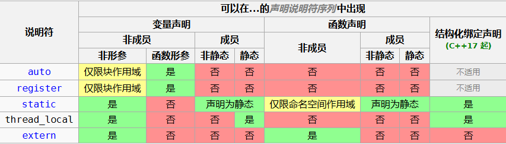

[现代C++并发编程教程 | 现代C++并发编程教程](https://mq-b.github.io/ModernCpp-ConcurrentProgramming-Tutorial/)

# 基本概念

## 前言

- 并发，并行，线程，进程

  - 线程是轻量级进程，本课程仅讨论线程知识
  - 并发：指一个处理器同时处理多个任务。
    并行：指多个处理器或者是多核的处理器同时处理多个不同的任务。
    并发是逻辑上的同时发生（simultaneous），而并行是物理上的同时发生。

    所以说对于进程来说，可以并发，也可以并行；对于线程来说，也一样都可以，从写代码的角度来说，并发和并行没啥区别，可以当成一个东西

# 使用线程

## Hello World

```c++
#include <iostream>
#include <thread>  // 引入线程支持头文件

void hello(){     // 定义一个函数用作打印任务
    std::cout << "Hello World" << std::endl;
}

int main(){
    std::thread t{ hello };		    // 创建线程对象，并将该对象关联到一个线程资源上
    cout << t.joinable() << endl;	// true，表示当前对象t关联了一个活跃线程
    t.join();		// 阻塞，并等待t对应的线程执行完毕，执行完毕后会将joinable()中的值设为false
    cout << t.joinable() << endl;	// flase，表示当前对象t没有关联一个活跃线程
  
    std::thread t1{ };		// 默认构造创建线程对象，但是不会关联到具体的线程资源上
    cout << t1.joinable() << endl;	// false
}
```

解析：

- `std::thread t{ hello };` 创建了一个线程对象 `t`，将 `hello` 作为它的[可调用(Callable)]([https://blog.csdn.net/qq_43145072/article/details/103749956)对象**（此处我理解为函数指针和[闭包类的对象](https://blog.csdn.net/skdkjzz/article/details/43968449)）**在新线程中执行。**线程对象关联了一个线程资源**，在线程对象构造成功后，就自动在新线程中执行函数 `hello`。
- （看《C++并发编程》p24）启动了线程，你需要明确是要等待线程结束（加入式），还是让其自主运行（分离式）。如果 `std::thread` 对象销毁之前还没有做出决定，程序就会终止（ `std::thread` 的析构函数会调用 `std::terminate()` ）。
- `t.join();` 等待线程对象 `t` 关联的线程执行完毕，否则将一直阻塞。这里的调用是必须的，**因为程序结束时，相关联的子线程资源必须释放**，如果不调用，`std::thread` 的析构函数将调用 [`std::terminate()`](https://zh.cppreference.com/w/cpp/error/terminate) 无法正确析构。
- 这是因为我们创建线程对象 `t` 的时候就关联了一个活跃的线程，调用 `join()` 就是确保线程对象关联的线程已经执行完毕，然后会修改对象的状态，让 [`std::thread::joinable()`](https://zh.cppreference.com/w/cpp/thread/thread/joinable) 返回 `false`，表示线程对象目前没有关联活跃线程。`std::thread` 的析构函数，正是通过 `joinable()` 判断线程对象目前是否有关联活跃线程，如果为 `true`，那么就当做有关联活跃线程。**显然在thread类对象析构时，其对应的线程依然活跃是不正常的**，所以会调用 `std::terminate()`**（在noexcept修饰的函数中抛出异常时也会调用该函数）**。

## 当前环境支持的并发线程数

[看这里：当前环境支持的并发线程数](https://mq-b.github.io/ModernCpp-ConcurrentProgramming-Tutorial/md/02使用线程.html#当前环境支持并发线程数)

使用 [`hardware_concurrency`](https://zh.cppreference.com/w/cpp/thread/thread/hardware_concurrency) 函数可以获得我们当前硬件支持的并发线程数量，它是 `std::thread` 的静态成员函数。

针对并行求和的函数，只需要注意一个点：

```c++
for (std::size_t i = 0; i < num_threads; ++i) {
            auto end = std::next(start, chunk_size + (i < remainder ? 1 : 0));
            threads.emplace_back([start, end, &results, i] {
                results[i] = std::accumulate(start, end, value_type{});
            });
```

其中，在第三行的地方创建并启动了线程，且该线程的可调用对象是一个lambda函数。

emplace_back是一个函数模板，参数是形参包，将参数全部完美转发到内部，然后使用placement new（`new(&threads[index]) thread(lambda)`）在threads的尾部调用thread的有参构造函数原地构造线程对象并启动线程

## 线程管理

在 C++ 标准库中，没有直接管理线程的机制，只能通过对象关联线程后，**通过该对象来管理线程**。类 `std::thread` 的对象就是指代线程的对象，而我们本节说的“线程管理”，其实也就是指管理 `std::thread` 对象。（这句话很关键，好好理解）

### 启动新线程

[具体细节看这里](https://mq-b.github.io/ModernCpp-ConcurrentProgramming-Tutorial/md/02使用线程.html#启动新线程)

#### 默认构造

```c++
std::thread t; //  构造不表示线程的新 std::thread 对象
```

**默认构造**，`std::thread` 线程对象没有关联线程，也不会启动线程执行任务callable，后续会讲到，现在没啥用

#### 有参构造

想要构造的对象能启动线程，我们需要在构造时传递一个 `可调用（callable）对象`。在之前，我们传递的参数有 `函数名（就是函数指针）`，[#lambda表达式](../2-深入理解C++11/深入理解C++11.md#lambda函数)，当然，也可以传递 `函数对象`：

```c++
class Task{
public:
	void operator()()const {
		std::cout << "operator()()const\n";
	}
};

int main() {
	thread t(Task());	// 语义分析中，该语句被认为是函数申明
	t.join();
}
```

Oops！编译失败了，编译器会将第9行解析为函数声明，而不是类型对象的定义

- 原因：

  - 先看看我们最熟悉的函数申明：

    ```c++
    int test(int);
    ```

    其中参数列表中，只有形参类型，没有形参名称，是一个占位参数，很好理解
  - 再来看看第九行：

    ```c++
    thread t(Task());
    ```

    `thread`：函数返回类型

    `t`：函数名称

    `Task()`：函数形参类型，是个占位参数，分析如下：

    - `int a`：`a`为 `int`类型，其中 `int`表示类型名，`a`表示声明的具体变量
    - `Task (*p)()`：`p`为函数指针类型，其中 `Task(*)()`表示类型名，`p`表示声明的具体变量
    - `Task p()`：函数类型声明，`p`为函数类型，其中 `Task()`表示类型名，`p`表示声明的具体变量

    所以你发现了，`thread t(Task())`相当于 `thread t(Task p())`。但这并不准确，实际上是相当于 `thread t(Task (*p)())`，这是因为：

    > 在确定每个形参的类型后，类型是 “T 的数组”或某个**函数类型 T 的形参会调整为具有类型“指向 T 的指针”**。[文档](https://zh.cppreference.com/w/cpp/language/function#.E5.BD.A2.E5.8F.82.E7.B1.BB.E5.9E.8B.E5.88.97.E8.A1.A8)。
    >
    > ```c++
    > void test(int a[]) {
    > 	cout << sizeof(a) << endl;	// 8，a从int[]被调整为了int*
    > }
    > 
    > void test1(int (&a)[4]){
    >     cout << sizeof(a) << endl;	// 16，使用引用可以避免类型调整，不过函数形参类型不能写成int (&a)[]，因为实参类型为int[4]，对于编译器来说，int[4]和int[]是不同类型。
    > }
    > 
    > int main() {
    > 	int a[] = {1,2,3,4};
    > 	cout << sizeof(a) << endl;	// 16
    > 	test(a);
    > 	test1(a);
    > }
    > ```
    >
    > 拓展知识：[#类型退化](#decay类型退化)
    
    显然 `Task()`是个函数类型，它被调整为了指向这个函数类型的指针类型：`Task(*)()`。
  - 总结：
  
    通过上面分析，你会发现 `int test(int)`和 `thread t(Task())`都是只有一个占位参数的函数声明，很好理解。
- 解决办法：

  - thread初始化时使用[#列表初始化](../2-深入理解C++11/深入理解C++11.md#C++11列表初始化)：

    ```c++
    thread t{Task()};
    ```

    但注意，我们平时使用列表初始化时，如果类中有定义 `参数为initializer_list的构造函数`，则会优先调用此构造，而非多参构造函数。
  - 使用括号表达式：

    ```c++
    thread t((Task()));
    ```

#### 线程的执行策略

启动线程后（也就是构造 `std::thread` 对象）我们必须在线程对象的生存期结束之前，即 [`std::thread::~thread`](https://zh.cppreference.com/w/cpp/thread/thread/~thread) 调用之前，决定它的执行策略，是 [`join()`](https://zh.cppreference.com/w/cpp/thread/thread/join)（加入，可以理解成将子线程加入/合并进当前线程，使得当前线程的结束时间由两者中最晚结束的那个线程决定）还是 [`detach()`](https://zh.cppreference.com/w/cpp/thread/thread/detach)（分离，即当前线程和子线程分离）。

我们先前使用的就是 `join()`，我们聊一下 `detach()`，当 `std::thread` 线程对象调用了 `detach()`，那么就是**线程对象放弃了对线程资源的所有权，不再管理此线程，允许此线程独立的运行，在线程退出时释放所有分配的资源**。（很重要的一句话，好好理解）

放弃了对线程资源的所有权，也就是线程对象没有关联活跃线程了，此时 joinable 为 **`false`**。

在单线程的代码中，对象销毁之后再去访问，会产生[未定义行为](https://zh.cppreference.com/w/cpp/language/ub)，多线程增加了这个问题发生的几率。

比如函数结束，那么函数局部对象的生存期都已经结束了，都被销毁了，此时线程函数还持有函数局部对象的指针或引用。

```c++
int main() {
	int a = 100;
	thread t([&]() {
		this_thread::sleep_for(2s);
		cout << a << endl;
	});
	t.detach();						// 不会阻塞，可能产生潜在的未定义行为
	cout << t.joinable() << endl;	// 显然，分离后，当前线程对象不在管理原来的子线程，输出显然为false
}
// detach不会阻塞，就是线程分离了
// 分离后子线程可能还在执行的时候，主线程已经销毁释放资源了
// 如果子线程在主线程结束后依然访问主线程中的对象，那么就是未定义行为
// 本例中，使用cout（位于主线程的std中），访问a（位于主线程的main函数里）都是未定义行为。
```

这里需要点名批评几种蠢得死行为：

- `join()`后又 `detach()`

  人家 `join()`本来就是等待线程执行结束的，线程都执行结束了，就没必要 `detach()`了
- `detach()`后又 `join()`

  `detach()`后子线程和主线程中的线程对象都分离了，再来 `join()`有什么意义吗

#### 异常

```c++
struct Task; // 复用之前
void f(){
	int n = 0;
	thread t{ Task{} };
	try{
		throw exception();	// 抛出异常
	}
	catch (exception& e){
		t.join(); // 1
		throw e;			// catch住异常后要再次抛出
	}
	t.join();    // 2
}

int main() {
	try {
		f();
	}
	catch (...) {
		cout << "异常" << endl;
	}
}
```

解释：

- 不能通过主线程来处理子线程的异常，异常处理是线程自己的事

  ```c++
  void f(){
  	int n = 0;
  	try{
  		thread t{ Task{} };		// 编译错误
  	}
  	catch (exception& e){
  		t.join(); // 1
  		throw e;			// catch住异常后要再次抛出
  	}
  	t.join();    // 2
  }
  ```

- 为什么需要两个`t.join()`，为什么catch住异常后需要再次抛出

  第一个`t.join()`用于确保在**catch住异常后**，子线程正常执行完成，线程对象正常析构

  第二个`t.join()`用于确保在**不发生异常时**，子线程正常执行完成，线程对象正常析构

  `throw e`用于保证在执行完第一个`t.join()`后，不会执行到第二个`t.join()`

- 当然也可以改成这样：

  ```c++
  void f(){
  	int n = 0;
  	thread t{ Task{} };
  	try{
  		throw exception();		// 抛出异常
  	}
  	catch (exception& e){
  		t.join(); // 1
  		cout << "异常" << endl;	// 在当前函数就处理了异常
  	}
  	
  	if (t.joinable()) {		// 先判断一下能不能join()
  		t.join();    // 2
  	}
  }
  
  ```

### RAII

“[资源获取即初始化](https://zh.cppreference.com/w/cpp/language/raii)”(RAII，Resource Acquisition Is Initialization)。

简单的说是：***构造函数申请资源，析构函数释放资源，让对象的生命周期和资源绑定***。当异常抛出时，C++ 会自动调用对象的析构函数。

```c++
class thread_guard{
private:
	std::thread m_Thr;
public:
	template<typename Callable_Ty, typename... Args>
	explicit thread_guard(Callable_Ty&& obj, Args&&... args)
			: m_Thr(std::forward<Callable_Ty>(obj), std::forward<Args>(args)...)
	{}

	~thread_guard(){
		if (m_Thr.joinable()) { // 线程对象当前关联了活跃线程
			m_Thr.join();
		}
	}
	thread_guard(const thread_guard&) = delete;
	thread_guard& operator=(const thread_guard&) = delete;
};
```

解释：

- 哈哈这是我自己写的，叼吧
- 构造函数使用[#完美转发](../2-深入理解C++11/深入理解C++11.md#完美转发？？？)来创造线程对象，保证时间消耗少，
- 析构函数用于判断该函数是否能`join()`，并在`析构函数`中等待监控的子线程`m_Thr`执行完毕
- 复制赋值和复制构造定义为 `=delete` ，显然如果`thread_guard`能被复制，则`thread`也会被跟着复制，这是肯定不行的，**一个`线程资源`只能被一个`线程类对象`管理监视，一个`线程类对象`也只能管理一个`线程资源`**。
- 通过使用RAII，我们就不用像上一节那样写多个`join()`了

使用：

```c++
void f(){
    int n = 0;
    thread_guard tg{ func{n}, 10 };
    throw exception();
}

int main() {
    try {
       f();
    }
    catch (exception e) {
       cout << "异常" << endl;
    }
    //f();	
}
```

注意只有在抛出的异常被捕获时，thread_guard的析构函数才会被调用

### decay类型退化

[std::decay - cppreference.com](https://zh.cppreference.com/w/cpp/types/decay)

- 定义

  - 头文件 `<type_traits>`

    ```c++
    template< class T >
    struct decay; // (since C++11)
    ```

  - 辅助类型
    ```c++
    template< class T >
    using decay_t = typename decay<T>::type; // (since C++14)
    ```

- 作用

  进行等价于**按值传递函数实参**时进行的类型转换。正式而言：

  - 如果 `T` 是“`U` 的数组”或到它的引用，那么成员 `typedef type` 是 `U*`。

  - 否则，如果 `T` 是函数类型 `F` 或到它的引用，那么成员 `typedef type` 是 `std::add_pointer<F>::type`。

  - 否则，成员 `typedef type` 是 `std::remove_cv<std::remove_reference<T>::type>::type`。

  如果程序添加了 `std::decay` 的特化，那么行为未定义。

- 实现（要先看懂作用，再带着对作用的理解看实现）

  ```c++
  // cppreference
  template<class T>
  struct decay
  {
  private:
      typedef typename std::remove_reference<T>::type U;
  public:
      typedef typename std::conditional< 
          std::is_array<U>::value,
          typename std::add_pointer<typename std::remove_extent<U>::type>::type,
          typename std::conditional< 
              std::is_function<U>::value,
              typename std::add_pointer<U>::type,
              typename std::remove_cv<U>::type
          >::type
      >::type type;
  };
  // MSVC
  template <class _Ty>
  struct decay { // determines decayed version of _Ty
      using _Ty1 = remove_reference_t<_Ty>;
      using _Ty2 = typename _Select<is_function_v<_Ty1>>::template _Apply<add_pointer<_Ty1>, remove_cv<_Ty1>>;
      using type = typename _Select<is_array_v<_Ty1>>::template _Apply<add_pointer<remove_extent_t<_Ty1>>, _Ty2>::type;
  };
  ```

- 使用示例：

  ```c++
  #include <iostream>
  #include <type_traits>
   
  template <typename T, typename U>
  struct decay_equiv : 
      std::is_same<typename std::decay<T>::type, U>::type 
  {};
   
  int main()
  {
      std::cout << std::boolalpha
                << decay_equiv<int, int>::value << '\n'    // 情况3
                << decay_equiv<int&, int>::value << '\n'  // 情况3
                << decay_equiv<int&&, int>::value << '\n'  // 情况3
                << decay_equiv<const int&, int>::value << '\n'  // 情况3
                << decay_equiv<int[2], int*>::value << '\n' // 情况1
                << decay_equiv<int(int), int(*)(int)>::value << '\n'; // 情况2
  }
  ```

### 传递参数

> - 一般情况下，不论线程函数中的参数类型是否为引用，在参数传递时都是先使用[`decay_t`](https://zh.cppreference.com/w/cpp/types/decay)确定退化后的参数类型，然后通过复制构造函数/移动构造函数构造出一个新的[退化后的纯右值副本](https://zh.cppreference.com/w/cpp/standard_library/decay-copy)（也就是`decay_t`中获得的类型），存入`tuple`中，并将指针传给`unique_ptr`，然后将指针传入子线程中，然后子线程再将该副本作为函数实参传入可调用对象，所以当函数参数类型为普通类型`T`和右值类型`T&&`时，可以按预期正常使用，类型为`T&`时，需要使用`ref()`才行（看不懂先看下面）
>
>   ```c++
>   void f(int a, move_only&& mo, int& b) { }
>   int main() {
>       move_only mo;	// move_only是一个只能默认构造，移动构造的类。
>       int m = 2;
>       std::thread t { f, m, move(mo), ref(m) };
>       t.join();
>   }
>   ```

- 容易出现的问题

  向可调用对象传递参数很简单，我们前面也都写了，只需要将这些参数作为 `std::thread` 的构造参数即可。需要注意的是，这些参数会复制到新线程的内存空间中，即使函数中的参数是引用，依然**实际是复制**。

  ```c++
  void f(int, const int& a) {
      std::cout << &a << '\n'; 
  }
  
  int main() {
      int n = 1;
      std::cout << &n << '\n';
      std::thread t { f, 3, n };
      t.join();
  }
  ```

  问题：

  - `&a`和`&n`两者值不同

    说明在一般情况下，主线程向子线程传递参数时是**值传递**

  - 如果去掉函数`f`中参数`a`的const修饰，则编译失败

    这是因为 `std::thread` 内部会将保有的参数副本转换为**右值表达式进行传递**，这是为了那些**只支持移动的类型**，左值引用没办法引用右值表达式，所以产生编译错误。

    ```c++
    // 只支持默认构造和移动构造
    struct move_only {
        move_only() { std::puts("默认构造"); }
        move_only(move_only&&)noexcept {
            std::puts("移动构造");
        }
        
        move_only(const move_only&) = delete;
    };
    
    void f(move_only mo){}	// 线程函数
    
    int main(){
        move_only obj;
        std::thread t{ f,std::move(obj) };
        t.join();
    }
    // 默认构造
    // 移动构造
    // 移动构造
    ```

    没有 `std::ref` 自然是会保有一个副本，所以有两次移动构造，第一次是在 `std::thread` 中通过移动构造函数移动构造了一个`move(obj)`的副本，第二次是调用函数 `f`。

- 解决办法：

  使用标准库的 [`std::ref`](https://zh.cppreference.com/w/cpp/utility/functional/ref) 、 `std::cref` 函数模板

  ```c++
  void f(int, int& a) {
      std::cout << &a << '\n'; 
  }
  
  int main() {
      int n = 1;
      std::cout << &n << '\n';
      std::thread t { f, 3, std::ref(n) };	// 使用ref，此时&a，&n两者值相同
      t.join();
  }
  ```

  解释：

  - `std::ref`(reference)函数模板返回一个包装类`std::reference_wrapper<T>`，该类是包装引用对象的类模板，将对象包装，可以隐式转换为被包装对象的引用（在本例中用来包装对象n，并可以隐式转换为n的引用）。
  - `std::cref`(const reference)同理，返回`std::reference_wrapper<const T>`，不过它是转换为包装对象的const引用。

- 在子线程中执行类的成员函数

  [**成员函数指针**](https://zh.cppreference.com/w/cpp/language/pointer#.E6.88.90.E5.91.98.E5.87.BD.E6.95.B0.E6.8C.87.E9.92.88)也是[*可调用*](https://zh.cppreference.com/w/cpp/named_req/Callable)(*Callable*)的 ，可以传递给 `std::thread` 作为构造参数，让其关联的线程执行成员函数。

  ```c++
  struct X{
      void task_run(int& n)const;
  };
  int main(){
  	X x;
  	int n = 0;
  	std::thread t{ &X::task_run, &x, ref(n) };
  	t.join();
  }
  
  ```

  解释：

  - 类的成员函数前面要加限定符
  - 成员函数第一个隐藏默认实参是该类的对象指针
  - 和之前一样，引用传递要用`ref()`

  当然还能用`bind()`

  ```c++
  struct X {
      void task_run(int& a)const{
          std::cout << &a << '\n';
      }
  };
  int main(){
  	X x;
  	int n = 0;
  	std::cout << &n << '\n';
  	std::thread t{ std::bind(&X::task_run, &x, ref(n)) };
  	t.join();
  }
  
  ```

  解释：

  - bind()忘了看[#这里](../C++八股文/C++学习难点.md#非静态函数)
  - `std::bind` 也是默认按值[**复制**](https://godbolt.org/z/c5bh8Easd)的，所以和我们之前的处理一样，引用需要使用`ref()`
  
- [#总结看开头](#传递参数)

#### 传递参数中的bug悬空引用

> - `std::thread` 构造仅代表“创建并使子线程进入就绪态”，而可调用对象由对应的，进入运行态的子线程进行调用。

- 前置知识

  **A的引用只能引用A，或者以任何形式转换到A**

  ```c++
  int main() {
      double a = 1;
      //int& p = a;   编译失败
      const int& p = a;
  }
  ```

  解释：

  - a隐式转换到了int类型，转换后的结果是**纯右值表达式**，所以需要用`const int&`或者`int&&`来接收

- 问题代码

  ```c++
  void f(const std::string&){}
  void test(){
      char buffer[1024]{};
      //todo.. code
      std::thread t{ f,buffer };
      t.detach();
  }
  ```

  解释：

  - buffer 是一个数组对象，作为 `std::thread` 构造参数的传递的时候会[*`decay-copy`*](https://zh.cppreference.com/w/cpp/standard_library/decay-copy) （确保实参在按值传递时会退化） **隐式转换为了指向这个数组的指针**。

  - 本例中线程创建，执行流程

    `std::thread` 的构造函数中调用了创建线程的函数（windows 下可能为 [`_beginthreadex`](https://learn.microsoft.com/zh-cn/cpp/c-runtime-library/reference/beginthread-beginthreadex?view=msvc-170)），它将我们传入的参数，f、buffer ，传递给这个函数，在新线程中执行函数 `f`。也就是说，调用和执行 `f(buffer)` 并不是说要在 `std::thread` 的构造函数中，而是在创建的新线程中，具体什么时候执行，取决于操作系统的调度，所以完全有可能函数 `test` 先执行完，而新线程此时还没有进行 `f(buffer)` 的调用，转换为`std::string`，那么 buffer 指针就**悬空**了，会导致问题。

  解决办法：

  - 将 `detach()` 替换为 `join()`。
  - `thread`构造时显式将 `buffer` 转换为 `std::string`。

### std::this_thread

[看这里就好了，没什么难的](https://mq-b.github.io/ModernCpp-ConcurrentProgramming-Tutorial/md/02使用线程.html#std-this-thread)

### `std::thread`转移所有权

> - 一个线程对象有且仅能拥有一个线程资源，一个线程资源能且仅能被一个线程对象持有
> - 所有权的转移，可以通过 `移动构造`，`移动赋值`，`swap()` 进行

传入可调用对象以及参数，构造 `std::thread` 对象，启动线程，而线程对象拥有了线程的所有权，线程是一种系统资源，所以可称作“*线程资源*”。

std::thread 不可复制。两个 std::thread 对象不可表示一个线程，std::thread 对线程资源是独占所有权。而**移动**操作可以将一个 `std::thread` 对象的线程资源所有权转移给另一个 `std::thread` 对象。

```c++
void f() {}
int main() {
	thread t1(f);
	thread t2(move(t1));	// 通过移动构造将t1持有的线程资源转移给t2
	thread t3 = move(t2);	// 通过移动赋值将t2持有的线程资源转移给t3
	thread t4 = thread(f);	// 临时对象也是右值表达式
	swap(t3, t4);			// 通过swap交换t3，t4的线程资源
}
```

函数返回 `std::thread` 对象：

```c++
std::thread f(){
    std::thread t{ [] {} };
    return t;
}

int main(){
    std::thread rt = f();
    rt.join();
}
```

解释：

- [#请耐心看完这里](../2-深入理解C++11/深入理解C++11.md#右值引用，移动语义，完美转发)
- 在关闭rvo/nrvo的情况下，一共发生了三次构造（默认构造，移动构造，移动构造）

所有权通过函数参数传递：

> 根据函数栈帧相关理解，函数调用传参，实际上是初始化了（构造）形参的对象

```c++
void f(std::thread t){
    t.join();
}

int main(){
    std::thread t{ [] {} };
    f(std::move(t));
    f(std::thread{ [] {} });
}
```

## std::thread构造-源码解析

[详细看这里：std::thread 的构造-源码解析](https://mq-b.github.io/ModernCpp-ConcurrentProgramming-Tutorial/md/详细分析/01thread的构造与源码解析.html)

重点关注`thread(_Fn&& _Fx, _Args&&... _Ax)`这个函数的实现

## 实现joining_thread

[使用线程 | 现代C++并发编程教程](https://mq-b.github.io/ModernCpp-ConcurrentProgramming-Tutorial/md/02使用线程.html#实现-joining-thread)

根据教案中的代码，优化[#本章节](#RAII)代码

## C++20 std::jthread

[看看这里，了解就好了](https://mq-b.github.io/ModernCpp-ConcurrentProgramming-Tutorial/md/02使用线程.html#c-20-std-jthread)

# 共享数据

本章节主要内容：

- 多线程共享数据的问题
- 使用互斥量保护共享数据
- 保护共享数据的其它方案
- 有关线程安全的其它问题

在上一章内容，我们对于线程的基本使用和管理，可以说已经比较了解了，甚至深入阅读了部分的 `std::thread` 源码。所以如果你好好学习了上一章，本章也完全不用担心。

我们本章，就要开始聊共享数据的那些事

## 条件竞争

- 前置知识：

  [线程安全（thread-safe）介绍-CSDN博客](https://blog.csdn.net/liitdar/article/details/81030176)
  
  - 定义：
  
    “线程安全”和“线程不安全”的相关内容，都是在涉及**多线程编程**时才会用到，在单线程的场景下无需考虑。至于为何需要多线程编程，请参考此文。
  
    在操作系统中，线程是由进程创建的，线程本身几乎不占有系统资源，线程用到的系统资源是属于进程的。**一个进程可以创建多个线程，这些线程共享着进程中的资源。**所以，当这些线程并发运行时，如果同时对一个数据（该数据属于进程，被该进程下的多个线程共享使用）进行修改，那么就可能造成该数据表现出不符合我们预期的变化，这就是所谓的**线程不安全**。
  
    与线程不安全对应，在拥有共享数据的多个线程并行执行的程序中，**线程安全**的代码会通过（自身实现的）同步机制保证各个线程都可以正常且正确的执行，不会出现**数据污染**等意外情况。
  
    从代码角度来说，假设进程中有多个线程在同时运行，而这些线程可能会同时运行一段代码，如果这段代码在多线程并发情况下的运行结果与单线程运行时是一样的，并且其他变量的值也和预期一样，那么这段代码就是线程安全的。
  
    从接口的角度来说，如果一个类（或者程序）提供的接口，对于（调用该接口的）线程来说是**原子的**，或者多个线程之间的切换不会导致该接口的执行结果存在二义性，这样在调用该接口时就无需额外考虑线程同步问题，那么该接口就是线程安全的。
  
    线程安全问题都是由**全局变量**或**静态变量**引起的。如果每个线程中对全局变量或静态变量只有读操作，而无写操作，那么这个全局变量或静态变量是线程安全的；如果有多个线程同时对全局变量或静态变量执行写操作，则一般都需要考虑**线程同步**，否则就可能影响线程安全。
  
  - 类的线程安全
  
    线程安全的类，首先必须在单线程环境中有**正确行为**：如果一个类的实现正确（即符合规格说明），那么对这个类的对象的任何操作序列（读或写公共字段以及调用公共方法），都不会让该对象处于无效状态，或者违反类的任何不可变量、前置条件或者后置条件的情况。
  
    此外，一个类要成为线程安全的，在被多个线程同时访问时，不管这些线程是怎样的时序安排或者交错，该类必须仍然具备上述的**正确行为**，并且调用代码不需要进行任何额外的**线程同步操作**。其效果是，在所有线程看来，对于（线程安全）对象的操作是以固定的、全局一致的顺序发生的。
  
- 良心的条件竞争

  > 没有对共享数据进行读写，或者使用线程安全的函数对共享数据读写，或者对是原子变量的共享数据进行读写的线程，即使在多线程的情况下发生了条件竞争，都是**良性的条件竞争**，**良性的条件竞争是线程安全的**

  在多线程的情况下，每个线程都抢着完成自己的任务。在大多数情况下，即使会改变执行顺序，也是良性竞争，这是无所谓的。比如两个线程都要往标准输出输出一段字符，谁先谁后并不会有什么太大影响。

  ```c++
  void f() { std::cout << "❤️\n"; }
  void f2() { std::cout << "😢\n"; }
  
  int main(){
      std::thread t{ f };
      std::thread t2{ f2 };
      t.join();
      t2.join();
  }
  ```

  > [`std::cout`](https://zh.cppreference.com/w/cpp/io/cout) 的 operator<< 调用是线程安全的，不会被打断。即：*同步的 C++ 流保证是线程安全的（从多个线程输出的单独字符可能交错，但无数据竞争）*

- 恶性的条件竞争

  > 只有在涉及多线程读写相同共享数据的时候，才会导致“*恶性的条件竞争*”。

  ```c++
  std::vector<int>v;
  
  void f() { v.emplace_back(1); }
  void f2() { v.erase(v.begin()); }
  
  int main() {
      std::thread t{ f };
      std::thread t2{ f2 };
      t.join();
      t2.join();
      std::cout << v.size() << '\n';
  }
  ```

  比如这段代码就是典型的恶性条件竞争，两个线程共享一个 `vector`，并对它进行修改。可能导致许多问题，比如 `f2` 先执行，此时 `vector` 还没有元素，导致抛出异常。又或者 `f` 执行了一半，调用了 `f2()`，等等。

  当然了，也有可能先执行 f，然后执行 f2，最后打印了 0，程序老老实实执行完毕。

  但是我们显然不能寄希望于这种操作系统的调度。

  而且即使不是一个添加元素，一个删除元素，全是 `emplace_back` 添加元素，也一样会有问题，由于 std::vector 不是线程安全的容器，因此当多个线程同时访问并修改 v 时，可能会发生[*未定义的行为*](https://zh.cppreference.com/w/cpp/language/memory_model#.E7.BA.BF.E7.A8.8B.E4.B8.8E.E6.95.B0.E6.8D.AE.E7.AB.9E.E4.BA.89)。具体来说，当两个线程同时尝试向 v 中添加元素时，但是 `emplace_back` 函数却是可以被打断的，执行了一半，又去执行另一个线程。可能会导致数据竞争，从而引发*未定义*的结果。

  > 当某个表达式的求值写入某个内存位置，而另一求值读或修改同一内存位置时，称这些**表达式冲突**。**拥有两个冲突的求值的程序就有数据竞争**，除非
  >
  > - 两个求值都在同一线程上，或者在同一信号处理函数中执行，或
  > - 两个冲突的求值都是原子操作（见 std::atomic），或
  > - 一个冲突的求值发生早于 另一个（见 std::memory_order）
  >
  > **如果出现数据竞争，那么程序的行为未定义。**

  标量类型等都同理，有*数据竞争*，[*未定义行为*](https://zh.cppreference.com/w/cpp/language/memory_model#.E7.BA.BF.E7.A8.8B.E4.B8.8E.E6.95.B0.E6.8D.AE.E7.AB.9E.E4.BA.89)：

  ```c++
  int cnt = 0;
  auto f = [&]{cnt++;};
  std::thread t1{f}, t2{f}, t3{f}; // 未定义行为
  ```

## 使用互斥量

- 定义：

  互斥量（Mutex），又常被称为互斥锁、互斥体（或者直接被称作“锁”），是一种用来保护**临界区**[[1\]](指的是一个访问共享资源的程序片段，而这些共享资源又无法同时被多个线程访问的特性。在临界区中，通常会使用同步机制，比如我们要讲的互斥量（Mutex）。)的特殊对象，其相当于实现了一个公共的“**标志位**”。它可以处于锁定（locked）状态，也可以处于解锁（unlocked）状态：

  1. 如果互斥量是锁定的，通常说某个特定的线程正持有这个锁。
  2. 如果没有线程持有这个互斥量，那么这个互斥量就处于解锁状态。
  3. 一般而言，我们需要把`互斥锁`和`临界区`/`临界区资源`放在同一个作用域下。**使得不同的线程在访问临界区/临界区资源时，也可以访问到互斥锁，且一把锁能且只能对应唯一的临界区/临界区资源，反之亦然**。当线程函数想要访问`临界区`/`临界区资源`时，应该先尝试上锁，只有上锁成功才能访问临界区/临界资源

- 示例：

  ```c++
  #include <mutex> // 必要标头
  std::mutex m;	 // 互斥锁变量应当视情况放在临界区/临界区资源的当前作用域（临界区资源为成员变量时）/父作用域（临界区在普通函数中时），其作用是为了让不同的线程在访问临界区/临界区资源时，可以访问到互斥锁，且一把锁能且只能对应唯一的临界区/临界区资源，反之亦然，详情见 死锁 章节
  
  void f() {
      m.lock();	// 上锁
      std::cout << std::this_thread::get_id() << '\n';
      m.unlock();	// 解锁
  }
  
  int main() {
      std::vector<std::thread>threads;
      for (std::size_t i = 0; i < 10; ++i)
          threads.emplace_back(f);
  
      for (auto& thread : threads)
          thread.join();
  }
  ```

  解释：

  - 当多个线程执行函数 `f` 的时候，只有一个线程能成功调用 `lock()` 给互斥量上锁，其他所有的线程 `lock()` 的调用将阻塞执行，直至获得锁。第一个调用 `lock()` 的线程得以继续往下执行，执行我们的 `std::cout` 输出语句，不会有任何其他的线程打断这个操作。直到线程执行 `unlock()`，就解锁了互斥量。**此举保证了`get_id()`和`'\n'`的输出在同一个时间片内**
  - 被 `lock()` 和 `unlock()` 包含在其中的代码是线程安全的，同一时间只有一个线程执行，不会被其它线程的执行所打断。

### std::lock_guard

> - 使用 RAII 思想的锁的管理类

不过一般不推荐这样显式的 `lock()` 与 `unlock()`，我们可以使用 C++11 标准库引入的“管理类”[`std::lock_guard`](https://zh.cppreference.com/w/cpp/thread/lock_guard)：

- 使用示例：

  ```c++
  void f() {
      std::lock_guard<std::mutex> lc{ m };
      std::cout << std::this_thread::get_id() << '\n';
  }
  ```

- 原理：

  ```c++
  template <class _Mutex>
  class lock_guard { // class with destructor that unlocks a mutex
  public:
      using mutex_type = _Mutex;
  
      explicit lock_guard(_Mutex& _Mtx) : _MyMutex(_Mtx) { // construct and lock
          _MyMutex.lock();
      }
  
      lock_guard(_Mutex& _Mtx, adopt_lock_t) noexcept // strengthened
          : _MyMutex(_Mtx) {} // construct but don't lock
  
      ~lock_guard() noexcept {
          _MyMutex.unlock();
      }
  
      lock_guard(const lock_guard&)            = delete;
      lock_guard& operator=(const lock_guard&) = delete;
  
  private:
      _Mutex& _MyMutex;
  };
  ```

  解释：

  - 只保有一个私有数据成员，一个引用，用来引用互斥量。
  - 构造函数中初始化这个引用，同时上锁，析构函数中解锁，这是一个非常典型的 `RAII` 式的管理。
  - 同时它还提供一个有额外[`std::adopt_lock_t`](https://zh.cppreference.com/w/cpp/thread/lock_tag_t)参数的构造函数 ，如果使用这个构造函数，则构造函数不会上锁。
  - 管理类，自然不可移动不可复制，所以定义复制构造与复制赋值为[弃置函数](https://zh.cppreference.com/w/cpp/language/function#.E5.BC.83.E7.BD.AE.E5.87.BD.E6.95.B0)，同时[阻止](https://zh.cppreference.com/w/cpp/language/rule_of_three#.E4.BA.94.E4.B9.8B.E6.B3.95.E5.88.99)了移动等函数的隐式定义。

- 示例：

  ```c++
  void f(){
      //code..
      {
          std::lock_guard<std::mutex> lc{ m };
          // 涉及共享资源的修改的代码...
      }
      //code..
  }
  ```

  解释：

  使用 `{}` 创建了一个块作用域，限制了对象 `lc` 的生存期，进入作用域构造 `lock_guard` 的时候上锁（lock），离开作用域析构的时候解锁（unlock）。

  - 我们要尽可能的让互斥量上锁的**粒度**小，只用来确保必须的共享资源的线程安全。

  > **“粒度”通常用于描述锁定的范围大小，较小的粒度意味着锁定的范围更小，因此有更好的性能和更少的竞争。**

- 更加复杂的示例：

  ```c++
  std::mutex m;
  
  void add_to_list(int n, std::list<int>& list) {
      std::vector<int> numbers(n + 1);
      std::iota(numbers.begin(), numbers.end(), 0);
      int sum = std::accumulate(numbers.begin(), numbers.end(), 0);
  
      {	// 通过作用域控制lock_guard只给必要的代码上锁
          std::lock_guard<std::mutex> lc{ m };
          list.push_back(sum);
      }
  }
  void print_list(const std::list<int>& list){
      std::lock_guard<std::mutex> lc{ m };
      for(const auto& i : list){
          std::cout << i << ' ';
      }
      std::cout << '\n';
  }
  ```

  解释：

  [看这里](https://mq-b.github.io/ModernCpp-ConcurrentProgramming-Tutorial/md/03共享数据.html#std-lock-guard)

- 补充知识：

  C++17 还引入了一个新的“管理类”：[`std::scoped_lock`](https://zh.cppreference.com/w/cpp/thread/scoped_lock)，它相较于 `lock_guard`的区别在于，**它可以管理多个互斥量**。不过对于处理一个互斥量的情况，它和 `lock_guard` 几乎完全相同。

  ```c++
  std::mutex m;
  std::scoped_lock lc{ m }; // std::scoped_lock<std::mutex>
  ```

  我们在后续管理多个互斥量，会详细了解这个类。

### try_lock

> 不论是`try_lock()`还是`lock()`，都保证不了什么，他们只能保证**在同一时间，只有一个线程能访问被互斥锁包围起来的代码块**。也就是说，线程在执行被互斥锁包围住的代码块时，也可以被其他正在执行的线程打断，并不是说被互斥锁包围住的代码块一定会在一个时间片内执行完；只是说线程在执行被互斥锁包围住的代码块时，其他线程无法执行该代码块。如果不懂，请看下面的例子

- 定义：

  `try_lock` 是互斥量中的一种尝试上锁的方式。与常规的 `lock` 不同，`try_lock` 会尝试上锁，但如果锁已经被其他线程占用，则**不会阻塞当前线程，而是立即返回**。

  它的返回类型是 `bool` ，如果上锁成功就返回 `true`，失败就返回 `false`。

- 示例：

  这种方法在多线程编程中很有用，特别是在需要保护临界区的同时，又不想线程因为等待锁而阻塞的情况下。

  ```c++
  std::mutex mtx;
  
  void thread_function(int id) {
      // 尝试加锁
      if (mtx.try_lock()) {
          std::cout << "thread: " << id << " get lock" << std::endl;
          // 临界区代码
          std::this_thread::sleep_for(std::chrono::milliseconds(100)); // 模拟临界区操作
          mtx.unlock(); // 解锁
          std::cout << "thread: " << id << " release lock" << std::endl;
      } else {
          std::cout << "thread_fail: " << id << " get lock failed, handling......" << std::endl;
      }
  }
  ```

  如果有两个线程运行这段代码，必然有一个线程无法成功上锁，要走 else 的分支。

  ```c++
  std::thread t1(thread_function, 1);
  std::thread t2(thread_function, 2);
  
  t1.join();
  t2.join();
  ```

  输出结果：

  ```text
  thread: thread_fail: 1 get lock
  2thread:  get lock failed, handling......1
   release lock
  ```

  解释：

  - 注意第一行：被互斥锁包围的代码块在输出完"thread: "后时间片结束，转到了另一个线程，说明被互斥锁包围的代码块，并不能保证全在一个时间片内执行完毕，只能保证在**同一时间只有一个线程能访问被互斥锁包围的代码块**。
  - 想改也很简单，把这些`cout`语句合并成一个就好了

## 保护共享数据

互斥量主要也就是为了保护共享数据，上一节的*使用互斥量*也已经为各位展示了一些。

然而使用互斥量来保护共享数据也并不是在函数中加上一个 `std::lock_guard` 就万事大吉了。有的时候只需要一个指针或者引用，就能让这种保护**形同虚设**。

```c++
class Data{
    int a{};
    std::string b{};
public:
    void do_something(){
        // 修改数据成员等...
    }
};

class Data_wrapper{
    Data data;
    std::mutex m;
public:
    template<class Func>
    void process_data(Func func){
        std::lock_guard<std::mutex> lc{m};
        func(data);  // 受保护数据传递给函数
    }
};

Data* p = nullptr;

void malicious_function(Data& protected_data){
    p = &protected_data; // 受保护的数据被传递到外部
}

Data_wrapper d;

void foo(){
    d.process_data(malicious_function);  // 传递了一个恶意的函数
    p->do_something();                   // 在无保护的情况下访问保护数据
}
```

成员函数模板 `process_data` 看起来一点问题也没有，使用 `std::lock_guard` 对数据做了保护，但是调用方传递了 `malicious_function` 这样一个恶意的函数，使受保护数据传递给外部，可以在没有被互斥量保护的情况下调用 `do_something()`。

我们传递的函数就不该是涉及外部副作用的，就应该是单纯的在受互斥量保护的情况下老老实实调用 `do_something()` 操作受保护的数据。

- *简而言之：**切勿将受保护数据的指针或引用传递到互斥量作用域之外**，不然保护将**形同虚设**。*

> `process_data` 的确算是没问题，用户非要做这些事情也是防不住的，我们只是告诉各位可能的情况。

## 死锁：问题与解决

> - 从表现形式上来说，死锁是由**多个线程**（多个线程执行的可能是同一个函数，也可以是不同的函数）使用多个互斥锁时，尝试给该资源的互斥锁上锁的顺序，时间不一致导致的。
> - 解决方法：让两个互斥量使用相同顺序上锁，或者使用`lock()`一次性锁住多个互斥量

- 前言：

  试想一下，有一个玩具，这个玩具有两个部分，必须同时拿到两部分才能玩。比如一个遥控汽车，需要遥控器和玩具车才能玩。有两个小孩，他们都想玩这个玩具。当其中一个小孩拿到了遥控器和玩具车时，就可以尽情玩耍。当另一个小孩也想玩，他就得等待另一个小孩玩完才行。再试想，遥控器和玩具车被放在两个不同的地方，并且两个小孩都想要玩，并且一个拿到了遥控器，另一个拿到了玩具车。问题就出现了，除非其中一个孩子决定让另一个先玩，他把自己的那个部分给另一个小孩。但如果他们都不愿意，那么这个遥控汽车就谁都没有办法玩。

  我们当然不在乎小孩抢玩具，我们要聊的是线程对锁的竞争：*两个线程需要对它们所有的互斥量做一些操作，其中每个线程都有一个互斥量，且等待另一个线程的互斥量解锁。因为它们都在等待对方释放互斥量，没有线程工作。* 这种情况就是死锁。

- 问题代码一：

  避免死锁的一般建议是让两个互斥量以相同的顺序上锁，总在互斥量 B 之前锁住互斥量 A，就通常不会死锁。反面示例：

  ```c++
  std::mutex m1,m2;
  std::size_t n{};
  
  void f(){
      std::lock_guard<std::mutex> lc1{ m1 };
      this_thread::sleep_for(5ms);
      std::lock_guard<std::mutex> lc2{ m2 };
      ++n;
  }
  void f2() {
      std::lock_guard<std::mutex> lc2{ m2 };
      this_thread::sleep_for(5ms);
      std::lock_guard<std::mutex> lc1{ m1 };
      ++n;
  }
  ```

  解释：

  - `f` 与 `f2` 因为互斥量**上锁顺序不同**，就有死锁风险。函数 `f` 先锁定 `m1`，然后再尝试锁定 `m2`，而函数 `f2` 先锁定 `m2` 再锁定 `m1` 。如果两个线程同时运行，它们就可能会彼此等待对方释放其所需的锁，从而造成死锁。
  - 更改其中一个函数中的lc1，lc2的顺序即可

- 问题代码二：

  但是有的时候即使固定锁顺序，依旧会产生问题。当有多个互斥量保护同一个类的对象时，对于相同类型的两个不同对象进行数据的交换操作，为了保证数据交换的正确性，就要避免其它线程修改，确保每个对象的互斥量都锁住自己要保护的区域。

  ```c++
  struct X{
      X(const std::string& str) :object{ str } {}
  
      friend void swap(X& lhs, X& rhs);
  private:
      std::string object;
      std::mutex m;
  };
  
  void swap(X& lhs, X& rhs) {
      if (&lhs == &rhs) return;
      std::lock_guard<std::mutex> lock1{ lhs.m };
      this_thread::sleep_for(5ms);
      std::lock_guard<std::mutex> lock2{ rhs.m }; 
      swap(lhs.object, rhs.object);
  }
  ```

  考虑用户调用的时候将参数交换，就会产生死锁：

  ```c++
  X a{ "🤣" }, b{ "😅" };
  std::thread t{ [&] {swap(a, b); } };  // 1
  std::thread t2{ [&] {swap(b, a); } }; // 2
  ```

- 解决方法：

  - `std::lock<>()`

    - 简介：

      它能循环尝试锁住传入的所有的互斥量，要么全部成功，要么全部失败，没有死锁风险

    - 使用方法：

      ```c++
      void swap(X& lhs, X& rhs) {
          if (&lhs == &rhs) return;
          std::lock(lhs.m, rhs.m);    // 给两个互斥量上锁
          swap(lhs.object, rhs.object);
          lhs.m.unlock();
          rhs.m.unlock();
      }
      ```

    - 源码阅读（仅传入两个参数时）：

      建议从下往上看，最好复制到IDE中看

      ```c++
      template <class _Lock>
      struct _NODISCARD _Unlock_one_guard {
          explicit _Unlock_one_guard(_Lock& _Lk) noexcept : _Lk_ptr(_STD addressof(_Lk)) {}
      
          ~_Unlock_one_guard() noexcept {
              if (_Lk_ptr) {
                  _Lk_ptr->unlock();
              }
          }
      
          _Unlock_one_guard(const _Unlock_one_guard&)            = delete;
          _Unlock_one_guard& operator=(const _Unlock_one_guard&) = delete;
      
          _Lock* _Lk_ptr;
      };
      
      template <class _Lock0, class _Lock1>
      bool _Lock_attempt_small(_Lock0& _Lk0, _Lock1& _Lk1) {
          // attempt to lock 2 locks, by first locking _Lk0, and then trying to lock _Lk1 returns whether to try again
          _Lk0.lock();
          {
              _Unlock_one_guard<_Lock0> _Guard{_Lk0};
              if (_Lk1.try_lock()) {
                  _Guard._Lk_ptr = nullptr;
                  return false;
              }
          }// 这个花括号是用于作用域保护，使得_Guard离开此作用域时自动释放
      
          _STD this_thread::yield();
          return true;
      }
      
      template <class _Lock0, class _Lock1>
      void _Lock_nonmember1(_Lock0& _Lk0, _Lock1& _Lk1) {
          // lock 2 locks, without deadlock, special case for better codegen and reduced metaprogramming for common case
          while (_Lock_attempt_small(_Lk0, _Lk1) && _Lock_attempt_small(_Lk1, _Lk0)) { // keep trying
          }
      }
      
      _EXPORT_STD template <class _Lock0, class _Lock1, class... _LockN>
      void lock(_Lock0& _Lk0, _Lock1& _Lk1, _LockN&... _LkN) { // lock multiple locks, without deadlock
          _Lock_nonmember1(_Lk0, _Lk1, _LkN...);
      }
      ```

  - `std::scoped_lock<>`（C++17起）

    - 简介：

      `std::lock<>()`的管理类，可以自动unlock所有传入的互斥锁

    - 使用方法：

      ```c++
      void swap(X& lhs, X& rhs) {
          if (&lhs == &rhs) return;
          std::scoped_lock guard{ lhs.m, rhs.m };
          swap(lhs.object, rhs.object);
      }
      ```

    - 源码阅读（传入多个参数时）：

      其实就是将`lock()`包装了一下，可以自动`unlock()`

      ```c++
      _EXPORT_STD template <class... _Mutexes>
      class _NODISCARD_LOCK scoped_lock { // class with destructor that unlocks mutexes
      public:
          explicit scoped_lock(_Mutexes&... _Mtxes) : _MyMutexes(_Mtxes...) { // construct and lock
              _STD lock(_Mtxes...);
          }
      
          explicit scoped_lock(adopt_lock_t, _Mutexes&... _Mtxes) noexcept // strengthened
              : _MyMutexes(_Mtxes...) {} // construct but don't lock
      
          ~scoped_lock() noexcept {
              _STD apply([](_Mutexes&... _Mtxes) { (..., (void) _Mtxes.unlock()); }, _MyMutexes);
          }
      
          scoped_lock(const scoped_lock&)            = delete;
          scoped_lock& operator=(const scoped_lock&) = delete;
      
      private:
          tuple<_Mutexes&...> _MyMutexes;
      };
      ```

      解释：

      - 析构函数中的`apply`

        [std::apply - cppreference.com](https://zh.cppreference.com/w/cpp/utility/apply)

- 杂谈：

  死锁是多线程编程中令人相当头疼的问题，并且死锁经常是不可预见，甚至难以复现，因为在大部分时间里，程序都能正常完成工作。我们可以**通过一些简单的规则，约束开发者的行为，帮助写出“无死锁”的代码**。

  - **避免嵌套锁**

    线程获取一个锁时，就别再获取第二个锁。每个线程只持有一个锁，自然不会产生死锁。如果必须要获取多个锁，使用 `std::lock` 。

  - **避免在持有锁时调用外部代码**

    这个建议是很简单的：因为代码是外部提供的，所以没办法确定外部要做什么。外部程序可能做任何事情，包括获取锁。在持有锁的情况下，如果用外部代码要获取一个锁，就会违反第一个指导意见，并造成死锁（有时这是无法避免的）。当写通用代码时（比如[保护共享数据](https://mq-b.github.io/ModernCpp-ConcurrentProgramming-Tutorial/md/03共享数据.html#保护共享数据)中的 `Date` 类）。这不是接口设计者可以处理的，只能寄希望于调用方传递的代码是能正常执行的。

  - **使用固定顺序获取锁**

    如同第一个示例那样，固定的顺序上锁就不存在问题。

## std::unique_lock 灵活的锁

- 简介：

  [`std::unique_lock<>`](https://zh.cppreference.com/w/cpp/thread/unique_lock) 是 C++11 引入的一种通用互斥包装器，它相比于 `std::lock_guard` 更加的灵活。当然，它也更加的复杂，尤其它还可以与我们下一章要讲的[条件变量](https://zh.cppreference.com/w/cpp/thread#.E6.9D.A1.E4.BB.B6.E5.8F.98.E9.87.8F)一起使用。使用它可以将之前使用 `std::lock_guard` 的 `swap` 改写一下：

  ```c++
  void swap(X& lhs, X& rhs) {
      if (&lhs == &rhs) return;
      std::unique_lock<std::mutex> lock1{ lhs.m, std::defer_lock };
      std::unique_lock<std::mutex> lock2{ rhs.m, std::defer_lock };
      std::lock(lock1, lock2);
      swap(lhs.object, rhs.object);
  }
  ```

- 源码解析：

  此处应该打开msvc STL的实现

  **重点关注`_Validate()`(验证mutex是否可以上锁)以及变量`_Owns`的变化**

  - ```c++
    _EXPORT_STD _INLINE_VAR constexpr adopt_lock_t adopt_lock{};	// adopt：接收，采纳
    _EXPORT_STD _INLINE_VAR constexpr defer_lock_t defer_lock{};	// defer：推迟
    _EXPORT_STD _INLINE_VAR constexpr try_to_lock_t try_to_lock{};
    ```

    温馨提示：翻译要跟着锁的状态来理解

  - 数据成员：

    ```c++
    private:
        _Mutex* _Pmtx = nullptr;
        bool _Owns    = false;
    ```

    解释：

    - `_Owns`：表示成员`_Pmtx`是否已经被**当前线程**拥有（`_Owns`为`true`时，表示`_Pmtx`已经被上锁了，也可以理解成已经有线程持有`_Pmtx`；`_Owns`为`false`时，表示`_Pmtx`还没有被当前线程所拥有。

  - 构造函数：

    - 一元构造函数

      ```c++
      explicit unique_lock(_Mutex& _Mtx)
          : _Pmtx(_STD addressof(_Mtx)), _Owns(false) { // construct and lock
          _Pmtx->lock();
          _Owns = true;
      }
      ```

      解释：

      - 只有一元构造函数在构造的时候给互斥锁上锁，其他的都需要手动上锁

    - 二元构造函数（重载一）

      ```c++
      unique_lock(_Mutex& _Mtx, adopt_lock_t) noexcept // strengthened
          : _Pmtx(_STD addressof(_Mtx)), _Owns(true) {} // construct and assume already locked
      ```

      解释：

      - 第二个参数中的`adopt`表示接受，采纳。说明在`unique_lock`构造之前，互斥量就已经上锁了

    - 二元构造函数（重载二）

      ```c++
      unique_lock(_Mutex& _Mtx, defer_lock_t) noexcept
          : _Pmtx(_STD addressof(_Mtx)), _Owns(false) {} // construct but don't lock
      ```

      解释：

      - 第二个参数中的`defer`表示推迟。互斥量需要在`unique_ptr`构造完成之后上锁

    - 二元构造函数（重载三）

      ```c++
      unique_lock(_Mutex& _Mtx, try_to_lock_t)
          : _Pmtx(_STD addressof(_Mtx)), _Owns(_Pmtx->try_lock()) {} // construct and try to lock
      ```

      解释：

      - 注意`_Owns`的变化

    - 其他的构造函数自己看

  - `_Validate()`

    ```c++
    void _Validate() const { // check if the mutex can be locked
        if (!_Pmtx) {
            _Throw_system_error(errc::operation_not_permitted);
        }
    
        if (_Owns) {
            _Throw_system_error(errc::resource_deadlock_would_occur);
        }
    }
    ```

    不懂没关系，慢慢往后看

  - `lock()`

    ```c++
    void lock() { // lock the mutex
        _Validate();
        _Pmtx->lock();
        _Owns = true;
    }
    ```

    解释：

    - 显然，当互斥锁为空且当前线程已拥有该互斥锁时，不允许`lock()`，且在`lock()`后，立马设置当前线程已拥有该互斥锁

  - 析构函数：

    ```c++
    ~unique_lock() noexcept {
        if (_Owns) {
            _Pmtx->unlock();
        }
    }
    ```

    解释：

    - 没啥好说的，显然，已拥有的情况下才能`unlock`。

- 示例：

  ```c++
  mutex mtx1, mtx2, mtx3;
  void test()
  {
      // 使用 defer_lock
      unique_lock<mutex> unqlc1(mtx1, std::defer_lock);
  	unqlc1.lock();
      
      // 使用 adopt_lock
      mtx2.lock();
  	unique_lock<mutex> unqlc2(mtx2, std::adopt_lock);
  
      // 使用一元有参构造
  	unique_lock<mutex> unqlc3(mtx3);
  }
  ```

  以上是三种正确用法，其他用法都是错误的，显然很好理解
  
- 我们前面提到了 `std::unique_lock` 更加灵活，那么灵活在哪？很简单，它拥有 `lock()` 和 `unlock()` 成员函数，所以我们能写出如下代码：

  ```c++
  void f() {
      //code..
      
      std::unique_lock<std::mutex> lock{ m };
  
      // 涉及共享资源的修改的代码...
  
      lock.unlock(); // 解锁并释放所有权，析构函数不会再 unlock()
  
      //code..
  }
  ```

  而不是像之前 `std::lock_guard` 一样使用 `{}`。

  另外再聊一聊开销吧，其实倒也还好，多了一个 `bool` ，内存对齐，x64 环境也就是 `16` 字节。这都不是最重要的，主要是复杂性和需求，通常建议优先 `std::lock_guard`，当它无法满足你的需求或者显得代码非常繁琐，那么可以考虑使用 `std::unique_lock`。

## 总结

在“共享数据”章节中，我们现在已经学习了`std::mutex::lock()`，`std::mutex::try_lock()`，`std::mutex::unlock()`，`std::lock_guard<>`，`std::unique_lock<>`，`std::lock<>()`，`std::scoped_lock<>`这几个mutex库中的功能，总结如下：

- `std::mutex::lock()`，`std::mutex::unlock()`

  ```c++
  #include <mutex> // 必要标头
  std::mutex m;
  
  void f() {
      m.lock();	// 上锁
      // do_something()
      m.unlock();	// 解锁
  }
  ```

- `std::mutex::try_lock()`，`std::mutex::unlock()`

  ```c++
  std::mutex mtx;
  
  void thread_function(int id) {
      if (mtx.try_lock()) {		// 尝试加锁
          // do_something....
          mtx.unlock(); 			// 解锁
      } else {
          // do_something....
      }
  }
  ```

- `std::lock_guard<>`

  使用 RAII 思想的锁的管理类，仅能通过构造函数传递锁，自动`unlock()`。

  ```c++
  template <class _Mutex>
  class lock_guard { // class with destructor that unlocks a mutex
  public:
      using mutex_type = _Mutex;
  
      explicit lock_guard(_Mutex& _Mtx) : _MyMutex(_Mtx) { // construct and lock
          _MyMutex.lock();
      }
  
      lock_guard(_Mutex& _Mtx, adopt_lock_t) noexcept // strengthened
          : _MyMutex(_Mtx) {} // construct but don't lock
  
      ~lock_guard() noexcept {
          _MyMutex.unlock();
      }
  
      lock_guard(const lock_guard&)            = delete;
      lock_guard& operator=(const lock_guard&) = delete;
  
  private:
      _Mutex& _MyMutex;
  };
  ```

- `std::unique_lock<>`

  `std::lock_guard<>`的加强版，多了一个`_Owns`表示该对象是否持有锁，更加灵活，可以手动`lock()`，`unlock()`，也可以像`std::lock_guard<>`一样使用RAII自动`lock()`，`unlock()`

- `std::lock<>()`

  函数模板，用于解决死锁问题。可以一次性传递多个锁，传入的锁要么都上锁，要么都不上锁

- `std::scoped_lock<>`（C++17起）

  和`std::lock_guard<>`很像，`std::scoped_lock<>`是使用 RAII 思想的`std::lock<>()`的管理类。其构造函数可以接收多个锁，并能将这些锁全都自动上锁/解锁。

  ```c++
  template <class... _Mutexes>
  class scoped_lock { // class with destructor that unlocks mutexes
  public:
      explicit scoped_lock(_Mutexes&... _Mtxes) : _MyMutexes(_Mtxes...) { // construct and lock
          _STD lock(_Mtxes...);
      }
  
      explicit scoped_lock(adopt_lock_t, _Mutexes&... _Mtxes) noexcept // strengthened
          : _MyMutexes(_Mtxes...) {} // construct but don't lock
  
      ~scoped_lock() noexcept {
          _STD apply([](_Mutexes&... _Mtxes) { (..., (void) _Mtxes.unlock()); }, _MyMutexes);
      }
  
      scoped_lock(const scoped_lock&)            = delete;
      scoped_lock& operator=(const scoped_lock&) = delete;
  
  private:
      tuple<_Mutexes&...> _MyMutexes;
  };
  ```

## 在不同作用域传递互斥量

> - 互斥量本身**不可移动，不可复制**，只能通过移动指针达到传递互斥量的效果
> - 移动指针时要注意互斥量的生存期

- 基本概念：

  首先我们要明白，互斥量满足互斥体 (Mutex)的要求，**不可复制不可移动**。所以显然，mutex对象只能放在一个固定的位置，像下面代码中，`mtx`被创建之后，就只能放在main的作用域内，它的本体无法移动/复制到其他地方

  ```c++
  int main() {
      mutex mtx;
      //mutex mtx2(mtx);		// 编译错误
      //mutex mtx3(move(mtx));	 // 编译错误
      //mutex mtx4 = mtx;		// 编译错误
  }
  ```

  所以我们所谓在不同作用域内传递互斥量，传递的只是**指针**/**引用**而已，也就是说传递的只是它的浅层数据，mutex的本体依然被存放在原来的位置。且我们需要注意，**传递浅层数据时，我们也只能移动不能复制**。

- 传递mutex指针的类

  可以利用各种类来进行传递指针/引用，比如前面提到的 `std::unique_lock`。**它存储的是mutex指针，是只能移动不可复制的类，它移动即代表着对应的mutex指针和对指针的所有权转移给了另一个对象。**

  `std::unique_lock` 可以获取互斥量的所有权，而互斥量的所有权可以通过移动操作转移给其他的 `std::unique_lock` 对象。有些时候，这种转移（*就是调用移动构造*）是自动发生的，比如当[函数返回](https://zh.cppreference.com/w/cpp/language/return#.E8.87.AA.E5.8A.A8.E4.BB.8E.E5.B1.80.E9.83.A8.E5.8F.98.E9.87.8F.E5.92.8C.E5.BD.A2.E5.8F.82.E7.A7.BB.E5.8A.A8) `std::unique_lock` 对象。另一种情况就是得显式使用 [`std::move`](https://zh.cppreference.com/w/cpp/utility/move)，以下为`unique_lock`移动构造源码：

  ```c++
  unique_lock(unique_lock&& _Other) noexcept : _Pmtx(_Other._Pmtx), _Owns(_Other._Owns) {
      _Other._Pmtx = nullptr;
      _Other._Owns = false;
  }
  ```

- 使用`unique_ptr`进行传递的方法

  一种可能的使用是允许函数去锁住一个互斥量，并将互斥量的所有权转移到调用者上，所以调用者可以在这个锁保护的范围内执行代码。

  ```c++
  std::unique_lock<std::mutex> get_lock(){
      extern std::mutex some_mutex;
      std::unique_lock<std::mutex> lk{ some_mutex };
      return lk;
  }
  void process_data(){
      std::unique_lock<std::mutex> lk{ get_lock() };
      // 执行一些任务...
  }
  ```

  解释：

  - 在不同作用域之间传递`mutex`指针/引用时，**要特别注意互斥量的[生存期](https://zh.cppreference.com/w/cpp/language/lifetime)**。

    > extern 说明符只能搭配变量声明和函数声明（除了类成员或函数形参）。*它指定外部链接，而且技术上不影响存储期，但它不能用来定义自动存储期的对象，故所有 extern 对象都具有**静态或线程[存储期](https://zh.cppreference.com/w/cpp/language/storage_duration)。***

    如果你简单写一个 `std::mutex some_mutex` 那么函数 `process_data` 中的 `lk` 会持有一个悬垂指针。

    > 举一个使用 `extern std::mutex` 的完整[运行示例](https://godbolt.org/z/z47x1Es5z)。当然，其实理论上你 `new std::mutex` 也是完全可行...... 🤣🤣

  - 对于`unique_lock`而言，关闭rvo/nrvo的情况下，一共经历了三次构造（一元有参，移动，移动）
  - 在本例中，锁保护的范围从`std::unique_lock<std::mutex> lk{ some_mutex };`开始，到`process_data()`结束时结束。
  - `std::unique_lock` 是灵活的，同样允许在对象销毁之前就解锁互斥量，调用 `unlock()` 成员函数即可，不再强调。

## 保护共享数据的初始化过程

[共享数据 | 现代C++并发编程教程](https://mq-b.github.io/ModernCpp-ConcurrentProgramming-Tutorial/md/03共享数据.html#保护共享数据的初始化过程)

> - 一般讨论的比较多的是懒汉式的单例模式在多线程下的初始化过程。使用双检锁的形式线程不安全，因为new/reset并非原子操作，可以被其他线程中断。在C++11之后，应该使用call_once/静态局部变量保证绝对的线程安全

### 前言

保护共享数据并非必须使用互斥量，互斥量只是其中一种常见的方式而已，对于一些特殊的场景，也有专门的保护方式，比如**对于共享数据的初始化过程的保护**。我们通常就不会用互斥量，**这会造成很多的额外开销**。

我们不想为各位介绍其它乱七八糟的各种保护初始化的方式，我们只介绍三种：**双检锁（错误）**、**使用 `std::call_once`**、**静态局部变量初始化从 C++11 开始是线程安全**。

### 双检锁（错误）线程不安全？？？

[C++ 智能指针最佳实践&源码分析-腾讯云开发者社区-腾讯云？？？](https://cloud.tencent.com/developer/article/1922161)

[#单例模式](../C++八股文/C++学习难点.md#单例模式的线程安全问题)

[由std::once_call 引发的单例模式的再次总结，基于C++11 - 烟波--钓徒 - 博客园](https://www.cnblogs.com/xuhuajie/p/11647164.html)

当然上面的例子中，单例对象是个指针，但实际上我们一般用智能指针改进单例模式

```c++
// 不重要
class Singleton {
private:
    static shared_ptr<Singleton> m_spSingle;
    static mutex m_mtx;
public:
    //GetInstance
    static shared_ptr<Singleton> GetInstance() {
        if (m_spSingle == nullptr) {	// 未被锁保护的读取操作，存在潜在的条件竞争
            m_mtx.lock();
            if (m_spSingle == nullptr) {
                m_spSingle = make_shared<Singleton>();
            }
            m_mtx.unlock();
        }
        return m_spSingle;
    }
};
shared_ptr<Singleton> Singleton::m_spSingle = nullptr;
mutex Singleton::m_mtx;
```

解释：

- `make_shared<Type>()`与`new Type()`的区别：

  - `make_shared<Type>()`
    1. 它可以在单一的[内存分配](https://zhida.zhihu.com/search?content_id=240244745&content_type=Article&match_order=1&q=内存分配&zhida_source=entity)中同时分配对象的存储空间和[引用计数](https://zhida.zhihu.com/search?content_id=240244745&content_type=Article&match_order=1&q=引用计数&zhida_source=entity)控制块，从而提高内存分配效率并减少内存占用。
    2. 它是异常安全的，因为在构造对象时，如果抛出异常，不会留下未被删除的引用计数控制块。
    3. 使用 `std::make_shared` 简化了代码，避免了直接使用 `new` 操作符。
  - `new Type()`
    1. 这种方法涉及两次内存分配：一次用于对象，一次用于引用计数控制块，这比 `std::make_shared` 的单次内存分配效率低。
    2. 如果在 `std::shared_ptr` 构造函数参数列表中同时创建多个 `shared_ptr`，并且其中一个 `new` 表达式抛出异常，可能会导致内存泄露。

- 使用双检锁时，不论是使用new初始化，或者智能指针中的reset初始化，都不是线程安全的，因为new/reset并非原子操作，可以被其他线程打断（尽管`operator new()`本身线程安全，但并不代表该函数是原子操作，这点很重要！），分析如下（建议结合教案阅读）：

  在单例还未被创建时，线程A和线程B同时调用GetInstance()，假设线程A先获得时间片，时间片在执行到reset中，刚好为单例指针分配好内存空间，但是没调用构造函数初始化时，刚好结束，轮到线程B执行，对于此时的线程B而言，单例指针非空，所以直接返回指针。明显地，线程B中的单例指针初始化并不完全，所以线程不安全

  shared_ptr<>可以，但不是最好的选择，最好使用unique_ptr，同时GetInstance的返回值改为Singleton&。这样做的好处是会少占用一部分空间

### call_once配合once_flag

- 示例：

  ```c++
  // 重要
  class Singleton {
  private:
      static shared_ptr<Singleton> m_spSingle;
      // once_flag 用于防止多次初始化
      static once_flag oneflg;
  public:
      static shared_ptr<Singleton> GetInstance() {
          // call_once只接收两个参数，第一个为once_flag，第二个为可调用对象
          call_once(oneflg, []() {
              m_spSingle = make_shared<Singleton>();
              cout << "call once" << endl;
          });
          return m_spSingle;
      }
  };
  ```

  解释：

  - once_flag可以是类的静态/普通成员，也可以是全局变量，或者是静态局部变量，用于搭配call_once使用

  - call_once在第一次调用完后，便会给oneflg上标记，保证**只进行一次线程安全的初始化**。

- 注意事项：

  “**初始化**”，那自然是只有**一次**。但是 `std::call_once` 也有一些例外情况（比如异常）会让传入的可调用对象被多次调用，即“**多次**”初始化：

  ```c++
  // 建议自己拿去ide跑一下
  std::once_flag flag;
  int n = 0;
  
  void f(){
      std::call_once(flag, [] {
          ++n;
          std::cout << "第" << n << "次调用\n";
          throw std::runtime_error("异常");
      });
  }
  
  int main(){
      try{
          f();
      }
      catch (std::exception&){}
      
      try{
          f();
      }
      catch (std::exception&){}
  }
  ```

  解释：

  - 会调用两次call_once，很好理解，因为异常代表操作失败，需要进行回溯和重置状态，所以在call_once会多次调用可调用对象

### 静态局部变量

[必看：局部静态变量](https://blog.csdn.net/weixin_44470443/article/details/104503759)

[单例--Meyers' Singleton-CSDN博客](https://blog.csdn.net/weixin_44048823/article/details/104080864)

> - 静态局部变量初始化在 C++11 是线程安全
> - 静态局部变量存放在内存的**全局数据区**。
> - 静态局部变量在**编译期**赋初值，且**只赋值一次**。如果变量在初始化时，并发线程同时进入到static声明语句，并发线程会阻塞等待初始化结束，所以**静态局部变量具有线程安全性**。
> - 函数结束时，静态局部变量不会消失，每次该函数调用时，也不会为其重新分配空间。它始终驻留在全局数据区，直到程序运行结束。静态局部变量的初始化与全局变量类似．

- 静态局部变量示例：

  ```c++
  // 建议放在IDE里跑一跑
  class A {
  public:
      A(int _c) : c(_c){cout << "construct : " << c << endl;}
      static A& instance(int tmp) {
          static A a(tmp);
          return a;
      }
      int c;
  };
  
  int main() {
      int i = 1;
      A::instance(++i);
      A::instance(i++);
      A::instance(i);
      cout <<  A::instance(i).c << endl;
  }
  ```

  解释：

  - 明显的，只有在14行的代码里会进行初始化。

- 在单例模式中的应用：

  ```c++
  class A {
  public:
      static A& instance() {
          static A a;
          return a;
      }
      int c;
  };
  ```

### 线程安全的单例模式

- 饿汉式

  程序开始时就要。

  ```c++
  class Singleton_Hungry
  {
  public:
      static Singleton_Hungry& Instance(){
          static Singleton_Hungry _instance;	//对象在全局静态数据区
          //static Singleton_Hungry* p_instance = new Singleton_Hungry; 对象地址在全局静态数据区，对象在堆数据区，这种方式创建单例也是可以的
          return _instance;
      }
  private:
      Singleton_Hungry() = default;
      Singleton_Hungry(const Singleton_Hungry&) = delete;
      Singleton_Hungry(Singleton_Hungry&&) = delete;
      Singleton_Hungry& operator=(const Singleton_Hungry&) = delete;
      ~Singleton_Hungry() = default;
  };
  ```

  解释：

  - 静态局部变量会在第一次使用时初始化，多次调用被会编译器忽略，生命周期是程序的运行区间，并且是多线程安全的。
  - 静态局部变量是分配在全局静态数据区（不是堆或者栈），内存一直都在（默认全部填0，但不占程序大小`bss`段）。

- 懒汉式

  ```c++
  // 简单版本，建议拿到IDE上看
  class Singleton {
  private:
      static unique_ptr<Singleton, void(*)(Singleton*)> up;
  public:
      static Singleton& GetInstance() {
          static once_flag of;
          call_once(of, []() {
              up.reset(new Singleton);
              cout << "111" << endl;
          });
          return *up;
      }
  
      static void Destory(Singleton* p_sgl) {
          //p_sgl->~Singleton();  别犯蠢，指针的释放要使用delete才能释放干净。
          delete p_sgl;
          cout << "Destory" << endl;
      }
  
      void f(){ cout << "f" << endl;}
  private:
      Singleton() = default;
      Singleton(const Singleton&) = delete;
      Singleton(Singleton&&) = delete;
      Singleton& operator=(const Singleton&) = delete;
      ~Singleton(){ cout << "~Singleton" << endl;}
  };
  unique_ptr<Singleton, void(*)(Singleton*)> Singleton::up(nullptr, Singleton::Destory);
  ```

  解释：

  - 注意看16行的注释

  ```c++
  // 复杂版本，建议放到IDE中看
  
  // 懒汉式单例的基类
  template<typename T>    //T 是子类
  class Singleton_Lazy_Base {
  private:
      static unique_ptr<T, void(*)(T*)> up;
      static once_flag of;
  
      // 初始化函数也要写成static！！！
      template<typename ...Args>
      static void init(Args&&... args) {
          up.reset(new T(forward<Args>(args)...));
          cout << "init_multiArgs" << endl;
      }
  
      static void Destory(T* p_sgl) {
          delete p_sgl;
      }
  public:
      template<typename ...Args>
      static T& GetInstance(Args&&... args) {
          // lambda无法使用万能引用（C++20前），故此处使用模板函数完成完美转发
          call_once(of, Singleton_Lazy_Base<T>::init<Args...>, forward<Args>(args)...);
          return *up;
      }
  
      static T& GetInstance() {
          call_once(of, []() {
              up.reset(new T);
              cout << "init" << endl;
          });
          return *up;
      }
      
  	Singleton_Lazy_Base(const Singleton_Lazy_Base&) = delete;
  	Singleton_Lazy_Base(Singleton_Lazy_Base&&) = delete;
  	Singleton_Lazy_Base& operator=(const Singleton_Lazy_Base&) = delete;
  
  protected:
       Singleton_Lazy_Base() = default;
      ~Singleton_Lazy_Base(){ cout << "~Singleton" << endl;}
  };
  template<typename T>
  unique_ptr<T, void(*)(T*)> Singleton_Lazy_Base<T>::up(nullptr, T::Destory);
  template<typename T>
  once_flag Singleton_Lazy_Base<T>::of;
  
  // 具体的子类，一定要注意在CRTP中，不同子类继承的父类是不同的父类，所以static变量也是互不相通的，不同子类之间不会因为这些变量造成死锁
  class Single_CRTP : public Singleton_Lazy_Base<Single_CRTP>
  {
      friend class Singleton_Lazy_Base<Single_CRTP>;
  private:
  
      
  public:
      void test(){
          std::cout << "hello word" << std::endl;
      }
      
      Single_CRTP(const Single_CRTP&) = delete;
      Single_CRTP(Single_CRTP&&) = delete;
      Single_CRTP& operator=(const Single_CRTP&) = delete;
  private:
      Single_CRTP() = default;
      ~Single_CRTP(){ cout << "~Single_CRTP" << endl; };
  };
  ```
  
  解释：
  
  - `Singleton_Lazy_Base`顾名思义，懒汉式单例的基类，是个模板类；`Single_CRTP`是子类，继承于基类，注意继承时传给基类的模板实参，说明此处用了CRTP技术。
  - 为了防止用户直接使用子类/基类创建对象，此处应将子类的构造/析构函数都设为`private`，基类的构造/析构函数设为`protected`，并将基类设为子类的友元类
  - 由于析构函数也为私有，所以`unique_ptr`在释放的时候无法直接访问，需要自定义一个静态的删除函数，并在构造`unique_ptr`的时候显式指明删除器
  - 如果想通过`GetInstance`来调用CRTP类的多参数构造函数，则需要重载`GetInstance`并配合完美转发和`call_once`一起使用。不过lambda函数不支持万能引用（C++20前），所以需要额外实现一个新的静态的init函数。
  - 由于单例特性，赋值，拷贝，移动应当被删除。

## 保护不常更新的数据结构

> - 解决方式是使用读写锁，读写锁有两种形式：`std::shared_timed_mutex`（C++14），`std::shared_mutex`（C++17），两者几乎没区别。
>
> - 当需要读数据时，应该使用读写锁中的`lock_shared()`和`unlock_shared()`，或者使用读锁的RAII管理类模板`shared_lock<>`来封装读写锁对象。
>
>   当需要写数据时，和mutex一样，使用`lock()`和`unlock()`，或者使用写锁的RAII管理类模板`lock_guard<>`、`unique_lock<>`来封装读写锁对象。

- mutable，const，volatile的区别

  [C++深入理解mutable和volatile关键字 - 傍风无意 - 博客园](https://www.cnblogs.com/depend-wind/articles/12159971.html)

- 前言：

  试想一下，你有一个数据结构存储了用户的设置信息，每次用户打开程序的时候，都要进行读取，且运行时很多地方都依赖这个数据结构需要读取，所以为了效率，我们使用了多线程读写。这个数据结构很少进行改变，而我们知道，多线程读取，是没有数据竞争的，是安全的，但是有些时候又不可避免的有修改和读取都要工作的时候，所以依然必须得使用互斥量进行保护。

  然而使用 `std::mutex` 的开销是过大的，它不管有没有发生数据竞争（也就是就算全是读的情况）也必须是老老实实上锁解锁，只有一个线程可以运行。如果你学过其它语言或者操作系统，相信这个时候就已经想到了：“[***读写锁***](https://zh.wikipedia.org/wiki/读写锁)”。

- 读写锁介绍

  C++ 标准库自然为我们提供了： [`std::shared_timed_mutex`](https://zh.cppreference.com/w/cpp/thread/shared_timed_mutex)（C++14）、 [`std::shared_mutex`](https://zh.cppreference.com/w/cpp/thread/shared_mutex)（C++17）。它们的区别简单来说，前者支持更多的操作方式，后者有更高的性能优势。

  `std::shared_mutex` 同样支持 `std::lock_guard`、`std::unique_lock`。和 `std::mutex` 做的一样，保证*写线程*的独占访问。**而那些无需修改数据结构的*读线程*，可以使用 [`std::shared_lock`](https://zh.cppreference.com/w/cpp/thread/shared_lock) 获取访问权**，多个线程可以一起读取。

  ```c++
  class Settings {
  private:
      std::map<std::string, std::string> data_;
      //mutex_ 通常不算做类状态（只读/可读可写）的一部分，所以通常需要加上mutable
      mutable std::shared_mutex mutex_; // “M&M 规则”：mutable 与 mutex 一起出现
  
  public:
      void set(const std::string& key, const std::string& value) {
          std::lock_guard<std::shared_mutex> lock{ mutex_ };
          data_[key] = value;
      }
  
      std::string get(const std::string& key) const {	// mutex_ 只读函数中也可修改
          // 不用shared_lock，用mutex.lock_shared()和mutex_.unlock_shared()都可以
          std::shared_lock<std::shared_mutex> lock(mutex_);
          auto it = data_.find(key);
          return (it != data_.end()) ? it->second : ""; // 如果没有找到键返回空字符串
      }
  };
  ```

  `std::shared_timed_mutex` 具有 `std::shared_mutex` 的所有功能，并且额外支持超时功能。所以以上代码可以随意更换这两个互斥量。

## std::recursive_mutex

> - recursive：递归的
> - 对于`std::mutex`而言，在同一个线程多次调用同一个互斥量的`lock()`函数时，是未定义行为；只允许在不同线程中对同一个互斥量的锁定。
> - 对于`std::recursive_mutex`而言，允许在同一个线程多次调用同一个互斥量的`lock()`函数，当**解锁与锁定次数相匹配时，互斥量才会真正释放**；但同时不影响不同线程对同一个互斥量进行锁定的情况。
> - 可以用于递归函数中

- 定义：

  `std::recursive_mutex` 是 C++ 标准库提供的一种互斥量类型，它允许同一线程多次锁定同一个互斥量，而不会造成死锁。当同一线程多次对同一个 `std::recursive_mutex` 进行锁定时，**只有在解锁与锁定次数相匹配时，互斥量才会真正释放**。但它并不影响不同线程对同一个互斥量进行锁定的情况。不同线程对同一个互斥量进行锁定时，会按照互斥量的规则**进行阻塞**

  ```c++
  // 建议拿到IDE上自己跑一下
  std::recursive_mutex mtx;
  
  void recursive_function(int count) {
      // 递归函数，每次递归都会锁定互斥量
      mtx.lock();
      std::cout << "Locked by thread: " << std::this_thread::get_id() << ", count: " << count << std::endl;
      if (count > 0) {
          recursive_function(count - 1); // 递归调用
      }
      mtx.unlock(); // 解锁互斥量
  }
  int main() {
      std::thread t1(recursive_function, 3);
      std::thread t2(recursive_function, 2);
  
      t1.join();
      t2.join();
  }
  ```

  解释：

  - 根据规则，如果t1线程先执行，则t2线程会阻塞；如果t2线程先执行，则t1线程会阻塞。
  -  `unlock` 必须和 `lock` 的调用次数一样，才会真正解锁互斥量。

- 更加易读的做法：

  同样的，我们也可以使用 `std::lock_guard`、`std::unique_lock` 帮我们管理 `std::recursive_mutex`，而非显式调用 `lock` 与 `unlock`：

  ```c++
  void recursive_function(int count) {
      std::lock_guard<std::recursive_mutex> lc{ mtx };
      std::cout << "Locked by thread: " << std::this_thread::get_id() << ", count: " << count << std::endl;
      if (count > 0) {
          recursive_function(count - 1);
      }
  }
  ```

## new，delete的线程安全性？？？

[C++ 中 new 操作符内幕：new operator、operator new、placement new - slgkaifa - 博客园？？？](https://www.cnblogs.com/slgkaifa/p/6887887.html)

[operator new, operator new[] - cppreference.com？？？](https://zh.cppreference.com/w/cpp/memory/new/operator_new)

[new 表达式 - cppreference.com](https://zh.cppreference.com/w/cpp/language/new)

> - 对于`int* a = new int();`而言，`new int()`叫做new表达式，在执行new表达式的时候，会先调用`operator new`决定需要分配的内存大小，再调用对应的构造函数**（重要！！！）**。
>
> - 只有C++11以上的库函数版本的new，delete等分配/释放内存相关的库函数是线程安全的，但他们并非原子操作，是可以被打断的。
>
> - 但是在我们调用new/delete时，涉及到的不仅仅只有调用库函数这一个步骤，所以是否线程安全应该考虑以下几个方面：
>
>   1. `new` 表达式线程安全要考虑三方面：`operator new`、构造函数、修改指针。
>
>   2. `delete` 表达式线程安全考虑两方面：`operator delete`、析构函数。
>
>   3. C++ 只保证了 `operator new`、`operator delete` 这两个方面的线程安全（不包括用户定义的），其它方面就得自己保证了。前面的内容也都提到了。
>
> - 综上，**是否线程安全不能仅仅只看是否使用new/delete，还得看有没有涉及到数据竞争，共享变量**，要根据这些情况进行综合判定
>
> - **更加完善的回答**：首先需要知道：对于new表达式而言，会先调用`operator new`决定需要分配的内存大小，再调用对应的构造函数，最后返回构造好的对象的地址并赋值给对应的指针（`int* a = new int();`）。
>
>   所以这里其实有三方面需要考虑：1. `operator new`的库函数版本线程安全。2. 构造函数不一定线程安全。3. 赋值操作不一定线程安全。
>
> - 补充知识：对于new/delete表达式而言，申请和删除内存是线程安全的，因为操作系统全局有一把大锁，基本各语言和规定也能保证。

- 前言：

  如果你的标准达到 **C++11**，要求下列**函数**是线程安全的：

  - [`new` 运算符](https://zh.cppreference.com/w/cpp/memory/new/operator_new)和 [`delete` 运算符](https://zh.cppreference.com/w/cpp/memory/new/operator_delete)的**库**版本
  - 全局 `new` 运算符和 `delete` 运算符的用户替换版本
  - [`std::calloc`](https://zh.cppreference.com/w/cpp/memory/c/calloc)、[`std::malloc`](https://zh.cppreference.com/w/cpp/memory/c/malloc)、[`std::realloc`](https://zh.cppreference.com/w/cpp/memory/c/realloc)、[`std::aligned_alloc`](https://zh.cppreference.com/w/cpp/memory/c/aligned_alloc) (C++17 起)、[`std::free`](https://zh.cppreference.com/w/cpp/memory/c/free)

- 对局部变量使用new/delete：

  ```c++
  void f(){
      T* p = new T{};
      delete p;
  }
  ```

  解释：

  - 该代码在多线程执行`f()`时如果构造和析构不涉及共享资源，则显然线程安全
  - `::operator new`和`::operator delete`显然线程安全；局部对象 `p` 对于每个线程来说是独立的，也就是说每个线程都有其自己的 `p` 对象实例，它们不会共享同一个对象，没有数据竞争；如果构造和析构不涉及共享资源，则明显线程安全

- 对全局变量使用new/delete：

  如果 `p` 是全局对象（或者外部的，只要可被多个线程读写），多个线程同时对其进行访问和修改时，就可能会导致数据竞争和未定义行为。因此，确保全局对象的线程安全访问通常需要额外的同步措施，比如互斥量或原子操作。

  ```c++
  T* p = nullptr;
  void f(){
      p = new T{}; // 存在数据竞争
      delete p;
  }
  ```

  解释：

  - 显然线程不安全，new操作符结束之后，给p赋值时，涉及到数据竞争，线程不安全

- new/delete时涉及到的构造/析构函数有读写共享数据

  即使 `p` 是局部对象，如果构造函数（析构同理）涉及读写共享资源，那么一样存在数据竞争，需要进行额外的同步措施进行保护。

  ```c++
  int n = 1;
  
  struct X{
      X(int v){
          ::n += v;
      }
  };
  
  void f(){
      X* p = new X{ 1 }; // 存在数据竞争
      delete p;
  }
  ```

  解释：

  - 这是第一种情况种的变体版本，在构造函数中读写共享变量，显然线程不安全

- 自定义的operator new/operator delete

  值得注意的是，如果是自己重载 `operator new`、`operator delete` 替换了库的**全局**版本，那么它的线程安全就要我们来保证。

  ```c++
  // 全局的 new 运算符，替换了库的版本
  void* operator new  (std::size_t count){
      return ::operator new(count); 
  }
  ```

  以上代码是线程安全的，因为 C++11 保证了 new 运算符的库版本，即 `::operator new` 是线程安全的，我们直接调用它自然不成问题。如果你需要更多的操作，就得使用互斥量之类的方式保护了。

- 总结：

  总而言之，`new` 表达式线程安全要考虑三方面：`operator new`、构造函数、修改指针。

  `delete` 表达式线程安全考虑两方面：`operator delete`、析构函数。

  C++ 只保证了 `operator new`、`operator delete` 这两个方面的线程安全（不包括用户定义的），其它方面就得自己保证了。前面的内容也都提到了。

## 存储类说明符

[必看：存储类说明符 - cppreference.com](https://zh.cppreference.com/w/cpp/language/storage_duration)

以下关键词是*存储类说明符* ：

```c++
auto			// (C++11 前) 
register		// (C++17 前) 
static
thread_local	// (C++11 起) 
extern
mutable
```

*声明说明符序列* 中只能出现一个存储类说明符，但 thread_local 可以与 static 或 extern 一起出现(C++11 起)。

mutable 不会影响存储期。它的用法参考 [const/volatile](https://zh.cppreference.com/w/cpp/language/cv)。

其他存储类说明符可以在以下声明的*声明说明符序列* 中出现：



由上，thread_local可以修饰：1. 静态成员。2. 普通/静态全局变量。3. 普通/静态局部变量

## 线程存储期

[必看：C++11中thread_local的使用](https://blog.csdn.net/fengbingchun/article/details/108691986)

> - 其实可以把线程存储期的变量和全局存储期的变量进行对比，会发现其实两者都差不多，只有在存储期上有差别。
> - `thread_local` 只对声明于命名空间作用域的对象、声明于块作用域的对象以及静态数据成员允许。它指示对象拥有**线程存储期**。它能与 `static` 或 `extern` 结合，以分别指定内部或外部链接（除了静态数据成员始终拥有外部链接），但附加的 `static` 不影响存储期。
> - **线程存储期**：对象的存储在线程开始时分配，而在线程结束时解分配。每个线程拥有其自身的对象实例。唯有声明为 `thread_local` 的对象拥有此存储期。 `thread_local` 能与 `static` 或 `extern` 一同出现，以调整链接。
> - **线程变量初始化时期**：
>   - 非局部变量（全局变量，类中的静态成员变量）：所有具有线程局部存储期的非局部变量的初始化，会**作为线程启动的一部分进行**，并按顺序早于线程函数的执行开始。
>   - 静态局部变量[[4]](https://mq-b.github.io/ModernCpp-ConcurrentProgramming-Tutorial/md/03共享数据.html#footnote4)（包括普通静态局部变量以及`thread_local`修饰的静态局部变量）：控制流首次**经过它的声明**时才会被初始化（除非它被[零初始化](https://zh.cppreference.com/w/cpp/language/zero_initialization)或[常量初始化](https://zh.cppreference.com/w/cpp/language/constant_initialization)）。在其后所有的调用中，声明都会被跳过。

- 定义：

  **线程本地存储 (TLS)**是 C++ 11 中引入的一项功能，允许多线程程序中的每个线程拥有自己单独的变量实例。简而言之，我们可以说每个线程都可以有自己独立的变量实例。每个线程都可以访问和修改自己的变量副本，而不会干扰其他线程。

- 线程本地存储 (TLS) 的属性

  - **生命周期：** TLS 变量的生命周期从初始化时开始，到线程终止时结束。
  - **可见性：** TLS 变量在线程级别具有可见性。
  - **作用域：**thread_local只改变了变量的生命周期，不会改变变量作用域。（static也一样，也就是说线程局部变量只能在当前作用域中访问，不能在其他的作用域或者其他函数中访问该局部变量）
  
- 实际效果

  - 对于全局中定义的`thread_local`变量而言，就是将全局变量在各个线程都copy一份，互不干扰独立使用。
  - 对于类中定义的`thread_local`成员变量而言，必须用`static`修饰，且同一个线程内的该类的多个对象都会共享一个变量实例，并且只会在第一次执行这个成员函数时初始化这个变量实例，这一点是跟类的静态成员变量类似的，**不过静态成员变量具有全局存储期，`thread_local`静态成员变量具有线程存储期**
  - 对于类的成员函数/普通函数中定义的`thread_local`变量而言，**默认是静态的**，且同一个线程内的该类的多个对象都会共享一个变量实例，并且只会在第一次执行这个成员函数时初始化这个变量实例，这一点是跟局部静态成员变量类似的，**不过局部静态变量具有全局存储期，`thread_local`局部静态变量具有线程存储期**

- 代码演示：

  ```c++
  class A {
  public:
      static thread_local int tmp1;
      void operator()() {
          static thread_local int tmp2 = 0;
          cout << this_thread::get_id() << " tmp1: " << tmp1++ << endl;
          cout << "  tmp2: " << tmp2++ << endl;
      }
  };
  thread_local int A::tmp1 = 0;
  
  // a, b是全局变量，对于线程来说，也就是共享数据，以此观测thread_local变量在不同线程，以及同一个线程不同对象中的表现
  A a;
  A b;
  void f() {	// 分别调用operator()
      a();
      b();
  }
  
  int main() {
      thread(f).join();
      thread(f).join();
      f();
  }
  ```

  结果：

  ```c++
  19220 tmp1: 0
    tmp2: 0
  19220 tmp1: 1
    tmp2: 1
  27608 tmp1: 0
    tmp2: 0
  27608 tmp1: 1
    tmp2: 1
  25908 tmp1: 0
    tmp2: 0
  25908 tmp1: 1
    tmp2: 1
  ```

  至于`thread_local`修饰的变量在何时初始化，看[#这里](#局部，全局，线程，CPU 变量对比与使用)：

  ```c++
  class A {
  public:
      static thread_local int tmp1;	// 线程静态成员变量
      void operator()() {
          cout << "function" << endl;
          static thread_local int tmp2 = (puts("init1"),0);	// 线程静态局部变量
      }
  };
  thread_local int A::tmp1 = (puts("init"),0);
  
  // a, b是全局变量，对于线程来说，也就是共享数据，以此观测thread_local变量在不同线程，以及同一个线程不同对象中的表现
  A a;
  A a1;
  void f() {	// 分别调用operator()
      a();
      a1();
  }
  
  int main() {
      cout << "main" << endl;
      f();
  }
  /************MSVC************/
  // init
  // main
  // function
  // init1
  // function
  /************g++************/
  // main
  // function
  // init1
  // function
  ```

  解释：

  1. 对于类中的thread_local静态成员变量而言，与thread_local静态全局变量类似，会在线程函数执行前初始化（不论是否创建A的对象，都会如此，也很好理解），但g++有优化：**g++会在首次使用线程全局静态变量的地方按顺序初始化所有的线程全局静态变量，而普通的全局静态变量则和MSVC一样，在主线程函数执行前就初始化**。

     ```c++
     thread_local static int aaa = (puts("aaa"), 0);
     thread_local static int bbb = (puts("bbb"), 1);
     int main() {
         cout << "main" << endl;
         cout << "---: " << bbb << endl;
     }
     // main
     // ---: aaa
     // bbb
     // 1
     ```

  2. 对于类中成员函数的thread_local静态局部变量而言，与thread_local静态局部变量类似，会在控制流首次经过声明时进行一次也是唯一一次的初始化。

- 应用场景：

  1. **线程特定数据**：有时，你可能需要为每个线程存储一些特定的数据，例如线程的 ID、状态或其他上下文信息。你可以使用 TLS 来存储这些数据。

  2. **避免全局变量**：全局变量在多线程环境中可能会引发数据竞争和同步问题。你可以使用 TLS 来替代全局变量，每个线程都有自己的变量副本，从而避免这些问题。

  3. **性能优化**：在一些情况下，使用 TLS 可以提高性能。例如，如果一个函数需要一个大的缓冲区，而这个函数在多个线程中都被频繁调用，那么每次调用都分配和释放缓冲区可能会影响性能。你可以使用 TLS 来为每个线程分配一个缓冲区，然后在多次调用之间重用这个缓冲区。

  4. **错误处理**：在一些编程环境中，例如 C，错误信息通常通过全局变量来传递。这在多线程环境中可能会引发问题，因为一个线程的错误可能会覆盖另一个线程的错误。你可以使用 TLS 来为每个线程存储错误信息，从而避免这个问题。
  
- [#总结](#线程存储期)

## CPU变量

CPU 变量的概念很好理解。就像线程变量为每个线程提供独立的对象实例，互不干扰一样，CPU 变量也是如此。在创建 CPU 变量时，系统上的每个 CPU [[2\]](https://mq-b.github.io/ModernCpp-ConcurrentProgramming-Tutorial/md/03共享数据.html#footnote2) 都会获得该变量的一个副本（比如4核心8线程的cpu，就会获得8个副本）。

在 Linux 内核中，从 2.6[[3\]](https://mq-b.github.io/ModernCpp-ConcurrentProgramming-Tutorial/md/03共享数据.html#footnote3) 版本开始引入了 **Per-CPU** 变量（Per-CPU variables）功能。Per-CPU 变量是为每个处理器单独分配的变量副本，旨在减少多处理器访问共享数据时的同步开销，提升性能。每个处理器只访问自己的变量副本，不需要进行同步操作，避免了数据竞争，增强了并行处理能力。

在 Windows 内核中，没有直接对应的 Per-CPU 变量机制。

本节是偏向概念的认识，而非实际进行内核编程，C++ 语言层面也并未提供此抽象。理解 CPU 变量的概念对于系统编程和内核开发非常重要。这些概念在面试和技术讨论中常常出现，掌握这些知识不仅有助于应对面试问题，也能提升对多处理器系统性能优化的理解。

## 局部，全局，线程，CPU 变量对比与使用？？？

在并发编程中，不同的变量有不同的使用场景和特点。以下是局部变量、全局变量、线程变量、CPU变量的对比：

- 局部变量（不考虑静态局部）

  - 它拥有自动存储期，随作用域开始分配，结束时释放。每个线程、每次调用都有独立实例，完全独立，几乎无需同步。

- 全局变量

  - 拥有 ***静态（static）*** [存储期](https://zh.cppreference.com/w/cpp/language/storage_duration#.E5.AD.98.E5.82.A8.E6.9C.9F)，它的存储在**程序**开始时分配，并在程序结束时解分配；且它在主函数执行之前进行[初始化](https://zh.cppreference.com/w/cpp/language/initialization#.E9.9D.9E.E5.B1.80.E9.83.A8.E5.8F.98.E9.87.8F)。

- 线程变量

  - 拥有**线程（thread）**存储期。它的存储在线程开始时分配，并在线程结束时解分配。每个线程拥有它自身的对象实例。只有声明为 thread_local 的对象拥有此存储期（不考虑非标准用法）。它的**初始化**需要考虑局部与非局部两种情况：

    - 非局部变量（全局变量，类中的静态成员变量）：所有具有线程局部存储期的非局部变量的初始化，会**作为线程启动的一部分进行**，并按顺序早于线程函数的执行开始。
    - 静态局部变量[[4]](https://mq-b.github.io/ModernCpp-ConcurrentProgramming-Tutorial/md/03共享数据.html#footnote4)（包括普通静态局部变量以及`thread_local`修饰的静态局部变量）：控制流首次**经过它的声明**时才会被初始化（除非它被[零初始化](https://zh.cppreference.com/w/cpp/language/zero_initialization)或[常量初始化](https://zh.cppreference.com/w/cpp/language/constant_initialization)）。在其后所有的调用中，声明都会被跳过。

  - 示例：

    ```c++
    thread_local int n = (puts("init n"), 0);
    
    void f() {
    	puts("thread f");
    }
    
    void f2() {
    	cout << "f2" << endl;
    	thread_local static int n = (puts("init f2 n"), 0);
    }
    
    int main() {
    	cout << "main" << endl;	// 主线程中的thread_local非局部变量初始化时期
    	cout << endl;
    
    	thread{f}.join();		// 子线程中的thread_local非局部变量初始化时期
    	cout << endl;
    
    	f2();					// 主线程中thread_local静态局部变量初始化时期
    	f2();
    }
    ```
    
    解释：
    
    - 其中`f()`用于观测thread_local全局静态变量的初始化时期，`f2()`用于观测thread_local局部静态变量的初始化时期。
    
    输出：
    
    ```c++
    init n
    main
        
    init n
    thread f
        
    f2
    init f2 n
    f2
    ```
    
    解释：
    
    - 对于thread_local全局静态变量而言：变量的初始化会**作为线程启动的一部分**，初始化时期早于线程函数运行时期（以上是msvc的实现，对于g++而言，只有在首次使用线程全局静态变量的地方按顺序初始化所有的线程全局静态变量）
    - 对于thread_local局部静态变量而言：控制流首次**经过它的声明**时才会被初始化

- CPU 变量

  - 它在标准 C++ 中无对应抽象实现，是操作系统内核功能。它主要依赖于当前系统内核来进行使用，也无法跨平台。基本概念与线程变量类似：CPU 变量是为每个处理器单独分配的变量副本。

- 总结

  - 局部变量适合临时数据，作用域结束自动释放，几乎[[看这里]](https://mq-b.github.io/ModernCpp-ConcurrentProgramming-Tutorial/md/03共享数据.html#footnote5)无需同步。

  - 全局变量适合整个程序的共享状态，但需要使用同步设施进行保护。

  - 线程变量适合线程的独立状态，通常[[看这里]](https://mq-b.github.io/ModernCpp-ConcurrentProgramming-Tutorial/md/03共享数据.html#footnote6)无需同步。

    ```c++
    // 在这种情况下需要同步，不过基本没人这么做，所以说通常
    thread_local static int aaa = 0;
    int* paaa = &aaa;
    void f() {
        *paaa = 11;
        cout << this_thread::get_id() << " " << *paaa << endl;
    }
    int main() {
        thread{f}.join();
        cout << this_thread::get_id() << " " << *paaa << endl;
    }
    // 2 11
    // 1 11
    ```

  - CPU 变量的使用是少见的，主要用于内核开发和追求极致性能的高并发场景，减少 CPU 同步开销。

  总而言之，结合实际使用即可，把这四种变量拿出来进行对比，增进理解，加深印象

## 总结

本章讨论了多线程的共享数据引发的恶性条件竞争会带来的问题。并说明了可以使用互斥量（`std::mutex`）保护共享数据，并且要注意互斥量上锁的“**粒度**”。C++标准库提供了很多工具，包括管理互斥量的管理类（`std::lock_guard`），但是互斥量只能解决它能解决的问题，并且它有自己的问题（**死锁**）。同时我们讲述了一些避免死锁的方法和技术。还讲了一下互斥量所有权转移。然后讨论了面对不同情况保护共享数据的不同方式，使用 `std::call_once()` 保护共享数据的初始化过程，使用读写锁（`std::shared_mutex`）保护不常更新的数据结构。以及特殊情况可能用到的互斥量 `recursive_mutex`，有些人可能喜欢称作：**递归锁**。然后聊了一下 `new`、`delete` 运算符的库函数实际是线程安全的。最后介绍了一下线程存储期、CPU 变量，和各种变量进行了一个对比。

下一章，我们将开始讲述同步操作，会使用到 [**Futures**](https://zh.cppreference.com/w/cpp/thread#.E6.9C.AA.E6.9D.A5.E4.BD.93)、[**条件变量**](https://zh.cppreference.com/w/cpp/thread#.E6.9D.A1.E4.BB.B6.E5.8F.98.E9.87.8F)等设施。

# 同步操作

> - 互斥量用来防止多个线程同时读写同一个共享资源
> - 信号量用来控制两个或多个线程的执行顺序。

"同步操作"是指在计算机科学和信息技术中的一种操作方式，其中不同的任务或操作按顺序执行，一个操作完成后才能开始下一个操作。在多线程编程中，各个任务通常需要通过**同步设施**（即互斥量，以及条件变量）进行相互**协调和等待**，确保我们的操作是同步操作，从而确保数据的**一致性**和**正确性**。

本章的主要内容有：

- 条件变量
- `std::future` 等待异步任务
- 在规定时间内等待
- Qt 实现异步任务的示例
- 其它 C++20 同步设施：信号量、闩与屏障

本章将讨论如何使用条件变量等待事件，介绍 future 等标准库设施用作同步操作，使用Qt+CMake 构建一个项目展示多线程的必要性，介绍 C++20 引入的新的同步设施。

## 等待事件或条件

- 情境引入

  假设你正在一辆夜间运行的地铁上，那么你要如何在正确的站点下车呢？

  1. 一直不休息，每一站都能知道，这样就不会错过你要下车的站点，但是这会很疲惫。

     这个叫”[忙等待](https://zh.wikipedia.org/wiki/忙碌等待)（busy waiting）”也称“**自旋**“。

     ```c++
     bool flag = false;
     std::mutex m;
     
     void wait_for_flag(){
         std::unique_lock<std::mutex> lk{ m };
         // 忙等待直到 flag 变为 true
         while (!flag){
             lk.unlock();
             // 忙等待循环体通常为空或者执行非阻塞操作
             lk.lock();
         }
     }
     ```

     注意：

     - 一直忙等待会造成线程时刻处于判断`flag`，执行循环体中代码的状态，这会导致占用过多的cpu资源，导致资源的浪费，所以应该尽量避免一直处于忙等待。
     - 之所以在`while`循环中要解锁，是因为`flag`是个共享变量，所以`m`其实和`flag`是“绑定”的，所以解锁操作其实是在期待有其他的线程可以将`flag`置为`true`。
     - 至于后面又重新上锁，原因也很简单，为了防止其他线程随意纂改`flag`的值或者其他和`flag`在一起的共享变量

  2. 可以看一下时间，估算一下地铁到达目的地的时间，然后设置一个稍早的闹钟，就休息。这个方法听起来还行，但是你可能被过早的叫醒，甚至估算错误导致坐过站，又或者闹钟没电了睡过站。

     ```c++
     void wait_for_flag(){
         std::unique_lock<std::mutex> lk{ m };
         while (!flag){
             lk.unlock();    // 1 解锁互斥量
             std::this_thread::sleep_for(50ms); // 2 休眠
             lk.lock();      // 3 上锁互斥量
         }
     }
     ```

     - 解释：
       - 这种方法会使得线程无意义的循环次数大幅减少，减少消耗的cpu资源，比第一种稍微好一点
       - 注意，调用 `sleep_for()` 时，当前线程将进入休眠态，直到50ms时间过去。这个操作会导致线程释放cpu资源，给其他线程运行的机会，所以会减少消耗的cpu资源。

  3. 事实上最简单的方式是，到站的时候有人或者其它东西能将你叫醒（比如手机的地图，到达设置的位置就提醒）。

     这个就是信号量，请看下面。

- 定义

  条件变量（Condition Variable）是一种用于线程同步的机制，通常与互斥锁（`Mutex`）一起使用。条件变量提供了一种线程间的通信机制，允许一个线程等待另一个线程满足某个条件后再继续执行。

  **注意**：在使用条件变量时，**必须确保与互斥锁一起使用，以避免竞态条件的发生**。

  C++ 标准库对条件变量有两套实现：[`std::condition_variable`](https://zh.cppreference.com/w/cpp/thread/condition_variable) 和 [`std::condition_variable_any`](https://zh.cppreference.com/w/cpp/thread/condition_variable_any)，这两个实现都包含在 [`<condition_variable>`](https://zh.cppreference.com/w/cpp/header/condition_variable) 头文件中。

  `condition_variable_any` 类是 `std::condition_variable` 的泛化。相对于只在 `std::unique_lock<std::mutex>` 上工作的 `std::condition_variable`，`condition_variable_any` 能在任何满足[`可基本锁定(BasicLockable)`](https://zh.cppreference.com/w/cpp/named_req/BasicLockable)要求的锁上工作，所以增加了 `_any` 后缀。显而易见，这种区分必然是 `any` 版**更加通用但是却有更多的性能开销**。所以通常**首选** `std::condition_variable`。有特殊需求，才会考虑 `std::condition_variable_any`。

- 示例：

  ```c++
  // 以下三个变量必须放在一起，让不同线程都能访问。
  std::mutex mtx; // 互斥量
  std::condition_variable cv; // 条件变量，必须和互斥量放在一起使用
  bool arrived = false;	// 状态，表示是否到达目的地
  
  // 此函数用于模拟“地铁上睡着的我”，“我”期待着地铁到站后能有人把我喊醒
  void wait_for_arrival() {
      std::unique_lock<std::mutex> lck(mtx);          // 上锁，且必须用unique_lock包装mtx
      cv.wait(lck, [] { return arrived; });
      std::cout << "到达目的地，可以下车了！" << std::endl;
  }
  
  // 此函数用于模拟“手机上的地图”，地图在到站后会唤醒我，并通知我地铁已经到站。
  void simulate_arrival() {
      std::this_thread::sleep_for(5ms); // 模拟地铁到站，假设5秒后到达目的地
      {
          std::lock_guard<std::mutex> lck(mtx);
          arrived = true; // 设置条件变量为 true，表示到达目的地
      }
      cv.notify_one(); // 通知等待的线程
  }
  int main(){
      thread t1(wait_for_arrival);
      thread t2(simulate_arrival);
      t1.join();
      t2.join();
  }
  ```

  解释：

  - 显然，我们有条件变量`cv`，状态位`flag`两个共享变量，所以需要也必须要添加一个互斥量。

  - 条件变量用于决定线程执行的先后顺序，对于本例而言，先执行的线程是t2，后执行的线程是t1。

  - 在t2的`simulate_arrival()`中：

    - 为了通知我地铁已经到站，需要做好以下两件事：
      1. 将共享的标志位`arrived`设为`true`（需要用`mtx`进行保护）
      2. 使用共享的条件变量`cv`唤醒我

  - 在t1的`wait_for_arrival()`中：

    - 为了能在地铁到站时我能被正常唤醒，输出到站信息，需要做好以下两件事：
      1. 将共享的互斥锁`mtx`用`unique_lock`封装起来（封装后`mtx`为`lock`状态）
      2. 调用`cv.wait()`，进入阻塞态，直至满足两个条件：**1.被t2唤醒（包括虚假唤醒） 2.谓词返回true**

  - `cv.wait(lck, [] { return arrived; });`

    - 前置知识：
      - 返回bool类型的`仿函数`称为**谓词**
      - 如果operator()接受一个参数，那么叫做`一元谓词`
      - 如果operator()接受两个参数，那么叫做`二元谓词`
      - 显然一元/二元谓词通过`bind()`可以转换为谓词

    - 源码实现：

      ```c++
      void wait(unique_lock<mutex>& _Lck) noexcept {
          _Cnd_wait(_Mycnd(), _Lck.mutex()->_Mymtx());
      }
      
      template <class _Predicate>
      void wait(unique_lock<mutex>& _Lck, _Predicate _Pred) {
          while (!_Pred()) {
              wait(_Lck);
          }
      }
      ```

      显然我们调用的是第二个`wait()`，他接收两个参数：`unique_lock`的对象和谓词

      第二个版本只是对第一个版本的**包装**，等待并判断谓词，会调用第一个版本的重载。这可以避免“[虚假唤醒（spurious wakeup）](https://en.wikipedia.org/wiki/Spurious_wakeup)”。

      > 条件变量虚假唤醒是指在使用条件变量进行线程同步时，有时候线程可能会在没有收到通知的情况下被唤醒。问题取决于程序和系统的具体实现。解决方法很简单，在循环中等待并判断条件可一并解决。使用 C++ 标准库则没有这个烦恼了。

    - **`wait()`函数功能解析：**

      1. 谓词返回`true`时，啥也不做，直接返回

      2. 谓词返回`false`时，解锁`lck`，方便其他线程修改共享状态`arrived`，并进入阻塞态；此时可以通过虚假唤醒，或者`cv.notify_one();`来唤醒该线程；唤醒该线程之后，会先上锁，然后检查谓词是否返回`true`，如果谓词依然返回`false`，则会再次解锁`lck`，并进入阻塞态，如此循环直至谓词为`true`。此时会退出while循环，执行后续代码。

         （当然这个只是我根据源码和实际行为猜的流程，因为谓词的检查肯定需要保证线程安全，所以在第一次，以及后续的判断中`lck`必须处于上锁状态。而如果想要其他线程能够修改标志位，那么在进入阻塞之前必须将`lck`解锁，因此推断第一个`wait()`版本一定有一个 解锁->阻塞->唤醒->上锁 的过程。

      3. 显然传给`wait`的谓词中必须要有一个全局变量（标志位），因为其他线程只能通过修改全局变量来修改谓词返回的值

## 线程安全的队列

```c++
// 建议复制到IDE中查看
template<typename T>
class threadsafe_queue {
    mutable std::mutex mtx;              // M&M原则，互斥量，用于保护队列操作的独占访问
    std::condition_variable data_cond; // 条件变量，用于在队列为空时等待
    std::queue<T> data_queue;          // 实际存储数据的队列
public:
    threadsafe_queue() = default;
    // 不论什么情况，push，pop，empty这三个函数在同一时刻只有一个函数能执行
    void push(T new_value) {
        std::unique_lock<std::mutex> lk{mtx};
        data_cond.wait(lk, [this]() {
            return data_queue.size() < QUEUE_MAXSIZE;   // 注意这里必须是<，不能是<=
        });
        data_queue.push(new_value);
        data_cond.notify_one();
    }
    // 从队列中弹出元素（阻塞直到队列不为空）
     T pop() {
        std::unique_lock<std::mutex> lk{ mtx };
        data_cond.wait(lk, [this] {
            return !data_queue.empty();
        });
        T value = data_queue.front();
        data_queue.pop();
        data_cond.notify_one();
        return value;
    }
    bool empty()const {
        std::lock_guard<std::mutex> lk (mtx);
        return data_queue.empty();
    }
};

```

解释：

- 队列满时，应该先`pop()`后`push()`；

  队列空时，应该先`push()`后`pop()`。

- 执行`push()`，`pop()`，`empty()`不能同时执行。

## 使用条件变量实现后台提示音播放

[看这里就好：使用条件变量实现后台提示音播放](https://mq-b.github.io/ModernCpp-ConcurrentProgramming-Tutorial/md/04同步操作.html#使用条件变量实现后台提示音播放)

## 使用future？？？

[（原创）用C++11的std::async代替线程的创建 - 南哥的天下 - 博客园？？？](https://www.cnblogs.com/leijiangtao/p/12076251.html)

> - `std::async`用于执行有返回值的线程任务，与thread类似。

### 使用async创建异步任务获取返回值

[建议先看标准文档：std::async - cppreference.com](https://zh.cppreference.com/w/cpp/thread/async)

[建议先看标准文档std::async - C++中文 - API参考文档](https://www.apiref.com/cpp-zh/cpp/thread/async.html)

> - `std::future`：
>
>   - 是类模板，该类仅能移动，不可复制
>
>   - 用于访问`std::async`执行后的结果，`std::async`执行并不代表指定的函数会执行，指定的函数是否执行由 执行策略 和 操作系统 决定。
>   - **`std::future`中有一个共享状态，该共享状态存储了[待调用的函数 和 参数]（进行惰性求值时）以及 函数返回的结果或者抛出的异常**
>
> - 执行策略：
>
>   - `std::launch::deferred`
>
>     此标志表示：惰性求值，同步，在 `async` 所返回的 `std::future` 上首次调用非定时等待函数的线程中执行指定的函数
>
>     上面这行的意思就是说：**哪个线程调用了future对象的`wait()`/`get()`，那么共享状态中存储的函数就会在对应的线程中，在调用了`wait()`/`get()`的地方原地执行，不一定在最初调用 `std::async` 的线程中执行**。
>
>   - `std::launch::async`
>
>     - libstdc++
>
>       和`std::thread`一样，立刻创建线程，异步调用
>
>     - MSVC STL
>
>       微软ppl并行库有个线程池，先检查该线程池里有没有可用的线程，如果有，则用线程池里的线程，如果没有，则通过ppl（async并没有创建线程）来创建一个新线程执行
>
>   - `std::launch::async | std::launch::deferred`
>
>     - libstdc++
>
>       此策略表示由实现选择到底是否创建线程执行异步任务。典型情况是，如果系统资源充足，并且异步任务的执行不会导致性能问题，那么系统可能会选择在新线程中执行任务。但是，如果系统资源有限，或者延迟执行可以提高性能或节省资源，那么系统可能会选择延迟执行。
>
>     - MSVC STL
>
>       此策略与 `launch::async` 执行策略毫无区别，
>
> - `std::async`与`std::thread`的异同：
>
>   - 异：
>
>     1. `std::async`是函数模板，`std::thread`是类模板。
>
>     2. async既可以执行`返回值为void`的函数，也可以执行`返回值为非void`的函数（可用通过future类对象移动接收async的返回值，且future类对象中有一个共享状态，用于存储 待调用的函数（进行惰性求值时），函数返回的结果或者抛出的异常 ）
>
>        thread既可以执行`返回值为void`的函数，也可以执行`返回值为非void`的函数（但是无法接收该函数的返回值）
>
>     3. async既可以选择[*异步，在不同线程中*]执行指定的函数，也可以选择[*惰性求值，同步，在 `async` 所返回的 `std::future` 上首次调用非定时等待函数的线程（不必是最初调用 `std::async` 的线程）中*]执行指定的函数；
>
>        thread只能选择[*异步，在不同线程中*]执行指定的函数。
>
>   - 同：
>
>     1. 在传递函数/函数参数时，两者传递的都是参数退化后的右值副本，所以如果想传引用的话，必须使用`ref()`。

- 前言：

  假设需要执行一个耗时任务并获取其返回值，但是并不急切的需要它。那么就可以启动新线程计算，然而 `std::thread` 没提供直接从线程获取返回值的机制。所以我们可以使用 [`std::async`](https://zh.cppreference.com/w/cpp/thread/async) 函数模板。

- `std::async`基本使用：

  使用 `std::async` 启动一个异步任务，它会返回一个 `std::future` 对象，这个对象和任务关联，将持有最终计算出来的结果。当需要任务执行完的结果的时候，只需要调用 [`get()`](https://zh.cppreference.com/w/cpp/thread/future/get) 成员函数，就会阻塞直到 `future` 为就绪为止（即任务执行完毕），返回执行结果。**[`valid()`](https://zh.cppreference.com/w/cpp/thread/future/valid) 成员函数检查 future 当前是否关联共享状态，即是否当前关联任务。还未关联，或者任务已经执行完（调用了 get()、set()），都会返回 `false`。**

  ```c++
  #include <iostream>
  #include <thread>
  #include <future> // 引入 future 头文件
  
  int task(int n) {
      std::cout << "异步任务 ID: " << std::this_thread::get_id() << '\n';
      return n * n;
  }
  
  int main() {
      std::future<int> future = std::async(task, 10);
      std::cout << "main: " << std::this_thread::get_id() << '\n';
      std::cout << std::boolalpha << future.valid() << '\n'; // true。显然，如果指定async执行策略为`std::launch::deferred`，也依然会是true
      std::cout << future.get() << '\n';
      std::cout << std::boolalpha << future.valid() << '\n'; // false
  }
  ```
  
- `std::async`参数传递：

  与 `std::thread` 一样，`std::async` 支持任意[可调用(Callable)](https://zh.cppreference.com/w/cpp/named_req/Callable)对象，以及传递调用参数。包括支持使用 `std::ref` ，以及**支持只能移动的类型**。详情见[thread源码解析](https://mq-b.github.io/ModernCpp-ConcurrentProgramming-Tutorial/md/详细分析/01thread的构造与源码解析.html)，在参数传递上两者其实都差不多

  ```c++
  struct X{
      int operator()(int n)const{
          return n * n;
      }
  };
  struct Y{
      int f(int n)const{
          return n * n;
      }
  };
  void f(int& p) { std::cout << &p << '\n'; }
  
  int main(){
      Y y;
      int n = 0;
      auto t1 = std::async(X{}, 10);
      auto t2 = std::async(&Y::f,&y,10);
      auto t3 = std::async([] {});         
      auto t4 = std::async(f, std::ref(n));
      std::cout << &n << '\n';
  }
  ```

- `std::async`执行策略：

  - `std::launch::deferred`

    此标志表示：惰性求值，同步，在 `async` 所返回的 `std::future` 上首次调用非定时等待函数的线程中执行指定的函数

    上面这行的意思就是说：**哪个线程调用了future对象的`wait()`/`get()`，那么共享状态中存储的函数就会在对应的线程中，在调用了`wait()`/`get()`的地方原地执行，不一定在最初调用 `std::async` 的线程中执行**。

  - `std::launch::async`

    - libstdc++

      和`std::thread`一样，立刻创建线程，异步调用

    - MSVC STL

      微软ppl并行库有个线程池，先检查该线程池里有没有可用的线程，如果有，则用线程池里的线程，如果没有，则通过ppl（async并没有创建线程）来创建一个新线程执行

  - `std::launch::async | std::launch::deferred`

    - libstdc++

      此策略表示由实现选择到底是否创建线程执行异步任务。典型情况是，如果系统资源充足，并且异步任务的执行不会导致性能问题，那么系统可能会选择在新线程中执行任务。但是，如果系统资源有限，或者延迟执行可以提高性能或节省资源，那么系统可能会选择延迟执行。

      ```c++
      auto future = std::async(func);        // 使用默认发射模式执行func
      ```

      但是这个策略要慎用，因为：

      [c++ - std::async的使用总结](https://segmentfault.com/a/1190000039083151)

      1. 这种调度策略我们没有办法预知函数`func`是否会在哪个线程执行，甚至无法预知会不会被执行，因为`func`可能会被调度为推迟执行，即调用`get`或`wait`的时候执行，而`get`或`wait`是否会被执行或者在哪个线程执行都无法预知。

      2. 同时这种调度策略的灵活性还会混淆使用`thread_local`变量，这意味着如果func写或读这种线程本地存储(Thread Local Storage，TLS)，预知取到哪个线程的本地变量是不可能的。

      3. 它也影响了基于wait循环中的超时情况，因为调度策略可能为`deferred`的，调用`wait_for`或者`wait_until`会返回值`std::launch::deferred`。这意味着下面的循环，看起来最终会停止，但是，实际上可能会一直运行：

         ```c++
         void func()           // f睡眠1秒后返回
         {
             std::this_thread::sleep_for(1);
         }
         auto future = std::async(func);      // （概念上）异步执行f
         while(fut.wait_for(100ms) !=         // 循环直到f执行结束
               std::future_status::ready)     // 但这可能永远不会发生
         {
             ...
         }
         ```

         为避免陷入死循环，我们必须检查future是否把任务推迟，然而future无法获知任务是否被推迟，一个好的技巧就是通过`wait_for(0)`来获取`future_status`是否是`deferred`：

         ```c++
             auto fut = std::async(func);      // （概念上）异步执行f
             if (fut.wait_for(0s) == std::future_status::deferred){  // 如果任务被推迟
                 // fut使用get或wait来同步调用f
             } else {            // 任务没有被推迟
                 while(fut.wait_for(100ms) != std::future_status::ready) { // 不可能无限循环
                     // 任务没有被推迟(deferred)也没有就绪(ready)，所以做一些并发的事情直到任务就绪
                   }
                 cout << fut.get() << endl;        // 当func执行完毕且未被get()/wait()时，fut就绪
             }
         ```

    - MSVC STL

      此策略与 `launch::async` 执行策略毫无区别，因为源码如下：

      ```c++
      template <class _Ret, class _Fty>
      _Associated_state<typename _P_arg_type<_Ret>::type>* _Get_associated_state(launch _Psync, _Fty&& _Fnarg) {
           // construct associated asynchronous state object for the launch type
           switch (_Psync) { // select launch type
           case launch::deferred:
                 return new _Deferred_async_state<_Ret>(_STD forward<_Fty>(_Fnarg));
           case launch::async: // TRANSITION, fixed in vMajorNext, should create a new thread here
           default:
                 return new _Task_async_state<_Ret>(_STD forward<_Fty>(_Fnarg));
           }
      }
      ```

      显然，除了`std::launch::deferred`以外，其他策略都是立刻执行。

      且 `_Task_async_state` 会通过 [`::Concurrency::create_task`](https://github.com/microsoft/STL/blob/f54203f/stl/inc/future#L663-L665)[[1\]](https://mq-b.github.io/ModernCpp-ConcurrentProgramming-Tutorial/md/04同步操作.html#footnote1) 从微软ppl并行库的线程池中获取线程并执行任务返回包装对象。

      简而言之，使用 `std::async`，只要不是 `launch::deferred` 策略，那么 MSVC STL 实现中都是必然在线程中执行任务。因为是线程池，所以执行新任务是否创建新线程，任务执行完毕线程是否立即销毁，***不确定***。

- `std::async`其他注意事项：

  1. 如果从 `std::async` 获得的 [`std::future`](https://zh.cppreference.com/w/cpp/thread/future) 没有被移动或绑定到引用，那么在完整表达式结尾， `std::future` 的**[析构函数](https://zh.cppreference.com/w/cpp/thread/future/~future)将阻塞，直到到异步任务完成**。因为临时对象的生存期就在这一行，而对象生存期结束就会调用调用析构函数。

     ```c++
     std::async(std::launch::async, []{ f(); }); // 临时量的析构函数等待 f()
     std::async(std::launch::async, []{ g(); }); // f() 完成前不开始
     ```

     解释：

     - 第一个`std::async`，会返回一个临时的`future`对象，由于是临时对象，所以在在一行结束后会立刻调用析构函数释放，而`future`的析构函数中，会调用函数阻塞等待异步任务完成，所以这个其实就是同步。

  2. 被移动的 `std::future` 没有所有权，失去共享状态，不能调用 `get`、`wait` 成员函数。

     ```c++
     auto t = std::async([] {});
     std::future<void> fut{ std::move(t) };
     t.wait();   // Error! 抛出异常
     fut.wait()	// OK!
     ```

     如同没有线程资源所有权的 `std::thread` 对象调用 `join()` 一样错误，这是移动语义的基本语义逻辑。
  
- [#总结](#使用async创建异步任务获取返回值)

### 使用std::packaged_task？？？

[（原创）用C++11的std::async代替线程的创建 - 南哥的天下 - 博客园](https://www.cnblogs.com/leijiangtao/p/12076251.html)

- 定义：

  类模板 [`std::packaged_task`](https://zh.cppreference.com/w/cpp/thread/packaged_task) 包装任何`可调用(Callable)`目标（函数、lambda 表达式、bind 表达式或其它函数对象），使得能**异步**调用它。其返回值或所抛异常被存储于能通过 `std::future` 对象访问的共享状态中。

  **类模板；只能接收可调用对象和参数进行构造；该类模板的对象是函数对象；只能移动，不可复制。**

- 作用：

  **该类模板会将可调用对象和参数进行封装，方便异步调用，在调用完成后，会将函数返回结果和抛出的异常存储在能通过 `std::future` 对象访问的共享状态中。**

- 示例：

  - 简单使用（无法获取返回值）：

    ```c++
    std::packaged_task<double(int, int)> task([](int a, int b){
        return std::pow(a, b);
    });
    task(10, 2); // 执行传递的 lambda，但无法获取返回值
    ```

    它有 [`operator()`](https://zh.cppreference.com/w/cpp/thread/packaged_task/operator()) 的重载，它会执行我们传递的[*可调用(Callable)*](https://zh.cppreference.com/w/cpp/named_req/Callable)对象，不过这个重载的返回类型是 `void` **没办法获取返回值**。

  - 和 `std::future` 配合使用（通过future获取返回值）：

    ```c++
    std::packaged_task<double(int, int)> task([](int a, int b){
        return std::pow(a, b);
    });
    // 将task中的共享状态与fut进行绑定，当然也可以先执行task(10,2)再绑定
    std::future<double>fut = task.get_future();	
    task(10, 2); // 此处执行任务
    std::cout << fut.get() << '\n'; // 不阻塞，此处获取返回值
    ```

    ？？？问题：把`future.get()`放在`task(10, 2)`前面为什么不会像async那样执行呢，`future.get()`只会等待对应函数执行吗？

  - 异步调用`packaged_task`类的函数对象

    ```c++
    std::packaged_task<double(int, int)> task([](int a, int b){
        return std::pow(a, b);
    });
    std::future<double> future = task.get_future();
    std::thread t{ std::move(task),10,2 }; // 任务在线程中执行，其中task只能移动
    // todo.. 幻想还有许多耗时的代码
    t.join();
    
    std::cout << future.get() << '\n'; // 并不阻塞，获取任务返回值罢了
    ```

    因为 `task` 本身是重载了 `operator()` 的，是可调用对象，自然可以传递给 `std::thread` 执行，以及传递调用参数。唯一需要注意的是我们使用了 `std::move` ，**这是因为 `std::packaged_task` 只能移动，不能复制。**

- （小技巧）规定类模板只能使用函数初始化：

  

  如果写这样的代码：

  ```c++
  packaged_task<int(int)> pt1;
  pt1.get_future();
  ```

  则第一行能过编译，第二行显然会报错（运行时报错，不是编译时报错，很奇怪）。

### 使用std::promise

- 概念：

  类模板 [`std::promise`](https://zh.cppreference.com/w/cpp/thread/promise) 用于存储一个值或一个异常，之后通过 `std::promise` 对象所创建的 [std::future](https://zh.cppreference.com/w/cpp/thread/future) 对象异步获得。

- 示例：

  - `set_value()`的使用

    ```c++
    // 计算函数，接受一个整数并返回它的平方
    void calculate_square(std::promise<int> promiseObj, int num) {
        // 模拟一些计算
        std::this_thread::sleep_for(1s);
    
        // 计算平方并设置值到 promise 中
        promiseObj.set_value(num * num);
        
        // 模拟后续的一些计算
        std::this_thread::sleep_for(2s);
    }
    
    // 创建一个 promise 对象，用于存储计算结果
    std::promise<int> promise;
    
    // 从 promise 获取 future 对象进行关联
    std::future<int> future = promise.get_future();
    
    // 启动一个线程进行计算
    int num = 5;
    std::thread t(calculate_square, std::move(promise), num);
    
    // 阻塞，直到结果可用
    int result = future.get();
    std::cout << num << " 的平方是：" << result << std::endl;
    
    t.join();
    ```

    解释：

    - `promiseObj.set_value()`用于给共享状态设置值。

    - `std::promise` **只能移动**，不可复制，所以使用 `std::move` 进行传递。
    - 注意用词：`future.get()`会阻塞，直到结果可用。也就是说，在`promiseObj.set_value(num * num);`结束后，`future.get()`的阻塞就会立刻结束，并返回结果，不会等到`this_thread::sleep_for(2s);`执行完才结束阻塞。
    - 该函数内部**通过条件变量实现阻塞**的，建议看看源码。

  - `set_exception()`的使用

    ```c++
    void throw_function(std::promise<int> prom) {
        try {
            throw std::runtime_error("一个异常");
        }
        catch (...) {
            // 给promise设置了一个异常
            prom.set_exception(std::current_exception());
        }
    }
    
    int main() {
        std::promise<int> prom;
        std::future<int> fut = prom.get_future();
    
        std::thread t(throw_function, std::move(prom));
    
        try {
            std::cout << "等待线程执行，抛出异常并设置\n";
            // future通过get()收到了该异常，并继续抛出。
            fut.get();
        }
        catch (std::exception& e) {
            std::cerr << "来自线程的异常: " << e.what() << '\n';
        }
        t.join();
    }
    ```

    解释：

    - `prom.set_exception()` 用于给共享状态设置异常。
    - 该函数接受一个 [`std::exception_ptr`](https://zh.cppreference.com/w/cpp/error/exception_ptr) 类型的参数，这个参数通常通过 [`std::current_exception()`](https://zh.cppreference.com/w/cpp/error/current_exception) 获取，用于指示当前线程中抛出的异常。然后，`std::future` 对象通过 `get()` 函数获取这个异常，如果 `promise` 所在的函数有异常被抛出，则 `std::future` 对象会重新抛出这个异常，从而允许主线程捕获并处理它。
    - 注意`set_exception()`和`set_value()`不能同时使用，也就是说**共享状态中要么存储函数返回值，要么存储抛出的异常**，这很符合常理，毕竟函数执行之后要么抛出异常，要么返回结果。

### future，packaged_task，promise总结

`future`（`_State_manager<>`的子类），`packaged_task`，`promise`只能通过他们自己的类成员（`_Promise`对象）访问共享状态，且他们均只能移动，不可复制。其中：

- `_Associated_state<>`是一个类，这个类就叫共享状态。

- `_State_manager<>`类直接持有共享状态，可以直接读，写共享状态。

- `_Promise<>`类使用`_State_manager<>`对象作为类成员，间接持有共享状态。该类：**①无法修改共享状态，②只能对`_State_manager<>`进行读操作。**

  ```c++
  // _Promise<>中的某个成员函数，其他成员函数也与这个类似
  _State_manager<_Ty>& _Get_state_for_set() {
          if (!this._State.valid()) {
              _Throw_future_error2(future_errc::no_state);
          }
  
          return this._State;	//_State_manager<>类对象
      }
  ```

- `future<>`类是`_State_manager<>`的子类，直接持有共享状态。该类：**①无法修改共享状态；②只能对共享状态中存储的函数返回值/抛出的异常进行读操作。**

  ```c++
  _Ty get() {
      // block until ready then return the stored result or throw the stored exception
      future _Local{_STD move(*this)};
      return _STD move(_Local._Get_value());
  }
  ```

- `promise<>`类使用`_Promise<>`类对象作为类成员，间接持有共享状态。该类：**①可以使用`future<>`类对象与间接持有的共享状态进行绑定，②可以对间接持有的共享状态进行写操作。**

  ```c++
  // 返回一个 future<> 对象，通过 _MyPromise 对 _State_manager<> 进行读操作
  future<_Ty> get_future() {
  	return future<_Ty>(_From_raw_state_tag{}, _MyPromise._Get_state_for_future());
  }
  
  // 通过 _MyPromise 对 _State_manager<> 进行写操作
  void set_value(const _Ty& _Val) {
      _MyPromise._Get_state_for_set()._Set_value(_Val, false);
  }
  ```

- `packaged_task<>`类使用`_Promise`对象作为类成员，间接持有共享状态。该类：**①可以使用`future<>`类对象与间接持有的共享状态进行绑定，②可以执行指定的函数，并将函数的返回值/抛出的异常存储于共享状态中。**

  ```c++
  future<_Ret> get_future() {
      return future<_Ret>(_From_raw_state_tag{}, _MyPromise._Get_state_for_future());
  }
  
  void operator()(_ArgTypes... _Args) {
      _State_manager<_Ptype>& _State = _MyPromise._Get_state_for_set();
      _MyStateType* _Ptr          = static_cast<_MyStateType*>(_State._Ptr());
      // 这里就是通过_Ptr执行了指定的函数，并将执行结果存储于共享状态中。
      _Ptr->_Call_immediate(_STD forward<_ArgTypes>(_Args)...);
  }
  ```

### future的状态变化

- 前言：

  需要注意的是，**future 是一次性的**，所以你需要注意移动。并且，调用 `get` 函数后，future 对象也会**失去共享状态**。

  - **移动语义**：这一点很好理解并且常见，因为**移动操作标志着所有权的转移**，意味着 `future` 不再拥有共享状态（如之前所提到）。`get` 和 `wait` 函数要求 `future` 对象拥有共享状态，否则会抛出异常。
  - **共享状态失效**：调用 `get` 成员函数时，`future` 对象必须拥有共享状态，但调用完成后，它就会**失去共享状态**，不能再次调用 `get`。这是我们在本节需要特别讨论的内容。

- 示例：

  ```c++
  std::future<void>future = std::async([] {});
  std::cout << std::boolalpha << future.valid() << '\n'; // true
  future.get();
  std::cout << std::boolalpha << future.valid() << '\n'; // false
  try {
      future.get(); // 抛出 future_errc::no_state 异常
  }
  catch (std::exception& e) {
      std::cerr << e.what() << '\n';
  }
  ```

- `get()`源码

  ```c++
  // std::future<void>
  void get() {
      // block until ready then return or throw the stored exception
      future _Local{_STD move(*this)};
      _Local._Get_value();
  }
  // std::future<T>
  _Ty get() {
      // block until ready then return the stored result or throw the stored exception
      future _Local{_STD move(*this)};
      return _STD move(_Local._Get_value());
  }
  // std::future<T&>
  _Ty& get() {
      // block until ready then return the stored result or throw the stored exception
      future _Local{_STD move(*this)};
      return *_Local._Get_value();
  }
  ```

  解释：

  - `future _Local{_STD move(*this)};` 将当前对象的共享状态转移给了这个局部对象，而局部对象在函数结束时析构。这意味着**`get()`结束后当前对象失去共享状态，并且状态被完全销毁**。
  - `std::future<_Ty>` 这个特化，它 `return std::move` 是为了**支持只能移动的类型**能够使用 `get` 返回值，参见前文的 `move_only` 类型。

### 多个线程的等待`std::shared_future`？？？

> - `shared_future<>`可进行复制构造，但是所持有的共享状态都只有一份，因为共享状态以指针的形式存储的。
> - 显然`std::future` 与 `std::shared_future` 的区别就如同 `std::unique_ptr`、`std::shared_ptr` 一样。

- 前言：

  之前的例子中我们一直使用 `std::future`，但 `std::future` 有一个局限：**future 是一次性的**，它的结果只能被一个线程获取。`get()` 成员函数只能调用一次，当结果被某个线程获取后，`std::future` 就无法再用于其他线程。

- 示例：

  ```c++
  std::string fetch_data() {
      std::this_thread::sleep_for(std::chrono::seconds(1)); // 模拟耗时操作
      return "从网络获取的数据！";
  }
  
  void thread_functio(std::future<int>& fut){
      std::cout << "线程1：等待数据中..." << std::endl;
      fut.wait();
      std::cout << "线程1：收到数据：" << fut.get() << std::endl;
  }
  
  int main() {
      std::future<std::string> future_data = std::async(std::launch::async, fetch_data);
  
      // // 转移共享状态，原来的 future 被清空  valid() == false
      std::shared_future<std::string> shared_future_data = future_data.share();
  
      // 第一个线程等待结果并访问数据
      std::thread thread1(thread_functio, ref(shared_future_data));
  
      // 第二个线程等待结果并访问数据
      std::thread thread2(thread_functio, ref(shared_future_data));
  
      thread1.join();
      thread2.join();
  }
  ```

  解释：

  - 如果使用`future<>`，由于`future`是一次性的，只能被调用一次 `get()` 成员函数，以上在两个线程中，一定会调用两次，所以有问题。

  - `std::future` 是只能移动的，其所有权可以在不同的对象中互相传递，但只有一个对象可以获得特定的同步结果。

    `std::shared_future` 是可复制的，多个对象可以指代同一个共享状态。

  - `std::future` 与 `std::shared_future` 的区别就如同 `std::unique_ptr`、`std::shared_ptr` 一样。

  - 在多个线程中对**同一个 \**`std::shared_future` 对象进行操作时（如果没有进行同步保护）存在条件竞争。而从多个线程访问同一共享状态，若每个线程都是通过其自身的 `shared_future` 对象\**副本**进行访问，则是安全的。（具体解释看源码解析？？？）

  - 由于此代码中，`shared_future<>`按引用传递，不同线程访问的是同一个`shared_future` 对象副本且没有进行同步保护，所以存在条件竞争，解决办法很简单，将引用传递改为值传递即可。

  - `shared_future<>`和`future<>`其实没啥区别，他们都是`_State_manager<>`的子类，只是他们之间的构造函数，`get()`函数之间有区别，他们之间最重要的区别（也就是共享和独有的特性），体现在他们通过构造会调用基类的基类（`_Associated_state<>`）中不同的函数（比如共享可以额外调用原子加，原子减）。

- 补充：

  `std::promise` 也同，它的 `get_future()` 成员函数一样可以用来构造 `std::shared_future`，虽然它的返回类型是 `std::future`，不过不影响，这是因为 `std::shared_future` 有一个 `std::future<T>&&` 参数的[构造函数](https://zh.cppreference.com/w/cpp/thread/shared_future/shared_future)，转移 `std::future` 的所有权。

  ```c++
  std::promise<std::string> p;
  std::shared_future<std::string> sf{ p.get_future() }; // 隐式转移所有权
  ```

## 限时等待

阻塞调用会将线程挂起一段（不确定的）时间，直到对应的事件发生。通常情况下，这样的方式很好，但是在一些情况下，需要限定线程等待的时间，因为无限期地等待事件发生可能会导致性能下降或资源浪费。一个常见的例子是在很多网络库中的 `connect` 函数，这个函数调用是阻塞的，但是也是限时的，一定时间内没有连接到服务器就不会继续阻塞了，会进行其它处理，比如抛出异常。

介绍两种指定超时的方式，一种是“**时间段**”，另一种是“**时间点**”，其实就是先前讲的 [`std::this::thread::sleep_for`](https://zh.cppreference.com/w/cpp/thread/sleep_for) 与 [`std::this_thread::sleep_until`](https://zh.cppreference.com/w/cpp/thread/sleep_until) 的区别。前者是需要指定等待一段时间（比如 10 毫秒）。而后者是指定等待到一个具体的时间点（比如到 2024-05-07T12:01:10.123）。多数函数都对两种超时方式进行处理。**处理持续时间的函数以 `_for` 作为后缀，处理绝对时间的函数以 `_until` 作为后缀**。

条件变量 `std::condition_variable` 的等待函数，也有两个超时的版本 [`wait_for`](https://zh.cppreference.com/w/cpp/thread/condition_variable/wait_for) 和 [`wait_until`](https://zh.cppreference.com/w/cpp/thread/condition_variable/wait_until) 。它们和我们先前讲的 `wait` 成员函数一样有两个重载，可以选择是否传递一个[*谓词*](https://zh.cppreference.com/w/cpp/named_req/Predicate)。它们相比于 `wait` 多了一个解除阻塞的可能，即：**超过指定的时长或抵达指定的时间点**。

在讲述它的使用细节之前，我们还是要来先聊一下 C++ 中的[**时间库**](https://zh.cppreference.com/w/cpp/chrono#std::chrono_.E5.BA.93)（chrono），指定时间的方式，它较为麻烦。我们分：***时钟**（clock）*、***时间段**（duration）*、***时间点**（time point）*三个阶段稍微介绍一下。

### 时钟

在 C++ 标准库中，时钟被视为时间信息的来源。C++ 定义了很多种时间类型，每种时钟类型都提供了四种不同的信息：

- 当前时间：

  当前时间可以通过静态成员函数 `now` 获取，例如，[`std::chrono::system_clock::now()`](https://zh.cppreference.com/w/cpp/chrono/system_clock/now) 会返回系统的当前时间。特定的时间点则可以通过 [`time_point`](https://zh.cppreference.com/w/cpp/chrono/time_point) 来指定。`system_clock::now()` 的返回类型就是 `time_point`。

- 时间类型：

  ```c++
  _EXPORT_STD using nanoseconds  = duration<long long, nano>;
  _EXPORT_STD using microseconds = duration<long long, micro>;
  _EXPORT_STD using milliseconds = duration<long long, milli>;
  _EXPORT_STD using seconds      = duration<long long>;
  _EXPORT_STD using minutes      = duration<int, ratio<60>>;//（60秒一个节拍）
  _EXPORT_STD using hours        = duration<int, ratio<3600>>;
  ```

- 时钟节拍：

  时钟节拍被指定为 1/x（x 在不同硬件上有不同的值）秒，这是由时间周期所决定。假设一个时钟一秒有 25 个节拍，因此一个周期为 `std::ratio<1,25>` 。当一个时钟的时钟节拍每 2.5 秒一次，周期就可以表示为 `std::ratio<5,2>`（5秒两个节拍）。

  类模板 [**`std::chrono::duration`**](https://zh.cppreference.com/w/cpp/chrono/duration) 表示时间间隔。

  ```c++
  template<class Rep, class Period = std::ratio<1>>
  class duration;
  ```

  > [`std::ratio`](https://zh.cppreference.com/w/cpp/numeric/ratio/ratio) 是一个分数类模板，它有两个非类型模板参数，也就是分子与分母，分母有默认实参 1，所以 `std::ratio<1>` 等价于 `std::ratio<1,1>`（我们可以简单将`ratio<1>`当成1秒）。

  如你所见，它默认的时钟节拍是 1（也就是一秒一个节拍），这是一个很重要的类，标准库通过它定义了很多的时间类型，比如 **`std::chrono::minutes`** 是分钟类型，那么它的 `Period` 就是 `std::ratio<60>` ，因为一分钟等于 60 秒。

  ```c++
  using minutes      = duration<int, ratio<60>>;
  ```

- 稳定时钟：

  稳定时钟（Steady Clock）是指提供稳定、持续递增的时间流逝信息的时钟。它的特点是不受系统时间调整或变化的影响，即使在系统休眠或时钟调整的情况下，它也能保持稳定。在 C++ 标准库中，[`std::chrono::steady_clock`](https://zh.cppreference.com/w/cpp/chrono/steady_clock) 就是一个稳定时钟。它通常用于测量时间间隔和性能计时等需要高精度和稳定性的场景。可以通过 `is_steady` 静态常量判断当前时钟是否是稳定时钟。

  稳定时钟的主要优点在于，它可以提供相对于起始时间的稳定的递增时间，因此适用于需要保持时间顺序和不受系统时间变化影响的应用场景。相比之下，像 [`std::chrono::system_clock`](https://zh.cppreference.com/w/cpp/chrono/system_clock) 这样的系统时钟可能会受到系统时间调整或变化的影响，因此在某些情况下可能不适合对时间间隔进行精确测量。

- 补充：

  不管使用哪种时钟获取时间，C++ 都提供了函数，可以将时间点转换为 [**time_t**](https://zh.cppreference.com/w/cpp/chrono/c/time_t) 类型的值：

  ```c++
  auto now = std::chrono::system_clock::now();
  time_t now_time = std::chrono::system_clock::to_time_t(now);
  std::cout << "Current time:\t" << std::put_time(std::localtime(&now_time), "%H:%M:%S\n");
  
  auto now2 = std::chrono::steady_clock::now();
  now_time = std::chrono::system_clock::to_time_t(now);
  std::cout << "Current time:\t" << std::put_time(std::localtime(&now_time), "%H:%M:%S\n");
  ```

  C++ 的时间库极其繁杂，主要在于类型之多，以及实现之复杂。根据我们的描述，了解基本构成、概念、使用，即可（但是`duation<>`和`ratio<>`还是很重要的）。

### 时间段

> - 通常使用`duration<>`处理时间段
> - 如果使用`chrono`库中的时间类型，需要注意**数据截断**的问题（因为库中的时间类型都是整形）。
> - 时间段一般搭配着`wait_for()`来使用

- 简介：

  时间部分最简单的就是时间段，主要的内容就是我们上面讲的类模板 `std::chrono::duration<class _Rep, class _Period>` ，它用于对时间段进行处理。

  它的第一个参数是类型表示，第二个参数就是先前提到的“节拍”，需要传递一个 `std::ratio` 类型，也就是一个时钟所用的秒数。

  标准库在 `std::chrono` 命名空间内为时间段提供了一系列的类型，它们都是通过 `std::chrono::duration` 定义的[别名](https://github.com/microsoft/STL/blob/daeb0a6/stl/inc/__msvc_chrono.hpp#L508-L519)：

  ```c++
  using nanoseconds  = duration<long long, nano>;
  using microseconds = duration<long long, micro>;
  using milliseconds = duration<long long, milli>;
  using seconds      = duration<long long>;
  using minutes      = duration<int, ratio<60>>;
  using hours        = duration<int, ratio<3600>>;
  // CXX20
  using days   = duration<int, ratio_multiply<ratio<24>, hours::period>>;
  using weeks  = duration<int, ratio_multiply<ratio<7>, days::period>>;
  using years  = duration<int, ratio_multiply<ratio<146097, 400>, days::period>>;
  using months = duration<int, ratio_divide<years::period, ratio<12>>>;
  ```

  如果没有指明 `duration` 的第二个非类型模板参数，那么代表默认 `std::ratio<1>`，比如 `seconds` 也就是一秒。

  如上，是 MSVC STL 定义的，看似有一些没有使用 `ratio` 作为第二个参数，其实也还是别名罢了，[见](https://github.com/microsoft/STL/blob/daeb0a6/stl/inc/ratio#L262-L277)：

  ```c++
  using milli = ratio<1, 1000>; // 千分之一秒，也就是一毫秒了
  ```

- C++14中的时间字面量

  ```c++
  using namespace std::chrono_literals;
  
  auto one_nanosecond = 1ns;
  auto one_microsecond = 1us;
  auto one_millisecond = 1ms;
  auto one_second = 1s;
  auto one_minute = 1min;
  auto one_hour = 1h;
  ```

  解释：

  - 时间字面量的函数**自带无符号整型和浮点的两种类型重载**，如下：

    ```c++
    constexpr _CHRONO milliseconds operator""ms(unsigned long long _Val) noexcept
    {
        return _CHRONO milliseconds(_Val);
    }
    constexpr _CHRONO duration<double, milli> operator""ms(long double _Val) noexcept
    {
        return _CHRONO duration<double, milli>(_Val);
    }
    ```

- **使用`chrono::duration_cast<>`时的数据截断**

  当不要求截断值的情况下（时转换为秒时没问题的，但反过来不行）时间段有隐式转换，显式转换可以由 [`std::chrono::duration_cast<>`](https://zh.cppreference.com/w/cpp/chrono/duration/duration_cast) 来完成。

  ```c++
  std::chrono::milliseconds ms{ 3999 };
  std::chrono::seconds s = std::chrono::duration_cast<std::chrono::seconds>(ms);
  std::cout << s.count() << '\n';
  ```

  解释：

  - 这里的结果是**截断**的，而不会进行所谓的四舍五入，`3999` 毫秒，也就是 `3.999` 秒最终的值是 `3`。
  - 这是因为seconds 是 `duration<long long>` 这意味着它无法接受浮点数。

  解决办法：

  使用 `duration<double>` 即可：

  ```c++
  std::chrono::duration<double> s = std::chrono::duration_cast<std::chrono::duration<double>>(ms);
  ```

  或者使用隐式转换：

  ```c++
  std::chrono::duration<double, ratio<1>> s = ms;
  ```

- 时间段的四则运算，`count()`

  时间库支持四则运算，可以对两个时间段进行加减乘除。时间段对象可以通过 [`count()`](https://zh.cppreference.com/w/cpp/chrono/duration/count) 成员函数获得计次数。例如 `std::chrono::milliseconds{123}.count()` 的结果就是 123。

- 时间段的应用：

  基于时间段的等待都是由 `std::chrono::duration<>` 来完成。例如：等待一个 future 对象在 35 毫秒内变为就绪状态：

  ```c++
  std::future<int> future = std::async([] {return 6; });
  if (future.wait_for(35ms) == std::future_status::ready)
      std::cout << future.get() << '\n';
  ```

  [`wait_for`](https://zh.cppreference.com/w/cpp/thread/future/wait_for)： 等*待结果，如果在指定的超时间隔后仍然无法得到结果，则返回*。它的返回类型是一个枚举类 [`std::future_status`](https://zh.cppreference.com/w/cpp/thread/future_status) ，三个枚举项分别表示三种 future 状态。

  | `deferred` | 共享状态持有的函数正在延迟运行，结果将仅在明确请求时计算 |
  | ---------- | -------------------------------------------------------- |
  | `ready`    | **共享状态就绪**                                         |
  | `timeout`  | **共享状态在经过指定的等待时间内仍未就绪**               |

  `timeout` 超时，也很好理解，那我们就提一下 `deferred` ：

  ```c++
  auto future = std::async(std::launch::deferred, []{});
  if (future.wait_for(35ms) == std::future_status::deferred)
      std::cout << "future_status::deferred " << "正在延迟执行\n";
  future.wait(); // 在 wait() 或 get() 调用时执行，不创建线程
  ```

### 时间点

> - 使用时间点/时间段时，windows下默认精度为 15.6 毫秒，如果想要真正1ms的精度，需要使用**`winmm.lib`**

- 前言：

  时间点可用 [`std::chrono::time_point<>`](https://zh.cppreference.com/w/cpp/chrono/time_point) 来表示，第一个模板参数用来指定使用的时钟，第二个模板参数用来表示时间单位（`std::chrono::duration<>`）。时间点顾名思义就是时间中的一个点，在 C++ 中用于表达当前时间，先前提到的静态成员函数 `now()` 获取当前时间，它们的返回类型都是 `std::chrono::time_point`。

  ```c++
  template<
      class Clock,
      class Duration = typename Clock::duration
  > class time_point;
  ```

  如你所见，它的第二个模板参数是**时间段**，就是时间的间隔，其实也就可以理解为表示时间点的**精度**，默认是根据第一个参数时钟得到的，所以假设有类型：

  ```c++
  std::chrono::time_point<std::chrono::system_clock>
  ```

  那它等价于：

  ```c++
  std::chrono::time_point<std::chrono::system_clock, std::chrono::system_clock::duration>
  ```

  也就是说第二个参数的实际类型是：

  ```c++
  std::chrono::duration<long long, std::ratio<1, 10000000>> //  // 100 nanoseconds
  ```

  也就是说 `std::chrono::time_point<std::chrono::system_clock>` 的精度是 100 纳秒。

  > 注意，这里的精度并非是实际的时间精度。时间和硬件系统等关系极大，以 windows 为例：
  >
  > Windows 内核中的时间间隔计时器默认每隔 **15.6** 毫秒触发一次中断。因此，如果你使用基于系统时钟的计时方法，默认情况下精度约为 15.6 毫秒。不可能达到纳秒级别。
  >
  > 由于这个系统时钟的限制，那些基于系统时钟的 API（例如 `Sleep()`、`WaitForSingleObject()` 等）的最小睡眠时间默认就是 15.6 毫秒左右。
  >
  > 如：
  >
  > ```c++
  > std::this_thread::sleep_for(std::chrono::milliseconds(1));
  > ```

- windows下的精度缺陷

  使用系统 API 调整系统时钟的精度，需要链接 windows 多媒体库 **`winmm.lib`** ，然后使用 API：

  ```c++
  #include <windows.h>
  #pragma comment(lib, "winmm.lib")
  
  using namespace std;
  
  int main() {
  	timeBeginPeriod(1);	// 设置时钟精度为 1 毫秒
  
  	auto start = std::chrono::high_resolution_clock::now();
  	this_thread::sleep_for(1ms);
  	auto end = std::chrono::high_resolution_clock::now();
  	std::chrono::duration<double, ratio<1, 1000>> duration = end - start;
  	std::cout << "所耗时间为：" << duration.count() << "ms" << std::endl;
  
  	timeEndPeriod(1);	// 恢复默认精度
  }
  ```

  解释：

  - `timeBeginPeriod()`和`timeEndPeriod()`必须成对使用
  - 在被包围的范围内，精度被设为1ms，不过这也意味着现在系统每隔1ms就要检查需要处理的任务，开销成几何增长

- 时间点的四则运算：

  同样的，时间点也支持加减以及比较操作。

  ```c++
  std::chrono::steady_clock::now() + std::chrono::nanoseconds(500); // 500 纳秒之后的时间
  ```

  可以减去一个时间点，结果是两个时间点的时间差。这对于代码块的计时是很有用的，如：

  ```c++
  auto start = std::chrono::steady_clock::now();
  std::this_thread::sleep_for(std::chrono::seconds(1));
  auto end = std::chrono::steady_clock::now();
  
  auto result = std::chrono::duration_cast<std::chrono::milliseconds>(end - start);
  std::cout << result.count() << '\n';
  ```

  > [运行](https://godbolt.org/z/ExdnzKoYj)测试。

  我们进行了一个显式的转换，最终输出的是以毫秒作为单位，有可能不会是 1000，没有这么精确。

- 等待条件变量满足条件——带超时功能（future也有类似的功能）

  ```c++
  std::condition_variable cv;
  bool done{};
  std::mutex m;
  
  bool wait_loop() {
      const auto timeout = std::chrono::steady_clock::now() + 500ms;
      std::unique_lock<std::mutex> lk{ m };
      while (!done) {
          // 线程在wait_until中不断循环比较当前时间是否超时以及该线程是否被唤醒（包括虚假唤醒）
          // 超时返回timeout，唤醒（包括虚假唤醒）返回no_timeout
          if (cv.wait_until(lk, timeout) == std::cv_status::timeout){
              std::cout << "超时 500ms\n";
          }
      }
      cout << done << endl;
      return true;
  }
  
  int main() {
      thread t{wait_loop};
      cv.notify_one();
      this_thread::sleep_for(800ms);
      done = true;
  
      t.join();
  }
  ```

  解释：

  - `wait_until()`超时返回timeout，唤醒（包括虚假唤醒）返回no_timeout

  - 这里的逻辑和条件变量中的`wait()`很相似，都是调用时会解锁，进入阻塞，被唤醒时（包括虚假唤醒）会上锁，并返回一个成功状态，所以为了避免虚假唤醒的影响，外围需要加一个`while`循环。只不过`wait_until()`多了个计时功能。

## 异步任务执行

[就是个qt而已，可以看看里面的`QMetaObject::invokeMethod`方法](https://mq-b.github.io/ModernCpp-ConcurrentProgramming-Tutorial/md/04同步操作.html#异步任务执行)

## C++20信号量

[！！！看完本节后看这里：C++20信号量](https://mq-b.github.io/ModernCpp-ConcurrentProgramming-Tutorial/md/04同步操作.html#c-20-信号量)

> - 信号量和条件变量差不多，都可以控制线程的执行顺序

- 定义：

  信号量是一个非常**轻量简单**的同步设施，它维护一个计数，这个计数不能小于 `0`。信号量提供两种基本操作：**释放**（增加计数）和**等待**（减少计数）。如果当前信号量的计数值为 `0`，那么执行“***等待***”操作的线程将会**一直阻塞**，直到计数大于 `0`，也就是其它线程执行了“***释放***”操作。

  C++ 提供了两个信号量类型：`std::counting_semaphore` 与 `std::binary_semaphore`，定义在 [``](https://zh.cppreference.com/w/cpp/header/semaphore) 中。

  `binary_semaphore`[[3\]](https://mq-b.github.io/ModernCpp-ConcurrentProgramming-Tutorial/md/04同步操作.html#footnote3) 只是 `counting_semaphore` 的一个特化别名：

  ```c++
  using binary_semaphore = counting_semaphore<1>;
  ```

- 简单示例：

  ```c++
  binary_semaphore semaphore{0};
  
  void task() {
      cout << "线程进入函数..." << endl;
      semaphore.acquire(); // 减少计数，此时信号量计数为0，阻塞在此处
      cout << "线程被唤醒，解除阻塞" << endl;
  }
  
  int main() {
      thread t{task};
      this_thread::sleep_for(5s);
      semaphore.release();
      t.join();
  }
  ```

## C++20闩与屏障

闩 (latch) 与屏障 (barrier) 是线程协调机制，允许任何数量的线程阻塞**直至期待数量的线程到达**。闩不能重复使用，而屏障则可以。

- **`std::latch`：单次使用的线程屏障**
- **`std::barrier`：可复用的线程屏障**

它们定义在标头 **`<latch>`** 与 **`<barrier>`**。

与信号量类似，屏障也是一种古老而广泛应用的同步机制。许多系统 API 提供了对屏障机制的支持，例如 POSIX 和 Win32。此外，[OpenMP](https://learn.microsoft.com/zh-cn/cpp/parallel/openmp/2-directives?view=msvc-170#263-barrier-directive) 也提供了屏障机制来支持多线程编程。

### `std::latch`

- 定义：

  “*闩*” ，中文语境一般说“*门闩*” 是指门背后用来关门的棍子。不过不用在意，在 C++ 中的意思就是先前说的：***单次使用的线程屏障***。

  `latch` 类维护着一个 [`std::ptrdiff_t`](https://zh.cppreference.com/w/cpp/types/ptrdiff_t) 类型的计数[[5\]](https://mq-b.github.io/ModernCpp-ConcurrentProgramming-Tutorial/md/04同步操作.html#footnote5)，且只能**减少**计数，**无法增加计数**。在创建对象的时候初始化计数器的值。线程可以阻塞，直到 latch 对象的计数减少到零。由于无法增加计数，这使得 `latch` 成为一种**单次使用的屏障**。

- 示例：

  ```c++
  std::latch work_start{ 3 };
  
  void work(){
      std::cout << "等待其它线程执行\n";
      work_start.wait(); // 等待计数为 0
      std::cout << "任务开始执行\n";
  }
  
  int main(){
      std::jthread thread{ work };
      std::this_thread::sleep_for(3s);
      std::cout << "休眠结束\n";
      work_start.count_down();  // 默认值是 1 减少计数 1
      work_start.count_down(2); // 传递参数 2 减少计数 2
  }
  // 等待其它线程执行
  // 休眠结束
  // 任务开始执行
  ```

  解释：

  - 在这个例子中，通过调用 `wait` 函数阻塞子线程，直到主线程调用 `count_down` 函数原子地将计数减至 `0`，从而解除阻塞。这个例子清楚地展示了 `latch` 的使用，其逻辑比信号量更简单。

- 应用：

  - 由于 `latch` 的计数不可增加，所以可以用来划分任务执行的工作区间。

    ```c++
    std::latch latch{ 10 };
    
    void f(int id) {
        //todo.. 脑补任务
        std::this_thread::sleep_for(1s);
        std::cout << std::format("线程 {} 执行完任务，开始等待其它线程执行到此处\n", id);
        latch.arrive_and_wait();
        std::cout << std::format("线程 {} 彻底退出函数\n", id);
    }
    
    int main() {
        std::vector<std::jthread> threads;
        for (int i = 0; i < 10; ++i) {
            threads.emplace_back(f,i);
        }
    }
    ```

    解释：

    - [`arrive_and_wait`](https://zh.cppreference.com/w/cpp/thread/latch/arrive_and_wait) 函数等价于：`count_down(n); wait();`。也就是减少计数 + 等待。这意味着

      必须等待所有线程执行到 `latch.arrive_and_wait();` 将 latch 的计数减少至 `0` 才能继续往下执行。这个示例非常直观地展示了如何使用 `latch` 来划分任务执行的工作区间。

    - 由于 `latch` 的功能受限，通常用于简单直接的需求，不少情况很多同步设施都能完成你的需求，在这个时候请考虑**使用尽可能功能最少的那一个**。

### `std::barrier`

[看看这里就好了](https://mq-b.github.io/ModernCpp-ConcurrentProgramming-Tutorial/md/04同步操作.html#std-barrier)

> `barrier`和`latch`很像，只是说，`barrier`在计数清0的时候，会将计数重置。

## 总结-勘误初始化顺序


[初始化顺序问题，值得一看](https://github.com/Mq-b/ModernCpp-ConcurrentProgramming-Tutorial/issues/27)

# 内存模型与原子操作

- 内存模型定义了多线程程序中，读写操作如何在不同线程之间可见，以及这些操作在何种顺序下执行。内存模型确保程序的行为在并发环境下是可预测的。
- 原子操作即**不可分割的操作**。系统的所有线程，不可能观察到原子操作完成了一半。

最基础的概念就是如此，这里不再过多赘述，后续还会详细展开内存模型的问题。

## 原子操作

> - 注意，现代cpu很复杂，绝对不要从什么汇编的角度去判断是否是原子操作，比如下面的这个`++a`，汇编指令看着好像没问题，但其实多线程下就是有数据竞争，尤其是在release模式下。

```c++
int a = 0;
void f(){
    ++a;
}
```

显然，`++a` 是非原子操作，也就是说在多线程中可能会被另一个线程观察到只完成一半。

1. 线程 A 和线程 B 同时开始修改变量 `a` 的值。
2. 线程 A 对 `a` 执行递增操作，但还未完成。
3. 在线程 A 完成递增操作之前，线程 B 也执行了递增操作。
4. 线程 C 读取 `a` 的值。

线程 C 到底读取到多少不确定，a 的值是多少也不确定。显然，这构成了数据竞争，出现了[未定义行为](https://zh.cppreference.com/w/cpp/language/ub)。

在之前的内容中，我们讲述了使用很多同步设施，如互斥量，来保护共享资源。

```c++
std::mutex m;
void f() {
    std::lock_guard<std::mutex> lc{ m };
    ++a;
}
```

通过互斥量的保护，即使 `++a` 本身不是原子操作，**逻辑上也可视为原子操作**。互斥量确保了对共享资源的读写是线程安全的，避免了数据竞争问题。

不过这显然不是我们的重点。我们想要的是一种**原子类型**，它的所有操作都直接是**原子**的，不需要额外的同步设施进行保护。C++11 引入了原子类型 [`std::atomic`](https://zh.cppreference.com/w/cpp/atomic/atomic)，在下节我们会详细讲解。

- ++a中的数据竞争

  ```c++
  int n = 0;
  
  void read() {
      while (1) {
          this_thread::sleep_for(500ms);
          cout << n << endl;
      }
  }
  
  void write() {
      while (1) {
          ++n;
      }
  }
  
  int main() {
      thread t1{read};
      thread t2(write);
      t1.join();
      t2.join();
  }
  ```

  解释：

  - 该代码在debug模式下无问题，但在release模式下只会输出0

  - **因为对a的读写操作属于数据竞争，而数据竞争是未定义行为；**

    **而编译器在release模式下进行优化时，会假设程序没有未定义行为；**

    所以`read()`函数可以被看做优化为：

    ```c++
    void read() {
        while (1) {
            this_thread::sleep_for(500ms);
            int a = n;
            cout << a << endl;
        }
    }
    ```

    解释：

    - 也就是说编译器会将a放在cache或寄存器中进行备份，解决办法是使用下节所学的原子类型

    - 你可能会想使用`volatile`关键字，看似在release模式下确实可以，但不要这么使用！！！！

      **因为volatile的行为是不确定的！**

### 原子类型-ub优化与无锁

> - 多线程下读写原子类型的数据是绝对线程安全的
> - 当原子类型的操作使用原子指令实现时，会带来更高的性能。但是如果它的内部使用互斥量实现，那么不可能有性能的提升。

- 前言：

  标准原子类型定义在头文件 [`<atomic>`](https://zh.cppreference.com/w/cpp/header/atomic) 中。这些类型的操作都是原子的，语言定义中只有这些类型的操作是原子的，虽然也可以用互斥量来模拟原子操作（见上文）。

  标准原子类型的实现通常包括一个 `is_lock_free()` 成员函数，允许用户查询特定原子类型的操作是否是通过直接的原子指令实现（返回 true），还是通过锁来实现（返回 false）。

  **如果一个线程写入原子对象，同时另一线程从它读取，那么行为有良好定义**（数据竞争的细节见[内存模型](https://zh.cppreference.com/w/cpp/language/memory_model)）。

- 注意：

  原子操作可以在一些时候代替互斥量，来进行同步操作，也能带来更高的性能。但是如果它的内部使用互斥量实现，那么不可能有性能的提升。

- 判断原子操作是否无锁

  - `is_lock_free()` （C++11起）

    **原子类型的成员函数**，用于查询特定原子类型的操作是否是通过直接的原子指令实现（返回 true），还是通过锁来实现（返回 false）。

    ```c++
    // 使用示例
    int main() {
        atomic<int> n = 1;
        if (n.is_lock_free())			// 运行期判断
            cout << "原子指令实现" << endl;
        else
            cout << "互斥量实现" << endl;
    }
    ```

  - `is_always_lock_free`（C++17起）

    **静态编译器常量**，如果当前环境上的原子类型 X 是无锁类型，那么 `X::is_always_lock_free` 将返回 `true` 

    ```c++
    // 使用示例
    int main() {
        atomic<int> n = 1;
        if constexpr (atomic<int>::is_always_lock_free)	//编译期判断
            cout << "原子指令实现" << endl;
        else
            cout << "互斥量实现" << endl;
    }
    ```

    源码实现（建议自己去看看）：

    ```c++
    template <size_t _TypeSize>
    constexpr bool _Is_always_lock_free = _TypeSize <= 8 && (_TypeSize & (_TypeSize - 1)) == 0;
    
    static constexpr bool is_always_lock_free = _Is_always_lock_free<sizeof(_Ty)>;
    ```

  - [`ATOMIC_xxx_LOCK_FREE`](https://zh.cppreference.com/w/cpp/atomic/atomic_is_lock_free)（C++11起）

    **预编译期宏定义**，用于在编译时对各种整数原子类型是否无锁进行判断。

    ```c++
    #define ATOMIC_BOOL_LOCK_FREE 2
    #define ATOMIC_CHAR_LOCK_FREE 2
    #define ATOMIC_CHAR16_T_LOCK_FREE 2
    #define ATOMIC_CHAR32_T_LOCK_FREE 2
    #define ATOMIC_WCHAR_T_LOCK_FREE  2
    #define ATOMIC_SHORT_LOCK_FREE    2
    #define ATOMIC_INT_LOCK_FREE      2
    #define ATOMIC_LONG_LOCK_FREE     2
    #define ATOMIC_LLONG_LOCK_FREE    2
    #define ATOMIC_POINTER_LOCK_FREE  2
    ```

    解释：

    - **同一个宏名在不同平台定义的值不一定相同**，具体如下：
      - 对于一定**有锁**的内建原子类型是 0；
      - 对于**有时无锁**的内建原子类型是 1；
      - 对于一定**无锁**的内建原子类型是 2。

    ```c++
    // 使用示例
    int main() {
        atomic<int> n = 1;
    #if ATOMIC_INT_LOCK_FREE == 2
        cout << "一定有锁" << endl;
    #elif ATOMIC_INT_LOCK_FREE == 1
        cout << "可能有锁，可能无锁" << endl;
    #elif ATOMIC_INT_LOCK_FREE == 0
        cout << "一定无锁" << endl;
    #endif
    }
    ```

- 总结：

  在实际应用中，如果一个类型的原子操作总是无锁的，我们可以更放心地在性能关键的代码路径中使用它。例如，在高频交易系统、实时系统或者其它需要高并发性能的场景中，无锁的原子操作可以显著减少锁的开销和竞争，提高系统的吞吐量和响应时间。

  另一方面，如果发现某些原子类型在目标平台上是有锁的，我们可以考虑以下优化策略：

  1. **使用不同的数据结构**：有时可以通过改变数据结构来避免对原子操作的依赖。
  2. **减少原子操作的频率**：通过批处理等技术，减少对原子操作的调用次数。
  3. **使用更高效的同步机制**：在一些情况下，其它同步机制（如读写锁）可能比原子操作更高效。

  当然，其实很多时候根本没这种性能的担忧，我们很多时候使用原子对象只是为了简单方便，比如 `std::atomic<bool>` 表示状态、`std::atomic<int>` 进行计数等。即使它们是用了锁，那也是封装好了的，起码用着方便，而不需要在代码中引入额外的互斥量来保护，更加简洁。这也是很正常的需求，各位不但要考虑程序的性能，同时也要考虑代码的简洁性、易用性。即使使用原子类型无法带来效率的提升，那也没有负提升。

### 原子类型-别名、使用、自定义

> - atomic的初始化不是原子操作

> - 原子类型不可复制，移动，赋值，所以如果有一个类包含了原子类型做成员，则该类也不可复制，移动，赋值（其他类似的类型同理）
>
>   ```c++
>   struct X{
>   	atomic_int n;  
>   };
>   int main(){
>       X x1;
>       X x2{x1};		// ERROR
>       X x3{move(x1)};	// ERROR
>       X x4 = x1;		// ERROR
>   }
>   ```
>
> - 任何 [std::atomic](https://zh.cppreference.com/w/cpp/atomic/atomic) 类型，**初始化不是原子操作**。

- 前言：

  通常 `std::atomic` 对象不可进行复制、移动、赋值，因为它们的[复制构造](https://zh.cppreference.com/w/cpp/atomic/atomic/atomic)与[复制赋值运算符](https://zh.cppreference.com/w/cpp/atomic/atomic/operator%3D)被定义为[弃置](https://zh.cppreference.com/w/cpp/language/function#.E5.BC.83.E7.BD.AE.E5.87.BD.E6.95.B0)的。不过可以**隐式转换**成对应的内置类型，因为它有[转换函数](https://zh.cppreference.com/w/cpp/atomic/atomic/operator_T)。

  ```c++
  atomic(const atomic&) = delete;
  atomic& operator=(const atomic&) = delete;
  operator T() const noexcept;
  ```

- 特化的原子类型模板的使用

  可以使用 `load()`、`store()`、`exchange()`、`compare_exchange_weak()` 和 `compare_exchange_strong()` 等成员函数对 `std::atomic` 进行操作。如果是[整数类型](https://zh.cppreference.com/w/cpp/atomic/atomic#.E7.89.B9.E5.8C.96.E6.88.90.E5.91.98.E5.87.BD.E6.95.B0)的特化，还支持 `++`、`--`、`+=`、`-=`、`&=`、`|=`、`^=` 、`fetch_add`、`fetch_sub` 等操作方式。在后面详细的展开使用。

- 使用自定义类型作为原子类型模板的参数

  `std::atomic` 类模板不仅只能使用标准库为我们定义的特化类型，我们也完全可以自定义类型创建对应的原子对象。不过因为是通用模板，操作仅限 `load()`、`store()`、`exchange()`、`compare_exchange_weak()` 、 `compare_exchange_strong()`，以及一个转换函数。

  - 要求：

    模板 `std::atomic` 可用任何满足[*可复制构造 (CopyConstructible)*](https://zh.cppreference.com/w/cpp/named_req/CopyConstructible)及[*可复制赋值 (CopyAssignable)*](https://zh.cppreference.com/w/cpp/named_req/CopyAssignable)的[*可平凡复制 (TriviallyCopyable)*](https://zh.cppreference.com/w/cpp/named_req/TriviallyCopyable)类型 `T` 实例化（**不一定要平凡类型**，满足上述要求即可作为原子类型模板参数）。

    ```c++
    // 该类不是平凡类型，但依然可以作为原子类型模板的参数
    struct trivial_type {
        int x{};
        float y{};
    
        trivial_type() {}
    
        trivial_type(int a, float b) : x{ a }, y{ b } {}
    
        trivial_type(const trivial_type& other) = default;
    
        trivial_type& operator=(const trivial_type& other) = default;
    
        ~trivial_type() = default;
    };
    // 写成这样该类就变成了平凡类型，当然也可以
    struct trivial_type {
        int x;
        float y;
    };
    ```

  - 验证：

    验证自己的类型是否满足 `std::atomic` 要求，我们可以使用[静态断言](https://zh.cppreference.com/w/cpp/language/static_assert)：

    ```c++
    static_assert(std::is_trivially_copyable<trivial_type>::value, "");
    static_assert(std::is_copy_constructible<trivial_type>::value, "");
    static_assert(std::is_move_constructible<trivial_type>::value, "");
    static_assert(std::is_copy_assignable<trivial_type>::value, "");
    static_assert(std::is_move_assignable<trivial_type>::value, "");
    ```

    程序能通过编译即代表满足要求。如果不满足要求，静态断言求值中第一个表达式求值为 false，则编译错误。

  - 示例：

    ```c++
    // 创建一个 std::atomic<trivial_type> 对象
    std::atomic<trivial_type> atomic_my_type { trivial_type{ 10, 20.5f } };
    
    // 使用 store 和 load 操作来设置和获取值
    trivial_type new_value{ 30, 40.5f };
    atomic_my_type.store(new_value);
    
    trivial_type loadedValue = atomic_my_type.load();
    std::cout << "x: " << loadedValue.x << ", y: " << loadedValue.y << std::endl;
    
    // 使用 exchange 操作
    trivial_type exchanged_value = atomic_my_type.exchange(trivial_type{ 50, 60.5f });
    std::cout << "交换前的 x: " << exchanged_value.x
              << ", 交换前的 y: " << exchanged_value.y << std::endl;
    std::cout << "交换后的 x: " << atomic_my_type.load().x
              << ", 交换后的 y: " << atomic_my_type.load().y << std::endl;
    ```

    解释：

    - 其中`exchange()`的返回值是原子变量在调用前的值。

- 原子类型的内存序参数

  原子类型的每个操作函数，都有一个内存序参数，这个参数可以用来指定执行顺序，在后面的内容会详细讲述，现在只需要知道操作分为三类：

  1. **Store 操作（存储操作）**：可选的内存序包括 `memory_order_relaxed`、`memory_order_release`、`memory_order_seq_cst`。
  2. **Load 操作（加载操作）**：可选的内存序包括 `memory_order_relaxed`、`memory_order_consume`、`memory_order_acquire`、`memory_order_seq_cst`。
  3. **Read-modify-write（读-改-写）操作**：可选的内存序包括 `memory_order_relaxed`、`memory_order_consume`、`memory_order_acquire`、`memory_order_release`、`memory_order_acq_rel`、`memory_order_seq_cst`。

  > 本节主要广泛介绍 `std::atomic`，而未展开具体使用。在后续章节中，我们将更详细地讨论一些版本，如 `std::atomic<bool>`，并介绍其成员函数和使用方法。
  >
  > 最后强调一下：任何 [std::atomic](https://zh.cppreference.com/w/cpp/atomic/atomic) 类型，**初始化不是原子操作**。

## 实现线程池

[重点看本章的实现线程池部分](https://mq-b.github.io/ModernCpp-ConcurrentProgramming-Tutorial/md/详细分析/04线程池.html)

```c++
int main() {
    ThreadPool pool{ 4 }; // 创建一个有 4 个线程的线程池
    std::vector<std::future<int>> futures; // future 集合，获取返回值

    for (int i = 0; i < 10; ++i) {
        futures.emplace_back(pool.submit(print_task, i));
    }

    for (int i = 0; i < 10; ++i) {
        futures.emplace_back(pool.submit(print_task2, i));
    }

    //int sum = 0;
    //for (auto& future : futures) {
    //    sum += future.get(); // get() 成员函数 阻塞到任务执行完毕，获取返回值
    //}
    //std::cout << "sum: " << sum << '\n';
} // 析构自动 stop()
```

注意：

- 如果最后不用`future.get()`阻塞等待线程池执行完毕，那么最后线程池中的任务一定无法全部执行完，这是因为：在`pool`析构时会调用`stop()`函数，而在`stop()`中，在设置`stop_`的标志位之后，`start()`中的所有线程会立刻退出while循环，并清空任务队列，这点和asio中的线程池很类似。

## std::atomic_flag

[简单看看这里就好了](https://mq-b.github.io/ModernCpp-ConcurrentProgramming-Tutorial/md/05内存模型与原子操作.html#std-atomic-flag)

> - 该类可以用于当自旋锁，但任何时候都不推荐使用自旋锁
> - 显然，
> - 不仅仅是atomic_flag，所有的原子类型都不能复制不能移动（比那些异步设施还夸张哦）

## std::atomic\<bool>

> - 本节操作不仅仅对于bool，对于其他类型一样适用
> - 注意`operator=`的返回值是`_Ty`而非`atomic<_Ty>&`
> - 进行读-改-写操作时，比较与复制都是**逐位**的，所以所有传入`atomic<>`的类型，都要保证是可被逐位复制的。
> - `compare_exchange_weak()`需要在循环中进行，`compare_exchange_strong()`不需要

- 概念：

  `std::atomic<bool>` 是最基本的**整数原子类型** ，它相较于 `std::atomic_flag` 提供了更加完善的布尔标志。虽然同样不可复制不可移动，但可以使用非原子的 bool 类型进行构造，初始化为 true 或 false，并且能从非原子的 bool 对象赋值给 `std::atomic<bool>`：

  ```c++
  std::atomic<bool> b{ true };
  b = false;
  ```

- `operator=()`的返回值

  与其他类型不同，`atomic<_Ty>::operator=()`返回的是`_Ty`而非`atomic<_Ty>&`

  ```c++
  int main(){
      atomic<bool> ab1 = true;
      //atomic<bool>& ab2 = (ab1 = false);  // ERROR
      bool b3 = (ab1 = false);
  }
  ```

  因为如果`operator=()`返回值类型为`atomic<_Ty>&`的话，那么则表明`atomic<bool> ab2 = (ab1 = false);`合法，这显然不对，因为`atomic<_Ty>`是不可复制的。

- 简单读，写，读-改-写`atomic<bool>`的值

  获取 `std::atomic<bool>` 的值有两种方式，**调用 `load()` 函数**，或者**隐式转换**。

  **`store` 是一个存储操作、`load` 是一个*加载操作*、`exchange` 是一个“*读-改-写*”操作**：

  ```c++
  std::atomic<bool> b;
  
  /********读********/
  bool x1 = b.load();
  bool x2 = b;	// 内部调用b.load()
  
  /********写********/
  b.store(true);
  bool y1 = b;	// 内部调用b.store()
  
  /********读-改-写********/
  bool z1 = b.exchange(false);	// 读出b中存储的数据，对其进行修改，再写回存储器中
  ```

  解释：

  - 存储器分类：

    

    其中主存就是内存

  - 读-改-写操作

    **先读出存储器中的数据，对其进行修改后，再写入存储器**（显然在上面的代码中，存储器指的是内存）。

- 较为复杂的读-改-写操作

  [！！！推荐看这个](https://zh.cppreference.com/w/cpp/atomic/atomic/compare_exchange)

  `std::atomic<bool>` 提供多个“*读-改-写*”的操作，exchange 只是其中之一。它还提供了一种存储方式：**当前值与预期值一致时，当前值更新为新值，并返回true；否则，预期值更新为当前值，并返回false。**

  这种操作叫做“比较/交换”，它的形式表现为 [`compare_exchange_weak()`](https://zh.cppreference.com/w/cpp/atomic/atomic/compare_exchange) 和 `compare_exchang_strong()`

  - `compare_exchange_weak()`

    尝试将原子对象的当前值与预期值进行比较[^1]，，如果相等则将其更新为新值并返回 `true`；否则，将原子对象的值加载进 expected（进行加载操作）并返回 `false`。此操作可能会由于某些硬件的特性而出现假失败[^2]，**需要在循环中重试**。

    ```c++
    // 简单例子
    std::atomic<bool> flag{ false };
    bool expected = false;
    bool desired = true;
    while (!flag.compare_exchange_weak(expected, desired));// 只有当返回true时，才会退出循环；所以该循环会一直重复直到当前值更新为desired并返回true
    
    // 复杂例子
    #include <atomic>
     
    template<typename T>
    struct node
    {
        T data;
        node* next;
        node(const T& data) : data(data), next(nullptr) {}
    };
     
    template<typename T>
    class stack
    {
        std::atomic<node<T>*> head;
    public:
        void push(const T& data)
        {
            node<T>* new_node = new node<T>(data);
     
            // 将 head 的当前值放到 new_node->next 中
            new_node->next = head.load(std::memory_order_relaxed);
     
            // 现在令 new_node 为新的 head ，但如果 head 不再是
            // 存储于 new_node->next 的值（某些其他线程必须在刚才插入结点）
            // 那么将新的 head 放到 new_node->next 中并再尝试
            while(!head.compare_exchange_weak(new_node->next, new_node,))
                ; // 循环体为空
        }
    };
     
    int main()
    {
        stack<int> s;
        s.push(1);
        s.push(2);
        s.push(3);
    }
    ```

  - `compare_exchang_strong()`

    类似于 `compare_exchange_weak`，**但不会出现假失败，因此不需要重试**。用于要么更改原子对象的值，要么将变量用于比较。

    ```c++
    std::atomic<int> ai;
     
    int tst_val = 4;
    int new_val = 5;
    bool exchanged= false;
     
    void valsout()
    {
        std::cout << "ai = " << ai
    	      << "  tst_val = " << tst_val
    	      << "  new_val = " << new_val
    	      << "  exchanged = " << std::boolalpha << exchanged
    	      << "\n";
    }
     
    int main()
    {
        ai= 3;
        valsout();
     
        // tst_val != ai   ==>  tst_val 被修改
        exchanged= ai.compare_exchange_strong(tst_val, new_val);
        valsout();
     
        // tst_val == ai   ==>  ai 被修改
        exchanged= ai.compare_exchange_strong(tst_val, new_val);
        valsout();
    }
    ```
    
  - 总结
  
    在看完上面两个函数的逻辑之后，需要注意的是对于“期待值”的解释：期待值指的不是期待原子对象最后变成该值，而是期待在调用“比较/转换”函数时，在我预想中的，原子对象里实际存储的值，也就是说该函数可以看成两步：compare，exchange；只有当原子对象中实际存储的值与我预想中的值相等时，我才进行exchange操作，否则告诉我原子对象中实际存储的值。

## std::atomic<T*>

> - `atomic<T*>`**只能保证对指针本身的操作是原子操作**，无法保证对指针指向的值的操作是原子操作。

- 前言：

  `std::atomic<T*>` 是一个原子指针类型，`T` 是指针所指向的对象类型。操作是针对 `T` 类型的指针进行的。虽然 `std::atomic<T*>` 不能被拷贝和移动，但它可以通过符合类型的指针进行构造和赋值。

- 通用的成员函数：

  `std::atomic<T*>` 拥有以下成员函数：

  - `load()`：以原子方式读取指针值。
  - `store()`：以原子方式存储指针值。
  - `exchange()`：以原子方式交换指针值。
  - `compare_exchange_weak()` 和 `compare_exchange_strong()`：以原子方式比较并交换指针值。

  **显然这些函数接受并返回的类型都是 T*，即指针类型**。

- 独有的成员函数

  此外，`std::atomic<T*>` 还提供了以下操作：

  - `fetch_add`：以原子方式增加指针的值。（`p.fetch_add(1)` 会将指针 `p` 向前移动一个元素，并**返回操作前的指针值**）

  - `fetch_sub`：以原子方式减少指针的值。**返回操作前的指针值**。

  - `operator+=` 和 `operator-=`：以原子方式增加或减少指针的值。返回操作前的指针值（和前两个函数没区别）。

    ```c++
    _Ty operator+=(const ptrdiff_t _Diff) noexcept {
        return fetch_add(_Diff) + _Diff;
    }
    ```

  这些操作确保在多线程环境下进行安全的指针操作，避免数据竞争和并发问题。

- 示例：

  ```c++
  struct Foo {};
  
  Foo array[5]{};
  std::atomic<Foo*> p{ array };
  
  // p 加 2，并返回原始值
  Foo* x = p.fetch_add(2);
  assert(x == array);
  assert(p.load() == &array[2]);
  
  // p 减 1，并返回原始值
  x = (p -= 1);
  assert(x == &array[1]);
  assert(p.load() == &array[1]);
  
  // 函数也允许内存序作为给定函数的参数
  p.fetch_add(3, std::memory_order_release);
  ```

## std::atomic\<std::shared_ptr>

> - `shared_ptr<>`成员：
>   - 指向底层元素的指针（[get()](https://zh.cppreference.com/w/cpp/memory/shared_ptr/get)) 所返回的指针）
>   - 指向*控制块* 的指针
> - 从线程安全的角度讲，`shared_ptr<>`需要考虑三方面的线程安全
>   - 控制块的线程安全（标准保证）
>   - 底层元素的线程安全（用户保证，可以使用互斥锁或者原子类型）
>   - `shared_ptr<>`本身的线程安全，也就是说`shared_ptr<>`对成员指针的操作会造成数据竞争（不同线程使用不同副本，原子类型，互斥锁保证）

在前文中，我们多次提到 `std::shared_ptr`：

> 第四章中提到：*多个线程能在不同的 shared_ptr 对象上调用**所有成员函数**[[3\]](https://mq-b.github.io/ModernCpp-ConcurrentProgramming-Tutorial/md/05内存模型与原子操作.html#footnote3)（包含复制构造函数与复制赋值）而不附加同步，即使这些实例是同一对象的副本且共享所有权也是如此。若多个执行线程访问**同一 shared_ptr** 对象而不同步，且任一线程使用 shared_ptr 的非 const 成员函数，则将出现数据竞争；`std::atomic<shared_ptr>` 能用于避免数据竞争。[文档](https://zh.cppreference.com/w/cpp/memory/shared_ptr#:~:text=多个线程能在不同的 shared_ptr 对象上调用所有成员函数（包含复制构造函数与复制赋值）而不附加同步，即使这些实例是同一对象的副本且共享所有权也是如此。若多个执行线程访问同一 shared_ptr 对象而不同步，且任一线程使用 shared_ptr 的非 const 成员函数，则将出现数据竞争；std%3A%3Aatomic 能用于避免数据竞争。)。*

一个在互联网上非常热门的八股问题是：***`std::shared_ptr` 是不是线程安全？***

显然，它并不是完全线程安全的，尽管在多线程环境中有很大的保证，但这还不够。在 C++20 中，原子模板 `std::atomic` 引入了一个偏特化版本 [`std::atomic`](https://zh.cppreference.com/w/cpp/memory/shared_ptr/atomic2) 允许用户原子地操纵 `shared_ptr` 对象。因为它是 `std::atomic` 的特化版本，即使我们还没有深入讲述它，也能知道它是**原子类型**，这意味着它的所有操作都是**原子操作**。

若多个执行线程不同步地同时访问**同一** `std::shared_ptr` 对象，且任何这些访问使用了 shared_ptr 的**非 const 成员函数**，则将**出现数据竞争**，**除非通过 `std::atomic<std::shared_ptr>` 的实例进行所有访问**。

```c++
class Data {
public:
    Data(int value = 0) : value_(value) {}
    int get_value() const { return value_; }
    void set_value(int new_value) { value_ = new_value; }
private:
    int value_;
};

auto data = std::make_shared<Data>();

void writer(){
    for (int i = 0; i < 10; ++i) {
        std::shared_ptr<Data> new_data = std::make_shared<Data>(i);
        data.swap(new_data); // 调用非 const 成员函数
        std::this_thread::sleep_for(100ms);
    }
}

void reader(){
    for (int i = 0; i < 10; ++i) {
        if (data) {
            std::cout << "读取线程值: " << data->get_value() << std::endl;
        }
        else {
            std::cout << "没有读取到数据" << std::endl;
        }
        std::this_thread::sleep_for(100ms);
    }
}

int main(){
    std::thread writer_thread{ writer };
    std::thread reader_thread{ reader };

    writer_thread.join();
    reader_thread.join();
}
```

> [运行](https://godbolt.org/z/6zo7hK8h1)测试。

以上这段代码是典型的**线程不安全**，它满足：

1. 多个线程不同步地同时访问**同一** `std::shared_ptr` 对象
2. 任一线程使用 shared_ptr 的**非 const** 成员函数

那么**为什么呢**？为什么满足这些概念就是线程不安全呢？为了理解这些概念，首先需要了解 shared_ptr 的内部实现：

shared_ptr 的通常实现只保有两个指针

- 指向底层元素的指针（[get()](https://zh.cppreference.com/w/cpp/memory/shared_ptr/get)) 所返回的指针）
- 指向*控制块* 的指针

**控制块**是一个动态分配的对象，其中包含：

- 指向被管理对象的指针或被管理对象本身
- 删除器（类型擦除）
- 分配器（类型擦除）
- 持有被管理对象的 `shared_ptr` 的数量
- 涉及被管理对象的 `weak_ptr` 的数量

**控制块是线程安全的**，这意味着多个线程可以安全地操作引用计数和访问管理对象，即使这些 `shared_ptr` 实例是同一对象的副本且共享所有权也是如此。因此，多个线程可以安全地创建、销毁和复制 `shared_ptr` 对象，因为这些操作仅影响控制块中的引用计数。

然而，`shared_ptr` 对象实例本身并不是线程安全的。`shared_ptr` 对象实例包含一个指向控制块的指针和一个指向底层元素的指针。这两个指针的操作在多个线程中并没有同步机制。因此，如果多个线程同时访问同一个 `shared_ptr` 对象实例并调用非 `const` 成员函数（如 `reset` 或 `operator=`），这些操作会导致对这些指针的并发修改，进而引发数据竞争。

如果不是同一 shared_ptr 对象，每个线程读写的指针也不是同一个，控制块又是线程安全的，那么自然不存在数据竞争，可以安全的调用所有成员函数。

------

使用 `std::atomic<shared_ptr>` 修改：

```c++
std::atomic<std::shared_ptr<Data>> data = std::make_shared<Data>();

void writer() {
    for (int i = 0; i < 10; ++i) {
        std::shared_ptr<Data> new_data = std::make_shared<Data>(i);
        data.store(new_data); // 原子地替换所保有的值
        std::this_thread::sleep_for(10ms);
    }
}

void reader() {
    for (int i = 0; i < 10; ++i) {
        if (auto sp = data.load()) {
            std::cout << "读取线程值: " << sp->get_value() << std::endl;
        }
        else {
            std::cout << "没有读取到数据" << std::endl;
        }
        std::this_thread::sleep_for(10ms);
    }
}
```

很显然，这是线程安全的，`store` 是原子操作，而 `sp->get_value()` 只是个读取操作。

我知道，你肯定会想着：*能不能调用 `load()` 成员函数原子地返回底层的 `std::shared_ptr` 再调用 `swap` 成员函数？*

可以，但是没有意义，因为 **`load()` 成员函数返回的是底层 `std::shared_ptr` 的副本**，也就是一个临时对象。对这个临时对象调用 `swap` 并不会改变 `data`，也就是原子对象中的值，因此这种操作没有实际意义，尽管这不会引发数据竞争（因为是副本）。

由于我们没有对读写操作进行同步，只是确保了操作的线程安全，所以多次运行时可能会看到一些无序的打印，这是正常的。

不过事实上 `std::atomic<std::shared_ptr>` 的功能相当有限，单看它提供的修改接口（`=`、`store`、`load`、`exchang`）就能明白。如果要操作其保护的共享指针指向的资源还是得 `load()` 获取底层共享指针的副本。此时再进行操作时就得考虑 `std::shared_ptr` 本身在多线程的支持了。

------

在使用 `std::atomic<std::shared_ptr>` 的时候，我们要注意第三章中关于共享数据的一句话：

> **切勿将受保护数据的指针或引用传递到互斥量作用域之外**，不然保护将**形同虚设**。

原子类型也有类似的问题，以下是一个例子：

```c++
std::atomic<std::shared_ptr<int>> ptr = std::make_shared<int>(10);
*ptr.load() = 100;
```

1. 调用 `load()` 成员函数，原子地返回底层共享指针的**副本** `std::shared_ptr`
2. 解引用，等价 `*get()`，返回了 `int&`
3. 直接修改这个引用所指向的资源。

在第一步时，已经脱离了 `std::atomic` 的保护，第二步就获取了被保护的数据的引用，第三步进行了修改，这导致了数据竞争。当然了，这种做法非常的愚蠢，只是为了表示，所谓的线程安全，也是要靠**开发者的正确使用**。

正确的用法如下：

```c++
std::atomic<std::shared_ptr<int>> ptr = std::make_shared<int>(10);
std::atomic_ref<int> ref{ *ptr.load() };
ref = 100; // 原子地赋 100 给被引用的对象
```

通过使用 [`std::atomic_ref`](https://zh.cppreference.com/w/cpp/atomic/atomic_ref) 我们得以确保在修改共享资源时保持操作的原子性，从而避免了数据竞争。

------

最后再来稍微聊一聊提供的 `wait`、`notify_one` 、`notify_all` 成员函数。这并非是 `std::atomic<shared_ptr>` 专属，C++20 以后任何 atomic 的特化都拥有这些成员函数，使用起来也都十分的简单，我们这里用一个简单的例子为你展示一下：

```c++
std::atomic<std::shared_ptr<int>> ptr = std::make_shared<int>();

void wait_for_wake_up(){
    std::osyncstream{ std::cout }
        << "线程 "
        << std::this_thread::get_id()
        << " 阻塞，等待更新唤醒\n";

    // 等待 ptr 变为其它值
    ptr.wait(ptr.load());

    std::osyncstream{ std::cout }
        << "线程 "
        << std::this_thread::get_id()
        << " 已被唤醒\n";
}

void wake_up(){
    std::this_thread::sleep_for(5s);

    // 更新值并唤醒
    ptr.store(std::make_shared<int>(10));
    ptr.notify_one();
}
```

### 内存序

[？？？谈谈 C++ 中的内存顺序 (Memory Order) - Luyu Huang's Blog](https://luyuhuang.tech/2022/06/25/cpp-memory-order.html#总结)


# 项目要求？？？

学完模板编程后，针对云会议项目中的消息队列，完成以下需求：

1. 将原有的线程创建方式改为：《C++并发编程实战》p27的形式，[#joining_thread](#实现joining_thread)
1. 找一个能更新为单例的类，单例实现看[#这里](#线程安全的单例模式)
1. 消息队列改为[#此形式](#线程安全的队列)；同时给模板上SFINAE，只允许特定类型们使用消息队列；并使用CRTP减少冗余代码；并将queue改为循环队列，看看能不能改成无锁队列，使用`shared_ptr<>`包装数据（C++并发编程实战161）
1. 线程池改成[#此形式](#线程池)，同时参考asio中的线程库以及[GitHub - anda522/ThreadPool](https://github.com/anda522/ThreadPool?tab=readme-ov-file)和[设计与实现支持优先级任务的C++线程池](https://zhuanlan.zhihu.com/p/681425628)中涉及到的优先级队列，加一个线程池的`join()`，保证能执行完所有任务队列中的任务；同时搭配上新的单例模式；同时参考`std::future<>`，补充一个`static_assert<>`进行检测；同时自己测试，如果函数参数传递时，会调用几次构造函数（关闭nrvo）；同时进行异常处理；同时进行模板参数检测；同时更换掉`shared_ptr`。
1. 初始化顺序当作项目问题：[总结-勘误初始化顺序](#总结-勘误初始化顺序)


[^1]: 注： 比较和复制是**逐位**的（类似 [std::memcmp](https://zh.cppreference.com/w/cpp/string/byte/memcmp) 和 [std::memcpy](https://zh.cppreference.com/w/cpp/string/byte/memcpy)）；不使用构造函数、赋值运算符或比较运算符。
[^2]: 即使 expected 与原子对象的值相等，表现如同 `*this != expected` [↩︎](https://mq-b.github.io/ModernCpp-ConcurrentProgramming-Tutorial/md/05内存模型与原子操作.html#footnote-ref2)
