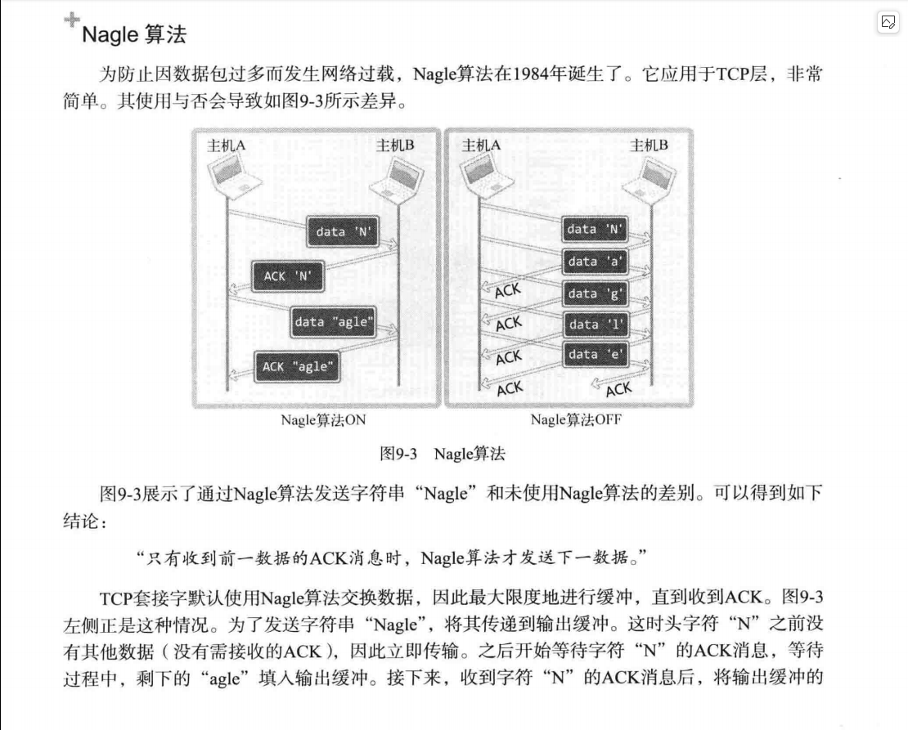
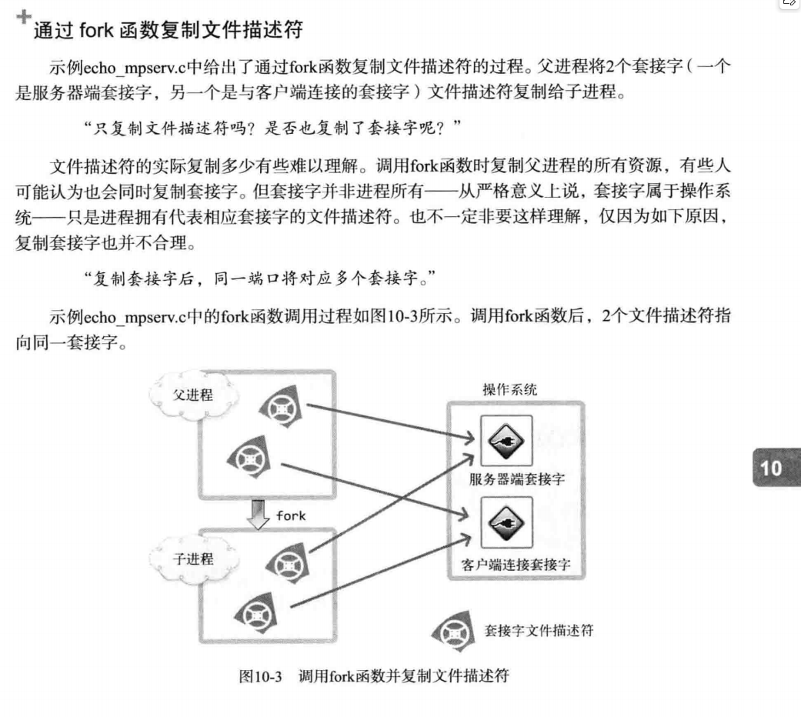
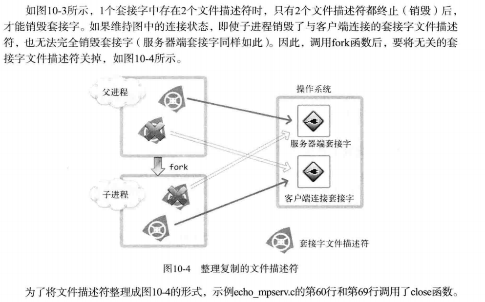

### Nagle算法

> - Nagle算法主要目的是通过减少网络中的小数据包数量来提高整体网络效率。它通过将小数据包进行聚合，从而降低网络拥塞和提高吞吐量。如果包的大小满足MSS，那么可以立即发送，否则数据会被放到缓冲区，等到已经发送的包被确认了之后才能继续发送。
> - 如果有大量小数据包要发送，则选用Nagle算法
> - 如果期待低延时通信，则禁用Nagle算法。

[Nagle 算法：优化 TCP 网络中小数据包的传输_tcp nagle算法-CSDN博客](https://blog.csdn.net/houbincarson/article/details/142633510)

[TCP-IP详解：Nagle算法-CSDN博客](https://blog.csdn.net/wdscq1234/article/details/52432095)

[TCP_NODELAY选项可以禁止Nagle 算法_linux 禁用nagle-CSDN博客](https://blog.csdn.net/sun007700/article/details/128655876)

### 僵尸进程的检测以及处理

使用`sigaction()`配合`waitpid()`函数。

### 通过fork()复制文件描述符

