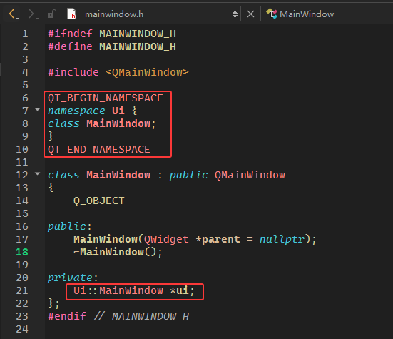
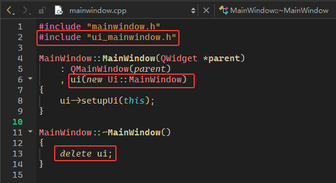
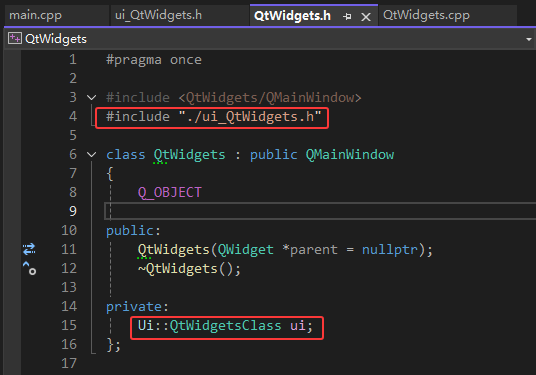
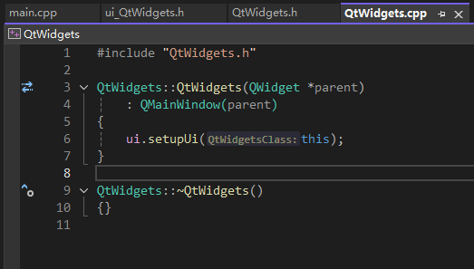
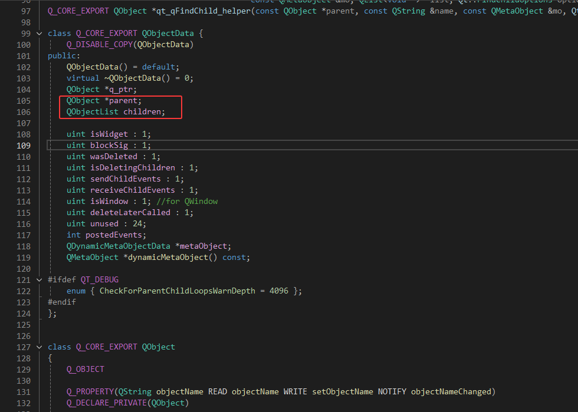

start：20250309

### Qt project 文件（1）

- Qt 有pro 文件来组织项目 .pro文件可以通过 qtcreator 自动添加生成, 同时也可以通过命令行的方式手动生成.
- `qmake -project` 把某个文件夹下所有的文件添加到 pro下作为整个工程的一部分. 主要是 .h .cpp .qrc .ui 文件 .
- qmake 会根据当前的 .pro 文件生成 Makefile. 这个 Makefile描述了如何编译链接整个程序的文件.
- make 找Makefile文件去编译程序. 在 windows 上, 由于使用的 linux gcc g++ 移植到windows 的mingw 编译器 . 只能去使用 `mingw32-make`. 或者说自己去改下 mingw32-make 这个文件 . 使用 `make clean` 清除上次编译的内容. 如果你的项目比较大编译需要花很多时间，那么你可以使用`make -j8` 编译。

### Qt project 文件（2）

- 每次修改了pro文件最好都去做一次`qmake`.

- `QT += core gui widgets` 表示各种Qt的模块.除了使用QT += widgets 如果你使用Qt去构建你的项目，某些模块默认加入了,还可以使用QT -= widgets去掉这些模块.

- `CONFIG += console c++17 debug warn_off exceptions no_exceptions stl no_stl`

- `TEMPLATE = app lib subdirs`关键字用于指定项目的类型

- `TARGET = CCQt` 表示可执行程序的名字

- `INCLUDEPATH += .` 表示包含的头文件的路径 一个点表示当前文件夹.

- `LIBS += .` 包含的库文件的路径

- `INCLUDEPATH += $$PWD/libmath/include` 包含头文件 $$PWD表示当前文件夹目录.

- `LIBS += -L$$PWD/libmath/lib -lccmath` -L表示文件夹 -l表示文件夹下的具体的库的名字.

### Qt GUI 文件

- .ui 文件是基于 xml 的界面文件. 计算机行业很多框架都是基于 xml, 比如安卓 .

- .ui 我们最终是需要通过 qt 编译成 c++ 代码的 .

- Qt xml 文件什么时候转化为一个 UI 类的 ?qmake 生成了 debug release 文件夹 , Makefile, Makefile.debug, Makefile.release. 但是没有生成 ui_xxx 类 . **执行 make/build 的时候，生成了 ui_xxx 类**. 这个时候，我们的 Qt 在成员初始化列表里面，才能 new ui. 然后执行 ui->setup()

### Qt Creator 和 VS 创建的qt程序之间的差异

先看下图：

- Qt Creator：

  - 头文件：

    

  - 源文件：

    

- VS：

  - 头文件：

    

  - 源文件：

    

总结：

1. 首先需要注意，两个编译器`#include "ui_mainwindow.h"`的位置不同，Qt Creator是放在了.cpp文件中，而VS是放在了.h文件中。
2. 这就导致了在创建 ui 对象时，对于VS来说，可以创建一个完整的栈对象，而对于Qt Creator来说，只能先进行前置申明，然后创建一个对应的ui指针。

### 初识对象树？？？

如下代码：

```c++
#include "mainwindow.h"
#include "ui_mainwindow.h"

MainWindow::MainWindow(QWidget *parent)
    : QMainWindow(parent)
    , ui(new Ui::MainWindow)
{
    ui->setupUi(this);
    m_pQlabel = new QLabel(ui->statusbar);	// 1
    m_pQlabel->setText("hello world");
}

MainWindow::~MainWindow()
{
    delete ui;
}

```

解释：

1. 注意在指定label父对象后，无需刻意去释放，因为对象树最后会自动释放（当然你要在`delete ui`前或后加上`delete m_pQlabel`也无伤大雅

进阶实验：

我们修改一下`~MainWindow()`：

```c++
MainWindow::~MainWindow()
{
    //delete ui->statusbar;			1
    delete ui;
    //delete ui->statusbar;			2
    //m_pQlabel->setText("seeee");	3
    delete m_pQlabel;
    //delete m_pQlabel;				4
    //m_pQlabel->setText("seeee");	5
}
```

解释：

- 如果你自己去一行一行取消注释，会发现：`1`可以正常运行；`2`会导致运行时错误；`3`可以正常运行；`4`导致运行时错误；`5`会导致运行时错误。（以上结果基于MSVC）

- 这是因为"ui_mainwindow.h"中的`class Ui_MainWindow`就是一个普通的类，该类中的`void setupUi(QMainWindow *MainWindow)`的作用，就是`new`出所有的对象，并将这些对象的父亲设为传进来的`MainWindow`指针，然后就不管事了，该ui类的析构函数也只是个简单的`default`，所以它并不会释放其成员指针所指向的内存，也就是说，**在`delete ui`后，ui类的成员变量并没有被真正地释放掉，真正的释放是在`MainWindow`及其父对象`QWidget`的析构函数结束后，调用其祖父对象`QObject`的析构函数之时[#对象树系统](Qt对象树系统)**。所以这下1，2，3，4，5点都能解释得通了，如果还不信，可以用以下代码验证：

  ```c++
  MainWindow::~MainWindow()
  {
      QPushButton* pb = ui->pushButton;
      delete ui;
      pb->setText("1111");				// ok
      ui->pushButton->setText("22222");	// 运行时错误，非法内存访问
  }
  ```

- 还可以多看看该文档？？？：

  [Qt源码阅读(三) 对象树管理 - 师从名剑山 - 博客园](https://www.cnblogs.com/codegb/p/17270627.html)

  [Qt总结之十一：内存泄漏（汇总）_qwidget释放内存空间后程序崩溃-CSDN博客](https://blog.csdn.net/Aidam_Bo/article/details/85698862)

  [Qt总结之十九：Qt中控件new之后需不需要delete的问题_qt new出来的控件,是否要显式删除-CSDN博客](https://blog.csdn.net/Aidam_Bo/article/details/86303096)

### Qt 容器和 STL 容器的区别？？？

[论Qt容器与STL - 知乎](https://zhuanlan.zhihu.com/p/24035468)

### QString

- 标准C++提供了两种字符串 一种以`\0`为结尾的字符数组即C风格字符串，
另外一种是 `std::string`. Qt 提供了自己实现的QString 功能更强大.


- QString 是由一系列 QChar 组成的字符串. **QString 使用两个字节16位表示一个字符**．使用的是 UTF-16 双字节编码（代码值高于 65535 的 Unicode 字符使用代理对存储，即两个连续的 QChar）。

  ```c++
  QString str{ "1234" };
  qDebug() << str.length();	// 4
  qDebug() << sizeof(str);	// 8
  ```

- 在底层，**QString 使用隐式共享（写时复制）来减少内存使用**，并避免不必要的数据复制。这也有助于降低存储 16 位字符而非 8 位字符所带来的固有开销。

- QString采用的是 UTF16，C++ 标准采用的是 UTF8 编码，针对 C++ 标准字符串，**Qt提供了QByteArray 类来操作 UTF8 编码的传统字符串，字节数组等。**在大多数情况下使用QString。QByteArray 适用的两种主要情况是：当你需要存储原始二进制数据时，以及当内存节约至关重要时（比如在嵌入式系统中）。

### QVector\<T>

和vector类似，重点关注内部结构，以及动态扩容时为啥每次都是扩容1.5倍或2倍

### QList\<T>

> - `QVector` 通常应是你的首选。`QVector<T>` 的性能通常优于 `QList<T>`，因为 `QVector<T>` 始终在内存中顺序存储其项目，而 `QList<T>` 通常会在堆上分配项目，**除非 `sizeof(T) <= sizeof(void*)` 且已使用 `Q_DECLARE_TYPEINFO` 将 `T` 声明为 `Q_MOVABLE_TYPE` 或 `Q_PRIMITIVE_TYPE`。**
> - `QList`是线程不安全的。
> - 在 Qt 的应用程序编程接口（APIs）中，`QList` 常用于传递参数和返回值。若要与这些 APIs 交互，请使用 `QList`。
> - 如果你需要一个真正的链表，该链表保证在列表中间进行插入操作的时间复杂度为常数，并使用迭代器访问项目而非索引，那么请使用 `QLinkedList`。
> - `QVector` 和 `QVarLengthArray` 都保证具有与 C 语言兼容的数组布局。`QList` 则不保证。如果你的应用程序必须与 C 语言应用程序编程接口（API）交互，这一点可能很重要。
> - 只要所引用的项目仍在容器中，指向 `QLinkedList` 的迭代器以及指向在堆上分配内存的 `QList` 的引用就仍然有效。但对于指向 `QVector` 和不在堆上分配内存的 `QList` 的迭代器和引用，情况并非如此。

- [建议多看：Understand the Qt containers | -Wmarc](https://marcmutz.wordpress.com/effective-qt/containers/#containers-qlist)

- QList 与 std::list 毫无关系。它被实现为所谓的数组列表，**实际上是一块连续的 `void*` 空间**，**前后各有一些预留空间**，以便进行前置插入（极少使用）和后置追加（极为常用）操作。这些 `void*` 槽位存放着指向各个元素的指针（这些元素通过拷贝构造到动态内存中，即使用 new 操作符），除非元素类型是可移动的或POD类型，即**被声明为 `Q_MOVABLE_TYPE ` 或 `Q_PRIMITIVE_TYPE`，并且 `sizeof(T) <= sizeof(void*)`，在这种情况下，元素会直接存放在 `void*` 槽位中。**

- 优点：

  1. 从生成代码量的角度来看，`QList` 确实能节省内存。这是因为 `QList` 只是对一个内部类的轻量级封装，该内部类负责管理 `void*` 的内存。这使得代码更加紧凑，因为所有内存管理代码在不同类型的 `QList` 之间是共享的（**由此也可以得出`QList`是线程不安全的**）。
  2. `QList` 在容器中间进行插入操作时速度也比较快，并且容器扩展的效率也比较合理（只需移动指针，而无需移动数据本身，所以 `QList` 总能使用 `realloc()` 来扩展自身）。不过，这种效率并不会比 `QVector<void*>` 高太多，而且一般来说，向量在中间进行快速插入并非其强项。

- 缺点：

  对于大多数数据类型，QList 在内存使用上是个十足的浪费者。

  1. 首先，如果元素类型是可移动且足够小（见上文条件），当元素类型的大小小于 `sizeof (void*)` 时，`QList` 会浪费内存：确切地说，浪费的内存大小为 `sizeof (void*) - sizeof (T)`。这是因为每个元素至少需要 `sizeof (void*)` 的存储空间。换句话说：一个 `QList<char>` 使用的内存是 `QVector<char>` 的 4 倍 / 8 倍（32 位 / 64 位平台）！
  2. 其次，如果元素类型不可移动或者太大（`sizeof (T) > sizeof (void*)`），它会在堆上分配内存。所以对于每个元素，你不仅要付出堆分配的额外开销（这取决于分配器，通常在 0 到十几二十字节之间），还要加上存放指针所需的 4/8 字节。

- 只有当元素类型是可移动的且大小为 `sizeof (void*)` 时，`QList` 才是一个好的容器。至少对于 Qt 中一些最重要的隐式共享类型（`QString`、`QByteArray`，还有 `QPen`、`QBrush` 等）来说是这种情况，但也有一些明显的例外。以下是在 Qt 4.6.3 中，文档记录为隐式共享的类型列表，以及它们是否适合作为 QList 的元素：

  | No: Too Large                                                | No: Not Movable                                              | OK                                                           |
  | :----------------------------------------------------------- | :----------------------------------------------------------- | :----------------------------------------------------------- |
  | QBitmap, QFont, QGradient, QImage, QPalette, QPicture, QPixmap, QSqlField, QTextBoundaryFinder, QTextFormat, QVariant**(!)** | QContiguousCache, QCursor, QDir, QFontInfo, QFontMetrics, QFontMetricsF, QGLColormap, QHash, QLinkedList, QList, QMap, QMultiHash, QMultiMap, QPainterPath, QPolygon, QPolygonF, QQueue, QRegion, QSet, QSqlQuery, QSqlRecord, QStack, QStringList, QTextCursor, QTextDocumentFragment, QVector, QX11Info | QBitArray, QBrush, QByteArray, QFileInfo, QIcon, QKeySequence, QLocale, QPen, QRegExp, QString, QUrl |

  QCache 缺少必需的拷贝构造函数，所以它不能作为 QList 中的元素使用。

  所有这些容器本身的大小都足够小，可以放入 QList 的槽位中，但 QTypeInfo 尚未针对它们进行部分特化，所以它们没有被标记为可移动的，尽管很可能大部分容器本可以被标记为可移动。

- 你可以像这样为你自己实例化的这些类声明 `Q_DECLARE_TYPEINFO `：

  `Q_DECLARE_TYPEINFO( QList<MyType>, Q_MOVABLE_TYPE );`

  这样当将它们放入 `QList` 中时，效率会提高。

  然而，问题在于，如果你之前忘记声明 `Q_DECLARE_TYPEINFO `，现在就不能添加了，至少不能以二进制兼容的方式添加，因为声明一个类型为可移动会改变该类型在 `QList` 中的内存布局。这可能就是 Trolltech 公司（现 Qt 公司）尚未将这些容器标记为可移动的原因。

  其他一些对于 `QList` 槽位来说太大的类型包括 `QSharedPointer<T>`、大多数 `QPairs` 以及 `QModelIndex`（！），但 `QPersistentModelIndex` 不是。

- 以下是一些基本类型内存效率的概述。它们都是可移动的，所以作为 QList 元素有潜在的高效性。在表格中，“Size” 是通过 sizeof 操作符得出的元素类型的大小，“Mem/Elem” 是每个元素在 32 位 / 64 位平台上使用的内存（以字节为单位），“Overhead” 是将这些类型存储在 `QList` 而非 `QVector` 中时的内存开销，忽略每个容器使用的常数级（`O (1)`）内存。

  | 类型          | Size | Mem/Elem | Overhead  |
  | ------------- | ---- | -------- | --------- |
  | bool/char     | 1    | 4/8      | 300%/700% |
  | qint32/float  | 4    | 4/8      | 0%/100%   |
  | qint64/double | 8    | 16+/8    | 100%+/0%  |

  特别麻烦的是，一种类型在 32 位平台上可能高效，而在 64 位平台上却低效（例如 float），反之亦然（例如 double）。

  这直接引出了以下更细致的准则：

- **准则：当 T 既没有被声明为 `Q_MOVABLE_TYPE` ，也没有被声明为 `Q_PRIMITIVE_TYPE` ，或者 `sizeof (T) != sizeof (void*)` 时（记得检查 32 位和 64 位平台），避免使用 `QList<T>` 。**

- 所以，`QList` 并不是一个好的默认容器。但是有没有 QList 比 QVector 更可取的情况呢？遗憾的是，答案是否定的。如果到了 Qt 5，Trolltech 公司直接将所有 `QList` 的使用替换为 `QVector` 就好了。在少数几个 `QList` 性能优于 `QVector` 的基准测试中，要么在实际应用中无关紧要，要么可以通过更好地优化 `QVector` 来解决。

- 话虽如此，目前在编写 `QVector<QString>` 之前你还是要三思，尽管它可能性能略好。这是因为在 Qt 中习惯上使用 `QList` 来存储 `QString` 集合，并且在 Qt API 使用 QList 的情况下，你应该避免使用 vector，至少在 `QList` 实际高效的情况下如此。就我个人而言，只要有可能，我都会尝试用 `QVector<QModelIndex>` 替换低效的 `QList<QModelIndex>` 。

- **准则：对于 Qt API 习惯使用 QList 且 QList 并非低效的类型，避免使用这些类型的 vector。**

- [#总结](#QList\<T>)

### QLinkedList\<T>

已经过时了，建议使用 `std::list<T>` 进行替代

### QMap\<T>

和`std::map<T>`类似，只是接口函数不同

### QHash\<T>

和`std::unordered_map<T>`类似

### Qt元对象系统

> 如果没有信号槽，该如何实现对象间的通信
>
> 1. 函数指针，回调。
> 2. `std::packaged_task<T>`，不仅能对象间通信，还能保证线程安全。

- Qt 的元对象系统（Meta-0bjectSystem）是 Qt 框架的一个关键特性，用于提供一种在运行时处理对象的信息的机制。元对象系统允许在编译时和运行时处理 Qt 对象的信息，包括对象的类名、属性、信号和槽等。

- 元对象（Meta-0Object)︰在 Qt 中，每个支持元对象系统的类都有一个关联的元对象，其中包含了关于类的信息，:
名、父类信息、属性、信号和槽等。元对象是通过Q_OBJECT 宏来声明的

- Q_OBJECT 宏:当一个类中包含Q_OBJECT宏时，它就能够利用元对象系统的功能。Q_OBJECT宏会在类
一些额外的代码，使得该类能够通过元对象系统提供的接口进行运行时信息的查询。

- 信号和槽机制:元对象系统支持 Qt 中独特的信号和槽机制，它允许对象之间进行松散合的通信。信号是一种特殊的成员
函数，用于在某些条件下发出通知。槽是接收信号的函数，用于响应信号的发出。通过元对象系统，可以在运行时动态地;
接信号和槽。信号槽支持对象间跨线程通讯。

- 属性系统：元对象系统还支持属性(Property）系统，允许为对象定义一组属性，这些属性可以在运行时查询和修
系统对于实现动态属性和与图形界面控件的集成非常有用。

- 运行时类型信息（Run-Time Type lnformation，RTTI）∶元对象系统提供了一种在运行时查询对象的类型信息的机制。
以使用 qobject_cast 和 qobject_cast 函数进行安全的向下转型，而不需要使用动态 cast
- QMetaObject 类:QMetaObject 类是元对象系统的核心部分，它提供了一系列函数，允许在运行时查询和操作信息。通过 QMetaObject ，可以动态地获取类的属性、信号、槽等信息。
元对象系统为 ot 提供了许多强大的特性，使得 Qt 应用程序能够在运行时动态地处理对象的信息，从而实现更灵活和可扩展的设计

### Q_OBJECT 与信号槽机制

- Q_OBJECT 宏是 Qt 中用于启用元对象系统的关键宏。使用 Q_OBJECT 宏的类可以利用元对象系统提供的一系列功能，包括信号槽机制、运行时类型信息（RTTI）、属性系统等。
- Q_OBJECT 宏的作用： Q_OBJECT 宏的作用是在类的声明中插入一些额外的代码，以使得该类能够利用元对象系统的功能。这包括信号槽机制、运行时类型信息和其他元对象系统提供的特性。
- 信号和槽机制： 在具有 Q_OBJECT 宏的类中，可以声明信号和槽。信号用于在特定条件下发出通知，而槽用于响应信号的发出。信号和槽之间通过 connect 函数建立关联，使得在信号触发时能够调用相关的槽函数。
- 在使用信号和槽的过程中，通过元对象系统，Qt 在运行时动态地建立了连接关系，从而实现了对象间的松散耦合通信。
- moc 编译器： 包含了 Q_OBJECT 宏的类需要通过 MOC（Meta-Object Compiler）编译器进行预处理。MOC 会解析类中的元对象信息，生成与信号槽机制相关的代码。在使用 Qt 编译器时，MOC 会自动执行。对于非 Qt Creator 等集成开发环境，你可能需要手动运行 MOC。
- 使用 Q_OBJECT 宏和信号槽机制使得 Qt 中的对象能够实现强大的通信和交互能力，使代码更加灵活和可扩展。在使用信号槽时，请确保相关的类包含 Q_OBJECT 宏，并且运行了 MOC 编译器。

### Qt XML 读写

在 Qt 中，你可以使用 QXmlStreamReader 和 QXmlStreamWriter 来进行 XML 的读写操作。还可以使用 DOM（文档对象模型）方式读取和写入 XML 数据。Qt 提供了 QDomDocument 类来表示 XML 文档，以及相关的类来操作 XML 元素。

- DOM（Document Object Model）和 Streaming（或称为 Pull Parsing）是两种不同的 XML 解析方式，它们有一些区别：

- DOM 方式（Document Object Model）：

- 内存占用： DOM 方式将整个 XML 文档加载到内存中，并构建一个树形结构表示整个文档。这意味着对于大型 XML 文件，DOM 可能占用较多的内存。

- 随机访问： 由于整个文档在内存中，可以轻松实现对文档的随机访问，修改和查询。

- 适用场景： 适用于文档结构较小，需要在解析后频繁随机访问和修改文档的情况。

- Streaming 方式（Pull Parsing）：

- 内存占用： Streaming 方式以流的形式逐行读取和解析 XML 文档，不需要将整个文档加载到内存中。这使得它对于大型 XML 文件更为适用，因为它在解析时只需保持较小的缓冲区。

- 逐行处理： 以事件驱动的方式逐行处理 XML 文档，只有在需要时才解析下一个元素。这使得 Streaming 方式更适合处理大型 XML 文件，而不需要一次性加载整个文档。

- 适用场景： 适用于文档结构较大，但一次只需处理一部分数据的情况，例如网络流或大型日志文件。

- 在实践中，选择 DOM 还是 Streaming 方式取决于应用程序的需求和数据的大小。如果你需要对整个文档进行频繁的随机访问和修改，DOM 方式可能更适合。如果你处理大型 XML 文件或只需要逐行处理数据，Streaming 方式可能更有效。在某些情况下，也可以考虑使用 Hybrid 模式，根据实际需求在两者之间进行选择。

### Qt Json 读写

在 Qt 中，你可以使用 QJsonDocument 和 QJsonObject 来读写 JSON 数据。

- QJsonDocument：

- QJsonDocument 类表示一个 JSON 文档，可以包含一个或多个 JSON 对象或数组。

- 它提供了将 JSON 数据序列化为字符串（toJson()）以及从字符串解析为 JSON 数据（fromJson()）的功能。

- toJson() 函数返回 JSON 文档的字节数组表示，你可以通过 toJson(QJsonDocument::Indented) 传递 QJsonDocument::Indented 选项来格式化输出。

- fromJson() 函数用于从包含 JSON 数据的字节数组构建 QJsonDocument。

- QJsonObject：

- QJsonObject 类表示一个 JSON 对象，即一个键值对的集合。

- 它提供了添加、查询和删除键值对的方法，可以通过键访问值。

- 键和值的类型可以是 QString、bool、double、QJsonObject、QJsonArray 等。

- 你可以使用 insert()、value()、remove() 等函数操作 QJsonObject 中的键值对。

### Qt对象树系统

- QObject::QObject(QObject\* parent = nullptr) QObject 的构造函数的默认参数 parent, 指定他的父对象 . 默认为空 . 这背后的系统在对象内存管理中起到了重要作用 . 这就是 Qt 的对象树系统。

- 例如一个 QWidget 父窗体 , 里面添加了几个子窗体 , 当父窗体销毁的时候，会自动销毁父窗体下所有的子窗体。这里有几个重要的知识点：

- 1 父子对象的关系

- 2 对象树构造和析构的顺序

- 3 对象析构的问题

- 4 窗体对象的销毁

### Qt 对象树界面的应用

- Qt 使用对象树来组织管理所有的 QObject 类以及其子类对象。

- 创建一个 QObject 对象，默认会有父对象指针一个 QObject *parent 指针作为参数 .

- 每个 QObject 内部都维护一个 children 列表和一个 parent 指针 .

- 当一个 QObject 对象析构的时候，如果这个对象有 parent, 就会自动从它 parent 的 children 列表中移除 . 如果它有 children, 就会 delete 它的 children 列表中的每一个子对象 .

- 比如 new 一个 QWidget ，创建时指定了它的父窗口，我们就不再需要手动 delete 这个 QWidget 对象 . 当它的父窗体销毁的时候，会自动销毁这个 QWidget 对象 . 这些都是通过对象树系统来完成

- `QObjectData`是`QObject`的成员，里面存储的`parent`指针表示该`QObject`的父对象，而`QObjectList`即`QList<QObject*>`，所以显然，`children`表示该`QObject`的子对象列表。

  

### 父子对象的关系及构建顺序

建议回顾：[#初识对象树](#初识对象树？？？)

当我们构建一个对象，可以设置它的parent 参数 . 可以在构造的时候指定，也可以构造对象后调用setParent指定。

- 父对象可以查找子对象，通过函数 findChild findChildren 函数。

- 子对象可以通过setParent()函数指定父对象，通过parent()参数得到父对象指针。

- 1父对象创建的时候，对象树建立。

- 2子对象通过setParent() 指定父对象，子对象加入对象树系统中 .

- 3子对象被删除，子对象自动从当前对象树中移除。

- 4父对象被删除时，父对象先被析构，父对象的对象树中维护的所有的子对象会按照加入对象树的先后顺序进行析构。（**所以父子对象间的析构顺序是：先调用父对象的析构函数，然后在父对象的析构函数中遍历子对象列表，调用子对象列表中每一个子对象的析构函数，从单线程的角度来说，有点像树的深度搜索**，注意对象树的父子关系和继承中的父子关系不一样！！！）

- 5所以当父对象销毁后，再调用子对象的方法，会导致程序崩溃。

课后习题：以下代码哪里有问题？该如何解决？

```c++
int main(int argc, char* argv[])
{
    QApplication app(argc, argv);
    QLabel label("hello world.");
    QMainWindow w;
    label.setParent(&w);
    w.show();
    return app.exec();
}
```

分析：

1. `QLabel`先被创建，然后创建`QMainWindow`，然后将`QLabel`加入`QMainWindow`的对象树，在程序退出的时候，由于`QLabel`和`QMainWindow`都是栈对象，所以会先析构`QMainWindow`，再析构`QLabel`；当析构`QMainWindow`的时候，根据**对象树析构顺序**，调用`QMaindow`的析构函数时，会将`QLabel`一起释放掉，而在`QMainWindow`析构结束后，根据**栈对象的释放顺序**，又会调用`QLabel`的析构函数，最终重复释放导致报错。
2. 解决办法也很简单
   - 将`QLabel`和`QMainWindow`的创建顺序调换。
   - 将`QLabel`创建在堆上。

### Qt 事件？？？

[QWidget父子事件传递源码剖析_qt 一个widget触发mousemove事件同时触发另一个widget的mousemove事件-CSDN博客](https://blog.csdn.net/kupepoem/article/details/121883121)

[QT父子窗口事件传递与事件过滤器（讲了一些原理，比较清楚） - findumars - 博客园](https://www.cnblogs.com/findumars/p/6152886.html)
