# 第一章：H.264 核心概念

## 1.1 H.264 概述

H.264，全称为高级视频编码 (Advanced Video Coding, AVC)，是由 ITU-T 的视频编码专家组 (VCEG) 和 ISO/IEC 的运动图像专家组 (MPEG) 联合组成的 **联合视频团队 (Joint Video Team, JVT)** 制定的视频压缩标准。它也被称为 **MPEG-4 Part 10**。

#### **主要特点**

*   **高压缩率 (High Compression Ratio)**
    *   在同等图像质量下，H.264 的压缩率比 MPEG-2 提高约一倍，比 H.263 提高约 1.5 倍。这意味着在相同带宽下可以传输更高质量的视频，或在同等质量下占用更少的存储空间和带宽。

*   **良好的网络亲和性 (Good Network Adaptability)**
    *   H.264 在设计上充分考虑了网络传输的需求，通过其核心的 **分层设计** (VCL 与 NAL)，将视频编码的核心逻辑与网络传输的适配分离开来，使其能够高效、可靠地应用于各种网络环境，如 IP 网、无线网络等。

*   **广泛的应用场景**
    *   凭借其高效的压缩和良好的网络适应性，H.264 被广泛应用于高清电视广播、蓝光光盘、网络视频流、视频会议、移动视频以及安防监控等领域。

#### **标准化组织**

*   **ITU-T (国际电信联盟电信标准化部门)**: 其发布的标准通常以 H.xxx 命名，如 H.261, H.263, H.264。
*   **ISO/IEC (国际标准化组织/国际电工委员会)**: 其发布的标准通常以 MPEG-x 命名，如 MPEG-2, MPEG-4。

## 1.2 分层设计：VCL 与 NAL

H.264 的一个核心设计思想是将视频编码处理的核心算法（**视频编码层 VCL**）与网络传输的适配接口（**网络适配层 NAL**）进行明确的分离。这种分层设计极大地提升了 H.264 的网络适应性。

---

#### **视频编码层 VCL**

*   **定义**: VCL 是 H.264 的核心压缩引擎，负责高效地表示视频内容。它包含了所有与视频数据压缩相关的核心技术，如预测、变换、量化和熵编码。
*   **目标**: 尽可能地去除视频数据中的冗余信息，实现高效率的压缩。
*   **输出**: VCL 的处理结果是 **原始字节序列载荷 (Raw Byte Sequence Payload, RBSP)**，通常表现为一系列经过编码的片 (Slice) 数据。

#### **网络适配层 NAL**

*   **定义**: NAL 负责将 VCL 产生的 RBSP 数据进行封装，使其能够适用于各种网络和存储环境。它为 VCL 提供了一个统一的接口，使其无需关心底层传输的具体细节。
*   **目标**: 格式化数据，使其具备良好的网络亲和性，支持错误恢复和灵活传输。
*   **输出**: NAL 将 RBSP 打包成一个个独立的 **NAL 单元 (NAL Unit, NALU)**。每个 NALU 都是一个独立的、可在网络上传输的数据包。

#### **VCL 与 NAL 的关系**

VCL 专注于“内容”，NAL 专注于“容器”。VCL 负责生成压缩后的核心视频数据，而 NAL 负责为这些数据套上一个标准化的“信封”（即 NALU 头部），以便于投递。

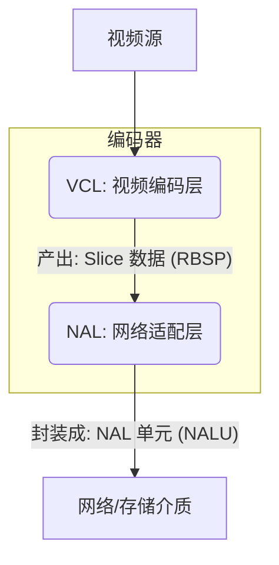
*图示：VCL 与 NAL 的分层关系概念图，此概念源自《新一代视频压缩编码标准》图 8.2。*

【**笔记**】
- **VCL (内容)**:
  - 核心功能: 预测、变换、量化、熵编码。
  - 输出: Slice 数据 (RBSP)。
- **NAL (容器)**:
  - 核心功能: 将 RBSP 封装成 NALU，添加 NAL 头部。
  - 输出: NAL 单元 (NALU)。
- **核心关系**: `NAL Unit = NAL Header + RBSP`

## 1.3 核心数据单元简介

H.264 码流在逻辑上由 **参数集 (Parameter Sets)** 和 **VCL 数据流** 两大部分组成。参数集存储全局配置信息，VCL 数据流则承载具体的像素编码数据。这种分离是 H.264 鲁棒性和灵活性的关键。

---

#### **分层与引用关系**

一个编码后的视频序列，其解码依赖于一个清晰的引用链：片 (Slice) 引用图像参数集 (PPS)，图像参数集引用序列参数集 (SPS)。

**一个视频帧中可能既包含P片，又包含B片，只要包含了B片，我们就叫它B帧，P,I帧同理**

**其次，h.264在进行编码时，参考的是【先前已被编码并重建的参考帧】，这是为了保证与解码器同步**

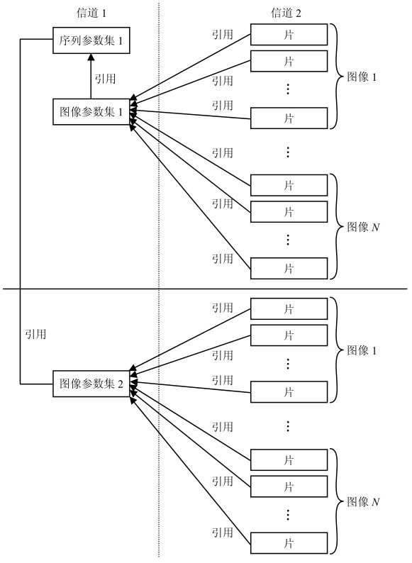

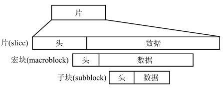

*图示：H.264 参数集与 VCL 数据流的引用及分层关系，见《新一代视频压缩编码标准》图 6.3。*

#### **1. 参数集 (Parameter Sets)**

*   **序列参数集 (Sequence Parameter Set, SPS)**
    *   **定义**: 包含作用于一系列连续图像（即一个视频序列）的全局编码参数。
    *   **核心内容**: `profile_idc`, `level_idc`, 图像宽高, 帧率信息等。

*   **图像参数集 (Picture Parameter Set, PPS)**
    *   **定义**: 包含作用于序列中一张或多张图像的编码参数，**它必须引用一个 SPS**。
    *   **核心内容**: 熵编码模式 (`entropy_coding_mode_flag`), 片组信息 (`num_slice_groups_minus1`), 初始量化参数等。

#### **2. 片 (Slice)**

*   **定义**: 一个图像可以被分割成一个或多个片。每个片是**独立解码的基本单元**，其头部信息中**必须引用一个 PPS**。
*   **作用**: 错误恢复。单个片的损坏不影响其他片。
*   **类型**: I 片 (Intra)、P 片 (Predicted)、B 片 (Bi-predictive)。

#### **3. 宏块 (Macroblock, MB)**

*   **定义**: 片的组成单位，视频编码的核心处理单元。
*   **构成**: 一个 16x16 的亮度块和两个相应大小的色度块（如在 4:2:0 采样下是两个 8x8 色度块）。
*   **分区**: 宏块可进一步划分为更小的块（Block），以适应不同区域的运动细节。

【**笔记**】
- **引用链**: `Slice Header` -> `PPS` -> `SPS`。解码一个 Slice 必须先获取其引用的 PPS 和该 PPS 引用的 SPS。
- **SPS (序列参数集)**: 序列级“说明书”，包含 Profile, Level, 分辨率。
- **PPS (图像参数集)**: 图像级“说明书”，包含熵编码模式等。
- **Slice (片)**: 独立解码单元，包含宏块数据。
- **Macroblock (宏块)**: 编码基本单元 (16x16 亮度 + 色度)。

# 第二章：H.264 码流结构

## 2.1 NAL 单元 (NAL Unit)

在 H.264 标准中，所有数据都封装在 **NAL 单元 (NALU)** 中。NALU 是视频编码数据在网络上传输或存储时的基本单位，它将 VCL 层产生的数据适配于各种传输环境。

---

#### **NALU 的基本结构**

每个 NALU 由一个 **NAL 头部 (NAL Header)** 和一个 **原始字节序列载荷 (RBSP)** 组成。

*   **NAL 头部 (NAL Header)**: 1 个字节，用于标识 RBSP 中的数据类型和重要性。
*   **原始字节序列载荷 (Raw Byte Sequence Payload, RBSP)**: 承载了来自 VCL 层的原始编码数据，如 Slice 数据或参数集数据。

#### **NAL 头部 (1 字节)**

NAL 头部定义了 NALU 的核心属性，是解码器解析码流的入口。

| Bit      | 7                  | 6   5       | 4   3   2   1   0 |
| :------- | :----------------- | :---------- | :---------------- |
| **字段** | `F`                | `nri`       | `type`            |
| **名称** | forbidden_zero_bit | nal_ref_idc | nal_unit_type     |

*   **forbidden\_zero\_bit (1 bit)**
    *   在 H.264 规范中必须为 0。网络传输中若该位为 1，则表示该 NALU 存在比特错误。

*   **nal\_ref\_idc (nal\_reference\_idc, 2 bits)**
    *   指示该 NALU 的重要性等级。值越大，越重要。
    *   `00`: 表示该 NALU 不被用作参考，解码器在错误恢复时可以将其丢弃。
    *   `01` ~ `11`: 表示该 NALU 被用作参考（例如，作为参考帧的一部分），其重要性递增。

*   **nal\_unit\_type (5 bits)**
    *   定义了 NALU 中 RBSP 的数据类型。这是 **解析码流时最关键的字段**。
    *   **常见值**:
        *   `1`: 非 IDR 图像的编码条带 (P/B Slice)
        *   `5`: IDR 图像的编码条带 (I Slice)
        *   `6`: 补充增强信息 (Supplemental Enhancement Information, SEI)
        *   `7`: 序列参数集 (SPS)
        *   `8`: 图像参数集 (PPS)

#### **RBSP 与防竞争机制**

RBSP 是原始的编码数据。为了防止 RBSP 内部出现与 Annex B 格式的起始码 (`0x000001`) 产生冲突，H.264 设计了**防竞争字节 (Emulation Prevention Bytes)** 机制。

*   **机制**: 编码器在生成 RBSP 数据时，会检测是否存在 `0x000000`, `0x000001`, `0x000002`, `0x000003`。如果存在，就在最后两个字节之间插入一个值为 `0x03` 的防竞争字节。
    *   0x000001 -> 0x0000**03**01
*   **解码**: 解码器在解析 NALU 中的 RBSP 时，如果遇到 `0x000003`，就会将`03`丢弃，从而恢复出原始的 RBSP 数据。
*   **注意**：对于H.264码流而言，一个图像的起始片，起始码通常为`0x00 00 00 01`，图像中后续的片，起始码通常为`0x00 00 01`

【**笔记**】
- **NALU**: H.264 码流的基本传输单元。
- **结构**: `NAL Unit = 1 字节 NAL Header + RBSP`。
- **NAL Header 解析**:
  - `forbidden_zero_bit (bit 7)`: 必须为 0。
  - `nal_ref_idc (bits 6-5)`: NALU 重要性，`00` 表示非参考，`01-11` 表示参考。
  - `nal_unit_type (bits 4-0)`: NALU 内容类型，**解码器首先检查此字段**。
- **RBSP 防竞争**: 编码时在 `0x000000` 到 `0x000003` 之间插入 `0x03`，解码时移除（只对RBSP有效，对NAL头部无效）。

## 2.2 码流封装格式

NALU 作为独立的数据单元，需要一种机制来界定其在连续的比特流中的边界。H.264 标准定义了两种主流的封装格式：**Annex B** 和 **AVCC**。

---

#### **1. Annex B 格式**

*   **定义**: 在每个 NALU 前添加一个 **起始码 (Start Code)** 来进行分隔。这是在流式传输（如直播、广播）中广泛使用的格式。
*   **起始码**:
    *   `0x000001` (3 字节)
    *   `0x00000001` (4 字节)
*   **结构**:
    `[Start Code] [NALU 1] [Start Code] [NALU 2] [Start Code] [NALU 3] ...`
*   **特点**:
    *   **优点**: 码流中任何位置出现比特错误时，解码器可以通过搜索下一个起始码来重新同步，容错性较好。
    *   **缺点**: 解码器需要持续扫描数据以查找起始码，无法直接知道每个 NALU 的长度。
*   **来源**: 该格式定义于 H.264 标准文档的 **附录 B (Annex B)**。

#### **2. AVCC 格式**

*   **定义**: 在每个 NALU 前添加一个 N 字节的 **长度字段**，指明该 NALU 的大小。这是在文件存储（如 MP4, MKV）中广泛使用的格式。
*   **长度字段**:
    *   通常为 1, 2 或 4 字节，其字节数由文件容器的配置信息（`avcC` box）指定。
*   **结构**:
    `[Length of NALU 1] [NALU 1] [Length of NALU 2] [NALU 2] ...`
*   **特点**:
    *   **优点**: 解析简单高效。解码器只需先读取长度 L，然后直接读取 L 字节的数据即可得到一个完整的 NALU，无需扫描。便于文件随机存取。
    *   **缺点**: 如果长度字段出错，可能会导致后续一连串的解析错误，容错性相对较差。
*   **来源**: 该格式定义于 **ISO/IEC 14496-15 (Advanced Video Coding (AVC) file format)**。

#### **格式对比**

| 特性         | Annex B 格式                        | AVCC 格式                          |
| :----------- | :---------------------------------- | :--------------------------------- |
| **分隔方式** | 起始码 (`0x000001` 或 `0x00000001`) | 长度前缀 (1, 2 或 4 字节)          |
| **主要应用** | 流媒体 (MPEG-2 TS), 直播 (RTMP)     | 文件容器 (MP4, MKV, FLV)           |
| **解析方式** | 搜索特定字节序列                    | 读取长度字段，再读取指定长度的数据 |
| **优点**     | 容错性好，易于重新同步              | 解析效率高，便于随机访问           |
| **缺点**     | 需要扫描码流，无法预知 NALU 大小    | 容错性较差                         |

【**笔记**】
- **Annex B**: 使用 **起始码** 分隔 NALU，适用于 **流媒体** 传输。
- **AVCC**: 使用 **长度** 分隔 NALU，适用于 **文件** 存储。
- **转换**: 两种格式可以相互转换。从 Annex B 转换为 AVCC 需要找到每个起始码，计算 NALU 长度，并用长度替换起始码。反之亦然。

## 2.3 关键 NALU：参数集

在 H.264 码流中，**序列参数集 (SPS)** 和 **图像参数集 (PPS)** 是两个至关重要的 NAL 单元。它们将解码所需的全局性和重复性信息从图像数据中分离出来，极大地提高了码流的鲁棒性和传输效率。

---

#### **1. 序列参数集 SPS**

*   **定义**: 包含作用于一个视频序列（通常指两个 IDR 图像之间的所有图像）的全局编码参数。
*   **NALU 类型**: `nal_unit_type = 7`
*   **核心句法元素**:
    *   `profile_idc`, `level_idc`: 定义码流的档次和级别。这是解码器判断自身是否有能力解码该码流的首要依据。
    *   `seq_parameter_set_id`: SPS 的唯一标识符。
    *   `pic_width_in_mbs_minus1`, `pic_height_in_map_units_minus1`: 定义了图像的宽度和高度（以宏块为单位）。
    *   `frame_mbs_only_flag`: 指示该序列是仅包含帧，还是可能包含场。

#### **2. 图像参数集 PPS**

*   **定义**: 包含作用于序列中一张或多张图像的编码参数。一个 PPS 必须引用一个已存在的 SPS。
*   **NALU 类型**: `nal_unit_type = 8`
*   **核心句法元素**:
    *   `pic_parameter_set_id`: PPS 的唯一标识符。
    *   `seq_parameter_set_id`: 当前 PPS 所引用的 SPS 的 ID。这是连接 PPS 和 SPS 的桥梁。
    *   `entropy_coding_mode_flag`: 熵编码模式选择标志。`0` 表示使用 CAVLC，`1` 表示使用 CABAC。
    *   `num_slice_groups_minus1`: 片组 (Slice Group) 数量。
    *   `pic_init_qp_minus26`: 图像的初始量化参数 (QP)。

#### **激活与传输机制**

SPS 和 PPS 必须在任何引用它们的 Slice 被解码之前，传输至解码器并被激活。这种“带外”或“提前”传输的机制是 H.264 网络亲和性的核心体现。


*图示：H.264 中句法元素的分层结构，见《新一代视频压缩编码标准》图 6.3。*

**图示解释**:

*   `图 6.3` 清晰地展示了参数集与 VCL 数据流（以片为代表）之间的引用关系。
*   **信道 1** 代表一个可能更可靠的信道，用于传输重要的 **参数集**（SPS 和 PPS）。
*   **信道 2** 代表常规信道，用于传输视频的 **片数据**。
*   图中的箭头明确表示：解码器在处理信道 2 的任何一个 **片 (Slice)** 之前，必须先通过 `pic_parameter_set_id` 从信道 1 找到并激活对应的 **PPS**，再通过 `seq_parameter_set_id` 找到并激活该 PPS 所需的 **SPS**。

【**笔记**】
- **解码前提**: 解码一个 Slice 必须已经获取并激活了其头部 `pic_parameter_set_id` 所指向的 PPS，以及该 PPS 中 `seq_parameter_set_id` 所指向的 SPS。
- **SPS (`nal_unit_type = 7`)**: 存储 `profile`, `level`, `resolution` 等序列级全局信息。
- **PPS (`nal_unit_type = 8`)**: 存储 `entropy_mode` 等图像级信息，并通过 `seq_parameter_set_id` 链接到一个 SPS。
- **常见实践**:
  - 在流媒体中，SPS 和 PPS 通常在码流的起始位置、关键帧之前或周期性地发送。
  - 在 MP4 等文件格式中，SPS 和 PPS 通常被提取出来，集中存储在文件头部的 `avcC` box 中。

# 第三章：视频编码核心原理

本章深入探讨 H.264 高效压缩背后的核心技术。所有这些技术都服务于一个共同目标：最大程度地消除视频信号中的冗余信息。

## 3.1 预测编码

预测编码是 H.264 以及几乎所有现代视频编码标准的基础。其核心思想是：**不直接编码像素的原始值，而是先对其进行预测，然后只对原始值与预测值之间的差值（即残差）进行编码和传输。**

由于视频信号中存在大量的空间和时间冗余，残差信号的幅值通常远小于原始信号，从而更容易被高效压缩。

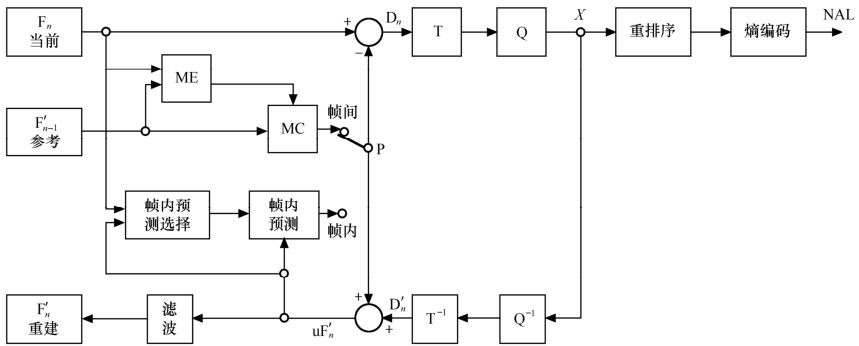

*图示：H.264 编码器模型，见《新一代视频压缩编码标准》图 5.1。*

**图示解释**:
`图 5.1` 清晰地展示了预测编码的核心环路：

1.  **预测 (Prediction)**: 编码器通过 **帧内预测 (Intra Prediction)** 或 **帧间预测 (Inter Prediction)** 模块，根据**已解码的参考数据**生成一个预测块 `P`。
2.  **求残差 (Residual)**: 输入的原始块 `Fn` 减去预测块 `P`，得到 **残差块 `Dn`**。
3.  **编码路径**: 残差块 `Dn` 经过变换 `T`、量化 `Q`、重排序和熵编码后，与其他语法元素（如预测模式、MV等）一起送入码流。
4.  **重建环路 (Reconstruction Loop)**: 为了保证与解码器同步，量化后的系数 `X` 经过**反量化 `Q⁻¹`** 和**反变换 `T⁻¹`**，得到一个有损的重建残差 `D'n`。该重建残差与预测块 `P` 相加，形成重建块 `uF'n`。
5.  **参考帧生成**: 重建块 `uF'n` 经过 **去块效应滤波 (Deblocking Filter)** 后，得到最终的重建帧 `F'n`，并存入参考帧缓冲区，用于后续帧的预测。

---

H.264 标准定义了两种主要的预测类型，分别用于消除不同维度的冗余：

#### **1. 帧内预测**

*   **目标**: 消除图像内部的 **空间冗余 (Spatial Redundancy)**。
*   **原理**: 利用当前正在编码的图像内、已经被编码和**重建**的相邻块的像素值，来预测当前块的像素。
*   **应用**: 主要用于 **I 片 (I-Slice)** 和 **I 宏块 (I-Macroblock)**，是生成关键帧（IDR 帧）和场景切换帧的基础。

#### **2. 帧间预测**

*   **目标**: 消除视频序列中连续图像之间的 **时间冗余 (Temporal Redundancy)**。
*   **原理**: 在一个或多个先前已被编码并**重建**的 **参考帧 (Reference Frames)** 中，为当前块搜索一个最相似的匹配块。这个搜索过程称为 **运动估计 (Motion Estimation)**，而匹配块与当前块的位置偏移则由 **运动矢量 (Motion Vector, MV)** 来描述。解码端根据 MV 从参考帧中取出匹配块，作为当前块的预测，这个过程称为 **运动补偿 (Motion Compensation)**。
*   **应用**: 主要用于 **P 片 (P-Slice)** 和 **B 片 (B-Slice)**，是 H.264 实现高压缩率的主要手段。

【**笔记**】
- **预测编码核心**: `编码数据 ≈ 原始块 - 预测块`。
- **参考数据来源**: 无论是帧内还是帧间预测，都必须使用**已解码并重建 (Decoded and Reconstructed)** 的数据作为参考，以确保编解码器同步。
- **帧内预测 (Intra)**:
    - **来源**: 同一图像内的**相邻重建像素**。
    - **消除**: **空间冗余**。
- **帧间预测 (Inter)**:
    - **来源**: **参考帧**中的重建像素。
    - **消除**: **时间冗余**。
    - **产出**: **运动矢量 (MV)** 和参考帧索引。

### 3.1.1 帧内预测

帧内预测是 H.264 用来消除**空间冗余**的核心技术。它不依赖于其他图像，仅利用当前图像中已编码块的像素来预测当前块，因此适用于 I 帧/I 片的编码，并能有效地阻止错误的传播。

H.264 针对不同块大小和内容特性，提供了多种精细的预测模式。

---

#### **1. 亮度预测**

针对亮度分量，H.264 提供了三种块大小的预测模式：

*   **Intra_4x4 预测模式**
    
    * **对象**: 16x16 宏块内的每个 4x4 子块。
    
    * **特点**: 提供了 **9 种** 预测模式，适用于细节丰富、纹理复杂的区域。
    
    * **预测源**: 使用当前 4x4 块**上方**和**左方**【**已重建**】的相邻像素作为预测参考（注意不是原始数据）。

    *   *图示：Intra_4x4 预测的 9 种预测方向，见《新一代视频压缩编码标准》图 5.14 和图 5.15。*
        
        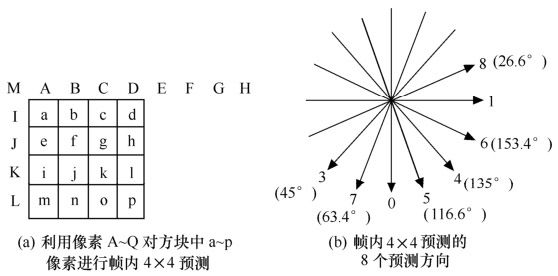
        
        * **图 5.14** 展示了预测所需的相邻像素 A-M，以及 8 个具有方向性的预测模式和 1 个 DC 预测模式。
        
          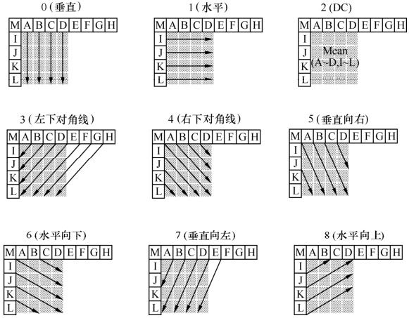
        
        *   **图 5.15** 直观地展示了 9 种模式的预测方向和名称，包括垂直、水平、DC 和 6 个对角线方向。
    
*   **Intra_16x16 预测模式**
    
    * **对象**: 整个 16x16 亮度宏块。
    
    * **特点**: 提供了 **4 种** 预测模式，适用于大面积平坦区域。
    
    * **预测源**: 使用当前 16x16 宏块**上方**和**左方**的一行或一列已重建像素作为预测参考。
    
    *   *图示：Intra_16x16 预测的 4 种模式，见《新一代视频压缩编码标准》图 5.17。*
        
        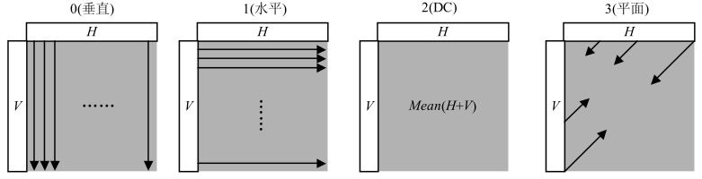
        
        *   模式 0 (垂直): 使用上方像素垂直向下填充。
        *   模式 1 (水平): 使用左方像素水平向右填充。
        *   模式 2 (DC): 使用上方和左方像素的平均值填充。
        *   模式 3 (平面): 使用上方和左方的像素进行线性插值，适用于渐变区域。
    
*   **Intra_8x8 预测模式 (High Profile)**
    
    *   这是在 **High Profile** 中引入的模式，作为 4x4 和 16x16 模式的折中，细节和原理与 Intra_4x4 类似，此处不做详述。

#### **2. 色度预测**

*   **对象**: 整个 8x8 色度块 (Cb 和 Cr)。
*   **特点**: 提供了 **4 种** 预测模式，与 Intra_16x16 的模式类似，因为色度分量通常比较平坦。
*   **预测源**: 使用当前色度块**上方**和**左方**已重建的相邻色度像素。
*   **模式**: DC、水平、垂直、平面，与 Intra_16x16 的 4 种模式在原理上基本一致。

#### **模式选择**

编码器会针对每个块，尝试所有可用的帧内预测模式，并通过 **率失真优化 (Rate-Distortion Optimization, RDO)** 算法计算每种模式的代价 (Cost)。最终选择代价最小的模式作为该块的最佳预测模式，并将该模式的索引值写入码流。

【**笔记**】
- **帧内预测基础**: 利用已编码重建的**左边**和**上边**像素预测当前块。
- **亮度预测模式**:
  - **Intra_4x4**: **9 种模式** (垂直, 水平, DC, 6 个对角)，用于**细节区域**。
  - **Intra_16x16**: **4 种模式** (垂直, 水平, DC, 平面)，用于**平坦区域**。
- **色度预测模式**:
  - **Intra_8x8_Chroma**: **4 种模式** (DC, 水平, 垂直, 平面)，与 16x16 亮度模式类似。
- **选择机制**: 编码器通过 **率失真优化 (RDO)** 遍历所有可用模式，选择**代价最小**的一种。

### 3.1.2 帧间预测

帧间预测是 H.264 用来消除视频序列中连续图像之间 **时间冗余** 的核心技术。其基本原理是：假设相邻的图像之间内容变化很小，那么当前图像的块就可以通过参考先前或后续已编码图像的块来预测。

---

#### **1. 核心流程**

核心流程：运动估计与运动补偿

帧间预测主要包含两个紧密相连的核心过程：

*   **运动估计 (Motion Estimation, ME)**
    
    * **定义**: 在编码器端，为当前要编码的块（例如一个 `N x M` 的**当前帧块**），在一个或多个**参考帧**的**搜索区 (Search Window)** 内，通过块匹配算法寻找一个最相似的匹配块。
    
    *   *图示：运动估计算法示意图，见《新一代视频压缩编码标准》图 3.12。*
        
        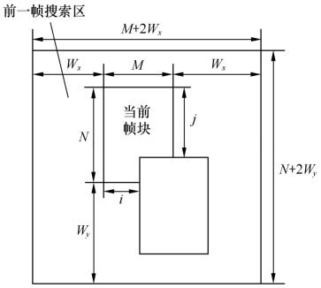
        
        *   **图 3.12 解读**:
            
            1. **当前块**: 图右侧“当前帧”中的 `N x M` 块是我们需要进行编码的目标块。
            
            2. **搜索区**: 为了给当前块找到匹配对象，我们在“前一帧”（即参考帧）中定义一个更大的区域，即 **搜索区 (Search Window)**。该区域的大小为 `(M + 2Wx) x (N + 2Wy)`，其中 `Wx` 和 `Wy` 分别代表水平和垂直方向的最大搜索范围。
            
            3. **块匹配**: 编码器以像素为单位（后续我们还可以以1/4像素进行移动）在搜索区内进行移动，寻找一个与当前块同样大小 (`N x M`) 的窗口，计算窗口内的候选块与当前块的差异。差异程度通常用 **匹配准则 (Matching Criterion)** 来衡量，例如：
               - **SAD (Sum of Absolute Differences)**: 差值绝对值和。
               - **SATD (Sum of Absolute Transformed Differences)**: 哈达玛变换后的差值绝对值和。
            
            4. **运动矢量 (MV)**: 经过遍历搜索，当找到一个候选块使得匹配准则的值最小时，我们就认为找到了**最佳匹配块**。这个最佳匹配块相对于搜索区中心的位移 `d(i, j)`，就是我们最终要找的 **运动矢量 (Motion Vector)**。例如，如果最佳匹配块在搜索中心的左上方，那么 MV 的两个分量 `i` 和 `j` 就可能是负值。
        
    *   **产出**: 运动估计的结果是一个 **运动矢量 (Motion Vector, MV)**，它是一个二维向量 `(i, j)`，用于描述当前块与参考帧中最佳匹配块之间的空间位置偏移。
    
*   **运动补偿 (Motion Compensation, MC)**
    
    *   **定义**: 在编码器（重建环路中）和解码器端，根据码流中解码出的 **运动矢量 (MV)**，从指定的参考帧中找到并取出最佳匹配块，用这个匹配块作为对当前块的**预测值**。

#### **2. 帧间预测的关键增强**

H.264 在传统帧间预测的基础上引入了多项关键技术，极大地提升了预测精度和编码效率。

*   **可变尺寸块运动补偿 (Variable Block Sizes)**
    * H.264 允许将一个 16x16 的宏块划分为不同尺寸的子块（16x8, 8x16, 8x8），并且 8x8 的子块还可以进一步划分为更小的分区（8x4, 4x8, 4x4）。
    
    * **作用**: 对于运动平缓的大面积区域，可以使用大尺寸块进行预测；对于运动细节复杂的区域，则使用小尺寸块进行精细预测，从而在编码效率和预测精度之间达到最佳平衡。

    * *图示：宏块及子宏块的分割方式，见《新一代视频压缩编码标准》图 5.20。*
    
      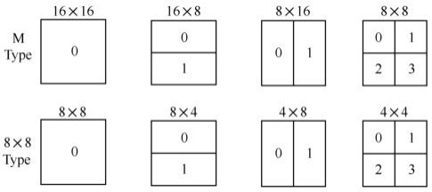
    
*   **多参考帧 (Multiple Reference Frames)**
    *   H.264 允许编码器在多个（最多 16 个）已解码的参考帧中进行运动搜索。
    *   **作用**: 提高了找到最佳匹配块的概率，尤其是在处理遮挡、出入画面、重复性运动等复杂场景时效果显著，能有效提高压缩率和图像质量。

*   **1/4 像素精度运动矢量 (Quarter-Pixel MV)**
    * **问题**: 真实世界物体的运动是连续的，其位移并不总是像素的整数倍。如果运动估计只能在整数像素点上寻找匹配块，预测精度会受到很大限制，导致较大的预测残差。
    
    * **H.264 解决方案**: 通过对参考帧的整数像素进行**插值 (Interpolation)**，在整数像素之间生成“虚拟”的**半像素 (Half-Pixel)** 和 **1/4 像素 (Quarter-Pixel)** 位置的像素值。这样，运动搜索就可以在更精细的网格上进行，从而找到更精确的匹配位置。
    
    *   **实现步骤**:
        1.  **半像素插值**: 首先，利用整数像素点，通过一个 **6 抽头 FIR 滤波器 (6-tap FIR Filter)** 计算出它们之间的半像素点的值。这是一种加权平均的过程，考虑了周围多个整数像素的影响。
        2.  **1/4 像素插值**: 接着，利用已生成的半像素点和原始的整数像素点，通过简单的**线性平均 (Linear Interpolation)** 计算出它们之间的 1/4 像素点的值。
    
    *   *图示：亮度半像素和 1/4 像素的内插方法，见《新一代视频压缩编码标准》图 5.22 和图 5.23。*
        
        *   **图 5.22 解读**:
            
            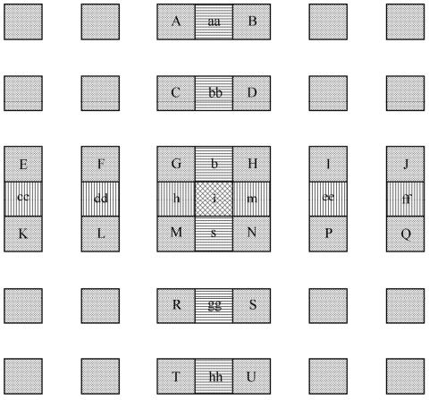
            
            *   大写字母 (A, B, C...) 代表**原始的整数像素**。
            *   小写字母 (aa, b, h...) 代表通过插值生成的**半像素**。例如，`b` 是通过对其左右 6 个整数像素 (E, F, G, H, I, J) 进行滤波计算得到的。
            *   这张图展示了生成所有半像素位置的完整过程。
            
        *   **图 5.23 解读**:
            
            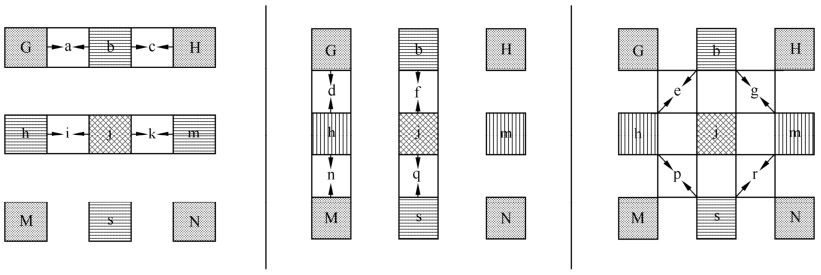
            
            *   这张图展示了在整数像素 (G, H) 和半像素 (b, h) 存在后，如何通过简单的线性平均（即取均值）生成 `a`, `c`, `e` 等 **1/4 像素**。例如 `a = (G + b + 1) >> 1`。
        
    *   **效果**: 这种高精度的运动补偿能够极大地减少预测残差，是 H.264 相比于旧标准压缩性能大幅提升的关键技术之一。

#### **3. 应用于 P 片与 B 片**

*   **P 片 (Predicted Slice)**: 仅使用**前向预测**。即它的参考帧必须是在解码顺序上位于其之前的一帧或多帧。
*   **B 片 (Bi-predictive Slice)**: 可以使用**双向预测**。它可以使用：
    1.  **前向预测**: 参考解码顺序在前的帧。
    2.  **后向预测**: 参考解码顺序在后的帧。
    3.  **双向预测**: 同时参考前后两个帧，将两个预测块进行加权平均，得到最终预测值。这通常能提供最精确的预测。

【**笔记**】
- **帧间预测**: 利用**时间冗余**，通过参考帧进行预测。
- **核心流程**: **运动估计(ME)** -> **运动矢量(MV)** -> **运动补偿(MC)**。
- **H.264 关键特性**:
  - **可变块尺寸**: 16x16 ~ 4x4，自适应运动复杂度。
  - **多参考帧**: 提高匹配成功率，增强鲁棒性。
  - **1/4 像素精度**: 通过插值实现高精度预测。
- **P 片**: 只能参考**过去**的帧。
- **B 片**: 可以参考**过去**和**未来**的帧，压缩率最高，但会引入延迟。

## 3.2 变换与量化

预测编码有效地消除了大部分时空冗余，但预测后得到的**残差 (Residual)** 数据块（“原始图像”与“预测图像”之间的差异）内部仍然存在空间相关性，并且数据量依然很大。变换与量化的目的就是对残差数据进行进一步的压缩。

在 H.264 的标准预测模式 (Intra/Inter) 中，输入到本模块的**总是残差块**。只有在一种名为 **I_PCM** 的特殊无损模式下，编码器会跳过预测、变换和量化，直接传输原始图像块数据。

---

#### **1. 变换：信息“归类整理”**

*   **目标**: 将残差块中杂乱无章的像素信息，变得有规律、易于压缩。
*   **通俗理解**: 想象一下，一个残差块就像一筐杂乱的沙子和石子。变换就像一个神奇的筛子，它能把这筐混合物按“重要性”或“特征”分开。
    *   **变换前**: 像素值（亮度/颜色差异）杂乱分布。
    *   **变换后**: 信息被分为“**低频系数**”和“**高频系数**”。
        *   **低频系数**: 代表了图像的**主要轮廓和基本结构**，能量大，数量少。就像筛出来的大石子。
        *   **高频系数**: 代表了图像的**细节、纹理和噪点**，能量小，数量多。就像筛出来的细沙。
*   **H.264 的方法**: 主要使用一种称为 **4x4 整数 DCT** 的技术。它的优点是计算快，且不会产生误差。

#### **2. 量化：信息“有损丢弃”**

*   **目标**: **有损压缩**的核心步骤，通过“模糊化”处理，大幅减少需要存储的数据量。
*   **通俗理解**: 经过变换后，我们虽然归类了信息，但总量没变。现在我们需要丢掉一些不那么重要的信息。
    *   **高频系数 (细沙)**: 人眼对微小的细节和噪点不敏感。量化过程会非常“粗暴”地处理这些高频系数，比如将 `1, 2, 3, 4` 这样的小数值直接当作 `0` 处理并丢弃。
    *   **低频系数 (大石子)**: 人眼对轮廓很敏感。量化过程会相对“温柔”地处理这些低频系数，只做一些轻微的近似，比如将 `123` 近似为 `120`。
*   **H.264 的方法**: 使用 **量化参数 (Quantization Parameter, QP)** 来控制这个“粗暴”的程度。
    *   **低 QP (精细模式)**: 丢弃的信息少，画面清晰，但文件大。
    *   **高 QP (粗糙模式)**: 丢弃的信息多，画面模糊，但文件小。

*图示：编码器中变换编码与量化的流程，见《新一代视频压缩编码标准》图 5.46。*

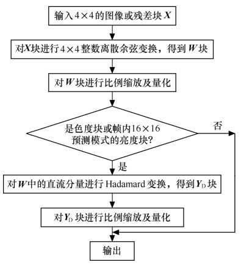

**图示解读**:
`图 5.46` 展示了 H.246 编码器如何处理一个 4x4 的残差块 `X`，并最终输出量化后的系数 `Z` 送往熵编码。

1.  **通用路径 (所有残差块)**:
    *   首先，输入的 4x4 残差块 `X` 必须经过 **4x4 整数离散余弦变换**。
    *   变换后得到的系数块 `W`，再经过 **比例缩放和量化**。这是标准的变换量化流程。

2.  **特殊路径 (针对 DC 系数)**:
    *   **判断**: 此时，系统会判断这个 4x4 块是否是特殊块——即它是否由 **Intra_16x16 宏块** 或 **色度宏块** 的 **DC 系数** 组成。
    *   **额外处理**: 如果是，这个已经处理过的 DC 系数块还需要经过一次额外的 **Hadamard 变换** 和 **二次量化**，以实现更深度的压缩。

**核心思想**: 所有残差数据都必须经过 **变换 + 量化**。对于能量最集中的 DC 系数（代表了块的平均亮度/色度），H.264 会不遗余力地进行一次额外的“精加工”（Hadamard 变换），以最大化压缩效率。

**流程总结**:
**残差块** -> **[变换]** -> **一组系数（能量集中）** -> **[量化]** -> **一组稀疏的系数（大量为零）**

【**笔记**】
- **变换 (Transform)**:
  - **作用**: **归类整理**。将像素信息转换为频域系数，把重要的信息（低频）和次要的（高频）分离开。
- **量化 (Quantization)**:
  - **作用**: **有损丢弃**。通过“四舍五入”的方式，丢弃大量不重要的高频系数，保留重要的低频系数。**这是压缩产生损失的根源**。
- **量化参数 (QP)**: 控制压缩的“狠度”。**QP 越高，压缩越狠，画质越差，文件越小**。

---
经过变换和量化，残差块变成了一组大部分值为零的稀疏系数。下一节，我们将学习如何对这些系数进行最终的打包——熵编码。

## 3.3 熵编码

熵编码是 H.264 压缩流程的最后一步，它是一种**无损压缩**技术。其基本原理是为出现频率高的符号（或数值）分配较短的码字，为出现频率低的符号分配较长的码字，从而在统计上达到最短的平均码长。

在 H.264 中，熵编码不仅用于处理量化后的残差系数，也用于编码预测模式、运动矢量差等各类语法元素。

---

#### **1. 准备工作：Z 字形扫描**

在对一个 4x4 或 8x8 的量化系数块进行熵编码之前，需要先将其从二维矩阵转换为一维序列。H.264 采用 **Z 字形扫描 (Zig-Zag Scan)**。

* **目的**: 变换和量化之后，幅值不为零的系数大多集中在矩阵的左上角（低频区域），而右下角（高频区域）则有大片的零。Z 字形扫描能够将这些连续的零有效地组织在一起，形成很长的“零游程 (Run of Zeros)”，这非常有利于后续的游程编码 (Run-Length Encoding)，从而提高压缩效率。

* 游程编码：

  在变换域，量化后系数用三个量表示，即0的个数（称为游程）、系数值和最后的位置。如非0系数已处于最后的位置或其后均为0，则置1，不然置0。现举例说明。

  经锯齿形扫描后，得输入序列：

  `15，0，0，-3，4，5，0，0，0，0，-7，0，0，0…`

  则经游程编码后值为：

  `（0，15，0），（2，-3，0），（0，4，0），（0，5，0），（4，-7，1）`

*图示：系数的 Z 字形扫描顺序，见《新一代视频压缩编码标准》图 3.36。*


#### **2. H.264 的两种熵编码方法**

H.264 提供了两种不同的熵编码方案，编码器可以根据 `profile_idc` 和 `entropy_coding_mode_flag` 来选择其中一种。

*   **上下文自适应可变长编码 (Context-Adaptive Variable-Length Coding, CAVLC)**
    *   **原理**: 一种基于变长编码 (VLC) 的技术，类似于 Huffman 编码。它的“上下文自适应”体现在它会根据已编码的语法元素（上下文），动态地选择不同的 VLC 表来进行编码。例如，它会根据相邻块的非零系数数量来选择最适合当前块的编码表。
    *   **特点**: 相比于固定 VLC 表，CAVLC 效率更高，但计算复杂度低于 CABAC。
    *   **应用**: H.264 **基准档次 (Baseline Profile)** 的标准熵编码方法。

*   **上下文自适应二进制算术编码 (Context-Adaptive Binary Arithmetic Coding, CABAC)**
    *   **原理**: 一种基于算术编码的技术。它不使用固定的码字表，而是为每个待编码的符号（二进制位），根据其上下文（已编码的相邻符号）动态地估计其概率，然后将整个符号序列映射到 0 到 1 之间的一个小数。
    *   **特点**: 编码效率非常高，相比 CAVLC，通常能带来 **10% ~ 15%** 的码率节省。但其计算复杂度也更高。
    *   **应用**: H.264 **主要档次 (Main Profile)** 和 **高级档次 (High Profile)** 的标准熵编码方法。

【**笔记**】
- **熵编码**: 压缩流程的**无损**最后一步，核心是“频繁的短，稀有的长”。
- **Z 字形扫描**: 熵编码前的准备步骤，将 2D 系数块转为 1D 序列，目的是创造更长的**零游程**。
- **CAVLC**:
  - **技术**: 变长编码 (VLC) + 上下文自适应。
  - **特点**: 复杂度较低，效率良好。
  - **应用**: **Baseline Profile**。
- **CABAC**:
  - **技术**: 算术编码 + 上下文自适应。
  - **特点**: 复杂度较高，**压缩效率更高 (节省 10-15%)**。
  - **应用**: **Main/High Profiles**。

---
至此，我们已经完整地学习了 H.264 的核心编码原理。下一章，我们将深入探讨这些原理是如何通过精确的**句法和语义**在码流中进行表达的。

# 第四章：H.264 码流句法解析

在 H.264 标准中，“句法”和“语义”是定义码流结构和解码过程的基石。本章将从整体上介绍 H.264 的句法体系，为后续深入解析具体数据单元（参数集、片等）打下基础。

## 4.0 H.264 句法体系概述

#### **1. 句法元素**

*   **定义**: 码流中承载特定信息的**最小语法单元**。可以将其理解为码流这门“语言”中的一个个“单词”。每个句法元素由若干比特组成，代表一个具体的编码参数或数值（如宏块类型、量化参数）。
*   **命名**: 在标准文档中，采用**小写字母和下划线**命名，如 `slice_type`。

#### **2. 句法元素的分层结构**

H.264 的句法元素被组织成一个逻辑上的层次结构，从高层到低层依次包含，每一层描述不同粒度的信息。这种结构有助于数据封装和错误隔离。

*图示：句法元素的分层结构，见《新一代视频压缩编码标准》图 6.1。*

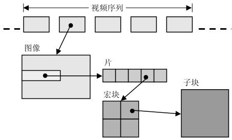

*   **图示解读**:
    *   **视频序列 (Sequence)**: 最高层，包含一系列图像。
    *   **图像 (Picture)**: 由一个或多个片组成。
    *   **片 (Slice)**: 独立解码的基本单元，由多个宏块组成。
    *   **宏块 (Macroblock)**: 编码的基本处理单元。
    *   **子宏块/块 (Sub-macroblock/Block)**: 宏块可以进一步划分为更小的单元。

    **关键点**: H.264 创新性地将高层（序列和图像）的大部分全局信息抽离出来，形成了**参数集**，而将频繁变化的数据保留在**片层**，极大地增强了码流的灵活性和鲁棒性。

#### **3. 句法的表示方法**

H.264 标准文档使用一种类似于 C 语言的伪代码来描述句法结构。

*   **句法元素与变量**:
    *   从码流中直接解析出的字段称为**句法元素** (`小写_下划线`)。
    *   解码器内部用于计算的中间值称为**变量** (`驼峰式命名`)。
    *   *示例*: 解码器读取句法元素 `pic_width_in_mbs_minus1`，然后计算出变量 `PicWidthInMbs = pic_width_in_mbs_minus1 + 1`。

*   **语法结构**:
    *   使用 `if/else`, `do/while`, `for` 等控制流语句来表示句法元素的出现条件。
    *   *示例*: `if( frame_mbs_only_flag == 0 )` 意味着只有当 `frame_mbs_only_flag` 为 0 时，其后的句法元素才会存在于码流中。

*   **描述符 (Descriptor)**:
    *   每个句法元素都关联一个描述符，规定了其**解码方法**。
    *   *常见描述符*:
        *   `u(n)`: 无符号整数，定长 `n` 比特。
        *   `ue(v)`: 无符号指数哥伦布编码（变长）。
        *   `se(v)`: 有符号指数哥伦布编码（变长）。
        *   `ae(v)`: 上下文自适应算术编码（CABAC）。

#### **4. 句法表**

H.264 标准的核心内容就是一系列的**句法表**。这些表格精确地定义了从 NAL 层到宏块层的每一层数据是如何组织的，以及每个句法元素的解析顺序和条件。本章后续内容将围绕这些核心句法表展开。

---
本节内容为您解析后续章节提供了必要的预备知识。接下来我们将进入 **4.1 码流的宏观结构**。

## 4.1 码流的宏观结构

一个完整的 H.264 码流并不仅仅是简单的视频帧序列，而是由多种不同类型的 NAL 单元（NALU）按照特定规则组织而成的复杂序列。理解其宏观结构是正确解析码流的前提。

---

*图示：H.264 码流中的数据单位，见《新一代视频压缩编码标准》图 6.4。*

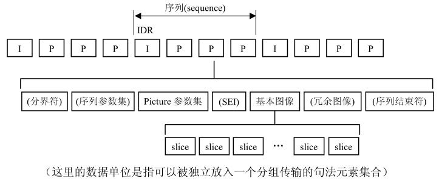

#### **图 6.4 元素顺序解读**

`图 6.4` 展示了一个典型的 H.264 码流序列 (`sequence`) 的构成，我们按照从左到右的顺序逐一解析其核心数据单位：

1.  **分界符 (Delimiter)**
    *   在图中，它位于序列的开端。在实际码流中，这通常指 **访问单元分隔符 (Access Unit Delimiter, AUD)**。
    *   **NALU 类型**: `nal_unit_type = 9`。
    *   **作用**: AUD 作为一个可选的 NALU，用于明确标识一个**访问单元 (Access Unit, AU)** 的开始。一个 AU 通常包含一个完整图像（或一帧）的所有 NALU。它在需要从码流中方便地定位帧边界的场景（如 MPEG-2 传输流）中非常有用。

2.  **序列参数集 (SPS) & 图像参数集 (PPS)**
    *   **位置**: 紧跟在分界符之后，位于第一个图像数据之前（其中PPS可以有多个）。
    *   **作用**: 它们是解码整个序列和图像所必需的“元数据”或“说明书”。解码器必须在解析任何图像数据前获取它们。

3.  **补充增强信息 (SEI - Supplemental Enhancement Information)**
    *   **NALU 类型**: `nal_unit_type = 6`。
    *   **作用**: 提供非解码核心所需的**附加信息**，如时间码、版权信息等。解码器可以解析利用，也可以安全地忽略它。

4.  **基本图像 (Primary Picture)**
    *   **组成**: 由一个或多个**片 (Slice)** 的 NALU 组成。
    *   **IDR 图像**: 序列的第一个基本图像必须是 **IDR (Instantaneous Decoding Refresh) 图像**。IDR 图像是一个特殊的 I 图像，它会强制清空解码器的参考帧缓冲区，确保该图像及其后续所有图像可以独立于码流前面的任何数据进行解码。
    *   **非 IDR 图像**: 序列中后续的图像可以是 I、P 或 B 图像。

5.  **冗余图像 (Redundant Picture)**
    *   **作用**: 这是一种错误恢复机制。编码器可以为某个基本图像生成一个或多个**冗余副本**。这些副本通常使用更高的量化参数（即更低的质量）进行编码，因此数据量更小。
    *   **解码**: 正常情况下，解码器只解码基本图像。但如果基本图像的数据在传输中丢失或损坏，解码器可以转而解码冗余图像，从而恢复出一个质量较低但可用的画面，避免画面完全丢失。

6.  **序列结束符 (End of Sequence)**
    *   **NALU 类型**: `nal_unit_type = 10`。
    *   **作用**: 明确地标识一个编码视频序列的结束。解码器在接收到此 NALU 后，可以认为当前序列已完整结束。

【**笔记**】
- **码流全貌**: 一个 H.264 序列通常以 `AUD (可选)` -> `SPS` -> `PPS` -> `SEI (可选)` -> `IDR Slice(s)` 开始。
- **IDR 帧**: 序列的**绝对起始点**和**刷新点**。
- **AUD vs. 序列结束符**:
  - `AUD (nal_unit_type = 9)`: 标记一个**访问单元（通常是一帧）的开始**。
  - `End of Sequence (nal_unit_type = 10)`: 标记**整个视频序列的结束**。两者作用不同。
- **冗余图像**: 一种**容错机制**，是基本图像的低质量副本，用于在数据丢失时进行恢复。

## 4.2 NAL 层句法解析

NAL (网络适配层) 的核心任务是将 VCL (视频编码层) 产生的编码数据打包成一个个独立的 NAL 单元 (NALU)，以便于在各种网络和存储环境中传输。理解 NAL 层的句法是解析任何 H.264 码流的第一步。

---

#### **1. NALU 基本结构**

每个 NALU 由两部分组成：一个 1 字节的 **NAL 头部 (NAL Header)** 和紧随其后的 **原始字节序列载荷 (RBSP)**。

`NAL Unit = 1 byte NAL Header + RBSP`

*   **RBSP (Raw Byte Sequence Payload)**:
    *   这是来自 VCL 的原始编码数据，例如一个完整的 SPS、PPS 或一个 Slice 的数据。
    *   为了防止其内部出现与 Annex B 格式的起始码 (`0x000001`) 冲突的字节序列，RBSP 在封装进 NALU 前会经过**防竞争字节 (Emulation Prevention Bytes)** 处理。

#### **2. NAL 头部**

NAL 头部是每个 NALU 的第一个字节，它包含了识别该 NALU 内容和属性的所有信息。

| Bit      | 7                  | 6   5       | 4   3   2   1   0 |
| :------- | :----------------- | :---------- | :---------------- |
| **字段** | `F`                | `nri`       | `type`            |
| **名称** | forbidden_zero_bit | nal_ref_idc | nal_unit_type     |

*   **`forbidden_zero_bit` (1 bit)**
    *   H.264 规范规定该位必须为 `0`。如果网络传输中检测到该位为 `1`，则表明该 NALU 可能存在比特错误。

*   **`nal_ref_idc` (2 bits)**
    *   **语义**: NAL Reference IDC (指示)。表示该 NALU 的重要性，或者说它是否被用作**参考**来解码其他图像。
    *   **取值**:
        *   `00`: 该 NALU 不用于参考（例如 B 帧的 Slice，SEI）。在网络拥塞时，这些 NALU 可以被优先丢弃。
        *   `01` ~ `11`: 该 NALU 包含用于参考的图像数据（例如 I 帧、P 帧的 Slice），值越大表示越重要。SPS 和 PPS 的 `nri` 也必须大于 0。

*   **`nal_unit_type` (5 bits)**
    *   **语义**: 定义了 NALU 中 RBSP 的数据类型。这是解码器进行码流解析时**首先要检查的字段**。
    *   **核心类型值与含义**:

| `nal_unit_type` |  C   | 描述                                                         |
| :-------------: | :--: | :----------------------------------------------------------- |
|        0        |  -   | 未定义                                                       |
|        1        |  2   | 非 IDR 图像的编码条带 (P/B Slice)                            |
|     2, 3, 4     |  2   | 数据分区 A, B, C (Data Partition)。一种不常用的容错技术，将片数据拆分成三个不同重要性的 NALU。 |
|        5        |  2   | IDR 图像的编码条带 (I Slice in an IDR picture)               |
|        6        |  3   | 补充增强信息 (SEI - Supplemental Enhancement Information)    |
|        7        |  0   | 序列参数集 (SPS - Sequence Parameter Set)                    |
|        8        |  1   | 图像参数集 (PPS - Picture Parameter Set)                     |
|        9        |  4   | 访问单元分隔符 (AUD - Access Unit Delimiter)                 |
|       10        |  5   | 序列结束符 (End of Sequence)                                 |
|       11        |  6   | 码流结束符 (End of Stream)                                   |

*   *注：C 列代表类别，用于数据分区，此处仅作了解。*

【**笔记**】
- **解析入口**: 解析 H.264 码流的第一步是找到 NALU 边界（通过起始码或长度），然后读取 NAL Header 的第 1 个字节。
- **关键操作**: `nal_unit_type = nal_header_byte & 0x1F;`。通过这个位运算，可以立即获知当前 NALU 的类型。
- **实践流程**:
  1.  从码流中分离出单个 NALU 的数据（不含起始码）。
  2.  取该数据段的第一个字节 `nal_header_byte`。
  3.  计算 `nal_unit_type`。
  4.  使用 `switch (nal_unit_type)` 对不同类型的 NALU（如 SPS, PPS, Slice）进行分类处理。

## 4.3 关键 NALU 内容概览

在通过 `nal_unit_type` 识别出 NALU 的类型后，我们需要了解其内部 RBSP 承载的核心信息。本节对 SPS、PPS 和 Slice Header 进行概览，重点关注实践中最常用到的句法元素。

---

#### **1. SPS 概览**

`nal_unit_type = 7`

SPS 提供了解码整个视频序列所需的全局参数。正确设置这些参数是编码高质量、高兼容性码流的关键。

*   **核心句法元素解读**:
    
    *   **`profile_idc`**: **档次**，定义了码流所使用的编码工具子集。
        *   `66` (Baseline Profile): 支持 I/P 帧，CAVLC。简单、计算复杂度低，适用于实时通信（如视频会议）。
        *   `77` (Main Profile): 在 BP 基础上增加 B 帧、CABAC 等，压缩效率更高。适用于标清数字电视。
        *   `100` (High Profile): 在 MP 基础上增加 8x8 变换、量化矩阵等，压缩效率最高。是高清应用（直播、蓝光）的主流选择。
    *   **`level_idc`**: **级别**，在特定 Profile 基础上，对码率、分辨率、帧率等参数设置的一系列上限。级别越高，对解码器的性能要求越高。
        *   例如：`level_idc = 41` (Level 4.1) 支持 1080p@30fps，而 `level_idc = 42` (Level 4.2) 支持 1080p@60fps。
    
*   **FFmpeg C++ API 实践**:
    *   在 C++ 中使用 FFmpeg 的 `libx264` 编码器时，可以通过 `AVDictionary` (或 `av_opt_set`) 来设置 `profile` 和 `level`。

    ```cpp
    #include <libavcodec/avcodec.h>
    #include <libavutil/opt.h>
    
    // 假设 pCodecCtx 是你的 AVCodecContext 指针
    AVDictionary *opts = nullptr;
    
    // 1. 设置 Profile (档次)
    // 可选值: "baseline", "main", "high", "high10", "high422", "high444"
    av_dict_set(&opts, "profile", "high", 0);
    
    // 2. 设置 Level (级别)
    // libx264 使用的 Level 值是 level_idc 的 10 倍。例如 Level 4.1 对应 "4.1" 或 "41"。
    av_dict_set(&opts, "level", "4.1", 0);
    
    // 如果使用 av_opt_set (更现代的方式)
    // av_opt_set(pCodecCtx->priv_data, "profile", "high", 0);
    // av_opt_set(pCodecCtx->priv_data, "level", "4.1", 0);


    // 在 avcodec_open2 之前将这些选项应用到编码器上下文
    // int ret = avcodec_open2(pCodecCtx, codec, &opts);
    // av_dict_free(&opts); // 打开后释放字典
    ```

#### **2. PPS 概览 **

`nal_unit_type = 8`

PPS 定义了序列中一帧或多帧图像的编码参数。

*   **核心句法元素解读**:
    *   `pic_parameter_set_id`: PPS 的 ID。
    *   `seq_parameter_set_id`: 此 PPS 所引用的 SPS 的 ID。
    *   `entropy_coding_mode_flag`: 熵编码模式选择 (`0`: CAVLC, `1`: CABAC)。
    *   `pic_init_qp_minus26`: 初始量化参数 QP 的偏移量。

#### **3. Slice Header 概览 **

`nal_unit_type = 1, 5`

片头 (Slice Header) 包含了正确解码一个片所需的所有信息。

*   **核心句法元素解读**:
    *   `slice_type`: **片的类型**，这是最重要的字段之一，决定了片内宏块的预测方式。
    *   `frame_num`: 图像的解码顺序号，用于参考帧管理。
    *   `pic_parameter_set_id`: 该片所引用的 PPS 的 ID。

【**笔记**】
- **Profile & Level**:
    - **Profile**: 决定了**能用哪些编码工具** (决定了兼容性和压缩效率)。
    - **Level**: 决定了**编码参数的上限** (决定了解码器的性能要求)。
- **FFmpeg C++ API**: 使用 `av_dict_set` 或 `av_opt_set` 设置 `profile` 和 `level` 选项。
- **关键链接**: 解码器通过 `Slice Header` 中的 `pic_parameter_set_id` 找到 PPS，再通过 PPS 中的 `seq_parameter_set_id` 找到 SPS，从而获取解码所需的所有参数。

# 第五章：实践：NALU 提取与解析

本章的目标是将理论知识转化为代码实现。我们将分别针对 **Annex B** 和 **AVCC** 两种码流格式，实现 NALU 的提取，并重点解析 SPS 和 PPS，以获取视频的基本信息。

## 5.1 Annex B 格式码流解析

Annex B 格式通过起始码来分隔 NALU，常见于实时流媒体传输。您的 C++ 代码示例 `find_h264_start_code` 正是用于处理这种格式。

【**笔记：Annex B 格式 NALU 提取与解析流程**】

```cpp
/*
 * 核心思路：通过搜索起始码来定位并分离每个 NALU。
 * 
 * 关键实现步骤：
 */

// 1. 定义起始码常量
const uint8_t start_code_3[] = {0x00, 0x00, 0x01};
const uint8_t start_code_4[] = {0x00, 0x00, 0x00, 0x01};

// 2. 实现一个函数来查找起始码
//    该函数从给定位置开始，在数据流中搜索 3字节或4字节的起始码。
//    返回起始码的起始位置迭代器。
std::vector<uint8_t>::const_iterator find_start_code(
    std::vector<uint8_t>::const_iterator begin,
    std::vector<uint8_t>::const_iterator end) 
{
    const uint8_t startCode3[] = { 0x00, 0x00, 0x01 };
    const uint8_t startCode4[] = { 0x00, 0x00, 0x00, 0x01 };

    auto it = std::search(begin, end, std::begin(startCode4), std::end(startCode4));
    if (it != end) {
        return it; // 返回起始码的开始位置
    }

    it = std::search(begin, end, std::begin(startCode3), std::end(startCode3));
    if (it != end) {
        return it; // 返回起始码的开始位置
    }

    return end;
}

// 3. 主解析循环
void parse_annexb_stream(const std::vector<uint8_t>& stream_data) {
    auto it_curr = stream_data.cbegin();
    auto it_end = stream_data.cend();

    while (it_curr < it_end) {
        // a. 查找当前 NALU 的起始位置
        auto it_nal_begin = find_start_code(it_curr, it_end);
        if (it_nal_begin == it_end) {
            break; // 未找到更多起始码，解析结束
        }

        // b. 确定起始码长度 (3或4字节)
        size_t start_code_len = (it_nal_begin + 3 < it_end && *(it_nal_begin + 3) == 0x01) ? 4 : 3;
        auto it_data_begin = it_nal_begin + start_code_len;

        // c. 查找下一个 NALU 的起始位置，即当前 NALU 的结束位置
        auto it_nal_end = find_start_code(it_data_begin, it_end);

        // d. 提取 NALU 数据 (不含起始码)
        std::vector<uint8_t> nal_unit_data(it_data_begin, it_nal_end);

        // e. 解析 NALU Header
        if (!nal_unit_data.empty()) {
            uint8_t nal_unit_type = nal_unit_data & 0x1F;
            
            switch (nal_unit_type) {
                case 7: // SPS
                    // parse_sps(nal_unit_data);
                    break;
                case 8: // PPS
                    // parse_pps(nal_unit_data);
                    break;
                // ... 其他类型处理
            }
        }
        
        // f. 更新当前位置，准备下一次搜索
        it_curr = it_nal_end;
    }
}
```

*   **注意**: 在解析 SPS 和 PPS 的 RBSP 之前，需要先处理**防竞争字节**。即遍历 `nal_unit_data`，当遇到 `0x00 0x00 0x03` 序列时，将 `0x03` 移除。

## 5.2 AVCC 格式码流解析

AVCC 格式使用长度前缀来分隔 NALU，常见于 MP4 等文件容器。

【**笔记：AVCC 格式 NALU 提取与解析流程**】

```cpp
/*
 * 核心思路：循环读取“长度”和“数据”对。
 * 
 * 关键实现步骤 (假设长度字段为 4 字节):
 */
void parse_avcc_stream(const std::vector<uint8_t>& stream_data) {
    auto it_curr = stream_data.cbegin();
    auto it_end = stream_data.cend();
    const size_t NALU_LENGTH_FIELD_SIZE = 4; // 长度字段大小，可能为1, 2或4

    while (it_curr + NALU_LENGTH_FIELD_SIZE <= it_end) {
        // a. 读取 NALU 长度 (注意网络字节序转换)
        uint32_t nalu_length = 0;
        for (size_t i = 0; i < NALU_LENGTH_FIELD_SIZE; ++i) {
            nalu_length = (nalu_length << 8) | *(it_curr + i);
        }
        it_curr += NALU_LENGTH_FIELD_SIZE;
        
        if (it_curr + nalu_length > it_end) {
            // 数据不完整，解析错误
            break; 
        }

        // b. 提取 NALU 数据
        std::vector<uint8_t> nal_unit_data(it_curr, it_curr + nalu_length);
        
        // c. 解析 NALU Header (与 Annex B 格式相同)
        if (!nal_unit_data.empty()) {
            uint8_t nal_unit_type = nal_unit_data & 0x1F;
            
            switch (nal_unit_type) {
                case 7: // SPS
                    // parse_sps(nal_unit_data);
                    break;
                case 8: // PPS
                    // parse_pps(nal_unit_data);
                    break;
                // ... 其他类型处理
            }
        }
        
        // d. 更新当前位置
        it_curr += nalu_length;
    }
}
```
*   **注意**: AVCC 格式中的 NALU 数据**不包含起始码**，也**没有防竞争字节**。其 RBSP 就是纯净的编码数据，可以直接进行句法解析。

## 5.3 解析 Slice Header 获取帧类型

在 5.1 和 5.2 节中，我们已经能够提取出独立的 NALU，并通过 `nal_unit_type` 识别出 SPS、PPS 和 IDR 帧。但是，对于 `nal_unit_type = 1` 的非 IDR 图像，我们还无法区分它是 P 帧还是 B 帧。

要解决这个问题，我们需要进一步解析 RBSP 中的 **Slice Header**，读取其中的 `slice_type` 字段。由于 H.264 的句法元素大多使用 **指数哥伦布编码 (ue(v))**，我们需要先实现一个简单的解码器。

---

**1. 基础工具：指数哥伦布解码器 (Golomb Decoder)**

指数哥伦布编码是一种变长编码，非常适合表示概率分布不均匀的整数。其解码算法在标准文档中有明确规定。

【**笔记：Golomb 解码器实现**】

```cpp
#include <vector>
#include <cmath>
#include <stdexcept>

class GolombDecoder {
public:
    // 初始化：传入去除了防竞争字节的 RBSP 数据
    GolombDecoder(const std::vector<uint8_t>& rbsp_data) 
        : data_(rbsp_data), bit_idx_(0), byte_idx_(0) {}

    // 核心功能：读取无符号指数哥伦布编码 (ue(v))
    uint32_t read_ue() {
        int leading_zeros = 0;
        // 1. 计算前导零的个数
        while (byte_idx_ < data_.size() && !read_bit()) {
            leading_zeros++;
        }
        
        if (byte_idx_ >= data_.size()) return 0; // 越界保护

        // 2. 读取后续的 leading_zeros 位
        uint32_t suffix = read_bits(leading_zeros);
        
        // 3. 计算值: 2^M - 1 + suffix
        return (1 << leading_zeros) - 1 + suffix;
    }

    // 辅助功能：读取 1 个比特
    bool read_bit() {
        if (byte_idx_ >= data_.size()) return false;
        bool bit = (data_[byte_idx_] >> (7 - bit_idx_)) & 1;
        bit_idx_++;
        if (bit_idx_ == 8) {
            bit_idx_ = 0;
            byte_idx_++;
        }
        return bit;
    }

    // 辅助功能：读取 n 个比特
    uint32_t read_bits(int n) {
        uint32_t val = 0;
        for (int i = 0; i < n; i++) {
            val = (val << 1) | read_bit();
        }
        return val;
    }

private:
    const std::vector<uint8_t>& data_;
    size_t byte_idx_; // 当前字节索引
    int bit_idx_;     // 当前比特索引 (0-7)
};
```

---

**2. 解析 Slice Header**

有了 `GolombDecoder`，我们就可以解析 Slice Header 了。根据 H.264 句法表，Slice Header 的前几个字段通常是：
1.  `first_mb_in_slice` (ue(v))
2.  `slice_type` (ue(v))
3.  ...

【**笔记：获取帧类型的完整函数**】

```cpp
// 定义帧类型枚举
enum H264FrameType {
    FRAME_I,
    FRAME_P,
    FRAME_B,
    FRAME_UNKNOWN
};

H264FrameType get_slice_type(const std::vector<uint8_t>& nalu_data) {
    if (nalu_data.empty()) return FRAME_UNKNOWN;

    uint8_t nal_unit_type = nalu_data[0] & 0x1F;

    // 1. 如果是 IDR (type=5)，肯定是 I 帧
    if (nal_unit_type == 5) return FRAME_I;

    // 2. 如果是非 IDR (type=1)，需要解析 Slice Header
    if (nal_unit_type == 1) {
        // 跳过 NAL Header (1 字节)
        std::vector<uint8_t> rbsp(nalu_data.begin() + 1, nalu_data.end());
        
        // 【重要】实际工程中，这里必须先做 EBSP -> RBSP 的去防竞争字节处理
        // 也就是把 0x00 0x00 0x03 变成 0x00 0x00
        // remove_emulation_prevention_bytes(rbsp); 

        GolombDecoder decoder(rbsp);

        // a. 读取 first_mb_in_slice (ue(v)) - 我们不关心它的值，但必须读过去
        decoder.read_ue(); 

        // b. 读取 slice_type (ue(v)) - 这就是我们要的！
        uint32_t slice_type_val = decoder.read_ue();

        // 映射 slice_type 值到帧类型 (参考 4.2 节笔记)
        // 0, 5 -> P Slice
        // 1, 6 -> B Slice
        // 2, 7 -> I Slice
        if (slice_type_val == 0 || slice_type_val == 5) return FRAME_P;
        if (slice_type_val == 1 || slice_type_val == 6) return FRAME_B;
        if (slice_type_val == 2 || slice_type_val == 7) return FRAME_I;
    }

    return FRAME_UNKNOWN;
}
```

---

**3. 总结**

通过结合 NAL Header (`nal_unit_type`) 和 Slice Header (`slice_type`)，我们终于能够精确地识别出每一帧的类型：

*   **IDR 帧**: `nal_unit_type == 5`
*   **I 帧 (非 IDR)**: `nal_unit_type == 1` && (`slice_type == 2 || 7`)
*   **P 帧**: `nal_unit_type == 1` && (`slice_type == 0 || 5`)
*   **B 帧**: `nal_unit_type == 1` && (`slice_type == 1 || 6`)

