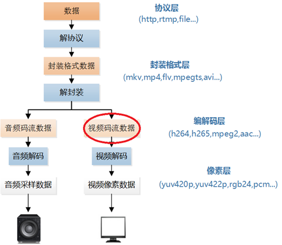

# H.264编解码详解

- 为什么要对视频进行编码：

  对于一帧1920×1080的YUV420P图像而言，其大小为1920 × 1080 × 3/2 = 3,110,400B = 3037.5MB。按照每秒30帧的速度播放一小时，其所需的网络带宽和存储空间可想而知。

  如上所述，视频信号由于信息量大，传输网络带宽要求高，就像一辆体型巨大的货车只有在宽阔的马路上才能行驶一样。于是出现一个问题：能否将视频信号在传送前先进行压缩编码，即进行视频源压缩编码，然后在网络上进行传送，以便节省传送带宽和存储空间。

- 什么是编码：

  视频编码本质就是压缩，去除冗余信息。视频中存在很多冗余信息，比如图像相邻像素之间有较强的相关性，视频序列的相邻图像之间内容相似，人的视觉系统对某些细节不敏感等，对这部分冗余信息进行处理的过程就是视频编码。

## H.264初步介绍

- 定义: 

  MPEG（Moving Picture Experts Group）和VCEG（Video CodingExperts Group）已经联合开发了一个比早期研发的MPEG和H.263性能更好的视频压缩编码标准，这就是被命名为AVC（Advanced VideoCoding），也被称为ITU-T H.264建议和MPEG-4的第10部分的标准，在这里就简称它为H.264/AVC或H.264或MPEG-4 AVC。

- H.264与其他编码标准的联系：

  

  除了MPEG的MPEG系列标准和VCEG的ITU-T系列标准以外，还有Google的VP8/VP9标准等等；但不论是哪种标准都是基于宏块的方式进行编码，原理是一样的，只不过实现的算法不一致罢了，在此只做了解即可。

- H.264的特点

  H.264不仅具有优异的压缩性能，而且具有良好的网络亲和性，可以应用于网络流媒体。

  和MPEG-4中的重点是灵活性不同，H.264着重于解决压缩的高效率和传输的高可靠性，因而其应用面十分广泛。具体说来，H.264的基本部分支持3个不同档次的应用。

  1. 基本档次：主要用于“视频会话”，如会议电视、可视电话、远程医疗、远程教学等。

  2. 扩展档次：主要用于网络的视频流，如视频点播。

  3. 主要档次：主要用于消费电子应用，如数字电视广播、数字视频存储等。

- H.264编解码器

  - H.264编码器

    

  - H.264解码器

    

- 视频播放器中的H.264

  视频码流在视频播放器中的位置如下所示。

  

## H.264/AVC

H264压缩技术主要采用了以下几种方法对视频数据进行压缩。包括：

- 帧内预测压缩，解决的是空域数据冗余问题。
- 帧间预测压缩（运动估计与补偿），解决的是时域数据冗徐问题。
- 整数离散余弦变换（DCT），将空间上的相关性变为频域上无关的数据然后进行量化。
- CABAC压缩。

经过压缩后的帧分为：I帧，P帧和B帧:

- I帧：关键帧，仅包含I片；**I帧分为IDR帧和I帧**，采用帧内压缩技术，编解码时不参考其他帧，其中在编解码IDR帧时，还会重新发送/寻找新的序列参数集和图像参数集。
- P帧：向前参考帧，一定包含P片，可能包含I片；在编解码时，只参考前面已经处理的帧。采用帧间压缩技术。
- B帧：双向参考帧，一定包含B片，可能包含I片和P片；在编解码时，它即参考前而的帧，又参考它后面的帧。采用帧间压缩技术。

除了I/P/B帧外，还有图像序列GOP。

GOP:两个I帧之间是一个图像序列，在一个图像序列中只有一个I帧。如下图所示：

当然啦，在H.264中，并没有GOP序列，取而代之的是**编码视频序列（Coded Video Sequence, CVS）**

- **编码视频序列（CVS）**：

  - 由一系列连续的访问单元（Access Unit）组成，以IDR图像（即时解码刷新图像）开始，结束于下一个IDR图像或序列结束符（如end_of_seq或end_of_stream）。
  - 功能：提供独立的解码上下文，IDR图像会清空解码器的参考帧队列，实现随机访问和错误恢复（见6.1.2节和6.3.2节）。

- **与传统GOP的区别**：

  | **传统GOP（如MPEG-2）**   | **H.264的编码视频序列（CVS）**             |
  | ------------------------- | ------------------------------------------ |
  | 包含I/P/B帧组，以I帧开头  | 以IDR帧开头，强制刷新参考帧                |
  | 依赖序列头/图像头管理参数 | 通过**参数集（SPS/PPS）** 独立管理全局参数 |
  | 结构固定（如GOP长度）     | 更灵活，无固定长度限制                     |

太累了。。。。。

你就这么看吧：先看David老师的ppt，然后看David老师的markdown文件，然后看《新一代视频压缩编码标准-H.264_AVC(第二版)》5，6，7章，遇到不会的名词就去《H.264官方中文版》里面找，最后看ima里的问题进行查漏补缺

这几篇文章也能看看：

[【H264】码流结构详解 - fengMisaka - 博客园](https://www.cnblogs.com/linuxAndMcu/p/14533228.html)

[【音视频 | H.264】H.264视频编码及NALU详解_h264 nalu-CSDN博客](https://blog.csdn.net/wkd_007/article/details/134966687)

[视音频数据处理入门：H.264视频码流解析_视频码流分析-CSDN博客](https://blog.csdn.net/leixiaohua1020/article/details/50534369)