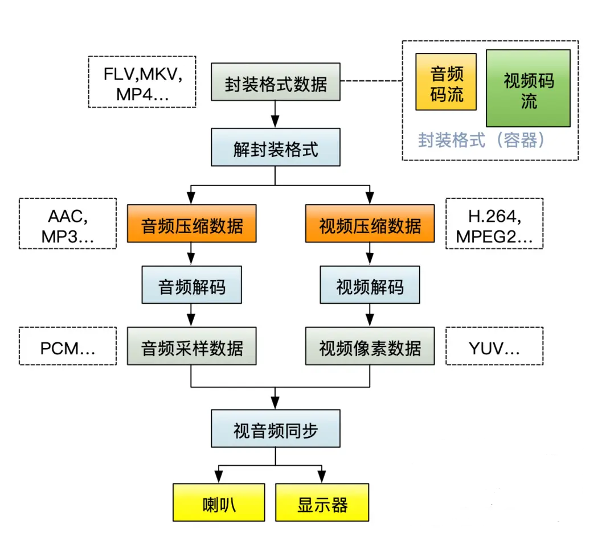

### 视频解码基础01-封裝格式

我们播放的视频文件一般都是用一种**封装格式**封装起来的，封装格式的作用是什么呢？一般视频文件里不光有视频，还有音频，封装格式的作用就是把视频和音频打包起来。 所以我们先要**解封装格式**，看有哪些视频流和哪些音频流，此时的音频流和视频流都还是**压缩数据**，不能直接用于显示的，这就需要**解码**。下面是播放一个视频文件时的流程图。

FFmpeg  视频文件  是一个容器  (视频流（H264）  音频流(aac))

#### 二、视频文件封装格式

封装格式（也叫容器），就是将已经编码压缩好的视频轨和音频轨按照一定的格式放到一个文件中，也就是说仅仅是一个外壳，或者大家把它当成一个放视频轨和音频轨的文件夹也可以。说得通俗点，视频轨相当于饭，而音频轨相当于菜，封装格式就是一个碗，或者一个锅，用来盛放饭菜的容器。 下面是几种常用的 **视频文件后缀类型** 与其相对应的 **封装格式**。

| 视频文件格式                            | 视频封装格式                         |
| --------------------------------------- | ------------------------------------ |
| **.avi**                                | AVI（Audio Video Interleaved）       |
| **.wmv、.asf**                          | WMV（Windows Media Video）           |
| **.mpg、.mpeg、.vob、.dat、.3gp、.mp4** | MPEG（Moving Picture Experts Group） |
| **.mkv**                                | Matroska                             |
| **.rm、.rmvb**                          | Real Video                           |
| **.mov**                                | QuickTime File Format                |
| **.flv**                                | Flash Video                          |

 

#### 三、 音视频编码方式简介

##### 1、视频编码方式

- **视频编码的作用：** 将视频像素数据（**RGB，YUV** 等）压缩成视频码流，从而降低视频的数据量。

| **HEVC（H.265）** | **MPEG/ITU-T** | 2013     | 研发中       |
| ----------------- | -------------- | -------- | ------------ |
| 名称              | 推出机构       | 推出时间 | 目前使用领域 |
| **H.264**         | **MPEG/ITU-T** | 2003     | 各个领域     |
| **MPEG4**         | **MPEG**       | 2001     | 不温不火     |
| **MPEG2**         | **MPEG**       | 1994     | 数字电视     |
| **VP9**           | Google         | 2013     | 研发中       |
| **VP8**           | Google         | 2008     | 不普及       |
| **VC-1**          | Microsoft Inc. | 2006     | 微软平台     |

### 

#### 四, 音频编码方式

**音频编码的作用：** 将音频采样数据（**PCM** 等）压缩成音频码流，从而降低音频的数据量。 常用的音频编码方式有以下几种：

| 名称     | 推出机构           | 推出时间 | 目前使用领域   |
| -------- | ------------------ | -------- | -------------- |
| **AAC**  | **MPEG**           | 1997     | 各个领域（新） |
| **MP3**  | **MPEG**           | 1993     | 各个领域（旧） |
| **WMV**  | **Microsoft Inc.** | 1999     | 微软平台       |
| **AC-3** | **Dolby Inc.**     | 1992     | 电影           |

##### 1  MP3

**MP3**，英文全称 **MPEG-1 or MPEG-2 Audio Layer III**，是曾经非常流行的一种数字音频编码和有损压缩格式，它被设计来大幅降低音频数据量。它是在 **1991** 年，由位于德国埃尔朗根的研究组织 **Fraunhofer-Gesellschaft** 的一组工程师发明和标准化的。**MP3** 的普及，曾对音乐产业造成极大的冲击与影响。

##### 2 AAC

**AAC**，英文全称 **Advanced Audio Coding**，是由 **Fraunhofer IIS**、杜比实验室、**AT&T**、**Sony** 等公司共同开发，在 **1997** 年推出的基于 **MPEG-2** 的音频编码技术。**2000** 年，**MPEG-4** 标准出现后，**AAC** 重新集成了其特性，加入了 **SBR** 技术和 **PS** 技术，为了区别于传统的 **MPEG-2 AAC** 又称为 **MPEG-4 AAC**。 **AAC** 比 **MP3** 有更高的压缩比，同样大小的音频文件，**AAC** 的音质更高。

##### 3 WMA

**WMA**，英文全称 **Windows Media Audio**，由微软公司开发的一种数字音频压缩格式，本身包括有损和无损压缩格式。

 