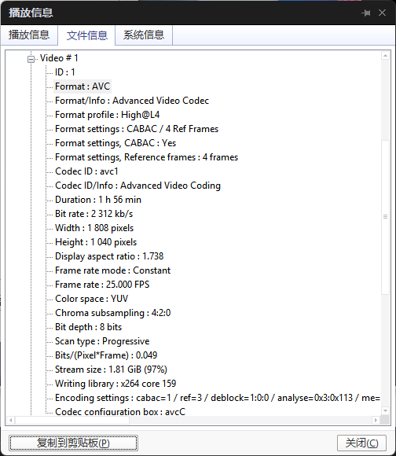

视频流H264的组装

**到目前为止，我们已经通过学习将视频文件编码成了一个又一个的GOP序列，在每一个GOP序列中，包含了一个I帧和若干的P帧和B帧，这就是VCL层做的事情；但这远远不够，因为每一个GOP序列都很大，就算我们只取其中的一帧，还是可能超过1500字节，无法胜任网络传输的要求，所以我们还需要通过NAL层将一个帧拆成多个包，构造一个H.264原始码流进行传输**

#### 名词解释

**1**．场和帧

视频的一场或一帧可用来产生一个编码图像。通常，视频帧可分成两种类型：连续或隔行视频帧。在电视中，为减少大面积闪烁现象，把一帧分成两个隔行的场。显然，这时场内邻行之间的时间相关性较强，而帧内邻近行空间相关性强，因此活动量较小或静止的图像宜采用帧编码方式，对活动量较大的运动图像则宜采用场编码方式。

**2**．宏块、片

一个编码图像通常划分成若干宏块组成，**一个宏块由一个16×16亮度像素和附加的一个8×8 C~b~和一个8×8 C~r~彩色像素块组成**。每个图像中，若干宏块被排列成片的形式。I片只包含I宏块，P片可包含P和I宏块，而B片可包含B和I宏块。I宏块利用从当前片中已解码的像素作为参考进行帧内预测，不能取其他片中的已解码像素作为参考进行帧内预测。P宏块利用前面已编码的图像作为参考图像进行帧间预测，一个帧内编码的宏块可进一步作宏块的分割，即分成16×16、16×8、8×16或8×8亮度像素块（以及附带的彩色像素）。如果选了8×8的子宏块，则可再分割成各种子宏块，其尺寸为8×8、8×4、4×8或4×4亮度像素块（以及附带的彩色像素）。B宏块则利用双向的参考图像（当前和未来的已编码的图像帧）进行帧间预测。

#### 1 H264介绍

>  我们了解了什么是宏快，宏快作为压缩视频的最小的一部分，需要被组织，然后在网络之间做相互传输。

如果单纯的用**宏快**来发送数据是**杂乱无章**的，就好像在没有**集装箱** 出现之前，货物总是随意被堆放到船上。

上货（编码），下货是非常痛苦的。 当集装箱出现之后，一切都发生了改变，传输效率大大增高。

集装箱可以理解成**H264编码标准**，他制定了相互传输的格式，将宏快 有组织，有结构，有顺序的形成一系列的码流。这种码流既可 通过 InputStream 网络流的数据进行传输，也可以封装成一个文件进行保存

**H264: H264/AVC是广泛采用的一种编码方式。**主要作用是为了传输

#### 1.1 H264码流组成

**组成H264码流的结构中 包含以下几部分 ，从大到小排序依次是** 

> **H264视频序列，图像，片组（slice集合），片（slice，一大块像素数据，比宏块大，比图像小），NALU，宏块 ，像素。** 
>
> 类似 地球 国家 城市  镇 村落

##### 1.1.1  H264编码分层

- **NAL层:（Network Abstraction Layer,视频数据网络抽象层）**：  它的作用是H264只要在网络上传输，在传输的过程每个包以太网是1500字节，而H264的帧往往会大于1500字节，所以要进行拆包，将一个帧拆成多个包进行传输，所有的拆包或者组包都是通过NAL层去处理的。
- **VCL层:（Video Coding Layer,视频数据编码层）**： 对视频原始数据进行压缩

##### 1.1.2  H264的传输

​	**H264是一种码流**  类似与一种不见头，也不见尾的一条**河流**。如何从和流中取到自己想要的**数据**呢，

在H264的标砖中有这样的一个封装格式叫做"Annex-B"的字节流格式。 它是H264编码的主要字节流格式。

几乎市面上的编码器是以这种格式进行输出的。**起始码0x 00 00 00 01 或者 0x 00 00 01** 作为**分隔符**。 

两个 0x 00 00 00 01之间的字节数据 是表示一个NAL Unit

##### 1.1.3  编码结构

 **切片头**：包含了一组片的信息，比如片的数量，顺序等等 

##### 1.1.4  H264码流分层结构图

##### 1.1.5总结

[【音视频 | H.264】H.264视频编码及NALU详解_h264 nalu-CSDN博客](https://blog.csdn.net/wkd_007/article/details/134966687)

[【H264】码流结构详解 - fengMisaka - 博客园](https://www.cnblogs.com/linuxAndMcu/p/14533228.html)

[超详细的h264码流结构解析！ - 知乎](https://zhuanlan.zhihu.com/p/622152133)

[H264标准完全教程（未完）_h264课程-CSDN博客](https://blog.csdn.net/qq_28258885/article/details/119390063?spm=1001.2014.3001.5501)

H.264原始码流，由一个又一个的NAL Unit组成，在每一个

序列参数集（SPS）：**包含的是针对一连续编码视频序列的参数**，如标识符seq_parameter_set_id、帧数及POC的约束、参考帧数目、解码图像尺寸和帧场编码模式选择标识等，详情见下图：

图像参数集（PPS）：**对应的是一个序列中某一幅图像或者某几幅图像**，其参数如标识符pic_parameter_set_id、可选的seq_parameter_set_id、熵编码模式选择标识、片组数目、初始量化参数和去方块滤波系数调整标识等。

解码器接收到IDR帧之后，立即将参考帧队列清空，将已解码的数据全部输出或抛弃，重新查找SPS和PPS（所以SPS和PPS通常会在IDR帧之前传输），开始一个新的序列。

帧，片，宏块类型

https://blog.csdn.net/qq_28258885/article/details/119416168

frame和宏块间的关系

- I帧只包含I宏块
- P帧包含I宏块和P宏块
- B帧包含I宏块、P宏块、B宏块

而slice呢，也是对宏块的划分
slice和宏块的关系

- I slice只包含I宏块
- P slice包含P宏块和/或I宏块
- B sliceB宏块和/或I宏块。
- 由于各个编码片之间互相独立，所以可以使用并行的方法加快片的编码/解码速度

I帧、B帧、P帧和对应类型的slice之间的关系

- 当帧内slice全部为I像片时，则此帧为I帧
- 当全部为P slice或和I slice的组合时，则为P帧
- 当为B slice或和I、P slice的组合时，则为B帧。

对于单个宏块而言，它包含了：宏块类型（`mb_type`），宏块预测数据（`mb_pred`，也可以理解为**预测方向**），残差数据（这里面包含两部分：**运动矢量**和**编码数据**（像素））

EBSP、RBSP与SODB

[NALU详解之EBSP、RBSP与SODB - 知乎](https://zhuanlan.zhihu.com/p/347059348)

注意：在编码器编码完一个NAL时，只会检测RBSP中是否出现诸如：`0x000000`，`0x000001`，`0x000002`，`0x000003`之类的数据并添加`0x03`，不会检测，修改nalu头部的startcode

计算残差的步骤

1. 生成预测块：

使用运动估计得到的运动矢量，从参考帧中生成预测块。

2. 计算残差：

对于每个宏块，从原始图像块中减去预测块，得到[残差块](https://so.csdn.net/so/search?q=残差块&spm=1001.2101.3001.7020)。

3. 编码残差：

对残差块进行变换和量化处理，然后进行熵编码，以便有效压缩。