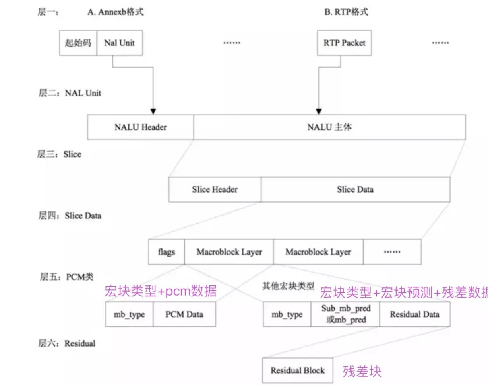

视频流H264的组装

•**到目前为止，我们已经通过学习将视频文件编码成了一个又一个的GOP序列，在每一个GOP序列中，包含了一个I帧和若干的P帧和B帧，这就是VCL层做的事情；但这远远不够，因为每一个GOP序列都很大，就算我们只取其中的一帧，还是可能超过1500字节，无法胜任网络传输的要求，所以我们还需要通过NAL层将一个帧拆成多个包，构造一个H.264原始码流进行传输**

#### 1 H264介绍

>  我们了解了什么是宏快，宏快作为压缩视频的最小的一部分，需要被组织，然后在网络之间做相互传输。

如果单纯的用**宏快**来发送数据是**杂乱无章**的，就好像在没有**集装箱** 出现之前，货物总是随意被堆放到船上。

上货（编码），下货是非常痛苦的。 当集装箱出现之后，一切都发生了改变，传输效率大大增高。

集装箱可以理解成**H264编码标准**，他制定了相互传输的格式，将宏快 有组织，有结构，有顺序的形成一系列的码流。这种码流既可 通过 InputStream 网络流的数据进行传输，也可以封装成一个文件进行保存

**H264: H264/AVC是广泛采用的一种编码方式。**主要作用是为了传输

#### 1.1 H264码流组成

**组成H264码流的结构中 包含以下几部分 ，从大到小排序依次是** 

> **H264视频序列，图像，片组（slice集合），片（slice，一大块像素数据，比宏块大，比图像小），NALU，宏块 ，像素。** 
>
> 类似 地球 国家 城市  镇 村落

##### 1.1.1  H264编码分层

- **NAL层:（Network Abstraction Layer,视频数据网络抽象层）**：  它的作用是H264只要在网络上传输，在传输的过程每个包以太网是1500字节，而H264的帧往往会大于1500字节，所以要进行拆包，将一个帧拆成多个包进行传输，所有的拆包或者组包都是通过NAL层去处理的。
- **VCL层:（Video Coding Layer,视频数据编码层）**： 对视频原始数据进行压缩

##### 1.1.2  H264的传输

​	**H264是一种码流**  类似与一种不见头，也不见尾的一条**河流**。如何从和流中取到自己想要的**数据**呢，

在H264的标砖中有这样的一个封装格式叫做"Annex-B"的字节流格式。 它是H264编码的主要字节流格式。

几乎市面上的编码器是以这种格式进行输出的。**起始码0x 00 00 00 01 或者 0x 00 00 01** 作为**分隔符**。 

两个 0x 00 00 00 01之间的字节数据 是表示一个NAL Unit

##### 1.1.3  编码结构

 **切片头**：包含了一组片的信息，比如片的数量，顺序等等 

##### 1.1.4  H264码流分层结构图

##### 1.1.5总结

[【音视频 | H.264】H.264视频编码及NALU详解_h264 nalu-CSDN博客](https://blog.csdn.net/wkd_007/article/details/134966687)

[【H264】码流结构详解 - fengMisaka - 博客园](https://www.cnblogs.com/linuxAndMcu/p/14533228.html)

[超详细的h264码流结构解析！ - 知乎](https://zhuanlan.zhihu.com/p/622152133)

H.264原始码流，由一个又一个的NAL Unit组成，在每一个