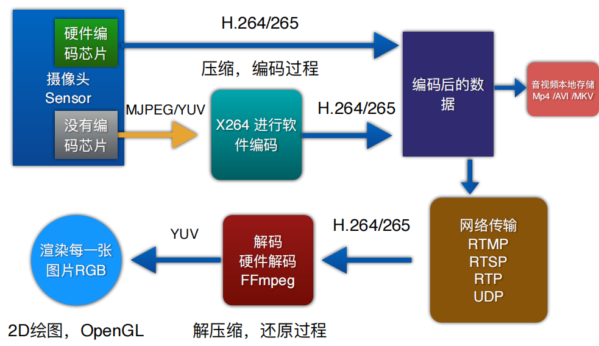
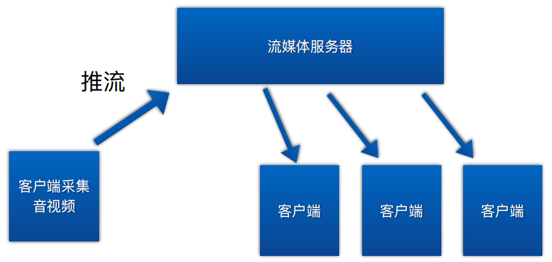
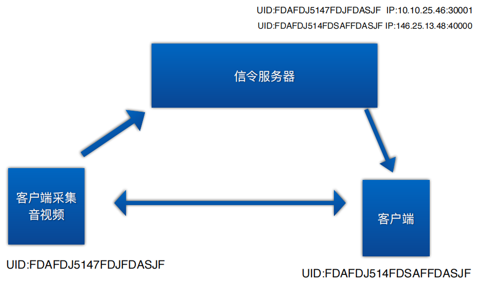
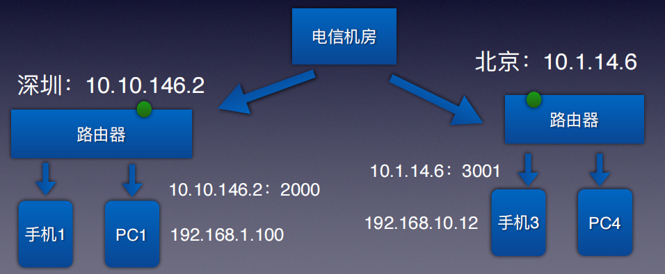

### 音视频基础

- 音视频的本质

  音频：

  1. 将人的声音通过麦克风采集转换成电信号，然后转换成数字信号，最后通过扬声器播放。

  2. 在直播项目中，我们一般是从麦克风(手机，电脑话筒)采集以后，从编程接口里面得到`pcm Buffer`，这块内存里面，就是音频数据。音频本身比较单纯，简单。编码，压缩都比较容易。
  3. 基础格式：`pcm`，`aac`，`g711`等。
  4. 单位：音频采集的采样率，比特率，通道 等。像`g711`的采样率为8000，单通道；`aac` 的采样率为44100，立体声通道。
  5. 音频容器：`mp3`，`wma`，`m4a`，用于封装音频格式。

  视频：

  1. 在现实世界中，画面中，每秒刷新超过24张(帧fps)图片，就可以骗过人眼观测的范围，看起来就相当连续。
  2. 帧率：一般24 30帧，一些昂贵的先进的设备比如高端智能手机，都有60 120 240帧。
  3. 分辨率：单帧（一帧可以理解为一张图片）画面大小，1920 × 1080 1280 × 720 
  4. 码率：单张图片，数据量的大小。原始的RAW格式的，码率比较大。每一张图片可以进行压缩。

  视频采集：

  1. 从摄像头，sensor，感光元件，拍摄现实生活中的一个画面，把它存储为图片。
  2. 基础格式：`RAW`， `YUV(方便我们进行编码)`， `MJPEG`， `RGB`
  3. 常见压缩算法：`H.264`， `VP8`， `H.265`， `VP9`。在网络传输过程中，我们在保证清晰度，分辨率的情况下，尽量降低视频的数据量。数据量降低以后，就更加适合我们做网络传输。
  4. 视频容器：`Mp4`， `MKV`， `AVI`， `WMV`。包含音频，编码后的视频数据，视频的关键信息(分辨率，帧率，时间戳，时间长度等等)。

  音视频编码的原理：

  1. 进行视频编码的原因：
  2. 主要为了存储，网络传输。我们经常看到一个电影，大约2G左右，为什么这么小，主要就是因为视频进行了压缩。视频领域，过去20年 最常用的压缩算法，就是`H.264`（压缩原理大体可以理解成通过记录两帧之间的差异，实现数据的压缩，和git有点像）。超过95%的视频，都是这种压缩算法。
  3. 通过压缩算法，进行视频编码。硬件编码，iPhone，Andorid，他们都自带硬件编码芯片。硬件编码H.264/H.265性能非常强悍。甚至可以编码4K 120FPS。最差的都在200块以上。
  4. 传统的USB摄像头，用来做QQ聊天的，出于成本的考虑，没有自带H.264编码芯片，可以使用软件编码，但软件实现的效率比较低，满足低端的，普通的视频聊天使用。常见的软件编码sdk：open264，x264库（编码之后就可以使用视频容器进行存储了）。
  5. 拿到他人编码后的视频容器之后，可以通过硬件解码，软件解码（FFmpeg）使用

  音视频收集-传输全流程：

  

### H264视频压缩算法？？？

Qt音视频图像处理渲染引擎开发实战.pdf 52页

### 网络传输基础

- 操作系统层以上应用，95%以上的应用，都是基于两个基础的网路通讯协议，TCP/IP UDP。
- TCP/IP 简称TCP 他是一种可靠的协议。优点：在网络没故障的情况下，绝对可靠。缺点：效率低。传统的RTPM直播，4秒以上的延迟。在TCP协议栈底层，做了大量的处理，比如包的完整性校验，丢包重传机制等。这样保证每一个包收发绝对可靠。
- UDP 优点：高效率。 缺点：不可靠。
- TCP适合数据量比较小的应用，比如web应用（RTMP就是基于TCP开发的）。UDP，适合做大量数据传输，比如说，音视频。用UDP的时候，不能直接使用，要做大量的工作，比如，一定程度上的可靠性，丢包重传，完整性，网络拥塞控制等（像webrtc就是基于UDP实现的）。

---

- 目前有两种基础的应用架构

  1. 流媒体转发

     流媒体服务器：客户端采集音视频后推流到流媒体服务器，此时其他客户端可以拉流该服务器的音视频，同时由于音视频在服务器上，所以服务器可以保存该音视频以便后续进行音视频回放。

     优点：支持百万，千万级别的客户端同时观看。支持回放。只要你流媒体服务器足够多。

     缺点：资源 带宽消耗大。 

     

  2. P2P点对点

     使用信令服务器实现，信令服务器是用于协调通信双方（或多方）建立和管理实时音视频会话的中间服务器。它**负责交换必要的控制信息，维护一个客户端信息列表，但不直接传输音视频数据流**。

     连接上信令服务器的客户端定时向其发送本机UID对应的IP地址等信息。如果此时客户端A想和客户端B建立P2P连接，首先A需要先获取B的UID，然后通过信令服务器查询UID对应的IP地址，最后通过UDP打洞建立与B的连接

     优点：节省服务器资源，带宽。

     缺点：不能做百万级别的人同时观看。也不能做视频数据回放。

     

### NAT穿透

学习WebRTC的时候，P2P点对点是贯穿整个WebRTC的一个技术。受限于网络上下行带宽的限制，P2P通讯，一般2～8个人之间。由于IPV4数量限制，不得不使用网络穿透。



当然上图中还需要一个信令服务器

### RGB

RGB色彩模式是工业界的一种颜色标准，是通过对红(R)、绿(G)、蓝(B)三个颜色通道的变化以及它们相互之间的叠加来得到各式各样的颜色的，RGB即是代表红、绿、蓝三个通道的颜色，这个标准几乎包括了人类视力所能感知的所有颜色，是运用最广的颜色系统之一。

- RGB555 是16位的RGB格式，RGB分量都用5位表示（剩下的1位不用）。使用一个字读出一个像素后，这个字的各个位意义如下：高字节 低字节 `X R R R R R G G G G G B B B B B` （X表示不用，忽略）

- RGB565 RGB565使用16位表示一个像素，这16位中的5位用于R，6位用于G，5位用于B。程序中通常使用一个字（WORD，一个字等于两个字节）来操作一个像素。当读出一个像素后，这个字的各个位意义如下：高字节 低字节 `R R R R R G G G G G G B B B B B`

- RGB24 使用24位来表示一个像素，RGB分量都用8位表示，取值范围为0-255。注意在内存中RGB各分量的排列顺序为：`BGR BGR BGR`

- RGB32使用32位来表示一个像素，RGB分量各用去8位，剩下的8位用作Alpha通道（表示透明度）或者不用。（ARGB32就是带Alpha通道的RGB24。）注意在内存中RGB各分量的排列顺序为：`BGRA BGRA BGRA`。

习题：如果有一张1280x720大小的图片，用多大内存可以存储下这样一张RGB的图片呢？

```c++
int picSize = width * height * 3;	// RGB
//int picSize = width * height * 4;	ARGB
char* picBuff= malloc(picSize* sizeof(char));
free(picBuff);
```

### YUV？？？

[YUV格式详解【全】-CSDN博客？？？](https://blog.csdn.net/xkuzhang/article/details/115423061)

- YUV，是一种颜色编码方法。常使用在各个视频处理组件中。 YUV在对照片或视频编码时，考虑到人类的感知能力，允许降低色度的带宽。

- Y′UV,YUV,YCbCr,YPbPr所指涉的范围，常有混淆或重叠的情况。从历史的演变来说，其中YUV和Y'UV通常用来编码电视的模拟信号，而YCbCr则是用来描述数字的视频信号，适合视频与图片压缩以及传输，例如MPEG、JPEG。但在现今，YUV通常已经在电脑系统上广泛使用。

- Y'代表明亮度(luma;brightness)而U与V存储色度(色讯;chrominance;color)部分;亮度(luminance)记作Y，而Y'的prime符号记作伽玛校正。

- YUVFormats分成两个格式：

- 紧缩格式（packedformats）：将Y、U、V值存储成MacroPixels数组，和RGB的存放方式类似。

- 平面格式（planarformats）：将Y、U、V的三个分量分别存放在不同的矩阵中。

- 紧缩格式（packedformat）中的YUV是混合在一起的，对于YUV常见格式有AYUV格式（4：4：4采样、打包格式）；YUY2、UYVY（采样、打包格式），有UYVY、YUYV等。平面格式（planarformats）是指每Y分量，U分量和V分量都是以独立的平面组织的，也就是说所有的U分量必须在Y分量后面，而V分量在所有的U分量后面，此一格式适用于采样（subsample）。平面格式（planarformat）有I420（4:2:0）、YV12、IYUV等。

习题：yuv420p 也叫 i420 就是 yuv420 planar 表示。yuv420p 一共有三个平面分别是 Y，U，V，每一个平面都是用 8 bit 二进制数字表示，我们把 8 bit 称作位深度。根据前面的介绍，如果用 yuv420p 来表示分辨率为 1280 * 720 的图片，需要占用多少存储空间呢？

```c++
 // 每一个像素都需要一个 luma 值，即 y。那么总共需要 width* height。
// 每四个像素需要一个 chroma u 值，那么总共需要 width* height / 4。
// 每四个像素需要一个 chroma v 值，那么总共需要 width* height / 4
// 把 y、u、v 三个 plane 加起来就是：
double res = width * height * 6 / 4
```

### FFmpeg

- FFmpeg你可以理解为各种音视频格式编解码的一个集合，它并不是万能的

- 为什么要学习FFmpeg？绝大多数情况下，FFmpeg是一个利用CPU进行编码，解码的库。iOS macOS有AVFoundation.android有mediacodec提供更加高效的硬件编码，解码. 但是这些库，它仅仅提供了有限的格式的编解码。别的格式比如avi mkv wmv..只能用FFmpeg或其他。 所以FFmpeg是一个非常通用的，提供了绝大多数音视频格式的编解码的集合。常用的还有`Video mux/demux`功能(写mp4).

-  FFmpeg最常用的功能: 视频编码，解码. 格式转换. 写视频容器(mp4 avi…); 至于别的功能比如加水印. 服务器，推流等最好由其他库实现。

### FFmpeg播放器核心开发

