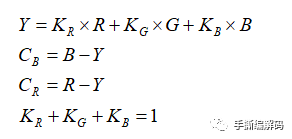

## RGB，YUV像素数据处理

### RGB24

[图解RGB565、RGB555、RGB16、RGB24、RGB32、ARGB32等格式的区别-CSDN博客](https://blog.csdn.net/byhook/article/details/84262330)

RGB24图像每个像素用24比特位表示，占3个字节，注意：在内存中RGB各分量的排列顺序为：BGR BGR BGR ......


所以对于每24字节，有：

```c++
R = color & 0x000000FF;
G = color & 0x0000FF00;
B = color & 0x00FF0000;
```

### YUV420P

[了解即可：YUV格式详解【全】-CSDN博客](https://blog.csdn.net/xkuzhang/article/details/115423061)

[先看这个：详解YUV系列(三)-------YUV420-腾讯云开发者社区-腾讯云](https://cloud.tencent.com/developer/article/1612357)

[再看这个：为什么视频编码器要输入YUV420格式？ - 知乎](https://zhuanlan.zhihu.com/p/452676366)

YUV420格式的采样，对于每个2\*2的像素块中，采样4次Y,采样1次U和1次V。

YUV在电脑视频中也被称为Y'CrCb，其中Y，U，V这几个字母不是英文单词的首字母，其中Y代表亮度，UV代表色差，U和V是构成颜色的两个分量。

- 采样示意图

  

  解析：

  - 为什么叫420：

    第一行中，水平取4个像素，在这4个像素中，有4个Y分量，2个UV分量；第二行中，继续水平取4个像素，在这4个像素中，有4个Y分量，0个UV分量
- 存储示意图

  对于YUV420P而言，采用**Three plane**的方式进行存储。其中，**Three plane** 表示 Y, U, V分别存储，分别对应一个plane,统称为YUV420P格式

  1. YV12:

     
  2. YU12:

     

  以上两种存储方式统称为YUV420P

  **显然，采用YUV420P的存储格式，平均下来一个像素可以用1.5个字节表示，比YUV444P和RGB24格式节省一半存储空间**

### RGB24与YUV420P的转换

[为什么视频编码器要输入YUV420格式？ - 知乎](https://zhuanlan.zhihu.com/p/452676366)

由于人类视觉通常对**亮度**要比**色度**更敏感，对于后续需要进行有损压缩过程以及编码器来说，那我在给编码器输入RGB24格式的原始图像之前，可以尝试将亮度与色度信息分开，然后去掉图像中部分色度信息（**让色度分量的分辨率(像素点)比亮度分辨率低一些**，即对色度分量进行降采样处理，丢掉一些色度信息），达到压缩原始数据的目的，而YC~b~C~r~就是比较常用的满足这种需求的颜色空间形式。。

- RGB24->YUV420P

  分离亮度与色度信息：

  - 公式推导：

    Y表示luminance亮度分量，它的值可以通过原始**RGB的三个颜色分量**加权得到：

    

    颜色信息（chrominance or chroma）可以用原始**RGB颜色分量和亮度Y的差值**来表示，因为RGB有三个颜色分量，所以理论上我们会得到C~r~，C~b~，C~g~三个颜色分量，即:

    

    所以，对于亮度和色度拆开的颜色空间（比如YUV）来说，一个有色图像完整表示（相对于RGB）应当是**Y分量加上Cr，Cb，Cg分量**。

    但是我们又会发现，Cr+Cb+Cg其实是一个常数，所以我们只需要在三个里面选2个颜色分量即可，第三个分量可以通过这两个推导得到，所以最后的公式为：

    
  - 推导结果：

    根据H264标准白皮书，可得：

    
  - 优化：

    但是大家都该注意到了，上面的颜色空间转换公式都是浮点数运算，对于计算机实现来说，可能不太友好。

    所以BT601标准颜色空间的整数形式转换公式是：

    

    解释：

    1. 实际上上面这个式子会把Y的取值映射到16-235，而U和V的取值会映射到16-240。
    2. 为什么要把Y的值从0-255转换到16-235？

       在**SMPTE-125M**标准中规定的，这样做是鉴于滤波引起的信号过冲（“振铃”）。
    3. U和V为什么最后要加上128？

       加上128以后会使他们一定取正值，且范围在16–240。

    而BT601标准YUV取值0-255的整数运算转换公式是：

    

    从此公式可看出：如果想把YUV格式像素数据变成灰度图像，只需要将U、V分量设置成128即可。这是因为U、V是图像中的经过偏置处理的色度分量。色度分量在偏置处理前的取值范围是-128至127，这时候的无色对应的是“0”值。经过偏置后色度分量取值变成了0至255，因而此时的无色对应的就是128了。参见：[视音频数据处理入门：RGB、YUV像素数据处理](https://blog.csdn.net/leixiaohua1020/article/details/50534150)。

  YCbCr降采样：

  **前面的RGB转到YCbCr或者YUV仅仅是将亮度分量和颜色分量进行了分离处理。为了压缩视频信息，还需要进一步对颜色分量进行降采样**。

  下面三种降采样方式是H.264/AVC视频编码标准中支持的，包括4:4:4，4:2:2和4:2:0：

  

  比较常用的是最上面的4:2:0采样方式，它的Cb和Cr的水平和竖直方向的分辨率都只有Y的一半，即Cb和Cr分别只有Y分量像素点个数的1/4。即4个Y分量使用1个Cb和1个Cr。所以，**一帧YCbCr420的实际比特数只有YCbCr444的一半**。

  我们再仔细观察右下图的4:4:4采样格式，可以看到，正常情况，1个Y会对应1个Cb和Cr。但4:2:0里面以4个像素点为单位来看的话，最终降采样的图像丢掉了3个Cb和3个Cr。

  但是，到底是丢的哪3个位置的Cr和Cb，只有在做降采样时的处理人员知道，这个信息并没有保存或者传递，同时好像也没有统一规定，所以假如让你来做4:2:0的降采样，你会选择保留哪个Cb和Cr呢？也就意味着，可能同一个RGB24图像，不同的人或软件，来做4:2:0的降采样，得到的最终图像是完全不一样的。
- YUV420P->RGB24

  同上，不过反过来了而已

更多YUV420P和RGB的相关处理，参考：[RGB、YUV像素数据处理_视频基本原理-CSDN博客](https://blog.csdn.net/leixiaohua1020/article/details/50534150)

关于如何优化YUV与RGB之间的转换，参考：[优化RGB转YUV计算效率_rgb转yuv损失-CSDN博客](https://blog.csdn.net/qq_28258885/article/details/120001387?spm=1001.2014.3001.5501)

## PCM音频采样数据处理

### 基础知识补充

- 字节序

  **字节序**（Byte Order）是指多字节数据在内存中的存放顺序，这是在进行跨平台和网络编程时需要考虑的一个重要概念。字节序主要分为两种类型：**大端序**（Big-Endian）和**小端序**（Little-Endian）

  比如对于char类型的数据而言，小端序和大端序没区别；对于int类型的数据而言，小端序和大端序有区别；对于int类型的数组而言，小端序和大端序不会影响数组内数据的顺序，但是会影响数组内单个元素的字节的排列顺序；字节序也不会影响类实例中成员的顺序，仅会影响如int，double之类的基础数据类型的排列（我猜的，因为字节序是很底层的东西，要从c语言的视角来看）

  ```c++
  // 验证：
  union Order {
      int i;
      char c[4];
  };
  
  int main(){
      Order o;
      o.i = 0x11223344;
      cout << hex << (int)o.c[0] << endl;
  }
  // 我输出的是o.c[0]，也就是int类型数据的低地址端，如果输出结果是44，说明在int类型数据中，低位字节存储在低地址端中；
  // 如果输出结果是11，说明在int类型数据中，高位字节存储在低地址端中，是大端序
  ```
- 移位运算符

  [操作符之 移位运算符（＞＞、＜＜）详解](https://developer.aliyun.com/article/1191956)

  整数在内存中存储的形式是补码的二进制，左移和右移都是操作的补码。

  - 左移<<运算

    将二进制数向左移位操作，高位溢出则丢弃，低位补0

    **对于表达式 `x << n` 而言，相当于 $x{\times}2^{n}$，且比乘法快**
  - 右移>>运算

    右移位运算中，无符号数和有符号数的运算并不相同。对于无符号数，右移之后高位补0；对于有符号数，**符号位一起移动**，正数高位补0，负数高位补1

    **对于表达式 `x >> n` 而言，相当于 $x{\div}2^{n}$，且比除法快**

### PCM

[先看：音频处理——音频处理的基本概念 -CSDN博客](https://blog.csdn.net/qq_28258885/article/details/120181075)

[再看：音频处理——详解PCM数据格式_pcm格式-CSDN博客](https://blog.csdn.net/qq_28258885/article/details/120197122)

[最后看：数字音频基础­­­­­－从PCM说起 - 知乎](https://zhuanlan.zhihu.com/p/212318683)

[这个也要看：PCM音频采样数据处理-CSDN博客](https://blog.csdn.net/leixiaohua1020/article/details/50534316)

### H.264

[深入浅出理解视频编码H264结构（内涵福利） - 简书](https://www.jianshu.com/p/9522c4a7818d)

[【音视频 | H.264】H.264视频编码及NALU详解_h264 nalu-CSDN博客](https://blog.csdn.net/wkd_007/article/details/134966687)

[一篇文让你看懂H264 编解码协议 - 知乎](https://zhuanlan.zhihu.com/p/478741699)

[视音频数据处理入门：H.264视频码流解析_视频码流分析-CSDN博客](https://blog.csdn.net/leixiaohua1020/article/details/50534369)


### AAC


### 视频编解码

[(55 封私信 / 67 条消息) 求推荐一本学视频编码的入门书籍？ - 知乎](https://www.zhihu.com/question/52069645/answer/2284728704)
