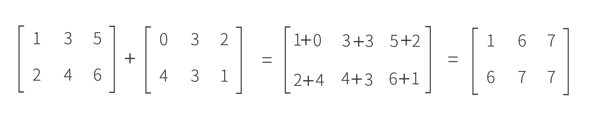
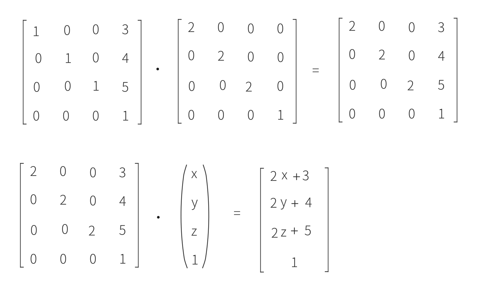

### 线性代数

[有点问题，可以参考：线性代数学习笔记之矩阵_矩阵入门-CSDN博客](https://blog.csdn.net/My_Champion/article/details/143893849)

#### 矩阵

矩阵是⾼等代数学中的常⻅⼯具，也常⻅于统计分析等应⽤数学学科中。 [2]  在物理学中，矩阵于电路学、⼒学、光学和量⼦物理中都有应⽤；计算机科学中，三维动画制作也需要⽤到矩阵。矩阵的运算是数值分析领域的重要问题。将矩阵分解为简单矩阵的组合可以在理论和实际应⽤上简化矩阵的运算。对⼀些应⽤⼴泛⽽形式特殊的矩阵，例如稀疏矩阵和准对⻆矩阵，有特定的快速运算算法。关于矩阵相关理论的发展和应⽤，请参考《矩阵理论》。在天体物理、量⼦⼒学等领域，也会出现⽆穷维的矩阵，是矩阵的⼀种推⼴。


一个m行n列的矩阵简称为`m*n`矩阵，特别把一个`n*n`的矩阵成为n阶正方阵，或者n阶矩阵。

几类特殊的矩阵：    

1. 列矩阵：只有一列的矩阵，又称为列向量。

   

2. 行矩阵：只有一行的矩阵，又称为行向量。

   

3. 零矩阵：元素全为0的矩阵，记作。

   

4. 方阵：顾名思义，方方正正，即行数与列数相等的矩阵。

   > 1. 从外观上看就是把行列式的|...|换成[...]或(...)。
   > 2. 方阵若是n行n列的，则称为n阶方阵。
   > 3. 方阵具备主对角线和副对角线的定义，非方阵的矩阵不具备此定义。
   > 4. 一阶方阵：(a) = a，就是一个数。

   - 上三角矩阵：主对角线下方的元素全为0的**方阵**。

   - 下三角矩阵：主对角线上方的元素全为0的**方阵**。

   - 对角矩阵：主对角线上方、下方的元素全为0的**方阵**。

     

   - 数量矩阵：主对角线上的元素都是**同一个常数**的**对角矩阵**，又称n阶数量矩阵。

     

   - 单位矩阵：主对角线上的元素都是**1**的**对角矩阵**，又称n阶单位矩阵，记作E或I。

     

   > 备注：
   >
   > 1. 上述矩阵中空白的部分都是0。
   > 2. 单位矩阵除主对角线外的元素都是0，**所有元素都是 1 的矩阵不是单位矩阵**。

#### 矩阵运算

- 加法

  

  矩阵的加法满足下列运算律,只有同型矩阵之间才可以进行加法

  ```c++
  A + B = B + A;
  (A+B)+C = A + (B+C);
  ```

  1.“同阶矩阵”概念首先针对的是方阵(方阵的行数[等于列数]称为它的阶数),所以“同阶矩阵是指阶数相同的矩阵” 。 “同行矩阵”不要求是方阵。

  2.“同型矩阵”只是要求行数和列数分别相等,而“同阶矩阵”必须要求行数和列数都要相同。

- 减法

  

- 数乘

  

- 转置

  把矩阵A的行和列互相交换所产生的矩阵称为A的转置矩阵

  

- 乘法

  两个矩阵的乘法仅当第一个矩阵A的列数和另一个矩阵B的行数相等时才能定义。如A是m×n矩阵和B是n×p矩阵，它们的乘积C是一个m×p矩阵 ，它的一个元素：

  

  **也就是说 C~ij~ = 矩阵a的第i行 * 矩阵b的第j列**
  
  将此乘积记为: C = AB. 矩阵的乘法满足结合律：(AB)C = A(BC) 左分配律：(A+B)C =AC+BC 右分配律：C(A+B) = CA+CB. 矩阵乘法不满足交换律（`a*b != b*a`）。
  
  
  
  特别地，满足乘法交换律的方阵称为可交换矩阵，即矩阵A，B满足：A·B=B·A
  
  [可交换矩阵_百度百科](https://baike.baidu.com/item/可交换矩阵/10992610#)

#### 方阵的行列式

> 1. 只有方阵才有行列式。
> 2. 方阵A的行列式|A|是一个数。
> 3. 方阵具备诸多属性，行列式只是其中属性之一。

定义：设n阶方阵A为: ↓↓↓↓↓↓            则n阶方阵A的行列式为：↓↓↓↓

​    ，          .

矩阵与行列式的区别


行列式是由一些数据排列成的**方阵**经过规定的计算方法而得到的一个数。当然，如果行列式中含有未知数，那么行列式就是一个多项式。它本质上代表一个数值，这点请与矩阵区别开来。矩阵只是一个数表，行列式还要对这个数表按照规则进一步计算,最终得到一个实数、复数或者多项式。

[计算方法：行列式的计算方法-CSDN博客](https://blog.csdn.net/weixin_46664967/article/details/113621821)

#### 方阵的代数余子式

> 只有方阵才有代数余子式

[代数余子式_百度百科](https://baike.baidu.com/item/代数余子式/6266940?fromModule=lemma_inlink)

定义：在[n阶行列式](https://baike.baidu.com/item/n阶行列式/3705756?fromModule=lemma_inlink)中，把元素aₒₑ所在的第o行和第e列划去后，留下来的n-1阶行列式叫做元素aₒₑi的余子式，记作Mₒₑ，将余子式Mₒₑ再乘以-1的o+e次幂记为Aₒₑ，Aₒₑ叫做元素aₒₑ的代数余子式。

一个元素aₒₑi的代数余子式与该元素本身没什么关系，只与该元素的位置有关 。

#### 方阵的伴随矩阵

> 1. 只有方阵才有伴随矩阵。
> 2. 任意方阵都有伴随矩阵。
> 3. 按行求，按列放。

定义：伴随矩阵是由原矩阵的各个[代数余子式](https://baike.baidu.com/item/代数余子式/6266940?fromModule=lemma_inlink)组成的矩阵，与[矩阵的逆](https://baike.baidu.com/item/矩阵的逆/53447422?fromModule=lemma_inlink)之间有密切的联系。但是，相比于逆矩阵，伴随矩阵是一定存在的。同时，在矩阵可逆的情形下，伴随矩阵与原矩阵只相差[行列式](https://baike.baidu.com/item/行列式/2010180?fromModule=lemma_inlink)倍，这被称作伴随矩阵的“母公式”，在求解逆矩阵中有重要的作用。


也就是说：**设矩阵A为n阶方阵，将|A|中的*每个元素替换成对应的代数余子式，然后再转置*，所形成的新的矩阵，即为矩阵A的伴随矩阵(非原定义)，记作A***

性质：


#### 方阵的逆矩阵

> 1. 矩阵只有是方阵的时候，才能讨论矩阵的可逆性。
> 2. 不是所有的方阵都有逆矩阵，故方阵分为可逆矩阵和不可逆矩阵，二者必居其一。
> 3. 若方阵A是可逆矩阵，那么它的逆矩阵是唯一的。

- 定义：

  设矩阵A为n阶方阵，若存在n阶方阵B，使得AB = BA = E，则称矩阵A是**可逆矩阵**，记作A^-1^，矩阵B为矩阵A的**逆矩阵**，即A^-1^ = B。

- 理解：

  如果我们取一个数并将 1 除以该数，我们会得到它的倒数，即该数的逆，如果我们将该数乘以它的倒数，我们会得到 1。类似于普通数有倒数，方阵也存在逆矩阵，但**前提是它们的行列式不为零**，否则这些矩阵被称为**奇异矩阵**，无法求逆矩阵。如果我们将一个矩阵乘以它的逆矩阵，我们将得到一个单位矩阵。单位矩阵是指在与其他矩阵相乘时，表现类似于数字 1 与其他数字相乘的矩阵，当我们将任何矩阵乘以单位矩阵时，我们将得到相同的矩阵。单位矩阵的主对角线上的元素都等于 1，而所有其他元素都等于 0。

- 求法：

  - 伴随矩阵法

    

    可根据：AA* = |A|E 和 AA^-1^ = E 求得

  - 初等行变换

    （A|E）→（E|A^-1^）

- 性质：

  
  
- 习题：
  

  答案：

  

#### 齐次坐标

[齐次坐标_百度百科](https://baike.baidu.com/item/齐次坐标/511284)

[齐次坐标理解 - 知乎](https://zhuanlan.zhihu.com/p/110503121)

[05齐次坐标的优势与变换矩阵](https://www.bilibili.com/video/BV1GTApeEEi9/?vd_source=54c100b5cef5d27f46b1b7de9dcaa4de)

- 齐次坐标就是将一个原本是n维的向量用一个n+1维向量来表示，是指一个用于投影几何里的坐标系统，如同用于欧氏几何里的笛卡儿坐标一般。

- 对于计算机来说，给一个二维坐标`(x, y)`，其既可以表示向量，也可以表示坐标，所以此时我们可以用三维坐标来区分，其中`(x, y, 0)`表示向量，`(x, y, 1)`表示坐标
- 向量的W分量叫做齐次坐标。从齐次向量得到3D向量(x/w,y/w,z/w).通常W=1.0. 使用齐次坐标，允许我们在3D向量上进行位移.
- 引入齐次坐标的目的主要是合并矩阵运算中的乘法和加法，表示为p' = p*M的形式。即它提供了用矩阵运算把二维、三维甚至高维空间中的一个点集从一个坐标系变换到另一个坐标系的有效方法。
- 齐次坐标可以表示无穷远的点。n+1维的齐次坐标中如果h=0，实际上就表示了n维空间的一个无穷远点。

### OpenGL中的矩阵变换

[可以参考：二维图形的坐标变换矩阵推导及齐次坐标的深入理解](https://www.bilibili.com/video/BV1RJ411w7u6/?vd_source=62fe42e71e56edada3fb7d905bdcf92b)

- 矩阵缩放

  每个对角线元素会分别与向量的对应元素相乘

  `glScalef(2.0,2.0,2.0);`

  

- 矩阵平移

  在4×4矩阵上有几个特别的位置用来执行特定的操作，对于位移来说它们是第四列最上面的3个值。如果我们把位移向量表示为(Tx,Ty,Tz)

  `glTranslatef(20.0,0,0);`

  

- 矩阵旋转

  3D空间中物体旋转会沿着给定的旋转轴旋转特定角度。

  `glRotatef(GLfloat angle, GLfloat x, GLfloat y, GLfloat z);`

  - 绕单个轴旋转

    

  - 绕多个轴旋转

    

- 练习题：

  顶点(x, y, z)，我们将其缩放2倍，然后平移(3, 4, 4)个单位。得到的矩阵是什么

  

#### MVP矩阵

[对于MVP矩阵变换以及其推导过程浅析 - 知乎](https://zhuanlan.zhihu.com/p/548044461)

MVP矩阵分别是模型（Model），观察（View），投影（Projection）三个矩阵

- 模型矩阵用来从模型坐标系变换到世界坐标系中，主要用到平移变换，旋转变换和放缩变换。

- 观察变换就是从世界坐标系下变换到观察坐标系下，就是在世界坐标系下设置个观察点（相机位置以及相机方向），然后把世界坐标系下的坐标变换到相机空间，主要用到平移变换和旋转变换。

- 投影矩阵（project），有两种：透视投影，和正交投影。主要用途就是从视觉坐标系中裁剪一块立体区域，变换到一个-1，1的正方体中方便裁剪.

- 三维图形的显示流程：

  

#### 向量的计算

- 向量的内积（点乘）

  内积（点乘）的几何意义包括：

  - 表征或计算两个向量之间的夹角

  - b向量在a向量方向上的投影

  - 常见函数：`dot(vec3 a, vec3 b);`

  - 公式：

    

- 向量的外积（叉乘）

  - 向量a和向量b的外积结果是一个向量，有个更通俗易懂的叫法是法向量，该向量垂直于a和b向量构成的平面。

  - 在二维空间中，外积还有另外一个几何意义就是：|a×b|在数值上等于由向量a和向量b构成的平行四边形的面积。

  - 常见函数：`cross(vec3 a, vec3 b);`

  - 叉乘结果的方向遵循右手定理

    

#### UV与贴图

UV 贴图是 3D 对象表面的二维表示。它由与模型信息的顶点相对应的 UV 或纹理坐标构成。每个纹理坐标在 3D 空间中都有一个对应的点 - 顶点。因此，这些坐标用作标记点，用于定义**纹理上的哪些像素对应于哪些顶点**。

### OpenGL的Context

- OpenGL在渲染的时候需要一个上下文Context，这个上下文记录了OpenGL渲染需要的所有信息，他就是一个大结构体，它里面记录了当前绘制使用的颜色、是否有光照计算以及开启的光源等非常多我们使用OpenGL函数调用设置的状态和状态属性。
- OpenGL 3.0之前，OpenGL创建Context都是一致的。从OpenGL 3.0开始，OpenGL为了摆脱历史的“包袱”，想要彻底的废弃掉之前的许多特性，OpenGL 3.1开始引入了OpenGL Context的一些分类，比如引入了CoreProfile等概念，之后随着版本发展到3.3，一切算是确定下来。
-  在OpenGL 3.2中正式引入了模式的概念（Profile），模式就将二者分离开来了。OpenGL 3.2 中模式包括：
  1. Core Profile 只包含最新的Shader相关的函数，程序必须使用Shader编写。
  2. 2 compatibility Profile 可以兼容之前的OpenGL固定管线的内容，也可以使用Core Profile中的内容（一般我们使用2.1，3.3）

### GLEW

GLEW是一个跨平台的C++扩展库，基于OpenGL图形接口。使用OpenGL的朋友都知道，window目前只支持OpenGL1.1的涵数，但 OpenGL现在都发展到2.0以上了，要使用这些OpenGL的高级特性，就必须下载最新的扩展，另外，不同的显卡公司，也会发布一些只有自家显卡才支 持的扩展函数，你要想用这数涵数，不得不去寻找最新的glext.h,有了GLEW扩展库，你就再也不用为找不到函数的接口而烦恼，因为GLEW能自动识 别你的平台所支持的全部OpenGL高级扩展涵数。也就是说，只要包含一个glew.h头文件，你就能使用gl,glu,glext,wgl,glx的全 部函数。GLEW支持目前流行的各种操作系统。

### GLUT

- GLUT代表OpenGL应用工具包，英文全称为OpenGL Utility Toolkit，是一个和窗口系统无关的软件包，它由Mark Kilgard在SGI时写的。作为AUX库的功能更强大的替代品，用于隐藏不同窗口系统API的复杂性。
- GLUT是专为构建中小型OpenGL程序。虽然GLUT是适合学习OpenGL和开发简单的OpenGL应用程序。GLUT并不是一个功能全面的工具包所以大型应用程序需要复杂的用户界面最好使用本机窗口系统工具包。所以GLUT是简单的、容易的、小的。
- GLUT中有C,C + +(C一样)，FORTRAN和Ada编程绑定。GLUT的源代码分布是移植到几乎所有的OpenGL实现和平台。
- 我们可以用qt

### OpenGL数学基础???

- 向量：向量夹脚，向量的模，点乘，差乘

- 矩阵：矩阵变换，平移，旋转，缩放，投影矩阵。

- openGL中投影坐标矩阵的推导

### Qt中的OpenGL

[参考文档：OpenGL 简介 - Win32 apps | Microsoft Learn](https://learn.microsoft.com/zh-cn/windows/win32/opengl/introduction-to-opengl)


#### 初识OpenGL

参考文档：

[3. Qt OpenGL — [野火]](https://doc.embedfire.com/linux/rk356x/Qt/zh/latest/lubancat_qt/senior/qt_opengl.html#qopenglfunctions)

[神中神，必看](https://learnopengl-cn.github.io/)

[看代码01](D:\1_Code\QtCreator\QtOpenGL2020\01\CCOpenGL)

#### 你好，三角形

- 先看下基本概念：

  - 顶点（vertex）：就是字面意思的顶点，由顶点着色器进行处理。顶点着色器，可以理解为用于处理一个单独的顶点（由于GPU并行的特性，OpenGL中会有很多的顶点着色器来处理顶点缓冲对象中的顶点），顶点着色器从显存中读取一个顶点的属性（我们用VBO管理许多顶点的许多属性，具体读哪些属性，怎么读，由我们自己指定）。

  - 图元（primitive）：描述对象的几何要素的输出图元，称为几何图元，简称图元。它可以是一个顶点、一条直线段、或者一个三角形、多边形、圆、二次曲线、曲面等。图元由用户及其建立的模型确定，可以说三维模型是由图元所组成的。

  - 片元（fragment，也可以称为片段）：先解释一下什么是光栅化，在计算机三维场景中，将三维模型投影成二维平面，也就是将图元投影在屏幕上，比如将三维场景中的三角形投影到屏幕上（它投影到屏幕也是一个三角形），然后确定这个投影的三角形在屏幕上的投影区域覆盖了哪些像素，该过程称为光栅化。片元是光栅化过程的产物，光栅化将一个图元转变成二维图像，每个图像点都包含颜色、深度、纹理等数据，将该点和相关信息称为一个片元。

  - 像素（pixel）：最终呈现在屏幕上的点，包含RGBA值的图像最小单元。

  生成顺序：顶点 -> 图元 -> 片元 -> 像素

  片元和像素的区别：

  片元已经非常接近像素了，但是它仍不是像素，片元包含了比像素更多的信息，比如深度值、法线、纹理坐标等等信息，片元需要通过一定的测试（比如深度测试），才能最终成为我们所看到图像的像素。因此，**会出现多个片元竞争同一个像素的情况**，而测试最终会选出一个适合的片元，去除掉不必要信息后成为像素。

- 使用顶点数组画一个图形：

  [顶点数组画图形 - 知乎](https://zhuanlan.zhihu.com/p/92910367)

  [看代码02](D:\1_Code\QtCreator\QtOpenGL2020\02\CCOpenGL)

  用该方法渲染时，每帧的画面都会从内存传给GPU，性能消耗较大，故推荐下面这种方法

- 使用Buffer Object 画一个三角形：

  [你好，三角形 - LearnOpenGL CN](https://learnopengl-cn.github.io/01 Getting started/04 Hello Triangle/)

  - [glGenBuffers, glBindBuffer](https://blog.csdn.net/qq_36383623/article/details/85123077)

  - [VAO，VBO和EBO（顶点相关缓存）](https://zhuanlan.zhihu.com/p/12103352946)

    VBO在显存中开辟一块区域，这样可以在初始化的时候将所有顶点数据一次性传输到GPU显存中，渲染静态场景时，不需要将每一帧的数据都传给GPU
    
  - [VAO，VBO，EBO（2）](https://blog.csdn.net/TechNomad/article/details/146130030)

- 还有是用`glBegin()`，`glEnd()`这种方式画图的，但最好不要用这种

- 画三角形的三种方式

  [理解GL_TRIANGLES、GL_TRIANGLE_STRIP、GL_TRIANGLE_FAN绘制三角形序列的三种方式_glsl trianglefan-CSDN博客](https://blog.csdn.net/Vblegend_2013/article/details/85345102)
  
  我们在使用`glDrawArrays()`等函数的时候，从OpenGL上下文的角度来理解，我们画的是当前上下文绑定的VAO以及其他的属性（比如编译的着色器，mvp矩阵之类，可以看看离屏渲染时画的图形）

#### 着色器

[片段插值](https://www.zhihu.com/question/63116687)

着色器(Shader)是运行在GPU上的小程序。这些小程序为图形渲染管线的某个特定部分而运行。从基本意义上来说，着色器只是一种把输入转化为输出的程序。着色器也是一种非常独立的程序，因为它们之间不能相互通信；它们之间唯一的沟通只有通过输入和输出，着色器都是一个**着色器程序**的一部分，通常每个物体（可以理解成VAO）会配置一个着色器程序。

一个片段就是一个像素，它包含了像素的最终颜色，法线等其他属性，片段插值在**光栅化阶段**进行，被应用到片段着色器的所有输入属性上，根据片段在图元中的相对位置决定其绝对位置，并根据相对位置计算该片段的属性值。


在OpenGL程序的**一次绘制调用**中**调用`glDrawArrays()`**绘制一个物体时：

- **顶点着色器**被GPU为每个**顶点**并行地执行一次。

  1. **输入**: 从顶点缓冲对象 (VBO) 中接收**一个顶点**的属性数据 (Vertex Attributes)，例如：顶点位置、颜色、法线、纹理坐标等。同时，它还能接收全局统一变量 (Uniforms)，如模型-视图-投影 (MVP) 变换矩阵。
  2. **处理**: 执行你编写的着色器代码。这个阶段最核心、最基本的任务是进行**坐标变换**，将顶点的局部空间 (Local Space) 位置通过一系列矩阵乘法，转换到最终的裁剪空间 (Clip Space) 位置。它也可以处理其他顶点属性，例如将颜色或纹理坐标直接传递给下一阶段。
  3. **输出**: **必须**输出一个vec4类型的裁剪空间坐标到内置变量 gl_Position。同时，它将其他需要传递给片段着色器的数据（如颜色、纹理坐标）作为 out 变量输出。这些输出值在后续的光栅化阶段会被**插值**。

  顶点着色器只有**一个**。
  它的**执行次数**与你要绘制的物体的**顶点总数**相等。

  ---

- **几何着色器**被GPU为每个**图元**并行地执行一次（如果没有指定几何着色器，则顶点直接进入图元装配阶段）。

  1. **输入**: 从顶点着色器接收一个**完整的图元**。这意味着它一次性接收构成该图元的所有顶点的数据（例如，一个三角形的全部3个顶点及其所有属性）。
  2. **处理**: 执行你编写的着色器代码。这个阶段的独特之处在于它能够**在GPU上动态地创建、修改或销毁几何体**。它可以：
     - 将输入的图元原封不动地传递下去。
     - 修改输入图元的顶点属性。
     - 直接丢弃整个图元（不产生任何输出）。
     - 将一个图元扩展成多个其它图元（例如，将一个点扩展成一个四边形）。
  3. **输出**: 它可以输出**零个、一个或多个**新的图元。这是通过逐个发射（EmitVertex）新的顶点，并将它们组织成新的图元（EndPrimitive）来完成的。输出的图元会被传递到图元装配阶段。

  几何着色器只有**一个**。
  **执行次数**与你要绘制的**图元总数**相等。
  它是一个**可选**阶段，因其可能影响性能，所以不常用。
  的核心能力是**在GPU上即时生成或销毁几何体**。

  ---

- **图元装配**是渲染管线中一个固定的硬件阶段，在一次绘制调用中绘制一个物体时，他只执行一次，但它**不会**等待所有几千几万个顶点都处理完之后才开始工作，它是一个**流式**处理的过程：

  1. **输入**: 从顶点着色器（或可选的几何着色器）阶段接收独立的、已处理过的顶点。
  2. **处理**: 根据你的绘制指令（例如 GL_TRIANGLES），将这些顶点“组装”成指定的图元（例如，每3个顶点组成一个三角形），并进行裁剪。
  3. **输出**: 将一个个完整的图元传递给光栅化阶段。

  图元装配阶段是**一个**整体的功能单元。
  它**持续不断地**工作，接收一个个顶点，将它们组装成图元后立即发送到下一阶段。

  ---

- **光栅化**和图元装配阶段一样，也是一个**流式**处理的过程：

  1. **输入**: 从图元装配阶段接收一个完整的图元（例如一个三角形）。
  2. **处理**: 计算出这个图元覆盖了屏幕上的哪些像素点。
  3. **输出**: 为每一个被覆盖的像素点，生成一个**片段 (Fragment)**。这个片段包含了进行后续颜色计算所需的所有信息（如插值后的坐标、颜色、纹理坐标等）。

  光栅化阶段是**一个**整体的功能单元。
  它**持续不断地**工作，接收一个个图元，并为它们产生成千上万的片段。

  ---

- **片段着色器**被GPU为**每一个片段**并行地执行一次。

  1. **输入**: 从光栅化阶段接收一个**片段 (Fragment)** 的数据。这个片段是“准像素”，包含了在它所在位置上经过插值计算的所有顶点属性（如颜色、纹理坐标、法线等）。
  2. **处理**: 执行你编写的着色器代码。这个阶段的核心任务是**处理纹理数据**，根据输入数据、纹理、光照信息等，计算出这个片段**最终的颜色**。
  3. **输出**: 输出一个 vec4 类型的颜色值。这个颜色值将进入管线的下一个阶段（深度测试、模板测试、混合），如果通过所有测试，最终会被写入屏幕上的对应像素。

  片段着色器只有**一个**。
  它的**执行次数**与光栅化后生成的**片段数量**相等。一个覆盖半个屏幕的三角形就可能导致它被一定数量的核心并行执行上百万次。

  实际执行时，GPU以2x2的片段块为单位并行处理，但是并不影响我们的结论，见[#纹理](#纹理)

  ---

- **测试与混合**和图元装配阶段一样，也是一个**流式**处理的过程，其性能与结果正确性受物体绘制顺序的影响[#深度测试](#深度测试)：

  1. **输入**: 从片段着色器接收一个片段，这个片段已经有了最终计算出的颜色值和深度值。
  2. **处理 (一系列测试)**:
     - **剪裁测试 (Scissor Test)**: 检查片段是否在你定义的矩形“剪裁”区域内。不在则直接丢弃。
     - **模板测试 (Stencil Test)**: 将片段的模板值与模板缓冲中的值进行比较，根据预设规则决定是否通过或丢弃。这可以用来创建复杂的遮罩效果。
     - **深度测试 (Depth Test)**: 将片段的深度值（Z值）与深度缓冲中对应位置的值进行比较。通常，如果新片段比已有的片段更“远”（深度值更大），它就会被丢弃。这是实现物体正确遮挡关系的关键。
  3. **最终操作 (写入或混合)**:
     - 如果片段通过了所有启用的测试，GPU就会准备将它的颜色写入颜色缓冲区（Framebuffer）。
     - **混合 (Blending)**: 如果开启了混合功能（通常用于渲染半透明物体），新片段的颜色会与颜色缓冲区中已有的颜色按照指定的公式进行**混合**。
     - **写入**: 如果没有开启混合，新片段的颜色会直接**覆盖**掉原来的颜色。

  测试与混合阶段是**一个**整体的功能单元。
  它对光栅化后生成的**每一个片段**都独立、依次地执行上述测试和操作。

#### 纹理

[Texture Mapping - 知乎](https://zhuanlan.zhihu.com/p/648468577)

[图形学底层探秘 - 纹理采样、环绕、过滤与Mipmap的那些事 - 知乎](https://zhuanlan.zhihu.com/p/143377682)

- 纹理存储于显存，是一个通用数据缓冲(General Purpose Data Buffer)

- 定义二维图像纹理为 **texture (纹理)**，其**纹理空间**中每个坐标（即**纹素坐标**）对应一个 **texel (纹素)**，

- 图元经过**光栅化阶段**的处理后，会把图元映射为最终屏幕上相应的像素，生成供片段着色器使用的片段。其**像素空间**中每一个**pixel (像素)**都会对应一个**插值后**的顶点坐标和纹理坐标

- **片段着色器可以根据插值后的纹理坐标找到当前片段对应的浮点纹素坐标，并通过纹理过滤采样真正的纹素值作为当前片段的纹理颜色。**

- **纹理坐标**在x和y轴上，范围为0到1之间（注意我们使用的是2D纹理图像）。**使用纹理坐标获取纹理颜色（纹素值）叫做采样**。纹理坐标起始于(0, 0)，也就是纹理图片的左下角，终止于(1, 1)，即纹理图片的右上角。

- **纹理坐标**经过 **corresponder functions (响应函数)** 来到 **texture space (纹理空间)**， 假如某个纹理的贴图分辨率为 256×256 ，那么直接将当前坐标（0.32,0.29）乘上分辨率即可得到坐标 **(** 81.92,74.24) ，去掉小数部分得到坐标 (81,74) ，即 **texel texture (纹素坐标)**。**纹素坐标**对应了**纹理坐标**在**纹理空间**中的**位置**，真正访问纹理贴图的**纹素值**

- 综上（建议至少先完整看一遍教程），注意：

  1. 什么是纹理，纹理坐标，纹素，纹素坐标？

     - 纹理：二维图像纹理

     - 纹理坐标：在uv坐标系下，用于表示纹理中的位置的坐标

     - 纹素：纹理的像素，注意纹素只和纹理的分辨率有关，与纹理坐标无关

     - 纹素坐标：纹理空间中纹素的位置

  2. 哪些名词是连续值？

     答：顶点坐标，纹理坐标

  3. 哪些名词时离散值？

     答：像素，像素坐标，纹素，纹素坐标

  4. 顶点坐标和纹理坐标的对应关系

     答：人工指定顶点坐标（顶点坐标构成的图元在光栅化阶段后会转化为像素坐标）对应哪一个纹理坐标

  5. 什么是**纹理采样**？

     答：当 `纹理分辨率 == 像素输出分辨率` 时，纹理可以直接映射到2D像素输出上，**纹素和像素之间是一一对应的关系，在片段插值时，每一个片段（像素）插值生成的纹理坐标可以转换成唯一一个纹素整数坐标（纹素值）**。**在纹理图片中获取一个纹素值的过程叫纹理采样**

  6. 什么是**纹理过滤**？

     答：当 `纹理分辨率 != 像素输出分辨率` 时，**纹素和像素之间不是一一对应的关系**，`>`时，多个纹素对应一个像素；`<`时，一个纹素对应多个像素。所以需要指定，在片段插值时，每一个片段（像素）的纹理坐标转换成**纹素浮点坐标**后，对应哪一个（加权哪一些）纹素整数坐标对应的纹素值。**这个“寻找”最合适的纹素并通过采样这些纹素计算出最终该片段的像素值的过程叫做纹理过滤**

  7. 什么是**多级渐远纹理**（Mipmap）

     答：我们已经知道了在采样纹理时，纹理大小跟图形大小接近才会有好的显示效果，因此便有了Mipmap技术。Mipmap的原理是预先生成一系列以2为倍数缩小的纹理序列，在采样纹理时根据图形的大小自动选择相近等级的Mipmap进行采样

  8. 片段着色器如何确定当前片段对应的Mipmap等级

     答：**GPU通过计算纹理坐标在相邻像素上的变化率来自动完成这件事。**

     这个过程对程序员来说是**隐式**和**自动**的，当你调用 texture() 函数时，GPU硬件会为你搞定一切。

     具体实现：GPU在处理片段时，通常是**以2x2的片段块为单位并行处理的**。这使得GPU可以访问相邻片段的信息

     但是“片段着色器运行的次数=片段的个数”这个结论依然成立，原因如下：
  
     - **逻辑模型**
  
       OpenGL API 和 GLSL 语言向你呈现的是一个简单、清晰的抽象模型：
  
       - 光栅器每生成一个片段，就会为它**独立地**调用一次片段着色器。
       - 每一次着色器调用都是一个**隔离的**环境，它只能访问自己的输入数据（插值后的顶点属性，gl_FragCoord等）和全局的uniforms。
       - 在这个模型下，**执行次数绝对等于片段数量**。
  
     - **物理实现**
  
       在硬件层面，为了达到极致的效率，GPU并不会真的一个个地独立执行。它会这样做：
  
       - **分组执行 (Lock-step Execution)**: GPU会将片段分组，通常是**2x2的“四边形”(Quad)**，或者更大的**“线程束”(Warp/Wavefront)**，比如32或64个片段。同一个组内的所有片段会**同时、同步地**执行**同一个**着色器指令。
       - **硬件特性**: 正是因为这种2x2的分组是最小的执行单元，GPU硬件才能轻松地访问到“邻居”的数据。计算导数（纹理坐标的变化率）的函数，如 dFdx() 和 dFdy()，实际上就是利用了这个硬件特性，它是一个非常快速的硬件指令，用于获取组内相邻片段的值的差异。
  
     - **调和“矛盾”**
  
       这里的关键点是：**硬件的物理实现，是为了在不破坏逻辑模型的前提下，进行最大化的性能优化。**
  
       - 虽然一组片段被捆绑在一起执行，但每个片段的计算仍然是使用**它自己的数据**。你的变量a和旁边片段的变量a在内存中是完全独立的。
       - 所以，从结果来看，它**等同于**为每个片段都独立运行了一次。硬件保证了这种等效性。
       - Mipmap等级的选择（以及其他依赖导数的函数）是这个模型中一个罕见的“例外”，硬件开放了一个特殊的指令，允许你窥视一下邻居的数据，但这并不会破坏整个模型的独立性。
  
  9. 纹理坐标和纹素坐标的对应关系（纹理坐标通过转换对应一个浮点纹素坐标，注意浮点纹素坐标不是纹素对应的那个纹素整型坐标）
  
  10. 纹素整型坐标和纹素值的对应关系（一个纹素整型坐标对应一个纹素值）
  
  11. 纹理坐标和纹素值的对应关系（看5，6，7）
  
- 除了以上几点，编程时还需注意：

  1. 图像资源与纹理的关系

     答：用图像资源生成纹理，生成之后图像资源便没了作用

  2. 纹理单元与采样器的关系

     答：**一个纹理的位置值通常称为一个纹理单元**，我们需要通过`glUniform1i()`告诉采样器去指定的纹理单元取纹理数据

     也就是说：纹理单元作为一个桥梁，告诉OpenGL当前绑定的纹理需要传给哪个纹理单元，以及采样器需要读哪个纹理单元中的纹理。

  3. 纹理与纹理单元的关系
  
     生成纹理后，OpenGL还不知道这个纹理对应的是哪个纹理单元，所以需要将纹理绑定到对应的纹理单元，这样后续采样器取值时就能够获取到正确的纹理。
  
  4. OpenGL纹理采样全过程：
  
     首先我们会加载一个图像，用这个图像生成一个纹理，并将这个纹理传给当前激活的纹理单元（假设是`GL_TEXTURE0`），然后设置片段着色器中的`sampler2D`的值为0。随后在渲染过程中，当渲染管线运行到片段着色器阶段时，`sampler2D`便会从0号纹理单元中读取纹理数据，然后通过`texture()`函数，我们会将（插值的）纹理坐标对应那些纹素进行过滤，环绕，获取到该像素坐标对应的纹理颜色。

#### 变换

具体可以参考前面的线性代数章节

- 齐次坐标

  [计算机图形学快速理解：齐次坐标 - Miolith](https://www.bilibili.com/video/BV1vi421Y7nP?vd_source=54c100b5cef5d27f46b1b7de9dcaa4de)

  [探秘三维透视投影 - 齐次坐标的妙用](https://www.bilibili.com/video/BV1LS4y1b7xZ?vd_source=54c100b5cef5d27f46b1b7de9dcaa4de)

  1. 将齐次坐标分量设为0，防止物体的平移操作（阳光，法向量等）
  2. 齐次坐标分量设为1，将物体的平移计算转换为乘法，减少计算量
  3. 将齐次坐标设为-1，用于透视投影矩阵的推导

- 万向节死锁

  [无伤理解欧拉角中的“万向死锁”现象](https://www.bilibili.com/video/BV1Nr4y1j7kn?vd_source=54c100b5cef5d27f46b1b7de9dcaa4de)

- 缩放，平移，旋转：

  顺序：一定是先缩放，后旋转，最后平移，调换变换顺序会导致结果不同

  - 从代数角度来说：矩阵运算`A*B != B*A`，所以调换变换顺序会导致结果不同
  - 从几何角度来说，参与变换的向量的起点都是原点，所以如果先平移后缩放，会导致最终物体实际大小缩放，且物体平移的距离也一起缩放；如果先平移后旋转，会导致最终的物体始终以原点为中心旋转

  编程时的注意事项：

  1. 编程时的顺序应当是：先平移，后旋转，最后缩放，因为最后的式子写出来是右乘向量，计算是从右往左算
  2. 每次PaintGL的时候，都需要构建一个新的变换矩阵，不能用上次的矩阵，从代数的角度很好理解
  3. 如果在经过某一个变换后后悔了，可以并且只能在该变换后立刻左乘一个该变换的逆矩阵（可由乘法分配律和乘法结合律进行推导）

#### 坐标系统

写代码的时候其实你会发现，我们有时候代码里的坐标并非标准化设备坐标（NDC），但最后还是能让只接收NDC的OpenGL接收并转换到屏幕上，这是为什么呢？是因为我们会在**顶点着色器**的最后用坐标左乘一个mvp矩阵，将其转换为NDC，随后OpenGL处理完NDC的各种属性后，在**光栅化阶段**，通过`glViewport()`中指定的值将NDC转换为**屏幕空间坐标**，详细如下图（建议用白主题看）：


一旦所有顶点被变换到裁剪空间，最终的操作——透视除法(Perspective Division)将会执行，在这个过程中我们将位置向量的x，y，z分量分别除以向量的齐次w分量；透视除法是将4D裁剪空间坐标变换为3D标准化设备坐标的过程。这一步会在每一个顶点着色器运行的最后被自动执行。

在这一阶段之后，最终的坐标将会被映射到屏幕空间中（使用glViewport中的设定），并被变换成片段。

将观察坐标变换为裁剪坐标的投影矩阵可以为两种不同的形式，每种形式都定义了不同的平截头体。我们可以选择创建一个正射投影矩阵(Orthographic Projection Matrix)或一个透视投影矩阵(Perspective Projection Matrix)。

- Model矩阵推导

  我们首先会通过旋转(R)，缩放(S)，平移(T)，将物体变换到全局坐标系下，`R*S*T`组合生成的矩阵即Model矩阵

- View矩阵推导

  [通俗易懂：基变换和坐标变换 - 知乎](https://zhuanlan.zhihu.com/p/683873038)

  [图形学：观察矩阵/LookUp矩阵的推导 - 知乎](https://zhuanlan.zhihu.com/p/552252893)

  [3-5-3 过渡矩阵与坐标变换（仅数一）_哔哩哔哩_bilibili](https://www.bilibili.com/video/BV1d541117HP/?vd_source=54c100b5cef5d27f46b1b7de9dcaa4de)

- Projection矩阵推导

  - 正交投影矩阵

  - 透视投影矩阵

    [webgl投影矩阵推导（正射投影、透视投影）_正射投影矩阵-CSDN博客](https://blog.csdn.net/qq_37987033/article/details/129110785)

    可以看glm::perspective的源码，不过需要注意glm中的第一列，代表的是数学中矩阵的第一行

#### 深度测试

- 提前深度测试

  解释：**在执行开销巨大的片段着色器之前，先进行深度测试。**
  具体来说：

  1. **传统流程**：
     光栅化 -> 片段着色器 -> 深度测试
     - 缺点：即使一个片段最终会被其他物体遮挡（即在深度测试中失败），GPU依然会为它完整地运行一次片段着-色器，造成了计算资源的浪费。
  2. **提前深度测试流程**：
     光栅化 -> **深度测试** -> 片段着-色器
     - 优点：如果一个片段在光栅化后，通过深度比较发现它已经被遮挡，GPU会**立即丢弃**这个片段，**不再为它执行后续的片段着色器**。 这能极大地提升渲染性能，尤其是在有大量遮挡的复杂场景中。

  **关键限制**

  文档中也明确指出，要让提前深度测试生效，有一个重要限制：**你不能在片段着色器中手动修改片段的深度值**（例如写入gl_FragDepth）。
  因为一旦你这样做，GPU就无法在运行片段着色器**之前**预知最终的深度值，这个优化就会自动失效，流程退回至传统方式。

- 绘制顺序对测试与混合阶段的影响

  **核心思想**：**测试与混合**阶段并非在所有绘制指令结束后才执行一次，而是**为每一次绘制调用（Draw Call）都独立、完整地运行一次**。它是一个**有状态**的过程，每一次运行都会读取并可能修改帧缓冲（颜色和深度缓冲区），从而直接影响下一次绘制调用的结果。

  可以把帧缓冲想象成一块正在创作中的油画画布。每一次绘制调用，都是画家在画布上新画一层。

  ### 1. 对于不透明物体（主要影响：深度测试）

  对于不透明物体，绘制顺序主要影响**性能**，而非最终画面的正确性。

  - **运行机制**：
    1. 当第一个物体被绘制时，它的片段在通过深度测试后，会将其颜色写入**颜色缓冲**，并将其深度值写入**深度缓冲**。
    2. 当第二个物体被绘制时，它的片段会与**深度缓冲中已存在的值**（即第一个物体留下的深度值）进行比较。
  - **对性能的影响**：
    - **先画远，再画近**：远处的物体先通过深度测试，写入颜色和深度。然后近处的物体再通过测试，**覆盖**掉远处物体的颜色。被覆盖部分的片段着色器被**浪费**了。
    - **先画近，再画远**：近处的物体先写入深度。当绘制远处物体时，被遮挡的部分在**提前深度测试（Early-Z）**阶段就因深度值更大而失败，GPU会直接丢弃这些片段，**避免了运行昂贵的片段着色器**，效率极高。

  ### 2. 对于半透明物体（主要影响：混合）

  对于半透明物体，绘制顺序直接影响**最终画面的正确性**。

  - **运行机制**：
    混合操作需要将新片段的颜色（**源颜色**）与颜色缓冲中已存在的颜色（**目标颜色**）相结合。混合公式 最终颜色 = 源颜色 * Alpha + 目标颜色 * (1 - Alpha) 是**非交换**的，即源和目标互换，结果会完全不同。
  - **对正确性的影响**：
    - **正确顺序（从远到近画）**：先画后面的墙壁，它的颜色成为**目标颜色**。再画前面的玻璃，玻璃的颜色作为**源颜色**与墙壁颜色混合，得到正确的半透明效果。
    - **错误顺序（从近到远画）**：先画前面的玻璃，它会与背景色混合。然后画后面的墙壁，由于墙壁是不透明的且深度写入默认开启，它会直接通过深度测试**覆盖**掉之前画好的玻璃。结果完全错误。

  ### 总结

  | 物体类型       | 绘制顺序如何影响“测试与混合”阶段                             |
  | -------------- | ------------------------------------------------------------ |
  | **不透明物体** | 每一次绘制调用都会更新深度缓冲区，影响后续调用的**深度测试结果**。顺序不影响最终画面，但**严重影响性能**。 |
  | **半透明物体** | 每一次绘制调用都会更新颜色缓冲区，这个颜色会成为后续调用进行**混合操作时的“目标颜色”**。顺序**直接决定最终画面的正确性**。 |

#### 模板测试

[OpengGL学习笔记：彻底搞懂模板测试(模板测试(Stencil Test) - 知乎](https://zhuanlan.zhihu.com/p/612811622)

[Learn openGL CN 模板测试 详细图文讲解 - 哔哩哔哩](https://www.bilibili.com/opus/506333853446298079)

#### α测试和混合

[混合 - LearnOpenGL CN](https://learnopengl-cn.github.io/04 Advanced OpenGL/03 Blending/)

#### 帧缓冲FBO

[帧缓冲 - LearnOpenGL CN](https://learnopengl-cn.github.io/04 Advanced OpenGL/05 Framebuffers/)

[有错误，可以参考：OpenGL(五)各种缓冲区介绍(1) - 知乎](https://zhuanlan.zhihu.com/p/109107531)

[OpenGL基础33：帧缓冲（上）之离屏渲染_opengl离屏渲染glxpixmap-CSDN博客](https://blog.csdn.net/Jaihk662/article/details/107320904)

[OpenGL基础34：帧缓冲（中）之附件_opengl中附件是什么-CSDN博客](https://blog.csdn.net/Jaihk662/article/details/107356789?spm=1001.2014.3001.5502)

[OpenGL基础35：帧缓冲（下）之简单图像处理_opengl图像处理-CSDN博客](https://blog.csdn.net/Jaihk662/article/details/107362720?spm=1001.2014.3001.5502)

> 1. 与VAO类似，FBO，RBO两者都是缓冲，具体介绍如下：
>
>    - **FBO（Frame Buffer Object）即帧缓冲区对象，实际上是一个可添加缓冲区的容器，[不是缓冲区对象](https://www.khronos.org/opengl/wiki/Pixel_Buffer_Object)，可以为其添加纹理或渲染缓冲区对象（RBO）。**
>
>      **FBO 本身不能用于渲染，只有添加了纹理或者渲染缓冲区之后才能作为渲染目标，它仅且提供了 3 个附着（Attachment），分别是颜色附着、深度附着和模板附着。**
>
>    - RBO（Render Buffer Object）即渲染缓冲区对象，是一个由应用程序分配的 2D 图像缓冲区。渲染缓冲区可以用于分配和存储颜色、深度或者模板值，可以用作 FBO 中的颜色、深度或者模板附着。
>
>    - 纹理附件与RBO类似，不过RBO是是一个真正的缓冲，而纹理附件是一个纹理图像（texture）
>
> 2. 根据下图来理解帧缓冲：
>
>    

这一章相对之前要复杂一些，但是用一句简单的话来表达这个过程就是：想办法把当前的场景作为一张纹理存起来，然后再去全屏渲染这张“纹理”，在这种情况下，我们只需要给这张“纹理”编写一个独一无二的着色器就可以了

- 使用方法：

  [#代码](D:\1_Code\Visual Studio 2022\LearnOpenGL\7_Framebuffers\LearnOpenGL)

#### PBO

[ai问答环节，必看](https://aistudio.google.com/app/prompts?state=%7B%22ids%22:%5B%221O1yUyZTvSxQB1PgR8s4NgIA6OomXJIJg%22%5D,%22action%22:%22open%22,%22userId%22:%22109999983649662450065%22,%22resourceKeys%22:%7B%7D%7D&usp=sharing)

[写的非常好，先看这个：OpenGLPBO：提升图像数据传输效率的技术详解-CSDN博客](https://blog.csdn.net/weixin_41967328/article/details/129355233)

[OpenGL 像素缓冲区对象 （PBO）](https://www.songho.ca/opengl/gl_pbo.html)

[像素缓冲区对象 - OpenGL Wiki](https://www.khronos.org/opengl/wiki/Pixel_Buffer_Object)

[像素传输 - OpenGL Wiki](https://www.khronos.org/opengl/wiki/Pixel_Transfer)


既可以通过PBO访问，修改**帧缓冲**，也可以通过PBO访问，修改**纹理对象**：


- 定义：

  A [Buffer Object](https://www.khronos.org/opengl/wiki/Buffer_Object) that is used for asynchronous [pixel transfer operations](https://www.khronos.org/opengl/wiki/Pixel_Transfer) is called a **Pixel Buffer Object.**

  用于 异步像素传输操作 的缓冲区对象被称为**像素缓冲区对象** 。

- 理解：

  - **PBO 类似于 VBO，PBO 开辟的也是 GPU 缓存，而存储的是图像数据。**所以说如果一个缓冲区对象存储的是**顶点数组数据**，则该缓冲区对象是VBO；如果该缓冲区对象存储的是**像素数据**，则该缓冲区对象是PBO。
  - PBO 与 [Framebuffer Object](https://www.khronos.org/opengl/wiki/Framebuffer_Object) 无关。注意大小写;“framebuffer” 是一个词。FBO 不是缓冲区对象，PBO 是。FBO 是关于渲染到屏幕外的图像；PBO 是关于用户与 OpenGL 中的图像之间的像素传输。他们并不相同。

- 用途：

  用于 异步像素传输操作：

  

  ​											不使用PBO加载纹理

  上图从文件中加载纹理，图像数据首先被加载到 CPU 内存中，然后通过 glTexImage2D 函数将图像数据从 CPU 内存复制到 OpenGL 纹理对象中 （GPU 内存），两次数据传输(加载和复制)完全由 CPU 执行和控制。

  

  ​											使用PBO加载纹理

  如上图所示，文件中的图像数据可以直接加载到 PBO 中，这个操作是由 CPU 控制。我们可以通过 glMapBufferRange 获取 PBO 对应 GPU 缓冲区的内存地址。

  将图像数据加载到 PBO 后，再将图像数据从 PBO 传输到纹理对象中完全是由 GPU 控制，不会占用 CPU 时钟周期。所以，绑定 PBO 后，执行 glTexImage2D (将图像数据从 PBO 传输到纹理对象) 操作，CPU 无需等待，可以立即返回。

  通过对比这两种（将图像数据传送到纹理对象中）方式，可以看出，利用 PBO 传输图像数据，省掉了一步 CPU 耗时操作（将图像数据从 CPU 内存复制到 纹理对象中）。

- 使用方法：

  - unpack操作（使用PBO频繁更新纹理图像的颜色）

    

    [#PboUnpack](D:\1_Code\Visual Studio 2022\LearnOpenGL\8_Pixel Buffer\PboUnpack)

    这里使用双PBO进行操作，先使用`glBindTexture()`绑定待操作纹理，随后，

    1. 通过`PBO[n]`通过`glTexSubImage2D()`将像素从 PBO 传给 当前绑定的纹理
    2. **通过`glMapBufferRange()` 获取`PBO[n+1]`映射的内存地址，通过该内存地址直接修改`PBO[n+1]`的像素数据，我们也可以将提前加载好的图像数据传给该pbo，这样gpu可以在下一次渲染循环中用pbo的数据生成纹理**
    3. `n += 1;`

    注意：

    如果 GPU 仍在处理缓冲区对象，glMapBufferRange () 会一直等待，直到 GPU 完成对相应缓冲区对象的处理才会返回。为避免这种停顿（等待）情况，在调用 glMapBufferRange () 之前，立即使用空指针调用 glBufferData ()。这样一来，OpenGL 会丢弃旧的缓冲区，并为该缓冲区对象分配新的内存空间。

  - pack操作（使用PBO直接读取默认帧缓冲区的数据并保存为jpg）

    

    [#PboPack](D:\1_Code\Visual Studio 2022\LearnOpenGL\8_Pixel Buffer\PboPack)

    这里使用双PBO进行操作，先通过正常流程将图像绘制到默认帧缓冲区，随后，

    1. 通过`PBO[n]`通过`glReadPixels()`将像素从 当前绑定的纹理 传给 PBO
    2. 通过`glMapBufferRange()` 获取`PBO[n+1]`映射的内存地址，通过该内存地址直接访问`PBO[n+1]`的像素数据，并保存为jpg
    3. `n += 1;`

  - packFromFBO

    [#PboPackFromFBO](D:\1_Code\Visual Studio 2022\LearnOpenGL\8_Pixel Buffer\PboPackFromFBO)

    同pack操作，不过我们需要读取FBO中的像素数据，而不是默认帧缓冲区的像素数据

- 注意：

  1. 经测试表明，在部分硬件上glMapBufferRange映射出来的Buffer拷贝极为耗时
  2. 使用双PBO异步读取会存在帧延迟及第一帧为空的情况，因为使用异步交错读取，实际上在第N帧推理时，读取出的为N-1帧，这在帧率较高情况下影响不大，但是在帧率较低场景，会给用户以延迟较大的体验。

- 补充：

  [高级数据 - LearnOpenGL CN](https://learnopengl-cn.github.io/04 Advanced OpenGL/07 Advanced Data/)

  [glMapBuffer-CSDN博客](https://blog.csdn.net/csxiaoshui/article/details/45894289)

  [OpenGL中位图的操作(glReadPixels，glDrawPixels等） - 夏天/isummer - 博客园](https://www.cnblogs.com/icmzn/p/5067069.html)

  [glReadPixels 函数 (Gl.h) - Win32 apps | Microsoft Learn](https://learn.microsoft.com/zh-cn/windows/win32/opengl/glreadpixels)

### OpenGL显示列表

[#例子参考](D:\1_Code\QtCreator\QtOpenGL2020\11\CCOpenGL)

[OpenGL系列教程之七：OpenGL显示列表_glcalllists-CSDN博客](https://blog.csdn.net/wozhengtao/article/details/52671913)

- OpenGL显示列表（Display List）是由一组预先存储起来的留待以后调用的OpenGL函数语句组成的，当调用这张显示列表时就依次执行表中所列出的函数语句。前面内容所举出的例子都是瞬时给出函数命令，则OpenGL瞬时执行相应的命令，这种绘图方式叫做立即或瞬时方式（immediate mode）。

- OpenGL显示列表的设计能优化程序运行性能，尤其是网络性能。它被设计成命令高速缓存，而不是动态数据库缓存。也就是说，一旦建立了显示列表，就不能修改它。因为若显示列表可以被修改，则显示列表的搜索、内存管理的执行等开销会降低性能。

- 采用显示列表方式绘图一般要比瞬时方式快，尤其是显示列表方式可以大量地提高网络性能，即当通过网络发出绘图命令时，由于显示列表驻留在服务器中，因而使网络的负担减轻到最小。另外，在单用户的机器上，显示列表同样可以提高效率。因为一旦显示列表被处理成适合于图形硬件的格式，则不同的OpenGL实现对命令的优化程度也不同。例如旋转矩阵函数glRotate*()，若将它置于显示列表中，则可大大提高性能。因为旋转矩阵的计算并不简单，包含有平方、三角函数等复杂运算，而在显示列表中，它只被存储为最终的旋转矩阵，于是执行起来如同硬件执行函数glMultMatrix()一样快。一般来说，显示列表能将许多相邻的矩阵变换结合成单个的矩阵乘法，从而加快速度。

- 显示列表的适用场合

  并不是只要调用显示列表就能优化程序性能。因为调用显示列表本身时程序也有一些开销，若一个显示列表太小，这个开销将超过显示列表的优越性。下面给出显示列表能最大优化的场合：

  - 矩阵操作

    大部分矩阵操作需要OpenGL计算逆矩阵，矩阵及其逆矩阵都可以保存在显示列表中。

  - 光栅位图和图像

    程序定义的光栅数据不一定是适合硬件处理的理想格式。当编译组织一个显示列表时，OpenGL可能把数据转换成硬件能够接受的数据，这可以有效地提高画位图的速度。

  - 光、材质和光照模型

    当用一个比较复杂的光照环境绘制场景时，可以为场景中的每个物体改变材质。但是材质计算较多，因此设置材质可能比较慢。若把材质定义放在显示列表中，则每次改换材质时就不必重新计算了。因为计算结果存储在表中，因此能更快地绘制光照场景。

  - 纹理

    因为硬件的纹理格式可能与OpenGL格式不一致，若把纹理定义放在显示列表中，则在编译显示列表时就能对格式进行转换，而不是在执行中进行，这样就能大大提高效率。

  - 多边形的图案填充模式

    即可将定义的图案放在显示列表中。

### OpenGLFBO

- 在OpenGL渲染管线中几何数据和纹理经过变换和一些测试处理，最终会被展示到屏幕上。OpenGL渲染管线的最终位置是在帧缓冲区中。帧缓冲区是一系列二维的像素存储数组，包括了颜色缓冲区、深度缓冲区、模板缓冲区以及累积缓冲区。默认情况下OpenGL使用的是窗口系统提供的帧缓冲区。

- OpenGL的GL_ARB_framebuffer_object这个扩展提供了一种方式来创建额外的帧缓冲区对象（FBO）。使用帧缓冲区对象，OpenGL可以将原先绘制到窗口提供的帧缓冲区重定向到FBO之中。

- 和窗口提供的帧缓冲区类似，FBO提供了一系列的缓冲区，包括颜色缓冲区、深度缓冲区和模板缓冲区（需要注意的是FBO中并没有提供累积缓冲区）这些逻辑的缓冲区在FBO中被称为 framebuffer-attachable images说明它们是可以绑定到FBO的二维像素数组。

- FBO中有两类绑定的对象：纹理图像（texture images）和渲染图像（renderbuffer images）。如果纹理对象绑定到FBO，那么OpenGL就会执行渲染到纹理（render to texture）的操作，如果渲染对象绑定到FBO，那么OpenGL会执行离屏渲染(offscreen rendering)

- FBO可以理解为包含了许多挂接点的一个对象，它自身并不存储图像相关的数据，他提供了一种可以快速切换外部纹理对象和渲染对象挂接点的方式，在FBO中必然包含一个深度缓冲区挂接点和一个模板缓冲区挂接点，同时还包含许多颜色缓冲区挂节点（具体多少个受OpenGL实现的影响，可以通过GL_MAX_COLOR_ATTACHMENTS使用glGet查询），FBO的这些挂接点用来挂接纹理对象和渲染对象，这两类对象中才真正存储了需要被显示的数据。FBO提供了一种快速有效的方法挂接或者解绑这些外部的对象，对于纹理对象使用 glFramebufferTexture2D，对于渲染对象使用glFramebufferRenderbuffer

- 具体描述参考下图：

  

### OpenGL错误检测

检测shader编译时错误：

```c++
int success;
char infoLog[512];
glGetShaderiv(vertexShader, GL_COMPILE_STATUS, &success);
if (!success)
{
    glGetShaderInfoLog(vertexShader, 512, nullptr, infoLog);
    qDebug() << "ERROR::SHADER::VERTEX::COMPILATION_FAILED\n" << infoLog;
}
```

检测渲染时错误：

```c++
GLenum err = glGetError();
if (err != GL_NO_ERROR)
{
	qDebug() << "glError: " << err;
}
```

