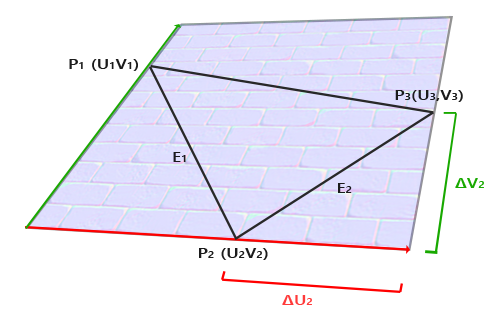

### 着色器

[片段插值](https://www.zhihu.com/question/63116687)

着色器(Shader)是运行在GPU上的小程序。这些小程序为图形渲染管线的某个特定部分而运行。从基本意义上来说，着色器只是一种把输入转化为输出的程序。着色器也是一种非常独立的程序，因为它们之间不能相互通信；它们之间唯一的沟通只有通过输入和输出，着色器都是一个**着色器程序**的一部分，通常每个物体（可以理解成VAO）会配置一个着色器程序。

一个片段就是一个像素，它包含了像素的最终颜色，法线等其他属性，片段插值在**光栅化阶段**进行，被应用到片段着色器的所有输入属性上，根据片段在图元中的相对位置决定其绝对位置，并根据相对位置计算该片段的属性值，以下是OpenGL的**渲染管线**（每一次渲染循环都需要走一遍完整的渲染管线）：


在OpenGL程序的**一次绘制调用**中**调用`glDrawArrays()`**绘制一个物体时：

- **顶点着色器**被GPU为每个**顶点**并行地执行一次。

  1. **输入**: 从顶点缓冲对象 (VBO) 中接收**一个顶点**的属性数据 (Vertex Attributes)，例如：顶点位置、颜色、法线、纹理坐标等。同时，它还能接收全局统一变量 (Uniforms)，如模型-视图-投影 (MVP) 变换矩阵。
  2. **处理**: 执行你编写的着色器代码。这个阶段最核心、最基本的任务是进行**坐标变换**，将顶点的局部空间 (Local Space) 位置通过一系列矩阵乘法，转换到最终的裁剪空间 (Clip Space) 位置。它也可以处理其他顶点属性，例如将颜色或纹理坐标直接传递给下一阶段。
  3. **输出**: **必须**输出一个vec4类型的裁剪空间坐标（该坐标依然是齐次坐标）到内置变量 gl_Position。同时，它将其他需要传递给片段着色器的数据（如颜色、纹理坐标）作为 out 变量输出。这些输出值在后续的光栅化阶段会被**插值**。

  顶点着色器只有**一个**。
  它的**执行次数**与你要绘制的物体的**顶点总数**相等。

  ---

- **几何着色器**被GPU为每个**图元**并行地执行一次（如果没有指定几何着色器，则顶点直接进入图元装配阶段）。

  1. **输入**: 从顶点着色器接收一个**完整的图元**。这意味着它一次性接收构成该图元的所有顶点的数据（例如，一个三角形的全部3个顶点及其所有属性）。

     > [!TIP]
     >
     > 在几何着色器之前，有一个临时图元装配，几何着色器之后，才进行最终图元装配。
     >
     > [Rendering Pipeline Overview - OpenGL Wiki](https://wikis.khronos.org/opengl/Rendering_Pipeline_Overview)
     >
     > [OpenGL 4.6 (Core Profile) - 11.3 Geometry Shaders](https://registry.khronos.org/OpenGL/specs/gl/glspec46.core.pdf)

  2. **处理**: 执行你编写的着色器代码。这个阶段的独特之处在于它能够**在GPU上动态地创建、修改或销毁几何体**。它可以：

     - 将输入的图元原封不动地传递下去。
     - 修改输入图元的顶点属性。
     - 直接丢弃整个图元（不产生任何输出）。
     - 将一个图元扩展成多个其它图元（例如，将一个点扩展成一个四边形）。

  3. **输出**: 它可以输出**零个、一个或多个**新的图元。这是通过逐个发射（EmitVertex）新的顶点，并将它们组织成新的图元（EndPrimitive）来完成的。输出的图元会被传递到图元装配阶段。

  几何着色器只有**一个**。
  **执行次数**与你要绘制的**图元总数**相等。
  它是一个**可选**阶段，因其可能影响性能，所以不常用。
  的核心能力是**在GPU上即时生成或销毁几何体**。

  ---

- **图元装配**是渲染管线中一个固定的硬件阶段，在一次绘制调用中绘制一个物体时，他只执行一次，但它**不会**等待所有几千几万个顶点都处理完之后才开始工作，它是一个**流式**处理的过程：

  1. **输入**: 从顶点着色器（或可选的几何着色器）阶段接收独立的、已处理过的顶点。
  2. **处理**: 根据你的绘制指令（例如 GL_TRIANGLES），将这些顶点“组装”成指定的图元（例如，每3个顶点组成一个三角形）。
  3. **输出**: 将一个个完整的图元传递给光栅化阶段。

  图元装配阶段是**一个**整体的功能单元。
  它**持续不断地**工作，接收一个个顶点，将它们组装成图元后立即发送到下一阶段。

  *(注意，图元装配之后，还会经历**图元裁剪**和**透视除法**，将可视范围内的顶点坐标变换为NDC)*

  ---

- **在光栅化之前**，还有一个固定的硬件阶段叫做**视口变换**。它也是一个**流式**处理的过程：

  1. **输入**: 接收顶点的**归一化设备坐标 (NDC)**，其范围是 `[-1, 1]` 的立方体。

  2. **处理**: 根据你通过 `glViewport(x, y, width, height)` 设置的参数，将NDC坐标**线性映射**到**窗口坐标 (Window Coordinates)**，也称为**屏幕空间坐标 (Screen Space Coordinates)**。
     - $x_{screen} = \frac{x_{ndc} + 1}{2} \cdot \text{width} + x$
     
     - $y_{screen} = \frac{y_{ndc} + 1}{2} \cdot \text{height} + y$
     
  3. **输出**: 顶点的**屏幕空间坐标**。
  
  ---
  
- **光栅化**和图元装配阶段一样，也是一个**流式**处理的过程：

  1. **输入**: 从图元装配阶段接收一个完整的图元（例如一个三角形）。
  2. **处理**: 计算出这个图元覆盖了屏幕上的哪些像素点。
  3. **输出**: 为每一个被覆盖的像素点，生成一个**片段 (Fragment)**。这个片段包含了进行后续颜色计算所需的所有信息（如插值后的坐标、颜色、纹理坐标等）。

  光栅化阶段是**一个**整体的功能单元。
  它**持续不断地**工作，接收一个个图元，并为它们产生成千上万的片段。

  ---

- **片段着色器**被GPU为**每一个片段**并行地执行一次。

  1. **输入**: 从光栅化阶段接收一个**片段 (Fragment)** 的数据。这个片段是“准像素”，包含了在它所在位置上经过插值计算的所有顶点属性（如颜色、纹理坐标、法线等）。
  2. **处理**: 执行你编写的着色器代码。这个阶段的核心任务是**处理纹理数据**，根据输入数据、纹理、光照信息等，计算出这个片段**最终的颜色**。
  3. **输出**: 输出一个 vec4 类型的颜色值。这个颜色值将进入管线的下一个阶段（深度测试、模板测试、混合），如果通过所有测试，最终会被写入屏幕上的对应像素。

  片段着色器只有**一个**。
  它的**执行次数**与光栅化后生成的**片段数量**相等。一个覆盖半个屏幕的三角形就可能导致它被一定数量的核心并行执行上百万次。

  实际执行时，GPU以2x2的片段块为单位并行处理，但是并不影响我们的结论，见[#纹理](#纹理)

  ---

- **测试与混合**和图元装配阶段一样，也是一个**流式**处理的过程，其性能与结果正确性受物体绘制顺序的影响[#深度测试](#深度测试)：

  1. **输入**: 从片段着色器接收一个片段，这个片段已经有了最终计算出的颜色值和深度值。
  2. **处理 (一系列测试)**:
     - **剪裁测试 (Scissor Test)**: 检查片段是否在你定义的矩形“剪裁”区域内。不在则直接丢弃（和上面那个不一样，这个裁剪测试指的是通过 `glScissor(x, y, width, height)` 设置的边界）。
     - **模板测试 (Stencil Test)**: 将片段的模板值与模板缓冲中的值进行比较，根据预设规则决定是否通过或丢弃。这可以用来创建复杂的遮罩效果。
     - **深度测试 (Depth Test)**: 将片段的深度值（Z值）与深度缓冲中对应位置的值进行比较。通常，如果新片段比已有的片段更“远”（深度值更大），它就会被丢弃。这是实现物体正确遮挡关系的关键。
  3. **最终操作 (写入或混合)**:
     - 如果片段通过了所有启用的测试，GPU就会准备将它的颜色写入颜色缓冲区（Framebuffer）。
     - **混合 (Blending)**: 如果开启了混合功能（通常用于渲染半透明物体），新片段的颜色会与颜色缓冲区中已有的颜色按照指定的公式进行**混合**。
     - **写入**: 如果没有开启混合，新片段的颜色会直接**覆盖**掉原来的颜色。

  测试与混合阶段是**一个**整体的功能单元。
  它对光栅化后生成的**每一个片段**都独立、依次地执行上述测试和操作。

### 纹理

[Texture Mapping - 知乎](https://zhuanlan.zhihu.com/p/648468577)

[图形学底层探秘 - 纹理采样、环绕、过滤与Mipmap的那些事 - 知乎](https://zhuanlan.zhihu.com/p/143377682)

- 纹理存储于显存，是一个通用数据缓冲(General Purpose Data Buffer)

- 定义二维图像纹理为 **texture (纹理)**，其**纹理空间**中每个坐标（即**纹素坐标**）对应一个 **texel (纹素)**，

- 图元经过**光栅化阶段**的处理后，会把图元映射为最终屏幕上相应的像素，生成供片段着色器使用的片段。其**像素空间**中每一个**pixel (像素)**都会对应一个**插值后**的顶点属性数据，比如顶点坐标和纹理坐标

- **片段着色器可以根据插值后的纹理坐标找到当前片段对应的浮点纹素坐标，并通过纹理过滤采样真正的纹素值作为当前片段的纹理颜色。**

- **纹理坐标**在x和y轴上，范围为0到1之间（注意我们使用的是2D纹理图像）。**使用纹理坐标获取纹理颜色（纹素值）叫做采样**。纹理坐标起始于(0, 0)，也就是纹理图片的左下角，终止于(1, 1)，即纹理图片的右上角。

- **纹理坐标**经过 **corresponder functions (响应函数)** 来到 **texture space (纹理空间)**， 假如某个纹理的贴图分辨率为 256×256 ，那么直接将当前坐标（0.32,0.29）乘上分辨率即可得到坐标 **(** 81.92,74.24) ，去掉小数部分得到坐标 (81,74) ，即 **texel texture (纹素坐标)**。**纹素坐标**对应了**纹理坐标**在**纹理空间**中的**位置**，真正访问纹理贴图的**纹素值**

- 综上（建议至少先完整看一遍教程），注意：

  1. 什么是纹理，纹理坐标，纹素，纹素坐标？

     - 纹理：二维图像纹理

     - 纹理坐标：在uv坐标系下，用于表示纹理中的位置的坐标

     - 纹素：纹理的像素，注意纹素只和纹理的分辨率有关，与纹理坐标无关

     - 纹素坐标：纹理空间中纹素的位置

  2. 哪些名词是连续值？

     答：顶点坐标，纹理坐标

  3. 哪些名词时离散值？

     答：像素，像素坐标，纹素，纹素坐标

  4. 顶点坐标和纹理坐标的对应关系

     答：人工指定顶点坐标（顶点坐标构成的图元在光栅化阶段后会转化为像素坐标）对应哪一个纹理坐标

  5. 什么是**纹理采样**？

     答：当 `纹理分辨率 == 像素输出分辨率` 时，纹理可以直接映射到2D像素输出上，**纹素和像素之间是一一对应的关系，在片段插值时，每一个片段（像素）插值生成的纹理坐标可以转换成唯一一个纹素整数坐标（纹素值）**。**在纹理图片中获取一个纹素值的过程叫纹理采样**

  6. 什么是**纹理过滤**？

     答：当 `纹理分辨率 != 像素输出分辨率` 时，**纹素和像素之间不是一一对应的关系**，`>`时，多个纹素对应一个像素；`<`时，一个纹素对应多个像素。所以需要指定，在片段插值时，每一个片段（像素）的纹理坐标转换成**纹素浮点坐标**后，对应哪一个（加权哪一些）纹素整数坐标对应的纹素值。**这个“寻找”最合适的纹素并通过采样这些纹素计算出最终该片段的像素值的过程叫做纹理过滤**

  7. 什么是**多级渐远纹理**（Mipmap）

     答：我们已经知道了在采样纹理时，纹理大小跟图形大小接近才会有好的显示效果，因此便有了Mipmap技术。Mipmap的原理是预先生成一系列以2为倍数缩小的纹理序列，在采样纹理时根据图形的大小自动选择相近等级的Mipmap进行采样

  8. 片段着色器如何确定当前片段对应的Mipmap等级

     答：**GPU通过计算纹理坐标在相邻像素上的变化率来自动完成这件事。**

     这个过程对程序员来说是**隐式**和**自动**的，当你调用 texture() 函数时，GPU硬件会为你搞定一切。

     具体实现：GPU在处理片段时，通常是**以2x2的片段块为单位并行处理的**。这使得GPU可以访问相邻片段的信息

     但是“片段着色器运行的次数=片段的个数”这个结论依然成立，原因如下：

     - **逻辑模型**

       OpenGL API 和 GLSL 语言向你呈现的是一个简单、清晰的抽象模型：

       - 光栅器每生成一个片段，就会为它**独立地**调用一次片段着色器。
       - 每一次着色器调用都是一个**隔离的**环境，它只能访问自己的输入数据（插值后的顶点属性，gl_FragCoord等）和全局的uniforms。
       - 在这个模型下，**执行次数绝对等于片段数量**。

     - **物理实现**

       在硬件层面，为了达到极致的效率，GPU并不会真的一个个地独立执行。它会这样做：

       - **分组执行 (Lock-step Execution)**: GPU会将片段分组，通常是**2x2的“四边形”(Quad)**，或者更大的**“线程束”(Warp/Wavefront)**，比如32或64个片段。同一个组内的所有片段会**同时、同步地**执行**同一个**着色器指令。
       - **硬件特性**: 正是因为这种2x2的分组是最小的执行单元，GPU硬件才能轻松地访问到“邻居”的数据。计算导数（纹理坐标的变化率）的函数，如 dFdx() 和 dFdy()，实际上就是利用了这个硬件特性，它是一个非常快速的硬件指令，用于获取组内相邻片段的值的差异。

     - **调和“矛盾”**

       这里的关键点是：**硬件的物理实现，是为了在不破坏逻辑模型的前提下，进行最大化的性能优化。**

       - 虽然一组片段被捆绑在一起执行，但每个片段的计算仍然是使用**它自己的数据**。你的变量a和旁边片段的变量a在内存中是完全独立的。
       - 所以，从结果来看，它**等同于**为每个片段都独立运行了一次。硬件保证了这种等效性。
       - Mipmap等级的选择（以及其他依赖导数的函数）是这个模型中一个罕见的“例外”，硬件开放了一个特殊的指令，允许你窥视一下邻居的数据，但这并不会破坏整个模型的独立性。

  9. 纹理坐标和纹素坐标的对应关系（纹理坐标通过转换对应一个浮点纹素坐标，注意浮点纹素坐标不是纹素对应的那个纹素整型坐标）

  10. 纹素整型坐标和纹素值的对应关系（一个纹素整型坐标对应一个纹素值）

  11. 纹理坐标和纹素值的对应关系（看5，6，7）

- 除了以上几点，编程时还需注意：

  1. 图像资源与纹理的关系

     答：用图像资源生成纹理，生成之后图像资源便没了作用

  2. 纹理单元与采样器的关系

     答：**一个纹理的位置值通常称为一个纹理单元**，我们需要通过`glUniform1i()`告诉采样器去指定的纹理单元取纹理数据

     也就是说：纹理单元作为一个桥梁，告诉OpenGL当前绑定的纹理需要传给哪个纹理单元，以及采样器需要读哪个纹理单元中的纹理。

  3. 纹理与纹理单元的关系

     生成纹理后，OpenGL还不知道这个纹理对应的是哪个纹理单元，所以需要将纹理绑定到对应的纹理单元，这样后续采样器取值时就能够获取到正确的纹理。

  4. OpenGL纹理采样全过程：

     首先我们会加载一个图像，用这个图像生成一个纹理，并将这个纹理传给当前激活的纹理单元（假设是`GL_TEXTURE0`），然后设置片段着色器中的`sampler2D`的值为0。随后在渲染过程中，当渲染管线运行到片段着色器阶段时，`sampler2D`便会从0号纹理单元中读取纹理数据，然后通过`texture()`函数，我们会将（插值的）纹理坐标对应那些纹素进行过滤，环绕，获取到该像素坐标对应的纹理颜色。

### 深度测试

- 提前深度测试

  解释：**在执行开销巨大的片段着色器之前，先进行深度测试。**
  具体来说：

  1. **传统流程**：
     光栅化 -> 片段着色器 -> 深度测试
     - 缺点：即使一个片段最终会被其他物体遮挡（即在深度测试中失败），GPU依然会为它完整地运行一次片段着色器，造成了计算资源的浪费。
  2. **提前深度测试流程**：
     光栅化 -> **深度测试** -> 片段着色器
     - 优点：如果一个片段在光栅化后，通过深度比较发现它已经被遮挡，GPU会**立即丢弃**这个片段，**不再为它执行后续的片段着色器**。 这能极大地提升渲染性能，尤其是在有大量遮挡的复杂场景中。

  **关键限制**

  文档中也明确指出，要让提前深度测试生效，有一个重要限制：**你不能在片段着色器中手动修改片段的深度值**（例如写入gl_FragDepth）。
  因为一旦你这样做，GPU就无法在运行片段着色器**之前**预知最终的深度值，这个优化就会自动失效，流程退回至传统方式。

- 绘制顺序对测试与混合阶段的影响

  **核心思想**：**测试与混合**阶段并非在所有绘制指令结束后才执行一次，而是**为每一次绘制调用（Draw Call）都独立、完整地运行一次**。它是一个**有状态**的过程，每一次运行都会读取并可能修改帧缓冲（颜色和深度缓冲区），从而直接影响下一次绘制调用的结果。

  可以把帧缓冲想象成一块正在创作中的油画画布。每一次绘制调用，都是画家在画布上新画一层。

  1. 对于不透明物体（主要影响：深度测试）

     对于不透明物体，绘制顺序主要影响**性能**，而非最终画面的正确性。

     - **运行机制**：
       1. 当第一个物体被绘制时，它的片段在通过深度测试后，会将其颜色写入**颜色缓冲**，并将其深度值写入**深度缓冲**。
       2. 当第二个物体被绘制时，它的片段会与**深度缓冲中已存在的值**（即第一个物体留下的深度值）进行比较。
     - **对性能的影响**：
       - **先画远，再画近**：远处的物体先通过深度测试，写入颜色和深度。然后近处的物体再通过测试，**覆盖**掉远处物体的颜色。被覆盖部分的片段着色器被**浪费**了。
       - **先画近，再画远**：近处的物体先写入深度。当绘制远处物体时，被遮挡的部分在**提前深度测试（Early-Z）**阶段就因深度值更大而失败，GPU会直接丢弃这些片段，**避免了运行昂贵的片段着色器**，效率极高。

     ---

  2. 对于半透明物体（主要影响：混合）

     对于半透明物体，绘制顺序直接影响**最终画面的正确性**。

     - **运行机制**：
       混合操作需要将新片段的颜色（**源颜色**）与颜色缓冲中已存在的颜色（**目标颜色**）相结合。混合公式 最终颜色 = 源颜色 * Alpha + 目标颜色 * (1 - Alpha) 是**非交换**的，即源和目标互换，结果会完全不同。
     - **对正确性的影响**：
       - **正确顺序（从远到近画）**：先画后面的墙壁，它的颜色成为**目标颜色**。再画前面的玻璃，玻璃的颜色作为**源颜色**与墙壁颜色混合，得到正确的半透明效果。
       - **错误顺序（从近到远画）**：先画前面的玻璃，它会与背景色混合。然后画后面的墙壁，由于墙壁是不透明的且深度写入默认开启，它会直接通过深度测试**覆盖**掉之前画好的玻璃。结果完全错误。

     ---

  ### 总结

  | 物体类型       | 绘制顺序如何影响“测试与混合”阶段                             |
  | -------------- | ------------------------------------------------------------ |
  | **不透明物体** | 每一次绘制调用都会更新深度缓冲区，影响后续调用的**深度测试结果**。顺序不影响最终画面，但**严重影响性能**。 |
  | **半透明物体** | 每一次绘制调用都会更新颜色缓冲区，这个颜色会成为后续调用进行**混合操作时的“目标颜色”**。顺序**直接决定最终画面的正确性**。 |

### 帧缓冲FBO

[#代码](D:\1_Code\Visual Studio 2022\LearnOpenGL\7_Framebuffers\LearnOpenGL)

1. 什么是帧缓冲？

   **核心思想**:

   到目前为止，我们所有的绘制操作都是直接在**默认帧缓冲 (Default Framebuffer)** 上进行的——也就是你创建窗口时，窗口系统自动为你管理的那个“画布”，它的内容最终会显示在你的屏幕上。

   **帧缓冲 (Framebuffer Object, FBO)** 允许我们**创建自己的、额外的、离屏的 (Off-screen) 画布**。我们可以将场景渲染到这些自定义的画布上，而不是直接渲染到屏幕。

   **一个FBO本质上是一个容器**，它本身不存储任何像素数据。它只是一个“插座”，你需要创建并**附加 (Attach)** 一些可存储数据的对象上去，这些对象被称为**附件 (Attachments)**，示意图如下：

   

   ---

2. 帧缓冲的附件 (Attachments)

   一个完整的帧缓冲通常需要附加以下两种类型的对象：

   1. **颜色附件 (Color Attachment)**:
      - **作用**: 存储**颜色**数据。所有片段着色器计算出的颜色值都会被写入到这里。
      - **实现方式**: 通常是一个**纹理 (Texture)**。将场景渲染到纹理上，意味着我们可以像使用普通纹理一样，在后续的渲染步骤中对这个渲染结果进行采样（例如，实现后期处理效果）。
   2. **深度/模板附件 (Depth and Stencil Attachment)**:
      - **作用**: 存储**深度**和**模板**信息，以便进行深度测试和模板测试。
      - **实现方式**:
        - **纹理 (Texture)**: 同样可以将深度信息存储在纹理中，以便后续采样。
        - **渲染缓冲对象 (Renderbuffer Object, RBO)**: 这是一种更专门、更高效的存储格式。它的数据不能像纹理一样被着色器直接采样，但对于只写（例如，只用于深度测试）的场景，它的性能通常比纹理更好。

   ---

3. 使用帧缓冲的基本流程

   使用FBO进行离屏渲染，通常遵循以下三个步骤：

   - **Step 1: 创建与设置**

     1. **创建FBO**: 调用 `glGenFramebuffers()` 创建一个帧缓冲对象。
     2. **创建附件**:
        - 创建一个**纹理**作为颜色附件 (`glGenTextures`, `glTexImage2D`, ...)。
        - 创建一个**渲染缓冲对象**作为深度/模板附件 (`glGenRenderbuffers`, `glRenderbufferStorage`, ...)。
     3. **绑定FBO**: 调用 `glBindFramebuffer(GL_FRAMEBUFFER, fbo)` 激活我们自己的FBO。
     4. **附加附件**:
        - 调用 `glFramebufferTexture2D()` 将纹理附加到FBO的颜色附件点上。
        - 调用 `glFramebufferRenderbuffer()` 将RBO附加到FBO的深度/模板附件点上。
     5. **检查完整性**: 调用 `glCheckFramebufferStatus()` 确保FBO的配置是完整且有效的。
     6. **解绑FBO**: 设置完成后，通过 `glBindFramebuffer(GL_FRAMEBUFFER, 0)` 切回默认帧缓冲，以防意外修改。

     ---

   - **Step 2: 渲染阶段 (离屏渲染)**

     1. **绑定FBO**: `glBindFramebuffer(GL_FRAMEBUFFER, fbo)`。现在，所有后续的渲染指令都会绘制到我们附加到`fbo`上的纹理和RBO中，而不是屏幕。
     2. **清空画布**: `glClear()` 清空我们FBO的附件。
     3. **绘制场景**: 像平常一样，调用你的 `glDrawArrays` 或 `glDrawElements` 来绘制你的3D场景。
     4. **解绑FBO**: `glBindFramebuffer(GL_FRAMEBUFFER, 0)`。渲染完成后，切回默认帧缓冲。

     ---

   - **Step 3: 使用渲染结果 (后期处理)**

     1. **清空屏幕**: `glClear()` 清空默认帧缓冲（屏幕）。
     2. **使用纹理**: 现在，我们在第一步中创建的、并已在第二步中被渲染上场景图像的**纹理**，可以像任何普通纹理一样被使用。
     3. **绘制一个覆盖全屏的四边形**: 绘制一个简单的矩形，让它正好铺满整个屏幕。
     4. **绑定并采样纹理**: 在这个四边形的片段着色器中，绑定我们之前渲染好的场景纹理，并对其进行采样。
     5. **应用效果**: 在采样纹理后，可以在片段着色器中对颜色进行各种处理，例如：
        - **灰度化**: `color.r * 0.299 + color.g * 0.587 + color.b * 0.114`
        - **反相**: `1.0 - color`
        - **核效果 (Kernel Effects)**: 如模糊、锐化等，通过对纹理周边像素进行多次采样。

### 像素缓冲PBO

#### 传统的同步传输

在引入PBO这个“英雄”之前，我们必须先了解它要解决的“恶龙”是什么。这个“恶龙”就是传统的、**同步的**像素传输方式所带来的性能瓶颈。

##### 像素传输的基础

在OpenGL中，像素数据的传输主要涉及两大方向：从CPU到GPU（上传），和从GPU到CPU（下载）。我们通过两个核心函数来了解这个过程。

1. 像素上传 (CPU -> GPU): `glTexImage2D`

   - **用途**: 这是创建和定义一个二维纹理的核心函数。它告诉OpenGL：“请在GPU显存中分配一块内存来存储纹理，并用我提供的数据来填充它。”

   - **关键参数**:

     ```c++
     void glTexImage2D(
         GLenum target,      // 纹理目标, e.g., GL_TEXTURE_2D
         GLint level,        // Mipmap级别
         GLint internalformat, // GPU内部存储格式
         GLsizei width,      // 纹理宽度
         GLsizei height,     // 纹理高度
         GLint border,       // 必须为0 (历史遗留)
         GLenum format,      // 源数据的格式, e.g., GL_RGB
         GLenum type,        // 源数据的类型, e.g., GL_UNSIGNED_BYTE
         const void * data   // -> 指向CPU内存中像素数据的指针
     );
     ```

     最重要的参数是最后一个 `data`。在传统用法中，它是一个指向**主内存 (RAM)** 中像素数据块的**指针**。

2. 像素下载 (GPU -> CPU): `glReadPixels`

   - **用途**: 从帧缓冲（FBO或默认帧缓冲）中读取一块像素区域，并将其复制回CPU内存。常用于截图或进行基于CPU的图像处理。

   - **关键参数**:

     ```c++
     void glReadPixels(
         GLint x,            // 读取区域的左下角x坐标
         GLint y,            // 读取区域的左下角y坐标
         GLsizei width,      // 读取区域的宽度
         GLsizei height,     // 读取区域的高度
         GLenum format,      // 希望读取的像素格式
         GLenum type,        // 希望读取的数据类型
         void * data         // -> 指向CPU内存中用于接收数据的指针
     );
     ```

     同样，最后一个参数 `data` 是一个指向**主内存 (RAM)** 中用于**接收**像素数据缓冲区的**指针**。 

---

核心问题：为什么是“同步”的？

传统的像素传输函数之所以是**同步 (Synchronous)** 的，是因为它们的API设计和底层驱动实现，要求CPU在数据传输的**关键阶段**必须**等待 (Block)** GPU完成相应操作，从而在CPU和GPU之间形成了一个**同步点 (Synchronization Point)**。

- `glTexImage2D` (上传) 的同步流程

  当CPU调用 `glTexImage2D(..., cpu_data_pointer)` 时，会触发一个**阻塞式 (Blocking)** 的同步过程。

  1. **指令与数据捆绑**:

     此函数调用同时包含了**“做什么”**（更新一个纹理）和**“用什么做”**（`cpu_data_pointer`指向的数据）两个信息。 

  2. **强制同步点**:

     为了保证函数返回后，CPU可以安全地复用或释放 `cpu_data_pointer` 指向的内存，OpenGL驱动程序必须确保数据已经被完全从CPU内存中复制走。这强制CPU和GPU进入一个同步状态。

  3. **CPU的阻塞**:

     CPU的应用程序线程会**被挂起 (Stall)**，进入等待状态，直到以下两个条件都满足：
  
     - **GPU资源就绪**: GPU管线到达一个可以安全写入纹理内存的时间点。
     - **数据拷贝完成**: 所有像素数据已从CPU内存拷贝到驱动的内部缓冲区或GPU显存中。
  
  4. **函数返回**:
  
     同步过程完成后，函数返回，CPU线程才得以继续执行后续代码。 
  
  **核心瓶颈**:
  
  性能瓶颈在于**CPU的阻塞**。在这个同步过程中，CPU可能在第n次渲染循环，而GPU还在第n-1次渲染循环，CPU需要等待GPU运行到第n次渲染循环，并且等待数据被上传到GPU的显存中，才能返回。这打破了CPU与GPU本应高效并行的工作模式，导致渲染管线出现停顿。

- `glReadPixels` (下载) 的同步流程

  当CPU调用 `glReadPixels(..., cpu_data_pointer)` 时，会触发一个**代价高昂的阻塞式同步**。

  1. **强制管线刷新 (Pipeline Flush/Drain)**:
     - CPU请求的是GPU渲染管线的**最终结果**（帧缓冲内容）。
     - 但GPU的命令是异步执行的，可能还有大量的绘制命令在队列中等待处理。
     - 为了满足CPU的读取请求，驱动程序必须**强制GPU停止接收新命令，立即执行并完成所有已提交但尚未完成的渲染工作**。这个过程会清空GPU的整个命令队列，严重破坏其并行处理能力。
  2. **数据传输**:
     - 与上传类似，OpenGL规范要求当 `glReadPixels` 函数返回时，像素数据必须已经完整、安全地写入了 `cpu_data_pointer` 指向的内存中。
     - 因此，CPU的应用程序线程**必须被挂起 (Stall)**，等待上述**整个过程**（管线刷新 + 数据回传）全部完成。
  3. **函数返回**:
     - 数据安全抵达CPU内存后，函数返回，CPU线程才得以继续。

  **核心瓶颈**:

  `glReadPixels` 存在**双重性能瓶颈**：

  1. **GPU端**: **管线刷新**会中断GPU的高效并行流水线，是代价极高的操作。
  2. **CPU端**: **CPU阻塞**并等待一个非常漫长的过程（渲染完成+数据传输），造成CPU资源的巨大浪费。

#### PBO的核心概念与异步机制

##### PBO的本质

1. **PBO是什么？—— 一个通用的GPU内存缓冲区**

   **PBO (Pixel Buffer Object)**，从最根本的层面来说，它**不是**一个全新的、神秘的东西。它就是OpenGL中**通用缓冲对象 (Buffer Object)** 的一种。

   - **与VBO的关系**: 它与VBO (Vertex Buffer Object) 共享完全相同的底层机制和API。你可以把它理解为一个“**用途不同**的VBO”。
     - 它们都通过 `glGenBuffers()`, `glBindBuffer()`, `glBufferData()` 等相同的函数进行创建、绑定和数据管理。
     - 它们都是由OpenGL驱动程序管理的、通常位于**高速GPU显存 (VRAM)** 中的一块线性内存区域。

   ---

2. **PBO的“专职”：绑定目标决定用途**

   既然PBO和VBO在底层是同一种东西，那是什么让它们产生区别的呢？

   答案是**绑定目标 (Binding Target)**。当你调用 `glBindBuffer(target, ...)` 时，你传入的 `target` 参数，就是在告诉OpenGL：“我希望你将这块内存**解释并用于**以下特定目的。”

   - **VBO**: 绑定到 `GL_ARRAY_BUFFER`，告诉OpenGL“这里面存的是**顶点属性**”。
   - **PBO**: 绑定到以下两个**专用**于像素操作的目标之一：
     - `GL_PIXEL_UNPACK_BUFFER`: 用于**解包 (Unpack)** 像素，即**上传**数据到GPU。
     - `GL_PIXEL_PACK_BUFFER`: 用于**打包 (Pack)** 像素，即从GPU**下载**数据。

   ---

3. 核心优势：为像素传输而优化

   当一个缓冲对象被绑定为PBO时，OpenGL驱动程序会对其进行特殊优化，使其能够与像素传输指令（如`glTexImage2D`, `glReadPixels`）进行高效的、**异步的**协作。

**总结**:

PBO的本质是一个**通用的OpenGL缓冲对象**。它的特殊之处在于，它被专门设计用于**充当像素传输的中间站**。通过将其绑定到专用的 `PACK` 或 `UNPACK` 目标，PBO得以解锁其最重要的特性——**异步DMA传输**，从而解决了传统像素传输中的性能瓶颈。

##### DMA

dma指的是硬件不通过cpu，而是通过dma控制器，直接访问，修改，传输内存或显存中的数据

它允许某些硬件子系统（I/O设备）独立于中央处理器（CPU），直接访问系统主存储器（RAM）。

- 大致工作原理：

  DMA传输由一个专用的**DMA控制器 (DMAC)** 管理。其标准流程如下：

  1. **CPU编程**: CPU通过向DMAC的寄存器写入源地址、目标地址、传输计数等参数，来**初始化**一次传输任务。
  2. **CPU释放总线控制**: CPU向DMAC发出传输请求后，可以继续执行其他指令，将总线控制权交由DMAC。
  3. **DMAC执行传输**: DMAC获得总线控制权后，直接在源与目标之间执行数据传输，无需CPU介入。
  4. **传输完成中断**: 传输完成后，DMAC通过一个硬件中断向CPU发信号，表示任务已完成。

- PBO与DMA的集成

  在OpenGL上下文中，PBO利用DMA机制来实现像素数据的异步传输。

  - 当一个PBO被绑定到`GL_PIXEL_UNPACK_BUFFER`或`GL_PIXEL_PACK_BUFFER`目标时，后续的像素传输函数（如`glTexImage2D`, `glReadPixels`）的行为会发生改变。
  - 这些函数调用不再触发一个即时的、由CPU主导的数据拷贝，而是被OpenGL驱动程序翻译成一个**DMA传输请求**。
  - 驱动程序负责对底层的DMAC进行编程。函数调用会**非阻塞地**返回，允许CPU继续处理其他任务，而DMA传输则在硬件层级**异步**执行。 

  通过利用DMA，PBO将像素数据传输从一个**同步的、阻塞CPU的I/O操作**，转换成一个**异步的、与CPU执行并行的硬件操作**。这种**解耦 (Decoupling)** 显著提高了CPU-GPU管线的并行度，减少了因数据传输导致的**停顿 (Stalls)**，从而提升了整体渲染性能。

##### glMapBufferRange

- **核心功能**:

  `glMapBufferRange` 的作用是将一个**缓冲对象 (Buffer Object)**（如VBO, PBO）的全部或一部分存储空间，**映射 (Map)** 到应用程序（CPU）的**地址空间**中。

- **返回值**:

  它返回一个**指向被映射内存区域的CPU指针**。应用程序可以通过这个指针，像操作普通RAM一样，直接**读取**或**写入**当前绑定的PBO缓冲区。

- **关键参数**:

  ```c++
  void* glMapBufferRange(
      GLenum target,    // 缓冲对象的目标, e.g., GL_ARRAY_BUFFER, GL_PIXEL_UNPACK_BUFFER
      GLintptr offset,  // 要映射的缓冲区区域的起始偏移量（字节）
      GLsizeiptr length, // 要映射的区域的长度（字节）
      GLbitfield access // -> 关键：指定访问权限的标志位
  );
  ```

  **`access` 标志位**:

  允许向OpenGL驱动明确地声明你打算如何使用这块映射的内存，从而让驱动进行最大化的性能优化。常用的标志位包括：

  - **读/写权限**:
    - `GL_MAP_READ_BIT`: 你只会从这块内存中**读取**数据。
    - `GL_MAP_WRITE_BIT`: 你只会向这块内存中**写入**数据。
  - **同步行为控制 (非常重要)**:
    - `GL_MAP_INVALIDATE_RANGE_BIT`: **“孤立”**。告诉OpenGL，你**不关心**指定范围内**旧的**数据内容。驱动可以返回一块全新的内存，而无需等待GPU完成对旧数据的使用。这是避免同步阻塞的关键（常与 `GL_MAP_WRITE_BIT` 一起用）。
    - `GL_MAP_UNSYNCHRONIZED_BIT`: **“别等我”**。告诉OpenGL，不要试图同步任何与该缓冲区相关的操作。这把同步的责任完全交给了程序员，使用不当可能导致数据冲突，但能提供最大的性能。
    - `GL_MAP_FLUSH_EXPLICIT_BIT`: 需要与 `glFlushMappedBufferRange` 配合，手动控制哪部分修改过的数据需要被刷新到GPU。

- **解除映射**:

  在完成读写操作后，必须调用 `glUnmapBuffer(target)` 来解除映射。这会将缓冲区的控制权交还给OpenGL，并使之前返回的CPU指针失效。

##### PACK与UNPACK

一个PBO（Pixel Buffer Object）本身只是一块GPU内存。它的具体角色——是作为数据的**“源头”**还是**“目的地”**——完全由它绑定到的**目标 (Target)** 决定。这两个目标就是`PACK`和`UNPACK`。

1. `GL_PIXEL_UNPACK_BUFFER` (上传)

   - **数据流向**: **CPU -> PBO -> GPU内部目标 (如纹理)**
   - **PBO角色**: **数据源 (Source)**。
   - **影响的函数**: 主要影响**上传**类函数，如`glTexImage2D`, `glTexSubImage2D`。
   - **工作机制**:
     1. 你首先将数据从CPU**写入**到PBO中（通过 `glMapBufferRange` 获取当前绑定PBO的映射地址来写入）。
     2. 然后，你将此PBO绑定到 `GL_PIXEL_UNPACK_BUFFER` 目标。
     3. 在未来的某个时间点，当你调用 `glTexImage2D(..., offset)` 时，OpenGL驱动知道像素数据**不是**来自CPU的某个内存地址，而是应该从当前**绑定的UNPACK PBO缓冲区**的指定`offset`处开始**读取**，并通过DMA异步传输到纹理对象中。 

   **记忆口诀**: **UNPACK is for UPLOAD** (解包用于上传)。 

   ---

2. `GL_PIXEL_PACK_BUFFER` (下载) 

   - **数据流向**: **GPU内部源 (如帧缓冲) -> PBO -> CPU**
   - **PBO角色**: **数据目的地 (Destination)**。
   - **影响的函数**: 主要影响**下载**类函数，如`glReadPixels`。
   - **工作机制**:
     1. 你将一个PBO绑定到 `GL_PIXEL_PACK_BUFFER` 目标。
     2. 当你调用 `glReadPixels(..., offset)` 时，OpenGL驱动知道它应该将帧缓冲中的像素数据，通过DMA异步地**写入**到当前**绑定的PACK PBO缓冲区**的指定`offset`处，而**不是**直接传回CPU的某个内存地址。
     3. 在未来的某个时间点，CPU可以访问PBO，以读取GPU写入PBO中的像素数据（通过 `glMapBufferRange` 获取当前绑定的PBO的映射地址来读取）。 

   **记忆口诀**: **PACK is for Pulling back** (打包用于取回)。

   ---

#### 异步上传纹理 (CPU -> GPU)

**目标场景**:

高效地、持续地更新一个动态纹理的内容。最典型的例子就是在OpenGL场景中播放视频，每一帧视频画面都需要被上传为一个新的纹理。

**核心思想**:

我们将CPU的**“准备数据”**阶段和GPU的**“使用数据”**阶段解耦，让他们可以并行工作。PBO在这里扮演了一个**“中转站”**和**“信号员”**的角色。

这个流程可以被清晰地分为**CPU端**的操作和**GPU端**的操作。

1. CPU端的操作：准备并提交数据

   CPU的任务是**尽可能快**地将下一帧的像素数据准备好，并放入PBO中，然后**立即**返回去准备更之后的数据，而**不等待**GPU。 

   1. **绑定PBO (Bind PBO)**:
      - 将一个PBO绑定到`GL_PIXEL_UNPACK_BUFFER`目标。
      - `glBindBuffer(GL_PIXEL_UNPACK_BUFFER, pboId);`
      - 这就像是在告诉OpenGL：“我接下来要操作的这块内存，是用来‘解包’上传的。”
      
   2. **映射缓冲区 (Map Buffer)**:
   
      - 调用 `glMapBufferRange` 或 `glMapBuffer`，请求OpenGL将这块位于GPU显存中的PBO内存，**映射**到CPU的地址空间。
   
      - `void* ptr = glMapBufferRange(GL_PIXEL_UNPACK_BUFFER, 0, dataSize, GL_MAP_WRITE_BIT | ...);`
      - 这个函数会返回一个**CPU可以访问的普通指针 `ptr`**。
   
   3. **写入数据 (Write Data)**:
   
      - CPU执行标准的内存拷贝操作（如`memcpy`），将准备好的像素数据（例如，一帧视频解码后的图像）**写入**到刚刚获取的指针 `ptr` 中。
      - `memcpy(ptr, pixelDataFromCPU, dataSize);`
      - 此时，数据正在从CPU的RAM传输到PBO所在的GPU VRAM中。
   
   4. **解除映射 (Unmap Buffer)**:
   
      - 写入完成后，调用 `glUnmapBuffer(GL_PIXEL_UNPACK_BUFFER);`。
      - 这告诉OpenGL：“CPU已经完成了对这块内存的写入，现在它归你管理了。”
      - 解除映射后，返回的指针 `ptr` 会失效。
   
   **CPU端到此的任务已经阶段性完成。** 它已经成功地将数据放入了PBO这个“中转站”。
   
   ---
   
2. **GPU端的操作：发起异步传输**

   GPU（通过CPU的渲染线程下达指令）的任务是发起一次从PBO到纹理的传输，这个传输由DMA在后台完成。

   1. **绑定纹理 (Bind Texture)**:
      - 绑定你希望更新的目标纹理。
      - `glBindTexture(GL_TEXTURE_2D, textureId);`
   2. **绑定PBO (Bind PBO)**:
      - **再次**将同一个PBO绑定到`GL_PIXEL_UNPACK_BUFFER`目标。这一步是为了确保OpenGL知道接下来的像素操作应该使用哪个PBO作为数据源。
      - `glBindBuffer(GL_PIXEL_UNPACK_BUFFER, pboId);`
   3. **发起传输 (Initiate Transfer)**:
      - 调用`glTexSubImage2D` (用于更新现有纹理) 或 `glTexImage2D` (用于创建新纹理)。
      - **这是最关键的一步**：将最后一个`data`参数设置为一个**字节偏移量的指针**，而不是一个CPU内存地址。通常，如果我们想从PBO的起始位置开始传输，就设置为`NULL`或`(void*)0`。
      - `glTexSubImage2D(GL_TEXTURE_2D, 0, 0, 0, width, height, GL_RGBA, GL_UNSIGNED_BYTE, (void*)0);`
   4. **函数立即返回**:
      - 这个`glTexSubImage2D`调用**几乎会立即返回**，CPU线程**不会被阻塞**。
      - 它只是向GPU的命令队列中提交了一个指令：“请在未来某个合适的时机，启动DMA，将当前绑定的UNPACK缓冲区（PBO）中的数据，传输到当前绑定的2D纹理中。”
   5. **解绑PBO (Unbind PBO)**:
      - 为了良好的编程习惯，在完成操作后解绑PBO。
      - `glBindBuffer(GL_PIXEL_UNPACK_BUFFER, 0);`

   ---

**结果**：

CPU在完成自己的写入任务后，可以立即去准备下一帧的数据。GPU则会在后台，利用DMA，并行地执行PBO到纹理的数据传输。两者实现了高效的并行工作，避免了同步等待。

我们后续会通过双缓冲PBO解耦CPU和GPU端的操作

#### 异步下载像素(GPU->CPU)

**目标场景**:

高效地从GPU的帧缓冲（FBO）中读取像素数据到CPU内存。例如，实现游戏录制、进行基于CPU的图像分析，或者将渲染结果保存为图片文件。

**核心思想**:

我们将GPU的**“拷贝像素到PBO”**阶段和CPU的**“处理像素”**阶段在时间上错开，避免CPU因为等待GPU完成渲染和拷贝而产生长时间的阻塞。

1. GPU端的操作：发起异步拷贝

   GPU的任务（由CPU下达指令）是**发起**一次从帧缓冲到PBO的像素拷贝指令，然后**立即返回**，而不等待拷贝完成。

   1. **绑定读帧缓冲 (Bind Read FBO)**:
      - 如果你想从一个自定义的FBO读取，需要将其绑定到`GL_READ_FRAMEBUFFER`目标。如果想从默认帧缓冲（屏幕）读取，则无需此步。
      - `glBindFramebuffer(GL_READ_FRAMEBUFFER, fboId);`
   2. **绑定PBO (Bind PBO)**:
      - 将一个PBO绑定到`GL_PIXEL_PACK_BUFFER`目标。
      - `glBindBuffer(GL_PIXEL_PACK_BUFFER, pboId);`
      - 这告诉OpenGL：“我接下来要‘打包’像素，请将它们存放到这个缓冲区里。”
   3. **发起异步读取 (Initiate Asynchronous Read)**:
      - 调用 `glReadPixels`。
      - **这是最关键的一步**: 将最后一个`data`参数设置为一个**字节偏移量的指针**，通常是`(void*)0`。
      - `glReadPixels(x, y, width, height, GL_RGBA, GL_UNSIGNED_BYTE, (void*)0);`
   4. **函数立即返回**:
      - 这个`glReadPixels`调用**几乎会立即返回**，CPU线程**不会被阻塞**。
      - 它只是向GPU的命令队列中提交了一个指令：“请在完成当前帧缓冲的绘制后，启动DMA，将指定区域的像素数据，从帧缓冲**复制到**当前绑定的PACK缓冲区（PBO）中。”
   5. **解绑PBO (Unbind PBO)**:
      - `glBindBuffer(GL_PIXEL_PACK_BUFFER, 0);`

   **至此，CPU已经成功下达了“下载”指令，并可以立即去执行其他任务（例如，开始渲染下一帧）。**

   ---

2. CPU端的操作：在未来某个时间点读取数据

   CPU的任务是在未来的某个时间点（通常是下一帧或几帧之后），当它**确认**或**认为**数据已经传输完毕时，再去访问PBO中的数据。

   1. **等待与同步 (Wait & Sync)**:
      - 在未来的某一帧（例如，第 N+1 帧），当CPU需要处理第 N 帧的像素数据时。
   2. **绑定PBO (Bind PBO)**:
      - 再次将那个用于接收数据的PBO绑定到`GL_PIXEL_PACK_BUFFER`目标。
      - `glBindBuffer(GL_PIXEL_PACK_BUFFER, pboId);`
   3. **映射缓冲区 (Map Buffer)**:
      - 调用 `glMapBufferRange`，请求将PBO的内存映射到CPU地址空间以供**读取**。
      - `void* ptr = glMapBufferRange(GL_PIXEL_PACK_BUFFER, 0, dataSize, GL_MAP_READ_BIT);`
      - **[潜在的同步点]**: **如果**此时GPU的DMA传输还**没有完成**，那么CPU的`glMapBufferRange`调用将会**在这里阻塞**，直到数据全部准备就绪。
   4. **处理数据 (Process Data)**:
      - 一旦`glMapBufferRange`返回，就表明数据已经安全地位于PBO中。
      - CPU现在可以从指针`ptr`中读取像素数据，并进行处理（例如，保存为PNG文件，或进行图像分析）。
      - `processPixels(ptr, dataSize);`
   5. **解除映射 (Unmap Buffer)**:
      - 处理完成后，解除映射。
      - `glUnmapBuffer(GL_PIXEL_PACK_BUFFER);`

我们后续会通过双缓冲PBO解耦CPU和GPU端的操作

#### 高级技巧

##### 缓冲区孤立

1. 问题：`glMapBufferRange` 的潜在阻塞

   我们已经知道，`glMapBufferRange` 用于获取一个指向当前PBO的CPU指针。但是，如果我们想映射的这块PBO内存**正在被GPU使用**（例如，上一帧的DMA传输还在进行中），会发生什么？

   **答案**：CPU会**阻塞**并等待，直到GPU完全释放对这块内存的占用。

2. 解决方案：缓冲区孤立

   在调用 `glMapBufferRange` 之前，先调用一次 `glBufferData`，并将**数据指针**参数设置为 `NULL` (或 `0`)。

   ```c++
   glBindBuffer(GL_PIXEL_UNPACK_BUFFER, pboId);
   
   // 1. 孤立旧缓冲区
   glBufferData(GL_PIXEL_UNPACK_BUFFER, DATA_SIZE, NULL, GL_STREAM_DRAW);
   
   // 2. 映射新缓冲区
   void* ptr = glMapBufferRange(GL_PIXEL_UNPACK_BUFFER, 0, DATA_SIZE, GL_MAP_WRITE_BIT); // <- 不再阻塞！
   ```

   解释：

   1. 我们的“孤立旧缓冲区”操作，让OpenGL切断了pboId与当前PBO缓冲区（GPU_Memory_Block_A）的联系，并为pboId重新分配了一个新的PBO缓冲区（GPU_Memory_Block_B），现在我们访问pboId，访问的是GPU_Memory_Block_B。
   2. 但是GPU_Memory_Block_A**不会被立即销毁**，GPU仍然可以安全地完成对它的读取，读取完成后GPU会自己回收。
   3. 显然我们只有在使用PBO写入的时候才会用这个方法，读取的时候不会用

##### 双缓冲PBO代码

[#PboUnpack](D:\1_Code\Visual Studio 2022\LearnOpenGL\8_Pixel Buffer\PboUnpack)
[#PboPack](D:\1_Code\Visual Studio 2022\LearnOpenGL\8_Pixel Buffer\PboPack)
[#PboPackFromFBO](D:\1_Code\Visual Studio 2022\LearnOpenGL\8_Pixel Buffer\PboPackFromFBO)

PboPackFromFBO和PboPack一样，不过我们需要读取FBO中的像素数据，而不是默认帧缓冲区的像素数据

### 基础光照

#### 光照基础

我们感知到的一个物体的颜色，并**不是**物体固有的绝对属性，而是它**反射**的光的颜色。一个红色的物体，是因为它吸收了除红色以外的所有颜色的光，只将红光反射到我们的眼睛里。

- 模拟反射：颜色相乘

  为了模拟光的反射，我们只需将**光源的颜色**和**物体的颜色**进行**分量式乘法 (Component-wise Multiplication)**。
  $$
  \text{final\_color} = \text{light\_color} \cdot \text{object\_color}
  $$
  (这里的 $\cdot$ 代表向量的分量式乘法，不是点乘)

  ```glsl
  void main()
  {
      // ...
      vec3 result = lightColor * objectColor;
      FragColor = vec4(result, 1.0);
  }
  ```

#### 冯氏光照模型

**核心思想**:

冯氏光照模型是一个**经验模型 (Empirical Model)**，它并非完全模拟真实世界的光物理现象，而是通过一种**简化且高效**的方式，模拟出人眼感知到的光照效果。

它将光照分解为三个独立的分量，并将它们**相加**得到最终的颜色：

**最终颜色 = 环境光照 (Ambient) + 漫反射光照 (Diffuse) + 镜面光照 (Specular)**


---

1. 环境光照 (Ambient Lighting)

   - **模拟现象**: 模拟场景中那些**间接**被照亮的光。在现实世界中，光线会在物体之间进行无数次反弹，使得即使是背光的物体也不会是纯黑的。环境光照就是对这种复杂现象的**粗略近似**。

   - **计算方法**: 非常简单，它不考虑光源的位置、方向，也不考虑物体的表面朝向。
     
     `环境光颜色 = 全局环境光强度 × 物体材质颜色`
     $$
     \text{Ambient} = \text{light\_color} \cdot \text{ambient\_strength} \cdot \text{object\_color}
     $$

     - `ambient_strength`: 一个很小的常数因子（如0.1），用来减弱环境光，使其看起来像是基础色。
     
   - **效果**: 为整个场景提供一个基础的亮度，确保没有任何物体是纯黑的，增加了场景的整体感。

   ---

2. 漫反射光照 (Diffuse Lighting)

   - **模拟现象**: 模拟光线照射到**粗糙**表面（如墙壁、木头、布料）时，光向**各个方向**均匀散射的效果。这是我们感知物体形状和轮廓的**最主要**的光照分量。

   - **计算关键**: *漫反射的强度取决于**光线方向**与**物体表面法线 (Normal)** 之间的**夹角***。

     - 光线越是**垂直**于表面，表面接收到的光就越多，看起来就**越亮**。
     - 光线越是**倾斜**于表面，光被分散到更大的区域，表面看起来就**越暗**。

   - **计算方法**:

     1. **法向量 (Normal Vector)**：$\mathbf{n}$，一个垂直于物体表面的单位向量。

     2. **光照方向向量 (Light Direction)**：$\mathbf{light}$，一个从**片段位置指向光源**的单位向量。

     3. **计算夹角余弦**：利用**点乘**计算 $\mathbf{n}$ 和 $\mathbf{light}$ 的夹角余弦值。$\cos(\theta) = \max(0.0, \mathbf{dot}(\mathbf{n}, \mathbf{l}))$。使用`max(0.0, ...)`是为了确保当光从物体背面照射时（点积为负），光照强度不会是负数（可以理解成漫反射强度）。

     4. **最终颜色**:

        `漫反射颜色 = 光源颜色 × 物体材质颜色 × max(0, dot(法线, 光线方向))`
        $$
        \text{Diffuse} = \text{light\_color} \cdot \max(0.0, \mathbf{dot}(\mathbf{n}, \mathbf{light})) \cdot \text{object\_color}
        $$

     5. 示意图如下：

        

   - **效果**: 创造出明暗过渡，使得物体的三维形状和体积感得以体现。

   ---

3. 镜面光照 (Specular Lighting)

   - **模拟现象**: 模拟光线照射到**光滑**表面（如金属、镜子、塑料）时，产生的**高光 (Highlight)** 或“反光点”。

   - **计算关键**: *镜面光强度取决于**观察方向**与**光的反射方向**之间的**夹角***。

     - 当你的**视线**正好与光的**完美反射方向**重合时，你就能看到最亮的高光。

   - **计算方法**:

     1. **观察方向向量 (View Direction)**: $\mathbf{view}$，一个从**片段位置指向观察者（摄像机）**的单位向量。

     2. **反射向量 (Reflection Vector)**: $\mathbf{reflect}$，光线方向 $\mathbf{light}$ 相对于法线 $\mathbf{n}$ 的反射方向。可以通过公式 $\mathbf{reflect} = \text{reflect}(-\mathbf{l}, \mathbf{n})$ 计算得出。

     3. **计算夹角余弦**: 计算 $\mathbf{v}$ 和 $\mathbf{r}$ 的点积，$\cos(\alpha) = \max(0.0, \mathbf{dot}(\mathbf{v}, \mathbf{r}))$。

     4. **反光度 (Shininess)**: 引入一个**反光度**指数 $p$ (例如32, 64, 128)。将点积结果进行 $p$ 次幂运算，$\max(0.0, \mathbf{dot}(\mathbf{v}, \mathbf{r}))^p$。这个操作会使高光的光斑变得更小、更集中，模拟不同材质的光滑程度。$p$值越大，材质越光滑，高光点越锐利。

     5. **最终颜色**:
   
        `镜面光颜色 = 光源颜色 × 高光颜色 × pow(max(0, dot(视线方向, 反射方向)), 光泽度)`
        $$
        \text{Specular} = \text{light\_color} \cdot \text{specular\_strength} \cdot \mathbf{dot}(\mathbf{view}, \mathbf{reflect})^p
        $$
        *注意：镜面高光反射的是**光源的颜色**，而不是物体的颜色。*

     6. 示意图：

        

   - **效果**: 在物体表面上增加亮斑，极大地提升了材质的质感和真实感。
   
   ---

**最终组合**:
在**片段着色器**中，我们将这三个分量分别计算出来，然后相加，得到最终的冯氏光照颜色(也可以在顶点着色器算，但是效果不好)。

```glsl
vec3 result = ambient + diffuse + specular;
FragColor = vec4(result, 1.0);
```

#### 材质

**核心思想**:

在之前的冯氏光照模型中，我们只用了一个`objectColor`来定义物体的颜色。这意味着一个物体对**环境光 (Ambient)**、**漫反射光 (Diffuse)** 和 **镜面光 (Specular)** 的反应都是基于同一种基色的。 

**材质**系统将这个概念进行了扩展。它不再使用单一的`objectColor`，而是为冯氏光照的**每一个分量**都定义一个独立的颜色属性。

一个**材质**，就是一组描述物体表面如何与光交互的**颜色属性**和**参数**的集合。

1. 材质的属性

   在冯氏光照模型中，一个材质通常由以下四个属性定义：

   1. **环境光颜色 (Ambient Color)**: 
      - **作用**: 定义了物体在**环境光**下反射什么颜色。这通常与物体的基色相同。
      - **GLSL实现**: `vec3 material.ambient;`
   2. **漫反射颜色 (Diffuse Color)**:
      - **作用**: 定义了物体在**漫反射**光照下反射什么颜色。这几乎总是我们所认为的物体的“真实”颜色。
      - **GLSL实现**: `vec3 material.diffuse;`
   3. **镜面光颜色 (Specular Color)**:
      - **作用**: 定义了物体表面**高光 (Highlight)** 的颜色。对于非金属物体，高光通常是白色的（直接反射光源颜色）。对于金属物体，高光会带上金属本身的颜色。
      - **GLSL实现**: `vec3 material.specular;`
   4. **反光度 (Shininess)**:
      - **作用**: 这是一个浮点数，用于控制镜面光高光的**锐利程度**。值越高，表面越光滑，高光点越小、越亮；值越低，表面越粗糙，高光点越大、越模糊。
      - **GLSL实现**: `float material.shininess;`

   ---

2. 在着色器中实现材质

   为了在GLSL中实现材质，我们通常会定义一个`struct`来将这些属性封装在一起。

   ```glsl
   struct Material {
       vec3 ambient;
       vec3 diffuse;
       vec3 specular;
       float shininess;
   };
   
   uniform Material material;
   ```

   同时，我们也会为光源定义一个类似的结构体，以便管理多个光源属性（例如，光源也可以有不同的环境光、漫反射和镜面光强度）。

   ```glsl
   struct Light {
       vec3 position;
       vec3 ambient;
       vec3 diffuse;
       vec3 specular;
   };
   
   uniform Light light;
   ```

3. 结合材质的光照计算

   - 环境光分量：
     $$
     \text{Ambient} = \text{light.ambient} \cdot \text{material.ambient}
     $$

   - 漫反射分量：
     $$
     \text{Diffuse} = \text{light.diffuse} \cdot \max(0.0, \mathbf{n} \cdot \mathbf{light}) \cdot \text{material.diffuse}
     $$

   - 镜面光分量：
     $$
     \text{Specular} = \text{light.specular} \cdot (\max(0.0, \mathbf{v} \cdot \mathbf{r}))^{\text{material.shininess}} \cdot \text{material.specular}
     $$

   - 最终颜色：
     $$
     \text{final\_color} = \text{Ambient} + \text{Diffuse} + \text{Specular}
     $$

   **效果**:

   通过在CPU端为不同的物体设置不同的`Material` uniform变量，我们就可以用**同一套着色器**渲染出各种质感完全不同的物体。

#### 光照贴图

**核心思想**:
现实世界中，一个物体的表面很少是材质统一的。例如，一块木板，其木纹和木节的颜色、光滑度都不同。

**光照贴图**技术，就是使用**纹理 (Textures)** 来代替之前学习的单一`vec3`或`float`类型的材质属性。这样，我们就可以非常精细地控制一个模型**表面上每一个点**的漫反射颜色、镜面反射强度等。

片段着色器在进行光照计算时，会首先**采样**这些贴图，获取当前片段的材质属性，然后再进行光照计算。

1. 两种主要的光照贴图

   这篇文章重点介绍了两种用于替代冯氏模型中核心材质属性的贴图：

   - 漫反射贴图 (Diffuse Map)

     - **替代对象**: `material.diffuse` (漫反射颜色)。

     - **是什么**: 这就是我们通常所说的“**纹理**”或“**贴图 (Texture)**”。它是一张彩色图片，定义了物体表面各个点的**基色 (Base Color)**。

       

     - **GLSL实现**:

       - 在着色器中，我们不再使用`uniform vec3 material.diffuse`，而是使用一个**采样器 (Sampler)**：`uniform sampler2D material.diffuseMap;`。

       - 在光照计算中，我们首先根据顶点属性中传入的**纹理坐标 (UV)** 对其进行采样：

         ```glsl
         vec3 diffuseColor = texture(material.diffuseMap, fs_in.TexCoords).rgb;
         // ...
         vec3 diffuse = light.diffuse * diffFactor * diffuseColor;
         ```

     - **效果**: 让物体表面呈现出丰富的细节和图案，而不仅仅是单一的颜色。

     ---

   - 镜面光贴图 (Specular Map)

     - **替代对象**: `material.specular` (镜面光颜色) 中的强度部分。

     - **是什么**: 这通常是一张**灰度图**。图片中每个像素的**亮度**，被用来控制该点镜面高光的**强度**。

       

     - **GLSL实现**:

       - 同样，我们使用一个采样器：`uniform sampler2D material.specularMap;`。

       - 在光照计算中，采样这张贴图来获取当前片段的镜面反射强度：

         ```glsl
         vec3 specularStrength = texture(material.specularMap, fs_in.TexCoords).rgb;
         // ...
         vec3 specular = light.specular * specFactor * specularStrength;
         ```

         *(注意：这里我们用采样的颜色`specularStrength`来调节镜面反射的强度，而不是像`material.specular`那样直接作为颜色。高光的颜色通常还是由光源的镜面光颜色`light.specular`决定的)*

     - **效果**: 使得一个物体可以同时拥有光滑和粗糙的部分。例如，一个有金属边框的木箱，其木头部分不会有高光，而金属边框部分则会产生锐利的高光。

2. 着色器中的实现结构

   为了管理这些贴图，我们通常会更新`Material`结构体，用`sampler2D`代替原来的`vec3`：

   ```glsl
   struct Material {
       sampler2D diffuse;   // 漫反射贴图
       sampler2D specular;  // 镜面光贴图
       float     shininess; // 反光度仍然是一个float
   };
   
   uniform Material material;
   ```

   光照计算的流程变为：

   1. **获取漫反射颜色**: `vec3 diffuseColor = texture(material.diffuse, TexCoords).rgb;`
   2. **获取镜面反射强度**: `vec3 specularStrength = texture(material.specular, TexCoords).rgb;`
   3. **计算冯氏光照**: 将上面获取到的值，代入我们之前学习的环境光、漫反射、镜面光计算公式中。

   光照贴图技术极大地提升了渲染的真实感和细节层次。它将材质的定义从**“每个物体 (Per-Object)”**的级别，提升到了**“每个像素 (Per-Pixel)”**的级别，使得用非常简单的几何模型也能表现出极其丰富的视觉效果。这是现代实时渲染中不可或缺的一项基础技术。

#### 法线贴图

##### 法线贴图理论基础

1. **核心动机：用“欺骗”的手段创造无限细节**

   - **问题**: 想要渲染一个细节极其丰富的物体（比如一块布满凹凸纹理的砖墙），如果我们通过增加顶点来构建所有这些微小的几何细节，那么模型的顶点数量将会变得异常庞大，导致巨大的性能开销。
   - **解决方案**: 我们能不能用一个**低分辨率**的、平坦的模型（比如一个简单的四边形），但是让它在光照计算时，表现得**好像**拥有极其丰富的表面细节？

   **法线贴图**就是实现这种“视觉欺骗”的核心技术。

   ---

2. **什么是法线？—— 光照计算的关键**

   我们回顾一下冯氏光照模型，特别是**漫反射**和**镜面反射**，它们的计算都极度依赖于一个关键数据——**表面法线 (Surface Normal)**。

   法线的方向，决定了一个表面是朝向光源（亮）还是背向光源（暗）。通过改变一个点的法线方向，我们就可以改变这个点在光照下的明暗表现。

   **核心思想**:

   如果我们能为低多边形模型**表面上的每一个像素**，都提供一个**独特的、高精度的法线向量**，那么我们就能欺骗光照算法，让这个平坦的表面呈现出凹凸不平的明暗效果。

   

   ---

3. **什么是法线贴图？—— 存储法线的纹理**

   **法线贴图**就是这样一张特殊的纹理。它不像漫反射贴图那样存储颜色，而是**将法线向量的信息编码到像素的RGB通道中**。

   - **编码方式**:

     - 一个三维的法线向量 $\mathbf{N} = (x, y, z)$，其每个分量的范围是 `[-1, 1]`。

     - 为了将其存入图片（颜色通道的范围是 `[0, 1]`），我们需要做一个简单的映射，从 `[-1,1]` 转换至 `[0,1]`：
       $$
       \text{Pixel Color} = \frac{\mathbf{N}}{2} + 0.5
       $$

   - **贴图外观**:

     由于法线向量大多是指向表面“外侧”的（即Z轴正方向），所以它们的Z分量通常是正数。在映射后，这就导致了法线贴图通常呈现出一种**偏蓝色**的外观（因为蓝色通道存储的是Z分量）。

     

   ---

4. **最大的挑战：坐标系不统一**

   现在，我们有了一个核心问题：

   - 法线贴图中的法线，是在**哪个坐标系**下定义的？
     - 它们是在一个与**纹理UV坐标对齐**的坐标系下定义的。这个坐标系，我们称之为**切线空间 (Tangent Space)**。
   - 我们的光照计算，是在**哪个坐标系**下进行的？
     - 通常是在**世界空间 (World Space)** 或**观察空间 (View Space)**。我们需要的光源位置、观察方向等向量，都是在这些空间中定义的。

   我们必须将这两个向量**转换到同一个坐标系**下，才能进行正确的光照计算，方法如下：

   将从法线贴图采样到的法线，从切线空间**转换到世界空间**，然后在世界空间中进行光照计算。

   **为了实现这种坐标系的转换，我们就必须为每个顶点构建一个从切线空间到世界空间的“桥梁”——这就是 TBN 矩阵。**

   ---

5. **切线空间**

   **切线空间 (Tangent Space)** 是一个**定义在模型表面之上**的、**局部的**坐标系。

   想象你是一个站在模型表面上的“小人”，这个坐标系就是你所看到的坐标系。

   - **原点**: 就是你所站的那个点（片段/像素）的位置。
   - **Z轴 (法线轴, N)**: 就是该点的**法线方向**，始终**垂直于**模型表面，指向“外”。这是你的“上”方向。
   - **X轴 (切线轴, T)**: 始终沿着模型表面的**切线方向**，并且与模型**纹理坐标的U方向**（通常是横向）对齐。这是你的“右”方向。
   - **Y轴 (副切线轴, B)**: 始终沿着模型表面的**切线方向**，并且与模型**纹理坐标的V方向**（通常是纵向）对齐。这是你的“前”方向。

   这里的U，V方向**可能不会互相垂直**，但是我们在进行TBN矩阵计算时，**不会通过V方向来计算Y轴**，而是使用**施密特正交化**，通过N和T的叉乘计算，保证T，B，N一定为一组标准正交基

   总结：

   这是一个**动态的、跟随意表面的**坐标系。在一个球体的顶端，它的Y轴（B轴）可能指向世界空间的-Z方向；而在球体的前端，它的Y轴（B轴）可能指向世界空间的-Y方向，示意图如下：
   
   

##### TBN矩阵推导

[todo (68 封私信 / 83 条消息) 切线空间与TBN矩阵推导 - 知乎](https://zhuanlan.zhihu.com/p/1934601901397245987)

**目标**：

在CPU端，为模型的每一个三角形（图元），计算出其**切线空间 (Tangent Space)** 的三个基向量：**T (Tangent)**, **B (Bitangent)**, 和 **N (Normal)**。

**核心思想**：

切线空间是与模型**UV坐标**对齐的。因此，我们可以利用一个三角形的**三个顶点在3D空间中的位置**和它们在**2D纹理空间中的位置**之间的关系，来反解出切线空间的方向。

1. **建立数学模型**

   我们选取一个三角形，它由三个顶点 $P_0, P_1, P_2$ 构成。

   - **在3D物体空间中**：

     - 顶点位置分别为 $\mathbf{P}_0, \mathbf{P}_1, \mathbf{P}_2$。

     - 我们可以定义两条边向量：
       $$
       \mathbf{E}_1 = \mathbf{P}_1 - \mathbf{P}_0 \\
       \mathbf{E}_2 = \mathbf{P}_2 - \mathbf{P}_0
       $$

   - **在2D纹理空间中**：

     - 对应的纹理坐标分别为 $(U_0, V_0), (U_1, V_1), (U_2, V_2)$。

     - 我们也可以定义两条对应的UV“边”：
       $$
       \Delta U_1 = U_1 - U_0, \quad \Delta V_1 = V_1 - V_0 \\
       \Delta U_2 = U_2 - U_0, \quad \Delta V_2 = V_2 - V_0
       $$

   现在，我们假设**切线向量 $\mathbf{T}$** 和**副切线向量 $\mathbf{B}$** 是我们要求的未知量。它们定义了在纹理空间中，U方向和V方向的变化，对应到3D空间中是哪个方向（这里的 $\mathbf{T}$ 和 $\mathbf{B}$ 是一组基向量，不是一组标准基向量）。

   因此，我们可以建立以下关系：

   >  3D空间中的边向量，可以由T和B向量根据UV的变化量线性组合而成。

   $$
   \mathbf{E}_1 = \Delta U_1 \cdot \mathbf{T} + \Delta V_1 \cdot \mathbf{B} \\
   \mathbf{E}_2 = \Delta U_2 \cdot \mathbf{T} + \Delta V_2 \cdot \mathbf{B}
   $$

   示意图如下：

   

   ---

2. **求解方程组**

   这是一个关于未知向量 $\mathbf{T}$ 和 $\mathbf{B}$ 的二元一次方程组。我们可以把它写成矩阵形式：
   $$
   \begin{bmatrix}
    \mathbf{E}_{1} \\
    \mathbf{E}_{2}
   \end{bmatrix}
   =
   \begin{bmatrix}
    \Delta U_1 & \Delta V_1 \\
    \Delta U_2 & \Delta V_2
   \end{bmatrix}
   \begin{bmatrix}
    \mathbf{T} \\
    \mathbf{B}
   \end{bmatrix}
   $$
   为了解出 $\begin{bmatrix} \mathbf{T} \\ \mathbf{B} \end{bmatrix}$，我们需要对 $2 \times 2$ 的UV矩阵求逆：
   $$
   \begin{bmatrix} \mathbf{T} \\ \mathbf{B} \end{bmatrix} =
   \begin{bmatrix}
    \Delta U_1 & \Delta V_1 \\
    \Delta U_2 & \Delta V_2
   \end{bmatrix}^{-1}
   \begin{bmatrix} \mathbf{E}_1 \\ \mathbf{E}_2 \end{bmatrix}
   $$
   一个 $2 \times 2$ 矩阵 $\begin{bmatrix} a & b \\ c & d \end{bmatrix}$ 的逆是 $\frac{1}{ad-bc} \begin{bmatrix} d & -b \\ -c & a \end{bmatrix}$。代入我们的变量：
   $$
   \begin{bmatrix} \mathbf{T} \\ \mathbf{B} \end{bmatrix} =
   \frac{1}{\Delta U_1 \Delta V_2 - \Delta V_1 \Delta U_2}
   \begin{bmatrix}
    \Delta V_2 & -\Delta V_1 \\
    -\Delta U_2 & \Delta U_1
   \end{bmatrix}
   \begin{bmatrix} \mathbf{E}_1 \\ \mathbf{E}_2 \end{bmatrix}
   $$

   ---

3. **展开得到最终公式**

   我们将矩阵乘法展开，就得到了计算 $\mathbf{T}$ 和 $\mathbf{B}$ 的最终公式：
   $$
   \mathbf{T} = \frac{1}{\Delta U_1 \Delta V_2 - \Delta V_1 \Delta U_2} (\Delta V_2 \cdot \mathbf{E}_1 - \Delta V_1 \cdot \mathbf{E}_2) \\
   \mathbf{B} = \frac{1}{\Delta U_1 \Delta V_2 - \Delta V_1 \Delta U_2} (-\Delta U_2 \cdot \mathbf{E}_1 + \Delta U_1 \cdot \mathbf{E}_2)
   $$

   ---

4. 施密特正交化（见线性代数笔记）

##### 法线矩阵

现在，我们已经在CPU端为每个顶点计算好了一组**位于物体空间 (Object Space)** 下的、高质量的TBN基向量。

**问题**：当我们在片段着色器中进行光照计算时，我们通常需要**世界空间 (World Space)** 的向量（例如，世界空间的光源位置、摄像机位置）。因此，我们也必须将物体空间的TBN基，正确地转换到世界空间中。

1. 为什么不能直接用模型矩阵？—— 非统一缩放问题

   我们首先回顾一下这个核心问题： 我们**不能**简单地用**模型矩阵 (Model Matrix)** $M$ 来变换法线、切线、副切线这些**方向向量**。

   因为如果模型矩阵 $M$ 中包含了**非统一缩放**，它会扭曲物体的形状。直接用 $M$ 乘以一个法线向量，会导致变换后的向量**不再垂直**于变换后的物体表面，从而导致光照计算完全错误。

   

   ---

2. 解决方案：逆转置矩阵

   正确的做法是使用一个专门为法线（以及其他方向向量，如T和B）设计的变换矩阵，这个矩阵就是**法线矩阵**。

   **定义**:

   法线矩阵是**模型矩阵** $M$ 的**逆转置矩阵 (Inverse Transpose Matrix)**。
   $$
   \text{Normal Matrix} = (M^{-1})^T
   $$
   **在GLSL中**: `transpose(inverse(Model))`

   同时由于tbn矩阵是一组标准正交基，所以它没有位移分量，最终的法线矩阵为：

   `mat3 normalMatrix = mat3(transpose(inverse(Model)));`

### 模板测试

1. 核心思想：一个可自定义的像素“遮罩”

   **核心思想**:
   **模板测试**发生在**逐片段操作**阶段（在剪裁测试之后，深度测试之前或之后），它允许我们根据一个8位的**模板缓冲区 (Stencil Buffer)** 中的值，来**有条件地丢弃**片段。

   **一个简单的类比**:
   想象你在用喷漆作画。

   *   **帧缓冲**: 是你最终的画作。
   *   **模板 (Stencil)**: 是一张刻有形状（如星星）的硬纸板，你把它覆盖在画作上。
   *   **模板测试**:
       *   当你对着模板喷漆时，只有镂空（星星）的部分，颜料才能通过并落在画作上。
       *   被遮挡的部分，颜料则无法通过。

   模板缓冲区就扮演了这张“硬纸板”的角色。它和颜色缓冲区、深度缓冲区一样，为屏幕上的每一个像素都存储了一个8位的整数值（范围`0-255`）。我们可以通过渲染操作，来“雕刻”这个模板，决定哪些像素区域是“镂空”的，哪些是“遮挡”的。

---
2. 模板测试的流程与控制

   使用模板测试，主要通过两个核心函数来控制：`glStencilFunc` 和 `glStencilOp`。

   **a. `glStencilFunc`：决定测试“如何”通过**

   这个函数定义了**测试本身**。它告诉OpenGL如何将当前片段的**模板值**与模板缓冲区中对应位置的**模板值**进行比较。

   *   **语法**: `glStencilFunc(func, ref, mask)`
   *   **参数**:
       *   `func`: 比较函数。例如：
           *   `GL_NEVER`: 永远不通过。
           *   `GL_ALWAYS`: 永远通过。
           *   `GL_EQUAL`: 当 `(fragment_stencil & mask) == (ref & mask)` 时通过。
           *   `GL_NOTEQUAL`: 不相等时通过。
           *   `GL_LESS`, `GL_GREATER`, ...
       *   `ref`: 一个参考值。这是我们用来与缓冲区中的值进行比较的基准。
       *   `mask`: 一个位掩码。它会在比较之前，与片段的模板值和`ref`值进行按位与(`&`)操作。这允许我们只关心模板值的某几位。

   **b. `glStencilOp`：决定测试结果“如何影响”缓冲区**

   这个函数定义了当测试发生后，我们应该**如何更新**模板缓冲区中的值。

   *   **语法**: `glStencilOp(sfail, dpfail, dppass)`
   *   **参数**: 我们可以为三种不同的测试结果，分别指定一个操作：
       *   `sfail`: **模板测试失败**时，执行什么操作。
       *   `dpfail`: **模板测试通过**，但**深度测试失败**时，执行什么操作。
       *   `dppass`: **模板测试**和**深度测试都通过**时，执行什么操作。
   *   **可用的操作**:
       *   `GL_KEEP`: **保持**缓冲区中现有的值不变。
       *   `GL_ZERO`: 将缓冲区的值**清零**。
       *   `GL_REPLACE`: 用`glStencilFunc`中设置的`ref`值**替换**缓冲区中的值。
       *   `GL_INCR` / `GL_DECR`: **增加**或**减少**缓冲区的值（有范围限制）。
       *   `GL_INCR_WRAP` / `GL_DECR_WRAP`: 循环增加或减少。
       *   `GL_INVERT`: 按位**取反**。

---
3. 典型应用：物体轮廓 (Object Outlining)

   这是模板测试最经典的应用之一，教程中详细描述了其流程：

   1. **清空与启用**:

      *   在渲染循环开始时，清空颜色、深度和**模板**缓冲区。
      *   启用模板测试 `glEnable(GL_STENCIL_TEST);`

   2. **Pass 1: 绘制物体，雕刻模板**

      *   **目标**: 在模板缓冲区中，将物体所在的像素区域标记出来。
      *   **设置**:
          *   `glStencilFunc(GL_ALWAYS, 1, 0xFF)`: 让所有片段都**无条件通过**模板测试。
          *   `glStencilOp(GL_KEEP, GL_KEEP, GL_REPLACE)`:
              *   测试失败 -> 不可能发生。
              *   深度测试失败 -> 保持模板值（被遮挡的部分不标记）。
              *   双测试通过 -> 将模板缓冲区的值**替换**为`ref`值（即**1**）。
      *   **操作**: 正常绘制你的物体。
      *   **结果**: 此时，模板缓冲区中，凡是物体可见像素所对应的位置，其值都变成了`1`。其他地方都是`0`。我们成功“雕刻”出了物体的形状。

   3. **Pass 2: 绘制放大的物体，利用模板**

      *   **目标**: 在刚刚标记的区域**之外**，绘制一个稍大一点的物体，形成轮廓。
      *   **设置**:
          *   `glStencilFunc(GL_NOTEQUAL, 1, 0xFF)`: 现在，只允许那些模板值**不等于1**的片段通过。
          *   `glStencilOp(GL_KEEP, GL_KEEP, GL_KEEP)`: 我们不再需要修改模板，所以全部保持不变。
          *   **关闭深度写入**: `glDepthMask(GL_FALSE)`，防止轮廓错误地覆盖在物体上。
      *   **操作**:
          *   计算一个新的模型矩阵，将物体进行**微小的放大**。
          *   使用一个纯色的片段着色器（轮廓的颜色）。
          *   用这个新的模型矩阵和着色器，**再次绘制**同一个物体。
      *   **结果**:
          *   对于放大的物体，那些落在原始物体区域内（模板值为1）的片段，因为`GL_NOTEQUAL`测试而**被丢弃**。
          *   只有那些落在原始物体区域之外、因放大而“溢出”的片段（模板值为0），才能通过测试并被绘制出来，从而形成了轮廓。

   4. **清理**:

      *   恢复深度写入`glDepthMask(GL_TRUE)`，并可以禁用模板测试`glDisable(GL_STENCIL_TEST)`。

   5. 结果类似于：

      

### 混合

1. 核心思想：颜色的“混合”而非“覆盖”

   **默认行为 (无混合)**:
   在默认情况下，当一个片段通过了所有测试，它的颜色会**完全覆盖**掉颜色缓冲区中对应像素位置上已有的颜色。这对于渲染不透明物体是完全正确的。

   **混合 (Blending)**:
   当我们开启混合功能后，新片段的颜色（称为**源颜色 Source Color**）不会直接覆盖旧颜色（称为**目标颜色 Destination Color**），而是会根据一个特定的数学公式，将两者**混合**起来，得到一个最终的新颜色。

   **其实本节分为α测试和混合，对于α测试，我们是在片段着色器丢弃α值小于某个数的片段，混合就是我们本节的学习内容**

   ---

2. 混合方程 (Blend Equation)

   OpenGL中，最常用的混合方程如下：
   $$
   \mathbf{C}_{result} = (\mathbf{C}_{source} \cdot \mathbf{F}_{source}) + (\mathbf{C}_{destination} \cdot \mathbf{F}_{destination})
   $$
   我们来分解这个方程：

   *   $\mathbf{C}_{source}$: **源颜色**。这是当前片段着色器计算出的颜色。
   *   $\mathbf{C}_{destination}$: **目标颜色**。这是已经存在于颜色缓冲区中的颜色。
   *   $\mathbf{F}_{source}$: **源因子 (Source Factor)**。这是一个系数，用于调节源颜色的贡献度。
   *   $\mathbf{F}_{destination}$: **目标因子 (Destination Factor)**。这是一个系数，用于调节目标颜色的贡献度。

   ---

3. 设置混合因子：`glBlendFunc`

   我们可以通过 `glBlendFunc(source_factor, dest_factor)` 函数来设置上述方程中的源因子和目标因子。

   **最经典的组合：实现标准半透明效果**

   为了实现半透明效果（如彩色玻璃），我们通常利用源颜色的**Alpha通道**来控制其不透明度。

   *   **Alpha = 1.0**: 完全不透明。
   *   **Alpha = 0.0**: 完全透明。
   *   **Alpha = 0.5**: 50%半透明。

   对应的混合函数设置是：

   ```c++
   glBlendFunc(GL_SRC_ALPHA, GL_ONE_MINUS_SRC_ALPHA);
   ```

   *   `GL_SRC_ALPHA`: 源因子 $\mathbf{F}_{source}$ 设置为源颜色的Alpha值 $(\mathbf{C}_{source}.a)$。
   *   `GL_ONE_MINUS_SRC_ALPHA`: 目标因子 $\mathbf{F}_{destination}$ 设置为 $1 - (\mathbf{C}_{source}.a)$。

   代入混合方程，得到：
   $$
   \mathbf{C}_{result} = (\mathbf{C}_{source} \cdot \mathbf{C}_{source}.a) + (\mathbf{C}_{destination} \cdot (1 - \mathbf{C}_{source}.a))
   $$
   **直观理解**:

   *   如果一个玻璃是50%不透明的（`Alpha = 0.5`），那么最终的颜色就是 **50%的玻璃颜色** 加上 **50%的背景颜色**。
   *   如果一个物体是完全不透明的（`Alpha = 1.0`），那么最终颜色就是 **100%的物体颜色** 加上 **0%的背景颜色**，等同于覆盖。

   ---

4. 使用混合的流程与关键问题

   - 渲染流程

     1.  **启用混合**: `glEnable(GL_BLEND);`
     2.  **设置混合函数**: `glBlendFunc(GL_SRC_ALPHA, GL_ONE_MINUS_SRC_ALPHA);`
     3.  **绘制不透明物体**: 首先，正常绘制所有不透明的物体。
     4.  **关闭深度写入 (可选但推荐)**: 在绘制透明物体前，通过 `glDepthMask(GL_FALSE);` 关闭深度写入。
         *   **原因**: 防止半透明物体（如玻璃窗）的深度值写入深度缓冲，从而错误地“挡住”了它后面本应可见的物体。我们希望能够透过玻璃看到后面的东西。
     5.  **排序并绘制透明物体**: **从最远到最近**，依次绘制所有透明物体。
         *   **原因**: 混合操作是**顺序相关的**。`C_dest`是已经存在于缓冲区中的颜色。先画近的再画远的，会导致近处的物体与背景混合，然后远处的物体再与这个混合结果混合，这是错误的。必须先让远处的物体与背景混合，然后近处的物体再与这个新的背景混合。
     6.  **恢复状态**: 绘制完成后，恢复深度写入 `glDepthMask(GL_TRUE);` 并可以禁用混合 `glDisable(GL_BLEND);`。

   - 核心挑战：排序

     混合操作的最大挑战就是**必须对透明物体进行排序**。

     *   对于一个场景中的多个独立透明物体，你需要根据它们距离摄像机的远近进行排序。
     *   对于一个**单一的、复杂的、自交叉**的透明模型（例如一个玻璃杯），简单的物体排序无法解决问题。内部的、靠后的面应该先被绘制。这通常需要更复杂的技术，如**顺序无关透明度 (Order-Independent Transparency, OIT)**，但这已经超出了基础混合的范畴。

     **结论**:
     混合是一种强大的技术，它通过一个可配置的方程，让我们能够实现丰富的半透明效果。但它的正确使用依赖于对**绘制顺序**的严格控制，这是在开发中需要特别注意的关键点。

### EGL


### OpenGL中的多线程


### QT中的OpenGL


### OpenGL优化

1. 天空盒实现 https://learnopengl-cn.github.io/04%20Advanced%20OpenGL/06%20Cubemaps/
2. obj文件加载优化 https://learnopengl-cn.github.io/03%20Model%20Loading/01%20Assimp/
3. 人脸模型的旋转
4. 大眼瘦脸效果 https://zhuanlan.zhihu.com/p/113680399
5. 三角条带绘制 https://www.cnblogs.com/mjk961/p/9547205.html
6. 模板测试，透视与混合 https://learnopengl-cn.github.io/04%20Advanced%20OpenGL/02%20Stencil%20testing/
7. OpenGL优化：面剔除；提前深度测试；不在摄像机范围内的片段不进行绘制；重复的物体，直接改变它原有的mvp矩阵

### obj文件加载（CPU端）

[Assimp - LearnOpenGL CN](https://learnopengl-cn.github.io/03 Model Loading/01 Assimp/)

1. 将一个大模型，分成多个mesh，记录这些mesh的文件索引，只有当我们需要绘制/使用mesh时，我们才从文件中读取这个mesh

2. 对于每一个mesh，由多个face（面）组成，我们可以使用哈希表记录顶点属性数据和其在EBO中的出现位置；这样当我们读到重复的顶点数据时，我们不需要重复记录这条属性数据，只需要记录它在EBO中出现的下标即可

   原始逻辑：

   ```c++
   // 遍历 'f' 行中的每个顶点定义 (e.g., "v1/vt1/vn1")
   for (int i = 1; i <= 3; ++i) {
       // ... 解析索引 ...
       
       // 创建一个全新的、完整的VertexAttr结构体
       vertices_.append(
           VertexAttr{
               pos[...],
               norm[...],
               uv[...]
           }
       );
       // 并为这个新顶点创建一个新的索引
       indices_.append(static_cast<GLuint>(indices_.size()));
   }
   ```

   新逻辑：

   ```c++
   // C++ Pseudocode
   std::unordered_map<std::string, GLuint> uniqueVertices;
   vertices_.clear();
   indices_.clear();
   GLuint nextIndex = 0;
   
   // for each face 'f' in the file:
   //   for each vertex "v/vt/vn" string in the face:
   
   std::string vertexIdentifier = "v/vt/vn"; // e.g., "1/1/1"
   
   // 检查这个顶点组合是否已经见过
   if (uniqueVertices.find(vertexIdentifier) != uniqueVertices.end())
   {
       // 见过！直接复用它的索引
       indices_.append(uniqueVertices[vertexIdentifier]);
   }
   else
   {
       // 没见过！这是一个新的唯一顶点
       // 1. 创建这个VertexAttr对象
       VertexAttr newVertex = { pos[...], norm[...], uv[...] };
   
       // 2. 将它添加到我们最终的顶点列表中
       vertices_.append(newVertex);
   
       // 3. 将它的新索引记录到查找表中
       uniqueVertices[vertexIdentifier] = nextIndex;
   
       // 4. 将这个新索引添加到索引列表中
       indices_.append(nextIndex);
   
       // 5. 准备下一个新顶点的索引
       nextIndex++;
   }
   ```

### OpenGL优化（GPU端）

1. VAO和VBO，EBO本身就是对 上传顶点属性数据 这一行为的一种优化

2. 顶点着色器中使用转换函数，从而使用顶点坐标表示纹理坐标，这样我们上传顶点属性数据的时候可以不用传纹理坐标

3. 复杂的代数运算不要放在shader中，像tbn矩阵的计算，通常在cpu端进行，shader中仅取去除位移分量的model的逆转置矩阵对tbn分量进行转换运算即可

4. 使用mipmap

5. **实例化渲染 (Instanced Rendering)**

   [实例化 - LearnOpenGL CN](https://learnopengl-cn.github.io/04 Advanced OpenGL/10 Instancing/)

   *   **问题**: 如果你需要渲染成千上万个**相同或相似**的物体（例如，草地里的每一根草、森林里的每一棵树、太空中每一颗陨石），为每一个物体都发起一次单独的`glDraw...`调用，会造成巨大的CPU开销，使GPU长时间处于等待状态。

   *   **解决方案**: **实例化渲染**允许你用**一次绘制调用 (Single Draw Call)**，来渲染成千上万个物体。
       *   **工作原理**:
           1.  你仍然只上传**一个**模型的数据（VBO/EBO）。
           2.  你额外创建一个VBO，用来存储**每个实例**独有的数据（例如，每个陨石的世界变换矩阵、颜色等）。
           3.  通过`glVertexAttribDivisor`告诉OpenGL，这个额外的VBO中的数据，是**“每个实例更新一次”**，而不是“每个顶点更新一次”。
           4.  调用`glDrawElementsInstanced()`或`glDrawArraysInstanced()`，告诉GPU：“用这套顶点数据，画N个实例，并为每个实例从实例数据VBO中取用对应的属性。”
       *   **优势**: 将成千上万次的Draw Call合并为一次，极大地降低了CPU到GPU的通信开销，是渲染大量重复物体的**最佳实践**。

6. **面剔除 (Face Culling)**

   *   **问题**: 对于一个封闭的实体模型（例如一个立方体），在任何时候，我们最多只能看到它的三个面。但默认情况下，GPU会光栅化并处理所有六个面，包括那些**背对**摄像机的、无论如何也看不见的面。这是一个巨大的性能浪费。

   *   **解决方案**: 开启**面剔除**功能，让GPU在光栅化阶段之前，就**提前丢弃**那些背向摄像机的图元。
       *   **工作原理**:
           1.  通过顶点的**环绕顺序 (Winding Order)**（顺时针或逆时针）来判断一个面的正面和背面。通常，逆时针为正面。
           2.  启用面剔除：`glEnable(GL_CULL_FACE);`
           3.  指定要剔除的面：`glCullFace(GL_BACK);` (剔除背面)
           4.  GPU会在光栅化之前，计算图元在屏幕空间中的朝向。如果发现它是背向的，就会**直接丢弃**它，后续的光栅化和片段着色都不会发生。
       *   **优势**: 对于封闭模型，可以立即使渲染的图元数量减少约一半，效果立竿见影，且几乎没有性能开销。

7. **减少着色器切换 (Shader Swapping)**

   *   **问题**: 切换当前激活的着色器程序 (`glUseProgram()`) 是一个相对耗时的操作。如果你在渲染循环中，为不同材质的物体频繁地切换着色器程序，会增加CPU和驱动的开销。

   *   **解决方案**: **批处理 (Batching)** 和 **Uber Shaders**。
       *   **按着色器/材质排序**: 在渲染之前，对所有要渲染的物体，按照它们的着色器程序或材质进行排序。先用Shader A画所有需要它的物体，再切换到Shader B画所有需要它的物体。
       *   **Uber Shaders (超级着色器)**: 编写一个功能强大的“全能”着色器，它可以通过`uniform`变量或`#define`宏来开启或关闭不同的功能（例如，有的物体需要法线贴图，有的不需要）。这样，你可以用一个着色器程序来渲染多种不同类型的物体，避免了切换。
       *   **纹理图集 (Texture Atlases)**: 将多个小纹理合并到一张大纹理上。这样，使用不同贴图但材质相似的物体就可以一起绘制，而无需重新绑定纹理。

8. **视锥体剔除 (Frustum Culling)**

   *   **问题**: 即使开启了硬件的**裁剪(Clipping)**，CPU仍然会将场景中**所有**物体的绘制命令都发送给GPU。如果一个物体完全位于视锥体之外，GPU虽然最终会裁剪掉它，但CPU发送指令和GPU进行顶点变换的开销已经发生了。

   *   **解决方案**: 在**CPU端**进行一次粗略的**视锥体剔除**，从一开始就不要向GPU提交那些看不见的物体的绘制命令。
       *   **工作原理**:
           1.  在CPU端，获取当前摄像机的**视锥体**（由6个平面定义）。
           2.  为场景中的每个（或每组）物体，计算一个简单的**包围体 (Bounding Volume)**，如**包围球 (Bounding Sphere)** 或**轴对齐包围盒 (AABB)**。
           3.  在渲染每一帧之前，遍历所有物体，检查它的包围体是否与视锥体相交。
           4.  **只**为那些与视锥体相交的物体，提交绘制调用。
       *   **优势**: 对于大型场景，可以极大地减少发送到GPU的顶点数量和绘制调用的数量，显著提升性能。

   **总结**:
   这些优化策略的核心思想都是**“做更少、更聪明的工作”**：

   *   **实例化**：用更少的命令，让GPU做更多重复的工作。
   *   **剔除 (Culling)**：在CPU和GPU的不同阶段，尽早地把看不见的东西扔掉。
