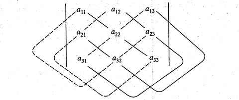
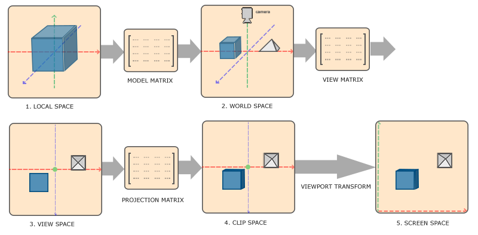
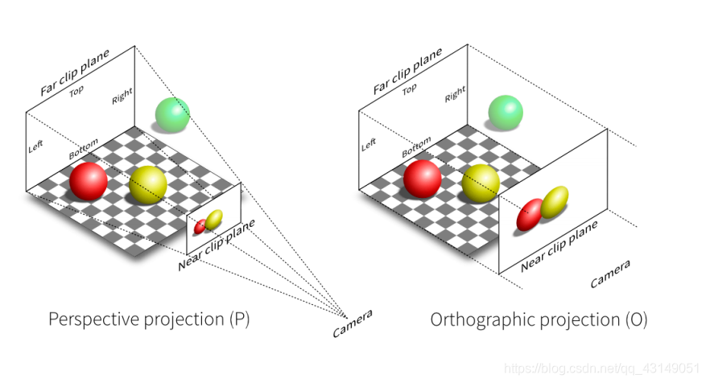
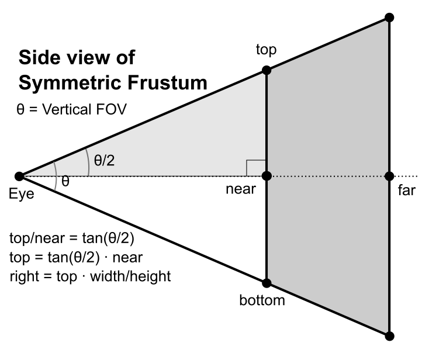
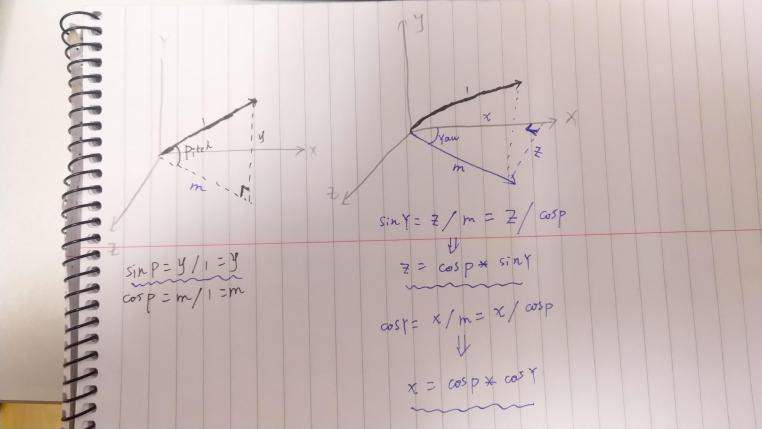

# 矩阵的核心工具与理论基础

## 行列式

### 行列式的定义

**核心概念**：行列式 (Determinant) 是一个与**方阵** (Square Matrix) 相关联的**标量值**。它包含了关于这个方阵所代表的线性变换的重要信息。

- **二阶行列式**

  **定义**：对于一个2x2的行列式：
  $$
  D=\left|\begin{array}{cc}
  a_{11} & a_{12} \\
  a_{21} & a_{22} \\
  \end{array}\right|
  $$
  

  它的行列式 det(A) 或 |A| 定义为**主对角线**元素之积减去**副对角线**元素之积。

  **公式**：
  det(A) = a₁₁ * a₂₂ - a₁₂ * a₂₁

- **三阶行列式**

  **定义**：对于一个3x3的行列式，其行列式的计算稍微复杂。
  $$
  D=\left|\begin{array}{ccc}
  a_{11} & a_{12} & a_{13} \\
  a_{21} & a_{22} & a_{23} \\
  a_{31} & a_{32} & a_{33}
  \end{array}\right|
  $$
  它的行列式 det(A) 或 |A| 参考以下方法：

  

  公式：

  det(A) = (实线上三元素乘积之和) - (虚线上三元素乘积之和)

- **N阶行列式**

  **定义**：一个 N 阶方阵 A 的行列式是其所有**不同行、不同列**的 n 个元素乘积的代数和。
  $$
  D=\left|\begin{array}{cccc}
  a_{11} & a_{12} & \cdots & a_{1 n} \\
  a_{21} & a_{22} & \cdots & a_{2 n} \\
  \vdots & \vdots & & \vdots \\
  a_{n1} & a_{n2} & \cdots & a_{nn}
  \end{array}\right|
  $$
  它的行列式 det(A) 或 |A|为：
  $$
  \det(A) = \sum (-1)^{t} a_{1p_1} a_{2p_2} \cdots a_{np_n}
  $$
  其中 $t$ 是列标排列 $p_1p_2\cdots p_n$ 的逆序数。

  让我们分解这个复杂的公式：

  1. $a_{1p_1}$，$a_{2p_2}$，...，$a_{np_n}$
     - 这是一个由 n 个元素组成的乘积项。
     - 规则是：从方阵的每一行都只取一个元素，并且这些元素所在的列也必须各不相同。
     - 行标 1, 2, ..., n 是固定的，而列标 p₁, p₂, ..., pₙ 是 1, 2, ..., n 的一个**排列 (Permutation)**。例如，对于三阶行列式，123, 132, 213 等都是可能的排列。
  
  2. $\sum$ 表示对所有 n! 种可能的排列 p₁p₂...pₙ 进行求和。
  
  3. $(-1)^{t}$ 这是每一项的正负号，由 t 决定。t 是排列 p₁p₂...pₙ 的**逆序数 (Inversion Number)**。
  
     **逆序数**：在一个排列中，如果一个较大的数字排在了一个较小的数字前面，就构成一个“逆序”。一个排列的逆序数是其所有逆序的总数。排列 123 的逆序数 t=0 (偶排列)，符号为 (-1)⁰ = +1。排列 132 的逆序数 t=1 (对于3而言，它后面有个2比3小)，(奇排列)，符号为 (-1)¹ = -1。排列 321 的逆序数 t=3（对于3而言，它后面有两个比3小的，对于2而言，它后面有一个比2小的，对于1而言，它后面没有比它小的），符号为 $(-1)^{3} = -1$ 

### 行列式的性质

1. **转置不变**: $|A^T| = |A|$ 

2. **交换两行（列），行列式变号** 

   - **推论**: 如果一个行列式有两行（列）完全相同，则该行列式的值为 **0**。 (因为交换这两行，行列式变号，但矩阵本身不变，所以 D = -D，得出 D = 0）。

3. **某行（列）的公因子可以提出**:  
   $$
   \begin{vmatrix} \vdots \\ 
   k \cdot a_{i1} & k \cdot a_{i2} & \cdots & k \cdot a_{in} \\ 
   \vdots \end{vmatrix} 
   = 
   k \cdot \begin{vmatrix} \vdots \\ 
   a_{i1} & a_{i2} & \cdots & a_{in} \\ 
   \vdots \end{vmatrix}
   $$

4. **行（列）的可加性**: 
   $$
   \begin{vmatrix} 
   \vdots \\ 
   a_{i1}+b_{i1} & a_{i2}+b_{i2} & \cdots & a_{in}+b_{in} \\ 
   \vdots \end{vmatrix} 
   = 
   \begin{vmatrix} \vdots \\ 
   a_{i1} & a_{i2} & \cdots & a_{in} \\ 
   \vdots \end{vmatrix} + \begin{vmatrix} \vdots \\ 
   b_{i1} & b_{i2} & \cdots & b_{in} \\ 
   \vdots \end{vmatrix}
   $$

5. **最重要的性质：行（列）的倍加不变**: 将第 $j$ 行的 $k$ 倍加到第 $i$ 行，行列式值不变。

   - |... rᵢ ... rⱼ ...| = |... rᵢ ... rⱼ + k*rᵢ ...|
   - **为何重要**: 这是我们手动计算高阶行列式的**核心工具**。我们可以利用这个性质，在某一行（列）中制造出大量的**零**，然后再进行计算。

### 按行（列）展开

1. 余子式 (Minor)
   - **定义**：在一个n阶行列式中，划去元素 aᵢⱼ 所在的第 i 行和第 j 列后，剩下的元素按原顺序组成的 n-1 阶行列式，称为元素 aᵢⱼ 的**余子式**，记作 Mᵢⱼ。
2. 代数余子式 (Cofactor)
   - **定义**：元素 aᵢⱼ 的**代数余子式** Cᵢⱼ 定义为带符号的余子式。
   - **公式**：Cᵢⱼ = (-1)ⁱ⁺ʲ * Mᵢⱼ

#### **拉普拉斯展开定理**

**定理**：一个行列式的值，等于其**任意一行（或一列）** 的所有元素，乘以它们各自对应的**代数余子式**，然后求和的结果。

- 按第 $i$ 行展开:
  $$
  \det(A) = \sum_{j=1}^{n} a_{ij}C_{ij} = a_{i1}C_{i1} + a_{i2}C_{i2} + \cdots + a_{in}C_{in}
  $$

- 按第 $j$ 列展开:
  $$
  \det(A) = \sum_{i=1}^{n} a_{ij}C_{ij} = a_{1j}C_{1j} + a_{2j}C_{2j} + \cdots + a_{nj}C_{nj}
  $$

应用示例：

计算 $A = \begin{vmatrix} 1 & 2 & 3 \\ 4 & 5 & 6 \\ 0 & 8 & 9 \end{vmatrix}$，按第一列展开：
$$
\det(A) = a_{11}C_{11} + a_{21}C_{21} + a_{31}C_{31}
$$

- $C_{11} = (-1)^{1+1} \begin{vmatrix} 5 & 6 \\ 8 & 9 \end{vmatrix} = 1 \cdot (45 - 48) = -3$
- $C_{21} = (-1)^{2+1} \begin{vmatrix} 2 & 3 \\ 8 & 9 \end{vmatrix} = -1 \cdot (18 - 24) = 6$
- $a_{31} = 0$, 该项为 0。

$$
\det(A) = 1 \cdot (-3) + 4 \cdot (6) + 0 \cdot C_{31} = -3 + 24 = 21
$$

**核心思路**：
通过**性质5**（倍加不变）在某一行或某一列制造出尽可能多的**0**，然后**按该行/列展开**，从而大大减少计算量。

## 矩阵及其运算

### 矩阵的定义

一个 $m \times n$ **矩阵**是一个由 $m$ 行 (rows) 和 $n$ 列 (columns) 排列成的矩形数阵。

1. **一般形式**

   我们通常用大写字母（如 $A, B$）来表示矩阵。一个 $m \times n$ 矩阵 $A$ 的一般形式如下：
   $$
   A =
   \begin{bmatrix}
    a_{11} & a_{12} & \cdots & a_{1n} \\
    a_{21} & a_{22} & \cdots & a_{2n} \\
    \vdots & \vdots & \ddots & \vdots \\
    a_{m1} & a_{m2} & \cdots & a_{mn}
   \end{bmatrix}
   $$
   其中，$a_{ij}$ 表示位于第 $i$ 行、第 $j$ 列的元素。

   我们也可以将其简记为：
   $$
   A = (a_{ij})_{m \times n} \quad \text{或} \quad A = (a_{ij})
   $$

2. **关键术语**

   **阶 (Order/Dimension)**: 矩阵的行数和列数（即 $m \times n$）称为矩阵的阶或维度。

   **方阵 (Square Matrix)**: 当行数与列数相等时（即 $m=n$），该矩阵称为 $n$ 阶方阵。方阵从左上到右下的元素 $a_{11}, a_{22}, \dots, a_{nn}$ 构成了它的**主对角线 (Main Diagonal)**。

   **零矩阵 (Zero Matrix)**: 所有元素均为0的矩阵，记作 $O$。

   **单位矩阵 (Identity Matrix)**: 一个主对角线元素为1，其余元素为0的**方阵**，记作 $I$ 或 $I_n$。它的元素可以用**克罗内克 delta (Kronecker delta)**符号 $\delta_{ij}$ 表示：
   $$
   a_{ij} = \delta_{ij} =
       \begin{cases}
       1 & \text{if } i=j \\
       0 & \text{if } i \neq j
       \end{cases}
   $$

3. **几种特殊的矩阵**

   -  **行向量与列向量 (Row/Column Vector)**：
     - 只有一行的矩阵（$1 \times n$）称为行向量。
     - 只有一列的矩阵（$m \times 1$）称为列向量。
     - 在OpenGL和线性代数中，向量通常被视为列向量。
   - **转置矩阵 (Transpose Matrix)**：
     - 将矩阵 $A$ 的行与列互换，得到的新矩阵称为 $A$ 的转置矩阵，记作 $A^T$。
     - 如果 $A = (a_{ij})$，那么 $A^T = (a_{ji})$。
   - **对称矩阵 (Symmetric Matrix)**：
     - 如果一个**方阵** $A$ 满足 $A^T = A$，即 $a_{ij} = a_{ji}$，则称其为对称矩阵。

### 矩阵的加法

**核心规则**：两个矩阵**必须具有相同的阶 (Dimension)** 才能相加。

1. 定义

   若有两个 $m \times n$ 阶的矩阵 $A = (a_{ij})$ 和 $B = (b_{ij})$，它们的和 $C = A+B$ 是一个 $m \times n$ 阶的矩阵，其中每个元素是 $A$ 和 $B$ 对应位置元素的和。

2. 公式
   $$
   C = (c_{ij}) = (a_{ij} + b_{ij})
   $$
   用矩阵的展开形式表示为：
   $$
   A+B =
   \begin{bmatrix}
    a_{11} & \cdots & a_{1n} \\
    \vdots & \ddots & \vdots \\
    a_{m1} & \cdots & a_{mn}
   \end{bmatrix}
   +
   \begin{bmatrix}
    b_{11} & \cdots & b_{1n} \\
    \vdots & \ddots & \vdots \\
    b_{m1} & \cdots & b_{mn}
   \end{bmatrix}
   =
   \begin{bmatrix}
    a_{11}+b_{11} & \cdots & a_{1n}+b_{1n} \\
    \vdots & \ddots & \vdots \\
    a_{m1}+b_{m1} & \cdots & a_{mn}+b_{mn}
   \end{bmatrix}
   $$

3. 矩阵加法的性质

   - **交换律 (Commutative Law)**：`A+B = B+A`
   - **结合律 (Associative Law)**：`(A+B)+C = A+(B+C)`
   - **零元 (Identity Element)**：`A+O = A`其中 `O` 是与 `A` 同阶的零矩阵。
   - **逆元 (Inverse Element)**：`A+(-A) = O`。其中 `−A` 是将 `A` 的每个元素取相反数得到的矩阵，称为 `A` 的**负矩阵**。

   **矩阵减法**是基于加法和负矩阵来定义的：$A-B = A+(-B)$。计算方法就是将对应元素相减。

### 标量乘法

**核心概念**：用一个数（标量）乘以一个矩阵。

1. 定义 

   一个标量 $k$ 与一个 $m \times n$ 阶矩阵 $A = (a_{ij})$ 的乘积，记作 $kA$ 或 $Ak$，是一个 $m \times n$ 阶的矩阵，它的每个元素都是 $A$ 对应元素与标量 $k$ 的乘积。

2. 公式
   $$
   kA = k(a_{ij}) = (k \cdot a_{ij})
   $$

3. 标量乘法的性质

   设 $k$ 和 $l$ 为任意标量，$A$ 和 $B$ 为同阶矩阵：

   - **结合律 (Associative Law)**：$(kl)A = k(lA)$

   - **分配律 (Distributive Laws)**：

     标量对矩阵加法的分配律：$k(A+B) = kA+kB$

     矩阵对标量加法的分配律：$(k+l)A = kA+lA$

   - **单位元 (Identity Element)**：$1A = A$

### 矩阵乘法

它与矩阵加法和标量乘法完全不同，不是简单地将对应元素相乘。

1. 核心规则：阶的匹配

   两个矩阵 $A$ 和 $B$ 能够相乘（得到 $AB$）的**前提条件**是： 

   **第一个矩阵 $A$ 的列数必须等于第二个矩阵 $B$ 的行数。** 

   - 如果 $A$ 是一个 $m \times n$ 阶矩阵。
   - 如果 $B$ 是一个 $n \times p$ 阶矩阵。
   - 那么它们的乘积 $C = AB$ 将是一个 $m \times p$ 阶矩阵。

2. 定义与计算方法

   乘积矩阵 $C = AB$ 中位于第 $i$ 行、第 $j$ 列的元素 $c_{ij}$，是由 $A$ 的**第 $i$ 行**与 $B$ 的**第 $j$ 列**对应元素相乘后求和得到的。

   **公式**：
   $$
   c_{ij} = \sum_{k=1}^{n} a_{ik}b_{kj} = a_{i1}b_{1j} + a_{i2}b_{2j} + \cdots + a_{in}b_{nj}
   $$
   这个过程本质上是**行向量**与**列向量**的**点积 (Dot Product)**。

3. 矩阵乘法的性质

   - **结合律 (Associative Law)**：

     $(AB)C = A(BC)$

     *这个性质至关重要，它允许我们将多个变换矩阵预先乘在一起（例如，得到MVP矩阵）。*

   - **分配律 (Distributive Laws)**：

     $A(B+C) = AB+AC$

     $(A+B)C = AC+BC$

   - **与单位矩阵相乘**：

     $AI = IA = A$

     *单位矩阵 $I$ 在矩阵乘法中的作用类似于数字 $1$。*

   - **不满足交换律**：

     $AB \neq BA \quad (\text{在绝大多数情况下})$

     *这是矩阵乘法**最关键**的特性。矩阵相乘的顺序会直接影响结果。在图形学中，先旋转再平移，与先平移再旋转，得到的结果是完全不同的。*

# 矩阵的逆与变换的应用

## 逆矩阵

### 逆矩阵的定义

**核心思想**：在线性代数中，逆矩阵扮演的角色类似于普通算术中的**倒数**。

在标量运算中，数字 $a$ 的倒数是 $a^{-1}$（即 $\frac{1}{a}$），因为它们满足 $a \cdot a^{-1} = 1$。这里的 $1$ 是乘法运算的“单位元”。 

矩阵运算也有一个单位元——**单位矩阵 $I$**。逆矩阵就是基于这个概念来定义的。

1. 定义

   对于一个 $n$ 阶**方阵** $A$，如果存在另一个 $n$ 阶方阵 $B$，使得它们的乘积为单位矩阵 $I$，即：
   $$
   AB = BA = I
   $$
   那么，我们称矩阵 $A$ 是**可逆的 (Invertible)** 或**非奇异的 (Non-singular)**，并称矩阵 $B$ 是 $A$ 的**逆矩阵**。

   $A$ 的逆矩阵通常记作 $A^{-1}$。

2. 公式
   $$
   A A^{-1} = A^{-1} A = I
   $$

3. 关键条件

   1. **必须是方阵**：只有方阵才可能存在逆矩阵。 
   2. **并非所有方阵都可逆**：如果一个方阵不存在逆矩阵，我们称之为**奇异的 (Singular)** 或**不可逆的 (Non-invertible)**。 
   3. **与行列式的关系**：一个方阵 $A$ 可逆的**充分必要条件**是其行列式不为零：$\det(A) \neq 0$

4. 在图形学中的意义

   逆矩阵在图形学中至关重要，因为它代表了**变换的“撤销”或“反向”**。

   - 如果矩阵 $A$ 代表将一个物体**旋转** $30^{\circ}$。
   - 那么其逆矩阵 $A^{-1}$ 就代表将该物体**反向旋转** $30^{\circ}$ (即旋转 $-30^{\circ}$)，使其回到原始状态。

   一个非常典型的应用是**视图矩阵 (View Matrix)** 的计算。我们通常会定义摄像机在世界中的位置和朝向（这是一个模型变换），然后通过对此变换矩阵**求逆**，得到将整个世界移动到摄像机眼前的视图矩阵。

### 逆矩阵的性质

1. 唯一性 (Uniqueness)

   如果一个矩阵 $A$ 是可逆的，那么它的逆矩阵 $A^{-1}$ 是**唯一**的。

2. “逆”的逆 (Inverse of an Inverse)

   一个可逆矩阵的逆矩阵也是可逆的，并且其逆矩阵等于原矩阵：
   $$
   (A^{-1})^{-1} = A
   $$
   这很好理解：撤销一个“撤销”操作，就等于回到了原始操作。

3. 乘积的逆 (Inverse of a Product)

   两个可逆矩阵的乘积 $AB$ 也是可逆的，其逆矩阵等于**反向顺序**下各自逆矩阵的乘积：
   $$
   (AB)^{-1} = B^{-1}A^{-1}
   $$
   这个性质可以推广到多个矩阵的乘积：
   $$
   (A_1A_2 \cdots A_k)^{-1} = A_k^{-1} \cdots A_2^{-1}A_1^{-1}
   $$

4. 转置的逆 (Inverse of a Transpose)

   一个可逆矩阵的转置 $A^T$ 也是可逆的，其逆等于逆矩阵的转置。
   $$
   (A^T)^{-1} = (A^{-1})^T
   $$
   简单来说，**求逆和转置**这两个操作的顺序可以交换。

5. 标量乘法的逆 (Inverse of a Scalar Product)

   一个非零标量 $k$ 与一个可逆矩阵 $A$ 的乘积 $kA$ 也是可逆的。
   $$
   (kA)^{-1} = \frac{1}{k} A^{-1}
   $$

6. 行列式与逆

   一个可逆矩阵的行列式与它的逆矩阵的行列式互为倒数。
   $$
   \det(A^{-1}) = \frac{1}{\det(A)}
   $$
   这个性质源于 $\det(AB) = \det(A)\det(B)$ 和 $A A^{-1} = I$。
   $$
   \det(A A^{-1}) = \det(I) \implies \det(A)\det(A^{-1}) = 1
   $$

### 逆矩阵的求法

#### **伴随矩阵求逆**

这个方法在理论上非常重要，但在计算机数值计算中，对于高阶矩阵而言效率不高。不过对于二阶、三阶矩阵的手动求解，它非常直观。

1. 伴随矩阵的定义

   要理解伴随矩阵，我们首先需要回顾**代数余子式 (Cofactor)** 的概念。对于一个 $n \times n$ 矩阵 $A = (a_{ij})$，其位于 $(i, j)$ 位置的元素的代数余子式为 $C_{ij} = (-1)^{i+j}M_{ij}$。

   **定义**：

   矩阵 $A$ 的**伴随矩阵**，记作 $A^*$ 或 $\text{adj}(A)$，是由 $A$ 的所有元素的**代数余子式**构成的矩阵，并且**进行了转置**。

   1. **第一步：计算所有代数余子式**

      构建一个矩阵，其 $(i, j)$ 位置的元素是原矩阵 $A$ 中 $a_{ij}$ 的代au数余子式 $C_{ij}$。这个矩阵被称为**余子矩阵**或**代数余子式矩阵**。
      $$
      C =
      \begin{bmatrix}
      C_{11} & C_{12} & \cdots & C_{1n} \\
      C_{21} & C_{22} & \cdots & C_{2n} \\
      \vdots & \vdots & \ddots & \vdots \\
      C_{n1} & C_{n2} & \cdots & C_{nn}
      \end{bmatrix}
      $$

   2. **第二步：转置余子矩阵**
      $$
      A^* = C^T =
      \begin{bmatrix}
      C_{11} & C_{21} & \cdots & C_{n1} \\
      C_{12} & C_{22} & \cdots & C_{n2} \\
      \vdots & \vdots & \ddots & \vdots \\
      C_{1n} & C_{2n} & \cdots & C_{nn}
      \end{bmatrix}
      $$

   ---

2. **核心定理**

   伴随矩阵最重要的性质是它与原矩阵 $A$ 的乘积关系：
   $$
   A A^* = A^* A = \det(A) I
   $$
   其中 $I$ 是单位矩阵。这个定理是推导逆矩阵公式的基础。

   ---

3. 利用伴随矩阵求逆

   **公式**： 

   如果一个方阵 $A$ 是可逆的（即 $\det(A) \neq 0$），那么它的逆矩阵 $A^{-1}$ 可以通过以下公式计算：
   $$
   A^{-1} = \frac{1}{\det(A)} A^*
   $$
   **求解步骤**：

   1.  计算矩阵 $A$ 的行列式 $\det(A)$。如果 $\det(A)=0$，则矩阵不可逆，停止计算。
   2.  计算 $A$ 中每一个元素的代数余子式 $C_{ij}$。
   3.  将所有代数余子式组成伴随矩阵 $A^*$（**不要忘记转置**）。
   4.  将伴随矩阵 $A^*$ 乘以 $\frac{1}{\det(A)}$，得到逆矩阵 $A^{-1}$。

   ---

4. 特别的，对于二阶矩阵$A = \begin{bmatrix} a & b \\ c & d \end{bmatrix}$，其逆矩阵为：
   $$
   A^{-1} = \frac{1}{ad-bc}
   \begin{bmatrix}
   d & -b \\
   -c & a
   \end{bmatrix}
   $$
   **主对角线元素互换，副对角线元素变号，再除以行列式。**

#### 初等行变换求逆

##### 三种初等行变换

这些变换是矩阵理论的基石，也是求解线性方程组（高斯消元法）和求逆矩阵（高斯-若尔当消元法）的核心工具。它们之所以强大，是因为**对矩阵施加这些变换后，不会改变其所代表的线性方程组的解**。

- 类型一：交换

  - **定义**：交换矩阵的两行。

  - **符号**：$R_i \leftrightarrow R_j$

    表示交换第 $i$ 行与第 $j$ 行。

  - **示例**：
    $$
    \begin{bmatrix}
    1 & 2 & 3 \\
    4 & 5 & 6 \\
    7 & 8 & 9
    \end{bmatrix}
    \xrightarrow{R_1 \leftrightarrow R_3}
    \begin{bmatrix}
    7 & 8 & 9 \\
    4 & 5 & 6 \\
    1 & 2 & 3
    \end{bmatrix}
    $$

  ---

- 类型二：数乘

  - **定义**：将矩阵的某一行乘以一个**非零**标量 $k$。

    （$k$ 必须非零，以保证这个操作是可逆的）。

  - **符号**：$kR_i \to R_i$

    表示将第 $i$ 行的所有元素乘以 $k$，并用结果替换原来的第 $i$ 行。

  - **示例**：
    $$
    \begin{bmatrix}
    1 & 2 & 3 \\
    4 & 5 & 6 \\
    7 & 8 & 9
    \end{bmatrix}
    \xrightarrow{2R_2 \to R_2}
    \begin{bmatrix}
    1 & 2 & 3 \\
    8 & 10 & 12 \\
    7 & 8 & 9
    \end{bmatrix}
    $$

  ---

- 类型三：倍加

  - **定义**：将矩阵的某一行的 $k$ 倍加到**另一行**上。这是最常用、最强大的操作。

  - **符号**：$R_i + kR_j \to R_i$

    表示将第 $j$ 行的 $k$ 倍加到第 $i$ 行上，并用结果替换原来的第 $i$ 行。**注意，第 $j$ 行本身保持不变**。

  - **示例**：(这个操作是制造“0”的关键)
    $$
    \begin{bmatrix}
    1 & 2 & 3 \\
    4 & 5 & 6 \\
    7 & 8 & 9
    \end{bmatrix}
    \xrightarrow{R_2 - 4R_1 \to R_2}
    \begin{bmatrix}
    1 & 2 & 3 \\
    4 - 4 \times 1 & 5 - 4 \times 2 & 6 - 4 \times 3 \\
    7 & 8 & 9
    \end{bmatrix}
    =
    \begin{bmatrix}
    1 & 2 & 3 \\
    0 & -3 & -6 \\
    7 & 8 & 9
    \end{bmatrix}
    $$

  ---

- 核心特性与意义

  - **可逆性 (Reversibility)**: 每一种初等行变换都有其对应的逆操作。

    - $R_i \leftrightarrow R_j$ 的逆操作是其本身。

    - $kR_i \to R_i$ 的逆操作是 $\frac{1}{k}R_i \to R_i$。

    - $R_i + kR_j \to R_i$ 的逆操作是 $R_i - kR_j \to R_i$。

    - 这种可逆性保证了在变换过程中不会丢失任何信息。

  - **行等价 (Row Equivalence)**: 如果矩阵 $B$ 可以通过对矩阵 $A$ 进行一系列初等行变换得到，那么我们称 $A$ 和 $B$ 是**行等价**的，记作 $A \sim B$。

  - 对矩阵 $A$ 施加的一系列初等行变换，可以等效于用一个可逆矩阵 $P$ 左乘 $A$。

  ---

- 当然有初等行变换就有初等列变换，两者在公式上一样，只不过是把行换成了列

  列变换与行变换的关系：

  - **对偶关系**: 任何一个对行成立的性质，通过转置操作，都可以转化为对列成立的性质。

  - **求解线性方程组**: 在求解线性方程组 $A\mathbf{x} = \mathbf{b}$ 时，我们**只能使用初等行变换**。因为行变换对应的是对方程进行同解变形，而列变换会改变变量之间的关系，从而改变方程组的解。
  - **求逆矩阵**: 在使用增广矩阵 $[A|I]$ 的方法求逆时，通常也只使用行变换。因为我们的目标是将左边的 $A$ 变为 $I$，这个过程与解方程组非常类似。
  - **计算行列式**: 行变换和列变换都可以用来简化行列式的计算，因为 $|A^T| = |A|$。
  - **求矩阵的秩**: 行变换和列变换都不会改变矩阵的秩，因此可以混合使用来将矩阵化为最简形式（标准型）。

  尽管存在初等列变换，但在解决线性代数中最常见的两个问题——**解线性方程组**和**求逆矩阵**时，我们几乎总是优先且**只使用初等行变换**。这是因为行变换能直接对应到方程组的同解变形上，逻辑更清晰。

##### 增广矩阵

举个例子，对于一个简单的线性方程组：
$$
\begin{cases}
 1x + 2y = 5 \\
 3x + 4y = 11
\end{cases}
$$
在解这个方程组时（比如用加减消元法），我们实际上只对数字（系数和常数）进行操作，变量 $x$ 和 $y$ 只是“占位符”。

- **系数矩阵 $A$**：
  $$
  A = \begin{bmatrix} 1 & 2 \\ 3 & 4 \end{bmatrix}
  $$

- **常数项向量 $\mathbf{b}$**：
  $$
  \mathbf{b} = \begin{bmatrix} 5 \\ 11 \end{bmatrix}
  $$

- **增广矩阵 $[A|\mathbf{b}]$**：
  $$
  [A|\mathbf{b}] = \left[
  \begin{array}{cc|c}
  1 & 2 & 5 \\
  3 & 4 & 11
  \end{array}
  \right]
  $$

- 

每一**行**都代表一个**方程**。每一**列**（竖线左侧）代表一个**变量**的系数。竖线代表了等号。

增广矩阵的**唯一目的**，就是把解方程过程中的所有**信息**以一种**紧凑、整洁**的方式记录下来，省去了反复书写变量 $x, y$ 和等号的麻烦。

对增广矩阵进行**初等行变换**，完全等价于对原方程组进行**不改变其解**的同解变形（如两边同乘、两式相加减）。

##### **高斯-若尔当消元法**

**核心思想**：对矩阵 $A$ 施加的一系列初等行变换，可以等效于用一个可逆矩阵 $P$ 左乘 $A$。我们的目标是找到一个 $P$ 使得 $PA = I$。根据逆矩阵的定义，这个 $P$ 就是 $A$ 的逆矩阵 $A^{-1}$。

如果我们同时对单位矩阵 $I$ 施加完全相同的行变换，那么 $I$ 就会变成 $PI = P = A^{-1}$。

这个方法巧妙地将这两个过程合并在一起。 

- 算法步骤

  1. **构造增广矩阵**

     创建一个新的、更宽的矩阵，将原矩阵 $A$ 放在左边，同阶的单位矩阵 $I$ 放在右边。这个新矩阵记为 $[A | I]$。
     $$
     [A | I] =
     \left[
     \begin{array}{ccc|ccc}
     a_{11} & \cdots & a_{1n} & 1 & \cdots & 0 \\
     \vdots & \ddots & \vdots & \vdots & \ddots & \vdots \\
     a_{n1} & \cdots & a_{nn} & 0 & \cdots & 1
     \end{array}
     \right]
     $$

  2. **施加初等行变换**

     对整个增广矩阵 $[A | I]$ 进行一系列的初等行变换。

     - **目标**：将左边的部分（原来的 $A$）变换成单位矩阵 $I$。

     - **系统化流程**：

       - **从左到右**，逐列处理。

       - 对于第 $j$ 列：

         **a. 创建主元 (Pivot)**: 利用行交换或行数乘，使得 $(j, j)$ 位置的元素变为 $1$。

         **b. 消元 (Eliminate)**: 利用行倍加，将该列中**除了主元以外**的所有其他元素都变为 $0$。

       - 重复这个过程，直到左边的矩阵变为单位矩阵 $I$。

  3. 得到结果

     当左边的部分成功变为单位矩阵 $I$ 时，右边的部分就已经自动地变成了 $A$ 的逆矩阵 $A^{-1}$。

     最终形式为 $[I | A^{-1}]$。

  4. **失败情况**

     如果在变换过程中，左边部分出现了**全为零的一行**，那么说明原矩阵 $A$ 的行列式为0，它是**奇异矩阵 (Singular)**，不存在逆矩阵。此时应停止计算。

- 示例 (求一个 $3 \times 3$ 矩阵的逆)

  求矩阵 $A$ 的逆：
  $$
  A =
  \begin{bmatrix}
   1 & 2 & 3 \\
   2 & 5 & 3 \\
   1 & 0 & 8
  \end{bmatrix}
  $$

  1. **构造增广矩阵 $[A|I]$**:
     $$
     \left[
     \begin{array}{ccc|ccc}
     1 & 2 & 3 & 1 & 0 & 0 \\
     2 & 5 & 3 & 0 & 1 & 0 \\
     1 & 0 & 8 & 0 & 0 & 1
     \end{array}
     \right]
     $$

  2. **变换过程**:

     - **处理第一列 (目标:ᵀ)**:

       $a_{11}$ 已经是 $1$。

       用第一行去消掉第二、三行的第一个元素。
       $$
       \xrightarrow{R_2 - 2R_1 \to R_2} \\
       \xrightarrow{R_3 - R_1 \to R_3}
       \left[
       \begin{array}{ccc|ccc}
       1 & 2 & 3 & 1 & 0 & 0 \\
       0 & 1 & -3 & -2 & 1 & 0 \\
       0 & -2 & 5 & -1 & 0 & 1
       \end{array}
       \right]
       $$

     - **处理第二列 (目标:ᵀ)**:

       $a_{22}$ 已经是 $1$。

       用第二行去消掉第一、三行的第二个元素。
       $$
       \xrightarrow{R_1 - 2R_2 \to R_1} \\
       \xrightarrow{R_3 + 2R_2 \to R_3}
       \left[
       \begin{array}{ccc|ccc}
       1 & 0 & 9 & 5 & -2 & 0 \\
       0 & 1 & -3 & -2 & 1 & 0 \\
       0 & 0 & -1 & -5 & 2 & 1
       \end{array}
       \right]
       $$

     - **处理第三列 (目标:ᵀ)**:

       将 $a_{33}$ 变为 $1$。
       $$
       \xrightarrow{-1R_3 \to R_3}
       \left[
       \begin{array}{ccc|ccc}
       1 & 0 & 9 & 5 & -2 & 0 \\
       0 & 1 & -3 & -2 & 1 & 0 \\
       0 & 0 & 1 & 5 & -2 & -1
       \end{array}
       \right]
       $$
       用第三行去消掉第一、二行的第三个元素。
       $$
       \xrightarrow{R_1 - 9R_3 \to R_1} \\
       \xrightarrow{R_2 + 3R_3 \to R_2}
       \left[
       \begin{array}{ccc|ccc}
       1 & 0 & 0 & -40 & 16 & 9 \\
       0 & 1 & 0 & 13 & -5 & -3 \\
       0 & 0 & 1 & 5 & -2 & -1
       \end{array}
       \right]
       $$

     - 结果为：
       $$
       A^{-1} =
       \begin{bmatrix}
       -40 & 16 & 9 \\
       13 & -5 & -3 \\
       5 & -2 & -1
       \end{bmatrix}
       $$

# 向量与空间的几何意义

## 向量

### 向量的定义与几何意义

忘记矩阵，忘记复杂的公式，先把向量看作是3D世界中的一个**箭头**。

1. 向量的定义

   在线性代数和图形学中，向量是一个同时具有**大小 (Magnitude)** 和**方向 (Direction)** 的量。

2. 向量的几何意义

   想象一个三维坐标系，一个向量可以被可视化为一个从原点 $(0,0,0)$ 指向空间中某一点 $(x,y,z)$ 的箭头。 

   **方向 (Direction)**: 就是箭头所指的方向。

   **大小/模 (Magnitude/Length)**: 就是箭头的长度。

   

   所有**方向相同、长度相等**的箭头都代表**同一个向量**。它们只是这个向量在空间中不同位置的“副本”。

3. 向量的数学表示

   我们通常用一个有序的数字列表来表示一个向量，这个列表的每个数字代表了向量在对应坐标轴上的分量。

   **二维向量**: $\mathbf{v} = \begin{bmatrix} x \\ y \end{bmatrix}$ 或 $\mathbf{v} = (x, y)$

   **三维向量**: $\mathbf{v} = \begin{bmatrix} x \\ y \\ z \end{bmatrix}$ 或 $\mathbf{v} = (x, y, z)$

   **n维向量**: $\mathbf{v} = (v_1, v_2, \dots, v_n)$

   在图形学中，我们最常用的是三维和四维向量。**默认情况下，向量通常被视为列矩阵（即列向量）**。

4. 向量的模

   向量的模，记作 $\|\mathbf{v}\|$，就是它的长度。根据勾股定理，我们可以通过计算其所有分量的平方和再开方来得到。

   - 对于二维向量 $\mathbf{v} = (x, y)$:
     $$
     \|\mathbf{v}\| = \sqrt{x^2 + y^2}
     $$

   - 对于三维向量 $\mathbf{v} = (x, y, z)$:
     $$
     \|\mathbf{v}\| = \sqrt{x^2 + y^2 + z^2}
     $$

   - n维向量同理

5. 两种特殊的向量

   - **零向量 (Zero Vector)**: 所有分量都为0的向量，记作 $\mathbf{0}$。它的大小为0，且**没有定义方向**。
     $$
     \mathbf{0} = \begin{bmatrix} 0 \\ 0 \\ \vdots \\ 0 \end{bmatrix}
     $$

   - **单位向量 (Unit Vector)**: 模为1的向量。单位向量非常重要，因为它们只用来表示**纯粹的方向**。

### 向量的基础运算

1. 向量加法

   给定两个n维向量 $\mathbf{u}$ 和 $\mathbf{v}$，它们的和为：
   $$
   \mathbf{u} =
   \begin{bmatrix}
    u_1 \\
    u_2 \\
    \vdots \\
    u_n
   \end{bmatrix}
   , \quad
   \mathbf{v} =
   \begin{bmatrix}
    v_1 \\
    v_2 \\
    \vdots \\
    v_n
   \end{bmatrix}
   \xrightarrow{}
   \mathbf{u} + \mathbf{v} =
   \begin{bmatrix}
    u_1 + v_1 \\
    u_2 + v_2 \\
    \vdots \\
    u_n + v_n
   \end{bmatrix}
   $$
   几何意义：

   

   ---

2. 向量减法
   $$
   \mathbf{u} - \mathbf{v} =
   \begin{bmatrix}
    u_1 - v_1 \\
    u_2 - v_2 \\
    \vdots \\
    u_n - v_n
   \end{bmatrix}
   $$
   几何意义：

   向量 $\mathbf{u} - \mathbf{v}$ 是从向量 $\mathbf{v}$ 的“头部”指向向量 $\mathbf{u}$ 的“头部”的向量。这在计算两个点之间的方向向量时非常有用。例如，要得到从点 $P_v$ 指向点 $P_u$ 的向量，就需要用 $P_u$ 的位置向量减去 $P_v$ 的位置向量。

   

3. 标量乘法
   $$
   k\mathbf{v} = k
   \begin{bmatrix}
    v_1 \\
    v_2 \\
    \vdots \\
    v_n
   \end{bmatrix}
   =
   \begin{bmatrix}
    k v_1 \\
    k v_2 \\
    \vdots \\
    k v_n
   \end{bmatrix}
   $$
   几何意义：

   标量乘法会**缩放 (Scale)** 向量的长度（模）。

   - 如果 $|k| > 1$，向量被**拉长**。
   - 如果 $0 < |k| < 1$，向量被**缩短**。
   - 如果 $k$ 是**负数**，向量的方向会**反转** $180^{\circ}$。

### 向量的进阶运算

#### 单位向量

1. 定义

   **单位向量**是一个长度（模）恰好为 **1** 的向量。

   单位向量非常重要，因为它们提供了一种表示**纯粹方向**而忽略其大小的方式。在光照计算、方向表示等很多图形学应用中，我们只关心方向，因此需要使用单位向量。

2. 标准化

   将一个任意的**非零**向量 $\mathbf{v}$ 转换为一个与其**方向相同**的单位向量的过程，称为**标准化**。

   **方法**：

   将向量 $\mathbf{v}$ 除以它自身的模 $\|\mathbf{v}\|$。

   **公式**：

   这个标准化后的单位向量通常用一个“帽子”符号表示，读作 "v-hat"。
   $$
   \hat{\mathbf{v}} = \frac{\mathbf{v}}{\|\mathbf{v}\|} = \frac{1}{\|\mathbf{v}\|} \mathbf{v}
   $$
   这实际上是一个**标量乘法**，其中的标量是 $\frac{1}{\|\mathbf{v}\|}$。

   **注意**：**零向量 $\mathbf{0}$ 无法被标准化**，因为它没有定义方向，且模为零（会导致除以零错误）。

3. 特殊的单位向量

   在坐标系中，沿着各个坐标轴正方向的单位向量被称为**基向量 (Basis Vectors)**。 

   在三维笛卡尔坐标系中，它们通常表示为：
   $$
   \mathbf{i} = \begin{bmatrix} 1 \\ 0 \\ 0 \end{bmatrix}, \quad
   \mathbf{j} = \begin{bmatrix} 0 \\ 1 \\ 0 \end{bmatrix}, \quad
   \mathbf{k} = \begin{bmatrix} 0 \\ 0 \\ 1 \end{bmatrix}
   $$
   任何三维向量都可以表示为这三个基向量的线性组合，例如向量 $\begin{bmatrix} a \\ b \\ c \end{bmatrix}$ 可以写成 $a\mathbf{i} + b\mathbf{j} + c\mathbf{k}$。

#### 点乘

**点乘 (Dot Product)**，也称为**内积 (Inner Product)** 或**数量积 (Scalar Product)**。

1. 定义

   两个向量的点乘是一个**标量 (Scalar)**，它反映了这两个向量在**方向上的相似程度**。

   **核心特征**：点乘的输入是两个向量，输出是一个**数字**（标量），而不是向量。

2. 计算方法

   - 方法一：代数法

     将两个向量的对应分量相乘，然后将结果相加。

     **公式**：

     给定两个n维向量 $\mathbf{u}$ 和 $\mathbf{v}$：
     $$
     \mathbf{u} =
     \begin{bmatrix}
      u_1 \\ u_2 \\ \vdots \\ u_n
     \end{bmatrix}
     , \quad
     \mathbf{v} =
     \begin{bmatrix}
      v_1 \\ v_2 \\ \vdots \\ v_n
     \end{bmatrix}
     $$
     它们的点乘，记作 $\mathbf{u} \cdot \mathbf{v}$，为：
     $$
     \mathbf{u} \cdot \mathbf{v} = u_1v_1 + u_2v_2 + \cdots + u_nv_n = \sum_{i=1}^{n} u_iv_i
     $$

     ---

     **与矩阵乘法的关系**:

     如果我们将 $\mathbf{u}$ 视为一个 $1 \times n$ 的行向量（即 $\mathbf{u}^T$），将 $\mathbf{v}$ 视为一个 $n \times 1$ 的列向量，那么它们的矩阵乘法结果就是点乘的值。
     $$
     \mathbf{u} \cdot \mathbf{v} = \mathbf{u}^T \mathbf{v} =
     \begin{bmatrix}
      u_1 & u_2 & \cdots & u_n
     \end{bmatrix}
     \begin{bmatrix}
      v_1 \\ v_2 \\ \vdots \\ v_n
     \end{bmatrix}
     = u_1v_1 + \cdots + u_nv_n
     $$

     ---

   - 方法二：几何法

     两个向量的点乘等于它们各自的模相乘，再乘以它们之间夹角的余弦值。

     **公式**：
     $$
     \mathbf{u} \cdot \mathbf{v} = \|\mathbf{u}\| \|\mathbf{v}\| \cos(\theta)
     $$
     其中 $\theta$ 是向量 $\mathbf{u}$ 和 $\mathbf{v}$ 之间的夹角 ($0 \le \theta \le \pi$)。
     
     也可以理解成 $u$ 在 $v$ 方向上的投影乘以 $v$ 的模

   ---

3. 几何意义与应用

   这两种定义是等价的，并且结合起来能揭示点乘强大的几何意义。

   - 计算夹角

     我们可以通过代数方法计算出点乘的值，再利用几何公式反解出夹角 $\theta$。
     $$
     \cos(\theta) = \frac{\mathbf{u} \cdot \mathbf{v}}{\|\mathbf{u}\| \|\mathbf{v}\|}
     $$
     这在图形学中应用极其广泛：

     **光照计算**: 计算表面法线与光线方向的夹角，以确定光照强度（朗伯余弦定律）。

     **视野判断**: 计算摄像机朝向与目标方向的夹角，判断目标是否在视野内。

     ---

   - 判断方向关系

     通过 $\cos(\theta)$ 的符号，我们可以快速判断两个向量的方向关系：

     - **$\mathbf{u} \cdot \mathbf{v} > 0$**  ($\cos(\theta) > 0$): 夹角 $\theta$ 是**锐角** ($< 90^\circ$)。向量大致指向**相同**方向。
     - **$\mathbf{u} \cdot \mathbf{v} = 0$**  ($\cos(\theta) = 0$): 夹角 $\theta$ 是**直角** ($= 90^\circ$)。向量**正交 (Orthogonal)** 或**垂直**。
     - **$\mathbf{u} \cdot \mathbf{v} < 0$**  ($\cos(\theta) < 0$): 夹角 $\theta$ 是**钝角** ($> 90^\circ$)。向量大致指向**相反**方向。

     ---

   - 投影

     一个向量 $\mathbf{u}$ 在另一个单位向量 $\hat{\mathbf{v}}$ 上的**投影**是一个标量，它表示 $\mathbf{u}$ 在 $\hat{\mathbf{v}}$ 方向上的“长度”。这个投影的长度可以直接通过点乘得到。
     $$
     \text{Projection length} = \mathbf{u} \cdot \hat{\mathbf{v}}
     $$
     因为 $\|\hat{\mathbf{v}}\|=1$, 所以 $\mathbf{u} \cdot \hat{\mathbf{v}} = \|\mathbf{u}\| \cdot 1 \cdot \cos(\theta)$，这正是直角三角形中邻边的长度。

   ---

4. 点乘的性质

   **交换律**: $\mathbf{u} \cdot \mathbf{v} = \mathbf{v} \cdot \mathbf{u}$

   **分配律**: $\mathbf{u} \cdot (\mathbf{v} + \mathbf{w}) = \mathbf{u} \cdot \mathbf{v} + \mathbf{u} \cdot \mathbf{w}$

   **与标量乘法结合**: $(k\mathbf{u}) \cdot \mathbf{v} = \mathbf{u} \cdot (k\mathbf{v}) = k(\mathbf{u} \cdot \mathbf{v})$

   **与自身点乘**: $\mathbf{v} \cdot \mathbf{v} = \|\mathbf{v}\|^2$

#### 叉乘

**叉乘 (Cross Product)**，也称为**向量积 (Vector Product)**。

1. 定义

   两个向量的叉乘是一个**新的向量**，这个新向量**同时垂直于**原来的两个向量。

   **核心特征**：

   - 叉乘的输入是两个向量，输出是一个**新的向量**。
   - 叉乘**仅在三维空间中有定义**。

2. 计算方法

   - 方法一：几何定义

     叉乘的结果 $\mathbf{w} = \mathbf{u} \times \mathbf{v}$ 由两部分定义：

     1. **大小/模 (Magnitude)**:

        结果向量的长度等于原向量的模相乘，再乘以它们之间夹角的正弦值（结果相当于 $\mathbf{u}$ 和 $\mathbf{v}$ 构成的平行四边形的面积）。
        $$
        \|\mathbf{u} \times \mathbf{v}\| = \|\mathbf{u}\| \|\mathbf{v}\| \sin(\theta)
        $$

     2. **方向 (Direction)**:

        结果向量的方向**垂直于**由 $\mathbf{u}$ 和 $\mathbf{v}$ 构成的平面。具体方向由**右手定则 (Right-Hand Rule)** 确定：

        - 伸出你的右手。
        - 让你的**食指**指向第一个向量 $\mathbf{u}$ 的方向。
        - 让你的**中指**指向第二个向量 $\mathbf{v}$ 的方向。
        - 此时，你**大拇指**所指的方向就是结果向量 $\mathbf{u} \times \mathbf{v}$ 的方向。

   - 方法二：代数定义

     给定两个三维向量 $\mathbf{u}$ 和 $\mathbf{v}$：
     $$
     \mathbf{u} = \begin{bmatrix} u_1 \\ u_2 \\ u_3 \end{bmatrix}, \quad
     \mathbf{v} = \begin{bmatrix} v_1 \\ v_2 \\ v_3 \end{bmatrix}
     $$
     它们的叉乘 $\mathbf{u} \times \mathbf{v}$ 可以通过一个形式上的行列式来计算和记忆：
     $$
     \mathbf{u} \times \mathbf{v} =
     \begin{vmatrix}
      \mathbf{i} & \mathbf{j} & \mathbf{k} \\
      u_1 & u_2 & u_3 \\
      v_1 & v_2 & v_3
     \end{vmatrix}
     =
     \begin{vmatrix} u_2 & u_3 \\ v_2 & v_3 \end{vmatrix} \mathbf{i} -
     \begin{vmatrix} u_1 & u_3 \\ v_1 & v_3 \end{vmatrix} \mathbf{j} +
     \begin{vmatrix} u_1 & u_2 \\ v_1 & v_2 \end{vmatrix} \mathbf{k}
     $$
     展开后，得到结果向量的各个分量：
     $$
     \mathbf{u} \times \mathbf{v} =
     \begin{bmatrix}
      u_2v_3 - u_3v_2 \\
      u_3v_1 - u_1v_3 \\
      u_1v_2 - u_2v_1
     \end{bmatrix}
     $$
     其中 $\mathbf{i}, \mathbf{j}, \mathbf{k}$ 是坐标系的基向量。

3. 几何意义与应用

   叉乘是3D图形学中最重要的工具之一。

   - 计算法向量

     这是叉乘**最核心**的应用。对于一个由三个顶点 $P_1, P_2, P_3$ 定义的三角形，我们可以：

     1. 创建两条边向量：$\vec{v}_{12} = P_2 - P_1$ 和 $\vec{v}_{13} = P_3 - P_1$。
     2. 计算这两条边向量的叉乘：$\mathbf{N} = \vec{v}_{12} \times \vec{v}_{13}$。
     3. 得到的结果向量 $\mathbf{N}$ 就是这个三角形所在平面的**法向量**，它垂直于该表面。

     法向量在光照计算中是必不可少的。

     ---

   - 构建坐标系

     通过叉乘，我们可以从两个不平行的向量构建出一个完整的三维正交坐标系。例如，给定一个“向上”的向量和一个“向前”的向量，我们可以通过叉乘计算出“向右”的向量，从而建立一个坐标基。这在构建**摄像机坐标系**和**TBN坐标系**时至关重要。

     ---

4. 叉乘的性质

   - **反交换律 (Anti-Commutative)**:
     $$
     \mathbf{u} \times \mathbf{v} = -(\mathbf{v} \times \mathbf{u})
     $$
     *交换叉乘的顺序会导致结果向量的方向完全相反。这与右手定则是一致的。* 

   - **不满足结合律 (Not Associative)**:
     $$
     (\mathbf{u} \times \mathbf{v}) \times \mathbf{w} \neq \mathbf{u} \times (\mathbf{v} \times \mathbf{w})
     $$

   - **分配律**:
     $$
     \mathbf{u} \times (\mathbf{v} + \mathbf{w}) = (\mathbf{u} \times \mathbf{v}) + (\mathbf{u} \times \mathbf{w})
     $$

   - **与标量乘法结合**:
     $$
     (k\mathbf{u}) \times \mathbf{v} = \mathbf{u} \times (k\mathbf{v}) = k(\mathbf{u} \times \mathbf{v})
     $$

   - **与自身叉乘**:
     $$
     \mathbf{v} \times \mathbf{v} = \mathbf{0}
     $$
     *一个向量与自身（或任何平行向量）的叉乘结果是零向量，因为它们之间的夹角为0，而 $\sin(0)=0$。*

# 基、变换与矩阵

## 基变换

### 基

- 什么是基？

  **直观理解**：
  想象一下，你想告诉我在房间里的一个位置。你可能会说：“从门口开始，向前走3步，再向右走2步。” 在这个描述中，“向前一步”和“向右一步”就是你用来定义所有位置的**基本单位**或**参考向量**。这就是“基”的直观思想。

  **正式定义**：

  在一个 $n$ 维向量空间中，一组由 $n$ 个**线性无关 (Linearly Independent)** 的向量组成的集合 $\{\mathbf{v}_1, \mathbf{v}_2, \dots, \mathbf{v}_n\}$，被称为该空间的一组**基**。

  这组基有两个关键特性：

  1. **线性无关**:

     基向量中的任何一个向量，都不能被其他基向量的线性组合所表示。简单来说，它们指向“完全不同”的方向，没有任何冗余。例如，在三维空间中，$\mathbf{i}, \mathbf{j}$ 和一个位于XY平面内的向量就不能组成一组基，因为第三个向量是冗余的。

  2. **生成空间 (Span the Space)**:

     该空间中的**任何一个**向量，都可以被这组基向量通过**唯一的**线性组合来表示。
     $$
     \mathbf{a} = c_1\mathbf{v}_1 + c_2\mathbf{v}_2 + \dots + c_n\mathbf{v}_n
     $$
     这里的标量 $(c_1, c_2, \dots, c_n)$ 就是向量 $\mathbf{a}$ 在这组基下的**坐标 (Coordinates)**。

  ---

- 标准基 (Standard Basis)

  在我们熟悉的笛卡尔坐标系中，最常用、最简单的一组基就是**标准基**。它的基向量是沿着各个坐标轴正方向的**单位向量**。

  - 在三维空间中：

    标准基由 $\mathbf{i}, \mathbf{j}, \mathbf{k}$ 构成。
    $$
    \mathbf{i} = \begin{bmatrix} 1 \\ 0 \\ 0 \end{bmatrix}, \quad
    \mathbf{j} = \begin{bmatrix} 0 \\ 1 \\ 0 \end{bmatrix}, \quad
    \mathbf{k} = \begin{bmatrix} 0 \\ 0 \\ 1 \end{bmatrix}
    $$
    **为什么它是基？** 

    - **线性无关**: 显然 $\mathbf{i}, \mathbf{j}, \mathbf{k}$ 无法相互表示。

    - **生成空间**: 任何一个三维向量 $\mathbf{a} = \begin{bmatrix} x \\ y \\ z \end{bmatrix}$ 都可以被它们唯一地表示：
      $$
      \mathbf{a} = x\mathbf{i} + y\mathbf{j} + z\mathbf{k}
      $$
      这意味着，我们平时所说的向量坐标 $(x, y, z)$，实际上是该向量在**标准基**下的坐标。

  ---

- 非标准基 (Non-Standard Basis)

  一个向量空间可以有**无数**组不同的基。只要满足“**$n$个线性无关的向量**”这个条件即可。

  例如，在二维空间中，除了标准基 $\{\begin{bmatrix} 1 \\ 0 \end{bmatrix}, \begin{bmatrix} 0 \\ 1 \end{bmatrix}\}$，下面这组向量也是一组有效的基：
  $$
  B' = \left\{ \mathbf{v}_1 = \begin{bmatrix} 1 \\ 1 \end{bmatrix}, \mathbf{v}_2 = \begin{bmatrix} -1 \\ 1 \end{bmatrix} \right\}
  $$
  同一个向量，在不同的基下会有**不同**的坐标表示。例如，向量 $\mathbf{a} = \begin{bmatrix} 2 \\ 4 \end{bmatrix}$：

  - 在**标准基**下，其坐标是 $(2, 4)$，因为 $\mathbf{a} = 2\mathbf{i} + 4\mathbf{j}$。

  - 在**基 $B'$** 下，其坐标是 $(3, 1)$，因为 $\mathbf{a} = 3\mathbf{v}_1 + 1\mathbf{v}_2$。
    $$
    3\begin{bmatrix} 1 \\ 1 \end{bmatrix} + 1\begin{bmatrix} -1 \\ 1 \end{bmatrix} = \begin{bmatrix} 3-1 \\ 3+1 \end{bmatrix} = \begin{bmatrix} 2 \\ 4 \end{bmatrix}
    $$

  **核心**：

  - **基**定义了一个**坐标系**。
  - 我们平时说的**向量坐标**，是**相对于某个特定的基**而言的。默认情况下，这个基就是**标准基**。
  - **基变换**，本质上就是在不同的坐标系之间切换对同一个向量 $\mathbf{a} = \begin{bmatrix} x \\ y \\ z \end{bmatrix}$ 的描述，我们通过线性变换矩阵来完成基变换。

### 线性变换矩阵

**线性变换矩阵**，就是用于**表示**一个线性变换的矩阵。

- 线性变换定义

  一个线性变换是对向量空间的一种“操作”或“映射”，它保持了空间的**网格结构**。这意味着：

  - 空间中的**网格线**在变换后**保持平行且等距分布**。
  - **原点**在变换后**保持在原位**不动。

- 线性变换操作

  旋转，等比/不等比缩放，镜面反射，正交投影

- 非线性变换操作

  平移，透视投影，弯曲

### 线性变换矩阵的本质

线性变换矩阵的本质：一个关于基变换的“说明书”

**核心思想**：
一个线性变换矩阵**完整地**描述了一个线性变换。它是如何做到的呢？
**矩阵的每一列，就是原坐标系中对应基向量经过变换后，得到的新向量。**

让我们来推导这个结论。

1. 我们的起点

   我们有一个向量 $\mathbf{v}$，在标准基 $\{\mathbf{i}, \mathbf{j}, \mathbf{k}\}$ 下，它的坐标是 $(x, y, z)$。我们可以把它写成基向量的线性组合：
   $$
   \mathbf{v} = x\mathbf{i} + y\mathbf{j} + z\mathbf{k}
   $$
   这可以看作是“指令”：从原点出发，沿着 $\mathbf{i}$ 方向走 $x$ 个单位，再沿着 $\mathbf{j}$ 方向走 $y$ 个单位，最后沿着 $\mathbf{k}$ 方向走 $z$ 个单位。

   ---

2. 应用一个线性变换

   现在，我们想对向量 $\mathbf{v}$ 应用一个**线性变换** $T$，得到新向量 $\mathbf{v'} = T(\mathbf{v})$。
   $$
   \mathbf{v'} = T(x\mathbf{i} + y\mathbf{j} + z\mathbf{k})
   $$
   由于 $T$ 是**线性**的，它可以被分配到加法和标量乘法中：
   $$
   \mathbf{v'} = x \cdot T(\mathbf{i}) + y \cdot T(\mathbf{j}) + z \cdot T(\mathbf{k})
   $$
   **这是整个推导中最关键的一步！**

   这句话的几何意义是：**一个向量变换后的位置，等于用它原来的坐标 $(x, y, z)$，去线性组合那些变换后的基向量 $T(\mathbf{i}), T(\mathbf{j}), T(\mathbf{k})$**。

   ---

3. 构建矩阵

   假设我们知道变换后的基向量是什么：

   - $T(\mathbf{i}) = \mathbf{i'} = \begin{bmatrix} a_{11} \\ a_{21} \\ a_{31} \end{bmatrix}$
   - $T(\mathbf{j}) = \mathbf{j'} = \begin{bmatrix} a_{12} \\ a_{22} \\ a_{32} \end{bmatrix}$
   - $T(\mathbf{k}) = \mathbf{k'} = \begin{bmatrix} a_{13} \\ a_{23} \\ a_{33} \end{bmatrix}$

   我们将它们代入上面的公式：
   $$
   \mathbf{v'} = x \begin{bmatrix} a_{11} \\ a_{21} \\ a_{31} \end{bmatrix} + y \begin{bmatrix} a_{12} \\ a_{22} \\ a_{32} \end{bmatrix} + z \begin{bmatrix} a_{13} \\ a_{23} \\ a_{33} \end{bmatrix}
   $$
   根据向量加法和标量乘法，我们可以把它合并成：
   $$
   \mathbf{v'} = \begin{bmatrix} x a_{11} + y a_{12} + z a_{13} \\ x a_{21} + y a_{22} + z a_{23} \\ x a_{31} + y a_{32} + z a_{33} \end{bmatrix}
   $$
   这个结果正是矩阵乘法 $M\mathbf{v}$ 的定义！（**线性操作 $T$ 对应矩阵 $M$** ）
   $$
   M\mathbf{v} =
   \begin{bmatrix}
    a_{11} & a_{12} & a_{13} \\
    a_{21} & a_{22} & a_{23} \\
    a_{31} & a_{32} & a_{33}
   \end{bmatrix}
   \begin{bmatrix}
    x \\ y \\ z
   \end{bmatrix}
   $$
   矩阵 $M$ 中的每一列，分别对应： $T(\mathbf{i})$， $T(\mathbf{j})$， $T(\mathbf{i})$。

   ---

4. 结论：线性变换矩阵的本质

   - 观察这两个等式：
     $$
     \mathbf{v} = x\mathbf{i} + y\mathbf{j} + z\mathbf{k} \\
     \mathbf{v'} = x \cdot T(\mathbf{i}) + y \cdot T(\mathbf{j}) + z \cdot T(\mathbf{k})
     $$
     显然可得：$v$ 在 $\{\mathbf{i}, \mathbf{j}, \mathbf{k}\}$ 坐标系下的坐标，和 $v'$ 在 $\{T(\mathbf{i}), T(\mathbf{j}), T(\mathbf{k})\}$ 下的坐标都是 $(x, y, z)$ ！

     在这个理解中，向量的**线性变换**（旋转，缩放）是：**使用不同的 线性无关的基向量组合 所构成的坐标系表示同一个位置**。这对于OpenGL的应用有点吃力（本例中，$M$ 就是一个新的坐标系，在OpenGL中，旋转，缩放矩阵都可以看成一个新的坐标系，不过缩放矩阵所组成的基向量组合并非标准正交基）。

   - 所以我们这样理解：

     **坐标系是固定的。** 变换矩阵 $M$ 描述了一个**线性变换**。向量 $\mathbf{v}$ 经过这个运动后，到达了新的位置 $\mathbf{v'}$。这个新位置 $\mathbf{v'}$ 的**数值**，恰好等于用 $\mathbf{v}$ 的**原始坐标** $(x, y, z)$ 作为“配方”，去线性组合矩阵 $M$ 的**列向量**（也就是变换后的新基向量）。

## 正交矩阵

### 正交矩阵的代数定义

- 定义

  一个 $n$ 阶**方阵** $Q$ 如果满足以下条件，则被称为**正交矩阵**：

  它的**转置矩阵**等于它的**逆矩阵**。
  $$
  Q^T = Q^{-1}
  $$

- 等价形式
  $$
  Q^T Q = Q Q^T = I
  $$
  在实际应用中，我们通常使用 $Q^T Q = I$ 这个形式来验证一个矩阵是否为正交矩阵，因为它避免了计算逆矩阵的麻烦。

### 标准正交基与正交矩阵

- 定义

  一个向量空间中的一组**基** $\{\mathbf{v}_1, \mathbf{v}_2, \dots, \mathbf{v}_n\}$，如果它**同时**满足以下两个条件，就被称为**标准正交基**：

  1. **正交性 (Orthogonal)**:

     基中任意两个**不同**的向量，它们的**点积为0**（相互**垂直**）。

  2.  **单位性 (Normal)**:

     基中**每一个**向量的模（长度）都为**1**（单位向量）。

  我们可以用一个简洁的公式来概括这两个条件：
  $$
  \mathbf{v}_i \cdot \mathbf{v}_j = \delta_{ij} =
  \begin{cases}
   1 & \text{if } i=j \\
   0 & \text{if } i \neq j
  \end{cases}
  $$
  这里的 $\delta_{ij}$ 就是**克罗内克 delta (Kronecker delta)**符号。

  显然我们可以看出：旋转矩阵是一个标准正交基，缩放矩阵不是一个标准正交基

- 核心关联

  **标准正交基**是连接**几何概念**与**代数对象**的核心桥梁。

  - **几何上**: 它定义了一个“理想”的笛卡尔坐标系，其坐标轴相互垂直且度量单位统一。我们最熟悉的**标准基** $\{\mathbf{i}, \mathbf{j}, \mathbf{k}\}$ 就是它的一个特例。
  - **代数上**: 它是**正交矩阵**的几何体现。一个方阵是正交矩阵的**充要条件**是，它的所有列向量（或行向量）构成了一组标准正交基（重要！）。

## 基础变换矩阵

### 缩放

该操作是一个线性变换操作

- **目标**：缩放 (Scaling) 变换的目的是将向量 $\mathbf{v} = \begin{bmatrix} x \\ y \\ z \end{bmatrix}$ 的每个分量乘以对应的缩放因子 $s_x, s_y, s_z$。

- **缩放矩阵**：

  表示该变换的 $3 \times 3$ 矩阵是一个**对角矩阵 (Diagonal Matrix)**：
  $$
  S =
  \begin{bmatrix}
   s_x & 0 & 0 \\
   0 & s_y & 0 \\
   0 & 0 & s_z
  \end{bmatrix}
  $$

- **推导逻辑**:

  这个矩阵的有效性源于其对角结构。在矩阵乘法 $S\mathbf{v}$ 中：

  - 矩阵 $S$ 的第一行 $\begin{bmatrix} s_x & 0 & 0 \end{bmatrix}$ 只会提取并缩放向量 $\mathbf{v}$ 的 $x$ 分量。
  - 同理，第二行和第三行分别独立地作用于 $y$ 和 $z$ 分量。
  - 非对角线上的零元素保证了各个轴的缩放是**相互独立**的，$x$ 的缩放不会影响 $y$ 或 $z$。

- **变换过程**:
  $$
  \mathbf{v'} = S\mathbf{v} =
  \begin{bmatrix}
   s_x & 0 & 0 \\
   0 & s_y & 0 \\
   0 & 0 & s_z
  \end{bmatrix}
  \begin{bmatrix}
   x \\
   y \\
   z
  \end{bmatrix}
  =
  \begin{bmatrix}
   s_x \cdot x \\
   s_y \cdot y \\
   s_z \cdot z
  \end{bmatrix}
  $$

- **性质简介**:

  - **统一缩放**: 当 $s_x = s_y = s_z$ 时，物体等比例缩放。
  - **非统一缩放**: 当 $s_x, s_y, s_z$ 不全相等时，物体会发生形变。
  - **镜像反射**: 当缩放因子为负数时，会同时发生镜像反射。

### 旋转

该操作是一个线性变换操作

我们将从最简单的二维旋转开始，然后将其思想扩展到三维。

#### 二维旋转的推导

**目标**：将一个二维向量 $\mathbf{v} = \begin{bmatrix} x \\ y \end{bmatrix}$ 逆时针旋转角度 $\theta$ 得到新向量 $\mathbf{v'} = \begin{bmatrix} x' \\ y' \end{bmatrix}$。


1. **极坐标表示**:

   设向量 $\mathbf{v}$ 的模为 $r$，与X轴的初始夹角为 $\phi$。我们有：
   $$
   x = r \cos(\phi) \\
   y = r \sin(\phi)
   $$

2. **旋转后的坐标**:

   旋转后，向量的模 $r$ 不变，但角度变为 $\phi + \theta$。因此新坐标为：
   $$
   x' = r \cos(\phi + \theta) \\
   y' = r \sin(\phi + \theta)
   $$

3. **三角函数和角公式**:

   利用和角公式展开：

   $\cos(\phi + \theta) = \cos(\phi)\cos(\theta) - \sin(\phi)\sin(\theta)$

   $\sin(\phi + \theta) = \sin(\phi)\cos(\theta) + \cos(\phi)\sin(\theta)$

4. **代入并化简**:

   将展开式代入 $x'$ 和 $y'$ 的表达式中：
   $$
   x' = r(\cos(\phi)\cos(\theta) - \sin(\phi)\sin(\theta)) = (r\cos(\phi))\cos(\theta) - (r\sin(\phi))\sin(\theta) \\
   y' = r(\sin(\phi)\cos(\theta) + \cos(\phi)\sin(\theta)) = (r\sin(\phi))\cos(\theta) + (r\cos(\phi))\sin(\theta)
   $$

5. **替换回 $x$ 和 $y$**:

   将第一步的 $x = r \cos(\phi)$ 和 $y = r \sin(\phi)$ 代入上式：
   $$
   x' = x\cos(\theta) - y\sin(\theta) \\
   y' = x\sin(\theta) + y\cos(\theta)
   $$

6. **写成矩阵形式**:

   我们将这个线性方程组写成矩阵乘法的形式 $\mathbf{v'} = R_{2D}\mathbf{v}$：
   $$
   \begin{bmatrix} x' \\ y' \end{bmatrix} =
   \begin{bmatrix}
   \cos(\theta) & -\sin(\theta) \\
   \sin(\theta) & \cos(\theta)
   \end{bmatrix}
   \begin{bmatrix} x \\ y \end{bmatrix}
   $$
   这就是二维旋转矩阵（注意 $\theta$ 表示旋转的角度，方向由X正轴到Y正轴，下面的三维同理）。

#### 拓展到三维

在三维空间中，旋转必须围绕一个**旋转轴**进行。最基础的旋转是分别围绕X, Y, Z轴进行的旋转。

其思想是：**当围绕某个轴旋转时，该轴的坐标分量保持不变**。变换实际上是在另外两个轴构成的平面上进行的二维旋转。

推导之前，我们首先定义一下**正向旋转**：

伸出你的右手，竖起大拇指，使其指向**旋转轴的正方向**。此时，你其余四指弯曲的方向，就是该轴的**正向旋转方向**。

- 绕 Z 轴旋转 ($R_z$)

  这等同于在XY平面上进行二维旋转，Z坐标不变，$\theta$ 由0逐渐增大表示向量方向由**X正轴**旋转到**Y正轴**。
  $$
  \mathbf{v'} = R_z(\theta)\mathbf{v} =
  \begin{bmatrix}
   \cos(\theta) & -\sin(\theta) & 0 \\
   \sin(\theta) & \cos(\theta) & 0 \\
   0 & 0 & 1
  \end{bmatrix}
  \begin{bmatrix} x \\ y \\ z \end{bmatrix}
  $$

- 绕 X 轴旋转 ($R_x$)

  这等同于在YZ平面上进行二维旋转，X坐标不变，$\theta$ 由0逐渐增大表示向量方向由**Y正轴**旋转到**Z正轴**。
  $$
  \mathbf{v'} = R_x(\theta)\mathbf{v} =
  \begin{bmatrix}
   1 & 0 & 0 \\
   0 & \cos(\theta) & -\sin(\theta) \\
   0 & \sin(\theta) & \cos(\theta)
  \end{bmatrix}
  \begin{bmatrix} x \\ y \\ z \end{bmatrix}
  $$

- 绕 Y 轴旋转 ($R_y$)

  这等同于在XZ平面上进行二维旋转，Y坐标不变，$\theta$ 由0逐渐增大表示向量方向由**Z正轴**旋转到**X正轴**。但是我们往往习惯于**X正轴**到**Z正轴**的旋转，所以我们给 $\theta$ 取负，利用 $\cos(-\theta)=\cos(\theta)$ 和 $\sin(-\theta)=-\sin(\theta)$ 可得：
  $$
  \mathbf{v'} = R_y(\theta)\mathbf{v} =
  \begin{bmatrix}
   \cos(\theta) & 0 & \sin(\theta) \\
   0 & 1 & 0 \\
   -\sin(\theta) & 0 & \cos(\theta)
  \end{bmatrix}
  \begin{bmatrix} x \\ y \\ z \end{bmatrix}
  $$

- 绕任意向量旋转的旋转矩阵不在本次讨论范围内

- 性质简介

  - **正交矩阵 (Orthogonal Matrix)**: 旋转矩阵是正交矩阵，即 $R^T R = I$。这意味着旋转矩阵的逆就是它的转置 $R^{-1} = R^T$。这使得“撤销”一个旋转操作的计算成本非常低。

  - **保持长度**: 旋转变换不改变向量的长度（模）。
  - **任意轴旋转**: 更复杂的、围绕任意轴的旋转（例如，用**罗德里格旋转公式**）最终也可以表示为一个 $3 \times 3$ 矩阵。

### 平移

该操作不是一个线性变换，所以显然平移操作不能使用一个**线性变换矩阵线性组合一个向量**来代替

对于 $v$ 的一系列变换最终只能写成矩阵乘法和向量加法的形式：
$$
\mathbf{v}_{final} = (R \cdot (S \cdot \mathbf{v})) + \mathbf{t}
$$

## 齐次坐标

### 齐次坐标的定义

1. 齐次坐标到底是什么？

   **核心思想**：齐次坐标是一种**用 N+1 维的坐标来表示 N 维空间**的数学方法。

   在OpenGL中，我们用**四维坐标** $\begin{pmatrix} x, y, z, w \end{pmatrix}$ 来表示**三维空间**。

   **它不是一个“真实”的物理四维空间**，而是一个数学上的**投影空间 (Projective Space)**。你可以把它想象成一个更高维度的“计算舞台”，我们把三维世界中的问题“搬到”这个舞台上来解决，因为它提供了一些在三维世界中无法使用的强大工具。解决完问题后，我们再把结果“投影”回三维世界。

   齐次坐标的一个巨大优势是，它允许我们在数学上**区分“位置点”和“方向向量”**。

2. “齐次” (Homogeneous) 的含义

   “齐次”这个词意味着**尺度不变性**。在齐次坐标系中，一个点的坐标**不是唯一**的。

   - 例如，在三维空间中的点 $(2, 3, 4)$，它的齐次坐标可以是 $\begin{bmatrix} 2 \\ 3 \\ 4 \\ 1 \end{bmatrix}$。
   - 但它也可以是 $\begin{bmatrix} 4 \\ 6 \\ 8 \\ 2 \end{bmatrix}$，或者 $\begin{bmatrix} 0.2 \\ 0.3 \\ 0.4 \\ 0.1 \end{bmatrix}$，或者是任何乘以一个非零常数 $k$ 得到的 $\begin{bmatrix} 2k \\ 3k \\ 4k \\ 1k \end{bmatrix}$。

   **所有这些四维坐标都代表着三维空间中同一个点。**

3. 如何从齐次坐标回到普通坐标？(投影回三维)

   这个过程被称为**透视除法 (Perspective Divide)** 或**齐次化 (Homogenization)**。 

   如果一个齐次坐标的第四个分量 $w$ 不为0，我们只需将前三个分量都除以 $w$ 即可。
   $$
   \begin{bmatrix} x' \\ y' \\ z' \\ w \end{bmatrix} \quad \xrightarrow{\text{Homogenize}} \quad \begin{pmatrix} \frac{x'}{w}, & \frac{y'}{w}, & \frac{z'}{w} \end{pmatrix}
   $$
   **示例**：

   - 齐次坐标 $\begin{bmatrix} 4 \\ 6 \\ 8 \\ 2 \end{bmatrix}$ 对应的三维坐标是 $(\frac{4}{2}, \frac{6}{2}, \frac{8}{2}) = (2, 3, 4)$。
   - 齐次坐标 $\begin{bmatrix} 2 \\ 3 \\ 4 \\ 1 \end{bmatrix}$ 对应的三维坐标是 $(\frac{2}{1}, \frac{3}{1}, \frac{4}{1}) = (2, 3, 4)$。

4. “约定俗成”的坐标：w=1 和 w=0

   既然一个点可以有无数种齐次坐标表示，为了方便，我们通常会选择一个**规范化**的表示。 

   - **对于三维空间中的一个点 (Point)**:

     我们选择最简单的那种表示，即让 **$w=1$**。这使得从齐次坐标回到三维坐标时不需要做任何除法。
     $$
     \text{Point } (x, y, z) \quad \to \quad \begin{bmatrix} x \\ y \\ z \\ 1 \end{bmatrix}
     $$

   - **对于三维空间中的一个方向向量 (Vector)**:

     方向向量代表的是“无限远处的一个点”。想象一下，在齐次坐标 $\begin{bmatrix} x \\ y \\ z \\ w \end{bmatrix}$ 中，我们让 $w$ 趋近于 0。为了保持三维坐标 $(\frac{x}{w}, \frac{y}{w}, \frac{z}{w})$ 有意义，这个点会沿着 $(x, y, z)$ 方向移动到无限远处。

     因此，我们用 **$w=0$** 来表示一个纯粹的方向，它不受位置变化（平移）的影响。
     $$
     \text{Vector } (x, y, z) \quad \to \quad \begin{bmatrix} x \\ y \\ z \\ 0 \end{bmatrix}
     $$

#### 透视除法

它与计算机图形学中实现**透视投影 (Perspective Projection)** 的核心机制直接相关，具有深刻的几何意义。

1. 几何意义：模拟人眼/相机的“近大远小”

   **核心思想**：透视除法是**模拟**从一个点（如眼睛或相机）观察三维世界时，“近大远小”这一视觉现象的数学手段。

   想象一条无限延伸的铁轨：

   - 在现实世界中，两条铁轨是**平行**的。

   - 但在你的**视野**中，它们看起来会在远处的**地平线 (Horizon)** 上**交于一点**。

     

   齐次坐标和透视除法正是为了在二维的屏幕上重现这种三维的深度感。

   ---

2. $w$ 分量的作用：存储深度信息

   在完整的图形渲染管线中，当我们应用**投影矩阵 (Projection Matrix)** 时，一个非常巧妙的事情发生了：

   **投影矩阵会将一个点的“深度”信息（即它离摄像机有多远）编码到齐次坐标的 $w$ 分量中。**

   具体来说，一个点在相机空间中的坐标是 $(x_{cam}, y_{cam}, z_{cam})$。经过透视投影矩阵变换后，它的齐-次坐标会变成类似这样的形式：
   $$
   \begin{bmatrix} x_{clip} \\ y_{clip} \\ z_{clip} \\ w_{clip} \end{bmatrix}
   = P \cdot
   \begin{bmatrix} x_{cam} \\ y_{cam} \\ z_{cam} \\ 1 \end{bmatrix}
   $$
   这个变换被设计成使得变换后的 $w_{clip}$ **与原始的深度值 $-z_{cam}$ 成正比**。（注意：在相机空间中，通常看向-Z方向，所以深度为正时$z_{cam}$为负）。

   也就是说：

   - **离得近**的点，$|z_{cam}|$ 较小，变换后的 $w_{clip}$ 也较小。
   - **离得远**的点，$|z_{cam}|$ 较大，变换后的 $w_{clip}$ 也较大。

   ---

3. 透视除法：根据深度缩放坐标

   在顶点着色器结束之后，但在光栅化之前，硬件会对`gl_Position`执行图元裁剪和**透视除法**，将裁剪空间坐标 $(x_{clip}, y_{clip}, z_{clip}, w_{clip})$ 转换为**归一化设备坐标 (Normalized Device Coordinates, NDC)**。
   $$
   \text{NDC}_x = \frac{x_{clip}}{w_{clip}} \\
   \text{NDC}_y = \frac{y_{clip}}{w_{clip}} \\
   \text{NDC}_z = \frac{z_{clip}}{w_{clip}}
   $$
   现在，我们看看这个除法操作的几何意义：

   - 对于一个**远离**相机的物体，它的 $w_{clip}$ 值会**很大**。用一个大数去除它的 $x_{clip}$ 和 $y_{clip}$ 坐标，会使得它在屏幕上的最终位置（NDC坐标）**更靠近中心**（即看起来更小）。
   - 对于一个**靠近**相机的物体，它的 $w_{clip}$ 值会**很小**。用一个小数去除它的 $x_{clip}$ 和 $y_{clip}$ 坐标，会使得它在屏幕上的最终位置**更分散**（即看起来更大）。

   **这正是“近大远小”的数学实现！**

   ---

4. **总结**

   - **名字来源**: 这个“除法”操作是实现**透视效果**的关键步骤，因此得名“透视除法”。
   - **几何意义**:
     1. 投影矩阵将**深度信息**编码进 $w$ 分量。
     2. 透视除法利用这个 $w$ 分量作为**除数**，来**缩放**一个点在屏幕上的二维坐标。
     3. 这个缩放操作模拟了人眼或相机观察世界时的“近大远小”的透视效果，从而在2D屏幕上创造出3D的深度感。

#### 齐次化

实际上，“齐次化”和“透视除法”经常被用作同义词，它们指的是**同一个数学操作**，但侧重点和语境略有不同。

1. 核心操作

   **齐次化**，从数学操作上讲，就是指：

   >  将一个齐次坐标 $\begin{bmatrix} x \\ y \\ z \\ w \end{bmatrix}$ 转换为一个**规范化 (Canonical)** 的形式，通常是让其 $w$ 分量变为 $1$。

   这个操作就是通过将所有分量都除以 $w$ 来完成的：
   $$
   \begin{bmatrix} x \\ y \\ z \\ w \end{bmatrix}
   \xrightarrow{\text{Homogenize}}
   \begin{bmatrix} x/w \\ y/w \\ z/w \\ 1 \end{bmatrix}
   $$
   变换后的三维笛卡尔坐标就是 $(\frac{x}{w}, \frac{y}{w}, \frac{z}{w})$。

   ---

2. 语境与理解

   你可以从以下两个角度来理解“齐次化”：

   - 角度一：“齐次化”作为一种“规范化”或“解码”过程

     - **视角**: 将齐次坐标看作是一种特殊的**编码**系统。

     - **编码**: 我们将一个三维点 $(x, y, z)$ 编码为一个四维的齐次坐标，例如乘以一个非零常数 $k$ 得到 $\begin{bmatrix} kx & ky & kz & k \end{bmatrix}^T$。
     - **解码/齐次化**: “齐次化”这个过程，就是将这个被编码的、可能被缩放过的坐标**解码**回它最基本、最规范的形式（即 $w=1$ 的形式），从而找回它在三维空间中对应的唯一位置。

     **简单来说**：

     在齐次坐标的世界里，$\begin{bmatrix} 2 \\ 4 \\ 6 \\ 2 \end{bmatrix}$ 和 $\begin{bmatrix} 1 \\ 2 \\ 3 \\ 1 \end{bmatrix}$ 是等价的。**齐次化**这个动作，就是把前者**转换**为后者这个更标准、更易于理解的形式。

   - 角度二：“齐次化”作为“投影”的最后一步

     - **视角**: 将齐次坐标看作是**投影空间**中的坐标。
     - **几何意义**: 四维齐次空间中的所有点 $\begin{bmatrix} kx & ky & kz & kw \end{bmatrix}^T$（对于所有非零的 $k$）构成了一条穿过原点的**直线**。
     - **齐次化/投影**: “齐次化”这个操作，在几何上相当于计算这条四维直线与超平面 $w=1$ 的**交点**。

     *或者我们可以想象一个二维到三维的类比。二维空间中的所有点 $(kx, ky, k)$ 都在三维空间中构成一条直线。齐次化就是找到这条直线与平面 $z=1$ 的交点，从而唯一的确定二维点 $(x, y)$*

   所有这些在四维空间中共线的点，都“投影”到了三维空间（由 $w=1$ 定义）中的**同一个点**上。

   ---

3. 总结

   - **操作上**: “齐次化”与“透视除法”是**同一个数学运算**，即所有分量除以 $w$。
   - **概念上**:
     - 当这个操作用于**将任意齐次坐标转换为 $w=1$ 的规范形式**时，我们倾向于称之为**齐次化**。
     - 当这个操作特指在图形渲染管线中，利用硬件将裁剪空间坐标转换为NDC坐标，从而**实现“近大远小”效果**时，我们倾向于称之为**透视除法**。

   你可以把“齐次化”看作是一个更**广义**的数学术语，而“透视除法”是它在计算机图形学中一个非常具体且有特殊几何意义的**应用**。

### 平移的解决方案

- **目标**：

  利用 $4 \times 4$ 矩阵的乘法来实现三维平移 $\mathbf{v'} = \mathbf{v} + \mathbf{t}$。

- **解决方案**：

  在齐次坐标系中，平移由一个特殊的 $4 \times 4$ 矩阵表示，其中平移向量 $\mathbf{t}=(t_x, t_y, t_z)$ 位于矩阵的**最后一列**。

- **平移矩阵**:
  $$
  T(\mathbf{t}) =
  \begin{bmatrix}
   1 & 0 & 0 & t_x \\
   0 & 1 & 0 & t_y \\
   0 & 0 & 1 & t_z \\
   0 & 0 & 0 & 1
  \end{bmatrix}
  $$

- **推导逻辑 (矩阵乘法的工作原理)**:

  当这个矩阵左乘一个齐次坐标 $\begin{bmatrix}x & y & z & w\end{bmatrix}^T$ 时：

  - 矩阵左上角的 $3 \times 3$ **单位矩阵**部分负责将原始的 $\begin{bmatrix}x & y & z\end{bmatrix}^T$ **原封不动地传递**到结果中。
  - 矩阵的**最后一列** $\begin{bmatrix}t_x & t_y & t_z & 1\end{bmatrix}^T$ 与输入向量的**第4个分量 $w$** 相乘，并将结果加到输出中。

- **验证 (w分量的作用)**:

  - **对于点 ($w=1$)**:
    $$
    T \begin{bmatrix} x \\ y \\ z \\ 1 \end{bmatrix} = 
    \begin{bmatrix} 1x+t_x\cdot1 \\ 1y+t_y\cdot1 \\ 1z+t_z\cdot1 \\ 1\cdot1 \end{bmatrix} = 
    \begin{bmatrix} x+t_x \\ y+t_y \\ z+t_z \\ 1 \end{bmatrix}
    $$
    点被成功平移。

  - **对于方向向量 ($w=0$)**:
    $$
    T \begin{bmatrix} x \\ y \\ z \\ 0 \end{bmatrix} = 
    \begin{bmatrix} 1x+t_x\cdot0 \\ 1y+t_y\cdot0 \\ 1z+t_z\cdot0 \\ 1\cdot0 \end{bmatrix} = 
    \begin{bmatrix} x \\ y \\ z \\ 0 \end{bmatrix}
    $$

- 结论：

  齐次坐标和 $4 \times 4$ 矩阵的结构，通过 $w$ 分量巧妙地将**平移**这种**加法**运算**编码**进了**矩阵乘法**之中，从而解决了变换表示不统一的问题。

- 如何看待这个解决方案：

  我们把一个三维空间中的**非线性**变换（平移），通过映射到一个**更高维度的线性空间**中，用一个**线性变换**来“模拟”和“实现”了。

  可以这样理解这个流程： 

  1. **映射/嵌入**: 将三维的点 $\mathbf{v}$ 映射到四维空间的一个特定超平面上（即 $w=1$ 的平面）。
  2. **四维线性变换**: 在四维空间中，我们对这个点应用一个**线性变换** $M_t$ (例如，一个剪切 Shear 变换)。这个变换恰好会将 $w=1$ 平面上的点，移动到我们期望的平移后的位置上。
  3. **投影/解码**: 将变换后的四维点，通过透视除法（齐次化），投影回三维空间，得到最终的平移结果。

### 平移、旋转、缩放

显然对于任意一个 $3 \times 3$ 的线性变换矩阵 $M_{3 \times 3}$（如缩放或旋转），我们可以轻松将其扩展为一个 $4 \times 4$ 矩阵 $M_{4 \times 4}$，统一之后的R，S，T矩阵如下：

- 缩放 (Scaling)
  $$
  S(s_x, s_y, s_z) =
  \begin{bmatrix}
   s_x & 0 & 0 & 0 \\
   0 & s_y & 0 & 0 \\
   0 & 0 & s_z & 0 \\
   0 & 0 & 0 & 1
  \end{bmatrix}
  $$

- 旋转-以绕Z轴为例
  $$
  R_z(\theta) =
  \begin{bmatrix}
   \cos(\theta) & -\sin(\theta) & 0 & 0 \\
   \sin(\theta) & \cos(\theta) & 0 & 0 \\
   0 & 0 & 1 & 0 \\
   0 & 0 & 0 & 1
  \end{bmatrix}
  $$
  (绕X轴和Y轴的旋转矩阵也按同样方式扩展)

- 平移
  $$
  T(t_x, t_y, t_z) =
  \begin{bmatrix}
   1 & 0 & 0 & t_x \\
   0 & 1 & 0 & t_y \\
   0 & 0 & 1 & t_z \\
   0 & 0 & 0 & 1
  \end{bmatrix}
  $$

统一之后，一个顶点 $\mathbf{v}$ 的最终位置将通过一次运算得到：
$$
\mathbf{v'} = M \mathbf{v} = (T \cdot R \cdot S) \mathbf{v}
$$
注意由于矩阵乘法的性质，这个变换顺序不可改变（对于等比缩放而言，$R$ 和 $S$ 的位置可以互换，因为 $S$ 可以写成一个标量乘以 $I$ 的形式，其他情况下则不行）。

### $w$ 分量的几何意义

我们已经知道，在标准用法中：

- $w=1$ 代表三维空间中的一个**位置点**。
- $w=0$ 代表一个**方向向量**（可以理解为无限远处的点）。 

现在，我们来探讨当 $w$ 是**其他值**时，它意味着什么。

1. 几何直观：投影线的视角

   我们可以把一个四维的齐次坐标 $\begin{bmatrix} x \\ y \\ z \\ w \end{bmatrix}$ 想象成**四维空间**中的一个点。

   所有形如 $\begin{bmatrix} kx \\ ky \\ kz \\ kw \end{bmatrix}$ （对于任意非零常数 $k$）的点，都在四维空间中构成了一条穿过原点的**直线**。 

   **齐次化/透视除法**这个操作，在几何上，就是去寻找这条四维直线与**超平面 $w=1$** 的**交点**。这个交点的 $(x, y, z)$ 坐标，就是它所代表的那个唯一的三维点。

   *(我们可以想象一个二维到三维的类比。二维点(x,y)可以表示为三维齐次坐标(kx, ky, k)。所有这些点都在三维空间中构成一条穿过原点的直线。这条直线与平面 z=1 的交点，就是我们关心的那个唯一的二维点(x,y)，唯一的区别就是二维生物看不到深度值)*

   ---

2. $w$ 在透视投影中的关键作用

   在图形渲染管线中，**投影矩阵**被设计用来操纵 $w$ 分量，以模拟透视效果。

   1. **输入**: 在应用投影矩阵之前，所有顶点在相机空间中的齐次坐标的 $w$ 分量都是 $1$。

   2. **投影矩阵的操作**:

      一个典型的透视投影矩阵会将顶点的**深度信息**（即它离相机的远近，通常是相机空间的 $-z$ 值）**复制**到输出的 $w$ 分量中。
      $$
      P_{persp} \cdot \begin{bmatrix} x_{cam} \\ y_{cam} \\ z_{cam} \\ 1 \end{bmatrix} = \begin{bmatrix} x_{clip} \\ y_{clip} \\ z_{clip} \\ -z_{cam} \end{bmatrix}
      $$
       所以，变换后得到的裁剪空间坐标，其 $w_{clip}$ 分量的值就等于该点在相机空间中的深度（注意 $z_{cam}$ 为负数）。

   3. **透视除法**:

      在顶点着色器之后，GPU硬件会自动执行透视除法，将所有分量都除以这个新的 $w_{clip}$ 分量：
      $$
      \begin{pmatrix} \frac{x_{clip}}{-z_{cam}}, & \frac{y_{clip}}{-z_{cam}}, & \frac{z_{clip}}{-z_{cam}} \end{pmatrix}
      $$

   4. **几何效果**:

      - 一个**远离**相机的点，它的 $|z_{cam}|$ 值很大，因此 $w_{clip}$ 也很大。用一个大数去除它的 $x, y$ 坐标，会使它在屏幕上的最终位置**更靠近中心**，看起来**更小**。
      - 一个**靠近**相机的点，它的 $|z_{cam}|$ 值很小，因此 $w_{clip}$ 也很小。用一个小数去除它的 $x, y$ 坐标，会使它在屏幕上的最终位置**更分散**，看起来**更大**。

      这正是**近大远小**的透视效果的数学实现。

   ---

3. 总结

   - $w$ 分量是齐次坐标系的核心，它使得我们可以用线性运算（$4 \times 4$ 矩阵乘法）来表示仿射变换（如平移）。
   - 在标准的建模变换中，我们约定用 $w=1$ 代表点，$w=0$ 代表向量。
   - 在**透视投影**中，$w$ 分量被巧妙地用作一个**可变的缩放因子**，其值与顶点的**深度**成正比。
   - 最终的**透视除法**步骤，就是利用这个与深度相关的 $w$ 值来缩放顶点的二维屏幕坐标，从而完美地模拟出“近大远小”的视觉效果。

# MVP变换管线的数学原理

## 格拉姆-施密特正交化

- **目标**：

  将一组线性无关的三维向量 $\{\mathbf{v}_1, \mathbf{v}_2, \mathbf{v}_3\}$ 转换为一组标准正交基 $\{\hat{\mathbf{u}}_1, \hat{\mathbf{u}}_2, \hat{\mathbf{u}}_3\}$。

- **核心思想**：

  依次处理每个向量，通过减去它在**已确定的新基向量**上的所有投影分量，来消除“不垂直”的部分，最后再将结果单位化。

- 算法步骤

  1. **处理 $\mathbf{v}_1$**: 直接取用并**单位化**，得到第一个新基向量。
     $$
     \hat{\mathbf{u}}_1 = \text{normalize}(\mathbf{v}_1)
     $$

  2. **处理 $\mathbf{v}_2$**:

     -  **a. 正交化**: 从 $\mathbf{v}_2$ 中减去它在新基 $\hat{\mathbf{u}}_1$ 上的投影。
       $$
       \mathbf{u}'_2 = \mathbf{v}_2 - (\mathbf{v}_2 \cdot \hat{\mathbf{u}}_1) \hat{\mathbf{u}}_1
       $$

     - **b. 单位化**: 将正交化后的结果单位化。
       $$
       \hat{\mathbf{u}}_2 = \text{normalize}(\mathbf{u}'_2)
       $$

  3. **处理 $\mathbf{v}_3$**:

     - **a. 正交化**: 从 $\mathbf{v}_3$ 中减去它在新基 $\hat{\mathbf{u}}_1$ 和 $\hat{\mathbf{u}}_2$ 上的**全部**投影。
       $$
       \mathbf{u}'_3 = \mathbf{v}_3 - (\mathbf{v}_3 \cdot \hat{\mathbf{u}}_1) \hat{\mathbf{u}}_1 - (\mathbf{v}_3 \cdot \hat{\mathbf{u}}_2) \hat{\mathbf{u}}_2
       $$

     - **b. 单位化**: 将最终结果单位化。
       $$
       \hat{\mathbf{u}}_3 = \text{normalize}(\mathbf{u}'_3)
       $$

  ---

- **简化应用 (例如TBN矩阵构建)**:

  在很多图形学应用中，我们通常已经有一个“可信”的基准向量（如法线 `N`），只需要正交化另外一个向量（如切线 `T`）。这个过程就简化为了**算法的第二步**：
  $$
  \mathbf{T}_{new} = \text{normalize} \left( \mathbf{T}_{old} - (\mathbf{T}_{old} \cdot \mathbf{N}) \mathbf{N} \right)
  $$
  然后，第三个基向量 `B` 可以通过叉乘直接得到，以确保正交性：
  $$
  \mathbf{B} = \mathbf{N} \times \mathbf{T}_{new}
  $$

## 坐标系统总览

**核心思想**：
在OpenGL中，一个顶点的坐标并不是静止的。它会经历一系列的**坐标系变换**，像“穿越”一样，从最初在模型文件中的坐标，一步步变换到最终显示在屏幕上的像素坐标。

理解这个流程，就是理解MVP变换管线的关键。我们将这个旅程分解为5个主要的坐标空间。



1. 局部空间 (Local Space) / 物体空间 (Object Space)

   - **定义**: 这是创建模型时所使用的坐标系。艺术家在3D建模软件（如Blender, Maya）中看到的就是这个空间。
   - **特点**:**以物体为中心**: 通常，物体的几何中心或某个方便的轴点被设定为该空间的原点 `(0,0,0)(0,0,0)`。**独立性**: 每个模型都有自己独立的局部空间，与其他模型无关。
   - **数据**: 你从模型文件（如.obj, .fbx）中加载的顶点位置，就是在这个空间中定义的。

   ---

2. 世界空间 (World Space)

   - **定义**: 这是一个统一的、全局的坐标系，用于将场景中所有独立的物体组合在一起，形成一个完整的虚拟世界。

   - **变换**: 顶点从局部空间变换到世界空间，是通过乘以**模型矩阵 (Model Matrix)** 实现的。
     $$
     \mathbf{v}*{world} = M{model} \cdot \mathbf{v}_{local}
     $$

   - **模型矩阵的作用**: 它对物体进行**缩放**、**旋转**和**平移**，将其从自己的“小世界”里，“摆放”到虚拟大场景中的正确位置、姿态和大小。

   ---

3. 观察空间 (View Space) / 摄像机空间 (Camera Space)

   - **定义**: 这是从**摄像机**的视角来观察世界的坐标系。

   - **特点**:

     - **以摄像机为中心**: 摄像机的位置就是这个空间的原点。
     - **摄像机朝向**: 摄像机看向的方向通常是该空间的**-Z轴**，上方向是**+Y轴**，右方向是**+X轴**。

   - **变换**: 顶点从世界空间变换到观察空间，是通过乘以**视图矩阵 (View Matrix)** 实现的。
     $$
     \mathbf{v}{view} = M{view} \cdot \mathbf{v}_{world}
     $$

   - **视图矩阵的作用**: 它的效果等同于将整个世界（连同所有物体）进行一次与摄像机**相反**的移动和旋转，最终让摄像机“回到”原点，并对准-Z轴。

   ---

4. 裁剪空间 (Clip Space)

   - **定义**: 这是一个特殊的齐次坐标空间，其目的是方便GPU进行高效的**图元裁剪 (Clipping)**。

   - **变换**: 顶点从观察空间变换到裁剪空间，是通过乘以**投影矩阵 (Projection Matrix)** 实现的，$\mathbf{v}{clip}$就是最终顶点着色器的输出。
     $$
     \mathbf{v}{clip} = M{projection} \cdot \mathbf{v}_{view}
     $$

   - **投影矩阵的作用**:

     - 它定义了一个**视景体 (Viewing Volume)**，通常是**视锥体 (Frustum)**（用于透视投影）或**长方体**（用于正交投影）。
     - 它将位于这个视景体内的所有顶点坐标，**投影并扭曲**到一个标准化的立方体范围内（通常是-1到1）。
     - **关键**: 顶点在这个空间中仍然是**齐次坐标** $\begin{pmatrix} x, y, z, w \end{pmatrix}$。硬件会使用 $w$ 分量来进行后续的**透视除法**和**裁剪**将其变换成NDC（一个顶点在可视范围内，当且仅当它的 $x, y, z$ 分量都在 $-w$ 到 $w$ 之间）。

   ---

5. 屏幕空间 (Screen Space)

   - **定义**: 这是最终显示器上的二维像素坐标系。
   - **变换**: 从裁剪空间到屏幕空间的变换是**自动**的，在顶点着色器结束后由GPU硬件完成，主要包含两个步骤：
     1. **透视除法**: 将裁剪空间坐标的每个分量都除以 $w$ 分量，得到**归一化设备坐标 (NDC)**。NDC空间是一个 `[-1, 1]` 的立方体。
     2. **视口变换 (Viewport Transform)**: 将 `[-1, 1]` 的NDC坐标，根据你用 `glViewport()` 设置的屏幕窗口尺寸，映射到最终的像素坐标（例如，从 $(0,0)$ 到 $(1920, 1080)$）。
   - **结果**: 变换后的 $x, y$ 坐标就是屏幕上的像素位置，而 $z$ 坐标通常被存入**深度缓冲区**，用于进行深度测试。

   ---

6. **总结流程**:
   $$
   \mathbf{v}_{local} \xrightarrow{\text{Model Matrix}} \mathbf{v}_{world} \xrightarrow{\text{View Matrix}} \mathbf{v}_{view} \xrightarrow{\text{Projection Matrix}} \mathbf{v}_{clip} \xrightarrow{\text{GPU (透视除法+视口变换)}} \mathbf{v}_{screen}
   $$
   顶点着色器的输出要求所有的顶点都在裁剪空间内，这正是我们刚才使用变换矩阵所做的。OpenGL然后对坐标执行**图元裁剪**和**透视除法**从而将它们变换到**标准化设备坐标**。OpenGL会使用glViewPort内部的参数来将标准化设备坐标映射到**屏幕坐标**，每个坐标都关联了一个屏幕上的点（在我们的例子中是一个800x600的屏幕）。这个过程称为视口变换。

## 模型矩阵

- **目标**:
  将一个物体（或模型）的顶点，从其**局部空间**变换到**世界空间**。

- **构成**: 

  模型矩阵 $M$ 是由**平移 ($T$)**、**旋转 ($R$)** 和 **缩放 ($S$)** 三个基础变换矩阵通过矩阵乘法组合而成：
  $$
  M = T \cdot R \cdot S
  $$

- **变换顺序**: 

  由于矩阵乘法从右向左应用，顶点 $\mathbf{v}_{local}$ 会依次经历： 

  1. **缩放 (S)** (以局部原点为中心) 
  2. **旋转 (R)** (以局部原点为中心) 
  3. **平移 (T)** (移动到世界空间位置)

  这个 **S -> R -> T** 的顺序是标准且符合直觉的。颠倒顺序（尤其是先平移）会导致物体围绕世界原点而不是自身中心旋转，从而产生错误的结果。

## 视图矩阵

- **目标与核心思想**：

  - **目标**: 将世界空间坐标变换到**观察空间**（以摄像机为原点和坐标轴）。
  - **核心思想**: 摄像机本身不动，而是将**整个世界**进行一次与摄像机**相反**的移动和旋转。因此，视图矩阵是摄像机**世界变换矩阵**的**逆矩阵**。

  

- **LookAt矩阵：一个便捷的构造方法**

  `glm::lookAt(eye, center, up)` 函数通过三个输入参数：

  - `eye`: 摄像机在世界空间中的**位置**。
  - `center`: 摄像机**注视的目标点**在世界空间中的位置。
  - `up`: 世界空间中的**上方向向量** (通常是 $\begin{bmatrix} 0 & 1 & 0 \end{bmatrix}^T$) 。

  构建出这个视图矩阵。其内部原理是先构建摄像机自身的**局部坐标系**（一个标准正交基，也可以理解成一个旋转矩阵）和平移矩阵，然后基于这两个矩阵创建视图矩阵。

  1. 构建摄像机局部坐标系（旋转矩阵）：

     - **Z 轴 (Direction/Forward Axis)**
       - **计算**: `direction = normalize(eye - center)`
       - **几何意义**: 这是从**目标点 center 指向摄像机位置 eye** 的单位向量。
       - **重要**: 这个向量定义了摄像机坐标系的**+Z轴**，它与摄像机的**观察方向**（从eye看向center）**正好相反**。我们称之为**方向轴**。
     - **X 轴 (Right Axis)**
       - **计算**: `right = normalize(cross(worldUp, direction))`
       - **几何意义**: 通过世界空间的上向量（通常是 (0,1,0)）与刚刚计算出的**方向轴**进行叉乘，得到一个指向摄像机**右侧**的单位向量。这定义了摄像机坐标系的**+X轴**。
     - **Y 轴 (Up Axis)**
       - **计算**: `up = cross(direction, right)`
       - **几何意义**: 将**方向轴 (+Z)** 和**右轴 (+X)** 进行叉乘，得到指向摄像机**上方**的真正上向量。这定义了摄像机坐标系的**+Y轴**。

     显然我们此时可以得到这个旋转矩阵：
     $$
     R(\mathbf{r}, \mathbf{u}, \mathbf{d}) =
     \begin{bmatrix}
     \mathbf{r}_x & \mathbf{u}_x & \mathbf{d}_x & 0 \\
     \mathbf{r}_y & \mathbf{u}_y & \mathbf{d}_y & 0 \\
     \mathbf{r}_z & \mathbf{u}_z & \mathbf{d}_z & 0 \\
     0 & 0 & 0 & 1
     \end{bmatrix}
     $$

     ---

  2. 构建摄像机平移矩阵

     很简单：
     $$
     T(\mathbf{eye}) =
     \begin{bmatrix}
      1 & 0 & 0 & \mathbf{eye}_x \\
      0 & 1 & 0 & \mathbf{eye}_y \\
      0 & 0 & 1 & \mathbf{eye}_z \\
      0 & 0 & 0 & 1
     \end{bmatrix}
     $$

     ---

  3. 构建最终的视图矩阵

     因为视图矩阵是摄像机**世界变换矩阵**的**逆矩阵**。

     根据公式：$R^{-1} = R^T$ 和 $(AB)^{-1} = B^{-1}A^{-1}$，以及平移的几何特性我们可以轻松得到：
     $$
     V = M_{cam}^{-1} = 
     (T(\mathbf{eye}) \cdot R(\mathbf{r}, \mathbf{u}, \mathbf{d}))^{-1} = 
     R(\mathbf{r}, \mathbf{u}, \mathbf{d})^T \cdot T(\mathbf{eye})^{-1}
     $$
     最后的计算结果为：
     $$
     V =
     \underbrace{
     \begin{bmatrix}
      \mathbf{r}_x & \mathbf{r}_y & \mathbf{r}_z & 0 \\
      \mathbf{u}_x & \mathbf{u}_y & \mathbf{u}_z & 0 \\
      \mathbf{d}_x & \mathbf{d}_y & \mathbf{d}_z & 0 \\
      0 & 0 & 0 & 1
     \end{bmatrix}
     }_{\text{Rotation Part}}
     \cdot
     \underbrace{
     \begin{bmatrix}
      1 & 0 & 0 & -\mathbf{e}_x \\
      0 & 1 & 0 & -\mathbf{e}_y \\
      0 & 0 & 1 & -\mathbf{e}_z \\
      0 & 0 & 0 & 1
     \end{bmatrix}
     }_{\text{Translation Part}}
     $$
     如果你很好奇 $T(\mathbf{eye})$ 是否与结果中的平移矩阵互为逆矩阵，可以将他们进行矩阵乘法，验证结果是否为 $I$ 即可


## 投影矩阵

[OpenGL Projection Matrix](https://www.songho.ca/opengl/gl_projectionmatrix.html)

### 总览

- **核心目标**：
  投影矩阵的根本目标是将**观察空间 (View Space)** 中位于一个被称为**视景体 (Viewing Volume)** 空间内的所有顶点，**变换**到一个被称为**裁剪空间 (Clip Space)** 的、**规则且与设备无关**的立方体中。

  这个变换过程服务于两个紧密相连的**主要目的**：

  1. 定义并标准化一个“可视区域”

     - **定义视景体 (Viewing Volume / Frustum)**:
       在观察空间中，摄像机能看到的区域是有限的。这个区域被称为**视景体**。投影矩阵的首要任务就是**定义这个视景体的形状和大小**。

       - 对于**透视投影 (Perspective Projection)**，视景体是一个**视锥体 (Frustum)**，它有“近大远小”的特性。
       - 对于**正交投影 (Orthographic Projection)**，视景体是一个**长方体 (Cuboid)**。

       

     - **标准化 (Normalization)**:
       为了让后续的硬件处理流程（如裁剪、光栅化）变得简单高效，投影矩阵会将这个形状不规则的**视景体**，“扭曲”并“挤压” *成一个规整的、与设备无关的立方体*。这个立方体就是**裁剪空间 (Clip Space)** ，其每个轴的范围在 [-w, w]，在这之后，硬件会自动执行**图元裁剪和透视除法**，将裁剪空间坐标转换为一个绝对的、范围在 [-1, 1] 的立方体——**归一化设备坐标 (NDC)** 空间。

     投影矩阵将“你**能**看到的东西（视景体内的物体）”从观察空间中“捞”出来，并把它们统一塞进一个立方体的“盒子”（裁剪空间）里。

     ---

  2. 为深度测试准备数据

     - **保留深度信息**:
       虽然投影的最终结果是2D图像，但在变换过程中，物体的**深度信息**（即离摄像机的远近）**必须被保留下来**。这是为了后续的**深度测试 (Depth Testing)**，以确保物体能被正确地遮挡（近的物体挡住远的物体）。
     - **编码到w和z**:
       投影矩阵通过一个巧妙的非线性映射，将观察空间中的**深度值 (z)**，编码到裁剪空间坐标的 **w 分量**和 **z 分量**中。**w 分量**用于后续的**透视除法**，以实现“近大远小”的视觉效果。**z 分量**经过变换和透视除法后，会被映射到NDC的 [-1, 1] 区间（或 [0, 1]，取决于API），并最终写入**深度缓冲区 (Depth Buffer)**。

### 正交投影矩阵

- **目标**

  正交投影的目标是将一个位于**观察空间 (View Space)** 中的**长方体**视景体 (Viewing Volume)，线性地映射到**裁剪空间 (Clip Space)** 并使其在进行透视除法之后，被正确映射到NDC空间。

  **特点**:

  - **没有透视效果**: 物体的大小不会随距离而改变。

  - **保持平行线**: 世界中的平行线在投影后依然是平行的。

  - 正交投影体与归一化设备坐标（NDC）

    

  ---

- **定义视景体**

  正交投影的视景体是一个长方体，由6个裁剪平面定义：

  - **Left (l)** 和 **Right (r)**: 定义了水平范围。
  - **Bottom (b)** 和 **Top (t)**: 定义了垂直范围。
  - **Near (n)** 和 **Far (f)**: 定义了深度范围。

  *(注意：在观察空间中，摄像机朝向-Z轴，所以近平面n和远平面f通常是负数，且 $|f| > |n|$)*

  ---

- **推导过程**

  我们的任务是找到一个变换矩阵，将一个点 $(x, y, z)$ 从这个由 $(l, r, b, t, n, f)$ 定义的长方体，映射到一个新的点 $(x_{ndc}, y_{ndc}, z_{ndc})$，其中每个分量都在 `[-1, 1]` 范围内。

  这是一个**线性映射 (Linear Mapping)**，我们可以对三个轴**独立**进行处理。 

  线性映射的通用公式为：将一个区间 $[min, max]$ 映射到另一个区间 $[a, b]$，公式为：

  $v' = a + \frac{v - min}{max - min} \cdot (b - a)$

  我们把这个公式应用到X, Y, Z三个轴上，目标区间都是 `[-1, 1]`。

  - **X轴**: 将 $[l, r]$ 映射到 `[-1, 1]`
    $$
    x_{ndc} = \frac{2x}{r-l} - \frac{r+l}{r-l}
    $$

  - **Y轴**: 将 $[b, t]$ 映射到 `[-1, 1]`
    $$
    y_{ndc} = \frac{2y}{t-b} - \frac{t+b}{t-b}
    $$

  - **Z轴**: 将 $[-n, -f]$ 映射到 `[-1, 1]`
    $$
    z_{ndc} = \frac{2z}{f-n} - \frac{f+n}{f-n}
    $$
    映射Z轴时，需要注意：

    - **观察空间**: 是一个**右手坐标系**。摄像机朝向**-Z**方向。因此，一个可见的物体，其Z坐标必然是**负数**。zNear 和 zFar 在作为参数传入时，通常是**正数**（比如 `[0.1, 1000]`），但在观察空间中，它们代表的平面位置是 -zNear 和 -zFar。
    - **NDC空间**: 是一个**左手坐标系**。它的 **+Z** 方向是指向**屏幕内部**的。
    - 我们要知道：
      - 观察空间中，$-n$ 离我们最近，$-f$ 离我们最远
      - NDC空间中，-1离我们最近，1离我们最远
    - 所以我们将 $[-n, -f]$ 映射到 `[-1, 1]`

  ---

- **构建矩阵**

  现在，我们将上述线性方程组写成 $4 \times 4$ 的齐次坐标矩阵形式。
  $$
  P_{ortho} \cdot
  \begin{bmatrix} x \\ y \\ z \\ 1 \end{bmatrix}
  =
  \begin{bmatrix}
  (\frac{2}{r-l})x - (\frac{r+l}{r-l}) \\
  (\frac{2}{t-b})y - (\frac{t+b}{t-b}) \\
  (-\frac{2}{f-n})z - (\frac{f+n}{f-n}) \\
  1
  \end{bmatrix}
  $$
  通过观察每一行是如何由输入向量 $\begin{bmatrix} x & y & z & 1 \end{bmatrix}^T$ 构成的，我们可以直接写出这个矩阵：

  - 第一行需要 $(\frac{2}{r-l})x$ 和常数项 $- (\frac{r+l}{r-l})$，所以第一行为 $\begin{bmatrix} \frac{2}{r-l} & 0 & 0 & -\frac{r+l}{r-l} \end{bmatrix}$。
  - 同理可得二、三行。
  - 第四行需要结果为 $1$，所以第四行为 $\begin{bmatrix} 0 & 0 & 0 & 1 \end{bmatrix}$。

  **最终的正交投影矩阵**:
  $$
  P_{ortho} =
  \begin{bmatrix}
   \frac{2}{r-l} & 0 & 0 & -\frac{r+l}{r-l} \\
   0 & \frac{2}{t-b} & 0 & -\frac{t+b}{t-b} \\
   0 & 0 & -\frac{2}{f-n} & -\frac{f+n}{f-n} \\
   0 & 0 & 0 & 1
  \end{bmatrix}
  $$
  这个矩阵是一个纯粹的**缩放**和**平移**的组合。它将视景体平移到原点，然后缩放成 `[-1, 1]` 的标准立方体。由于没有操纵 $w$ 分量（第四行是`0 0 0 1`），所以不会产生透视效果，此时裁剪空间正好是一个NDC空间。

### 透视投影矩阵

- **目标**

  透视投影的目标是将一个位于**观察空间 (View Space)** 中的**平头视锥体 (Frustum)**，非线性地“扭曲”并映射到**裁剪空间 (Clip Space)** 并使其在进行透视除法之后，被正确映射到NDC空间。

  - **核心效果**: 实现“近大远小”的透视感。 

  - **关键机制**: 利用齐次坐标的 $w$ 分量和后续的透视除法。

  - 视锥体与归一化设备坐标（NDC）

    

  ---

- **定义视景体 (Frustum)**

  一个透视投影的视景体（视锥体）通常由以下4个参数定义：

  - **Field of View (fov)**: 视野的垂直张开角度 $\theta$。
  - **Aspect Ratio (aspect)**: 视口的宽高比，$width / height$。
  - **Near Plane (n)**: 近裁剪平面的距离。
  - **Far Plane (f)**: 远裁剪平面的距离。

  *(注意：n 和 f 都是正数)*

  这些参数共同定义了观察空间中的6个裁剪平面，构成了一个平头视锥体。

  使用垂直视口的透视投影：

  

  由此我们可以推导出视景体中近平面（由 $[l, r]$ 和 $[b, t]$ 界定的矩形）的各项数据：

  观察上图中由 `fovy` ($\theta$)、近平面距离 `n` 和上边界 `t` 构成的直角三角形，我们可以得到：
  $$
  \tan(\frac{\theta}{2}) = \frac{t}{n}
  $$
  因此，我们可以推导出 `t` 和 `b`：
  $$
  t = n \cdot \tan(\frac{\theta}{2}) \\
  b = -t = -n \cdot \tan(\frac{\theta}{2})
  $$
  然后，利用宽高比 `aspect`，我们可以推导出 `r` 和 `l`：
  $$
  \text{aspect} = \frac{\text{width}}{\text{height}} = \frac{r - l}{t - b} = \frac{2r}{2t} = \frac{r}{t}
  $$
  因此：
  $$
  r = t \cdot \text{aspect} \\
  l = -r = -t \cdot \text{aspect}
  $$

- **推导过程**

  推导过程的核心是**相似三角形**原理。

  我们希望将视锥体内的任意一点 $P(x, y, z)$ 变换到NDC空间中的点 $P'(x_{ndc}, y_{ndc}, z_{ndc})$。

  平头视锥体上视图（观察空间）：						平头视锥体侧视图（观察空间）：

  

  ---

  - 映射 X 和 Y 坐标（我们先将坐标映射到近平面，再将近平面坐标映射到NDC）

    观察上图中视锥体的侧视图（YZ平面）。对于任意点 $(y, z)$，它在近平面上的投影点为 $(y_n, -n)$。根据相似三角形：
    $$
    \frac{y}{-z} = \frac{y_p}{-n} \implies y_p = \frac{ny}{-z}
    $$
    同理，在XZ平面上，可以得到点在近平面上投影的X坐标：
    $$
    x_p = \frac{nx}{-z}
    $$
    我们知道，近平面 `[b, t]` 的范围需要被映射到NDC的 `[-1, 1]`。其中 $t = n \cdot \tan(\frac{\theta}{2})$，$b = -t$，可得：
    $$
    y_{ndc} = \frac{y_p}{t} = \frac{ny}{-zt}
    $$
    同理，近平面 `[l, r]`的范围也需要被映射到NDC的 `[-1, 1]`，其中 $r = t \cdot \text{aspect}$，$l = -r$，可得：。
    $$
    x_{ndc} = \frac{x_p}{r} = \frac{nx}{-zr}
    $$
    显然，新的x，y坐标的参数部分为 $\frac{n}{-zr}$，和 $\frac{n}{-zt}$，其中都包含了未知量 `-z`，这是一个非线性变换。我们如何用矩阵乘法实现它？

    **答案**：利用透视除法。我们设计一个矩阵，使得变换后：

    - 齐次坐标的 $x_{clip}$ 分量与 $x$ 成正比。
    - 齐次坐标的 $y_{clip}$ 分量与 $y$ 成正比。
    - 齐次坐标的 $w_{clip}$ 分量等于 $-z$！

    这样，在硬件自动执行透视除法 $\frac{x_{clip}}{w_{clip}}$ 和 $\frac{y_{clip}}{w_{clip}}$ 后，就能得到我们想要的结果。

    这里的【重点】是，为什么要将物体（顶点）的x，y轴上的坐标投影到近平面上？

    答：是因为需要建立片段之间正确的遮挡关系；GPU在测试与混合阶段进行深度测试时，会比较在**同一个像素位置**上新旧片段的深度值，这要求具有遮挡关系的两个片段具有相同的[x, y]坐标。

    在**正交投影**中，由于我们只对视景体进行缩放和平移，以及正交投影的特性，我们在视景体和正交投影变换后的NDC空间中都可以通过[x, y]坐标是否相等来判断两个片段的遮挡关系。

    但是对于**透视投影**而言，在其视景体中，由于视野的特性，对于存在遮挡关系的两个顶点，他们的[x，y]坐标一定不会相等，但是由于GPU通过“比较在**同一个像素位置**上新旧片段的深度值”来判断两个片段的遮挡关系，所以我们的透视投影矩阵，需要能够把存在遮挡关系的所有的顶点的x，y坐标都转换成相同的x，y坐标，具体实现中，我们选择将所有坐标的x，y坐标都投影到近平面上。完整转换的过程，在视觉上就是将视锥体拉伸成了一个NDC立方体
  
    ---
  
  - 映射 Z 坐标
  
    Z坐标的映射更复杂。我们希望将观察空间中的非线性深度 `[n, f]` (实际是 `[-n, -f]`) 映射到NDC的线性深度 `[-1, 1]`。
  
    我们假设变换后的 $z_{ndc}$ 与原始的 $z$ 存在如下关系（为了能用矩阵表示）：
    $$
    z_{ndc} = \frac{Az+B}{-z}
    $$
    我们需要确定常数 $A$ 和 $B$。我们知道两个边界条件：
  
    - 当 $z=-n$ 时，$z_{ndc}$ 应该为 $-1$。 $\implies \frac{-An+B}{n} = -1 \implies -An+B = -n$
    - 当 $z=-f$ 时，$z_{ndc}$ 应该为 $1$。 $\implies \frac{-Af+B}{f} = 1 \implies -Af+B = f$
  
    解这个二元一次方程组，可得：
    $$
    A = -\frac{f+n}{f-n} \quad \text{和} \quad B = -\frac{2fn}{f-n}
    $$
  
    ---
  
  - 汇总到矩阵
  
    现在我们知道了变换后的齐次坐标 $(x_c, y_c, z_c, w_c)$ 经过透视除法后应该得到什么结果。我们可以反向推导出矩阵。
    $$
    P_{persp} \cdot
    \begin{bmatrix} x \\ y \\ z \\ 1 \end{bmatrix}
    =
    \begin{bmatrix}
    x_c \\ y_c \\ z_c \\ w_c
    \end{bmatrix}
    =
    \begin{bmatrix}
    (\frac{n}{r})x \\
    (\frac{n}{t})y \\
    Az+B \\
    -z
    \end{bmatrix}
    =
    \begin{bmatrix}
    (\frac{\cot(\theta/2)}{aspect})x \\
    (\cot(\theta/2))y \\
    -(\frac{f+n}{f-n})z - (\frac{2fn}{f-n}) \\
    -z
    \end{bmatrix}
    $$
    根据这个结果，我们可以直接写出**透视投影矩阵**：
    $$
    P_{persp} =
    \begin{bmatrix}
     \frac{\cot(\theta/2)}{aspect} & 0 & 0 & 0 \\
     0 & \cot(\theta/2) & 0 & 0 \\
     0 & 0 & -\frac{f+n}{f-n} & -\frac{2fn}{f-n} \\
     0 & 0 & -1 & 0
    \end{bmatrix}
    $$
    **关键观察**:
  
    - **第四行不再是 `0 0 0 1`**。正是 `[0 0 -1 0]` 这一行，负责将观察空间的 $-z$ 值“复制”到裁剪空间的 $w$ 分量中。
    -  这个矩阵将一个视锥体“挤压”和“扭曲”成了一个**四维齐次坐标空间**，在经过后续的裁剪和透视除法后转换为为NDC。

好的，我们最后总结一下，投影矩阵到底干了什么事情：

1. 将具有遮挡关系的顶点坐标的[x, y]坐标设置为同一个值，方便后续GPU的深度测试
2. 存储顶点坐标的深度值（z坐标）
3. 将视景体标准化成一个四维齐次坐标空间，方便后续的图元裁剪和透视除法，转换为最终的NDC立方体

### 裁剪空间如何“裁剪”

#### 什么是裁剪空间

**裁剪空间**是OpenGL渲染管线中的一个关键坐标系，它是**顶点着色器**的**最终输出**空间，后续的**图元裁剪**和**透视除法**会在这个空间中进行。

- 定义与坐标类型

  -  **坐标类型**: 裁剪空间是一个**四维齐次坐标空间**。顶点在该空间中的坐标是一个 `vec4`，形式为 $\begin{pmatrix} x_c, y_c, z_c, w_c \end{pmatrix}$，后续经过裁剪和透视除法后，才转换成NDC空间，以进行视口转换。

  - **来源**: 这个坐标是通过将**观察空间**坐标左乘**投影矩阵**得到的。
    $$
    \begin{bmatrix} x_c \\ y_c \\ z_c \\ w_c \end{bmatrix}_{\text{Clip Space}} = M_{projection} \cdot \begin{bmatrix} x_v \\ y_v \\ z_v \\ 1 \end{bmatrix}_{\text{View Space}}
    $$

- 核心目的

  裁剪空间被设计出来的核心目的，是为了**简化和优化图元裁剪的过程**。

  - **变换前的困境**: 在观察空间中，判断一个点是否在不规则的**视锥体 (Frustum)** 内，需要进行复杂的几何运算。
  - **变换后的便利**: 投影矩阵巧妙地将整个三维视锥体“扭曲”并映射到裁剪空间中一个**形状规整**的区域。在这个新空间里，判断顶点是否可视，变得异常简单。

- 可视范围：一个由 $w_c$ 定义的“相对”立方体 

  裁剪空间的可视范围被称为**裁剪体 (Clip Volume)**。一个顶点被认为是可见的，当且仅当它的坐标满足：
  $$
  -w_c \le x_c, y_c, z_c \le w_c
  $$
  **关键特性**：

  - 这是一个**相对**的范围，它的边界由每个顶点**自身**的 $w_c$ 分量决定。
  - 对于**透视投影**，$w_c$ 通常与顶点的深度有关，因此每个顶点的可视边界都可能不同。
  - 对于**正交投影**，$w_c$ 恒等于1，此时裁剪空间的可视范围才是一个固定的 `[-1, 1]` 立方体。

- **总结**：

  裁剪空间不是一个普通的坐标系，而是为GPU硬件特别设计的**中间计算空间**。它的主要作用是将复杂的**视锥体裁剪问题**，转化为一个简单的、可以大规模并行处理的**数值比较问题**。它位于图元装配和光栅化之间，是连接可编程阶段和固定功能硬件的关键桥梁。

#### 图元裁剪与透视除法

**核心思想**：
这两个操作都是**固定的、非编程的硬件功能**，它们严格地发生在**顶点处理之后**和**片段处理之前**的特定顺序点上。

以下是它们在管线中的精确位置：

1. **顶点着色器 (Vertex Shader)**

   - ... (执行顶点变换)
   - **输出**: 裁剪空间坐标 `gl_Position` $(x_c, y_c, z_c, w_c)$。
   - ***[管线出口]***：可编程的顶点处理阶段结束。 

2. **（可选）细分/几何着色器**

   - 如果启用，它们会在这里进一步处理或生成顶点。

   ***--- 进入GPU固定功能管线 ---***

3. **图元装配 (Primitive Assembly)**

   - GPU将独立的顶点根据绘制指令（如`GL_TRIANGLES`）组合成完整的图元（三角形、线、点）。

4. **图元裁剪 (Primitive Clipping)**

   - **时机**: **在图元装配之后，透视除法之前**。
   - **执行者**: 专用的**裁剪器 (Clipper)** 硬件单元。
   - **操作**: 接收完整的图元，并使用裁剪空间坐标对每个顶点进行可视性测试（$-w_c \le x_c, y_c, z_c \le w_c$ ）。根据测试结果，决定是保留、丢弃还是裁剪图元。

5. **透视除法 (Perspective Division)**

   - **时机**: **在图元裁剪之后，视口变换之前**。
   - **执行者**: GPU硬件。
   - **操作**: 对所有通过裁剪测试的（以及由裁剪新生成的）顶点的裁剪空间坐标，执行除以 $w_c$ 的操作。
   - **结果**: 坐标从**裁剪空间 (Clip Space)** 变换到**归一化设备坐标 (NDC)**。

6. **视口变换 (Viewport Transform)**

   - **时机**: **在透视除法之后，光栅化之前**。
   - **操作**: 将NDC坐标（范围 `[-1, 1]`）映射到由 `glViewport()` 定义的二维屏幕像素坐标。

7. **光栅化 (Rasterization)**

   - GPU根据顶点的屏幕坐标，计算出图元所覆盖的所有像素点，并为它们生成**片段 (Fragments)**。 

   ***--- 固定功能管线处理完毕 ---***

8. **片段着色器 (Fragment Shader)**

   - ***[管线入口]***：可编程的片段处理阶段开始。
   - ... (计算最终颜色)

总结：
$$
\cdots \rightarrow \text{图元装配} \rightarrow \textbf{图元裁剪 (在Clip Space)} \rightarrow \textbf{透视除法 (变为NDC)} \rightarrow \text{视口变换} \rightarrow \cdots
$$

# 代码实现与高级应用

## 摄像机实现

### 欧拉角

#### 欧拉角的定义

- **核心思想：用三个角度描述朝向**

  **欧拉角**是一种用三个**独立的**、围绕特定坐标轴旋转的角度，来描述一个物体在三维空间中**朝向 (Orientation)** 的方法。

- **直观理解**：
  想象一下你是一名飞行员：

  1. **偏航 (Yaw)**: 飞机机头**左右**转动。这对应于围绕**Y轴**的旋转。
  2. **俯仰 (Pitch)**: 飞机机头**上下**抬头或低头。这对应于围绕**X轴**的旋转。
  3. **滚转 (Roll)**: 飞机机身**绕机头方向**的轴进行翻滚。这对应于围绕**Z轴**的旋转。

  通过依次进行这三个角度的旋转，理论上你可以让飞机朝向天空中的任何方向。

  

  在计算机图形学中，我们最常用的是**偏航-俯仰 (Yaw-Pitch)** 系统，因为它对于第一人称或第三人称摄像机来说非常直观。`Roll` 角通常保持为0，以避免画面倾斜。

#### 球坐标系

球坐标系就是偏航(Yaw)与俯仰(Pitch)的几何模型

为了将 `yaw` 和 `pitch` 这两个角度，转换成一个三维的**方向向量 (Direction Vector)**，我们可以使用**球坐标系 (Spherical Coordinate System)** 作为几何模型。

想象一个位于右手坐标系的半径为1的单位球体：

- **偏航角 (Yaw)**: 类似于地球仪的**经度**。它定义了方向向量在**XZ水平面**上的投影，与某个基准方向（通常是+X轴）的夹角。在代码中，`yaw_ = -90.0f` 的初始值意味着摄像机初始朝向-Z轴。
- **俯仰角 (Pitch)**: 类似于地球仪的**纬度**。它定义了方向向量与**XZ水平面**的夹角。`pitch_ = 0` 意味着视线是水平的；正值表示抬头，负值表示低头。



#### 从欧拉角到方向向量的推导

我们的目标是，给定 `yaw` 和 `pitch` 角，求出单位球体上对应点 $P$ 的笛卡尔坐标 $(x, y, z)$，这个坐标就是我们需要的 `cameraFront` 向量。

1. **顶视图 (Top-down view, 看XZ平面)**:

   - 方向向量在XZ平面上的**投影**，其长度为 $\cos(\text{pitch})$。

   - 这个投影与X轴的夹角是 `yaw`

   - 因此，我们可以得到 `x` 和 `z` 的分量：
     $$
     x = \cos(\text{pitch}) \cdot \cos(\text{yaw}) \\
     z = \cos(\text{pitch}) \cdot \sin(\text{yaw})
     $$

2. **侧视图 (Side view, 看XY平面或YZ平面)**:

   - `y` 分量只与 `pitch` 角有关。

   - 从侧面看，`y` 就是方向向量与XZ平面的高度差。

   - 因此：
     $$
     y = \sin(\text{pitch})
     $$

3. **组合结果**:

   将三者组合起来，就得到了从欧拉角到方向向量的转换公式：
   $$
   \text{front.x} = \cos(\text{pitch}) \cdot \cos(\text{yaw}) \\
   \text{front.y} = \sin(\text{pitch}) \\
   \text{front.z} = \cos(\text{pitch}) \cdot \sin(\text{yaw})
   $$

4. 代码实现：

   参考 `updateCamera()`（注意需要将角度转换为弧度 `glm::radians()`）。

   ```c++
   // Calculate the new Front vector
   glm::vec3 front;
   front.x = cos(glm::radians(pitch_)) * cos(glm::radians(yaw_));
   front.y = sin(glm::radians(pitch_));
   front.z = cos(glm::radians(pitch_)) * sin(glm::radians(yaw_));
   this->cameraFront = glm::normalize(front);
   ```


### 万向节死锁

我们先来了解一下全局轴旋转和局部轴旋转：

一个基于欧拉角的总旋转，是通过将三个独立的轴旋转矩阵**相乘**得到的。

- 全局轴旋转 / 固定轴旋转 (Extrinsic Rotation)

  - **含义**: 所有的旋转都围绕着**固定的世界坐标系**的轴进行。

  - **矩阵顺序**: 如果你想先绕世界Y轴转，再绕世界X轴转，最后绕世界Z轴转，那么矩阵的连乘顺序是：
    $$
    R = R_z(\gamma) \cdot R_x(\beta) \cdot R_y(\alpha)
    $$

  - **应用顺序**: 一个顶点 $\mathbf{v}$ 会被这样变换：$R\mathbf{v} = (R_z \cdot (R_x \cdot (R_y \cdot \mathbf{v})))$。**最先应用的变换（绕Y轴）在最右边**。

- 局部轴旋转 / 动态轴旋转 (Intrinsic Rotation) 

  **含义**: 第一次旋转是绕世界轴，但**后续的每一次旋转，都是围绕物体自身已经被旋转过的局部坐标系的轴**进行的。这更符合飞行模拟或机器人手臂的直观感觉。 

  **矩阵顺序**: 如果你想先绕世界Y轴转（Yaw），然后绕**新的、已经被偏航过的**物体X轴转（Pitch），最后绕**最新的、已经被偏航和俯仰过的**物体Z轴转（Roll），那么矩阵的连乘顺序是：
  $$
  R = R_y(\alpha) \cdot R_x(\beta) \cdot R_z(\gamma)
  $$

- **应用顺序**: **最先应用的变换（绕Y轴）在最左边**。

  一个局部的、动态轴的旋转序列，等价于一个全局的、固定轴的旋转序列，但**旋转的顺序正好相反**。

  `Yaw(α) -> Pitch(β) -> Roll(γ)` (局部轴序) 

  **等价于**

  `Roll(γ) -> Pitch(β) -> Yaw(α)` (全局轴序)

---

在3D图形学和游戏开发中，我们通常更习惯于思考**局部轴**的旋转，那么我们结合代数来理解：

假设顺序是 **Yaw -> Pitch -> Roll**。这意味着我们先绕世界Y轴旋转（偏航），然后绕物体自身的X轴旋转（俯仰），最后绕物体自身的Z轴旋转（滚转）。

对应的旋转矩阵 $R$ 是三个基础旋转矩阵的连乘。设Yaw角为 $\alpha$，Pitch角为 $\beta$，Roll角为 $\gamma$。

- $R_y(\alpha)$: 绕Y轴旋转 (Yaw)
- $R_x(\beta)$: 绕X轴旋转 (Pitch)
- $R_z(\gamma)$: 绕Z轴旋转 (Roll)

最终的组合旋转矩阵为：
$$
R(\alpha, \beta, \gamma) = R_y(\alpha) \cdot R_x(\beta) \cdot R_z(\gamma)
$$
即：
$$
R &=
\begin{bmatrix} \cos\alpha & 0 & \sin\alpha \\ 0 & 1 & 0 \\ -\sin\alpha & 0 & \cos\alpha \end{bmatrix}
\begin{bmatrix} 1 & 0 & 0 \\ 0 & \cos\beta & -\sin\beta \\ 0 & \sin\beta & \cos\beta \end{bmatrix}
\begin{bmatrix} \cos\gamma & -\sin\gamma & 0 \\ \sin\gamma & \cos\gamma & 0 \\ 0 & 0 & 1 \end{bmatrix}
$$
观察以上式子，我们可以得出：

1. **欧拉角描述的是物体相对于初始姿态的一个变换，只和最终形态有关，与过程无关**。$R(\alpha, \beta, \gamma)$ 表示算出 $\alpha, \beta, \gamma$ 对应的旋转矩阵，然后直接将该变换应用于物体的**初始姿态**上，直接得到物体的变化的最终形态，而不是诸如**几何上**“先旋转 $\alpha$，后旋转 $\beta$，最后旋转 $\gamma$ ”这种，所以欧拉角只是代数上的一个描述，并不是一个几何变换过程。

2. 所以对于同一个最终姿态，可能有不同的 $\alpha, \beta, \gamma$ 对应，比如当 $\beta$ 为90°时，该矩阵计算结果为：
   $$
   R(\alpha, 90^{\circ}, \gamma) =
   \begin{bmatrix}
   \cos(\alpha - \gamma) & \sin(\alpha - \gamma) & 0 \\
   0 & 0 & -1 \\
   -\sin(\alpha - \gamma) & \cos(\alpha - \gamma) & 0
   \end{bmatrix}
   $$
   当俯仰角 $\beta$ 为 $90^{\circ}$ 时，原本由三个独立变量 $(\alpha, \beta, \gamma)$ 控制的旋转，退化为了只由两个独立变量 $(\beta, \alpha-\gamma)$ 控制。我们**丢失了一个自由度**。Yaw和Roll的旋转轴在代数上合并了。

### 摄像机的移动与缩放

#### 移动

我们重点关注 `setKeyPress()` 函数：

```c++
void CGLCamera::setKeyPress(Camera_Movement direction, qint64 deltaTime)
{
    float sensitivity = this->movementSpeed * (deltaTime == 0 ? 1 : deltaTime) / 1000;
    if (direction == FORWARD)
        this->position_ += this->cameraFront * sensitivity;
    if (direction == BACKWARD)
        this->position_ -= this->cameraFront * sensitivity;
    if (direction == LEFT)
        this->position_ -= this->cameraRight * sensitivity;
    if (direction == RIGHT)
        this->position_ += this->cameraRight * sensitivity;
    if (direction == UP)
        this->position_ += this->cameraWorldUp * sensitivity;
    if (direction == DOWN)
        this->position_ -= this->cameraWorldUp * sensitivity;
}
```

**核心原理**: 

摄像机的移动是通过**向量加法**实现的，即更新摄像机的**位置向量** `position_`。

1. **确定移动方向**:

   - **前进/后退**: 沿着摄像机的**朝向 (`cameraFront`)** 轴移动。

   - **左移/右移**: 沿着摄像机的**右侧 (`cameraRight`)** 轴移动。

   - **上升/下降**: 沿着**世界的上方向 (`cameraWorldUp`)** 轴移动。

     **注意**: 这里通常使用`cameraWorldUp`而不是`cameraUp_`，是为了让“上升”操作始终是垂直向上的，而不是沿着倾斜的镜头方向“飘升”，这更符合大多数游戏的操作直觉。

2. **计算移动距离**:

   - 移动的距离由 `sensitivity` 变量决定。
   - `sensitivity` 是由基础的 `movementSpeed` 和 `deltaTime` 计算得出的。
   - `deltaTime` ( $\Delta t$ ) 是渲染上一帧所花费的时间。将速度乘以 `deltaTime` 是一个非常重要的技术，它确保了摄像机的移动速度在**任何帧率 (FPS)** 下都保持**一致**，避免了在高性能计算机上移动过快、在低性能计算机上移动过慢的问题。

3. **计算位移向量 $\Delta\mathbf{p}$**:

   - 位移向量是通过将**方向向量**（一个单位向量）与**移动距离**（一个标量）进行**标量乘法**得到的。

   - 例如，向前移动的位移向量是：
     $$
     \Delta\mathbf{p} = \text{sensitivity} \cdot \mathbf{cameraFront}
     $$

4. **更新位置**:

   - 最后，通过**向量加法**（或减法）将计算出的位移向量应用到 `position_` 上。

   - 如：
     $$
     \mathbf{position\_} = \mathbf{position\_} + (\text{sensitivity} \cdot \mathbf{cameraFront})
     $$

#### 缩放

见 `setMouseScroll()` 函数，很简单就是改变垂直fov即可，但其不影响lookAt矩阵，只影响投影矩阵，所以不写也是没事的

### 摄像机的朝向

- **更新状态**
  - **输入**: 鼠标移动 `(xoffset, yoffset)`。
  - **操作**: `setMouseMove()` 函数将输入累加到欧拉角 `yaw_` 和 `pitch_` 上。
  - **结果**: 更新了描述摄像机朝向的**内部状态**。
- 计算朝向
  - **输入**: 更新后的 `yaw_` 和 `pitch_`。
  - **操作**: `updateCamera()` 函数执行两个核心计算：
    1. **方向向量**: 利用三角函数将 `yaw_` 和 `pitch_` 转换为 `cameraFront` 向量。
    2. **施密特正交化**: 利用叉乘从 `cameraFront` 和 `worldUp` 生成 `cameraRight` 和 `cameraUp_`，完成摄像机**局部坐标系基**的重建。
  - **结果**: 更新了描述摄像机**具体姿态**的三个基向量。
- 构建矩阵
  - **输入**: 摄像机最新的**位置 `position_`** 和**三个基向量**。
  - **操作**: 在渲染循环中，`getLookAt()` 函数调用 `glm::lookAt()`。
  - **结果**: 该函数利用输入参数，直接计算并返回最终的**视图矩阵**。这个矩阵代表了将整个世界移动到摄像机视角所需的**逆变换**。

流程：
$$
\text{鼠标输入} \rightarrow \text{欧拉角} \rightarrow \text{方向基向量} \rightarrow \text{视图矩阵}
$$

### Yaw-Pitch的副作用

我们的代码中**没有**涉及到滚转角(Roll)，因此**经典意义上**的万向节死锁（即Yaw和Roll轴重合）**不会发生**。

但是，这并不意味着欧拉角系统的问题完全消失了。我们实际上是遇到了万向节死锁的一个**简化版本**，或者说是一个**副作用**，它表现为在俯仰角接近90度时出现**不希望的旋转行为**和**数值不稳定性**。

------

我们的摄像机只用了 Yaw 和 Pitch 两个角度。我们来看看 `updateCamera()` 函数中的核心部分：

```c++
// 1. 根据欧拉角计算方向
front.x = cos(glm::radians(pitch_)) * cos(glm::radians(yaw_));
front.y = sin(glm::radians(pitch_));
front.z = cos(glm::radians(pitch_)) * sin(glm::radians(yaw_));
cameraFront = glm::normalize(front);

// 2. 根据方向构建坐标系
cameraRight = glm::normalize(glm::cross(cameraFront, cameraWorldUp));
cameraUp_   = glm::normalize(glm::cross(cameraRight, cameraFront));
```

当 Pitch 接近 $\pm 90^{\circ}$ 时

让我们分析当 `pitch_` 等于 $90^{\circ}$ 时会发生什么：

- $\sin(90^{\circ}) = 1$
- $\cos(90^{\circ}) = 0$

代入公式：

- `front.x = 0 * cos(yaw_) = 0`
- `front.y = 1`
- `front.z = 0 * sin(yaw_) = 0`

所以，`cameraFront` 向量变成了 $\begin{bmatrix} 0 \\ 1 \\ 0 \end{bmatrix}$，即**永远指向正上方**，无论你的 `yaw_` 是多少！

这会造成两个问题：

1. **自由度丢失**:

   当摄像机直视天顶时，`yaw_` 角失去了它原本“控制水平方向”的作用。无论你怎么移动鼠标（改变`yaw_`），`cameraFront` 向量都不会改变，摄像机看起来就像“卡住”了。我们丢失了控制水平朝向的自由度。

2. **叉乘失效 (数值不稳定)**:

   接下来看第二步的叉乘：

   ```c++
   cameraRight = glm::normalize(glm::cross(cameraFront, cameraWorldUp));
   ```

   当 `pitch_` 接近 $90^{\circ}$ 时，`cameraFront` 向量 $\begin{bmatrix} 0 \\ 1 \\ 0 \end{bmatrix}$ 与我们用作参考的 `cameraWorldUp` 向量 $\begin{bmatrix} 0 \\ 1 \\ 0 \end{bmatrix}$ 变得**平行**。

   我们知道，**两个平行向量的叉乘结果是零向量 $\begin{bmatrix} 0 \\ 0 \\ 0 \end{bmatrix}$**！

   当你尝试对一个零向量进行 `normalize()` 时，会得到`NaN` (Not a Number) 或者一个未定义的结果，因为你试图除以零。这会导致摄像机的整个坐标系（`cameraRight`, `cameraUp_`）瞬间崩潰，通常表现为画面的剧烈、非预期的翻转。
