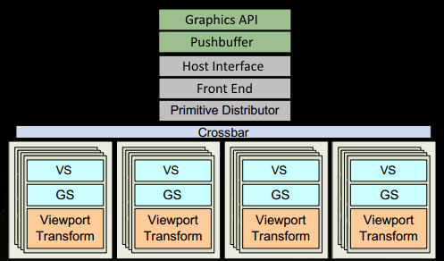

### 矩阵变换相关

[OpenGL 3D渲染技术：矩阵变换数学原理 - 掘金](https://juejin.cn/post/6858793605151227917)

### OpenGL黑屏原因

[OpenGL黑屏及渲染不出来的常见原因总结 - 掘金](https://juejin.cn/post/6844903910742687751)

### EGL

#### EGL和OpenGL

[EGL Overview - The Khronos Group Inc](https://www.khronos.org/egl/)

[OpenGL ES EGL 简介-猿说编程](https://www.codersrc.com/archives/17486.html)

- EGL定义

  EGL™ 是 Khronos 渲染应用程序编程接口（API）（如 OpenGL ES 或 OpenVG）与底层原生平台窗口系统之间的接口。它负责处理图形上下文管理、表面 / 缓冲区绑定以及渲染同步等事务，并借助其他 Khronos API 实现高性能、加速的混合模式 2D 与 3D 渲染。EGL 还在 Khronos 的不同 API 之间提供互操作性，以实现 API 间数据的高效传输，例如在运行 OpenMAX AL 的视频子系统与运行 OpenGL ES 的图形处理器（GPU）之间的数据传输。

  EGL 提供了创建渲染表面的机制，诸如 OpenGL ES 和 OpenVG 之类的客户端 API 能够在这些表面上进行绘制；EGL 还为客户端 API 创建图形上下文，并对客户端 API 以及原生平台渲染 API 的绘图操作进行同步。这使得能够通过无缝结合使用 OpenGL ES 和 OpenVG，实现高性能、加速的混合模式 2D 和 3D 渲染。

  

  图片中：

  - EGL包括：Display，Surface，Context三部分内容

  - Display(EGLDisplay) 是对实际显示设备的抽象；
  - Surface（EGLSurface）是对用来存储图像的内存区域 FrameBuffer 的抽象（**这个FrameBuffer和OpenGL里的FrameBuffer是一个东西**），包括 Color Buffer（颜色缓冲区）， Stencil Buffer（模板缓冲区） ，Depth Buffer（深度缓冲区）；
  - Context (EGLContext) 存储 OpenGL ES 绘图的一些状态信息；

  [必看：OpenGL ES 3.0 开发（六）：EGL](https://mp.weixin.qq.com/s?__biz=Mzg2NDc1OTIzOQ==&mid=2247483690&idx=1&sn=dbc56e83aba181693ae1f50228fa81b1&scene=21&poc_token=HNmwP2ijJpaE6ED_Ouo_4Sge3GisEFyZjgvssQIa)

- EGL和OpenGL的关系

  > - EGL与线程是强相关的，一个线程只能绑定一个EGL环境，如果之前绑过其它的，后面又绑了一个，那就会是最后绑的那个。
  > - 在EGL环境中作画时，默认是渲染到对应surface的后缓冲中，此时需要调用`eglSwapBuffers()`交换指定surface的前后缓冲区，但是在Qt中我们不需要这么做，因为QOpengGLWidget集成了EGL环境，且默认是画在后缓冲区，画完后自动进行swap操作。详见：[QOpenGLWidget Class | Qt Widgets 5.15.19](https://doc.qt.io/archives/qt-5.15/qopenglwidget.html#relation-to-qglwidget)（？？？？记得试试用FBO离屏渲染时，`paintGL()`末尾调用`context->swapbuffers()`）

  EGL（Embedded-System Graphics Library）是连接OpenGL ES与本地窗口系统的桥梁，负责管理和执行GL命令。**GL线程**是指在OpenGL ES开发中，与EGL环境绑定的cpu线程，绑定后才可以在这个线程中执行GL操作。了解EGL和GL线程对于实现复杂功能和掌握渲染底层原理非常重要。

  

  [必看：OpenGL ES 高级进阶：EGL 及 GL 线程](http://mp.weixin.qq.com/s?__biz=MzIwNTIwMzAzNg==&mid=2654169605&idx=2&sn=0e5d309fbfa13cc541f8d46cf9a78321&chksm=8cf3b936bb843020c84d0cc7f2c5da3fed9ac774fddd69f380ddbd9557b13c326f02442dcc59&scene=21#wechat_redirect)

  总的来说，EGL在初始化完成后，会建立与窗口的连接；随后通过创建surface（可以理解成画布），以及context（可以理解成画笔），给OpenGL创建了作画的环境。

#### EGL的使用

[OpenGL ES 3.0 开发（六）：EGL](https://mp.weixin.qq.com/s?__biz=Mzg2NDc1OTIzOQ==&mid=2247483690&idx=1&sn=dbc56e83aba181693ae1f50228fa81b1&scene=21&poc_token=HNmwP2ijJpaE6ED_Ouo_4Sge3GisEFyZjgvssQIa)

EGL的使用大体分为以下几个步骤：

1. 初始化EGL的配置
   1. **获取 EGLDisplay 对象，建立与本地窗口系统的连接**
      调用 eglGetDisplay 方法得到 EGLDisplay。
   2. **初始化 EGL 方法**
      打开连接之后，调用 eglInitialize 方法初始化。
   3. **获取 EGLConfig 对象，确定渲染表面的配置信息**
      调用 eglChooseConfig 方法得到 EGLConfig。
2. **创建渲染表面 EGLSurface**
   通过 EGLDisplay 和 EGLConfig ，调用 eglCreateWindowSurface 或 eglCreatePbufferSurface 方法创建渲染表面，得到 EGLSurface，其中 eglCreateWindowSurface 用于创建屏幕上渲染区域，eglCreatePbufferSurface 用于创建屏幕外渲染区域。
3. **创建渲染上下文 EGLContext** 
   通过 EGLDisplay 和 EGLConfig ，调用 eglCreateContext 方法创建渲染上下文，得到 EGLContext。
4. **绑定上下文**
   通过 eglMakeCurrent 方法将 EGLSurface、EGLContext、EGLDisplay 三者与当前线程绑定，绑定成功之后 OpenGLES 环境就创建好了，接下来便可以进行渲染。
5. 调用gl_*方法进行绘制
6. **交换缓冲**
   OpenGLES 绘制结束后，使用 eglSwapBuffers 方法交换前后缓冲，将绘制内容显示到屏幕上，而屏幕外的渲染不需要调用此方法。
7. **释放 EGL 环境**
   绘制结束后，不再需要使用 EGL 时，需要取消 eglMakeCurrent 的绑定，销毁  EGLDisplay、EGLSurface、EGLContext 三个对象。

我们通过图片来加深一下印象：

![图片[1]-OpenGL ES EGL  eglSwapBuffer-猿说编程](./assets/78805a221a988e7-69-759x1024.png)

我们再看看EGL相关的名词解释：

[OpenGL ES EGL 名词解释-猿说编程](https://www.codersrc.com/archives/17508.html)

最后我们将一步一步拆解，创建一个EGL环境：

[Android OpenGL 开发 2 - EGL 使用讲解 - 个人博客](https://xwenchen.github.io/post/5AAAADBA29DD4CCCBC3FBAB9ACE20FAD.html)

[EGL Reference Pages](https://registry.khronos.org/EGL/sdk/docs/man/)

[OpenGL ES-猿说编程-第5页](https://www.codersrc.com/archives/category/pythonbase/opengl-es/page/5)

1. 获取 EGL Display 对象：[eglGetDisplay](https://www.codersrc.com/archives/17565.html)
2. 初始化与 EGLDisplay 之间的连接：[eglInitialize](https://www.codersrc.com/archives/17572.html)
3. 获取 EGLConfig 对象：[eglChooseConfig](https://www.codersrc.com/archives/17607.html) / [eglGetConfigs](https://www.codersrc.com/archives/17596.html)
4. 创建 EGLContext 实例：[eglCreateContext](https://www.codersrc.com/archives/17832.html)
5. 创建 EGLSurface 实例：[eglCreateWindowSurface ](https://www.codersrc.com/archives/18149.html)/ [eglCreatePbufferSurface](https://www.codersrc.com/archives/18183.html)
6. 连接 EGLContext 和 EGLSurface 上下文 [eglMakeCurrent](https://www.codersrc.com/archives/18351.html)
7. 使用 [OpenGL ES](https://www.codersrc.com/opengl-es-基础) API 绘制图形：gl_*
8. 切换 front buffer 和 back buffer 显示：[eglSwapBuffer](https://www.codersrc.com/archives/18381.html)
9. 断开并释放与 EGLSurface 关联的 EGLContext 对象：eglRelease
10. 删除 EGLSurface 对象：[eglDestroySurface](https://www.codersrc.com/archives/18516.html)
11. 删除 EGLContext 对象：[eglDestroyContext](https://www.codersrc.com/archives/18498.html)
12. 终止与 EGLDisplay 之间的连接：[eglTerminate](https://registry.khronos.org/EGL/sdk/docs/man/)

但这些都不重要，因为我们用的是Qt，用的是QOpenGLContext

#### EGL和多线程

[荆棘中的舞蹈：OpenGL多线程同步方案 - 简书](https://www.jianshu.com/p/f55515e9081b)

##### OpenGL中的共享上下文？？？

[OpenGL ES 共享上下文实现多线程渲染](https://mp.weixin.qq.com/s?__biz=MzIwNTIwMzAzNg==&mid=2654165674&idx=1&sn=5ad986771f5364b016ac45ccd301e740&chksm=8cf38999bb84008fc390bbfdc6201a99f9c0a785aec6d079a96d92ee6fdc5effb4a784559792&scene=21#wechat_redirect)

显然，在多线程环境下，不同的线程需要对应一个不同的EGL环境，那么问题来了，不同的EGL之间有哪些资源是可以共享的呢？

可以共享的资源：

- **纹理；**
- **shader；**
- **program 着色器程序；**
- **buffer 类对象，如 VBO、 EBO、 RBO 等 。**

不可以共享的资源：

- **FBO 帧缓冲区对象（不属于 buffer 类）；**
- **VAO 顶点数组对象（不属于 buffer 类）。**

这里解释下，**在不可以共享的资源中，FBO 和 VAO 属于资源管理型对象，FBO 负责管理几种缓冲区，本身不占用资源，VAO 负责管理 VBO 或 EBO ，本身也不占用资源**。

我们来看看多线程渲染时的大致架构：


我们**在主渲染线程之外通过共享 EGLContext 的方式开辟一个新的离屏渲染线程，之后将主渲染线程生成的纹理、 program 、VBO 资源分享给新的渲染线程使用**，最后将保存（新渲染线程）渲染结果的纹理返回给主线程进行上屏渲染。

？？？**显然，如果我们是通过在渲染线程渲染完纹理后，再去通知主线程更新纹理，那么实际上整个流程还是同步执行的，不是异步执行的。所以我们可以创建一个GLEnv的结构体，该结构体中存放可以共享的数据，当新渲染线程渲染结束后，就创建一个GLEnv的堆对象，该对象中存放共享资源，然后将`&GLEnv`传进无锁队列中，主线程运行时，pop一个无锁队列中的对象，然后对该对象进行操作，不过需要注意，主线程在操作完之后，需要及时释放GLEnv中对应的显存对象以及GLEnv内存对象。**

但显然这种方式有一个缺点，就是在渲染线程中的FBO而言，对于我每次都需要“解绑FBO中的纹理”，然后再“生成并绑定一个新的FBO纹理”，这会拖累GPU的执行速度，所以最终的解决方案是：我们可以在渲染线程中创建一个环形链表，节点是一个叫GLTex的结构体：

```c++
// 仅供参考
struct GLTex{
    GLuint Texid = 0;
    int wh = 0;	// 该值存放的是Texture的width*height
    GLsync objSync = 0;
    GLTex* next = nullptr;
}	// 这个结构体可以尝试用位域优化空间
```

尝试把这个环形链表按并发编程中的那样，改成无锁队列，主线程是消费线程，更改head指针，渲染线程是生产线程，更改tail指针

注意需要fence对象进行gpu同步，fence对象与texture进行绑定。

##### OpenGL中的CS架构

[深入GPU硬件架构及运行机制 - 0向往0 - 博客园](https://www.cnblogs.com/timlly/p/11471507.html#42-gpu逻辑管线)




##### OpenGL中的命令队列

cpu先把gl命令传给cpu中的调用缓存，随后在合适的时机传给gpu中的命令队列，注意CPU中的调用缓存与线程相关，有多个，但是GPU中的和命令队列只有一个


##### OpenGL中的多线程同步机制

先把下面这三个链接看完再看总结

[？？？必看：GPU 与 CPU 的数据交互-CSDN博客](https://blog.csdn.net/M120674/article/details/129099511)

[OpenGL API 介绍(七)：同步 - 知乎](https://zhuanlan.zhihu.com/p/609071975)

[LearnOpenGL - Android OpenGL ES 3.0 多线程同步，fence、glWaitSync 和 glClientWaitSync 的运用-CSDN博客](https://blog.csdn.net/weiwei9363/article/details/140559485)

###### OpenGL的执行流

要想了解OpenGL同步操作，必须对OpenGL执行流有一定了解，OpenGL执行流特点可以用3句话概括：

- 异步执行；
- 乱序执行；
- 隐式同步。

- 异步执行

  OpenGL执行过程分为2个阶段：指令发射(issue)和指令执行(execution)。OpenGL 客户端维护了一个指令队列(command queue)，程序运行，先把指令从客户端发送到服务中的指令队列，然后GPU乱序执行队列中的指令，直至队列为空。

- 乱序执行

  OpenGL是乱序执行的，但它不是OpenGL的特性，而是现代CPU/GPU的特性。乱序执行(out-of-order execution)，指在不影响执行结果的大前提下，多核CPU/GPU不按程序规定的顺序执行指令的技术。乱序执行的目的是提高指令并行度(Instruction Level Parallelism)；乱序执行原理是，对指令的数据依赖(data dependency)关系进行分析，然后对指令进行重排，把没有数据依赖关系的指令同时发射到不同运算单元上，同时进行运算，举个例子：

  

  乱序执行从实现机制上，可分为2类：

  - 在编译期，编译器进行指令重排；
  - 在运行期，CPU或GPU乱序执行指令。

  两者的区别是，前者可以分析出整个程序内所有指令的静态数据依赖关系；后者可以分析局部代码段内指令的动态数据依赖关系，比如通过分支预测分析包含有条件语句代码段内的数据依赖关系；再比如在cache miss的时候，CPU/GPU空闲，在此期间插入无关指令让CPU/GPU去执行。

- 隐式同步

  虽然OpenGL的执行是异步、乱序的，但是为了简化编程难度，OpenGL设计规范(OpenGL specification)要求，要让用户在使用OpenGL API的时候，觉得代码是同步、顺序执行的。要求前面的代码对数据的修改，对后面的代码可见，这就是隐式同步技术。OpenGL中的API，比如`glTexSubImage2D()`, `glReadPixels()`, `glBufferSubData()` 等数据读写函数都采用了隐式同步技术。

###### OpenGL中的同步接口

glFlush和glFinish都用于控制OpenGL的执行。两者的区别在于他们控制执行流程的方式和时机。

- glFlush()是一种用于迫使之前的OpenGL命令开始执行的方法。当你在程序中调用glFlush()，OpenGL会把所有待执行的命令放入图形处理器（GPU）的命令队列中。这意味着，无论你的程序在何时何地调用glFlush()，你都可以确保所有已经发送到GPU的命令都将最终被执行。然而，调用glFlush()并不意味着等待所有命令完成执行。你的程序会在glFlush()命令返回后继续运行，同时GPU也会开始处理命令队列中的命令。
- glFinish()不仅会迅速开始执行所有尚未开始执行的OpenGL命令，还会一直阻塞，直到所有的命令都完成执行，并且所有的结果都已返回到你的程序。当glFinish()返回时，你可以确定所有之前的OpenGL命令都已经完成了执行。由于glFinish()会等待所有OpenGL命令完成执行，所以通常会因为大量的等待时间而导致程序性能下降。除非必要，否则通常不推荐频繁使用glFinish()。

总的来说，glFlush()和glFinish()都是OpenGL的同步命令，可以用来控制OpenGL命令的执行流程。然而，**glFlush()是非阻塞的，只要求命令尽快开始执行，而glFinish()则是阻塞的，需要等待所有命令完成。**

###### OpenGL中的同步对象

- glFenceSync

  在 OpenGL ES 3.0 中引入了同步对象，这使得 OpenGL ES 的多线程编程更具有控制性。你可以使用下面的 API 来创建一个同步对象

  ```c++
  GLsync glFenceSync(GLenum condition, GLbitfield flags);
  ```

  其中 `condition` 必须是 GL_SYNC_GPU_COMMANDS_COMPLETE，而 `flags` 填 0 即可。

  同步对象有两种可能的状态：已触发（signaled）和未触发（unsignaled）。当使用glFenceSync创建一个同步对象时，它处于未触发状态。它还会在OpenGL命令流中插入一个栅栏（fence）命令，并将其与同步对象关联起来。当glFenceSync命令的条件得到满足时，即命令流中直到栅栏位置的所有命令都执行完毕时，状态会转变为已触发。

- glClientWaitSync 和 glWaitSync

  ```c++
  GLenum glClientWaitSync(GLsync sync, GLbitfield flags, GLuint64 timeout);
  void glWaitSync(GLsync sync, GLbitfield flags, GLuint64 timeout);
  ```

  函数glClientWaitSync会阻塞所有CPU操作，直到同步对象被发出信号。如果同步对象在超时时间内没有被发出信号，函数会返回一个状态码来表示这一点。

  而对于glWaitSync，行为稍有不同。图形命令在GPU上是严格按照顺序执行的，所以当命令流中达到一个同步对象时，可以保证所有之前的命令都已经完成。
  应用程序实际上不会等待同步对象被发出信号；只有GPU会等待。因此，glWaitSync将立即返回到应用程序。由于应用程序不等待函数返回，所以不存在挂起的危险，因此必须将标志值设为零。此外，超时实际上将取决于实现，因此指定特殊的超时值GL_TIMEOUT_IGNORED以明确这一点。

  综上：

  - 对于glClientWaitSync而言，在sync对象绑定的fence命令前的所有指令都没完成前，线程会阻塞在该函数处，所以glClientWaitSync后面的命令不会发送到调用缓存中；

  - 对于glWaitSync而言，线程不会阻塞，所以OpenGL会把glWaitSync及其后续的所有gl命令都发送给调用缓存，但是这些命令不会立刻执行，会等到sync对象绑定的fence命令前的所有指令都完成后才会执行。

#### Qt中的EGL

本节的demo链接：