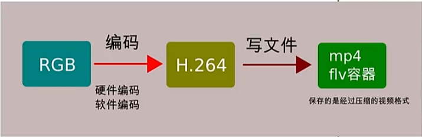
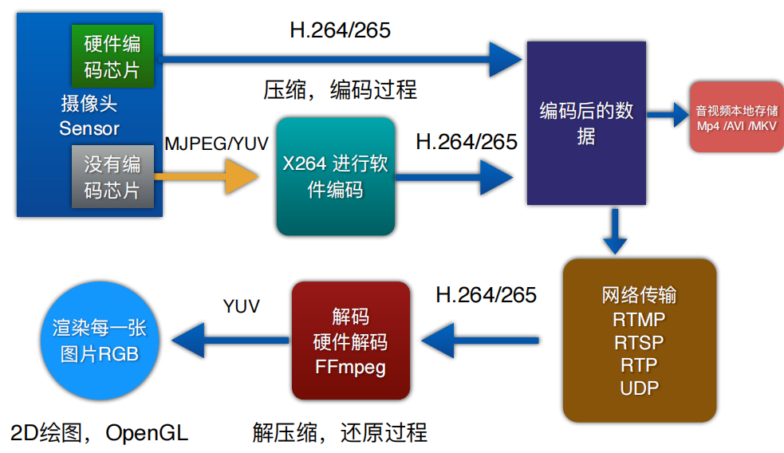

### 封装mp4课程概览

- 前面的课程，我们讲的是如何读取一个视频mp4—>解码(FFmpeg)—>YUV—>美化特效处理(OpenGL)—>渲染(OpenGL)。

- 本部分的主要内容是学习使用FFmpeg将OpenGL渲染结果封装成视频，也就是和上面的流程正好反过来：

  图片(RGB)—>YUV—>编码(H.264)—>写成mp4

- 以上，视频我们是使用的H.264编码，这个可以用FFmpeg进行，而音频我们使用的是aac编码，使用libaac进行

### 视频录制专题

视频录制有以下几种场景：

- 视频转存：得到的是已经编码过的数据 H.264, 写到一个视频容器（mp4，flv）里面。比如将H.264+AAC 数据保存到mp4或flv中. (解析H.264 SPS PPS IPB帧关键数据，写入视频容器)。这是在纯写文件，不涉及编码，效率很高。

- 视频压缩：RGB YUV 数据经过编码写入mp4 flv容器。涉及到视频编码. x264+FFmpeg+faac（或者fdk-aac） 完成。

- 参考下图：

  

  

