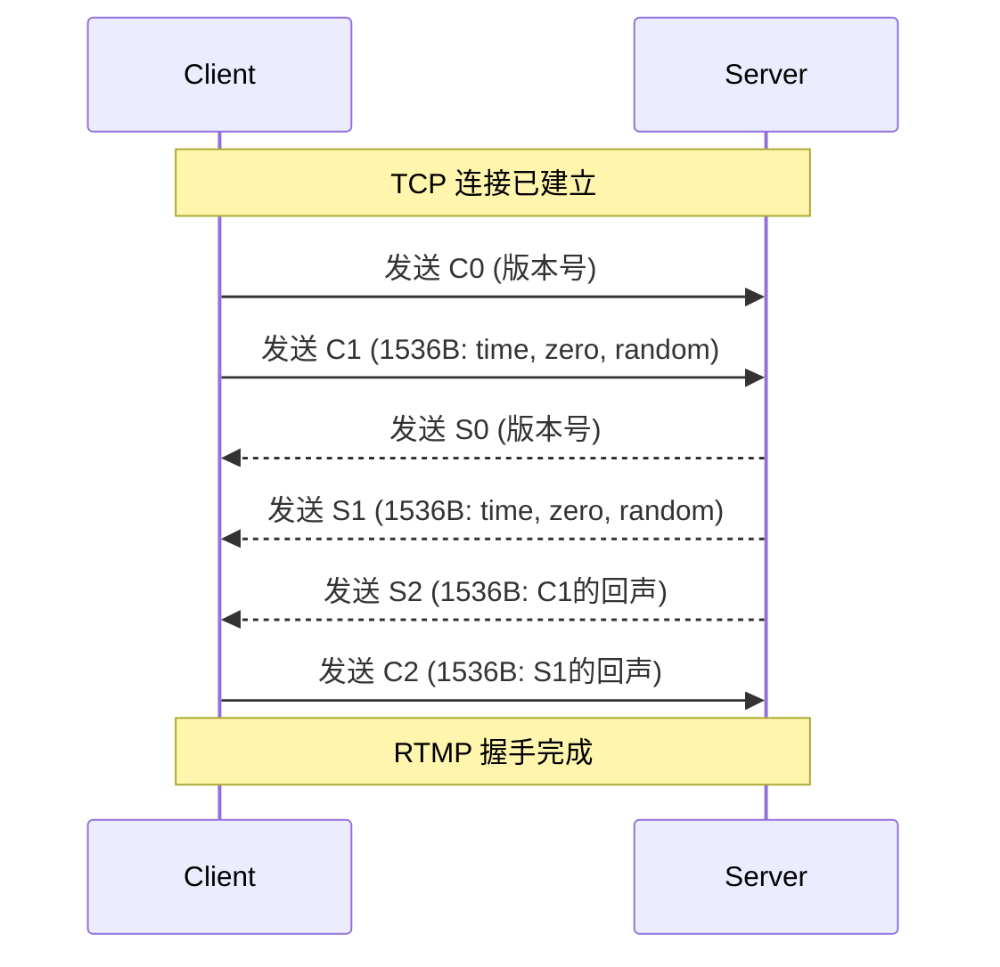
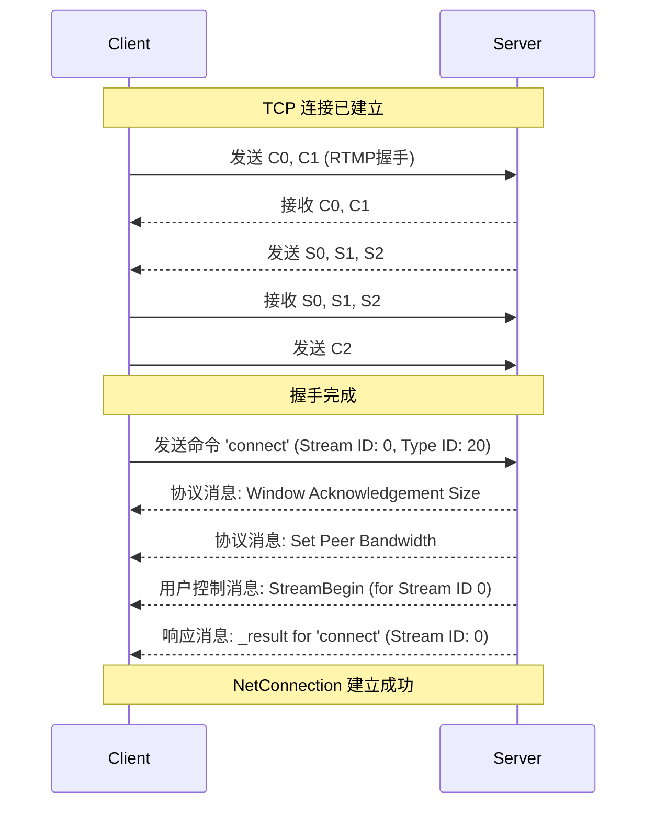
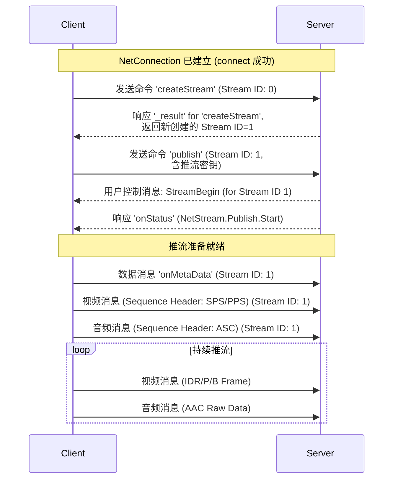
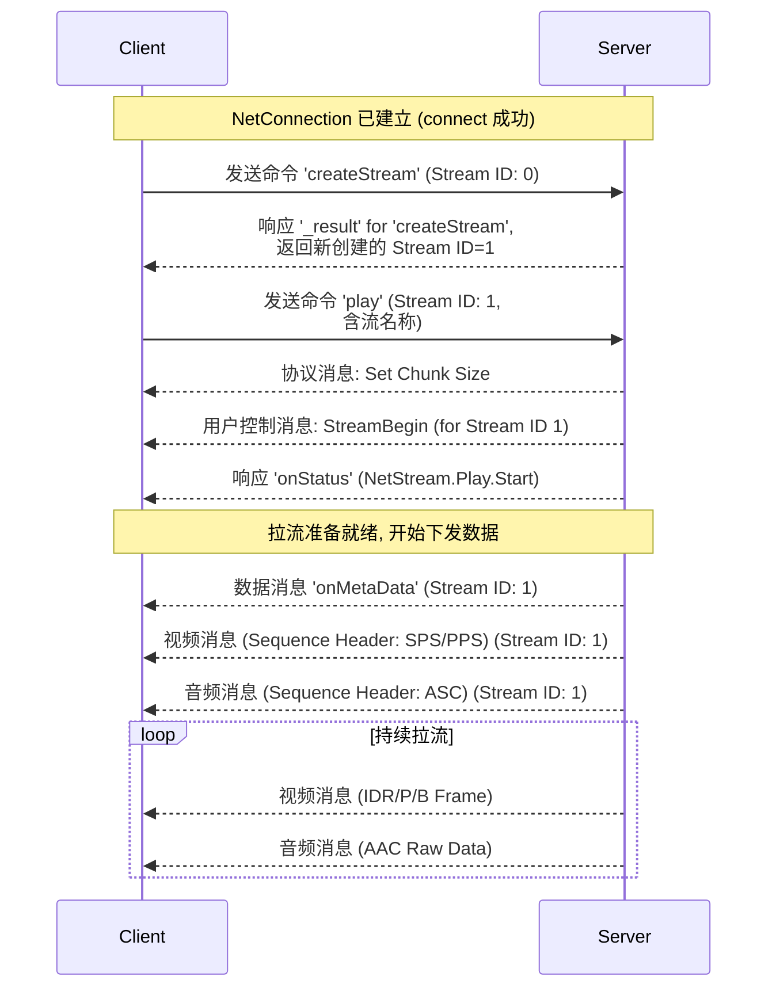

[RTMP 协议：为什么直播推流协议都爱用它？丨音视频基础-腾讯云开发者社区-腾讯云](https://cloud.tencent.com/developer/article/2021490)

[深度解析RTMP直播协议：从保姆级入门到高级优化！ – PixPark](https://pixpark.net/rtmp-protocol.html)

[【基于libRTMP的流媒体直播之 AAC、H264 推送】 - DoubleLi - 博客园](https://www.cnblogs.com/lidabo/p/7324369.html)

[RTMP 协议学习（消息与块）](https://aistudio.google.com/prompts/12UXjsvWpjcsphJPK4Uud9SavS-WrcrbJ)

[RTMP Wireshark 抓包分析](https://aistudio.google.com/prompts/1fu14WDvrpUaLd2RQhnJGNt6CrsgCGnjs)

# RTMP 协议解析.md

## 〇、前言

### 0.1 协议概述

实时消息传输协议 (Real-Time Messaging Protocol, RTMP) 是由 Adobe 公司设计的，用于在服务器与客户端之间进行音视频及数据实时传输的应用层协议。它构建于一个可靠的传输层协议（通常是 TCP）之上。

RTMP 协议存在多种变体，以适应不同的网络环境：
-   **RTMP:** 基于 TCP 的明文协议，默认使用 1935 端口。
-   **RTMPT:** 将 RTMP 封装在 HTTP 请求中，用于穿越防火墙。
-   **RTMPS:** 将 RTMP 封装在安全的 TLS/SSL 连接中，提供加密传输。

本解析将主要聚焦于基于 TCP 的标准 RTMP 协议。

### 0.2 核心优势

尽管 RTMP 在播放端已逐渐被 HTTP-FLV、HLS 等协议取代，但它在推流（采集端到服务器）领域至今仍是事实标准，其核心优势在于：

-   **低延迟:**
    协议基于持久的 TCP 连接，并采用高效的分块传输机制，减少了不必要的协议开销和传输等待，可将延迟稳定控制在 1-3 秒，保证了直播的实时性。

-   **高可靠性:**
    完全基于 TCP 协议，利用其面向连接、有序传输、丢包重传和流量控制等特性，确保了音视频数据在推流过程中能够稳定、完整地送达服务器，有效避免了花屏、卡顿等问题。

-   **成熟生态与广泛应用:**
    作为业界长期使用的推流协议，获得了所有主流编码硬件、推流软件（如 OBS）、CDN 厂商和流媒体服务器（如 SRS, Nginx-RTMP）的广泛支持。

### 0.3 关键术语定义

-   **消息 (Message)**
    -   RTMP 在应用层进行通信的**逻辑数据单元**。
    -   每一条消息都承载一个完整的、有独立意义的信息，如一个视频帧、一个音频样本或一条控制命令。
    -   它由消息头 (Message Header) 和消息负载 (Message Payload) 两部分组成。

-   **块 (Chunk)**
    -   RTMP 在网络上传输的**物理基本单元**。
    -   一个完整的消息在传输前，会被分割成一个或多个块。
    -   协议通过对块进行传输，实现多路复用与头部压缩。

-   **消息流 (Message Stream)**
    -   一个**逻辑上**的通信通道，用于传输一系列具有关联性的消息（如属于同一直播的音视频和命令）。
    -   由一个唯一的**消息流ID (Message Stream ID)** 来标识。
    -   在一次网络连接中可以存在多个消息流。

-   **块流 (Chunk Stream)**
    -   一个**协议底层**的通信通道，用于传输一系列的块。
    -   由一个唯一的**块流ID (Chunk Stream ID, CSID)** 来标识。
    -   每一条块流都维护着自己独立的上下文，这是实现块头压缩的前提。

-   **复用 (Multiplexing)**
    -   在一个单一的网络连接上，将来自不同块流的块交织在一起进行传输的过程。
    -   此机制可以防止大的、低优先级的消息（如视频关键帧）阻塞小的、高优先级的消息（如控制信令）的传输。

## 一、协议基础：连接与分块

### 1.1 握手 (Handshake)

RTMP 会话始于一次握手。握手过程在 TCP 连接建立之后、任何消息传输之前进行，其核心目的是协商协议版本并建立同步。它由客户端和服务器之间交换三个固定大小的数据块完成。

-   客户端发送的数据块：**C0, C1, C2**
-   服务器发送的数据块：**S0, S1, S2**

#### 1.1.1 C0/S0: 版本协商

C0 和 S0 数据块大小为 **1 字节**，用于承载 RTMP 的版本号。当前规范定义的版本号为 3。

```
 0 1 2 3 4 5 6 7
+-+-+-+-+-+-+-+-+
|  Version (8)  |
+-+-+-+-+-+-+-+-+
```
-   **C0:** 由客户端发送，声明其请求使用的协议版本。
-   **S0:** 由服务器发送，声明其最终选择的协议版本。

#### 1.1.2 C1/S1: 时间与随机数据

C1 和 S1 数据块大小为 **1536 字节**，结构完全相同，用于交换初始化的时间戳和随机数据，以确保连接的唯一性。

```
 0                   1                   2                   3
 0 1 2 3 4 5 6 7 8 9 0 1 2 3 4 5 6 7 8 9 0 1 2 3 4 5 6 7 8 9 0 1
+-+-+-+-+-+-+-+-+-+-+-+-+-+-+-+-+-+-+-+-+-+-+-+-+-+-+-+-+-+-+-+-+
|                        time (4 bytes)                         |
+-+-+-+-+-+-+-+-+-+-+-+-+-+-+-+-+-+-+-+-+-+-+-+-+-+-+-+-+-+-+-+-+
|                        zero (4 bytes)                         |
+-+-+-+-+-+-+-+-+-+-+-+-+-+-+-+-+-+-+-+-+-+-+-+-+-+-+-+-+-+-+-+-+
|                     random bytes (1528 bytes)                 |
|                            ...                                |
+-+-+-+-+-+-+-+-+-+-+-+-+-+-+-+-+-+-+-+-+-+-+-+-+-+-+-+-+-+-+-+-+
```
-   **time (4 bytes):** 时间戳。通常是发送端自身的本地时间戳（epoch time）。
-   **zero (4 bytes):** 协议规定，此 4 字节必须为全 0。
-   **random bytes (1528 bytes):** 随机数据。由发送端生成，内容任意。

#### 1.1.3 C2/S2: 回声与确认

C2 和 S2 数据块大小也为 **1536 字节**，其内容是对接收到的对端 C1 或 S1 块的回声（echo），以此确认已成功接收到对方的初始化数据。

```
 0                   1                   2                   3
 0 1 2 3 4 5 6 7 8 9 0 1 2 3 4 5 6 7 8 9 0 1 2 3 4 5 6 7 8 9 0 1
+-+-+-+-+-+-+-+-+-+-+-+-+-+-+-+-+-+-+-+-+-+-+-+-+-+-+-+-+-+-+-+-+
|                        time (4 bytes)                         |
+-+-+--+-+-+-+-+-+-+-+-+-+-+-+-+-+-+-+-+-+-+-+-+-+-+-+-+-+-+-+-+-+
|                       time2 (4 bytes)                         |
+-+-+-+-+-+-+-+-+-+-+-+-+-+-+-+-+-+-+-+-+-+-+-+-+-+-+-+-+-+-+-+-+
|                  random echo (1528 bytes)                     |
|                            ...                                |
+-+-+-+-+-+-+-+-+-+-+-+-+-+-+-+-+-+-+-+-+-+-+-+-+-+-+-+-+-+-+-+-+
```
-   **S2 的内容:**
    -   `time`: 必须包含 C1 包中的 `time` 字段值。
    -   `time2`: 必须包含本端（服务器）接收到 C1 包时的时间戳。
    -   `random echo`: 必须包含 C1 包中的 `random bytes` 字段值。
-   **C2 的内容:**
    -   `time`: 必须包含 S1 包中的 `time` 字段值。
    -   `time2`: 必须包含本端（客户端）接收到 S1 包时的时间戳。
    -   `random echo`: 必须包含 S1 包中的 `random bytes` 字段值。

#### 1.1.4 握手时序图

客户端先发送C0，C1；服务端收到后发送S0，S1，S2；客户端收到后发送C2



### 1.2 消息 (Message)

消息 (Message) 是 RTMP 在应用层进行通信的**逻辑数据单元**。每一条消息都承载一个完整的、有独立业务意义的信息。消息在传输前，会被协议底层分割成一个或多个块 (Chunk)。

一个完整的消息由两部分构成：消息头和消息负载。其逻辑结构如下：

```c++
+---------------------+-----------------------+
|   Message Header    |    Message Payload    |
| (11 bytes, logical) |  (size = Payload Len) |
+---------------------+-----------------------+
```

#### 1.2.1 消息头

消息头描述了消息的基本元信息，用于指示接收端如何处理该消息。**请注意，这个完整的消息头在物理传输时，其内容会被编码进“块消息头”中，并遵循头部压缩规则，并不会总是完整地发送。**

其逻辑上的完整结构图示如下：

```c++
 0               1               2               3
 0 1 2 3 4 5 6 7 0 1 2 3 4 5 6 7 0 1 2 3 4 5 6 7 0 1 2 3 4 5 6 7
+-+-+-+-+-+-+-+-+-+-+-+-+-+-+-+-+-+-+-+-+-+-+-+-+-+-+-+-+-+-+-+-+
| Msg Type (8)  |              Payload Length (24)              |
+-+-+-+-+-+-+-+-+-+-+-+-+-+-+-+-+-+-+-+-+-+-+-+-+-+-+-+-+-+-+-+-+
|                           Timestamp (32)                      |
+-+-+-+-+-+-+-+-+-+-+-+-+-+-+-+-+-+-+-+-+-+-+-+-+-+-+-+-+-+-+-+-+
|                     Message Stream ID (24)     |
+-+-+-+-+-+-+-+-+-+-+-+-+-+-+-+-+-+-+-+-+-+-+-+-+-+-+-+-+-+-+-+-+
```
-   **消息类型ID (Message Type ID)**
    -   **大小:** 1 字节 (8 bits)
    -   **作用:** 定义消息的根本用途。对于一个典型的推流客户端，以下几类消息至关重要：
        -   **命令消息 (ID: 20, 17):** 用于执行所有关键操作，如 `connect`, `createStream`, `publish`。这是发起推流的前提。
        -   **数据消息 (ID: 18, 15):** 主要用于发送 `onMetaData`，向服务器和播放端描述音视频的编码、分辨率、采样率等元信息。
        -   **视频消息 (ID: 9):** 承载 H.264 视频帧数据。
        -   **音频消息 (ID: 8):** 承载 AAC 音频帧数据。
        -   **其他:** 一个健壮的客户端还必须能正确解析和响应服务器下发的**协议控制消息** (如 `Set Chunk Size`) 和**用户控制消息** (如 `StreamBegin`)。我们将在第二章详细介绍。

-   **负载长度 (Payload Length)**
    -   **大小:** 3 字节 (24 bits)，大端字节序 (big-endian)。
    -   **作用:** 指明消息负载部分的实际大小，单位为字节。

-   **时间戳 (Timestamp)**
    -   **大小:** 4 字节 (32 bits)，大端字节序。
    -   **作用:** 记录消息产生的相对时间，单位为毫秒 (ms)。它是实现音画同步和流控的关键。当时间戳超过 32 位最大值时，会发生回绕。

-   **消息流ID (Message Stream ID)**
    -   **大小:** 3 字节 (24 bits)，大端字节序。
    -   **作用:** 标识该消息所属的逻辑流 (Stream)。在一个网络连接上可以存在多个独立的流，此 ID 用于区分它们。

> [!TIP]
>
> 实际RTMP通信中并未按照上述格式去发送RTMP消息，而是将RTMP 消息分块发送，之后将介绍RTMP消息分块。

#### 1.2.2 消息负载

消息负载是消息所承载的实际有效数据。其内部数据的格式和解析方式，完全由消息头中的**消息类型ID**来决定。

-   **示例:**
    
    -   若消息类型为**视频 (ID=9)**，则负载为 H.264 视频帧数据。
    -   若消息类型为**音频 (ID=8)**，则负载为 AAC 音频采样数据。
    -   若消息类型为**命令 (ID=20)**，则负载为使用 AMF0 格式编码的命令及参数。
    
    *关于音视频数据在负载中的具体封装格式，我们将在* **第三章 “封装与负载”** *中进行深入剖析。*

### 1.3 块 (Chunk)

块 (Chunk) 是 RTMP 在网络上传输的**物理基本单元**。一个完整的消息在传输前，会被协议底层分割成一个或多个块。

#### 1.3.1 块的定义与分块机制

分块 (Chunking) 是 RTMP 协议的核心机制，其设计目的主要有两个：

1.  **实现多路复用 (Multiplexing):**
    -   通过将大的消息（如视频关键帧）拆分成小块，并允许不同流的块在网络上交错传输。
    -   这避免了大的、低优先级的消息长时间独占网络通道，从而保证了小的、高优先级的消息（如控制信令）能够被及时发送，确保了协议的低延迟特性。

2.  **实现头部压缩 (Header Compression):**
    -   对于连续传输的、属于同个流的块，其后续块的头部可以省略与前一个块重复的信息。
    -   这种机制极大地减少了协议自身的冗余开销，节省了网络带宽。

#### 1.3.2 块的结构

一个完整的块由以下四个部分组成，其中“块消息头”和“扩展时间戳”可能不存在，具体取决于头部压缩的类型。

```
+--------------+------------------+---------------------+--------------+
| Basic Header | Chunk Msg Header | Extended Timestamp  |  Chunk Data  |
+--------------+------------------+---------------------+--------------+
|                                                       |
|<------------------- Chunk Header -------------------->|
```

#### 1.3.3 块基本头 (Basic Header)

块基本头负责编码 `fmt` (决定块消息头类型) 和 `CSID` (块流ID)。为了高效地表示不同范围的 CSID，它采用了三种变长格式。

1.  **1 字节格式 (CSID: 2-63)**
    
    -   当 CSID 值在 2 到 63 之间时使用
    -   最高 2 位为 `fmt`，低 6 位为 `cs id`。
    -   **图示:**
        ```c
         0 1 2 3 4 5 6 7
        +-+-+-+-+-+-+-+-+
        |fmt|   cs id   |
        +-+-+-+-+-+-+-+-+
        ```
    
2.  **2 字节格式 (CSID: 64-319)**
    
    -   当 CSID 值在 64 到 319 之间时使用。
    -   第一个字节最高 2 位为 `fmt`，低 6 位被设置为 `0`，作为标志位。
    -   第二个字节存储 `CSID - 64` 的值。
    -   **CSID = (第二个字节) + 64**
    -   **图示:**
        
        ```c
        //      Byte 0               Byte 1
         0 1 2 3 4 5 6 7  0 1 2 3 4 5 6 7
        +-+-+-+-+-+-+-+-+-+-+-+-+-+-+-+-+
        |fmt|  000000   |  (cs id - 64) |
        +-+-+-+-+-+-+-+-+-+-+-+-+-+-+-+-+
        ```
    
3.  **3 字节格式 (CSID: 64-65599)**
    -   当 CSID 值在 64 到 65599 之间时使用。
    -   第一个字节的最高 2 位为 `fmt`，低 6 位被设置为 `1`，作为标志位。
    -   第二和第三个字节共同存储 `CSID - 64` 的值，且采用**小端字节序 (little-endian)**。
    -   **CSID = (第三个字节 * 256) + (第二个字节) + 64**
    -   **图示:**
        ```c
        //      Byte 0               Byte 1               Byte 2
         0 1 2 3 4 5 6 7  0 1 2 3 4 5 6 7  0 1 2 3 4 5 6 7
        +-+-+-+-+-+-+-+-+-+-+-+-+-+-+-+-+-+-+-+-+-+-+-+-+-+
        |fmt|  000001   | (cs id - 64) LSB | (cs id - 64) MSB |
        +-+-+-+-+-+-+-+-+-+-+-+-+-+-+-+-+-+-+-+-+-+-+-+-+-+
        ```

> [!TIP]
>
> **fmt**: 用于指定`Chunk Header` 里面 `Message Header`的类型，后面会介绍到 **cs id**: 是`chunk stream id`的缩写，同一个`RTMP`消息拆成的 `chunk` 块拥有相同的 `cs id`, 用于区分chunk所属的RTMP消息, `chunk basic header` 的类型`cs id`占用的字节数来确定

#### 1.3.4 块消息头与头部压缩

RTMP 通过四种不同类型的块消息头来实现头部压缩。`fmt` 字段位于块基本头中，决定了块消息头的格式。

|  fmt  | 块消息头长度 | 包含字段                            | 核心应用场景                           |
| :---: | :----------: | :---------------------------------- | :------------------------------------- |
| **0** |   11 字节    | **全部** (时间戳, 长度, 类型, 流ID) | 新流的第一个块，或上下文信息丢失时。   |
| **1** |    7 字节    | 时间戳增量, 长度, 类型              | 同一流，但消息长度或类型改变。         |
| **2** |    3 字节    | 时间戳增量                          | 同一流，且消息长度和类型均不变。       |
| **3** |    0 字节    | **无**                              | 同一消息的后续块，或上下文完全相同时。 |

-   **Type 0 (fmt=0):** 11字节，不进行任何压缩。
    ```c
     0               1               2               3
     0 1 2 3 4 5 6 7 0 1 2 3 4 5 6 7 0 1 2 3 4 5 6 7 0 1 2 3 4 5 6 7
    +-+-+-+-+-+-+-+-+-+-+-+-+-+-+-+-+-+-+-+-+-+-+-+-+-+-+-+-+-+-+-+-+
    |            timestamp (3 Bytes)                 | message length
    +-+-+-+-+-+-+-+-+-+-+-+-+-+-+-+-+-+-+-+-+-+-+-+-+-+-+-+-+-+-+-+-+
    |    message length (3 Bytes)    |message type id| message stream id
    +-+-+-+-+-+-+-+-+-+-+-+-+-+-+-+-+-+-+-+-+-+-+-+-+-+-+-+-+-+-+-+-+
    | message stream id (4 Bytes, little-endian)     |
    +-+-+-+-+-+-+-+-+-+-+-+-+-+-+-+-+-+-+-+-+-+-+-+-+-+-+-+-+-+-+-+-+
    ```
    
    `Message Header`占用`11`个字节， 在`chunk stream`的开始的第一个`chunk`的时候必须采用这种格式。

    - **timestamp**：`3`个字节，因此它最多能表示到`16777215=0xFFFFFF=2^24-1`, 当它的值超过这个最大值时，这三个字节都置为1，实际的`timestamp`会转存到`Extended Timestamp`字段中，接受端在判断`timestamp`字段24个位都为1时就会去`Extended timestamp`中解析实际的时间戳。
    - **message length**：`3`个字节，表示实际发送的消息的数据如音频帧、视频帧等数据的长度，单位是字节。**注意这里是Message的长度，也就是chunk属于的Message的总数据长度，而不是chunk本身Data的数据的长度**。
    - **message type id**：`1`个字节，表示实际发送的数据的类型，如`8`代表音频数据、`9`代表视频数据。
    - **msg stream id**：4个字节，表示该chunk所在的流的`ID`，和`Basic Header`的`CSID`一样，它采用小端存储的方式
    
-   **Type 1 (fmt=1):** 7字节，省略了消息流ID。
    ```c
     0               1               2               3
     0 1 2 3 4 5 6 7 0 1 2 3 4 5 6 7 0 1 2 3 4 5 6 7 0 1 2 3 4 5 6 7
    +-+-+-+-+-+-+-+-+-+-+-+-+-+-+-+-+-+-+-+-+-+-+-+-+-+-+-+-+-+-+-+-+
    |                timestamp delta (24 bits)              |
    +-+-+-+-+-+-+-+-+-+-+-+-+-+-+-+-+-+-+-+-+-+-+-+-+-+-+-+-+-+-+-+-+
    |                message length (24 bits)               |
    +-+-+-+-+-+-+-+-+-+-+-+-+-+-+-+-+-+-+-+-+-+-+-+-+-+-+-+-+-+-+-+-+
    | message type id (8 bits) |
    +-+-+-+-+-+-+-+-+-+-+-+-+-+-+
    ```

    `Message Header`占用7个字节，省去了表示`msg stream id`的4个字节，表示此`chunk`和上一次发的`chunk`所在的流相同。
    
    - **timestamp delta**：3个字节，注意这里和格式0时不同，存储的是和上一个chunk的时间差。类似上面提到的`timestamp`，当它的值超过3个字节所能表示的最大值时，三个字节都置为1，实际的时间戳差值就会转存到`Extended Timestamp`字段中，接受端在判断`timestamp delta`字段24个位都为1时就会去`Extended timestamp`中解析时机的与上次时间戳的差值。
    
-   **Type 2 (fmt=2):** 3字节，进一步省略了消息长度和类型ID。
    
    ```c
     0               1               2
     0 1 2 3 4 5 6 7 0 1 2 3 4 5 6 7 0 1 2 3 4 5 6 7
    +-+-+-+-+-+-+-+-+-+-+-+-+-+-+-+-+-+-+-+-+-+-+-+-+-+
    |                timestamp delta (24 bits)      |
    +-+-+-+-+-+-+-+-+-+-+-+-+-+-+-+-+-+-+-+-+-+-+-+-+-+
    ```
    
    `Message Header`占用3个字节，相对于格式1，又省去了表示消息长度的3个字节和表示消息类型的1个字节，表示此chunk和上一次发送的chunk所在的流、消息的长度和消息的类型都相同。余下的这三个字节表示`timestamp delta`，使用同格式1。
    
-   **Type 3 (fmt=3):** 0字节，不包含任何块消息头。它的所有头部信息都与前一个**同CSID**的块完全相同。

#### 1.3.5 扩展时间戳

在`chunk`中会有时间戳`timestamp`和时间戳差`timestamp delta`， 只有这两者之一大于3个字节能表示的最大数值`0xFFFFFF＝16777215`时，才会用这个字段来表示真正的时间戳，否则这个字段**不传**

扩展时间戳占`4`个字节，能表示的最大数值就是`0xFFFFFFFF＝4294967295`。当扩展时间戳启用时，`timestamp`字段或者`timestamp delta`要全置为`1`，表示应该去扩展时间戳字段来提取真正的时间戳或者时间戳差。注意扩展时间戳存储的是完整值，而不是减去时间戳或者时间戳差的值。

#### 1.3.6 块数据

用户层面上真正想要发送的与协议无关的数据，长度在(0,chunkSize]之间, `chunk size`默认为`128`字节。


### 1.4 ID体系：`fmt`, CSID, Stream ID 与 Type ID

RTMP 协议通过多套ID和标记体系，构建了一个从物理通道到业务逻辑，再到具体数据内容的完整寻址与解析模型。

#### 1.4.1 块头格式标记 (fmt)

-   **定义:** Format Marker，一个 **2 位**的标记，位于每个块的**块基本头 (Basic Header)** 中。
-   **作用:**
    1.  **直接指令:** `fmt` 是一个直接的指令，它唯一地决定了紧随其后的**块消息头 (Chunk Message Header)** 的格式（11, 7, 3, 或 0 字节）。
    2.  **压缩执行者:** 它是实现头部压缩的**直接执行者**。

#### 1.4.2 块流 ID (Chunk Stream ID)

-   **定义:** Chunk Stream ID，协议**底层**的**物理通道**标识符。
-   **作用:**
    1.  **多路复用:** 实现音、视频和信令等不同块在单一网络连接上的交错传输。
    2.  **为压缩提供上下文:** `fmt=1,2,3` 格式的块之所以能省略信息，是因为解析器可以通过 `CSID` 找到前一个**同通道**的块，并复用其信息。可以说，**`CSID` 是 `fmt` 压缩指令能够生效的前提**。

#### 1.4.3 消息流 ID (Message Stream ID)

-   **定义:** Message Stream ID，应用**上层**的**逻辑通道**标识符。
-   **作用:**
    1.  **业务关联:** 将属于同一业务逻辑（如一场直播）的所有消息关联起来。

#### 1.4.4 消息类型 ID (Message Type ID)

-   **定义:** Message Type ID，**消息内容**的**类型**标识符。
-   **作用:**
    1.  **内容解析:** 告知接收端应如何解析消息负载 (Message Payload) 中的数据。

#### 1.4.5 协作关系总结

| 特性         | **`fmt`**        | **`CSID`**           | **`Stream ID`**             | **`Type ID`**          |
| :----------- | :--------------- | :------------------- | :-------------------------- | :--------------------- |
| **层面**     | 块头格式         | 物理通道             | 逻辑通道                    | 消息内容               |
| **标识对象** | 块头大小         | **块 (Chunk)**       | **消息流 (Message Stream)** | **单个消息 (Message)** |
| **作用**     | **决定如何压缩** | **为压缩提供上下文** | 关联业务流                  | 定义数据类型           |

**一句话总结它们的关系:**

在一个 RTMP 流中，一个 `Type ID` 为 `9` (视频) 的消息，属于 `Stream ID` 为 `1` (某场直播)；在传输时，它被分割成的多个块，都在 `CSID` 为 `4` (视频通道) 上跑；而这些块的头部具体省略了哪些信息，则由每个块的 `fmt` 标记来决定。

#### 1.4.6 协作关系示例

假设一次典型的推流过程：

1.  **连接 (connect):**
    -   客户端发送 `connect` 命令消息。
    -   此时：`Stream ID = 0` (连接级命令), `Type ID = 20` (AMF0命令), `CSID = 2` (协议控制通道)。

2.  **创建流 (createStream):**
    -   客户端发送 `createStream` 命令消息。
    -   此时：`Stream ID = 0` (仍是连接级命令), `Type ID = 20`, `CSID = 2`。
    -   服务器响应 `_result`，告知客户端成功创建了一个流，并分配了 `Stream ID = 1`。

3.  **发布 (publish) 与推流:**
    -   客户端发送 `publish` 命令消息。
    -   此时：`Stream ID = 1` (操作新建的流), `Type ID = 20`, `CSID` 通常为 `3` 或其他用于信令的通道。
    -   随后，客户端开始推送音视频数据：
        -   **发送视频消息:** `Stream ID = 1`, **`Type ID = 9`**, `CSID` 通常为 `4` (视频专用通道)。
        -   **发送音频消息:** `Stream ID = 1`, **`Type ID = 8`**, `CSID` 通常为 `5` (音频专用通道)。

**总结:**

-   **消息流 ID (Stream ID)** 告诉你这是“哪一场直播”。
-   **消息类型 ID (Type ID)** 告诉你这是这场直播中的“视频”、“音频”还是“命令”。
-   **块流 ID (CSID)** 告诉你承载这些信息的块，正在“哪条物理车道”上跑。

## 二、核心消息类型详解：以 `librtmp` 推流为核心

本章将以 `librtmp` 推流开发者的视角，聚焦于实际开发中必须理解和处理的核心消息。

### 2.1 协议控制消息 (ID: 1-6)

#### 概述

【由 librtmp 自动管理】

此类消息是 RTMP 协议的“神经系统”，用于在客户端与服务器的协议栈之间，自动地、底层地管理连接状态。在使用 `librtmp` 进行推流开发时，开发者**无需**手动构造或解析这些消息，`librtmp` 内部会自动完成收发。

理解它们的作用和核心特性，有助于深入理解 `librtmp` 的行为模式。

#### 核心特性

-   **消息类型ID (Message Type ID):** `1` 到 `6`。
-   **消息流ID (Message Stream ID):** **必须**为 `0` (属于连接级，不与任何具体流关联)。
-   **块流ID (CSID):** **必须**为 `2` (在专用的协议控制通道上传输)。
-   **优先级:** 高。确保其能优先于音视频等数据块被传输。

#### 作用与时机

-   **Set Chunk Size (ID: 1)**
    -   **作用:** 通信双方互相通知对方自己接下来发送的块 (Chunk) 的最大尺寸。
    -   **时机:** 通常在握手完成后，`librtmp` 会与服务器互相发送此消息以协商一个共同的块大小。

-   **Window Acknowledgement Size (ID: 5) & Acknowledgement (ID: 3)**
    -   **作用:** 共同构成一个滑动窗口流量控制机制，确保发送方不会超速发送数据。
    -   **时机:** `librtmp` 在 `RTMP_Connect` 期间会接收到服务器设置的窗口大小，并在后续数据交互中，按需自动发送或处理 `Acknowledgement` 消息。

-   **Set Peer Bandwidth (ID: 6)**
    -   **作用:** 一方向另一方声明自己的带宽能力，并可能要求对方限制发送速率。
    -   **时机:** 在连接建立过程中，服务器可能会向 `librtmp` 客户端发送此消息。`librtmp` 会根据消息内容自动调整其内部状态。

-   **Abort Message (ID: 2)**
    -   **作用:** 通知对端放弃一个正在接收但尚未完成的消息。
    -   **时机:** 极少使用。在需要取消一个大的、正在分块传输的消息时触发。

### 2.2 用户控制消息 (ID: 4)

#### 概述

【关键事件通知】

用户控制消息是一种**特殊的协议控制消息**，用于在客户端和服务器之间传递 RTMP 协议层面的关键事件通知。虽然其消息类型ID (`4`) 属于协议控制范畴，但它承载的事件（如流的开始、结束）对上层应用逻辑至关重要。

在使用 `librtmp` 时，开发者通常不会主动发送此类消息，但服务器会主动下发这些事件，`librtmp` 接收后会更新其内部状态。理解这些事件的含义，对于调试和理解推流生命周期非常有帮助。

#### 核心特性

-   **消息类型ID (Message Type ID):** `4`。
-   **消息流ID (Message Stream ID):** **必须**为 `0` (与协议控制消息一致)。
-   **块流ID (CSID):** **必须**为 `2` (在专用的协议控制通道上传输)。

#### Payload 结构

用户控制消息的 Payload 通常由两部分组成：

```c
 0               1               2               3
 0 1 2 3 4 5 6 7 0 1 2 3 4 5 6 7 0 1 2 3 4 5 6 7 0 1 2 3 4 5 6 7
+-+-+-+-+-+-+-+-+-+-+-+-+-+-+-+-+-+-+-+-+-+-+-+-+-+-+-+-+-+-+-+-+
| Event Type (16 bits)          |         Event Data            |
+-+-+-+-+-+-+-+-+-+-+-+-+-+-+-+-+-+-------------------------------+
|                           ...                                 |
+-+-+-+-+-+-+-+-+-+-+-+-+-+-+-+-+-+-+-+-+-+-+-+-+-+-+-+-+-+-+-+-+
```

-   **Event Type (2 bytes):** 事件类型。定义了这条消息的具体含义。
-   **Event Data (variable length):** 事件数据。其内容和长度由事件类型决定。

#### 关键事件类型

对于推流开发者而言，以下几个由**服务器下发**的事件类型尤为重要：

-   **StreamBegin (Event Type = 0)**
    -   **作用:** 服务器正式通知客户端，一个流已经成功创建并开始生效。
    -   **时机:** 在客户端成功调用 `createStream` 并发送 `publish` 命令后，服务器会下发此事件。
    -   **Event Data:** 4 字节，表示开始生效的流的 **Message Stream ID**。
    -   **对开发者的意义:** 收到此事件，标志着推流环境已完全就绪，可以正式开始发送音视频数据。`librtmp` 在内部会等待类似的状态确认。

-   **StreamEOF (Event Type = 1)**
    -   **作用:** 服务器通知客户端，一个流的数据已播放完毕（主要用于点播场景）。
    -   **Event Data:** 4 字节，表示结束的流的 **Message Stream ID**。
    -   **对开发者的意义:** 在推流场景中较少遇到，但如果收到，可能意味着流已意外结束。

-   **StreamDry (Event Type = 2)**
    -   **作用:** 服务器通知客户端，一个流已无数据可供发送。
    -   **Event Data:** 4 字节，表示枯竭的流的 **Message Stream ID**。
    -   **对开发者的意义:** 类似于 StreamEOF，是流状态异常的信号。

-   **PingRequest (Event Type = 6)**
    -   **作用:** 服务器向客户端发起 Ping 请求，以检测连接是否仍然存活。
    -   **Event Data:** 4 字节，包含一个时间戳。
    -   **对开发者的意义:** `librtmp` 会在内部自动响应一个 `PingResponse` (Event Type = 7) 事件，开发者无需干预。这是 RTMP 的保活机制。

### 2.3 命令消息 (ID: 20, 17)

#### 概述

命令消息是 RTMP 的“大脑”，它承载了所有客户端与服务器之间的远程过程调用 (RPC)。无论是建立连接、创建流，还是发布、播放，都是通过发送命令消息来完成的。

-   **消息类型ID (Message Type ID):**
    -   `20 (0x14)`: 用于 AMF0 编码的命令。
    -   `17 (0x11)`: 用于 AMF3 编码的命令。`librtmp` 主要使用 AMF0。

-   **消息流ID (Message Stream ID):**
    -   **连接级命令** (如 `connect`, `createStream`) 的 Stream ID **必须为 0**。
    -   **流级命令** (如 `publish`, `play`) 的 Stream ID **必须为 `createStream` 后获得的 ID**。

-   **块流ID (CSID):**
    -   命令消息通常在 CSID 为 `3` 的块流上传输。

-   **Payload:**
    -   其负载是使用 AMF (Action Message Format) 编码的一个或多个数据项，通常包含：命令名称 (字符串)、事务ID (数字)、命令对象 (AMF对象) 等。

#### `connect`

-   **作用:**
    由 `librtmp` 封装，客户端发起的第一个命令，用于请求与服务器上的一个指定应用程序 (app) 建立连接。
-   **使用:**
    当开发者调用 `RTMP_SetupURL()` 和 `RTMP_Connect()` 时，`librtmp` 会根据 URL 中解析出的 `app` 名称等信息，自动构造并发送 `connect` 命令。
-   **核心特性:**
    -   **消息流ID (Message Stream ID):** **必须**为 `0` (连接级命令)。
    -   **CSID:** 通常为 `3`。
-   **注意事项:**
    `connect` 命令的命令对象中，包含了 `app` (应用名), `tcUrl` (目标URL), `flashVer` (Flash版本伪装) 等关键连接参数。服务器会根据这些参数进行验证。

#### `createStream`

-   **作用:**
    由 `librtmp` 封装，在已建立的连接上，请求服务器创建一个用于承载音视频数据的逻辑通道——消息流 (Message Stream)。
-   **使用:**
    当开发者调用 `RTMP_ConnectStream()` 时，`librtmp` 会自动发送此命令。
-   **核心特性:**
    -   **消息流ID (Message Stream ID):** **必须**为 `0` (仍是连接级命令)。
    -   **CSID:** 通常为 `3`。
-   **注意事项:**
    如果 `createStream` 成功，服务器会返回一个 `_result` 响应，并在其中告知客户端新创建的**消息流ID (Stream ID)**。`librtmp` 会将这个 ID 保存下来（通常是 `rtmp->m_stream_id`），用于后续所有与此流相关的操作。

#### `publish`

-   **作用:**
    由 `librtmp` 封装，向服务器声明，客户端即将在一个已创建的流上开始推送数据。
-   **使用:**
    `librtmp` 在推流模式下，通常在 `RTMP_ConnectStream()` 成功后，由内部机制（如第一次发送数据包前）自动发送此命令。
-   **核心特性:**
    -   **消息流ID (Message Stream ID):** **必须**使用 `createStream` 返回的那个 Stream ID (例如 `1`)。
    -   **CSID:** 通常为 `3` 或 `8`。
-   **注意事项:**
    `publish` 命令中包含了“流名称 (publishing name)”，即推流码或流密钥。服务器会用它来鉴权，并作为观众拉流的唯一标识。

#### `_result` / `_error`

-   **作用:**
    响应消息，服务器对客户端发送的每一个命令的响应。`_result` 表示成功，`_error` 表示失败。
-   **使用:**
    `librtmp` 在发送一个命令后，会同步或异步地等待服务器的响应。`RTMP_Connect`, `RTMP_ConnectStream` 等函数的返回值为 `true` 或 `false`，就是 `librtmp` 解析了这些响应消息后得出的结论。
-   **注意事项:**
    当连接失败时，`_error` 响应中通常会包含描述失败原因的详细信息（如 `NetConnection.Connect.Rejected`），这对于排查问题至关重要。

### 2.4 数据消息 (ID: 18, 15)

#### 概述

`onMetaData` (开发者需构造)，数据消息主要用于在流中传递一些描述性的元数据信息。对于推流而言，其最核心、最常见的用途就是发送 `onMetaData` 消息。

-   **消息类型ID (Message Type ID):**
    -   `18 (0x12)`: 用于 AMF0 编码的数据。
    -   `15 (0x0F)`: 用于 AMF3 编码的数据。推流 `onMetaData` 通常使用 AMF0。
-   **消息流ID (Message Stream ID):**
    -   必须使用 `createStream` 后获得的流ID (例如 `1`)。
-   **块流ID (CSID):**
    -   通常与视频数据共享同一个 CSID (例如 `4`)。
-   **Payload:**
    -   其负载是使用 AMF0 编码的数据，通常由三个部分组成：
        1. `@setDataFrame` (字符串)
        2. `onMetaData` (字符串)
        3. 一个包含所有元数据键值对的 ECMA 数组。

#### 作用与时机

-   **作用:**
    -   `onMetaData` 消息用于向服务器和所有拉流的客户端，全面地描述本路流的音视频编码参数。
    -   **虽然现代服务器能从SPS/PPS和ASC中推断元数据，但显式发送 onMetaData 仍然是最佳实践**，因为它能：
        1. **加快播放启动速度：** 播放器可立即初始化，无需等待首个音视频包。
        2. **保证兼容性：** 适配所有严格遵守规范的服务器和播放器。
        3. **传递更丰富信息：** 可包含自定义元数据，如编码器信息。
-   **时机:**
    -   `onMetaData` 消息应该在 `publish` 命令成功、流开始 (`StreamBegin` 事件)之后，**在发送任何实际的音视频数据之前**发送。
    -   它通常是推流端在 `publish` 成功后发送的第一个具有实质内容的消息。

#### 核心元数据字段

在构造 `onMetaData` 的 AMF 负载时，通常需要包含以下关键的键值对：

-   **视频相关:**
    -   `width`: (Number) 视频宽度，如 `1920`。
    -   `height`: (Number) 视频高度，如 `1080`。
    -   `videodatarate`: (Number) 视频码率，单位 kbps。
    -   `framerate`: (Number) 视频帧率，如 `30`。
    -   `videocodecid`: (Number) 视频编码ID。对于 H.264，此值通常为 `7`。
-   **音频相关:**
    -   `audiodatarate`: (Number) 音频码率，单位 kbps。
    -   `audiosamplerate`: (Number) 音频采样率，如 `44100`。
    -   `audiosamplesize`: (Number) 音频采样位深，如 `16`。
    -   `stereo`: (Boolean) 是否为立体声。
    -   `audiocodecid`: (Number) 音频编码ID。对于 AAC，此值通常为 `10`。

> [!TIP]
> 构造 `onMetaData` 是 `librtmp` 推流开发者的核心职责之一。虽然 `librtmp` 不提供直接的函数来发送此消息，但开发者需要手动构造一个类型为 `RTMP_PACKET_TYPE_INFO` 的 `RTMPPacket`，并将其负载 (m_body) 填充为符合规范的 AMF 编码数据，然后通过 `RTMP_SendPacket` 发送。

### 2.5 音视频消息 (ID: 8, 9)

#### 概述:

核心负载 (开发者需构造)，音视频消息是 RTMP 协议中流量占比最高、也最重要的消息类型。它们承载了直播流的实际内容——压缩后的音频样本和视频帧。

在使用 `librtmp` 推流时，开发者的**核心职责**就是按照 RTMP 对 H.264 和 AAC 的封装规范，**手动构造**这些消息的负载，并填充到 `RTMPPacket` 结构体中，然后通过 `RTMP_SendPacket` 发送。

-   **消息类型ID (Message Type ID):**
    -   `9 (0x09)`: **视频消息** (Video Message)。
    -   `8 (0x08)`: **音频消息** (Audio Message)。
-   **消息流ID (Message Stream ID):**
    -   必须使用 `createStream` 后获得的流ID (例如 `1`)。
-   **块流ID (CSID):**
    -   视频和音频通常使用**不同**的 CSID（例如视频用 `4`，音频用 `5`），以实现高效的多路复用。
-   **Payload:**
    -   其负载具有特定的封装格式，通常被称为 **Video Tag Header** 和 **Audio Tag Header**，后面紧跟实际的编码数据。

#### 作用与时机

-   **作用:**
    -   将经过编码器压缩的 H.264 NALU (Network Abstraction Layer Unit) 和 AAC ADTS (Audio Data Transport Stream) 帧，传输给 RTMP 服务器。
-   **时机:**
    -   在 `publish` 成功并发送 `onMetaData` 之后，推流客户端会持续不断地发送音视频消息，直到推流结束。
    -   每个音视频消息的时间戳 (`m_nTimeStamp`) 必须准确地反映其在媒体流中的播放时间点，这是实现音画同步的生命线。

#### 核心注意事项

1.  **首包配置 (Sequence Headers):**
    -   **视频:** 在发送第一个 H.264 关键帧 (IDR) 之前，**必须**先发送一个特殊的视频消息，其负载为 **AVCDecoderConfigurationRecord**。这个 Record 由 **SPS** 和 **PPS** 构成。
    -   **音频:** 在发送第一个 AAC 数据帧之前，**必须**先发送一个特殊的音频消息，其负载为 **AudioSpecificConfig (ASC)**。
    -   您的代码中的 `sendVideoHeader()` 和 `sendAudioHeader()` 函数，正是用于构造和发送这两个至关重要的首包配置消息。

2.  **负载封装格式:**
    -   后续的每一个音视频消息，其负载 (Payload) 也**不是**原始的 H.264 NALU 或 AAC 数据，而是需要添加一层 RTMP 特定的封装头。
        -   视频消息负载 = **Video Tag Header** + (NALU 长度 + NALU 数据)。
        -   音频消息负载 = **Audio Tag Header** + (原始 AAC 数据)。
    -   您的 `createVideoPacket()` 和 `createAudioPacket()` 函数，就完美地实现了这一封装逻辑。

> [!TIP]
> 音视频消息负载的精确字节级封装，是 RTMP 推流开发中最复杂、也最容易出错的部分。我们将会在 **第三章 “封装与负载”** 中，对 **AVCDecoderConfigurationRecord**, **AudioSpecificConfig** 以及 **Video/Audio Tag Header** 的每一个字节进行深入、详尽的剖析，为您的代码实现提供最权威的理论依据。

## 三、封装与负载：深入数据内部

本章将深入剖析开发者在使用 `librtmp` 推流时，必须手动构造的核心数据负载——AMF 编码、音频和视频的封装格式。

### 3.1 AMF 编码

#### 概述

AMF (Action Message Format) 是一种紧凑的二进制序列化格式，用于在 RTMP 协议中对数据消息和命令消息的负载进行编码。我们将聚焦于 **AMF0**，因为它是 `onMetaData` 消息事实上的编码标准。

#### AMF0 数据类型标记

AMF0 的核心思想是在每个数据项前，放置一个 **1 字节的类型标记 (Marker)**，用以指明后续数据的类型和长度。

| Marker (Hex) | 类型       | 编码格式                                                    |
| :----------- | :--------- | :---------------------------------------------------------- |
| `0x00`       | Number     | 8 字节，IEEE 754 双精度浮点数，大端字节序。                 |
| `0x01`       | Boolean    | 1 字节，`0x00` 为 false, `0x01` 为 true。                   |
| `0x02`       | String     | 2 字节的长度前缀 (大端)，后跟 UTF-8 字符串。                |
| `0x08`       | ECMA Array | 4 字节的元素数量，后跟一系列键值对。                        |
| `0x09`       | Object End | 一个特殊的标记 `0x00 0x00 0x09`，用于标识数组或对象的结束。 |

#### `onMetaData` 的 AMF0 结构

构造 `onMetaData` 消息的负载，就是按照以下顺序，将各个数据项序列化成一个字节流：

1.  **第一个数据项：`@setDataFrame` (String)**
    -   `Marker:` `0x02` (1 byte)
    -   `Length:` `0x000E` (2 bytes, 14 in decimal)
    -   `Value:` `@setDataFrame` (14 bytes)

2.  **第二个数据项：`onMetaData` (String)**
    -   `Marker:` `0x02` (1 byte)
    -   `Length:` `0x000A` (2 bytes, 10 in decimal)
    -   `Value:` `onMetaData` (10 bytes)

3.  **第三个数据项：元数据数组 (ECMA Array)**
    -   `Marker:` `0x08` (1 byte)
    -   `Count:` ECMA 数组的元素数量 (4 bytes, e.g., `0x0000000A` for 10 items)。
    -   **键值对序列:** 循环写入每个元数据项。
        -   **Key:** (AMF String, no marker) 键的长度 (2 bytes) + 键的 UTF-8 值。
        -   **Value:** 值的 `Marker` + 值的实际数据。
            -   **示例 `width: 1280`:**
                -   Key: `0x0005` + `width`
                -   Value: `0x00` (Number marker) + `(double)1280.0` (8 bytes)
            -   **示例 `stereo: true`:**
                -   Key: `0x0006` + `stereo`
                -   Value: `0x01` (Boolean marker) + `0x01` (1 byte for true)
    -   **数组结束标记 (Object End Marker):**
        -   在所有键值对写入完毕后，必须写入一个特殊的结束序列。
        -   `Key:` `0x0000` (空字符串长度)
        -   `Marker:` `0x09` (Object End marker)

> [!TIP]
> 开发者需要编写一个序列化函数，将一个包含元数据的 `map` 或 `struct`，严格按照上述规则转换成一个字节缓冲区。这个缓冲区最终被赋值给 `onMetaData` 消息的 `RTMPPacket` 的 `m_body` 字段，其长度则赋值给 `m_nBodySize`。

### 3.2 音视频数据封装

**在此部分，我们需要重点配置两个东西：rtmp头，flv的tag头**

RTMP 音视频消息 (ID 8/9) 的负载，其格式**完全等同于** FLV 文件格式中 **Audio/Video Tag** 的**数据体 (Tag Body)**。这是 librtmp 推流开发中，开发者**必须**手动构造的最核心、最复杂的部分，请阅读：

[FLV封装格式—音视频基础知识 · FFmpeg原理](https://ffmpeg.xianwaizhiyin.net/base-knowledge/mux-flv.html)

[【基于libRTMP的流媒体直播之 AAC、H264 推送】 - DoubleLi - 博客园](https://www.cnblogs.com/lidabo/p/7324369.html)

## 四、完整交互流程分析

本章将通过序列图，整合前述所有知识点，以可视化的方式展示 RTMP 核心交互的完整生命周期。

### 4.1 连接与鉴权流程

这是所有 RTMP 会话的起点。此流程的核心目标是完成 TCP 连接之上的应用层握手，并通过 `connect` 命令建立一个经过服务器验证的逻辑网络连接 (NetConnection)。



-   **流程说明:**
    1.  **RTMP 握手:** 在 TCP 连接成功后，客户端和服务器通过 C0/C1/C2 和 S0/S1/S2 包完成应用层握手，协商版本并同步状态。
    2.  **建立 NetConnection:**
        -   客户端在 **Stream ID 0** 上发送 `connect` 命令，请求连接到服务器上的指定应用。
        -   服务器在验证通过后，会返回一系列协议控制消息来初始化连接参数（如窗口大小、带宽），并最终返回 `connect` 命令的 `_result` 成功响应。
        -   至此，一个逻辑上的 NetConnection 宣告建立成功，后续可以进行创建流等操作。

### 4.2 推流完整流程

在 NetConnection 建立成功后，推流客户端会创建一个专用的消息流 (NetStream)，声明发布 (publish)，并开始传输媒体数据。



-   **流程说明:**
    1.  **创建流 (Create Stream):**
        -   客户端在 NetConnection (Stream ID 0) 上发送 `createStream` 命令，向服务器请求一个用于承载媒体数据的逻辑通道。
        -   服务器响应成功，并返回一个全新的、唯一的 **Message Stream ID**（本例中为 `1`）。

    2.  **发布 (Publish):**
        -   客户端在**新创建的 Stream ID (1)** 上发送 `publish` 命令。此命令的参数中包含了**推流密钥**（或称流名称），用于服务器鉴权和标识该媒体流。
        -   服务器验证通过后，会返回 `onStatus` 状态码，告知客户端可以开始推流。

    3.  **发送初始化数据:**
        -   在正式推流前，客户端必须**依次**发送三个关键的初始化消息：
            -   `onMetaData` 数据消息，描述音视频的元数据。
            -   包含 SPS/PPS 的视频序列头消息。
            -   包含 ASC 的音频序列头消息。
        -   这个顺序确保了任何时候接入的播放端，都能首先获得解码所需的所有配置信息。

    4.  **持续媒体传输:**
        -   完成初始化后，客户端进入主循环，持续将编码后的音视频帧封装成 RTMP 消息，并打上精确的时间戳，发送给服务器。

### 4.3 拉流完整流程

在 NetConnection 建立成功后，拉流客户端（播放器）同样会创建一个消息流 (NetStream)，但其后续操作是请求播放 (play)，并开始接收媒体数据。



-   **流程说明:**
    1.  **创建流 (Create Stream):**
        -   与推流端完全相同，拉流端也需要先通过 `createStream` 命令，从服务器获取一个用于承载媒体数据的逻辑通道 (NetStream)，并得到一个唯一的 **Message Stream ID**。

    2.  **播放 (Play):**
        -   客户端在**新创建的 Stream ID** 上发送 `play` 命令。此命令的参数中包含了要播放的**流名称**（即推流端 `publish` 时使用的推流密钥）。
        -   服务器根据流名称找到对应的媒体流，在返回 `onStatus` 成功状态之前或之后，通常会先下发一系列控制消息（如 `Set Chunk Size`）和事件通知（`StreamBegin`），来初始化客户端的接收状态。

    3.  **接收初始化数据:**
        -   服务器在开始发送真正的媒体数据前，**必须**先将推流端发送的“三驾马车”——`onMetaData`、视频序列头、音频序列头——原封不动地转发给拉流客户端。
        -   客户端在收到这些初始化数据后，才能正确配置解码器和播放器界面。

    4.  **持续媒体接收:**
        -   完成初始化后，服务器进入主循环，将实时接收到的（或点播文件中的）音视频消息，持续不断地发送给客户端。

## 五、协议分析与问题排查

### 5.1 常见问题 (FAQ)

#### 5.1.1 推流延迟过高，如何从协议层面分析和优化？

-   **核心原因分析:**
    -   **网络拥塞:** 这是最常见的原因，导致 TCP 数据包发送延迟和重传，`librtmp` 的发送缓冲区持续累积数据。
    -   **块大小 (Chunk Size) 不合理:**
        -   **过小:** 增加了块头的数量，在相同码率下，单位时间内需要处理的块数量增多，略微增加了 CPU 和网络开销。
        -   **过大:** 在带宽受限的情况下，一个大的块需要更长的发送时间。如果此时有更高优先级的消息（理论上不应与音视频共享 CSID，但仍可能受网络调度影响）需要发送，会被阻塞，导致信令延迟。
    -   **服务器性能瓶颈:** 服务器接收能力不足，TCP 接收窗口减小，迫使 `librtmp` 降低发送速率。

-   **排查与优化策略:**
    1.  **监控 `librtmp` 发送队列:** `librtmp` 内部维护了一个发送队列。通过 `RTMP_Socket_get_write_queue_size()` (或类似变体，取决于具体 `librtmp` 版本) 或 `rtmp->m_sb.sb_size` 可以监控队列大小。如果队列持续增长，几乎可以断定是网络或服务器瓶颈。
    2.  **调整块大小:** 在连接后，可以通过发送 `Set Chunk Size` 协议控制消息来调整块大小。在网络状况良好时，适当增大块大小（如 4096 或 8192 字节）可以降低协议开销。`librtmp` 在连接时通常会默认协商一个较大的值。
    3.  **应用层码率控制:** 在推流应用中实现动态码率调整。当检测到发送队列持续增长时，应主动降低编码器的输出码率，从源头减少数据量，这是最有效的解决方案。

#### 5.1.2 为什么会产生音画不同步？如何排查？

-   **核心原因分析:**
    -   **时间戳错误:** 这是 **99%** 的原因。推流端在调用 `RTMP_SendPacket` 时，为 `RTMPPacket` 的 `m_nTimeStamp` 字段赋予了不正确的时间戳。RTMP 协议本身不负责生成时间戳，它只是一个“忠实”的搬运工。
    -   **采集源时钟漂移:** 摄像头和麦克风的硬件时钟本身存在微小偏差，长期累积后导致音视频不同步。
    -   **服务器时间戳处理错误:** 极少数情况下，流媒体服务器在转发或转码过程中，可能会错误地处理或校正时间戳。

-   **排查与优化策略:**
    1.  **精确计算音频时间戳 (PTS):**
        - 音频 `AVFrame` 的PTS**不应该**通过查询系统时钟来设置。
        
        -   正确的做法是基于**已发送的音频采样总数**来累加计算。公式为：
            
            ```c++
            // ptsCnt_ 是一个 uint64_t 成员变量，记录已发送的采样总数
            audioFrame->pts = ptsCnt_;
            ptsCnt_ += audioFrame->nb_samples; // nb_samples 对于AAC通常是1024
            ```
            
        -   此时，`audioFrame->pts` 的**时间基 (Time Base)** 是 `1 / sample_rate`。
        
    2.  **以音频为基准，校准视频时间戳:**
        -   由于音频PTS的计算是稳定和线性的，通常将其作为**主时钟**。
        -   视频 `AVFrame` 的PTS可以基于采集时的系统时间生成，但为了防止累积误差，应定期与当前的音频PTS进行比较和校准。
        -   一个简单的策略是：如果视频时间戳与音频时间戳的差距超过一个阈值（如半帧时长），则强制将视频时间戳拉回至与音频时间戳同步的位置。
    
    3.  **DTS 与 PTS 的处理:**
        -   RTMP 消息头中的时间戳对应于**解码时间戳 (DTS)**。
        -   对于不含B帧的视频流（直播推流的典型场景），PTS 和 DTS 通常是相等的。
        -   如果视频流包含B帧，则`PTS = DTS + CompositionTimeOffset`。此时，需要将DTS填入`RTMPPacket`的`m_nTimeStamp`，并将 `CompositionTimeOffset` 封装在视频消息负载的特定字段中。为简化处理，**强烈建议推流时关闭B帧**。
    
    4.  **抓包验证:**
        -   使用 Wireshark 抓包，直接观察发送出去的音视频消息的 `Timestamp` 字段。检查音频时间戳是否平稳增长，视频时间戳是否与之大致对齐，这是最权威的验证手段。

#### 5.1.3 连接被服务器拒绝，常见原因有哪些？

- **错误**：NetConnection.Connect.Rejected

-   **核心原因分析:**
    这是服务器在处理 `connect` 命令后，返回 `_error` 响应的常见结果。
    -   **应用名 (app) 错误:** `RTMP_SetupURL` 中设置的 URL，其 `app` 部分在服务器上不存在。
    -   **鉴权失败:** 服务器配置了鉴权，但 `connect` 命令的参数中没有提供正确的令牌或凭证。
    -   **服务器资源耗尽:** 服务器达到了最大连接数限制。
    -   **IP 黑/白名单:** 客户端 IP 不在服务器允许的访问列表内。

-   **排查与优化策略:**
    1.  **检查推流 URL:** 仔细核对 URL 的每一部分，特别是 `rtmp://[server]:[port]/[app]` 中的 `app` 名称。
    2.  **查看服务器日志:** 这是最直接的排查方式。服务器日志会明确记录拒绝连接的具体原因。
    3.  **复杂 URL 参数:** 如果需要鉴权（如 `token`），URL 格式通常是 `rtmp://.../app?token=xxx`。`librtmp` 能正确解析这种格式，确保 `RTMP_SetupURL` 调用成功。

#### 5.1.4 推流中断后，RTMP 如何处理？

-   **核心原因分析:**
    `librtmp` 的 `RTMP_SendPacket` 或 `RTMP_ReadPacket` 等 I/O 函数返回失败，通常意味着底层的 TCP 连接已断开。
    -   **网络波动:** 临时的网络中断。
    -   **服务器主动断开:** 如空闲超时、管理操作等。
    -   **客户端长时间未发送数据:** 超出服务器的空闲超时设置。

-   **排查与优化策略:**
    1.  **实现心跳保活:** 尽管 RTMP 协议有 Ping/Pong 机制，但在应用层实现一个简单的“心跳”逻辑（如定时发送一个极小的自定义数据消息）可以增强连接的稳定性。
    2.  **实现断线重连机制:** 这是**必须的**。在推流主循环中，一旦 `RTMP_SendPacket` 返回失败，就应该：
        -   调用 `disconnect()` 清理资源。
        -   进入重连逻辑（通常伴随一定的延时和重试次数限制）。
        -   重连成功后，**必须**从一个**视频关键帧 (IDR)** 开始重新发送，因为中间帧依赖于之前的帧，直接发送会导致播放端解码失败。

#### 5.1.5 块大小 (Chunk Size) 的影响与选择？

-   **核心影响分析:**
    -   **块大小 (Chunk Size)** 是性能与延迟之间的一个权衡。
    -   **增大块大小 (e.g., 4096 -> 8192):**
        -   **优点:** 减少了单位时间内需要发送的块头数量，降低了协议开销，在高带宽、高码率下能提升吞吐量。
        -   **缺点:** 增加了单次网络 I/O 操作的粒度，可能在网络抖动时增加延迟。
    -   **减小块大小 (e.g., 4096 -> 1024):**
        -   **优点:** 数据块粒度更小，在多路复用时理论上能提供更精细的交织，可能略微降低信令延迟。
        -   **缺点:** 显著增加了协议开销，在同等码率下，网络上充斥着更多的块头数据。

-   **选择策略:**
    -   对于现代网络环境和专注于推流的应用，`librtmp` 默认协商的**较大块大小（如 4KB - 64KB）通常是最佳选择**。
    -   除非在有严格信令延迟要求且带宽极度受限的特殊场景，否则没有必要手动将其设置得非常小。
    -   开发者通常**无需**关心此参数，接受 `librtmp` 与服务器的默认协商结果即可。

#### 其他问题

1. 停止推流后又重新推流，画面显示不正常

   输出推流包的pts，发现每次推流时需要初始化pts

2. 画面抖动

   使用flv发现没这问题，音画同步也没问题，发现需要取消b帧才行，或者需要设置推流包的pts

## 六、附录

### 6.1 RTMP 消息类型ID速查表

Message Type ID

| ID (Dec) | ID (Hex) | 消息类型                   | 核心作用与说明                                         |
| :------: | :------: | :------------------------- | :----------------------------------------------------- |
|  **1**   |  `0x01`  | **Set Chunk Size**         | (协议控制) 通知对端新的块大小。                        |
|  **2**   |  `0x02`  | **Abort Message**          | (协议控制) 通知对端放弃接收一个未完成的消息。          |
|  **3**   |  `0x03`  | **Acknowledgement**        | (协议控制) 流量控制，告知已接收的字节数。              |
|  **4**   |  `0x04`  | **User Control Message**   | (协议控制) 传递用户控制事件，如 `StreamBegin`。        |
|  **5**   |  `0x05`  | **Window Ack Size**        | (协议控制) 设置流量控制窗口的大小。                    |
|  **6**   |  `0x06`  | **Set Peer Bandwidth**     | (协议控制) 通知对端带宽限制。                          |
|  **8**   |  `0x08`  | **Audio Message**          | **(核心)** 承载音频数据 (如 AAC)。                     |
|  **9**   |  `0x09`  | **Video Message**          | **(核心)** 承载视频数据 (如 H.264)。                   |
|  **15**  |  `0x0F`  | Data Message (AMF3)        | (数据) 使用 AMF3 编码的数据消息。                      |
|  **16**  |  `0x10`  | Shared Object (AMF3)       | (共享对象) AMF3 编码的共享对象消息。                   |
|  **17**  |  `0x11`  | Command Message (AMF3)     | (命令) 使用 AMF3 编码的命令消息。                      |
|  **18**  |  `0x12`  | **Data Message (AMF0)**    | **(核心)** 使用 AMF0 编码的数据消息, 如 `onMetaData`。 |
|  **19**  |  `0x13`  | Shared Object (AMF0)       | (共享对象) AMF0 编码的共享对象消息。                   |
|  **20**  |  `0x14`  | **Command Message (AMF0)** | **(核心)** 使用 AMF0 编码的命令消息, 如 `connect`。    |
|  **22**  |  `0x16`  | Aggregate Message          | (聚合) 将多个RTMP消息聚合在一个消息中。                |

### 6.2 用户控制事件类型速查表

用户控制消息 (Message Type ID: 4) 的 Payload 中，前 2 个字节定义了具体的事件类型。

| Event Type (Dec) | 事件名称         | 核心作用与说明                                 |
| :--------------: | :--------------- | :--------------------------------------------- |
|      **0**       | **StreamBegin**  | 服务器通知客户端，流已成功创建并开始生效。     |
|      **1**       | StreamEOF        | (点播) 服务器通知客户端，流的数据已播放完毕。  |
|      **2**       | StreamDry        | 服务器通知客户端，流已无数据可供发送。         |
|      **3**       | SetBufferLength  | 客户端通知服务器自己的缓冲区大小（毫秒）。     |
|      **4**       | StreamIsRecorded | 服务器通知客户端，该流是一个录制流。           |
|      **6**       | **PingRequest**  | 服务器向客户端发起 Ping 请求，以检测连接活性。 |
|      **7**       | **PingResponse** | 客户端对 `PingRequest` 的响应。                |

### 6.3 AMF0 数据类型速查表

AMF0 编码的数据项由 **1 字节的类型标记 (Marker)** 和后续的数据实体构成。

| Marker (Hex) | AMF0 类型      | 序列化格式与说明                                             |
| :----------: | :------------- | :----------------------------------------------------------- |
|  **`0x00`**  | **Number**     | **8 字节**，IEEE 754 双精度浮点数，大端字节序。              |
|  **`0x01`**  | **Boolean**    | **1 字节**，`0x00` 代表 `false`, `0x01` 代表 `true`。        |
|  **`0x02`**  | **String**     | **2 字节** 的长度前缀 (大端)，后跟该长度的 UTF-8 字符串。    |
|    `0x03`    | Object         | 一系列 AMF 编码的键值对，以一个 `Object End` 标记结束。键是 AMF String。 |
|    `0x04`    | MovieClip      | (保留) 不再使用。                                            |
|    `0x05`    | Null           | 单独一个 `0x05` 字节，无后续数据。                           |
|    `0x06`    | Undefined      | 单独一个 `0x06` 字节，无后续数据。                           |
|    `0x07`    | Reference      | 2 字节的索引值，用于引用已序列化的对象，以避免重复。         |
|  **`0x08`**  | **ECMA Array** | **4 字节** 的元素数量 (大端)，后跟一系列 AMF 编码的键值对，并以一个 `Object End` 标记结束。与 `Object` 类似，但用于 ActionScript 的 Array 对象。 |
|  **`0x09`**  | **Object End** | 一个特殊的 **3 字节** 序列 `0x00 0x00 0x09`，用于标识 `Object` 或 `ECMA Array` 的结束。 |
|    `0x0A`    | Strict Array   | 4 字节的元素数量 (大端)，后跟该数量的 AMF 编码的数据项（无键）。 |
|    `0x0B`    | Date           | 8 字节的双精度浮点数（毫秒级 Unix 时间戳），后跟 2 字节的时区（分钟）。 |
|    `0x0C`    | Long String    | 4 字节的长度前缀 (大端)，后跟该长度的 UTF-8 字符串。         |


