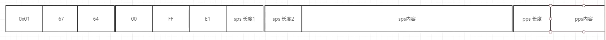
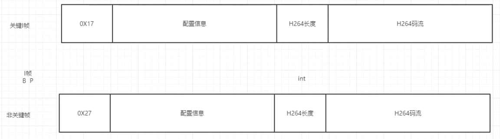

rtsp相当于tcp，保证不会有数据丢失；rtmp相当于udp，对并发支持的比较好

rtmp包装sps和pps（0x01前面应该还有0x17,0x00,0x00,0x00,0x00）

rtmp包装关键帧和非关键帧

[【一文读懂】什么是RTMP协议_视频rtmp-CSDN博客](https://blog.csdn.net/Bl_a_ck/article/details/146311188)

[深度解析RTMP直播协议：从保姆级入门到高级优化！ – PixPark](https://pixpark.net/rtmp-protocol.html)

[RTMP 协议：为什么直播推流协议都爱用它？丨音视频基础-腾讯云开发者社区-腾讯云](https://cloud.tencent.com/developer/article/2021490)
