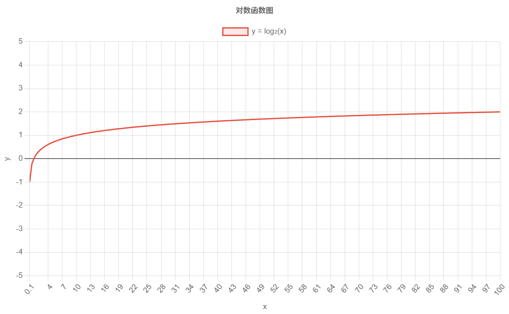

# 对数频带理解与实践

## bin是什么

- 阅读书籍

  书里 Figure 8-7 附近：作者用“在频点之间画分界线”的方式说明每个频点代表的频带，例如第 5 点代表 4.5~5.5、第 6 点代表 5.5~6.5，并给出“等效带宽”的表述。

- 练习

  给定采样率 $F_s$、FFT 长度 $N$：

  - 写出 bin 中心频率：$\;F_k = k\frac{F_s}{N}$
  - 写出 bin 覆盖区间（常用理解）：$[F_k-\tfrac{1}{2}\Delta F,\;F_k+\tfrac{1}{2}\Delta F]$，其中 $\Delta F=\frac{F_s}{N}$

- 结论

  FFT 的 bins 在频率轴上是**线性均匀**排布。

  “把 bins 分到频带里”本质上是在对这条线性频轴做**重新分桶（re-binning）**。

## 对数频带理解

我已经掌握了“bin 是线性均匀的频率小格”。本节要做的，就是解释：**为什么我们不直接用这些线性小格画 UI，而要把它们重新分桶成对数频带**。

------

### 线性频带 vs 对数频带：

差别不是“准不准”，而是“怎么分配显示资源”

#### 线性频带（linear bands）

把 20 Hz 到 20 kHz 均匀切成 B 段，每段宽度相同：
$$
f_{end}-f_{start}=\text{常数}
$$
结果：

- 每个频带覆盖的 Hz 数一样多。
- 低频（20~200 Hz）只占很少几个频带；高频（10k~20k）占很多频带。
- 对“音乐可视化”来说，低频细节会被挤在很少的条里，高频条反而很多。

#### 对数频带（log bands）

把频率轴先变成对数坐标（例如 $\log_{10}(f)$），再均匀切 B 段。等价于让每段满足固定倍数：
$$
\frac{f_{end}}{f_{start}}=\text{常数}
$$
结果：

- **低频频带很窄（Hz 小）**，所以低频被“放大”显示；
- **高频频带很宽（Hz 大）**，所以高频被“压缩”显示；
- 视觉上更符合人耳对音高的感知方式。

------

### 为什么听感更偏“对数”

第 22 章用钢琴键盘解释这个直觉：

- **一个八度（octave）= 频率翻倍**：从 100 Hz 到 200 Hz 是一个八度，从 1 kHz 到 2 kHz 也是一个八度。backmat_合并
- 钢琴键盘每跨同样数量的键，频率比例差不多是固定倍数，因此它本质是“对数频率刻度”。backmat_合并

书里还强调一个对你做 UI 特别重要的结论：

- **很多音频信息更像是按“八度”分布的**：例如 50–100 Hz 这一段（一个八度）携带的信息量，和 10–20 kHz 这一段（也是一个八度）在同一量级。

这句话翻成 UI 语言就是：

> 如果你用线性频带，10–20 kHz 会分到很细很多条，但它们“信息密度”并不一定比 50–100 Hz 更高；
>  用对数频带，相当于给每个“八度”差不多相同的显示资源，更均衡。

------

### “八度直觉”映射到代码

使用对数的线性增加，表示一个八度的上升

你的代码：

```
logMin = log10(minFreq);
logMax = log10(maxFreq);

f = 10^( logMin + ratio * (logMax - logMin) );
```

它做的事可以用一句话描述：

> 你不是在 Hz 轴上均匀分段，而是在 $\log_{10}(Hz)$ 轴上均匀分段。

这样做的直接数学后果是：

- 每个频带的上边界与下边界之比是常数：

$$
\frac{f_{i+1}}{f_i}=\left(\frac{f_{max}}{f_{min}}\right)^{1/B}
$$

这就是“对数频带”的精确定义之一。

------

### 最终直觉

当你用对数频带做频谱条：

- **低频条多**：更容易看到鼓点、贝斯、低频谐波的变化；
- **高频条少**：高频细节被合并（但对听感/可视化往往足够）；
- 条形图看起来会更“像音乐 App”，因为显示资源分配更接近听觉分辨方式。

把“对数频带”从直觉变成**可计算的频带边界公式**，并能一眼看懂你代码里的 `logMin/logMax` 在做什么。

对数频带的核心要求是：**每个频带的频率跨度按“倍数”增长，而不是按“差值”增长**。也就是说每一段满足近似恒定的比例：
$$
\frac{f_{i+1}}{f_i}=\text{常数}
$$
这对应书里“八度 = 频率翻倍”的对数刻度直觉。backmat_合并

------

## 对数频带的公式

1. 你需要先确定 3 个输入

   1. 最小频率 $f_{\min}$（例如 20 Hz）
   2. 最大频率 $f_{\max}$（例如 min(20000, Nyquist)）
   3. 频带数 $B$（也就是 `outBars.size()`）

   要求：$f_{\min}>0$ 且 $f_{\min}<f_{\max}$。

------

2. 两个等价的“频带边界”公式

   - 你代码的 logMin/logMax 写法（log 轴等分）

     先算：
     $$
     \log f_{\min}=\log_{10}(f_{\min}),\quad \log f_{\max}=\log_{10}(f_{\max})
     $$
     第 $i$ 个边界点（i=0..B）在 log 轴上等分：
     $$
     \log f_i=\log f_{\min}+\frac{i}{B}(\log f_{\max}-\log f_{\min})
     $$
     再映射回 Hz：
     $$
     f_i=10^{\log f_i}
     $$
     你的代码正是这么做的：

     ```
     logMin = log10(minFreq);
     logMax = log10(maxFreq);
     f_i = pow(10.0, logMin + (i/B)*(logMax-logMin));
     ```

   - 更直观的“等比数列”写法（强烈建议你记住）
     $$
     f_i = f_{\min}\left(\frac{f_{\max}}{f_{\min}}\right)^{i/B},\quad i=0..B
     $$
     这一条直接告诉你：频带边界是一个**等比序列**。

   - 我们这么理解

     先看一个对数图，y轴表示对数频率，x轴表示真实的频率

     

     对数频率的线性增加，也就是y从1->2->3->4...，体现在x轴上是100->1000->10000->100000...

     画在bar里，就是100->1000Hz的振幅放在一个band里，1000->10000Hz的振幅放在下一个band里

------

3. 你马上能得到一个关键常数：每个频带的固定倍数 r

   令
   $$
   r=\left(\frac{f_{\max}}{f_{\min}}\right)^{1/B}
   $$
   那么
   $$
   f_{i+1}=f_i\cdot r
   $$
   这就是“对数频带”的本质：**每走一个 band，频率乘同一个倍数**。

------

4. 一个具体数值例子（帮你建立直觉）

   假设 $f_{\min}=20$，$f_{\max}=20000$，$B=10$：
   $$
   r=(20000/20)^{1/10}=1000^{0.1}\approx 1.995
   $$
   于是边界大致是：

   - 20
   - 39.9
   - 79.6
   - 158.9
   - 317.0
   - 632.5
   - 1261.9
   - 2517.9
   - 5023.8
   - 10023.7
   - 20000

   你会看到：几乎每个频带都“翻倍”，这就是八度刻度的数学实现。

------

5. 频带的“中心频率”怎么定义（用于标注/理解）

   对数频带通常用**几何中心**当中心频率（比算术平均更合理）：
   $$
   f_{c,i}=\sqrt{f_i\cdot f_{i+1}}
   $$
   它在对数坐标里正好位于中点。

------

- 频带边界变成 bin

我么已经会算除了对数频带对应的物理频率边界 $f_i$ 了，接下来就是把它转成 FFT bin 索引，方便我们后续进行聚合：
$$
k = \frac{f}{F_s}*N
$$
代码中常用：

```c++
int binStart = static_cast<int>(fStart / sampleRate * m_fftSize);
int binEnd = static_cast<int>(fEnd / sampleRate * m_fftSize);
```

并 clamp 到 `[0, N/2]`。后续再聚合[binStart, binEnd]范围内的FFT离散结果

但是如果`fStart`和`fEnd`相隔很近，可能会使得其正好落在离散图中的两个采样点之间，这会使得计算出来的binStart==binEnd，对于这种情况，我们进行线性插值处理。