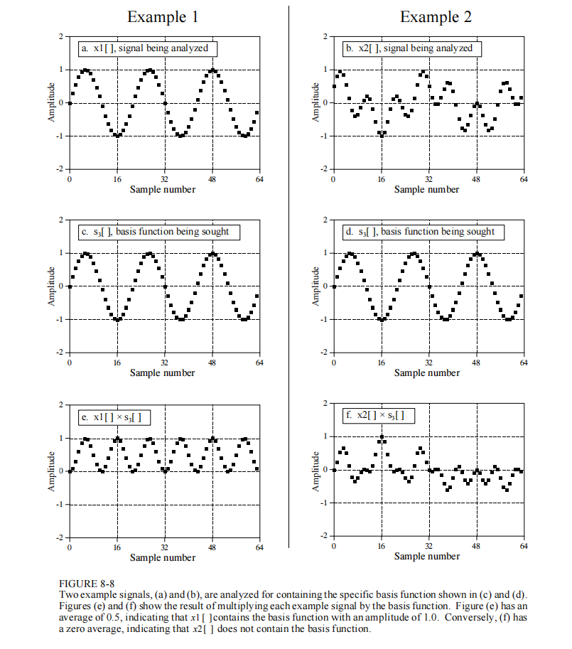
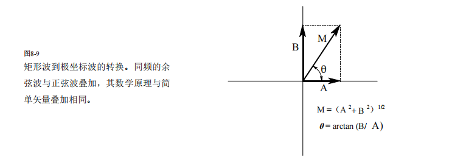
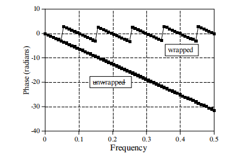
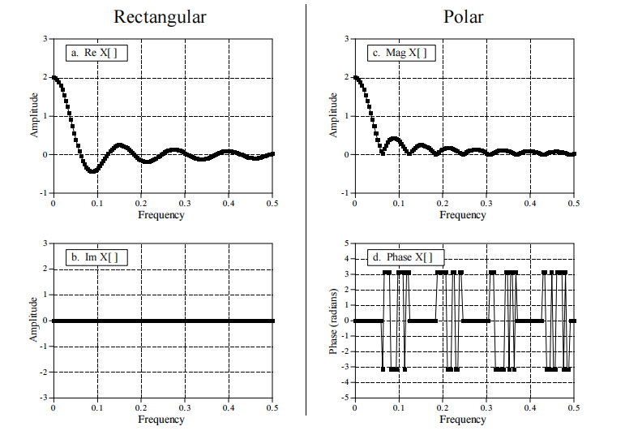

## **DFT 分析算法中的振幅缩放 P153**

### **1. 上下文背景 (Context)**

当我们使用 **实数 DFT (Real DFT)** 的分析方程（Correlation Algorithm）计算频域数据时，核心操作是将**输入信号**与**基函数（正弦/余弦探针）**进行点乘并求和。

分析公式：

$$ReX[k] = \sum_{i=0}^{N-1} x[i] \cdot \cos\left(\frac{2\pi k i}{N}\right)$$

核心问题：

算出来的 $ReX[k]$ 数值往往非常大。为了得到信号真实的物理振幅（如电压/音量），我们需要理解这个累加值的放大倍数，并在逆变换或频谱显示时进行归一化（Normalization）。

------

### **2. 物理机制：为什么是 $N/2$？**

对于绝大多数频率，放大倍数是 $N/2$。这是因为交流信号的**平均功率**特性。

- **共振原理**：当输入信号与探针频率一致时，相乘结果本质上是 $\cos^2(\theta)$。
- **能量贡献**：$\cos^2(\theta)$ 的波形在 $0$ 到 $1$ 之间震荡，其**平均高度是 0.5**。
- **结论**：虽然累加了 $N$ 个点，但有效贡献只有 $50\%$。

------

### **3. 详细对照表 (The Table)**

| **频率成分 (k)**             | **物理场景描述**                                | **采样点与探针的相互作用**                                   | **数学本质 (∑Product)** | **DFT求和结果**            | **代码中的归一化** |
| ---------------------------- | ----------------------------------------------- | ------------------------------------------------------------ | ----------------------- | -------------------------- | ------------------ |
| **直流分量** ($k=0$)         | **DC Offset** 信号是一条水平直线。              | 信号是常数，探针也是常数 $1$。 每个点都实打实地贡献了数值。  | $\sum (1 \times 1) = N$ | **$N \times A$**           | `ReX[0] / N`       |
| **奈奎斯特频率** ($k=N/2$)   | **Nyquist Freq** 最高频震荡 ($+1, -1, \dots$)。 | 正好采在波峰和波谷。 没有“过零点”来拉低平均值。 负负得正，每个点都贡献最大值。 | $\sum (1 \times 1) = N$ | **$N \times A$**           | `ReX[N/2] / N`     |
| **常规频率** ($0 < k < N/2$) | **Normal Freq** 绝大多数有效频率。              | 采样点覆盖波峰、波谷和**过零点**。 波峰处贡献 1，过零点处贡献 0。 平均贡献被拉低到一半。 | $\sum \cos^2 = 0.5 N$   | **$\frac{N}{2} \times A$** | `ReX[k] / (N/2)`   |

> **注**：$A$ 代表信号在时域的真实振幅。

------

### **4. C++ 音视频开发实战启示**

在实际工程（使用 FFTW 或 FFmpeg）中，这通常对应于**频谱图绘制**或**音频合成**的逻辑。

场景一：绘制频谱图 (Audio Visualization)

你需要展示真实的音量大小，因此必须除以缩放因子。

```c++
// 假设 fft_out 是 FFT 库计算出的复数结果
// N 是采样点数 (frame_size)

for (int k = 0; k <= N/2; ++k) {
    // 1. 计算模长 (Magnitude)
    float raw_mag = sqrt(fft_out[k].re * fft_out[k].re + fft_out[k].im * fft_out[k].im);
    
    // 2. 归一化 (根据表格规则)
    float true_amplitude;
    if (k == 0 || k == N/2) {
        true_amplitude = raw_mag / N;      // 特例：除以 N
    } else {
        true_amplitude = raw_mag / (N/2);  // 常规：除以 N/2
    }
    
    // 3. 转换为分贝 (dB) 用于渲染
    float db_value = 20 * log10(true_amplitude);
    render_bar(k, db_value);
}
```

场景二：逆变换合成 (IDFT)

如果你手写 IDFT，公式通常自带一个 $1/N$ 的系数，但这只能还原“数学上的值”。要完全还原原始波形，必须严格遵守上述规则，或者确保你的 FFT 库文档中说明了它内部的 Scaling 策略（注：FFTW 默认是不做归一化的，逆变换后结果会放大 $N$ 倍，需要手动除以 $N$）。

## DFT 窗口内信号不满时的振幅计算 P159

参考章节：Chapter 8 (DFT Basics), Chapter 9 (Applications of the DFT - Stationarity), Chapter 11

关键公式：Analysis Equation (Table 8-2), Amplitude Normalization (Eq. 8-3)

### 1. 问题场景

假设进行一次 DFT 分析，参数如下：

- **DFT 长度 (N)**：1024 点。
- **输入信号 $x[i]$**：非平稳信号（Non-stationary）。
  - `0 ~ 511`：存在单一频率的标准余弦波，真实振幅 $A_{real} = 1.0$。
  - `512 ~ 1023`：静音（数值为 0）。
- **疑问**：计算出的归一化振幅 $\overline{ReX}[k] = ReX[k] / (N/2)$ 会是多少？

### 2. 核心结论

**计算结果会变小，且恰好是真实振幅的一半。**

- **计算值**：$\mathbf{0.5}$
- **真实值**：$1.0$

### 3. 数学推导

根据 Chapter 8 的 **Analysis Algorithm**，DFT 的实部计算是全窗口的累加求和：

$$ReX[k] = \sum_{i=0}^{N-1} x[i] \cdot \cos\left(\frac{2\pi k i}{N}\right)$$

将 $N=1024$ 的求和过程拆分为两部分：

1. **前半段 ($i = 0 \to 511$)**：
   - 信号与探针频率一致（共振）。
   - 平均贡献为 $0.5$（$\cos^2$ 的均值）。
   - 局部累加值 $= \text{点数} \times \text{平均值} = 512 \times 0.5 = \mathbf{256}$。
2. **后半段 ($i = 512 \to 1023$)**：
   - 信号 $x[i] = 0$。
   - 局部累加值 $= \sum (0 \cdot \cos) = \mathbf{0}$。
3. **最终归一化 (Normalization)**：
   - 总 $ReX[k] = 256 + 0 = 256$。
   - 缩放因子 (Scaling Factor) $= N/2 = 512$。
   - **最终振幅** $\overline{ReX}[k] = \frac{256}{512} = \mathbf{0.5}$。

### 4. 书本原理分析

#### A. 平稳性假设

根据 **Chapter 9**，DFT 假设输入信号是**平稳的**（即在 N 个点的时间内，频率特性保持不变）。

- DFT 无法区分“前半段响”还是“全程都响但声音小”。
- 它计算的是 **整个时间窗口 N 内的平均频谱密度**。
- 因为后半段的静音拉低了整体的平均能量，所以最终算出的振幅被“稀释”了。

#### B. 频谱泄漏

这种信号的突然截断（在 $i=512$ 处从 1 突变为 0）在 DFT 看来是一个剧烈的不连续性 (Discontinuity)。

这不仅导致主峰高度减半，还会导致能量泄漏到相邻的频率 Bin 中（出现旁瓣），使得频谱图不再是一根干净的线，而是一个模糊的“山包”。我们可以看图f



解释：

1. 假设图b的X~2~[ ]中只有0-31个采样点的振幅有值，32-64的采样点的振幅值为0；

2. DFT基函数选择S~3~[ ]；

3. 则图f计算出来的结果是：0-31的采样点中有值，32-64的采样点中振幅为0；

4. 对于原来的计算结果而言，ImX[3]应该接近0，表示X~2~[ ]中没有频率为3的信号；

   但是对于新的计算结果而言，ImX[3]其实是不等于0的，表示X~2~[ ]中有频率为3的信号，这就造成了频谱泄露；

### 5. C++ 工程启示

在实际开发（FFmpeg/WebRTC）中，为了准确测量局部振幅：

1. 分帧 (Framing) 很重要（不确定性原理）：

   当我们的 $N$ 取值很大时，某些频率的信号可能在 DFT 窗口中突然停止，我们可以准确分辨不同的频率，但是无法准确计算振幅。

   当我们的 $N$ 取值很小时，信号填满整个 DFT 窗口的概率很大，我们可以准确计算振幅，但是无法分辨不同的频率。

2. **加窗 (Windowing) 是必须的**：

   - 如果必须截断信号，为了减少截断带来的高频噪声（泄漏），必须在 DFT 之前乘以窗函数。
   - **Hamming**: 分辨频率用。
   - **Blackman**: 检测信号存在用（低泄漏）。
   - **Flat-top (Figure 9-5d)**: **专门用于准确测量振幅**。

## DFT 的极坐标表示法 P161

参考章节：Chapter 8 (The Discrete Fourier Transform) - Polar Notation

关键公式：Rectangular-to-Polar (Eq. 8-5), Polar-to-Rectangular (Eq. 8-6)

前情提要：

逆DFT公式可以写成：
$$
x[i] = \sum_{k=0}^{N/2} \left( \overline{ReX}[k] \cos( \frac{2\pi k i}{N} ) + \overline{ImX}[k] \sin( \frac{2\pi k i}{N} ) \right)
$$
其中：

1. 对于直流分量 ($k = 0$)
   - $\overline{ReX}[0] = \frac{ReX[0]}{N}$
   - $\overline{ImX}[0]$：不存在（总是 0）

2. 对于中间频率 ($k = 1$ 到 $N/2 - 1$)
   - $\overline{ReX}[k] = \frac{ReX[k]}{N/2}$
   - $\overline{ImX}[k] = \frac{\mathbf{-}ImX[k]}{N/2}$  <span style="color:red">← 注意这里的负号！备菜时就先把符号反转了。</span>

3. 对于 Nyquist 频率 ($k = N/2$)
   - $\overline{ReX}[N/2] = \frac{ReX[N/2]}{N}$
   - $\overline{ImX}[N/2]$：不存在（总是 0）

本节的内容实际上就是将`A*cos(x)+B*sin(x)`转换为`M*cos(x+θ)`，这两个式子都代表着$x_k[]$

### 1. 核心概念

DFT 的原始输出是 直角坐标 (Rectangular Notation) 形式，即实部 $ReX[k]$ 和虚部 $ImX[k]$。

虽然直角坐标方便计算机做加法运算，但它对人类不直观（很难直接看出“哪个频率声音最大”）。

**极坐标 (Polar Notation)** 将频域数据转换为更有物理意义的两个量：

- **Magnitude (MagX)**：幅值/模。代表该频率成分的**能量强度**。
- **Phase (PhaseX)**：相位。代表该频率成分的**时间对齐/偏移**。

【特别注意】极坐标表示法是**将频谱图从直角坐标系转换到了极坐标系**，和时间无关

### 2. 转换公式

#### A. 从直角坐标转极坐标

对于图8-9



我们在一个二维平面上：

- **X 轴** 是 `ReX[k]` (Real part)。

- **Y 轴** 是 `ImX[k]` (Imaginary part)。

- 这两个值构成了一个点 $(ReX[k], ImX[k])$。

  特别注意：Equation 8-4 所示，虚部计算公式为 $ImX[k] = - \sum x[i] \sin(\dots)$。也就是说 $M$ 会进行顺时针旋转，

显然可以得到： **Equation 8-6**。

1. 计算幅值 (Magnitude):

   $$MagX[k] = \sqrt{ ReX[k]^2 + ImX[k]^2 }$$

   (几何意义：复平面上点到原点的距离)

2. 计算相位 (Phase):

   $$PhaseX[k] = \arctan\left( \frac{ImX[k]}{ReX[k]} \right)$$

   (几何意义：复平面上向量与实轴的夹角)

3. 公式

   对于输入信号x[ ]，其各频率下的完整频谱信息（并非物理幅值）

   用直角坐标系可以表示为：$(ReX[k], ImX[k])$ —— 适合加减运算

   用极坐标系可以表示为：$(MagX[k], PhaseX[k])$ —— 适合人类阅读（分离了**强度**与**相位**）

效果图：


矩形坐标与极坐标频域示例。本示例展示了以矩形坐标和极坐标两种形式呈现的频域图。与之相

比，极坐标通常能帮助人类观察者更直观地理解信号特性，而矩形坐标则多用于数学计算场景。特

别需要注意的是，相位域的首尾样本必须为零（也就是说在极坐标系中，第一个样本必须从$\theta=0$开始，），这与虚部的处理方式完全一致。

#### B. 从极坐标转直角坐标

对应书中 **Equation 8-6**。如果要在频域修改信号（如 EQ 调节）后再转回时域，通常需要这一步。

- $ReX[k] = MagX[k] \cdot \cos(PhaseX[k])$
- $ImX[k] = MagX[k] \cdot \sin(PhaseX[k])$

### 3. 书本原理重点

1. **人类视角 vs. 机器视角**：

   - 直角坐标适合**线性系统运算**（如加法、乘法）。
   - 极坐标适合**观察和分析**（如画频谱图）。

2. **相位的范围**：

   - 相位是用**弧度 (Radians)** 表示的。
   - 取值范围通常在 $-\pi$ 到 $+\pi$ 之间（即 $-3.14$ 到 $+3.14$）。

3. DFT 的合成方程（极坐标版）：

   通过极坐标，我们可以把 IDFT (合成方程) 理解为：将 $N/2+1$ 个余弦波相加，每个余弦波都有自己的振幅 ($MagX$) 和相移 ($PhaseX$)。
   $$
   x_k[i] = \underbrace{\left( \frac{MagX[k]}{N/2} \right)}_{\text{信号强度 (振幅)}} \cdot \cos\left( \underbrace{\frac{2\pi k i}{N}}_{\text{频率}} + \underbrace{PhaseX[k]}_{\text{初相}} \right)
   $$
   其中：

   1. 该公式仅在0 < k < N/2时成立，当k=0||k=N/2时，信号强度应当除以N而非N/2

   2. **$x_k[i]$**：频率为 $k$ 时，时域信号的第 $i$ 个采样点。

   3. **$PhaseX[k]$**：频率为 $k$ 时的初相。

### 4. C++ 工程启示

在 C++ 音视频开发中，实现 Equation 8-5 时有三个关键注意事项：

#### A. 必须使用 `atan2`

书中明确警告：计算相位时不能简单使用 `atan(Im/Re)`。

- `atan` 只能处理 -90° 到 +90°，且当 $ReX=0$ 时会除零崩溃。
- **必须使用** `std::atan2(ImX[k], ReX[k])`，它能正确处理所有象限（全圆 $2\pi$）和分母为零的情况。

#### B. `MagX` 不是物理振幅

千万不要直接把 $MagX[k]$ 当作电压或音量显示。

- **$MagX[k]$**：是相关性的总和（未归一化）。
- **物理振幅 ($A_{peak}$)**：必须根据之前的笔记进行归一化。
  - 对于直流 ($k=0$) 和 Nyquist ($k=N/2$)：`Amp = MagX / N`
  - 对于其他频率：`Amp = MagX / (N/2)`

#### C. 代码实现范例

```c++
#include <cmath>
#include <vector>

// 假设已有 ReX 和 ImX
void convert_to_polar(const std::vector<double>& ReX, 
                      const std::vector<double>& ImX,
                      std::vector<double>& MagX, 
                      std::vector<double>& PhaseX) {
    int K = ReX.size(); // N/2 + 1
    MagX.resize(K);
    PhaseX.resize(K);

    for (int k = 0; k < K; ++k) {
        // 1. 计算 Magnitude (推荐用 std::hypot 防止中间值溢出)
        // 对应 Eq. 8-5 上半部分
        MagX[k] = std::hypot(ReX[k], ImX[k]);

        // 2. 计算 Phase (必须用 atan2)
        // 对应 Eq. 8-5 下半部分
        // 结果范围是 [-π, +π]
        PhaseX[k] = std::atan2(ImX[k], ReX[k]);
    }
}
```

## 极坐标系的困扰 P164

### 困扰4 极小幅值的相位

1. 问题的现象

   想象你正在处理一段音频，其中有一段是完全的静音（Silence）。

   - **理论上**：$ReX = 0, ImX = 0 \rightarrow MagX = 0$。此时相位应该未定义。
   - **实际上**：由于背景底噪、量化误差或浮点数精度问题，$ReX$ 和 $ImX$ 绝不会是完美的 0，而是极小的随机数（例如 $0.000003$ 和 $-0.000001$）。

   **这就出事了**：当你把这两个极小的随机数扔给 atan2 时，数学函数会很尽职地为你算出一个精确的角度（比如 $-18.4^\circ$）。下一帧，噪声稍微变一点点，角度可能就变成 $+150^\circ$。

   **后果**：如果你画出相位图，你会发现在没有信号的地方（幅值极低处），相位曲线反而在疯狂剧烈震荡（看起来像杂乱的雪花）。这会严重干扰你的分析，让你误以为那里有什么剧烈的相位变化。

2. C++ 解决方案：幅值阈值

   既然这种相位是“无意义的噪声”，我们在工程上就应该**无视它**。

   解决 Nuisance 4 的标准做法是引入一个 **“静噪门限” (Squelch / Threshold)**。

   逻辑如下：

   在计算相位之前，先看一眼幅值 ($MagX$)。

   - 如果幅值**太小**（低于某个阈值），直接把相位强制设为 0（或者任何你定义的默认值）。
   - 只有当幅值**足够大**时，才真正去计算 `atan2`。

3. C++ 代码范例

   作为 C++ 开发者，你的 `RectangularToPolar` 函数的最终完全体应该是这样的：

   ```c++
   #include <cmath>
   #include <vector>
   
   void compute_polar(const std::vector<double>& ReX, 
                      const std::vector<double>& ImX,
                      std::vector<double>& MagX, 
                      std::vector<double>& PhaseX) {
       // 设定一个极小的阈值 (根据你的应用场景定，比如 1e-10 或底噪水平)
       const double THRESHOLD = 1e-10; 
   
       for (size_t k = 0; k < ReX.size(); ++k) {
           // 1. 先算幅值
           MagX[k] = std::hypot(ReX[k], ImX[k]);
   
           // 2. 解决 Nuisance 4：检查幅值是否太小
           if (MagX[k] < THRESHOLD) {
               // 如果信号太弱，认为相位是无效的，强制归零
               PhaseX[k] = 0.0; 
           } else {
               // 3. 只有信号够强，才解决 Nuisance 2 & 3 (使用 atan2)
               PhaseX[k] = std::atan2(ImX[k], ReX[k]);
           }
       }
   }
   ```

### 困扰5 相位模糊/卷绕

这个问题的核心在于：**“角度是一个圆，但计算机只能用直线来存它。”**

1. 什么是 $2\pi$ Ambiguity？

   我们在数学上知道，角度具有周期性：

   $$30^\circ \equiv 390^\circ \equiv 750^\circ \equiv -330^\circ$$

   但是，atan2 函数（以及所有标准数学库）有一个强制规则：

   它返回的结果必须被强行限制在 $-\pi$ 到 $+\pi$ 之间（即 -180° 到 +180°）。这被称为 “主值 (Principal Value)”。

2. 问题现象：相位卷绕 (Phase Wrapping)

   这就导致了一个非常讨厌的视觉假象，叫做 **“相位卷绕 (Phase Wrapping)”**。

   场景模拟：

   假设你的信号相位实际上是在平滑地**减少（即顺时针旋转）**：

   - 物理上的真实相位 (Real Phase)：

     $-170^\circ \rightarrow -175^\circ \rightarrow -180^\circ \rightarrow \mathbf{-185^\circ} \rightarrow -190^\circ \dots$

   - C++ atan2 计算出的相位 (Calculated)：

     由于 atan2 不能输出小于 $-180^\circ$ 的数值，它会自动加上 $360^\circ$ 来归一化：

     $-170^\circ \rightarrow -175^\circ \rightarrow -180^\circ \rightarrow \mathbf{+175^\circ} \rightarrow \mathbf{+170^\circ} \dots$

   如图：

   

   **发生了什么？**

   - 突变方向：数值从 负的最小值 ($-180^\circ$) 瞬间跳变到了 正的最大值附近 ($+175^\circ$)。

   - 视觉效果 (Rising Edge)：如果你画出相位波形图，你会看到一个垂直向上的断崖。
     - **逆时针 (CCW)** 产生的是 **下落** 的锯齿（从顶掉到底）。
     - **顺时针 (CW)** 产生的是 **上升** 的锯齿（从底升到顶）。

   这种充满了断崖的锯齿状图像，就叫做 **Wrapped Phase (卷绕相位)**。

3. 解决方案：相位解卷绕 (Phase Unwrapping)

   如果你只看单独某个频率的相位，卷绕没关系。但如果你要分析**相位随频率的变化趋势**（比如计算群延迟 Group Delay），或者是**相位随时间的变化**，你就必须要把这些断崖“接起来”。

   这个过程叫 **Unwrapping**。

   算法逻辑（非常适合写进 C++）：

   遍历相位数组，检查相邻两个点的差值。

   - 如果 $Current - Previous < -\pi$：说明发生了一次向下的“跳变”。**补救措施**：给 Current 加上 $2\pi$。
   - 如果 $Current - Previous > \pi$：说明发生了一次向上的“跳变”。**补救措施**：给 Current 减去 $2\pi$。

   这样做的目的是让曲线变得**连续平滑**，哪怕数值超过了 $\pi$ 也不要紧（比如让它变成 $3\pi, 5\pi$）。

4. C++ 代码实现 (Phase Unwrapping)

   这是标准的解卷绕算法，用于后处理 `PhaseX` 数组：

   ```c++
   #include <vector>
   #include <cmath>
   
   // 输入: wrapped_phase (也就是 atan2 直接算出来的结果, 有锯齿)
   // 输出: unwrapped_phase (平滑的曲线, 数值可能超过 PI)
   void unwrap_phase(std::vector<double>& phase) {
       if (phase.empty()) return;
   
       double correction = 0.0;
       
       // 从第二个点开始遍历
       for (size_t i = 1; i < phase.size(); ++i) {
           double diff = phase[i] - phase[i-1];
   
           // 检测是否存在因为 2π 导致的断崖
           if (diff > M_PI) {
               // 前一个点是 -179度，这一个点是 +179度 -> 差值很大
               // 说明这是一个假跳变，我们需要把这一段及以后的数据整体下移
                correction -= 2 * M_PI;
           } 
           else if (diff < -M_PI) {
               // 前一个点是 +179度，这一个点是 -179度
               // 说明我们需要把这一段及以后的数据整体上移
               correction += 2 * M_PI;
           }
   
           // 应用修正量（注意：修正量是累积的！）
           phase[i] += correction;
       }
   }
   ```

### 困扰6 相位跳变



直角坐标和极坐标形式的示例信号。由于幅值必须始终为正（根据定义），幅值和相位可能包含突变的不连续性和尖锐的拐角。图(d)还显示了另一个麻烦：随机噪声可能导致相位在**π**或-**π**之间快速振荡。

解释：

1. DFT 的强制规则：

   回顾 Equation 8-5 的计算公式：

   $$MagX[k] = \sqrt{ReX[k]^2 + ImX[k]^2}$$

   注意那个根号 $\sqrt{\dots}$。在实数域中，平方根的结果永远是非负的。

   这就意味着，在 DFT 的极坐标表示法中，幅值 ($MagX$) 永远不可能为负数。

2. Nuisance 6 的实际后果：相位突变

   这个强制规则导致了图表上的一个显著特征，特别是当信号频谱本身在正负之间摆动时（例如 **Sinc 函数** 或 **窗函数的旁瓣**）。

### 困扰7 垂直尖峰

它指的是：**当你把相位画成图表时，那些原本物理上挨得很近的点，因为跨越了 $\pm 180^\circ$ 的边界，在图上看起来像是发生了剧烈的爆炸（垂直尖峰）。**

1. 现象：原本的“邻居”变成了“天涯海角”

   想象一下圆周上的两个角度：

   - **角度 A**：$+179^\circ$ (接近正后方)
   - **角度 B**：$-179^\circ$ (也在接近正后方)

   物理上：这两个角度几乎是重合的，只差了 $2^\circ$。

   数学图表上：

   - $+179^\circ$ 在图表的**最顶端**。
   - $-179^\circ$ 在图表的**最底端**。

   后果：

   如果你的信号（由于微小的噪声）在 $180^\circ$ 附近抖动，相位值就会在 $+179$ 和 $-179$ 之间疯狂切换。

   你的绘图软件（如 OpenGL 或 Qt Charts）会尽职尽责地在这两个点之间画一条连线——一条贯穿整个屏幕的垂直长线（Spike）。

2. 为什么它是 Nuisance？

   这些密密麻麻的垂直尖峰（Spikes）会**彻底掩盖数据的真实趋势**。

   - 看起来像：信号在这个频率发生了剧烈的震荡。
   - 实际上：信号只是安安静静地停在 $180^\circ$ 附近，只是偶尔跨过了那条看不见的数学边界线。

   这就像是你把地球仪像桔子皮一样剥开铺平，那些住在“原本相邻的切缝边缘”的人，在地图上看起来隔了十万八千里。

3. C++ 可视化避坑指南

   作为音视频开发工程师，你在做 **Audio Visualizer (音频可视化)** 或调试工具时，如果直接 `moveTo` -> `lineTo` 画相位图，必定会遇到这个问题。

   **解决方案：断开连线 (Plotting Logic)**

   在绘制相位曲线时，不要盲目连接相邻的两点。必须加一个判断逻辑：

4. 总结 (写入笔记)

   **Nuisance 7: Spikes between $\pi$ and $-\pi$**

   - **本质**：这是相位卷绕（Nuisance 5）在**可视化图表**上的恶性表现。
   - **现象**：当相位在 $\pm \pi$ ($180^\circ$) 边界附近微小波动时，图表上会出现连接顶部 ($+\pi$) 和底部 ($-\pi$) 的剧烈垂直尖峰。
   - **误导性**：这些尖峰会让平滑的相位看起来充满了高频噪声。
   - **工程解法**：**绘图过滤**。在绘制相位曲线时，如果相邻两点的差值绝对值接近 $2\pi$（通常判断 `> \pi`），则**不绘制**这两点之间的连线，从而消除视觉上的尖峰干扰。