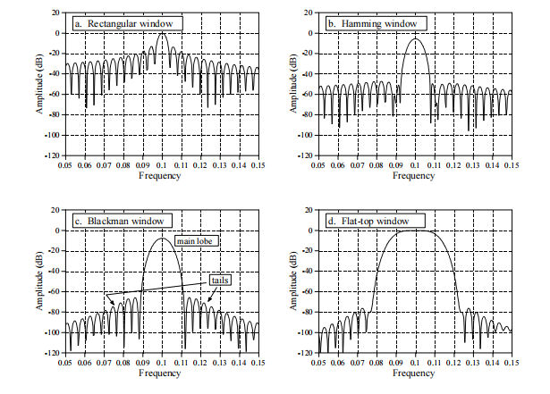

## DFT的限制 P175

在纯粹的数学理论中，一个正弦波如果从“无限久”持续到“无限久”，它的频谱才会是一条“无限窄的谱线”（像针一样细），也就是“只含单一、纯粹的频率成分”。书里也强调：这种“无限长信号/无限细谱线”无法放进计算机，因为计算机只能处理有限长度、有限信息。backmat_合并

为了能在计算机里做频谱分析（DFT/FFT），书中实际上强调必须做两件事，它们分别对应两种“限制/失真来源”，并共同引出“频率分辨率”的概念：

------

- 方式一：截取有限长度（windowing / truncation）→ 产生主瓣 + 旁瓣拖尾（连续曲线）

  现实中我们只能取一段有限长度的信号（哪怕你“不显式加窗”，也等价于乘了一个矩形窗）。这样做会把原本“无限细的针状谱线”变成一条**连续的频谱曲线**：中心是主瓣（变宽），两侧带有许多旁瓣形成的拖尾（tails）。书里明确说：只使用原始信号的一部分，会使峰值变宽并加上由旁瓣组成的 tails，这是不可避免的。backmat_合并
   并且书里强调：频谱在本质上是**连续曲线**，不是离散点。

  > 这一层的结论：
  >  **“主瓣多宽、旁瓣多高”主要由“有效信号长度”和“窗函数类型”决定**，它决定了你理论上能把多近的两个频率分开（峰会不会糊在一起）。

------

- 方式二：DFT 只能给出有限个离散频点（对连续曲线取样）→ 看到的是离散频谱图

  即便频谱是一条连续曲线，DFT/FFT 的输出也只能是有限个点：从 $k=0$ 到 $k=N/2$ 的一串离散样本（bins/points）。书里说：为了在计算机里表示频谱，需要“选择 N 个点”，其效果就是在那条连续频谱曲线上“采样”。backmat_合并

  因此：

  - 如果 N 很大（例如补零让 DFT 点数变大），频域采样点更密，你能更清楚地“描出”那条连续曲线的峰与谷。
  - 如果 N 比较小或等于窗长，采样点稀疏，你看到的就可能是“高高低低、不规则的拖尾柱子”，这取决于采样点落在连续曲线的峰谷哪里。backmat_合并

  > 这一层的结论：
  >  **DFT 点数（以及补零）主要影响“频域采样密度/读峰精度”，而不是改变连续频谱曲线本身**。书里也用补零例子强调：补零不会改变频谱形状，只是提供更多频域采样点，对分开近峰的能力提升有限。backmat_合并

------

- 这两件事共同引出“频率分辨率”

  书中的“频率分辨率”可以理解为两层含义叠加：

  1. **真实可分辨能力**：由有效信号长度 + 窗函数（主瓣宽度）主导；频率越接近，需要越长的信号段才能判断有两个频率。backmat_合并
  2. **离散频点间距/采样密度**：由 DFT 点数决定；点越密越容易看清曲线、找峰顶，但不改变主瓣旁瓣的“真实形状”。

### 情景模拟

设：$F_s=2048\text{ Hz}$

- 场景 A：$N=1024$，信号 $F=10\text{ Hz}$，不加窗

  1. bin 间隔：$\Delta F = 2048/1024 = 2\text{ Hz}$

  2. 理想位置：
     $$
     k_0=\frac{FN}{F_s}=\frac{10\cdot1024}{2048}=5
     $$
     是整数 → 相干采样（存在频率为 $F_k$ 的基函数和输入信号的时域图保持一致）

  3. 现象：

     - 离散谱（看正频率）基本只有 $k=5$（10 Hz）显著，其它 bin 近 0（数值误差除外）
     - “连续频谱曲线层面”仍可认为存在主瓣/旁瓣结构，但离散采样点刚好踩在旁瓣谷值上，所以看起来“很干净”。

- 场景 B：$N=1024$，信号 $F=11\text{ Hz}$，不加窗

  1. 理想位置：
     $$
     k_0=\frac{11\cdot1024}{2048}=5.5
     $$
     非整数 → 非相干采样

  2. 现象：

     - 离散谱：$k=5$（10 Hz）与 $k=6$（12 Hz）会比较大，但**不止这两个**，会出现拖尾扩散到更多 bin。

- 场景 C：在场景 B 基础上，加窗（仍 $N=1024$）
  1. 主峰仍在 11 Hz 附近（仍夹在 10/12 Hz 之间）
  2. 现象变化（典型）：
     - 拖尾（旁瓣）更低 → 看起来“更干净”
     - 主瓣更宽 → 频率分辨率变差
  3. 仍然没有“正好 11 Hz 的 bin”（因为频点仍是 0、2、4、… Hz）

- 场景 D：在场景 C 基础上，零填充到 $N'=2048$

  1. 新的 bin 间隔：
     $$
     \Delta F'=\frac{2048}{2048}=1\text{ Hz}
     $$

  2. 同一个真实频率 $F=11\text{ Hz}$ 的理想位置变为：
     $$
     k_0'=\frac{FN'}{F_s}=\frac{11\cdot2048}{2048}=11
     $$
     **注意：峰的位置应该跟着 $N$ 变（从 5.5 变 11），不是固定用旧的 5.5/102.4 去除以新 $N'$。**

  3. 现象：

     - 离散谱上会出现正好 11 Hz 的 bin（$k=11$），主峰读数通常更接近峰顶
     - 拖尾仍存在（非相干的本质没有被“补零”消除），只是频域采样点更密、更容易看清主瓣/旁瓣曲线，也更利于插值估峰。
     - 所以我们填充0拓展N之后，由于没有引入额外的能量，DFT的连续频谱图不会变，但是根据公式，$\Delta F$会变小，bin也会变小，所以我们的离散频谱图的样本点之间会更加密集，能更好地展示出频率分布

“面积近似相等”应怎么表述才严谨

- 对非相干采样：用有限离散点去近似连续曲线积分，本质是数值积分问题 → **只能近似**。
- 零填充加密频域采样点 → 积分近似通常更好，但不保证严格相等。
- 若要比较“守恒/更稳定”的量，优先在功率/能量意义上比较（$|X|^2$ 并乘 $\Delta F$），并统一归一化口径。

## 前置基础 P175

### 1. 物理频率、采样率、归一化频率

- 物理频率（Hz）：$F$ = 每秒多少个周期（cycles/sec）

- 采样率：$F_s$ = 每秒采样多少点（samples/sec），采样周期 $T_s = 1/F_s$ 表示每隔 $T_s$ 采一个样本点

- 在连续时间下的，频率为 $F$ 的正弦波通常写作：
  $$
  x(t)=A\sin(2\pi Ft+\phi)
  $$

- 如果我们把上面的连续信号按 $t=nT_s=n/F_s$ 采样，可得：
  $$
  x(t)=A\sin(2\pi Ft+\phi)\ \Rightarrow\ x[n]=A\sin\!\left(2\pi\frac{F}{F_s}n+\phi\right)
  $$
  这一步直接引出 **归一化频率**。

- 归一化频率（cycles/sample）：
  $$
  f=\frac{F}{F_s}
  $$
  于是离散信号写成：
  $$
  x[n]=A\sin(2\pi f n+\phi)
  $$
  书里也明确说过频谱图的一种常用的横轴标法是使用“**归一化频率**，范围是 0 到 0.5”，公式 $f=k/N$。

  由此可以通过频谱图的x坐标，确定输入信号的频率

- 或者我们可以使用角频率：
  $$
  \omega = 2\pi f = 2\pi \frac{F}{F_s}\quad
  $$

### 2. DFT 频点索引 $k$ 与频率轴

- 对 **N 点 DFT**，基函数写作：
  $$
  \cos\left(2\pi\frac{k}{N}n\right),\ \sin\left(2\pi\frac{k}{N}n\right)
  $$
  其中 $k$ 决定频率。特别注意：**$k$ 等于在 N 个点里完成的周期数，但它不是频率！**

- 我们重新看看上面的归一化频率的公式：

  $N$ 点 DFT 的第 $k$ 个频点对应：
  $$
  f_k=\frac{k}{N} = \frac{F_k}{F_s} \Rightarrow\
  F_k=f_k \cdot F_s
  $$
  其中 $f_k$ 表示第k个频点对应的归一化频率，$F_k$ 表示第k个频点对应的物理频率

### 3. 频率分辨率

- 定义：频率分辨率指的是**能不能把两个很接近的频率分开看成两个峰**（以及峰到底有多“窄”）。

- 频率分辨率计算公式：
  $$
  \Delta F=\frac{F_s}{N}
  $$
  这个公式是指：对于每一个频点 $k$，它所代表的频率范围，负责捕获输入信号 $F_k\pm 0.5 \Delta F$ 范围内的能量，对于这样一个区间，我们通常叫bin

  显然第 $k$ 个 Bin 对应的物理频率和第 $k$ 个频点对应的物理频率一致，只不过bin代表的是一个区间。

- 影响频率分辨率的三个因素

  1. **输入信号的长度 L**

     **两频率越接近，需要越长的信号段才能判断“其实有两个频率”**；也就是说，“信号长度限制频率分辨率”。

     从时域图上来看，频率相近的两个波形图，只有在时间 $t$ 足够大时，才能体现出明显的相位差。

     但是：**输入信号长度不必等于 DFT 长度！**这引出了第二个因素：

  2. **DFT 的长度 N**

     我们可以通过给输入信号补0，来延长DFT的长度，但是：

     - 由于没有引入额外的能量，所以DFT的**连续频谱图不会变**
     - 根据频率分辨率公式，$\Delta F$ 会变小，体现在离散频谱图上，对连续频谱图的采样间隔会变小，bin的宽度会变小，提供更多频域采样点；分开相近峰的能力只会“略微”变好。

  3. **窗函数**

     

     作用：

     **在做 DFT/FFT 前把有限长度信号“平滑地截断”，从而控制频谱泄露（旁瓣拖尾）与频率分辨率（主瓣宽度）之间的权衡**。

     具体来说：

     1. **降低频谱泄露（旁瓣/拖尾）**
         时域直接截断（矩形窗）会在边界产生突变，频域表现为明显的旁瓣拖尾；换用汉明、汉宁、布莱克曼等窗可显著压低旁瓣，使拖尾更小、更“干净”。

     2. **代价：主瓣变宽 → 频率分辨率下降**
         窗越“强”地压旁瓣，主瓣通常越宽，两个靠得很近的频率更容易糊在一起。

     3. **用于“测幅”时的特殊窗（如平顶窗）**
         平顶窗的设计目标是让谱峰顶部更平坦，减少“采样点没踩到峰顶导致幅值偏低”的读峰误差，但代价是主瓣更宽、分辨率更差。