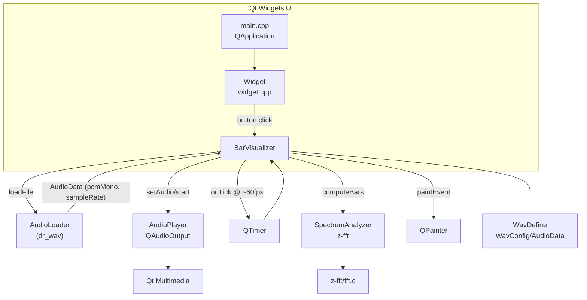
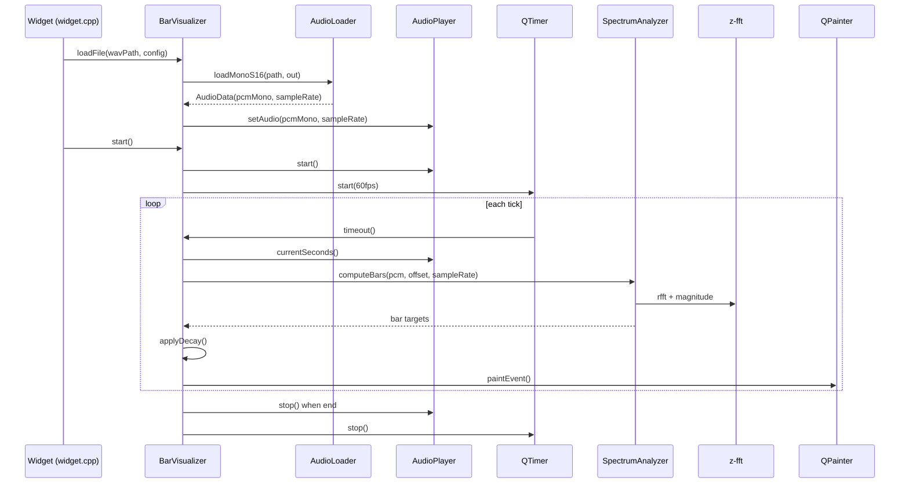

### 系统架构图

```mermaid
flowchart TD
    subgraph UI["Qt Widgets UI"]
        main["main.cpp<br/>QApplication"] --> widget["Widget<br/>widget.cpp"]
        widget -->|button click| visual["BarVisualizer"]
    end

    visual -->|loadFile| loader["AudioLoader<br/>(dr_wav)"]
    loader -->|"AudioData (pcmMono, sampleRate)"| visual

    visual -->|setAudio/start| player["AudioPlayer<br/>QAudioOutput"]
    player --> qtmultimedia["Qt Multimedia"]

    visual -->|onTick @ ~60fps| timer["QTimer"]
    timer --> visual

    visual -->|computeBars| analyzer["SpectrumAnalyzer<br/>z-fft"]
    analyzer --> zfft["z-fft/fft.c"]

    visual -->|paintEvent| painter["QPainter"]

    visual --- config["WavDefine<br/>WavConfig/AudioData"]
```

### 系统时序图

```mermaid
sequenceDiagram
    participant UI as Widget (widget.cpp)
    participant Vis as BarVisualizer
    participant Loader as AudioLoader
    participant Player as AudioPlayer
    participant Timer as QTimer
    participant Analyzer as SpectrumAnalyzer
    participant FFT as z-fft
    participant Painter as QPainter

    UI->>Vis: loadFile(wavPath, config)
    Vis->>Loader: loadMonoS16(path, out)
    Loader-->>Vis: AudioData(pcmMono, sampleRate)
    Vis->>Player: setAudio(pcmMono, sampleRate)

    UI->>Vis: start()
    Vis->>Player: start()
    Vis->>Timer: start(60fps)

    loop each tick
        Timer->>Vis: timeout()
        Vis->>Player: currentSeconds()
        Vis->>Analyzer: computeBars(pcm, offset, sampleRate)
        Analyzer->>FFT: rfft + magnitude
        Analyzer-->>Vis: bar targets
        Vis->>Vis: applyDecay()
        Vis->>Painter: paintEvent()
    end

    Vis->>Player: stop() when end
    Vis->>Timer: stop()

```

