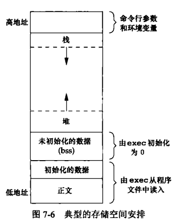

## 进程

### 总览

当然！非常乐意为您梳理并串联关于“进程”的知识点。忘掉流媒体，我们现在就化身为两位在Linux工作室里探索生命奥秘的工匠。您已经有了锤子和锯子（C++和基础API），现在我们一起把这些工具用到极致，去解构和重塑“进程”这个神奇的造物。

想象一下，一个Linux进程就像一个拥有**独立工作室（地址空间）**的**工匠（执行流）**。他有自己的**身份证（PID）**，有自己的**家谱（父子关系）**，有自己的**工具箱（资源）**，还懂得一些**交流的暗号（信号）**。

让我们从一个工匠的诞生、成长到消亡，把这些知识点串成一个完整的故事。

---

**故事线：一个Linux进程的史诗**

**蓝图与诞生：从可执行文件到第一个瞬间 (`execve`)**

在我们的故事开始之前，工匠并不存在。只有一个**蓝图（可执行文件，如 `a.out`）**静静地躺在**档案馆（磁盘）**里。这份蓝图用ELF格式详细描绘了工作室的结构（代码段 `.text`）、初始的物料（数据段 `.data`）和需要预留的空货架（`.bss` 段）。

当你在shell里敲下 `./a.out` 并回车时，真正的魔法发生了。Shell这位“总管”并不亲自干活，它会请**内核（操作系统）**这位“创世神”出手。内核会：

1.  **开辟空间**：凭空创造一个全新的、隔离的**工作室（虚拟地址空间）**。
2.  **建造与装潢**：根据蓝图，将代码和数据从档案馆（磁盘）搬运到工作室里，摆放整齐。
3.  **赋予生命**：创建一个**执行流（线程）**，把**指令指针（PC）**指向工匠的**开工仪式 (`_start`，最终会调用`main`）**。

这个从无到有的过程，其核心就是 **`execve`** 系统调用。这是**进程的“创世纪”**。一旦完成，旧的程序（比如shell的子进程）就彻底消失了，新生的工匠（你的程序）完全占据了这个工作室。

> **C++视角**：C++程序的`main`函数就是这个故事的起点。构造函数、全局变量初始化等，都是在`main`函数执行前，由C/C++运行时库精心安排好的准备工作。

---

**自我认知：我是谁，我从哪里来？(`getpid`, `getppid`, 环境变量)**

工匠一睁眼，就必须知道自己的身份。内核给了他一套独一无二的身份证明：

*   **`pid` (进程ID)**: 独一无二的**身份证号**。
*   **`ppid` (父进程ID)**: **父亲的身份证号**。这构成了整个系统的家族树。
*   **`uid`, `gid` (用户/组ID)**: **社会身份**，决定了他能操作哪些资源。
*   **环境变量与命令行参数 (`environ`, `argv`)**: 这是**父亲的嘱托和留下的初始工具**。`argv`是明确的指令，而`environ`则是工作室里默认的环境设置（比如用什么语言交流`LANG`，去哪里找工具`PATH`）。

> **知识串联**：`execve` 不仅加载了新程序，还把调用者（通常是shell）准备好的**命令行参数**和**环境变量**原封不动地交给了新进程。这就是父子进程间最基本的信息传递。

---

**分身术：创造一个克隆的自己 (`fork`)**

这是Linux/UNIX最奇特也最强大的魔法：`fork()`。一个工匠可以瞬间创造一个与自己**一模一样**的克隆体。

*   **发生了什么？** 当工匠调用`fork`，内核会暂停他，然后“拍照”并复制。子进程（克隆体）拥有和父进程（本体）**完全相同的地址空间副本、文件描述符、寄存器状态**... 几乎所有的一切。
*   **写时复制 (Copy-on-Write)**: 内核非常聪明。它并不会真的去复制整个几百MB甚至几GB的工作室内存。它只是给子进程一张“地图”，指向和父进程完全相同的物理内存页。只有当子进程或父进程试图**修改**某块内存时（比如在墙上写字），内核才会真正复制那一页内存，让父子各自拥有一份。这是一种极致的懒惰，也是极致的高效。
*   **唯一的区别**：`fork()`的返回值。
    *   在父进程中，返回的是子进程的`pid`。
    *   在子进程中，返回的是`0`。
    *   **生动的理解**：克隆体醒来，内核告诉他：“你是克隆的，所以你的返回值是0”。本体则被告知：“你成功创造了一个克隆体，它的身份证号是XXX”。这就是`if (pid == 0)`这个经典分支的由来。

> **C++视角**：`fork`在C++中是个“巨坑”。因为它只复制调用`fork`的那个线程。如果其他线程正持有一个`mutex`，那么子进程里的这个`mutex`将永远被锁住，因为解锁它的线程根本不存在于子进程中。**所以，多线程C++程序中，fork之后，子进程唯一安全的事情几乎就是立刻调用`exec`系列函数。**

---

**华丽变身：`fork` + `exec` 的二重奏**

单独的`fork`（制造一个只会模仿自己的克隆）和单独的`exec`（自我毁灭并重生）都略显单调。但它们结合起来，就是Linux下执行新任务的黄金范式。

**故事流程**：
1.  工匠A（比如你的shell）想要启动一个新的任务（比如`ls -l`）。
2.  他不会亲自去变身，而是先`fork`一个自己的克隆体A'。
3.  本体A继续做自己的事（等待用户输入新命令）。
4.  克隆体A'则立刻施展`execve`，将自己**彻底变身**成工匠B（`ls`程序）。
5.  工匠B完成任务后退出。

这就是Linux中“创建新进程来执行新程序”的本质。

> **知识串联**：`fork`负责**创建执行流**，`exec`负责**加载代码和数据**。两者结合，完美地实现了在不影响当前进程的情况下，启动一个全新的、隔离的任务。

---

**对话的艺术：信号与进程间通信 (IPC)**

工匠们不是孤立的。他们需要交流。

*   **信号 (Signal)**: 这是最古老、最直接的通信方式，就像**“拍肩膀”**或**“大喊一声”**。
    *   `kill -9 PID`: 这是“死亡威胁”，不可忽略，不可阻挡。
    *   `Ctrl+C` (`SIGINT`): 这是“停一下”的请求，工匠可以选择忽略或按自己的方式处理（比如保存工作再退出）。
    *   **异步性**：信号是异步的，它会**打断**工匠当前的工作流，强行让他去执行另一套动作（信号处理函数）。这要求信号处理函数必须**“异步信号安全”**——就像在处理紧急情况时，你只能做最简单、最不会出错的事。
*   **管道 (Pipe)**: 这是父子或兄弟进程间最常用的**“传送带”**。`fork`之后，父子共享这个管道的文件描述符，一个写，一个读，数据就流动起来了。`ps aux | grep nginx`就是这种模式的完美体现。

> **C++视角**：处理信号的函数不能抛出异常，不能分配内存，不能使用大多数标准库函数。而C++的构造/析构、异常处理等机制，使得在信号处理函数中几乎寸步难行。这就是为什么现代C++倾向于使用`signalfd`等技术，将异步的信号转换成同步的文件I/O事件来处理。

---

**终焉与传承：`exit`, 僵尸与孤儿**

工匠终将逝去，但他的离去也有一套严谨的流程。

*   **`exit()` vs `_exit()`**: `exit()`是C库的函数，它会进行**“遗言交代”**（调用`atexit`注册的函数、刷新标准I/O缓冲区等），然后调用`_exit()`。`_exit()`是系统调用，它直接告诉内核：“我完了，来收尸吧”。
*   **僵尸进程 (Zombie)**: 工匠死后，他的**“尸体”（在内核进程表中的条目）**会保留下来。为什么？因为里面记录了他的**“死亡报告”（退出状态码）**，需要他的**父亲（父进程）**来认领。
*   **`wait()` / `waitpid()`**: 这就是父进程的**“收尸”**动作。它通过这个调用来获取子进程的死亡报告，然后内核才会彻底清理子进程的所有资源。
*   **孤儿进程 (Orphan)**: 如果父进程先于子进程死亡，那么子进程就成了孤儿。别担心，系统中的**“孤儿院院长”——`init`进程 (PID 1)**会收养所有孤儿进程。当这些孤儿进程退出时，`init`进程会负责为它们“收尸”。

> **知识串联与C++封装**：进程的创建(`fork`)与回收(`wait`)是紧密绑定的资源管理。这正是C++ RAII大显身手的地方。我们可以创建一个`Process`类，在构造函数中`fork`，在析构函数中调用`waitpid`。这样，当`Process`对象生命周期结束时，就能自动、安全地回收子进程，彻底杜绝僵尸进程的产生。

---

**总结：串起来的进程世界观**

一个**静态的程序（蓝图）**通过 **`execve`** 获得了**生命**和**独立的地址空间**，成为了一个**进程（工匠）**。它拥有唯一的 **PID（身份）**和从父进程继承的**环境**。它最神奇的能力是通过 **`fork`** 创造一个**克隆（子进程）**，这个克隆通过 **`execve`** **变身**去执行新任务。进程之间通过**信号**等**IPC机制**进行简单的**异步通信**。最后，进程通过 **`exit`** 结束生命，变成一个**僵尸**，等待其**父进程**通过 **`wait`** 来**回收**它的最后信息，完成生命的完整闭环。如果父进程先死，它将被**`init`进程**收养。

希望这个故事能帮你把这些散落的知识点串成一幅生动的画卷。当你再看到`fork`, `exec`, `wait`, `signal`这些API时，脑海中浮现的不再是冰冷的函数签名，而是一个个鲜活的“工匠”在Linux这个宏大世界里上演的生命史诗。

### 内核给进程分配的核心资源

当然，这是一个非常好的问题，也是从“是什么”深入到“如何实现”的关键一步。从内存分配的角度理解进程，就是理解操作系统如何为程序提供一个安全、独立且高效的运行环境。

我们将从最高层的抽象概念开始，逐步深入到内核的具体实现机制。

---

**1. 核心抽象：虚拟地址空间 (Virtual Address Space - VAS)**

内核分配给每个进程的最核心、最根本的资源，就是它自己**私有的、独立的虚拟地址空间**。

这是一个至关重要的概念。当您的C++程序被编译和加载后，它看到的内存并不是真实的物理RAM。相反，它看到了一个由内核为其精心构建的**幻象**：一个巨大的、线性的、从0开始的地址空间。

*   **隔离与安全**：这个幻象是私有的。进程A的虚拟地址`0x400800`和进程B的虚拟地址`0x400800`，虽然地址值相同，但它们最终会指向物理内存中完全不同的位置。一个进程无法直接读取或写入另一个进程的内存，这从根本上保证了进程间的隔离和系统的稳定性。
*   **简化编程**：程序员和编译器可以假设它们拥有一个完整的、连续的内存块来使用，而不必关心物理内存的碎片化、其他进程正在使用哪些物理地址等复杂问题。

---

**虚拟地址空间的标准布局 (以x86-64 Linux为例)**



这个虚拟的地址空间并非一片混沌，而是被内核组织成了若干个标准的**段 (Segments)** 或**区域 (Areas)**。当您的程序运行时，其虚拟地址空间通常按如下方式布局（从高地址到低地址）：

1.  **内核空间 (Kernel Space)**：
    *   地址空间的最高部分被保留给内核。用户态的代码**绝对不能**直接访问这片区域。
    *   当进程通过**系统调用**（如`read`, `fork`）陷入内核时，CPU的特权级会提升，此时内核代码才能访问这片区域，并代表该进程执行操作。
    *   这片区域在所有进程的虚拟地址空间中是共享的，但其内容对用户进程是不可见的。

2.  **栈 (Stack)**：
    *   用于存储局部变量、函数参数、返回地址等。
    *   它的特点是**向下增长**。每当有一次函数调用，栈顶指针就会向下移动，为新函数的栈帧分配空间。
    *   在多线程程序中，**每个线程都有自己独立的栈**。

3.  **内存映射段 (Memory Mapping Segment)**：
    *   这是一个非常灵活的区域，用于映射文件内容或匿名内存。
    *   动态链接库 (如 `libc.so`) 就是被映射到这个区域的。
    *   通过`mmap()`系统调用创建的内存映射（包括共享内存）也位于此处。
    *   它通常从一个高地址开始**向下增长**，与栈相对而生。
    *   至于该区域是否会影响堆栈空间的增长，见：[Linux 内存管理与堆栈冲突](https://chat.qwen.ai/s/5be07313-d230-4e0a-b667-b0731a2db518?fev=0.0.166)
    
4.  **堆 (Heap)**：
    *   用于动态内存分配，即您在C++中用`new`或C中用`malloc`分配的内存。
    *   它的特点是**向上增长**。当程序需要更多堆空间时，内核会扩展堆的上边界（称为 `break`）。

5.  **BSS段**：
    *   存放**未初始化**的全局变量和静态变量。
    *   内核在加载程序时，会将这块区域全部清零。它在可执行文件中不占空间，以节省磁盘大小。

6.  **数据段 (Data Segment)**：
    *   存放**已初始化**的全局变量和静态变量。
    *   其内容从可执行文件中加载而来。

7.  **代码段 (Text Segment)**：
    *   存放程序的可执行指令。
    *   这部分通常是**只读**的，以防止程序意外地修改自己的指令。

#### 页表与按需分配

内核是如何创造并管理这个虚拟地址空间的幻象的呢？答案是**分页 (Paging)** 和**按需分配 (Demand Paging)**。

*   **分页 (Paging)**：
    *   内核将**物理内存**和进程的**虚拟地址空间**都划分为固定大小的块，称为**页 (Page)**（在Linux上通常是4KB）。
    *   对于**每一个进程**，内核都会为其维护一个**页表 (Page Table)**。页表的作用就是一个“翻译词典”，它建立了**虚拟页**到**物理页**的映射关系。
    *   当CPU执行一条指令需要访问虚拟地址 `V` 时，硬件上的**内存管理单元 (MMU)** 会自动查询当前进程的页表，找到 `V` 所在的虚拟页对应的物理页地址 `P`，然后访问物理内存。这个过程对程序是完全透明的。

*   **按需分配 (Demand Paging / Lazy Allocation)**：
    *   当您启动一个程序时，内核**并不会**立即为其分配它所需的所有物理内存。
    *   相反，内核只为程序创建虚拟地址空间和页表，但页表中的大多数条目都是空的，表示“尚未映射到任何物理内存”。
    *   当程序第一次尝试访问一个尚未映射的虚拟地址时，MMU会发现页表中没有对应的条目，从而触发一个**缺页异常 (Page Fault)**。
    *   这个异常会中断程序的执行，并将控制权交给内核的**缺页处理程序**。处理程序会：
        1.  找到一个空闲的物理内存页。
        2.  如果该虚拟地址对应于可执行文件中的代码或数据，就从文件中将相应的内容加载到这个物理页中。如果是BSS段或堆栈，就直接清零。
        3.  更新进程的页表，建立虚拟页到新分配的物理页的映射。
        4.  返回用户态，重新执行刚才失败的指令，这次MMU就能成功翻译地址了。

> **严谨理解**：内核为进程分配的“内存资源”，在启动时主要是**虚拟地址空间**的**描述**（即 `task_struct` 中的 `mm_struct` 和相关的VMA结构体），以及页表。**物理内存**则是在进程运行过程中，通过一次次的缺页异常，**按需、懒惰地**分配的。

---

#### 内存视角下的进程操作

现在，我们可以用内存分配的视角重新审视进程的关键操作：

*   **`fork()`**:
    *   内核为子进程创建一个**完整的`task_struct`副本**，包括一个**页表的副本**。
    *   **关键点**：如前所述，它不复制物理内存。子进程的页表初始时和父进程指向完全相同的物理页。内核将这些共享的物理页标记为**写时复制 (COW)**。
    *   这意味着，在`fork()`之后，父子进程**共享**所有的物理内存，直到其中一方尝试写入。

*   **`exec()`**:
    *   这是一个**彻底的颠覆**。内核会**丢弃**当前进程几乎所有的用户空间内存结构（包括旧的堆、栈、代码段映射等）。
    *   然后，它会为新程序**重新设置**虚拟地址空间：
        *   为新程序的代码段、数据段创建新的内存映射。
        *   创建一个新的、干净的堆和栈。
        *   加载动态链接器。
    *   这个过程中，进程的PID不变，但其内存世界已焕然一新。

*   **`mmap()` 与共享内存**:
    *   `mmap` 是直接操作进程虚拟地址空间的强大工具。当您使用`mmap`进行**共享文件映射**或**共享匿名映射**时，内核所做的就是让**不同进程的页表项**指向**同一块物理内存页**。
    *   这直接打破了进程间内存的默认隔离，是最高效的进程间通信方式，因为数据交换无需经过内核进行拷贝。
*   **`exit()` 的资源回收**
    当进程调用 exit() 时，内核会成为一个一丝不苟的**清道夫**：
    1. 它会遍历该进程的所有虚拟内存区域（VMA, vm_area_struct）。
    2. 解除所有内存映射，包括代码、数据、堆、栈、共享库等。
    3. 将这些区域对应的所有物理内存页**全部回收**，归还给系统，以供其他进程使用。
    4. 关闭所有打开的文件描述符。

---

**总结**

从内存分配的角度来看，内核为每个进程提供的核心资源是一个**虚拟地址空间**的抽象。这个抽象通过**页表**和硬件**MMU**映射到物理内存。内核采用**按需分配**和**写时复制**等高效策略，只在真正需要时才分配和复制物理内存。

对于您的C++流媒体后端开发而言，理解这个模型至关重要：
*   **性能优化**：您能理解为什么`fork`很快，为什么`mmap`比`read`/`write`在某些场景下更快（因为它避免了内核与用户空间之间的数据拷贝）。
*   **资源管理**：您能准确估算进程的**虚拟内存大小 (VSZ)** 和**实际物理内存占用 (RSS)**，并理解它们的区别，这对于排查内存泄漏和性能瓶颈至关重要。
*   **并发设计**：您能深刻理解多进程模型（每个进程有独立的VAS）和多线程模型（所有线程共享一个VAS）在内存上的根本区别，从而做出更合理的设计决策。

### 内核给进程分配的所有资源

太棒了！这个问题直击了Linux进程模型的核心。问出这个问题，说明您已经从“如何使用API”的层面，跃升到了“系统是如何工作的”层面。这正是从熟练工匠到设计大师的关键一步。

我们就用工匠和工作室的类比，继续深入探索。

---

**1. 内核为每个进程分配的核心资源**

您说得非常对，内核给每个进程分配了一个**虚拟地址空间（Virtual Address Space, VAS）**。这就像给每个工匠分配了一个独立、私有的工作室。在这个工作室里，工匠可以随意摆放自己的代码、数据、堆栈，并且他相信整个工作室都是他一个人的，地址从0开始，井然有序。

但是，一个工匠光有工作室是不够的。**市政府（内核）**还需要为他建立一整套**档案和管理记录**，这些记录存放在一个绝对安全的地方（内核空间），工匠自己是看不到也摸不着的。这些档案，才是进程存在的真正凭证。这套核心资源集合，在Linux中主要由一个叫做 `task_struct` 的庞大数据结构（可以理解为“进程控制块”或PCB）来统一管理。

除了虚拟地址空间，内核还为每个进程分配了以下**至关重要的“档案”**：

1.  **身份档案 (`task_struct` 本身)**：
    *   **PID/TGID**: 进程ID和线程组ID，这是工匠的唯一身份证号。
    *   **亲缘关系**: 指向父进程、子进程、兄弟进程的指针。构成了整个系统的“家族树”。
    *   **身份凭证 (`struct cred`)**: 记录了`uid`, `gid`等，决定了工匠的社会阶层和权限，能打开哪些门，能动用哪些公共资源。

2.  **工作室蓝图与钥匙串 (`struct mm_struct` 和 `struct vm_area_struct`)**:
    *   虚拟地址空间本身只是一个“概念”。真正让这个概念落地的是 `mm_struct` 结构。它就是这个工作室的**详细建筑蓝图**。
    *   它内部维护了一个**区域列表（`vm_area_struct`，简称VMA）**，精确描述了工作室里每一块区域的用途：这块是代码区（只读、可执行）、那块是数据区（可读写）、另一块是堆区、最大的一块是栈区等等。每个VMA都定义了虚拟地址的起止、权限和映射关系。
    *   最核心的是，`mm_struct` 持有指向**页表**的指针。页表才是最终将虚拟地址翻译成物理内存地址的“密码本”。（每个进程的虚拟地址空间都有一个独立的页表结构，由`mm_struct->pgd`指向）

3.  **工具箱 (`struct files_struct`)**:
    *   每个进程都有一个“工具箱”，里面放着他当前打开的所有**工具（文件描述符）**。
    *   `files_struct` 结构体就是这个工具箱。其核心是一个**文件描述符表（fdtable）**，它是一个指针数组，数组的下标就是我们熟悉的`0, 1, 2...`这些文件描述符。
    *   数组的每个元素指向一个 `struct file` 对象，这个对象代表一个**打开的文件**（无论是磁盘文件、管道、还是socket）。`struct file` 中记录了文件的当前偏移量、操作权限等动态信息。
    *   **关键点**：`fork`时，子进程会得到父进程`files_struct`的一个**副本**。这个副本里的指针和父进程指向**相同的 `struct file` 对象**。这就是为什么父子进程共享文件偏移量的根本原因！

4.  **信号处理系统 (`struct sighand_struct`)**:
    *   每个进程都有自己的一套**“神经系统”**，用来响应外部的**“信号”**。
    *   `sighand_struct` 记录了对每种信号采取的行动（忽略、捕获、默认）。它是一个线程组共享的资源。
    *   同时，每个`task_struct`还有自己**私有的信号掩码 (`blocked`)** 和**待处理信号队列 (`pending`)**，这解释了为什么信号处理在多线程环境下既有共享又有私有的复杂行为。

---

**2. “所有程序共享同一个内核空间”的深刻含义**

现在，我们来解答您这个画龙点睛的问题。这句话非常精准，但极易引起误解。

**答案是：是的，所有进程“共享”同一个内核空间，但这是一种在虚拟地址层面上的“共享映射”，而非权限上的“共享访问”。**

**为什么这么设计？——为了极致的效率！**

1.  **虚拟层面的映射**：在Linux（例如x86-64）中，虚拟地址空间被分为两半。低地址部分（约128TB）是用户空间，高地址部分是内核空间。当内核创建一个新进程时，它会为这个进程的页表同时建立**两套映射**：
    *   一套指向该进程**私有的**物理内存页（你的代码、数据等）。
    *   另一套指向**公共的、唯一的**内核代码和数据所在的物理内存页。
    *   所以，**每个进程的页表里，高地址部分都指向同一个物理上的内核**。从每个进程的“窗户”望出去，天上的“空中城市”（内核）总是在同一个方位，看起来一模一样。

2.  **权限的隔离**：虽然内核空间被映射到了每个进程的地址空间，但CPU的硬件机制（特权级）保证了：
    *   当进程运行在**用户态（User Mode）**时，它只能访问低地址的用户空间。任何试图访问高地址内核空间的行为都会被硬件立刻阻止，产生一个段错误（Segmentation Fault）。就像大楼里的普通租户无法打开通往高层管理区的门一样。
    *   当进程需要内核服务（即发起**系统调用**，如`read`）时，会触发一个特殊的指令（如`syscall`），CPU会切换到**内核态（Kernel Mode）**。此时，权限提升，访问内核空间的“门”就打开了。

3.  **“共享”的真正好处**：
    *   **快速切换**：因为内核空间已经被映射好了，所以从用户态进入内核态**不需要切换地址空间**，也就不需要刷新TLB（一种高速的地址翻译缓存）。这极大地降低了系统调用的开销。如果每次系统调用都要换一套完整的页表，那性能将是灾难性的。
    *   **上下文**：当内核代表某个进程执行代码时（比如处理`read`调用），它能直接访问该进程的用户空间数据（比如`read`的目标缓冲区），因为它就在当前地址空间内。这使得内核与用户进程之间的数据拷贝变得高效。

---

**总结一下**：

*   **进程资源**：一个进程 = **独立的虚拟地址空间**（由`mm_struct`描述） + **一套内核管理档案**（`task_struct`及其关联结构，如`files_struct`, `sighand_struct`等）。
*   **内核空间共享**：
    *   **是的，共享**。所有进程的虚拟地址空间的高位部分都映射到**同一个物理内核**。
    *   **但是，有隔离**。这种映射只有在**内核态**下才能访问。用户态代码无法触及，由硬件保证安全。
    *   **目的是，高效**。为了让系统调用等内核服务能够快速执行，避免了昂贵的地址空间切换。

所以，当您编写C++代码时，您和您的程序就像那位工匠，在自己私有的、受保护的工作室里挥洒创意。而当您调用`read()`, `fork()`, `socket()`这些接口时，就像市民（进程）去市政府（内核）办理服务（调用`read()`等接口），对于每个市民而言，市政府都是一样的，但是办理服务时，会进入市政府为市民准备的不同的房间（当内核的调度器决定从进程A切换到进程B时（上下文切换），它会保存进程A的CPU状态，然后将CPU的**栈指针切换到进程B的内核栈**。**就在这一瞬间，current 宏的指向就从进程A变成了进程B**）

### task_struct

您在C++中习惯于用class或struct来描述一个对象的所有属性和行为。**task_struct 就是Linux内核用来描述一个执行流（线程）的C语言结构体**。它就是这个线程在内核世界里的**一切**。我们可以把它想象成这个线程的“个人档案”、“身份证”、“病历本”和“工作日志”的集合体。

内核调度器调度的最小单位，就是一个task_struct。在现代Linux中，**task_struct 明确地代表一个线程**。我们通常所说的“进程”，在内核看来是一个**线程组 (Thread Group)**，也就是一组共享某些资源的 task_struct。这个线程组的“领导者”（第一个线程）的pid就等于tgid（线程组ID），也就是我们通常在用户空间用getpid()获取到的那个“进程ID”。

这个结构体非常庞大（在现代内核中超过10KB），包含了内核管理一个线程所需的所有信息。我们可以将其中的关键资源分为以下几类：

- **状态与调度信息 (State & Scheduling)**:
  - volatile long state: 描述了进程的当前状态（如 TASK_RUNNING, TASK_INTERRUPTIBLE）。这是调度器决定是否调度它的首要依据。
  - int prio, static_prio, normal_prio: 优先级信息，决定了它在运行队列中的位置。
  - struct sched_entity se: 完全公平调度器（CFS）使用的调度实体，包含了vruntime等关键信息。
  - cpumask_t cpus_allowed: CPU亲和性掩码，指定了该线程可以在哪些CPU核心上运行。
- **标识符 (Identifiers)**:
  - pid_t pid: 线程ID (Thread ID)。在Linux中，每个线程都有一个唯一的ID。
  - pid_t tgid: 线程组ID (Thread Group ID)。同一个进程内的所有线程，其tgid都是相同的。这就是用户空间所见的“进程ID”。
  - struct task_struct *group_leader: 指向该线程组的主线程。
- **内存管理 (Memory Management)**:
  - struct mm_struct *mm: 指向内存描述符。这个结构体**描述了整个进程的虚拟地址空间**。同一进程内的所有线程**共享**同一个mm_struct。
  - struct mm_struct *active_mm: 指向当前活跃的内存空间（通常与mm相同）。
- **文件系统信息 (File System Information)**:
  - struct files_struct *files: 指向文件描述符表。同一进程内的所有线程默认**共享**同一个files_struct（除非使用了CLONE_FILES标志）。
  - struct fs_struct *fs: 包含了当前工作目录（CWD）和文件系统的根目录信息。
- **信号处理 (Signal Handling)**:
  - struct sighand_struct *sighand: 指向信号处理函数表。这个表是**线程组共享**的。
  - struct sigpending pending: 线程**私有**的挂起信号队列。
  - sigset_t blocked: 线程**私有**的信号阻塞掩码。
- **凭证 (Credentials)**:
  - const struct cred *cred: 指向一个包含该进程所有安全凭证（UID, GID, EUID, EGID等）的结构体。

> **严谨理解**：task_struct是内核对**线程**的内部表示。用户态的“进程”是内核中一组共享了mm_struct和files_struct等关键资源的task_struct的集合。

### 访问内核空间的信息

您的第二个问题直指操作系统的核心安全机制：**用户空间与内核空间的隔离**。

**答案是绝对的：是的，在您的C++程序中，您只能通过系统调用（以及/proc文件系统）来间接访问这些信息。** 您**永远不能**直接在用户空间代码中包含内核头文件（如`<linux/sched.h>`）并尝试解引用current指针或直接访问task_struct。

这么做的原因有三个，都至关重要：

1. **保护与稳定 (Protection & Stability)**: 这是最根本的原因。task_struct是内核管理系统的核心数据。如果任何一个用户程序都可以随意读取甚至修改它，那么：
   - 一个恶意程序可以轻易地将自己的euid修改为0，从而获得root权限。
   - 一个有bug的程序可能会意外地破坏另一个进程的文件描述符表，导致其他进程崩溃。
   - 整个系统的稳定性将荡然无存，任何一个小错误都可能导致内核崩溃（Kernel Panic）。
     CPU的硬件提供了**特权级**（Ring 0 - Ring 3）来强制实施这种隔离。内核运行在最高特权级（Ring 0），用户程序运行在低特权级（Ring 3）。用户态代码尝试访问内核地址空间会立即触发硬件异常。
2. **抽象与接口稳定 (Abstraction & API Stability)**:
   - task_struct的内部结构是**内核的实现细节**。它的字段、大小、布局在不同的内核版本之间可能会发生剧烈变化。
   - 如果应用程序直接依赖于这个不稳定的内部结构，那么内核的任何一次升级都可能导致您的程序无法编译或运行。
   - **系统调用**提供了一个**稳定且受控的应用程序二进制接口（ABI）**。内核保证，只要您通过系统调用来请求服务，无论内部实现如何变化，接口的行为和返回的数据结构都是向后兼容的。这与C++中“通过公有接口访问，隐藏私有成员”的设计哲学是完全一致的。
3. **虚拟化与上下文 (Virtualization & Context)**:
   - task_struct的地址是内核虚拟地址，您的用户程序根本无法寻址到它。您的程序活在自己的虚拟地址空间里，对内核的内存布局一无所知。

---

**合法的访问通道**

内核为用户空间提供了两条主要的、合法的通道来获取进程相关的信息：

1. **系统调用 (System Calls)**: 这是**程序化**地获取信息的**主要方式**。您想知道的几乎每一项信息，都有一个对应的系统调用：
   - 获取 **PID** -> getpid()
   - 获取 **线程ID** -> syscall(SYS_gettid)
   - 获取 **父进程ID** -> getppid()
   - 获取 **UIDs/GIDs** -> getuid(), geteuid(), getgid(), getegid()
   - 操作**文件描述符** -> open(), read(), write(), close(), dup2()
   - 设置**信号处理** -> sigaction()
   - 修改**信号掩码** -> pthread_sigmask()
2. **/proc 文件系统 (/procfs)**: 这是**用于调试和监控**的强大工具。内核将大量的内部状态，包括每个进程的task_struct信息，以文件的形式暴露在/proc目录下。这是一个**虚拟文件系统**，文件内容由内核动态生成。
   - **/proc/[pid]/status**: 一个人类可读的文件，包含了进程的PID, PPID, TGID, UID, GID, 状态等大量信息。
   - **/proc/[pid]/task/**: 这个目录下包含了该进程（线程组）中**每一个线程**的子目录，目录名就是线程ID（LWP）。
   - **/proc/[pid]/fd/**: 这个目录下列出了该进程当前打开的所有文件描述符，以及它们指向的实际文件。

在您的C++程序中，您可以像读普通文件一样打开和解析/proc下的文件，从而获取到非常详细的运行时信息。这在调试和监控流媒体服务器的状态时非常有用。

**总结**：task_struct是内核中描述线程的“天书”，它存在于受保护的内核空间。作为用户空间的C++程序员，您不能也不应该直接翻阅它。您必须通过内核提供的“公共图书馆服务窗口”——**系统调用**和**/proc文件系统**——来查询您需要的信息。这种严格的隔离是Linux系统稳定、安全和可维护的基石。

### 系统调用的流程

您总结的流程非常棒！它精准地抓住了**绝大多数**系统调用的核心本质。对于像 `read()`, `write()`, `fork()` 这样的复杂操作，其流程确实如此：用户态程序发起请求 -> 陷入内核 -> 内核基于当前进程的 `task_struct` 执行操作 -> 返回结果。

然而，对于 `getpid()` 这个**极其特殊且高频**的系统调用，Linux内核为了追求极致的性能，玩了一个非常聪明的“花招”——在绝大多数情况下，它**绕过了**这个完整的用户态到内核态的切换流程！

所以，您的理解是**宏观上正确的经典模型**，但 `getpid()` 的实际实现则是一个精妙的优化案例。让我们把这两种情况都说清楚，这样您的理解就会更加完整和严谨。

---

**一、经典的系统调用流程 (您描述的模型)**

这个模型是理解所有操作系统交互的基础，我们以一个假设的、未经优化的`getpid()`为例：

1.  **用户态调用**: 您的C++代码调用 `getpid()`。这首先会进入Glibc（C标准库）的封装函数。
2.  **触发陷阱 (Trap)**: Glibc的封装函数会执行一条特殊的CPU指令（在x86-64上是 `syscall`）。这条指令是用户态进入内核态的**唯一合法入口**。
3.  **模式切换**: CPU接收到`syscall`指令后，会立即：
    *   将当前特权级从用户态（Ring 3）切换到内核态（Ring 0）。
    *   保存当前用户态的指令指针等寄存器。
    *   切换到当前进程的**内核栈**。
    *   跳转到内核预设的系统调用入口点。
4.  **内核态执行**:
    *   内核的系统调用分派程序根据传入的系统调用号（`getpid` 对应 `__NR_getpid`），找到对应的内核函数 `sys_getpid`。
    *   `sys_getpid` 函数内部通过 `current` 宏（这是一个快速获取当前 `task_struct` 指针的机制）访问到当前正在执行进程的 `task_struct`。
    *   它从 `task_struct` 中读取 `tgid` (线程组ID) 字段，**这个`tgid`就是用户空间所见的进程ID**。
5.  **返回用户态**:
    *   内核将获取到的`tgid`值放入用于返回值的寄存器中。
    *   执行另一条特殊指令（在x86-64上是 `sysret`），使CPU从内核态切换回用户态。
    *   恢复之前保存的用户态寄存器，切换回用户栈。
    *   程序从Glibc封装函数处继续执行，最终将返回值传递给您的C++代码。

这个流程非常严谨和安全，但它的**开销相对较大**（涉及特权级切换、栈切换、寄存器保存恢复等，通常需要几百个时钟周期）。

---

**二、`getpid()` 的实际优化流程：vDSO (virtual Dynamic Shared Object)**

Linux内核的设计者们意识到，像`getpid()`、`gettimeofday()`这样一些**只读且频繁**的系统调用，每次都走完整的内核陷入流程实在太浪费了。因此，他们引入了 **vDSO** 机制。

*   **vDSO是什么？**
    *   它是一个由内核创建并**映射到每个进程用户地址空间**的一小块内存页。可以把它想象成内核送给每个进程的一个“小工具包”。
    *   这个内存页里包含了一些内核函数的**用户态实现版本**。
    *   因为这页内存在用户空间，所以调用里面的函数**不需要进行模式切换**，就像调用普通的动态库函数一样快！

*   **`getpid()` 的实际流程**：
    1.  **Glibc的“智能”选择**：当您调用 `getpid()` 时，Glibc的实现并不会立即执行 `syscall` 指令。
    2.  **查找vDSO**：它会首先检查内核是否为该进程映射了vDSO，并且vDSO中是否有名为 `__vdso_getpid` 的函数。
    3.  **执行用户态代码**：如果找到了，它就直接**调用这个用户空间的 `__vdso_getpid` 函数**。
    4.  **直接读取**：这个vDSO版本的函数是如何工作的呢？在内核创建这个vDSO页并映射给进程时，就已经把当前进程的 `tgid` **缓存**到了这个页内的一个特定位置。`__vdso_getpid` 函数所做的，仅仅是从它自己的地址空间内读取这个已经准备好的值，然后返回。
    5.  **快速返回**：整个过程就是一个简单的函数调用和内存读取，**完全在用户态完成**，可能只需要几个时钟周期，速度极快。

只有在找不到vDSO或者vDSO版本不兼容的极少数情况下，Glibc才会回退（fallback）到上面描述的传统系统调用流程。

---

**总结与对比**

所以，回到您最初的问题：“我描述的流程是对的吗？”

**回答**：您描述的流程是对**绝大多数系统调用**的正确且严谨的抽象。但对于`getpid()`这个**具体的、被高度优化的案例**，由于vDSO的存在，内核巧妙地避免了走完这个完整流程。

| 特性         | 经典系统调用流程 (如 `read()`) | `getpid()` 的vDSO优化流程      |
| :----------- | :----------------------------- | :----------------------------- |
| **执行位置** | 用户态 -> **内核态** -> 用户态 | **始终在用户态**               |
| **核心操作** | `syscall` 指令, 内核函数执行   | 普通的函数调用, 内存读取       |
| **性能开销** | 较高 (上下文切换)              | 极低 (接近普通函数调用)        |
| **适用范围** | 几乎所有需要内核服务的系统调用 | 少数只读、高频、安全的系统调用 |

理解`task_struct`是理解进程在内核中**如何被管理**的钥匙，而理解系统调用（包括vDSO这样的优化）则是理解用户程序**如何与内核交互**的钥匙。您现在已经同时握住了这两把钥匙，对进程的理解无疑又深入了一大步！

## 信号

### 传统与现代的信号处理机制

在开始我们的学习路线之前，先问个问题：《Linux环境编程》中提到过传统信号的三个特点，那现代信号和传统信号有什么区别呢？

当然，这是一个非常好的问题，也是初学者最容易感到困惑的地方，因为它触及了信号机制演进的核心。您的问题非常精准：“他们发送的信号的值不都是一样的吗？”

**是的，您说得完全正确。** `SIGINT`的信号值（通常是2）无论是传统还是现代信号机制，都是一样的。

**区别不在于信号的“值”，而在于内核和C库处理这个信号的“机制”和“行为”。**

我们可以把信号值想象成一封信的“主题”，比如“紧急通知”。传统和现代信号都可以发送这个主题。但它们的区别在于：

*   **传统信号**：就像一个简陋的传达室。信一到，门卫（内核）就直接把信塞给你（递送），不管你手头在做什么。这封信就是一张纸条，写着“紧急通知”。如果你正在看另一张纸条，这张新的可能会被风吹走（**信号丢失**）。而且你每次看完都得重新告诉门卫下次还要接收这种信（**一次性行为**）。
*   **现代信号**：就像一个配备了秘书的办公室。信来了，秘书（内核）会把它放进你的“待办事项”托盘里（**信号排队**）。信封里不仅有主题，还有详细信息（**附加数据**）。秘书会等你处理完手头关键工作（**信号阻塞**）再把信给你。你看完信后，不用重新吩咐，秘书知道以后还要继续接收这种信（**持久性**）。

现在，我们来严谨地将《Linux环境编程》中提到的传统信号的三个特点与现代信号机制进行逐一对比：

---

**传统信号的特点 vs 现代信号的解决方案**

**1. 特点一：信号处理函数是一次性的 (One-shot Behavior)**

*   **传统信号 (System V 风格)**：当一个信号处理函数被注册后，一旦它被调用**一次**，内核就会将该信号的处理方式**重置为默认值** (`SIG_DFL`)。这意味着，如果在信号处理函数返回之前，同一个信号再次到来，进程就会执行默认动作（通常是终止）。程序员必须在处理函数的第一行代码中重新注册该函数，但这在两次注册之间存在一个微小的、致命的**竞争窗口 (Race Condition)**。
*   **现代信号 (`sigaction`)**：默认情况下，信号处理函数是**持久的**。一旦注册，它会一直有效，直到被显式地再次修改或注销。这从根本上消除了“一次性”带来的竞争窗口问题。为了兼容老旧代码，`sigaction`提供了一个`SA_RESETHAND`（或`SA_ONESHOT`）标志，可以模拟这种一次性的行为，但它不是默认行为。

---

**2. 特点二：信号执行时不会自动屏蔽自身**

*   **传统信号 (System V 风格)**：当一个信号处理函数正在执行时，如果同一个信号再次到来，该处理函数会被**递归调用**。如果信号来得非常快，这很容易导致栈溢出。
*   **现代信号 (`sigaction`)**：内核提供了**自动的、精细的屏蔽机制**。
    *   **默认屏蔽**：当一个信号处理函数被调用时，内核会**自动**将该信号本身加入到当前线程的信号掩码中。这意味着在处理函数执行期间，同一个信号不会再次递送，而是会保持在未决状态，直到处理函数返回。
    *   **额外屏蔽 (`sa_mask`)**：`sigaction`结构体中有一个`sa_mask`成员，允许你指定一个**额外**的信号集。在执行信号处理函数时，这个集合中的所有信号也会被自动阻塞。这对于防止不同信号处理函数之间互相干扰至关重要。

---

**3. 特点三：不能自动重启被中断的系统调用**

*   **传统信号**：当一个进程阻塞在某个“慢速”系统调用上（如`read`, `write`, `wait`）时，如果一个信号到来并被捕获，系统调用会被中断，并提前返回-1，同时`errno`被设置为`EINTR`。程序员必须手动编写`while`循环来检查`EINTR`并重新发起系统调用。这非常繁琐且容易出错。
*   **现代信号 (`sigaction`)**：通过设置`sa_flags`中的`SA_RESTART`标志，你可以告诉内核：如果这个信号中断了某个可重启的系统调用，请在信号处理函数返回后，**自动重新启动**那个系统调用。这对程序员是透明的，极大地简化了代码。

---

**超越传统：真正让信号“现代”化的两大特性**

除了修复传统信号的上述三大缺陷，POSIX标准还引入了更重要的特性，这些是现代信号机制的精髓：

**1. 信号的可靠性：排队机制**

*   **传统信号 (1-31)**：**不排队**。如前所述，内核只用一个比特位记录其是否未决。在信号被阻塞期间，无论来了多少个同样的信号，内核只记“来过”，最终只会递送一次。
*   **现代信号 (实时信号, SIGRTMIN-SIGRTMAX)**：**排队**。内核会为每个到来的可靠信号创建一个队列项。如果发送了5次同样的实时信号，信号处理函数就会被调用5次。这使得信号可以用于可靠的事件计数。

**2. 信号的扩展性：传递数据**

*   **传统信号**：只能传递一个整数——信号编号 (`signo`)。
*   **现代信号**：当使用`sigqueue()`函数发送信号，并使用`SA_SIGINFO`标志注册处理函数时，你可以**附带一个整数或一个指针** (`union sigval`)。信号处理函数会接收一个`siginfo_t`结构体，其中包含了丰富的上下文信息：
    *   `si_value`: 你发送的附加数据。
    *   `si_pid` / `si_uid`: 发送信号的进程ID和用户ID。
    *   `si_code`: 更详细的信号产生原因。

**总结：一张表看懂区别**

|                          | 处理不可靠信号 (如 SIGINT)                                   | 处理可靠信号 (如 SIGRTMIN)                                   |
| ------------------------ | ------------------------------------------------------------ | ------------------------------------------------------------ |
| **传统机制 signal()**    | **最糟糕的情况 (不推荐)**<br>- **信号会丢失** (不可靠的天性)<br>- **一次性处理** (处理后需重装)<br>- **不屏蔽自身** (可能导致递归)<br>- **中断系统调用** (需手动处理 EINTR) | **功能残缺 (不推荐)**<br>- **信号可排队** (可靠的天性)<br>- 但signal()接口无法接收附加数据<br>- 同样存在一次性、不屏蔽、中断系统调用的问题 |
| **现代机制 sigaction()** | **对不可靠信号的最佳处理方式**<br>- **信号仍会丢失** (天性不变！)<br>- **处理函数是持久的**<br>- **执行时自动屏蔽自身**，且可用sa_mask屏蔽其他信号<br>- 可用SA_RESTART**自动重启**系统调用 | **完全体，发挥全部威力 (推荐)**<br>- **信号可排队** (可靠的天性)<br>- **处理函数持久**<br>- **精确的屏蔽控制**<br>- **自动重启系统调用**<br>- 可通过sa_sigaction和siginfo_t**获取附加数据** |

所以，回到您的问题：**是的，信号的“值”或“编号”是一样的，但现代信号机制通过 `sigaction` API 和可靠信号的引入，在行为的可靠性、控制的精确度、以及信息承载能力上，对传统机制进行了根本性的革新和超越。**

对于您的流媒体后端开发，这意味着：
*   **绝不使用 `signal()`**，永远使用 `sigaction()`。
*   对于优雅停机 (`SIGTERM`)、重载配置 (`SIGHUP`) 等简单通知，使用标准信号即可。
*   如果需要在进程间进行简单的、带计数的事件通知，可以考虑使用可靠信号。
*   **更佳实践**：为了彻底避免异步信号的复杂性，使用`signalfd()` + `epoll`的模式将信号事件同步化，这对于构建高性能、高稳定性的网络服务是最佳选择。

### 什么是信号，有什么用

**信号是什么？—— 一次“打扰”**

想象一下，你（一个进程）正在专心致志地执行你的任务（运行代码）。突然，操作系统内核（你的“老板”）过来拍了拍你的肩膀。

这次“拍肩膀”就是一次**信号**。

这个动作的核心特征是：

1. **它打断了你**：你不得不停下手中的工作，去理会这次“拍肩膀”。
2. **它是异步的**：这次“拍肩膀”可能在你工作的任何时刻发生，与你当前正在做的事情毫无关系。你可能正在计算1+1，也可能正在写文件，它都可能发生。
3. **它传递了一个简单的信息**：老板拍肩膀的方式不同，代表了不同的信息。轻轻一拍可能是“有人找”，重重一拍可能是“快停下”，这不同的方式就是不同的**信号值**（比如SIGINT和SIGTERM）。这个信息非常简短，但含义明确。

所以，对信号最核心、最严谨的定义是：

**信号是一种由内核介导的、用于处理异步事件的软件中断机制。**

- **软件中断**：它不是由CPU硬件直接产生的硬件中断，而是由内核或其他进程（软件）发起的。
- **异步**：这是信号最关键也是最危险的特性。它与程序的正常执行流程**不同步**。
- **内核介导**：进程之间不能直接发送信号，必须通过内核来中转。进程A请求内核：“请给进程B发一个信号”，内核收到后，在合适的时机去“拍”进程B的肩膀。

---

**信号有什么用？—— 三大核心职责**

那么，内核为什么要设计这么一套“打扰”机制呢？它主要解决了三类问题：

**1. 通知进程发生了异常（内核 -> 进程）**

这是信号最原始的用途之一。当进程自己做错了事，内核需要一种方式来通知它“你出错了”。

- **场景A：访问了非法内存**
  - **事件**：你的代码试图访问一个空指针 (int *p = NULL; *p = 10;)。
  - **内核的动作**：CPU硬件检测到内存访问错误并通知内核，内核会立刻向你的进程发送 **SIGSEGV** (Segmentation Fault) 信号。
  - **默认结果**：进程收到SIGSEGV后，默认会立即终止，并生成一个core dump文件（内存快照），供你事后调试。
- **场景B：数学运算错误**
  - **事件**：你的代码执行了整数除以零。
  - **内核的动作**：CPU硬件检测到算术异常，内核向进程发送 **SIGFPE** (Floating-Point Exception) 信号。
  - **默认结果**：进程终止并core dump。

在这种场景下，信号是内核对进程**内部错误**的一种响应。

---

**2. 通知进程发生了外部事件（用户/系统 -> 进程）**

进程正在平稳运行，但外部世界发生了变化，需要通知它。

- **场景A：用户请求中断**
  - **事件**：你在终端运行一个程序，想中途停止它，于是按下了 Ctrl+C。
  - **内核的动作**：终端驱动程序（内核的一部分）捕获到这个组合键，并向**前台进程组**中的所有进程发送 **SIGINT** (Interrupt Signal) 信号。
  - **默认结果**：收到SIGINT的进程会立即终止。
- **场景B：系统管理员请求进程优雅关闭**
  - **事件**：管理员执行 kill PID 或 systemctl stop your_service。
  - **内核的动作**：内核向指定PID的进程发送 **SIGTERM** (Termination Signal) 信号。
  - **默认结果**：进程终止。SIGTERM被认为是“礼貌”的请求，程序可以捕获它，在退出前做一些清理工作（比如保存数据）。与之相对的是SIGKILL (kill -9)，这是“粗暴”的命令，进程无法捕获或忽略，必须立即死亡。

在这种场景下，信号是**外部实体**对进程的一种控制和管理手段。

---

**3. 进程间协作与通信**

尽管信号不适合传输复杂数据，但它可以作为一种轻量级的同步和通知机制。

- **场景A：父子进程协作**
  - **事件**：一个子进程执行完毕退出了。
  - **内核的动作**：内核会向其父进程发送 **SIGCHLD** (Child Signal) 信号。
  - **默认结果**：父进程**忽略**这个信号。但父进程可以捕获这个信号，然后调用waitpid()来回收子进程的资源，并获取其退出状态。
- **场景B：自定义通知**
  - **事件**：你有两个协作的进程A和B。进程A完成了一项关键任务，需要通知进程B开始工作。
  - **内核的动作**：进程A可以调用 kill(pid_of_B, SIGUSR1)。SIGUSR1 和 SIGUSR2 是两个专门留给用户自定义使用的信号。
  - **默认结果**：进程B会终止。但通常，进程B会预先注册一个SIGUSR1的处理函数，收到信号后执行特定的任务。

在这种场景下，信号是进程间进行**事件通知**的原始工具。

---

**总结：第一步的核心认知**

忘掉所有API和复杂的标志位，在第一阶段，你只需要牢牢记住以下几点：

1. **信号是异步中断**：它会打断你程序的正常流程。
2. **它是一种通知，而非数据传输**：它的信息量极小（就是那个信号编号），但含义丰富。
3. **它的用途广泛**：用于**错误处理**、**外部控制**和**基本通信**。
4. **每个信号都有一个预设的“默认脾气”**：有的信号默认会杀了你的进程，有的会被忽略。
5. **你可以改变进程对信号的“反应”**：这就是下一阶段要学习的“信号处理函数”。

现在，当你看到 kill -9 1234 时，你的脑中应该浮现出这样的画面：shell进程请求内核，向PID为1234的进程发送一个SIGKILL信号，这个信号的“默认脾气”是强制终止，且进程无权改变这个脾气，所以进程1234必须死亡。

这个基础概念模型，就是我们接下来学习所有信号API和规则的基石。

### 理解信号的生命周期和可靠/不可靠的区别

好的，我们现在进入**模块二：理解信号的生命周期和可靠/不可可靠的区别**。这次我们将深入到内核层面，结合您提到的核心概念：`task_struct`、内核态和用户态，来精确地描绘信号的“一生”。

**信号生命周期中的角色**

*   **进程 (Process)**：在用户态下执行代码的实体。
*   **内核 (Kernel)**：操作系统的核心，运行在内核态，管理所有进程和硬件。
*   **`task_struct`**：这是内核用来描述一个进程（在Linux中，更精确地说是线程）的“身份证”和“档案袋”。它是一个巨大的C结构体，包含了进程的所有信息，包括PID、状态、内存映射、文件描述符表，以及——**我们今天的主角——与信号相关的字段**。

---

**信号的生命周期：一场内核精心策划的旅行**

**1. 产生 (Generation)：信号的诞生**

信号的产生，本质上是内核在某个`task_struct`中记录下“某信号发生了”这一事件。

*   **场景1：硬件异常 (同步产生)**
    1.  一个进程在**用户态**执行指令，比如 `div eax, ebx`，而`ebx`寄存器的值为0。
    2.  CPU硬件立即捕获这个异常，它会**陷入(trap)**到**内核态**，并将控制权交给内核预设的异常处理程序。
    3.  内核的异常处理程序分析异常类型，确定是“除零错误”，对应`SIGFPE`信号。
    4.  内核找到当前正在运行的进程（就是那个闯祸的进程）的`task_struct`，然后在这个结构体中**记录下`SIGFPE`信号已经产生**。

*   **场景2：`kill()`系统调用 (异步产生)**
    1.  进程A在**用户态**调用 `kill(pid_B, SIGUSR1)`。
    2.  这个调用通过系统调用接口**陷入**到**内核态**。
    3.  内核的`sys_kill`函数被执行。它首先检查进程A是否有权限向进程B发送信号。
    4.  权限检查通过后，内核根据pid_B找到进程B的`task_struct`。
    5.  在进程B的`task_struct`中**记录下`SIGUSR1`信号已经产生**。

**关键点**：无论信号如何产生，最终的结果都是在**目标进程的`task_struct`中留下了记录**。这个记录动作是在**内核态**完成的。

---

**2. 未决 (Pending)：信号的等待室**

一个信号被记录在`task_struct`中，但还没有被进程处理，这个状态就是**未决 (Pending)**。`task_struct`中专门有两个字段来管理未决信号：

*   `struct sigpending pending;` (线程私有的未决信号)
*   `struct signal_struct *signal;` -> `struct sigpending shared_pending;` (线程组共享的未决信号)

这里的`sigpending`结构体是理解可靠与不可靠区别的核心：

```c
struct sigpending {
    struct list_head list; // 信号队列的头结点
    sigset_t signal;       // 信号的位图
};
```

*   **不可靠信号 (如 `SIGINT`) 的处理方式**：
    1.  当一个`SIGINT`产生时，内核会检查`pending.signal`这个**位图**。
    2.  它找到代表`SIGINT`的那个比特位（第2位）。
    3.  如果该位是0，内核会**分配一个`sigqueue`结构体**（用于存放信号的详细信息，即使是不可靠信号也会这样做），将其链入`pending.list`队列，然后将该比特位**置为1**。
    4.  如果该位**已经是1**，表示已经有一个`SIGINT`在排队了。内核会**直接丢弃**新来的这个`SIGINT`信号。这就是信号丢失的根源。

*   **可靠信号 (如 `SIGRTMIN`) 的处理方式**：
    1.  当一个`SIGRTMIN`产生时，内核**不检查**位图。
    2.  它总是**分配一个新的`sigqueue`结构体**，并将其链入`pending.list`队列的尾部。
    3.  然后，它也将`pending.signal`中代表`SIGRTMIN`的比特位置为1（作为快速检查的优化）。
    4.  即使已经有`SIGRTMIN`在排队，新的`SIGRTMIN`仍然会创建一个新的`sigqueue`结构并入队。信号因此得以排队，不会丢失。

**小结**：`pending.signal`位图是**不可靠信号的守门员**，而`pending.list`队列是**所有信号（包括可靠和不可靠）的真正等待室**。不可靠信号因为有这个守门员，所以无法重复进入。

---

**3. 阻塞与递送 (Blocking & Delivery)：从内核态到用户态的关卡**

一个信号可以永远停留在未决状态，只要它被**阻塞 (Blocked)**。

*   **信号掩码 (Signal Mask)**：在`task_struct`中，有一个字段`sigset_t blocked;`。这就是当前线程的信号掩码。它也是一个位图。

*   **递送的时机**：内核**只在从内核态返回用户态的前一刻**检查信号递送。比如：
    *   一个系统调用执行完毕。
    *   一个硬件中断处理完毕。
    *   ...

*   **递送过程**：
    1.  在即将返回用户态时，内核执行信号处理相关的代码。
    2.  它查看当前进程`task_struct`的`pending.signal`位图，看看是否有未决信号。
    3.  如果有，它会逐个检查（按照优先级），并与当前线程的`blocked`位图进行**按位与**操作。
    4.  如果一个未决信号**没有**在`blocked`掩码中（即该信号未被阻塞），内核就决定**递送**它。
    5.  内核从`pending.list`队列中取出对应的`sigqueue`结构体，并从`pending.signal`位图中清除相应的位（对于不可靠信号，这意味着“门票”已用）。

---

**4. 处理 (Handling)：用户态的响应**

信号被递送后，进程就必须处理它。这个处理过程标志着从内核态到用户态的控制权转移，但伴随着上下文的巧妙切换。

1.  **内核的准备工作**：
    *   内核在当前进程的**用户态栈**上构建一个新的**栈帧 (stack frame)**。
    *   这个栈帧包含了信号处理函数的参数（如信号编号）、一个特殊的返回地址（指向`sigreturn`系统调用），以及进程被中断时的上下文（寄存器状态等）。
    *   内核修改进程的**程序计数器 (PC/EIP)**，使其指向用户注册的信号处理函数的入口地址。

2.  **执行处理函数**：
    *   内核将控制权返回给**用户态**，但此时进程不再执行它被中断的地方，而是从信号处理函数的入口开始执行。
    *   信号处理函数在用户态下运行，就像一个普通的函数调用。

3.  **返回**：
    *   信号处理函数执行完毕后，会执行`return`。这个`return`会返回到内核之前在栈上构建的那个特殊返回地址，即`sigreturn`系统调用。
    *   进程再次**陷入内核态**，执行`sys_sigreturn`。
    *   内核从用户态栈上恢复之前保存的进程上下文（恢复所有寄存器），并将程序计数器指回进程被中断时的下一条指令。
    *   最后，内核返回到**用户态**，进程仿佛什么都没发生过一样，从它被中断的地方继续执行。

---

**总结串联**

整个生命周期就像一次从**用户态 -> 内核态 -> 用户态（处理函数） -> 内核态 -> 用户态（原位置）**的复杂旅程：

1.  **事件发生** -> **内核态** -> 修改目标进程的`task_struct->pending` (**产生**)。
2.  信号停留在`task_struct->pending`中，等待时机 (**未决**)。
3.  目标进程执行完一次系统调用，准备**返回用户态** -> 内核检查`pending`和`blocked`信号集 (**递送**)。
4.  内核发现一个未决且未被阻塞的信号 -> **不直接返回**用户态，而是在用户态栈上**构建新的栈帧** -> 修改PC指向处理函数。
5.  返回到**用户态**，但开始执行**信号处理函数** (**处理**)。
6.  处理函数`return` -> 触发`sigreturn`系统调用 -> **再次进入内核态**。
7.  内核恢复进程被中断时的上下文 -> **返回用户态**，从被中断处继续执行。

通过`task_struct`这个核心数据结构，内核将信号的产生、排队、阻塞、递送和处理完美地串联在了一起，实现了这套强大而复杂的异步通信机制。

---

**如果进程从来没有陷入到内核态怎么办？难道就永远不会受到信号了吗？**

**理论上是，但实际上不可能。**

一个正在CPU上运行的用户态进程，即使它不主动进行任何系统调用，也**无法避免**被动地进入内核态。

最关键的机制是**时钟中断**。系统定时器会以固定的高频率（例如每秒几百次）中断CPU，强制当前运行的进程从用户态切换到内核态。内核在处理完时钟中断、准备返回用户态**之前**，会检查该进程是否有待处理的信号。

所以，**时钟中断是信号递送的“兜底”保障**。它确保了没有任何一个正在运行的进程可以无限期地推迟信号的处理。无论进程在用户态做什么，它都会被周期性地“拉回”内核态，从而给内核提供了递送信号的机会。

### 掌握信号的核心API

好的，我们来精简一下模块三的核心内容。

### `sigaction`：唯一现代、安全的信号处理API

`signal()`函数因行为不统一且功能有限，已被废弃。在所有现代Linux编程中，请**始终使用`sigaction()`**。

**`sigaction`的核心结构**

`sigaction()`的强大之处在于`struct sigaction`结构体，它像一个控制面板，让你精确定义信号行为。

```c
struct sigaction {
    void (*sa_handler)(int); // 1. 处理函数 (简单版)
    void (*sa_sigaction)(int, siginfo_t *, void *); // (详细信息版)
    sigset_t sa_mask;        // 2. 额外屏蔽的信号集
    int      sa_flags;         // 3. 行为控制标志
};
```

---

**掌握三个关键点**

1.  **处理函数 (`sa_handler` / `sa_sigaction`)**
    *   **简单版 `sa_handler`**：用于简单的通知，如设置退出标志。
    *   **详细版 `sa_sigaction`**：需要通过设置`SA_SIGINFO`标志来启用。能获取信号来源(`pid`)和附加数据，功能更强大。

2.  **信号掩码 (`sa_mask`)**
    *   **作用**：定义在**执行信号处理函数期间**，需要**额外**屏蔽哪些信号。
    *   **目的**：防止信号处理函数被其他信号打断，避免复杂的嵌套和竞争。
    *   **内核自动行为**：无论`sa_mask`如何设置，当前正在处理的信号本身**默认会被自动屏蔽**。

3.  **行为标志 (`sa_flags`)**
    *   **`SA_RESTART` (强烈推荐)**：自动重启被信号中断的慢速系统调用（如`read`, `wait`），让你不必手动处理`EINTR`错误。
    *   **`SA_SIGINFO`**：用于切换到功能更强的`sa_sigaction`处理函数。

---

**实践模板**

这是一个健壮的信号处理程序的基本结构：

```cpp
#include <signal.h>
#include <iostream>
#include <unistd.h>

// 1. 使用 volatile sig_atomic_t 类型的全局标志位，保证异步信号安全
static volatile sig_atomic_t g_signal_flag = 0;

// 2. 信号处理函数应尽可能简短，此处的检查逻辑只支持接收一个信号
void signal_handler(int signum) {
    g_signal_flag = 1;
}

int main() {
    struct sigaction sa;
    // 3. 初始化并设置 sigaction 结构
    sa.sa_handler = signal_handler; // 指定处理函数
    sa.sa_flags = SA_RESTART;       // 自动重启系统调用
    sigemptyset(&sa.sa_mask);       
    sigaddset(&sa.sa_mask, SIGINT); // 假设处理SIGINT时，屏蔽SIGUSR1，处理完SIGINT后，才接收SIGUSR1信号

    // 4. 注册信号处理
    if (sigaction(SIGINT, &sa, NULL) == -1) {
        perror("sigaction failed");
        return 1;
    }

    // 5. 主循环检查标志位，将复杂逻辑放在主流程中处理
    while (!g_signal_flag) {
        pause(); // 等待信号的到来
    }

    std::cout << "Signal received, shutting down." << std::endl;
    return 0;
}
```

**结论：`sigaction`通过明确的配置（`sa_mask`, `sa_flags`）提供了安全、可移植且功能强大的信号控制能力。忘记`signal()`，拥抱`sigaction()`是编写健壮Linux程序的标准实践。**

---

处理信号A时屏蔽信号B，有什么用？

**核心作用：保护关键操作不被打断，确保程序的行为可预测。**

这就像给一个复杂的外科手术设置了“请勿打扰”模式。

1. **防止状态冲突**：如果信号A的处理函数正在修改一个重要的数据（比如重载服务器配置），此时若被信号B（比如请求关闭服务器）中断，可能会导致数据（比如ip地址或者日志路径等）只修改了一半，处于不一致的状态，引发后续的崩溃或错误。
2. **实现原子性**：通过在处理信号A时用sa_mask屏蔽信号B，可以确保信号A的处理流程**从头到尾完整执行**，不会被信号B“半路截胡”。信号B会在A处理完毕后，才会被递送。

**为什么不屏蔽所有信号？**

1. **没必要且可能有害**：只屏蔽那些**已知会产生冲突**的信号。屏蔽不相关的信号（如SIGCHLD）可能会延迟它们的处理，引发其他问题（如僵尸进程）。
2. **保持简洁**：信号处理应尽可能简单。如果发现需要屏蔽大量信号，通常意味着设计过于复杂，应该考虑使用更安全的signalfd等同步机制，将复杂的逻辑移回主程序流。

**一句话总结：sa_mask是用来在多个信号处理函数之间建立一个可控的“执行优先级”，防止它们在关键时刻互相干扰。（可以和线程间同步一起理解）**

### 异步信号安全

好的，我们对**模块四：异步信号安全**进行精简总结。

**核心问题：为什么信号处理函数很危险？**

因为信号处理函数会**随时中断**你的主程序代码，就像一个“刺客”突然出现。如果这个刺客行事不谨慎，就会留下灾难性的后果。

信号处理函数中的不安全行为主要源于两个问题：**不可重入性**和**竞争条件**。

1. 不可重入函数 (Non-Reentrant Functions)

   **定义**：一个函数如果在其执行过程中被中断，然后中断处理程序（比如信号处理函数）再次调用该函数，从而导致不可预测的结果，那么这个函数就是**不可重入的**。

   - **为什么很多函数不可重入？**
     - **依赖全局或静态变量**：像 strtok() 函数，它内部使用一个静态指针来记录上次分割的位置。如果在主程序调用strtok("a-b")的过程中，信号处理函数也调用strtok("x-y")，那么那个静态指针就会被污染，当主程序恢复执行时，结果就全乱了。
     - **调用 malloc/free**：堆管理器（malloc/free）为了维护内存块的链表，通常会使用一个全局的锁。如果主程序在malloc期间已经锁定了堆，此时信号处理函数再次调用malloc，就会尝试对同一个锁进行加锁，导致**死锁**。
     - **使用标准I/O (stdio)**：像 printf, fprintf 等函数为了提高效率，内部使用了缓冲区和锁。其原理与malloc类似，在信号处理函数中调用它们同样有死锁的风险。

   **后果**：在信号处理函数中调用不可重入函数，是导致程序崩溃、死锁或数据损坏的头号杀手。

2. 竞争条件 (Race Conditions)

   即使你不调用任何库函数，仅仅是操作全局变量，也可能引发问题。

   ```c++
   long long counter = 0;
   
   void signal_handler(int signum) {
       counter++; // 危险！
   }
   
   void main_loop() {
       while (true) {
           counter++; // 危险！
       }
   }
   ```

   如果主循环在执行完 Load 之后被信号中断，信号处理函数执行了完整的 counter++，然后主循环恢复执行，它会用**过时的值**（中断前加载的值）继续执行 Increment 和 Store，从而覆盖掉信号处理函数所做的修改。这就导致了计数丢失。

---

**安全法则：如何编写安全的信号处理函数**

为了避免上述危险，必须遵守以下铁律：

1.  **只调用“异步信号安全”的函数**：这个列表非常短，`man 7 signal-safety` 可查。如果你不确定，就假设它不安全。
2.  **只操作 `volatile sig_atomic_t` 类型的变量**：
    *   `volatile` 告诉编译器不要优化，每次都从内存读写。
    *   `sig_atomic_t` 保证单次读写操作是**原子**的，不会被中断。

---

**最佳实践：只做一件事——设置标志位**

**最安全、最推荐的模式是：**

> **信号处理函数内只做一件事：为一个 `volatile sig_atomic_t` 类型的全局标志位置位，然后立即返回。**

**示例：优雅停机**

```cpp
// 全局标志位
static volatile sig_atomic_t g_shutdown_flag = 0;

// 信号处理函数：极简、安全
void sigterm_handler(int signum) {
    g_shutdown_flag = 1;
}

// 主循环
void main_loop() {
    // ... 注册 handler ...
    while (!g_shutdown_flag) {
        // ... 正常处理业务 ...
    }
    // ... 在主循环外执行所有复杂的清理工作 ...
}
```

这种模式将**异步的、危险的信号**转化为了**同步的、安全的程序逻辑**，从根本上解决了信号处理的复杂性和风险。

---

**sig_atomic_t可以替换成c++中的原子类型吗？**

**不可以。**

理由如下：

1. **安全保证不同**：volatile sig_atomic_t 是**唯一**被C/C++标准保证在信号处理函数中可以安全读写的类型。它的设计目标就是为了解决信号这种**异步中断**带来的问题。
2. **std::atomic不是异步信号安全的**：std::atomic 是为**多线程**并发设计的，用于解决多核CPU的缓存一致性和指令乱序问题。它的操作可能不是一条简单的指令，甚至可能使用内部锁，如果在信号处理函数中使用，有**死锁**或**未定义行为**的风险。
3. **遵循标准**：在信号处理函数中，只能使用被明确规定为“异步信号安全”的函数和类型。std::atomic 不在此列。

**一句话总结：用std::atomic处理线程间同步，用volatile sig_atomic_t处理信号处理函数与主程序间的通信。两者不可混用。**

### 掌握signalfd + epoll的现代同步处理模式


### 多线程环境下的信号特性

[第10章 线程控制（4）_多线程下的信号 - 浅墨浓香 - 博客园](https://www.cnblogs.com/5iedu/p/6557433.html)

[嵌入式Linux：线程中信号处理-腾讯云开发者社区-腾讯云](https://cloud.tencent.com/developer/article/2480463)