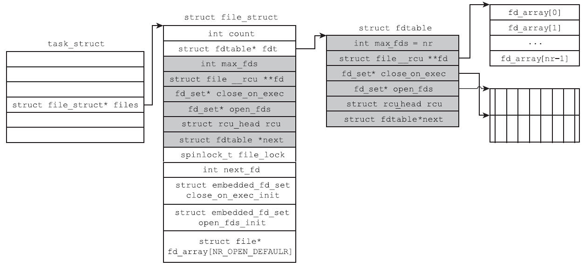

### abort()

好的，这是一个非常核心且重要的基础问题。`abort()`, `exit()` 和 `return` 都用于终止程序的执行，但它们在行为、使用场景和“善后工作”方面有天壤之别。

作为一名经验丰富的工程师，我会为你详细拆解它们之间的区别与联系。

---

**核心摘要**

| 特性                              | `abort()`                                  | `exit(status)`                                 | `return status;` (从 `main` 函数)       |
| :-------------------------------- | :----------------------------------------- | :--------------------------------------------- | :-------------------------------------- |
| **终止类型**                      | **异常终止 (Abnormal)**                    | **正常终止 (Normal)**                          | **正常终止 (Normal)**                   |
| **含义**                          | 程序遇到了灾难性错误，无法继续，立刻“自杀” | 程序完成了任务或遇到可控错误，需要有序地“离场” | `main` 函数执行完毕，程序自然“寿终正寝” |
| **调用 `atexit` 函数?**           | **否**                                     | **是**                                         | **是** (通过调用 `exit`)                |
| **刷新 I/O 缓冲区?**              | **否** (实现定义，但通常不)                | **是**                                         | **是** (通过调用 `exit`)                |
| **调用C++静态/全局对象析构函数?** | **否**                                     | **否**                                         | **是**                                  |
| **产生核心转储(Core Dump)?**      | **通常是** (用于调试)                      | **否**                                         | **否**                                  |
| **使用场景**                      | 断言失败、内存被破坏等无法恢复的内部错误   | 任务完成、用户请求退出、配置文件错误等         | 程序的默认和最标准的结束方式            |

---

**1. `abort()` - 紧急中止 (The Emergency Stop)**

`abort()` 函数的目的是立即、无条件地以**异常**方式终止程序。你可以把它想象成按下机器的紧急停止按钮。

**行为特征：**

1.  **引发 `SIGABRT` 信号**：`abort()` 的核心行为是向当前进程发送 `SIGABRT` (Signal Abort) 信号。这是它与其他退出方式的根本区别。
2.  **不做任何清理工作**：
    *   它**不会**调用 `atexit()` 注册的任何函数。
    *   它**不会**刷新标准I/O流（如 `stdout`, `stderr`），所以任何在缓冲区里还未输出的内容都会丢失。
    *   在C++中，它**不会**调用任何对象的析构函数（无论是全局、静态还是局部对象）。
3.  **可能产生核心转储（Core Dump）**：如果操作系统配置允许，`abort()` 会导致程序生成一个核心转储文件。这个文件是程序崩溃时内存状态的快照，是调试这类严重错误的无价之宝。

**何时使用？**
当程序进入一种**绝对错误和不可恢复**的状态时。例如：
*   一个关键的断言（`assert`）失败了。
*   内存已被破坏，你无法相信任何数据结构，进行有序的清理反而可能导致更严重的问题。
*   检测到严重的安全漏洞，需要立即停止以防被利用。

**示例：**
```cpp
#include <iostream>
#include <cstdlib> // for abort()

void check_critical_resource() {
    bool resource_corrupted = true; // 模拟资源已损坏
    if (resource_corrupted) {
        fprintf(stderr, "Fatal error: Critical resource corrupted. Aborting.\n");
        abort();
        // 下面的代码永远不会被执行
    }
}

int main() {
    std::cout << "Program starting..."; // 这句可能因为没有刷新而无法输出
    check_critical_resource();
    return 0;
}
```

---

**2. `exit()` - 有序退出 (The Orderly Exit)**

`exit()` 函数用于在程序的任何地方发起一次**正常**的终止流程。它就像是你在任何房间里都能找到的一个“安全出口”。

**行为特征：**

1.  **执行清理工作**：这是它和 `abort` 的最大区别。
    *   它会按照与注册时相反的顺序，调用所有通过 `atexit()` 注册的函数。
    *   它会刷新所有打开的标准I/O流，确保所有缓冲区的输出（如 `printf` 或 `cout` 的内容）都被写出。
2.  **不调用析构函数**：在C++中，直接调用 `exit()` **不会**调用任何局部对象（automatic storage duration）的析构函数。对于静态/全局对象，标准规定 `exit` 不会调用它们的析构函数。
3.  **返回状态码**：它接受一个整型参数 `status`，并将其返回给父进程或操作系统。这个状态码用于表明程序的执行结果。
    *   `exit(0)` 或 `exit(EXIT_SUCCESS)`：表示成功。
    *   `exit(1)` 或 `exit(EXIT_FAILURE)`（以及其他非零值）：表示失败。

**何时使用？**
当你需要在 `main` 函数之外的某个地方终止程序，但仍然希望进行有序的清理时。
*   在一个深层嵌套的函数中检测到一个错误（例如，无法打开必要的配置文件），并决定整个程序都无法继续。
*   响应用户的“退出”命令。

**示例：**
```cpp
#include <iostream>
#include <cstdlib> // for exit() and atexit()

void cleanup() {
    std::cout << "Cleanup function called." << std::endl;
}

void load_config() {
    bool config_missing = true;
    if (config_missing) {
        std::cerr << "Error: Config file not found. Exiting." << std::endl;
        exit(1); // 有序退出，返回错误码1
    }
}

int main() {
    atexit(cleanup); // 注册一个退出时要调用的函数
    std::cout << "Program starting." << std::endl;
    load_config();
    std::cout << "This will not be printed." << std::endl;
    return 0;
}
```
**输出会是：**
```
Program starting.
Error: Config file not found. Exiting.
Cleanup function called.
```

---

**3. `return 0;` (从 `main` 函数) - 自然终结 (The Natural End)**

从 `main` 函数 `return` 是程序结束的**最标准、最自然**的方式。

**行为特征与联系：**

1.  **C++中的特殊性**：`return status;` 从 `main` 函数返回，在C++中不仅仅是函数返回。它会触发一个完整的、有序的“程序拆卸（teardown）”过程。
    *   首先，`main` 函数作用域内的所有局部对象（automatic storage duration）的析构函数会被调用。
    *   然后，所有静态存储期（static storage duration）对象（全局变量、静态变量）的析构函数会被调用。**这是 `return` from `main` 和直接调用 `exit()` 的一个关键区别！**
2.  **与 `exit()` 的联系**：在完成了上述C++特有的析构过程后，运行时系统会**调用 `exit()` 函数**，并将 `main` 的返回值作为 `exit` 的状态码。
    *   因为最终调用了 `exit()`，所以所有 `exit()` 的清理工作（调用 `atexit` 函数、刷新I/O）也都会被执行。

**何时使用？**
**永远优先使用这种方式来结束程序。** 只有在 `main` 函数无法返回（例如在信号处理函数或深层嵌套的函数中需要立即终止）时，才应考虑 `exit()`。

**总结与类比**

*   **`return` from `main`**：像是一场电影播放到结尾，出片尾字幕，打扫剧场，观众有序离场。这是最完美的方式。
*   **`exit()`**：像是电影放到一半，影院经理进来宣布因故需要提前散场，虽然突然，但还是会引导观众有序离开。
*   **`abort()`**：像是电影放到一半，影院突然着火，所有人（包括程序自己）都惊慌失措地“逃命”，现场一片狼藉（core dump），什么都顾不上了。

### stdout，stderr，stdin

好的，这是一个非常棒的问题，它将三个基本概念（`stdin`, `stdout`, `stderr`）与两个核心的并发模型（进程、线程）联系在了一起。理解它们的关系是编写健壮、可交互的Linux程序的基础。

我将用一个“工坊”的比喻来开始，然后深入技术细节。

**宏观比喻：工坊与邮筒**

*   **进程 (Process)**：想象成一个独立的**工坊**。它有自己的地址、自己的工具、自己的资源和自己的任务清单。
*   **线程 (Thread)**：想象成工坊里的**工人**。一个工坊可以只有一个工人（单线程进程），也可以有很多工人（多线程进程）。所有的工人都共享这个工坊里的所有工具和资源。
*   **`stdin`, `stdout`, `stderr`**：想象成工坊门口的三个**邮筒**。
    *   `stdin` (标准输入): **收件箱**。外界（如用户键盘、其他工坊）通过它投递原料或指令。
    *   `stdout` (标准输出): **成品发货箱**。工坊将合格的成品放入这里，发给客户（如终端屏幕）。
    *   `stderr` (标准错误): **废品/紧急通知箱**。工坊将生产中出的问题、废品报告、紧急情况说明放入这里。

现在，我们来看这个比喻如何揭示它们的关系：

*   **进程与三者的关系**：**每个工坊（进程）都拥有自己独立的一套三个邮筒**。当你新建一个工坊时（`fork`），它会得到一套和原来工坊一模一样的邮筒，但这是属于它自己的。
*   **线程与三者的关系**：**工坊里所有的工人（线程）都共享这唯一的一套三个邮筒**。任何一个工人都可以从收件箱拿原料，也可以往成品箱或废品箱里放东西。

下面，我们深入到技术实现细节。

---

**第一部分：什么是 stdin, stdout, 和 stderr？(文件描述符的视角)**

在Linux/POSIX系统中，这三者本质上是**文件描述符 (File Descriptors)**。文件描述符是一个非负整数，是内核用来标识一个进程打开的文件的索引。

当任何一个进程启动时，内核会自动为它打开三个文件描述符，并与终端设备关联：

*   **`stdin` (Standard Input)**
    *   **文件描述符**: `0`
    *   **默认指向**: 键盘
    *   **作用**: 进程默认的数据**输入**来源。`scanf`, `cin`, `getchar` 等函数默认都从这里读取数据。

*   **`stdout` (Standard Output)**
    *   **文件描述符**: `1`
    *   **默认指向**: 终端屏幕
    *   **作用**: 进程默认的**正常输出**目的地。`printf`, `cout`, `putchar` 等函数默认都向这里写入数据。

*   **`stderr` (Standard Error)**
    *   **文件描述符**: `2`
    *   **默认指向**: 终端屏幕
    *   **作用**: 进程默认的**错误信息**输出目的地。`perror`, `fprintf(stderr, ...)` 和 `cerr` 向这里写入。

**为什么 `stdout` 和 `stderr` 要分开？**
虽然它们默认都显示在屏幕上，但分开的目的是为了**重定向(Redirection)**。你可以将正常输出保存到文件，同时让错误信息仍然显示在屏幕上，以便立即发现问题。
```bash
# 将正常输出(stdout)重定向到 a.log，错误信息(stderr)依然在屏幕显示
./my_program > a.log 

# 将正常输出重定向到 a.log，将错误输出重定向到 error.log
./my_program > a.log 2> error.log
```

---

**第二部分：与进程 (Process) 的联系：独立与继承**

这是它们关系的核心。

**1. 独立性 (Independence)**
每个进程都有自己的一张**文件描述符表**。进程A的`fd 0, 1, 2`和进程B的`fd 0, 1, 2`是完全独立的。进程A关闭自己的`stdout`不会影响进程B。

**2. 继承性 (Inheritance)**
当你使用 `fork()` 创建一个子进程时：
*   子进程会得到父进程文件描述符表的一个**副本**。
*   这意味着，在`fork()`的瞬间，子进程的`stdout`（fd 1）和父进程的`stdout`（fd 1）**指向内核中同一个打开的文件**（例如，同一个终端）。
*   因此，父子进程都可以向同一个终端输出信息，它们的输出会交织在一起。

**3. 通过 `pipe` 和 `exec` 改变关系**
进程间可以通过**管道(pipe)**将`stdin`和`stdout`连接起来。
```bash
# cmd1的stdout被连接到了cmd2的stdin
cmd1 | cmd2 
```
这个命令的背后是shell执行了`fork`，然后通过`pipe()`和`dup2()`系统调用，将一个进程的输出文件描述符重定向到管道的写入端，另一个进程的输入文件描述符重定向到管道的读取端，最后通过`exec()`执行新程序。新程序对此一无所知，它只是像往常一样从`stdin`读取，向`stdout`写入。

---

**第三部分：与线程 (Thread) 的联系：共享与风险**

这是与进程模型最本质的区别。

**1. 完全共享 (Total Sharing)**
一个进程内的所有线程**共享该进程的整个地址空间和所有资源**，其中就包括**文件描述符表**。
*   这意味着，进程只有一个 `stdin` (fd 0)，一个 `stdout` (fd 1)，一个 `stderr` (fd 2)。
*   **所有线程都使用这同一个`fd 0, 1, 2`。** 线程A调用`cout`和线程B调用`cout`，最终都是在向同一个文件描述符`1`写入数据。

**2. 风险：竞争条件 (Race Condition)**
因为完全共享，所以如果不加控制，多个线程同时向 `stdout` 或 `stderr` 写入会导致输出内容混乱交错。

**示例代码（有问题的版本）：**
```cpp
#include <iostream>
#include <thread>
#include <vector>

void print_message(int id) {
    // 多个线程可能在这里交错执行，导致输出混乱
    std::cout << "Thread " << id << " says: Hello, this is a long message." << std::endl;
}

int main() {
    std::vector<std::thread> threads;
    for (int i = 0; i < 5; ++i) {
        threads.emplace_back(print_message, i);
    }

    for (auto& t : threads) {
        t.join();
    }
    return 0;
}
```
可能的混乱输出：
```
Thread Thread 0 says: Hello, this is a long message.
1 says: Thread Hello, this is a long message.
2 says: Hello, this is a long message.
Thread 3 says: Hello, this is a long message.
Thread 4 says: Hello, this is a long message.
```

**3. 解决方案：同步 (Synchronization)**
要解决这个问题，必须使用互斥锁（Mutex）等同步机制来保护对共享资源（`cout`对象，也就是`stdout`）的访问，确保同一时间只有一个线程可以向其写入。

**示例代码（修正后版本）：**
```cpp
#include <iostream>
#include <thread>
#include <vector>
#include <mutex>

std::mutex cout_mutex; // 创建一个互斥锁

void print_message_safe(int id) {
    // 使用 lock_guard 在作用域开始时加锁，结束时自动解锁
    std::lock_guard<std::mutex> lock(cout_mutex);
    std::cout << "Thread " << id << " says: Hello, this is a long message." << std::endl;
}

int main() {
    std::vector<std::thread> threads;
    for (int i = 0; i < 5; ++i) {
        threads.emplace_back(print_message_safe, i);
    }

    for (auto& t : threads) {
        t.join();
    }
    return 0;
}
```
修正后的输出（顺序可能不同，但每行都是完整的）：

Thread 0 says: Hello, this is a long message.
Thread 2 says: Hello, this is a long message.
Thread 1 says: Hello, this is a long message.
Thread 4 says: Hello, this is a long message.
Thread 3 says: Hello, this is a long message.

**总结**

| 主体     | 对 `stdin`, `stdout`, `stderr` 的关系 | 核心机制                                | 主要关注点                                                   |
| :------- | :------------------------------------ | :-------------------------------------- | :----------------------------------------------------------- |
| **进程** | **拥有独立的副本**                    | `fork()` 继承，`pipe()`/`dup2()` 重定向 | **进程间通信 (IPC)**：如何通过重定向和管道将进程连接起来。   |
| **线程** | **完全共享同一份**                    | 共享内存和资源                          | **同步 (Synchronization)**：如何使用锁来避免多个线程同时访问导致的数据混乱。 |

### 重定向

当然！重定向是Linux/Unix世界中最强大、最核心的概念之一。理解它，就等于拿到了组合和自动化各种命令的钥匙。

我们从一个简单的比喻开始，然后深入到技术细节。

**简单的比喻：更改信件的投递地址**

想象一下，你的程序是一个办公室职员。

*   **`stdout` (标准输出)** 是他默认的**“成品”**发货地址，通常是直接交给面前的用户（终端屏幕）。
*   **`stderr` (标准错误)** 是他默认的**“废品/问题报告”**的提交地址，也通常是交给面前的用户（终端屏幕）。
*   **`stdin` (标准输入)** 是他默认的**“原料”**来源，通常是直接从面前的用户那里获取（键盘输入）。

**重定向（Redirection）就像是给这位职员下达一个临时指令：“今天，不要把‘成品’交给用户，而是把它放进这个名叫 `output.txt` 的文件箱里。”**

程序本身（职员）的工作方式完全没有改变，他仍然是把东西交到“成品”发货口。但是，Shell（可以看作是办公室经理）已经提前把这个发货口的**出口管道**接到了别的地方。

---

**重定向的Shell语法（你每天都在用的东西）**

这是你在命令行中直接使用的操作符。

| 操作符             | 名称                  | 描述                                                         |
| :----------------- | :-------------------- | :----------------------------------------------------------- |
| **`>`**            | **输出重定向 (覆盖)** | 将 `stdout` 的内容写入一个文件。**如果文件已存在，会覆盖其内容。** |
| **`>>`**           | **输出重定向 (追加)** | 将 `stdout` 的内容追加到一个文件的末尾。如果文件不存在，则创建它。 |
| **`<`**            | **输入重定向**        | 不从键盘读取 `stdin`，而是从一个文件中读取。                 |
| **`2>`**           | **错误重定向 (覆盖)** | 将 `stderr` 的内容写入一个文件。**会覆盖旧内容。**           |
| **`2>>`**          | **错误重定向 (追加)** | 将 `stderr` 的内容追加到一个文件的末尾。                     |
| **`&>` 或 `2>&1`** | **混合重定向**        | 将 `stdout` 和 `stderr` **两者**都重定向到同一个地方。       |
| **`|`**            | **管道 (Pipe)**       | 这是一种特殊的重定向，将前一个命令的 `stdout` 连接到后一个命令的 `stdin`。 |

**示例：**

1.  **将 `ls` 的正常输出保存到文件 `file_list.txt`**
    ```bash
    ls -l > file_list.txt 
    ```
    你将不会在屏幕上看到 `ls` 的输出，它被“重定向”到了文件中。

2.  **让 `sort` 命令从文件 `names.txt` 读取数据进行排序**
    ```bash
    # 先创建一个文件
    echo -e "Charlie\nAlice\nBob" > names.txt
    
    # 使用输入重定向
    sort < names.txt
    ```
    `sort` 命令会从 `names.txt` 文件而不是键盘接收输入，并把排序后的结果（Alice, Bob, Charlie）输出到 `stdout`（屏幕）。

3.  **只保存错误信息，正常信息仍在屏幕显示**
    ```bash
    # /nonexistent_dir 不存在，会产生错误信息
    # /etc 存在，会产生正常输出
    ls /etc /nonexistent_dir > good.txt 2> bad.txt
    ```
    *   `/etc` 的文件列表（`stdout`）会被保存到 `good.txt`。
    *   “ls: cannot access '/nonexistent_dir': No such file or directory” 这条错误信息（`stderr`）会被保存到 `bad.txt`。

---

**重定向的背后原理（对开发者而言最重要的部分）**

这才是真正的魔法发生的地方，它完全由 **Shell** 在 **你的程序运行之前** 就设置好了，你的程序对此毫不知情。

我们以 `ls > output.txt` 为例，看看Shell（如bash）到底做了什么：

1.  **`fork()`**：Shell首先会调用 `fork()` 创建一个子进程。所有的后续操作都在这个子进程中进行，这样就不会影响Shell本身。

2.  **打开文件**：在子进程中，Shell调用 `open()` 系统调用来打开（或创建）`output.txt` 文件，并获得一个新的文件描述符，比如 `fd=3`。

3.  **复制文件描述符 (`dup2`)**：这是最关键的一步！子进程会调用 `dup2(3, 1)`。
    *   `dup2(oldfd, newfd)` 的作用是：复制 `oldfd` 到 `newfd`。它会先关闭 `newfd`（如果它已打开），然后让 `newfd` 指向 `oldfd` 所指向的同一个内核文件表项。
    *   在这里，`dup2(3, 1)` 的意思就是：“**关闭标准输出（fd=1），然后让 fd=1 指向刚刚打开的 `output.txt` 文件（fd=3）**”。
    *   经过这一步，该子进程的 `stdout` 就不再指向终端，而是指向了 `output.txt` 文件！

4.  **关闭临时文件描述符**：现在 `fd=1` 已经指向了文件，原来的 `fd=3` 就不再需要了，可以调用 `close(3)` 将其关闭。

5.  **`exec()`**：最后，子进程调用 `execvp("ls", ...)` 来执行 `ls` 命令。`exec` 会用新程序（`ls`）替换当前子进程的内存映像，**但是，它会完整保留文件描述符表**。

**结论就是**：当 `ls` 程序开始运行时，它的 `stdout`（文件描述符`1`）已经被它的父进程（Shell）偷偷地换成了指向 `output.txt` 的一个链接。`ls` 程序对此一无所知，它像往常一样勤勤恳恳地向它的 `stdout` 写入数据，但这些数据最终都流向了文件，而不是屏幕。

---

**用C++代码模拟这个过程**

下面这段C++代码就模拟了Shell执行 `ls -l > output.txt` 的过程，可以让你更清晰地理解这些系统调用。

```cpp
#include <iostream>
#include <unistd.h>
#include <fcntl.h>
#include <sys/wait.h>

int main() {
    pid_t pid = fork();

    if (pid < 0) {
        perror("fork failed");
        return 1;
    }

    if (pid == 0) {
        // ---- 子进程 ----
        // 目标：执行 "ls -l"，并将其 stdout 重定向到 "output.txt"

        // 1. 打开文件。O_WRONLY(只写), O_CREAT(不存在则创建), O_TRUNC(存在则清空)
        //    权限 0644: owner(rw-), group(r--), others(r--)
        int fd = open("output.txt", O_WRONLY | O_CREAT | O_TRUNC, 0644);
        if (fd < 0) {
            perror("open failed");
            exit(1);
        }

        // 2. 将 stdout(fd=1) 重定向到文件(fd)
        if (dup2(fd, 1) < 0) {
            perror("dup2 failed");
            exit(1);
        }

        // 3. 关闭不再需要的原始文件描述符
        close(fd);

        // 4. 执行新程序。ls对此一无所知
        char* const argv[] = {(char*)"ls", (char*)"-l", NULL};
        execvp("ls", argv);

        // 如果 execvp 返回，说明出错了
        perror("execvp failed");
        exit(1);
    } else {
        // ---- 父进程 ----
        int status;
        waitpid(pid, &status, 0);
        std::cout << "Parent: Child process finished." << std::endl;
    }

    return 0;
}
```

当你编译并运行这个程序后，你会发现当前目录下多了一个 `output.txt` 文件，里面正是 `ls -l` 的输出结果。这完美地揭示了重定向的底层奥秘。

### 深入重定向和文件描述符表

前置知识：

- `task_struct`和`file_struct`中的相关成员：

  

- `file_stuct`相关结构体

  ```c++
  struct files_struct {
  	atomic_t count;
  	struct fdtable __rcu *fdt;
  	struct fdtable fdtab;
  	spinlock_t file_lock ____cacheline_aligned_in_smp;
  	int next_fd;
  	struct embedded_fd_set close_on_exec_init;
  	struct embedded_fd_set open_fds_init;
  	struct file __rcu * fd_array[NR_OPEN_DEFAULT];
  };
  struct fdtable
  {
  	unsigned int max_fds;
  	struct file __rcu **fd; /* current fd array */
  	fd_set *close_on_exec;
  	fd_set *open_fds;
  	struct rcu_head rcu;
  	struct fdtable *next;
  };
  struct embedded_fd_set {
  	unsigned long fds_bits[1];
  };
  ```

---

太棒了！你直接提供了Linux内核中的核心数据结构，这让我们能够进行一次真正“深入底层”的剖析。根据你提供的这些结构体定义，我们来重新讲述 `dup2(fd, 1)` 的全过程。

之前的比喻是“办公室经理改造了办公桌上的收发托盘”，现在我们来看看这位“经理”具体拧了哪些螺丝，动了哪些零件。

**前提：** 每个进程的 `task_struct` 都有一个指针 `struct files_struct *files;`，指向它独有的文件结构。我们下面的操作都基于 `current->files`。

---

**`dup2(fd, 1)` 的详细内核步骤**

当你的程序调用 `dup2(fd, 1)` 时，会触发一个系统调用，内核将执行以下一系列精确的操作：

**第1步：锁定资源，防止并发冲突**

内核首先需要确保在修改文件描述符表时，不会有该进程的其他线程也在同时进行 `open`, `close` 或其他文件操作。

*   **操作对象**: `current->files->file_lock`
*   **动作**: 内核会获取这个 `spinlock_t` 类型的自旋锁。在修改完成前，任何其他试图获取该锁的执行流（其他线程）都会被阻塞（“自旋”等待）。这保证了后续操作的原子性。

---

**第2步：定位到核心数据区 `fdtable`**

内核需要找到真正的文件描述符数组。

*   **操作对象**: `current->files->fdt`
*   **动作**: 这个 `struct fdtable __rcu *fdt` 指针指向当前有效的文件描述符表。内核会通过这个指针找到 `fdtable` 结构体。为了简化，我们称之为 `fdt`。
    *   *旁注：`fdtab` 是一个内嵌的、默认大小的 `fdtable`，用于优化处理打开文件较少的情况。当文件数量超过 `NR_OPEN_DEFAULT` 时，内核才会动态分配一个更大的 `fdtable` 并让 `fdt` 指向它。*

---

**第3步：处理目标文件描述符 `1` (stdout)**

在覆盖 `fd[1]` 之前，内核必须先妥善处理它原来指向的文件。

*   **操作对象**: `fdt->fd[1]`
*   **动作**:
    1.  内核首先检查 `fd` 和 `1` 是不是同一个数字。如果是，就什么都不用做，直接成功返回。
    2.  内核通过 `fdt->fd[1]` 拿到一个 `struct file *` 指针，我们称之为 `old_stdout_file`。
    3.  如果 `old_stdout_file` 不为 `NULL`（意味着 `stdout` 之前是打开的），内核必须为它调用 `fput()`。`fput()` 会减少 `old_stdout_file` 所指向的 `struct file` 的引用计数。如果计数降为0，说明没有任何进程或内核子系统再使用这个文件了，内核就会真正地关闭它并释放相关资源。

---

**第4步：执行复制操作（`dup` 的核心）**

这是 `dup2` 的精髓所在。

*   **操作对象**: `fdt->fd` 数组
*   **动作**:
    1.  内核从源文件描述符 `fd` 处获取文件指针：`struct file *source_file = fdt->fd[fd];`。
    2.  内核将这个指针**复制**到目标位置 `1`：`fdt->fd[1] = source_file;`。
    3.  **至关重要的一步**：现在有两个文件描述符 (`fd` 和 `1`) 指向了同一个 `struct file` 实例。为了记录这次新的引用，内核必须增加 `source_file` 的引用计数。这通常通过调用 `get_file(source_file)` 来完成。

**结果**：执行完这一步，`fdt->fd[fd]` 和 `fdt->fd[1]` 存储了完全相同的内存地址，它们都指向同一个描述“打开文件”状态的内核对象。对其中任何一个文件描述符进行 `write` 操作，最终都会影响到这个共享的 `struct file` 对象。

---

**第5步：更新元数据（Bitmasks）**

`fdtable` 包含一些优化的位图，也需要同步更新。

*   **操作对象**: `fdt->open_fds` 和 `fdt->close_on_exec`
*   **动作**:
    1.  内核会确保文件描述符 `1` 在 `open_fds` 位图中被标记为“打开”。
    2.  `dup2` 的一个重要语义是：**新的文件描述符（这里是 `1`）不能设置 `FD_CLOEXEC`（执行时关闭）标志**。因此，内核会清除 `close_on_exec` 位图中与 `1` 对应的位。这意味着，如果接下来调用 `exec()`，这个被重定向过的 `stdout` 将会**保持打开状态**并被新程序继承。

---

**第6步：释放锁并返回**

所有修改都已安全完成。

*   **操作对象**: `current->files->file_lock`
*   **动作**: 内核释放自旋锁，允许其他线程访问文件描述符表。然后系统调用结束，向用户程序返回成功（`0`）。

---

**总结与回顾**

结合你提供的结构体，`dup2(fd, 1)` 的故事变得无比清晰：

它不再是一个模糊的“重定向”操作，而是一个在**内核态**、受**自旋锁保护**的、对当前进程的 `files_struct` 和 `fdtable` 进行的**指针和位图操作**。

它通过**复制 `fdt->fd` 数组中的 `struct file *` 指针**，并**维护这个指针指向的 `struct file` 对象的引用计数**，从而让两个不同的文件描述符整数，最终指向同一个内核对文件的抽象。

而 `exec()` 之所以能保留这个效果，正是因为它在替换进程的虚拟地址空间（`mm_struct`）时，**默认保留了那个指向被修改过的 `files_struct` 的指针**。新程序继承的是这张已经被精心改造过的、包含着重定向后指针的“文件描述符表”。


