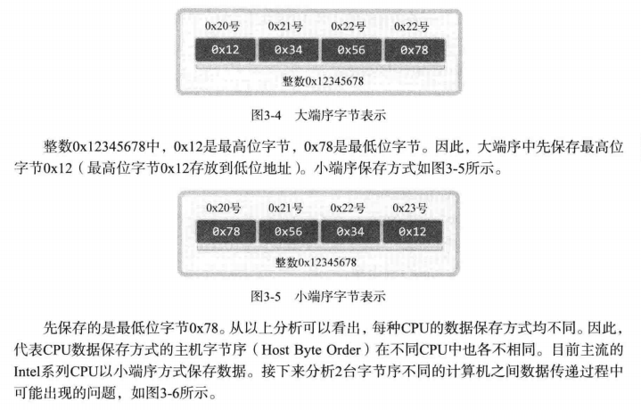
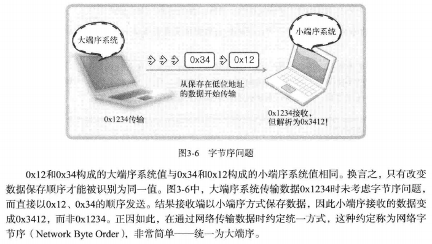
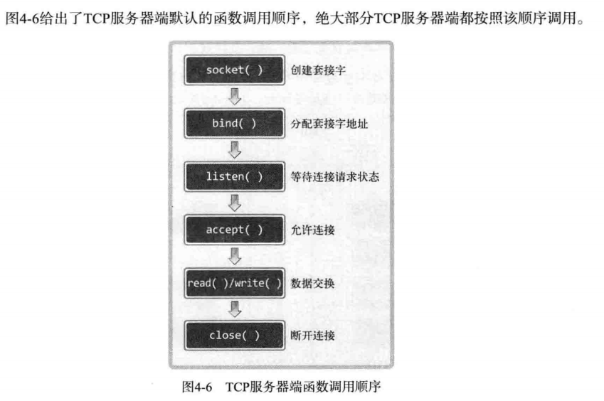
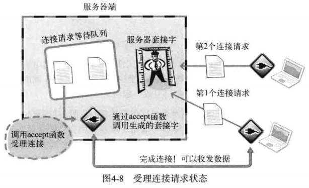
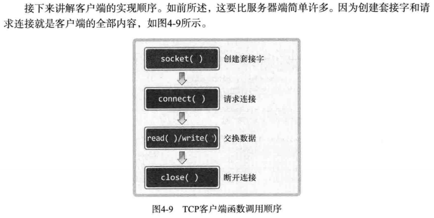
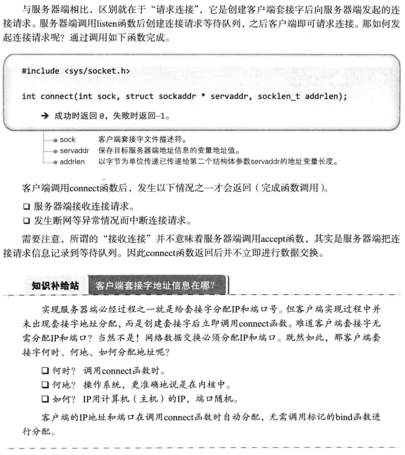
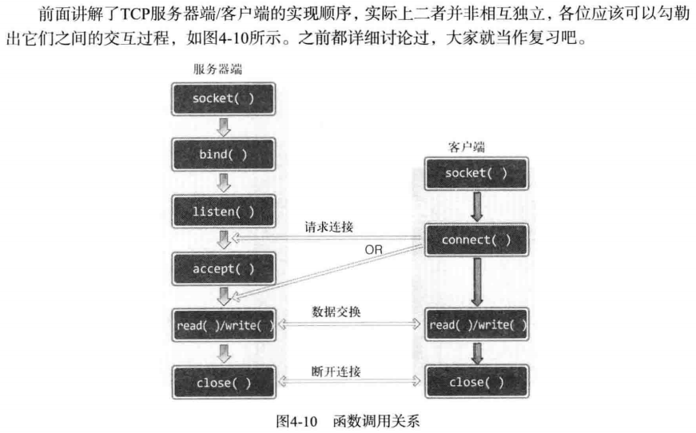

### 大端序和小端序

大端序：大端序总是先保存最高位的地址（高字节存储于低地址）

小端序：小端序总是先保存最低位的地址（低字节存储于低地址）

显然，我们可以看到，对于大端序而言，随着内存地址从左往右增加，存放高位字节->低位字节，可以直接阅读，而小端序则不可以

显然，我们可以看到，先忽略大端序和小端序，数据在上述大端序系统和小端序系统中存储的都是0x1234（从左到右内存地址渐增），主要区别在于大端序系统和小端序系统对这段内存的解析！

其中大端序系统认为0x12在低地址，所以是高位，显示出来的值是0x1234；

而小端序系统认为0x12在低地址，所以是低位，显示出来的值是0x3412！

所以你应该明白了，之所以要引入网络字节序，就相当于是一个中间层，用于适配不同端序的系统对同一块内存数据的解析。

### TCP服务端/客户端

#### TCP服务端函数调用顺序

解释：

- `socket()`：创建一个基于特定协议的套接字，但此时套接字并非真正的服务端套接字。

- `bind()`：将上一步的套接字绑定到特定ip地址，端口上，使得该套接字可以监听该地址，经过此函数，套接字被定义为**服务端套接字**。

- `listen()`：使服务端套接字进入**等待连接请求状态**。经过此函数，服务端套接字会接收连接到该ip，端口上的**客户端连接请求**，将其存于**连接请求等待队列**中。

- `accept()`：受理上一步中收到的连接请求，自动与发起连接请求的客户端建立连接。

  

#### TCP客户端函数调用顺序

- `connect()`：`socket()`之后调用`connect()`，使得套接字被解释为客户端套接字，用于发起连接请求

  

#### TCP服务端/客户端的函数调用关系

以上总体流程整理如下：服务器端创建套接字后连续调用bind、listen函数进人等待状态，
客户端通过调用connect函数发起连接请求。需要注意的是，客户端只能等到服务器端调用listen函数后才能调connect函数。同时要清楚，客户端调用connect函数前，服务器端有可能率先调用accept函数。当然，此时服务器端在调用accept函数时进人阻塞（blocking）状态，直到客户端调connect函数为止。

TCP连接相关原理见第5.2

