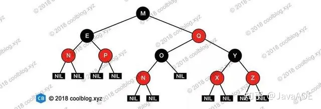

## 快速排序

[#看这里](../C++八股文/C++学习难点.md#快速排序（O(NlogN))

## 设计模式

[#看这里](../C++八股文/C++学习难点.md#设计模式)

单例（使用crtp模板实现），工厂，观察者（使用lambda函数注册回调实现）

对于工厂模式而言，我们工作中通常是使用类似 `parent_ptr = getInstance(order)` 的形式，其中`getInstance(order)`中的实现大致是通过传入的order中的部分flag来区分不同类型的委托，从而创建不同交易类别的子类

## 调试方法/崩溃处理

1. 测试环境：

   对于输出异常，需要结合日志观察数据的变化，对于崩溃，需要结合生成的coredump文件定位最后崩溃的位置，结合业务确定崩溃原因（在公司中没有打开过coredump文件，只能通过日志和打断点来推测）

2. 生产环境

   先看生产环境的日志，获取崩溃的模块号和模块入参，然后尝试在测试环境中复现

## STL底层实现

[#看这里](../C++八股文/C++学习难点.md#STL的底层实现)

### vector

[面试题：C++vector的动态扩容，为何是1.5倍或者是2倍_vector扩容-CSDN博客](https://blog.csdn.net/qq_44918090/article/details/120583540)

### string

### 哈希表

哈希表是一种基于哈希函数的映射数据结构，用于高效地存储和查找数据。其核心思想是通过将数据的键（key）映射到数组中的一个索引位置，从而实现快速存取。在哈希表的实现中，有几个关键要素需要注意：

- 数据结构

  哈希表内部是一个数组，每个数组槽（slot）对应一个存储位置。哈希表通过**哈希函数**将数据的键（key）映射到数组的索引位置，因此数据会存储在哈希表的特定位置。

- 哈希函数

  哈希表的核心是**哈希函数**，它将任意大小的键（key）映射到一个固定大小的数组索引。哈希函数需要具备以下特性：

  - **高效性**：计算哈希值时应该尽量快。

  - **均匀性**：哈希函数应尽量均匀地将键值分布到整个哈希表中，减少哈希冲突。

  - **确定性**：对于相同的输入，哈希函数应总是返回相同的输出。

  一个简单的哈希函数通常是：`hash(key) % table_size`，其中 `key` 是输入的键，`table_size` 是哈希表的大小。哈希表的大小通常是一个质数，以减少冲突。

- 哈希冲突解决

  哈希冲突是指两个不同的键经过哈希函数映射到相同的索引位置。在哈希表中，通常有两种常见的解决方式：

  - **链地址法（Chaining）**：

    - 每个数组槽存储一个链表或桶，所有映射到同一槽的元素（一个kv对）都会被添加到这个链表中。

    - 如果两个键的哈希值相同（即发生冲突），它们会被存放在同一个链表中，链表会顺序存储这些元素。

  - **开放地址法（Open Addressing）**：

    - 当发生冲突时，通过探查策略（如线性探查、二次探查、双哈希法等）寻找下一个空槽来存储冲突的元素。
    - 不使用额外的数据结构（如链表），而是在哈希表的数组中直接寻找空槽。

- 负载因子与扩容

  - **插入（Insert）**：
    - 通过哈希函数计算插入键的索引位置。如果该位置没有冲突，就直接插入。如果发生冲突，则根据冲突解决策略（链地址法或开放地址法）处理。

  - **查找（Search）**：
    - 通过哈希函数计算键的索引位置。如果该位置存储的是目标键，则返回其对应的值。如果发生冲突（链地址法），则遍历链表查找**目标键**。

  - **删除（Delete）**：
    - 查找目标键并删除。如果使用链地址法，直接从链表中删除该元素。如果使用开放地址法，则需要标记该位置为已删除。

  - **遍历（Traverse）**：
    - 遍历哈希表时，依次访问每个槽的内容，检查槽是否为空。如果该槽存储有数据（链表或其他数据结构），则遍历该槽的内容，访问其中的每个元素。
    - 对于链地址法，遍历每个槽的链表，对于开放地址法，则检查每个槽的元素。如果槽为空或已删除，跳过该槽。
    - 对于链地址法，我们可以使用一个数组来记录有数据的槽，这样可以不需要检查每个槽是否为空了

### 红黑树

红黑树（Red-Black Tree）是一种自平衡的二叉查找树（Binary Search Tree，BST），用于保证数据结构在进行插入和删除操作时保持平衡，从而确保查找操作的时间复杂度为 O(log n)。它是一个典型的平衡二叉查找树，并且在多种算法和数据结构中被广泛使用，特别是在实现如 `std::map` 和 `std::set` 这样的容器时。

- 性质

  红黑树具有以下五个性质，这些性质确保了树的平衡性：

  1. **每个节点要么是红色的，要么是黑色的**。
  2. **根节点是黑色的**。
  3. **所有叶子节点（NIL节点或空节点）都是黑色的**。
  4. **红色节点不能连续出现**。即，如果一个节点是红色的，那么它的子节点必须是黑色的（即不能有两个连续的红色节点）。
  5. **从任意节点到其所有后代的叶子节点的路径上，必须包含相同数目的黑色节点**。这被称为“黑色高度”。

  显然根据以上性质：任意节点到其最长叶子节点路径不会超过最短路径的2倍

  

- 结构

  红黑树的每个节点除了包含键值对和指向左右子节点的指针外，还包含一个表示节点颜色的标志。树的结构通过这些颜色规则保持了平衡，保证了树的最坏情况查找时间不会超过 O(log n)。

- 插入

  插入元素时，首先按普通的二叉查找树规则将新节点插入，然后根据红黑树的规则来调整树的结构，使其仍然符合红黑树的性质。插入操作的步骤如下：

  1. **插入新节点**：将新节点插入到树中，初始时将该节点标记为红色。

  2. **修复不平衡**：插入后的树可能会破坏红黑树的性质（如红色节点连在一起），这时需要进行调整。调整过程通常涉及**旋转**和**颜色翻转**：
     - **旋转**：旋转操作分为左旋和右旋，通过旋转可以改变树的结构，使其重新平衡。
       - 左旋：将节点的右子节点变成新的根节点，而原来的节点变成左子节点
       - 右旋：将节点的左子节点变成新的根节点，而原来的节点变成右子节点。
     - **颜色翻转**：可能需要调整父节点、叔叔节点和祖父节点的颜色，以确保红黑树的性质不被破坏。

  插入操作后，树的高度依然保持在 O(log n) 的范围内，因此查找操作依然是 O(log n)。

- 删除

  删除操作比插入稍微复杂一些，但它同样遵循红黑树的平衡规则。删除元素时，按照普通的二叉查找树规则找到待删除节点并删除，然后需要修复树的不平衡性。修复操作包括旋转和颜色调整，确保红黑树的性质不被破坏。

  - 如果删除的是红色节点，问题较小，通常直接删除即可。
  - 如果删除的是黑色节点，可能会破坏**黑色高度**，需要通过一系列的旋转和重新着色操作来恢复平衡。

- 查找

  查找操作与普通的二叉查找树相同。根据红黑树的特性，查找操作的时间复杂度为 O(log n)，这得益于树的平衡性。

### AVL树

[史上最详细的AVL树（含代码实现）-CSDN博客](https://blog.csdn.net/qq_56999918/article/details/122759059)

[红黑树和AVL树（平衡二叉树）区别_avl 红黑树区别-CSDN博客](https://blog.csdn.net/u010899985/article/details/80981053)

AVL树是带有平衡条件的二叉查找树，一般是用**平衡因子**差值判断是否平衡并通过旋转来实现平衡，左右子树树高不超过1，和红黑树相比，AVL树是**严格的平衡二叉树**，平衡条件必须满足（所有节点的左右子树高度差的绝对值不超过1）。不管我们是执行插入还是删除操作，只要不满足上面的条件，就要通过旋转来保持平衡，而旋转是非常耗时的，由此我们可以知道**AVL树适合用于插入与删除次数比较少，但查找多的情况，红黑树则相反**

## select

`select` 是 I/O 多路复用模型。在单线程里等待多个套接字的就绪事件并一次性返回就绪集合。

```c++
// 仅展示主干逻辑；套接字创建/读写细节用函数名占位。
int make_listenfd(unsigned short);     // socket/bind/listen
int accept_one(int);                   // accept
int echo_once(int);                    // 读->写回；<=0 表示应关闭
void close_fd(int);                    // close

int main() {
    int listenfd = make_listenfd(8888);

    // allset表示需要监听的fd集合，rset是每次传给select的fd集合
    fd_set allset, rset;
    FD_ZERO(&allset);									// #1
    FD_SET(listenfd, &allset);							// #2
    int maxfd = listenfd;								// 确定监听范围

    // 事件循环
    for (;;) {
        rset = allset;
        int cnt = select(maxfd + 1, &rset, nullptr, nullptr, nullptr);   // #3
        
        // 检查listenfd是否有可读消息，如果有，表示有新的客户端连接
        if (FD_ISSET(listenfd, &rset)) {				// #4
            int clientfd = accept_one(listenfd);
            if (clientfd >= 0) {
                FD_SET(clientfd, &allset);				// #5
                maxfd = max(clientfd, maxfd);
            }
            if (--cnt == 0) 
                continue;
        }
        
        // 检查所有clientfd是否有可读消息
        for (int fd = 0; fd <= maxfd && cnt > 0; ++fd) {
            if (!FD_ISSET(fd, &rset) || fd == listenfd) // #6
                continue;
            --cnt;
            // 读0/错：关闭并移除
            if (echo_once(fd) <= 0) {
                close_fd(fd);
                FD_CLR(fd, &allset);					// #7
                /* 为极简，未更新 maxfd；需要时可使用std::set<>进行管理 */
            }
        }
    }
}
```

解释：

- ```c++
  // 将fd_set变量的所有位初始化为0。
  void FD_ZERO(fd_set* fdset);
  ```

- ```c++
  // 在参数fdset指向的变量中注册文件描述符fd的信息（要求 0 ≤ fd < FD_SETSIZE）
  // 注册后需要及时更新maxfd
  void FD_SET(int fd, fd_set* fdset);
  ```

  `FD_SETSIZE` 定义了 *select* 函数可以监视的文件描述符的最大数量。默认情况下，`FD_SETSIZE` 被设置为 1024

- ```c++
  int select(int nfds, fd_set* readset, fd_set* writeset, fd_set* exceptset, struct timeval* timeout);
  /**
   * @brief 同步等待多个文件描述符的就绪事件（读/写/异常）
   * @param nfds       扫描上界，必须为“当前被监控的最大fd + 1”；仅扫描区间 [0, nfds)
   * @param readfds    读就绪集合；nullptr 不监控读
   * @param writefds   写就绪集合；nullptr 不监控写
   * @param exceptfds  异常集合（如带外数据）；nullptr 不监控异常
   * @param timeout    超时；nullptr 无限阻塞；{0,0} 立即返回；其余为最长等待
   * @return >0 本轮就绪fd数量；0 超时；-1 出错（查 errno，可为 EINTR）
   * @note  select 会就地清零未就绪位，故每轮调用前需先做 rset = allset；
   *        fd 必须 < FD_SETSIZE；关闭fd后需 FD_CLR；增删fd后要维护 maxfd。
   */
  ```

- ```c++
  // 若参数fdset指向的变量中包含文件描述符fd的信息，则返回非0，否则返回0
  int FD_ISSET(int fd, const fd_set* fdset);
  ```

- ```c++
  // 从参数fdset指向的变量中清除文件描述符fd的信息。
  void FD_CLR(int fd, fd_set* fdset);
  ```

## epoll

`epoll` 是 `select` 的一种高效替代方案，同样属于 I/O 多路复用模型。它通过在内核中维护一个“兴趣列表”，并只返回活动连接的方式，解决了 `select` 模型需要重复传递、线性扫描文件描述符集合的低效问题。

```c++
// 仅展示主干逻辑；套接字创建/读写细节用函数名占位。
int make_listenfd(unsigned short);      // socket/bind/listen
int accept_one(int);                    // accept
int echo_once(int);                     // 读->写回；<=0 表示应关闭
void close_fd(int);                     // close

int main() {
    int listenfd = make_listenfd(8888);

    // #1 创建 epoll 实例
    int epollfd = epoll_create1(0);

    // #2 将 listenfd 添加到 epoll 的兴趣列表
    struct epoll_event ev;
    ev.events = EPOLLIN;
    ev.data.fd = listenfd;
    epoll_ctl(epollfd, EPOLL_CTL_ADD, listenfd, &ev);

    // 用于接收就绪事件的数组
    struct epoll_event events[1024];

    // 事件循环
    for (;;) {
        // #3 等待就绪事件
        int cnt = epoll_wait(epollfd, events, 1024, -1);

        for (int i = 0; i < cnt; ++i) {
            int sockfd = events[i].data.fd;

            // #4 如果是 listenfd 就绪，表示有新的客户端连接
            if (sockfd == listenfd) {
                int clientfd = accept_one(listenfd);
                if (clientfd >= 0) {
                    ev.events = EPOLLIN;
                    ev.data.fd = clientfd;
                    // #5 将新的 clientfd 添加到兴趣列表
                    epoll_ctl(epollfd, EPOLL_CTL_ADD, clientfd, &ev);
                }
            } else { // #6 否则是已连接的 clientfd 就绪
                // 读0/错：关闭并移除
                if (echo_once(sockfd) <= 0) {
                    close_fd(sockfd);
                    // #7 从兴趣列表中移除
                    epoll_ctl(epollfd, EPOLL_CTL_DEL, sockfd, nullptr);
                }
            }
        }
    }
}
```

解释：

- ```c++
  // 创建一个新的 epoll 实例，并返回指向它的文件描述符。
  // 在 Linux 2.6.8 之后，flags 参数被忽略，但必须为 0。
  // epoll_create1(0) 的行为与 epoll_create(size) 相同（size 被忽略）。
  int epoll_create1(int flags);
  ```

- ```c++
  // 控制 epoll 实例的行为。
  int epoll_ctl(int epfd, int op, int fd, struct epoll_event *event);
  /**
   * @brief 对 epoll 实例（由 epfd 标识）的兴趣列表进行增、删、改操作。
   * @param epfd      epoll_create1 返回的文件描述符。
   * @param op        要执行的操作，可以是：
   * 		EPOLL_CTL_ADD：向兴趣列表添加 fd。
   * 		EPOLL_CTL_MOD：修改 fd 上注册的事件。
   * 		EPOLL_CTL_DEL：从兴趣列表删除 fd。
   * @param fd        目标文件描述符。
   * @param event     指向 epoll_event 结构体的指针，描述了要监听的事件和用户数据。
   * @return 0 成功；-1 出错（查 errno）。
   *
   * @note  epoll_event 结构体中的 events 字段是位掩码，常用值有：
   * 		EPOLLIN:  关联的文件可用于读操作。
   * 		EPOLLOUT: 关联的文件可用于写操作。
   * 		EPOLLET:  将该 fd 设置为边缘触发（Edge Triggered）模式。
   */
  ```

- ```c++
  // 等待 epoll 实例上的 I/O 事件。
  int epoll_wait(int epfd, struct epoll_event *events, int maxevents, int timeout);
  /**
   * @brief 同步等待 epoll 实例中兴趣列表里的文件描述符就绪。
   * @param epfd      epoll_create1 返回的文件描述符。
   * @param events    一个数组，用于存储内核返回的、已就绪的事件。
   * @param maxevents 指定 events 数组的大小，必须 > 0。
   * @param timeout   超时（毫秒）；-1 无限阻塞；0 立即返回。
   * @return >0 本轮就绪的 fd 数量；0 超时；-1 出错（查 errno，可为 EINTR）。
   *
   * @note  与 select 不同，epoll_wait 返回后无需遍历所有被监控的 fd，
   * 只需处理 events 数组中前 `cnt` 个元素即可。兴趣列表在内核中维护，
   * 调用返回后无需像 select 一样重置。
   */
  ```

### 条件触发与边缘触发

- 条件触发 (Level-Triggered, LT)
  - **工作模式**: `epoll` 的默认模式。
  - **触发条件**: 只要文件描述符处于就绪状态（例如，其内核接收缓冲区非空），`epoll_wait` 就会返回该描述符。
  - **行为**: 如果本次 `epoll_wait` 返回后，你没有将缓冲区的数据完全处理完，那么下一次调用 `epoll_wait` 时，只要缓冲区中仍有数据，它会**再次**返回该文件描述符。
  - **编程要求**: 逻辑简单，事件不易丢失。
- 边缘触发 (Edge-Triggered, ET)
  - **工作模式**: 通过 `EPOLLET` 标志设置。
  - **触发条件**: 仅当文件描述符的状态发生**变化**时（例如，缓冲区接收到新数据时），`epoll_wait` 才会返回该描述符。
  - **行为**: `epoll_wait` 通常只通知一次。如果在收到通知后没有处理完所有数据，`epoll_wait` **不会**再次返回该描述符，直到下一次状态变化（例如，收到新的网络数据）发生。
  - **编程要求**:
    1. 必须将文件描述符设置为**非阻塞 (Non-blocking)**。
    2. 收到事件通知后，必须在一个循环中持续进行 `read` 或 `write` 操作，直到函数返回 `EAGAIN` 或 `EWOULDBLOCK`，以确保将缓冲区数据处理完毕。
  - 注意：
    1. 在ET模式下，如果没有一次性读完所有数据，那么剩余的数据只有在下一次接收到新数据时才能“搭便车”一起处理
    2. ET模式下必须使用非阻塞IO：
       - **如果使用阻塞 IO**: 当你在循环中最后一次调用 `read()` 时，缓冲区已经空了。此时，`read()` 调用会**阻塞**（挂起线程），等待新数据的到来。这就使得你的单线程事件循环被卡死在这个文件描述符上，无法再去处理其他就绪的描述符，I/O 多路复用也就失去了意义。
       - **如果使用非阻塞 IO**: 当你在循环中最后一次调用 `read()` 且缓冲区已空时，`read()` 调用会**立即返回**一个特定的错误码（`EAGAIN` 或 `EWOULDBLOCK`）。程序可以通过判断这个错误码，得知“数据已全部读完”，从而安全地退出循环，继续处理下一个事件。

## socket编程

[#看这里](../C++八股文/C++学习难点.md#计算机网络)

negal算法：[(69 封私信 / 83 条消息) TCP Nagle 算法：网络优化的双刃剑 - 知乎](https://zhuanlan.zhihu.com/p/683650018)

旨在解决 TCP/IP 网络中的小分组问题。在广域网（WAN）中，频繁发送小数据包可能会导致网络拥塞，因为每个小数据包都需要单独的确认（ACK），这增加了网络的负载。Nagle 算法通过合并小数据包来减少这种拥塞。

**优势：**

减少网络拥塞：通过合并小数据包，减少了网络中的数据包数量，降低了拥塞的可能性。

提高网络效率：在低速网络中，Nagle 算法可以显著提高传输效率。

**劣势：**

增加延迟：在交互式应用中，Nagle 算法可能导致显著的延迟，因为它等待 ACK 或合并数据包。

不适用于实时应用：对于需要快速响应的应用（如在线游戏、实时视频流），Nagle 算法可能会影响用户体验。