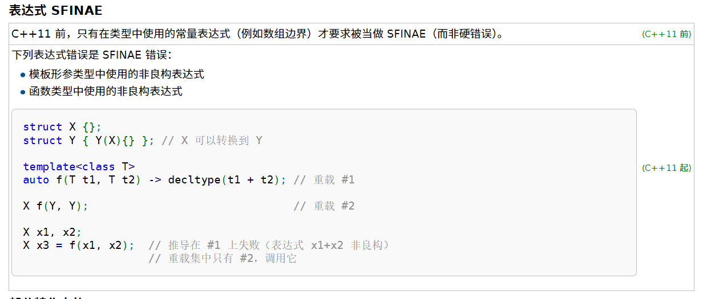

## 前置知识？？？

[现代 C++ 模板教程](https://mq-b.github.io/Modern-Cpp-templates-tutorial/)

[c++11-17 模板核心概念 - 知乎](https://www.zhihu.com/column/c_1306966457508118528)

[C++ 包管理，编译构建配置等问题？？？](https://github.com/Mq-b/Loser-HomeWork/blob/main/src/卢瑟日经/C%2B%2B 包管理，编译构建配置等问题.md)

## 函数模板

### 初识函数模板

[隐式实例化，显式实例化，显式具体化，部分具体化_基础](https://blog.csdn.net/weixin_43717839/article/details/131320956)

[隐式实例化、显式实例化_进阶](https://blog.csdn.net/Jxianxu/article/details/124359007)

[7.9 模板应用于多文件编程 - 知乎](https://zhuanlan.zhihu.com/p/628170334)

[7.10 模板的显式实例化 - 知乎](https://zhuanlan.zhihu.com/p/628172691)

```c++
using namespace std;
template<typename T>
T m_max(T a, T b)
{
	return a > b ? a : b;
}

template

int main() {
	cout << m_max<int>(1, 2) << endl;	// 隐式实例化，显式实例化后面讲

	return 1;
}
```

解析：

- 函数模板不是函数，而是一个用于生成函数的“图纸”。函数模板必须实例化，才会生成具体的函数定义**（注意实例化指的是生成定义，而非直接使用）**，所以显然，同一个函数模板生成的不同类型的模板实例，他们之间没有任何关系。当然啦，如果是同一个函数模板在同一个作用域内生成多个同类型的模板实例，那他们会被合并为一种。
- 函数模板如果没有被使用，或者没有被实例化，就不会生成实际的函数代码。
- 模板是静态的，也就是说**模板实例化的过程位于编译期，没有运行时开销**

### 模板参数推导？？？重写笔记

[先看此链接—— 理解模板参数推导规则 - 知乎？？？](https://zhuanlan.zhihu.com/p/338788455)

```c++
//using namespace std;
template<typename T>
T max(const T& a, const T& b)
{
	return a > b ? a : b;
}

int main() {
/***********************************案例一***********************************/
    
	max(1, 2);				// T推导为int
    max(1, 2.1)				// 推导失败
	max<double>(1, 2.2);	// 显式指定参数，不进行类型推导
    
/***********************************案例二***********************************/
    
	int a = 1;
	const int& b = a;
	max(a, b);				// T推导为int，a的类型为const int&
	max<const int&>(a, b);	// T被指明为const int&，但是a的类型仍然为 const int&
    
/***********************************案例三***********************************/
    
	// ADL 实参依赖查找：编译器会在函数参数（string）的命名空间（std）里面查找该函数（max）
    // ∴报错：多个max实例与参数列表匹配
	max<std::string>("lus", std::string("1"));
	// 解决方法：
	std::max<std::string>("lus", std::string("1"));	// 使用std::max
	::max<std::string>("lus", std::string("1"));	// 使用全局命名空间的max

	return 1;
}
```

补充：

- 案例二：
  - line19：当模板参数为一个指针/引用，但非万能引用时，会根据情况忽略表达式的cv限制符和&，不会忽略*，这点和decltype类似
  - line20：模板在实例化时，会忽略掉多余的cv限制符和多余的&（如果模板参数是&&的话则不会忽略）

？？？分析

```c++
template<typename T>
T max(T&& a, T b)
{
	return a > b ? a : b;
}

int main() {
	int a = 1;
	const int& b = a;
	max(a, b);				// 编译错误？？？
	max<const int&>(a, b);	// T被指明为const int&，但是a的类型仍然为 const int&

	return 1;
}
```

#### 引用折叠

```c++
typedef const int T;
typedef T& TR;
TR& v = 1;			// 该申明再C++98中导致编译错误
```

其中`TR& v=1`这样的表达式会被编译器认为是不合法的表达式，而在C++11中，一
旦出现了这样的表达式，就会发生引用折叠，即将复杂的未知表达式折叠为已知的简单表达式，具体如下图。


**右值引用的右值引用折叠成右值引用，所有其他组合均折叠成左值引用**。而模板对类型的推导规则就比较简单，当转发函数的实参是类型的一个左值引用，那么模板参数被推导为X&类型，而转发函数的实参是类型X的一个右值引用的话，那
么模板的参数被推导为X&& 类型。结合以上的引用折叠规则，就能确定出参数的实际类型。
进一步，我们可以把转发函数写成如下形式

```c++
template <class Ty>
constexpr Ty&& forward(Ty& Arg) noexcept {
    return static_cast<Ty&&>(Arg);
}

int a = 10;            // 不重要
// 如果Arg类型也定义为Ty&&，则为万能引用，Ty被推断为int&，Ty&&为int&（万能引用）
// 正因为模板参数类型中有一个为Ty&而非Ty&&，所以在推断时不会用到万能引用，而是如同普通情况一样，被推断为int
::forward(a);
::forward<int>(a);     // 返回 int&& 因为 Ty 是 int，Ty&& 就是 int&&，未发生引用折叠
::forward<int&>(a);    // 返回 int& 因为 Ty 是 int&，Ty&& 就是 int&，Ty&被折叠成int&
::forward<int&&>(a);   // 返回 int&& 因为 Ty 是 int&&，Ty&& 就是 int&&,Ty&被折叠成int&
```

#### 万能引用

万能引用（universal reference），用在模板中，表现形式通常为`T&&`（`T&`也可以，不过`T&`接收不了右值，所以称不上万能引用，但依然会有引用折叠，所以说引用折叠和万能引用还是有点区别的）。表示**接受左值表达式那形参类型就推导为左值引用，接受右值表达式，形参类型就推导为右值引用**。

比如：

```c++
template<typename T>
void func(T&& a)
{
	
}

int main() {
	int na = 1;
	const int cnb = na;
	int& clref = na;
	int&& drref = 1;
	func(na);	// 推导为void func<int&>(int& a);	左值推导为int&
	func(cnb);	// 推导为void func<const int&>(const int& a);	万能引用推导时会带上cv限制符
	func(clref);	// 推导为void func<int&>(int& a);	引用折叠
	func(10);	// 推导为void func<int>(int&& a);	右值推导为int，模板形参被推导为int&&
	func(drref);	// 推导为void func<int&>(int& a);	有名字的右值引用算左值

	return 1;
}
```

### 有默认实参的函数模板形参

[详情看这里：函数模板 | 现代 C++ 模板教程](https://mq-b.github.io/Modern-Cpp-templates-tutorial/md/第一部分-基础知识/01函数模板#有默认实参的模板类型形参)

```c++
using namespace std::string_literals;

template<
	typename T1,
	typename T2,
	// 不求值语境，decltype中的T1{}并没有真的创建临时对象，只是用于获取类型而已
	typename RT = decltype(true ? T1{} : T2{}) >
RT max(const T1& a, const T2& b) { // RT 是 std::string
    return a > b ? a : b;
}

int main(){
    auto ret = ::max("1", "2"s);
    std::cout << ret << '\n';
}
```

解析：

- 三目表达式的类型

  `decltype(true ? T1{} : T2{})`

  `decltype`中是一个三目运算符表达式。然后外面使用了 decltype 获取这个表达式的类型，那么问题是，为什么是 true 呢？以及为什么需要 T1{}，T2{} 这种形式？

  1. 我们为什么要设置为 **true**？

     其实无所谓，设置 false 也行，**true 还是 false 不会影响三目表达式的类型。**这涉及到了一些复杂的规则，简单的说就是三目表达式要求第二项和第三项之间能够隐式转换，**整个三目表达式的类型会是 “公共”类型。**

     比如第二项是 int 第三项是 double，三目表达式当然会是 double。
  
     ```c++
     using T = decltype(true ? 1 : 1.2);
     using T2 = decltype(false ? 1 : 1.2);
     ```

     **T 和 T2 都是 double 类型**。

  2. 为什么需要 `T1{}`，`T2{}` 这种形式？

     没有办法，必须构造临时对象来写成这种形式，这里其实是[不求值语境](https://zh.cppreference.com/w/cpp/language/expressions#.E6.BD.9C.E5.9C.A8.E6.B1.82.E5.80.BC.E8.A1.A8.E8.BE.BE.E5.BC.8F)**（就是说`T1{}`，`T2{}`并没有真的创建临时对象，写在这里只是用于让 decltype 获取表达式的类型而已）**。
  
     模板的默认实参的和函数的默认实参大部分规则相同。

简化：

1. C++11后置返回类型

   ```c++
   template<typename T,typename T2>
   auto max(const T& a, const T2& b) -> decltype(true ? a : b){
       return a > b ? a : b;
   }
   int main() {
   	const int a = 1;
   	const int b = 2;
   	max(a, b);
   }
   ```

   - 相比于原始版本：

     `decltype(true ? a : b)`可以带上cv限制符。**前提是传入的两个形参类型一样，否则三目表达式的类型会忽略其中的cv限定符和引用**

     `decltype(true ? T1{} : T2{})`无法带上cv限制符和引用，因为`T1{}`是构造一个临时对象，没有cv限定符以及引用修饰

   - 注意后置返回类型中，auto仅用于占位，不是推导。decltype才是推导

2. C++20简写函数模板（了解）

   ```c++
   decltype(auto) max(const auto& a, const auto& b)  {
       return a > b ? a : b;
   }
   ```

   1. [返回类型推导](https://zh.cppreference.com/w/cpp/language/function#.E8.BF.94.E5.9B.9E.E7.B1.BB.E5.9E.8B.E6.8E.A8.E5.AF.BC)（也就是函数可以直接写 auto 或 decltype(auto) 做返回类型，而不是像 C++11 那样，只是后置返回类型。
   2. [`decltype(auto)`](https://zh.cppreference.com/w/cpp/language/auto) 如果 `max` 示例如果不使用`decltype(auto)`而是`auto`，是不会有引用和 cv 限定的，就只能推导出返回 `T` 类型。

   > 大家需要注意后置返回类型和返回类型推导的区别，它们不是一种东西，后置返回类型虽然也是写的 `auto` ，但是它根本没推导，只是占位。

### 非类型的模板形参

**类型模板实参**传的是类型

**非类型模板实参**传的是值/对象**（是一个常量，可以当作编译期常量来看待）**

```c++
template<std::size_t N = 100>
void f() { std::cout << N << '\n'; }

f();     // 默认      f<100>
f<66>(); // 显式指明  f<66>
```

### 重载函数模板

```c++
template<typename T>
void test(T) { std::puts("template"); }

void test(int) { std::puts("int"); }

test(1);        // 优先选择非模板的普通函数，匹配到test(int)
test(1.2);      // 隐式实例化，匹配到模板
test("1");      // 匹配到模板
// “重载决议“就是选择最”匹配“最”合适“的函数
```

### 可变参数模板

```c++
void f(const char*, int, double) { puts("值"); }
void f(const char**, int*, double*) { puts("&"); }

template<typename... Args>//  1. 表示形参包，类型形参包，传入的类型全部存入Args中
// 2. 形参包，参数形参包const char * args0, int args1, double args2
// 2. Args... args 表示展开类型形参包，并将接收到的参数存入args中
void sum(Args... args){	
    f(args...);   // 3. 相当于 f(args0, args1, args2)
    f(&args...);  // 3. 相当于 f(&args0, &args1, &args2)
}

// args 是函数形参包，							  Args 是类型形参包
// args 存储的是传入的全部参数， 				  Args 存储的是所有参数的”类型“
// args... 表示参数形参包展开，展开args中全部参数， Args...表示类型形参包展开，展开Args中所有类型

int main() {
    sum("luse", 1, 1.2);
}
```

#### 逗号运算符

在C++中，**逗号运算符用于将多个表达式连接在一起，按顺序执行每个表达式，并返回最后一个表达式的值**。这种运算符通常用于for循环中的迭代表达式或在一行代码中执行多个操作。

示例:

```c++
int a, b;
a = (b = 3, b + 2); // b被赋值为3，然后计算b+2并赋值给a
```

在这个例子中，`b`首先被赋值为3，然后计算`b+2`的结果，最终将5赋值给`a`。整个逗号表达式的值是最右边表达式的值，即`b+2`

#### 模式

- 模式定义：后随省略号且其中**至少有一个形参包的名字**的**模式**会被展开 成零个或更多个**逗号分隔**的模式实例。

- `&args...` 中 `&args` 就是模式，`Args...`中的`Args`也是一个模式。在展开的时候，模式，也就是省略号前面的一整个表达式，会被不断复制并展开，同时形参包的位置会填入形参包中的第0个元素，然后逗号分隔，直至形参包的元素被消耗完。

- 形参包展开的场景：
  - 一是使用递归的办法把形参包里面的参数一个一个的拿出来进行处理，最后以一个默认的函数或者特化模板类来结束递归；
  - 二是直接把整个形参包展开以后传递给某个适合的函数或者类型。

```c++
template<typename...Args>
// const char (&args0)[5], const int & args1, const double & args2
void print(const Args&...args){
//	(cout << arg0 << endl, 0), (cout << arg1 << endl, 0), (cout << arg2 << endl, 0)
    int _[]{ (cout << args << endl, 0)... };
    cout << sizeof...(args) << endl;	// 计算形参包args中的元素个数（Args也是一样的）
}

int main() {
    print("luse", 1, 1.2);
}
```

习题：

1. 请你分析下列代码输出结果：

   ```c++
   template<typename...Args>
   void print(const Args&...args) {
   	int _[]{ (std::cout << args << ' ' ,0)...};
   }
   
   template<typename T,  size_t N, typename... Args>
   void func(const T(&arr)[N], Args... index){
   	print(arr[index]...);
   }
   
   int main() {
   	int arr[10] = { 0,1,2,3,4,5,6,7,8,9 };
   	func(arr, 1, 3, 5);
   	
   	return 1;
   }
   ```

   分析：

   - 模板函数通用分析步骤：

     1. **先看函数名的返回值和形参列表（根据列表中的逗号区分不同参数），不要先看模板部分。**

        `void func(const T(&arr)[N], Args... index)`：返回值为void，形参列表中一共有一个逗号，也就是两个参数，第一个参数是`const T(&arr)[N]`，第二个参数是`Args... index`

     2. **逐个分析参数，并将函数参数中涉及到的模板参数分成三类（类型模板形参，非类型模板形参，形参包），并且根据情况为这些模板形参设定默认参数，带入函数参数中进行分析。**

        第0个参数：`const T(&arr)[N]`，其中T是类型模板形参，N是非类型模板形参，我们假定`T=int`，`N=5`，显然该函数形参为一个数组引用。

        第1个参数：`Args... index`，其中`Args...`为类型形参包，说明该参数可以接收任意个函数形参

   - 显然根据上面的规则，结合模式的相关知识分析可得：

     `Args`是一个类型形参包，`Args...`表示形参包展开，结果为：`int, int, int`

     `index`是一个函数参数形参包，`arr[index]...`表示形参包展开，结果为：`arr[1], arr[3], arr[5]`

     **（分析形参包的时候，先粗略了解类型形参包中的大致类型，然后重点关注函数体中 函数参数形参包 的作用，以及展开后的结果）**

2. 实现一个函数`sum`，支持`sum(1,2,3,4.5,'1'...)`，即`sum`支持任意类型，任意个数的参数进行调用。

   - 方法一：（变长模板函数递归）

     > 注意 变长模板函数递归 的使用方式以及终止条件

     ```c++
     // 空参数版本，终结模板递归
     template<typename T>
     T m_sum(T num)
     {
     	return num;
     }
     // 参数递归，common_type_t<Args...>表示求形参包中的公共类型，和之前的decltype差不多功能，但更正规。
     template<typename T, typename... Args, typename RT = common_type_t<Args...>>
     RT sum(T num, Args... args)
     {
     	RT res = 0;
     	res = num + m_sum(args...);
     	return res;
     }
     int main() {
     	cout << sum(1, 2, 3, 4) << endl;
     }
     ```

     注意：

     - 空参数版本的模板是必不可少的，原因如下：

       如果写成普通递归的形式：
   
       ```c++
       template<typename T, typename... Args, typename RT = common_type_t<Args...>>
       RT sum(T num, Args... args)
       {
           if (sizeof...(args) == 0)	// 最后一个参数传给了num
           {
               return num;
           }
       	RT res = 0;
       	res = num + m_sum(args...);
       	return res;
       }
       ```
   
       当递归进行到`args...`只剩最后一个的时候，实例化模板结果如下：
   
       ```c++
       int sum(int num)
       {
           if (0 == 0)
           {
               return num;
           }
       	RT res = 0;
       // 	m_sum()依然会被调用，被实例化，但显然无法推导，编译失败
       	res = num + m_sum();
       	return res;
       }
       ```
   
       也就是说，实例化时不会因为提前return而忽略7-10行的实例化，**实例化过程可以理解成将 推导结果/显式申明 替换掉模板中的模板参数的过程**
   
   - 方法二：（数组）
   
     > 形参包展开，正好可以用来初始化数组
   
     ```c++
     template<typename... Args, typename RT = common_type_t<Args...>>
     RT sum(Args... args)
     {
     	int arr[] = { args... };	// 形参包展开，正好可以用来初始化数组
     	int res = 0;
     	for (int i = 0; i < sizeof...(args); i++)
     	{
     		res += arr[i];
     	}
     	return res;
     }
     
     int main() {
     	cout << sum(1, 2, 3, 4,5) << endl;
     }
     ```

### 模板分文件

#### include指令

```c++
#include<iostream>

int main(){
    int arr[] = {
#include"array.txt"
    };
}
```

 `#include`指令仅仅做一个替换。`#include"array.txt"` 直接被替换为了 `1,2,3,4,5`，

#### 分文件原理（链接过程？？？）

我们通常将函数声明放在 `.h` 文件中，将函数定义放在 `.cpp` 文件中，我们只需要在需要使用的文件中 `include` 一个 `.h` 文件；我们前面也说了，`include` 就是复制，事实上是把函数声明复制到了我们当前的文件中。

```c++
//main.cpp
#include "test.h"

int main(){
    f();    // 非模板，OK
}
```

[`test.h`](https://mq-b.github.io/Modern-Cpp-templates-tutorial/code/01模板分文件/test.h) 只是存放了函数声明，函数定义在 [`test.cpp`](https://mq-b.github.io/Modern-Cpp-templates-tutorial/code/01模板分文件/test.cpp) 中，我们编译的时候是选择编译了 `main.cpp` 与 `test.cpp` 这两个文件，那么为什么程序可以成功编译运行呢？

是怎么找到函数定义的呢？明明我们的 `main.cpp` 其实预处理过后只有函数声明而没有函数定义**（∵此时test.h中的代码被复制到了main.cpp和test.cpp里面）**。

这就是链接器做的事情，如果编译器在编译一个翻译单元（如 main.cpp）的时候，如果发现找不到函数的定义，那么就会空着一个符号地址，将它编译为目标文件。期待链接器在链接的时候去其他的翻译单元找到定义来填充符号。

我们的 `test.cpp` 里面存放了 `f` 的函数定义，并且具备外部链接，在编译成目标文件之后之后，和 `main.cpp` 编译的目标文件进行链接，链接器能找到函数 `f` 的符号。

**不单单是函数，全局变量等都是这样，这是编译链接的基本原理和步骤**。

> 类会有所不同，总而言之后续视频会单独讲解的。

------

那么不能模板不能分文件[[4\]](https://mq-b.github.io/Modern-Cpp-templates-tutorial/md/第一部分-基础知识/01函数模板#fn4)的原因就显而易见了，我们在讲[使用模板](https://mq-b.github.io/Modern-Cpp-templates-tutorial/md/第一部分-基础知识/01函数模板#使用模板)的时候就说了：

- **模板，只有你“用”了它，才会生成实际的代码**。

你单纯的放在一个 `.cpp` 文件中，它不会生成任何实际的代码，自然也没有函数定义，也谈不上链接器找符号了**（就是在test.cpp中，没有模板实例化的代码；同样的，在main.cpp中，也不会有实例化的代码，因为test.h中只是申明了一个模板，并没有定义，所以main.cpp期待链接器在链接的时候去其他的翻译单元找到定义来填充符号）。**

> 所以模板通常是直接放在 `.h` 文件中，而不会分文件。或者说用 `.hpp` 这种后缀，这种约定俗成的，代表这个文件里放的是模板。

## 类模板

### 初识类模板与参数推导

[比较简单，看这里：类模板](https://mq-b.github.io/Modern-Cpp-templates-tutorial/md/第一部分-基础知识/02类模板#初识类模板)

类模板不是类

注意类模板参数推导在c++17以上可用

### 用户定义的推导指引

注意该语法在：1. C++17以上；2. 进行类模板参数推导时；这两种情况同时满足时可用

- 语法：

  `模板名称(实际被推导的类型a)->模板名称<想要让a被推导为的类型>`

- 示例：

  1. 我要让一个类模板，如果推导为 int，就让它实际成为 size_t：

     ```c++
     template<typename T>
     struct Test{
         Test(T v) :t{ v } {}
     private:
         T t;
     };
     Test(int) -> Test<std::size_t>;	// 推导指引
     
     int main(){
         Test t(1);      // t 是 Test<size_t>
     }
     ```

  2. 我要让类模板 `Test` 如果推导为指针类型，就让它实际成为数组：

     如果涉及的是类类型，那么就需要加上 `template`，然后使用它的模板形参。

     ```c++
     //接上面的test定义
     template<typename T>
     Test(T*) -> Test<T[]>;	// 推导指引
     
     int main(){
         char* p = nullptr;
     	Test t(p);      // t 是 Test<char[]>
     }
     ```

  3. 我们提一个稍微有点难度的需求：

     ```c++
     template<class Ty, std::size_t size>
     struct array {
         Ty arr[size];
     };
     
     ::array arr{1, 2, 3, 4, 5};     // Error!
     ```

     类模板 array 同时使用了类型模板形参与非类型模板形参，保有了一个成员是数组。

     它无法被我们直接推导出类型，此时就需要我们自己**定义推导指引**。

     这会用到我们之前在函数模板里学习到的形参包。

     ```c++
     template<typename T, typename ...Args>
     array(T t,Args...) -> array<T, sizeof...(Args) + 1>;
     
     ::array arr{1, 2, 3, 4, 5};		// right！
     ```

     原理很简单，我们要给出 array 的模板类型，那么就让模板形参单独写一个 T 占位，放到形参列表中，并且写一个模板类型形参包用来处理任意个参数；获取 array 的 size 也很简单，直接使用 sizeof... 获取形参包的元素个数，然后再 +1 ，因为先前我们用了一个模板形参占位。**（T是通过捕获第1个参数来进行推导的，也就是1，然后2，3，4，5被Args...捕获，所以第二个参数的结果要+1）**

     标准库的 [`std::array`](https://zh.cppreference.com/w/cpp/container/array/deduction_guides) 的推导指引，原理和这个一样。

### 有默认实参的类模板形参

[看这个就行：类模板](https://mq-b.github.io/Modern-Cpp-templates-tutorial/md/第一部分-基础知识/02类模板#有默认实参的模板形参)

不管C++标准是多少，使用类模板时最好都要带上<>

```c++
template<typename T = int>
struct X{};

int main(){
	X x;    // x 是 X<int> C++17 起 OK
	X<> x2; // x2 是 X<int>
}
```


### 模板模板形参

[类模板 | 现代 C++ 模板教程](https://mq-b.github.io/Modern-Cpp-templates-tutorial/md/第一部分-基础知识/02类模板#模板模板形参)

函数/类模板的模板类型形参可以接受一个**类模板**作为参数，我们将它称为：模板模板形参。

- 语法：

  ```c++
  template< 形参列表 >class 名字(可选)              (1)
  template< 形参列表 >class 名字(可选) = default    (2)
  template< 形参列表 >class... 名字(可选)           (3) (C++11 起)
  ```

- 示例：

  注意C表示的是一个类模板，一个没有经过实例化的类模板。class前面部分表示该类模板的模板参数，符合该模板参数的类模板都可以作为类模板Array的模板模板形参。

  也就是说：模板形参有三种类型：（当然除此之外还有形参包）

  1. 非类型模板形参：模板形参是一个变量
  2. 类型模板形参：模板形参是一个类型（或者经过实例化的模板）
  3. 模板模板形参：模板形参是一个类模板

  以上三种类型的形参可以一起使用，都可以拥有默认模板参数和形参包

  ```c++
  template<typename T>
  struct my_array{
      T arr[10] = {};
  };
  
  template<
  	typename Ty,
  	template<typename T>class C = my_array >	// 	注意C表示的是一个类模板
  struct Array {
      C<Ty> MyArr;		// 注意此时MyArr是一个实例化的类对象
  };
  
  Array<int, my_array>arr;    // arr 保有的成员是     my_array<int> 而它保有了 int arr[10]
  ```

### 成员函数模板

- 类模板中的成员函数模板

  ```c++
  template<typename T>
  struct Class_template{
      template<typename... Args>
      void f(Args&&...args) {}
  };
  ```

- 普通类中的成员函数模板

  ```c++
  struct Test{
      template<typename...Args>
      void f(Args&&...args){}		// Args&&是模式
  };
  ```

### 可变参数类模板

和可变参数函数模板一样的

```c++
template<typename... Args>
struct A
{
	A(Args... args) : tup{ args... }
	{

	}
	void m_get()
	{
		for (int i = 0; i < sizeof...(Args);i++)
		{
			// 编译报错，原因很简单：模板实例化发生在编译器，i的值产生在运行期，所以编译失败
			cout << std::get<i>(tup) << endl;
		}
	}
	tuple<Args...> tup;
};

int main() {
    // 注意字符串数组（const char[N]）在推断时会被隐式转换为const char*
	A a{ 1, 2, 3, 4, 6.5, "11213" };
	a.m_get();

	return 1;
}

```

### 类模板分文件

[很简单，看这里：类模板 | 现代 C++ 模板教程](https://mq-b.github.io/Modern-Cpp-templates-tutorial/md/第一部分-基础知识/02类模板#类模板分文件)

类模板和函数模板类似，都无法分文件

## 变量模板

### 初识变量模板和使用

[很简单，看这个：变量模板 | 现代 C++ 模板教程](https://mq-b.github.io/Modern-Cpp-templates-tutorial/md/第一部分-基础知识/03变量模板)

```c++
template<typename T, T vl>
 T v = vl;

int main() {
	v<int, 1>;
	cout << &v<int, 1> << endl;		// 00007FF649E0F04C
	cout << &v<int, 1> << endl;		// 00007FF649E0F04C
	cout << &v<double, 1.4> <<endl;	// 00007FF649E0F050

	return 1;
}
```

解析：

- 变量模板不是变量

- 变量模板实例化后相当于全局变量

- 同一个变量模板生成不同类型的模板实例时，模板实例之间没有区别；在同一作用域下生成多个同种类型的模板实例时，模板实例会被合并为一个（`v<int, 1>`和`v<int, 1>`是同一个，但`v<int, 1>`和`v<double, 1.4>`不是同一个）


### 变量模板默认实参与非类型模板形参

[很简单，看这个：变量模板](https://mq-b.github.io/Modern-Cpp-templates-tutorial/md/第一部分-基础知识/03变量模板#有默认实参的模板形参)

### 可变参数变量模板

[很简单，看这个：变量模板](https://mq-b.github.io/Modern-Cpp-templates-tutorial/md/第一部分-基础知识/03变量模板#可变参数变量模板)

### 类的静态成员模板

#### ODR规则？？？

[C/C++编程：单一定义规则ODR（不理解）_c++ ord-CSDN博客](https://blog.csdn.net/zhizhengguan/article/details/114988629)

[ODR规则](https://blog.csdn.net/m0_51165837/article/details/141463073#)

[定义与 ODR （单一定义规则） - C++中文 - API参考文档](https://www.apiref.com/cpp-zh/cpp/language/definition.html)

#### 类的静态成员

```c++
struct X{
    static int n;	// 申明
};
int X::n;		// 定义
```

或者在 C++17 以 inline 或者 constexpr 修饰。

> 因为 C++17 规定了 **inline** 修饰静态数据成员，那么这就是在类内定义，不再需要类外定义。`constexpr` 在 C++17 修饰静态数据成员的时候，蕴含了 **inline**。

```c++
struct X {
    inline static int n;
};

struct X {
    constexpr static int n = 1;      // constexpr 必须初始化，并且它还有 const 属性
};
```

#### 类的静态数据成员模板

```c++
struct limits{
    template<typename T>
    static const T min; // 静态数据成员模板的声明，如果是c++17的话，可以使用inline，constexpr，这样就变成了一个定义申明
};
 
template<typename T>
const T limits::min = {}; // 静态数据成员模板的定义
```

### 变量模板分文件

[很简单，看这个：变量模板 | 现代 C++ 模板教程](https://mq-b.github.io/Modern-Cpp-templates-tutorial/md/第一部分-基础知识/03变量模板#变量模板分文件)

## 模板全特化

> - 模板全特化相当于编译器定义了一个普通函数/类/变量，它有类似于显式实例化的效果
> - 语法：
>   1. **省略模板参数的形参列表**：`template<param_list>`改为`template<>`
>   2. **函数/变量/类名后面带上特化的类型/非类型变量**：`void f<double>( ){ } // 其他类型模板同理`

### 函数模板全特化

格式：

```c++
template<typename T,typename T2>
auto f(const T& a, const T2& b)  {		// 主函数模板
    return a + b;
}
template<>
auto f<double, int>(const double& a, const int& b) {   // 全特化，在函数名后面指明特化类型
    return a - b;
}
```

### 类模板全特化

[如果看不懂的话，看这里：类模板全特化](https://mq-b.github.io/Modern-Cpp-templates-tutorial/md/第一部分-基础知识/04模板全特化#类模板全特化)

```c++
template<typename T>
struct m_is_void				// 主模板
{
//	如果不喜欢枚举数组，也可以用 static constexpr bool value = false; 代替（C++17）
	enum : bool { value = false };	// 枚举数组是静态编译期常量 
};

template<>
struct m_is_void<void>			// 对 T = void 的显式特化
{
	enum : bool{ value = true };
};

template<typename T>			// 变量模板，可以不用太在意，下面会讲
constexpr bool m_is_void_v = m_is_void<T>::value;

int main() {
	cout << boolalpha << m_is_void_v<int> << endl;
	cout << boolalpha << m_is_void_v<void> << endl;
	return 1;
}
```

- 为什么用`enum`
  1. 早期没有`constexpr`
  2. 在c++17以前，使用静态数据成员需要类外定义，用枚举的话，就相当于直接定义了一个静态编译期常量
  3. 所以从通用性考虑，应该使用`enum`

### 变量模板全特化

语法都大差不大，不过可以对上面的代码优化一下

```c++
template<typename T>
constexpr bool m_is_void_v = false;

template<>
constexpr bool m_is_void_v<void> = true;

int main() {
	cout << boolalpha << m_is_void_v<int> << endl;
	cout << boolalpha << m_is_void_v<void> << endl;
	return 1;
}
```

### 模板全特化细节

1. **特化必须在导致隐式实例化的首次使用之前**，在每个发生这种使用的翻译单元中声明

   ```c++
   template<typename T> // 主模板
   void f(const T&){}
   
   void f2(){
       f(1);  // 使用模板 f() 隐式实例化 f<int>
   }
   
   // 错误 f<int> 的显式特化在隐式实例化之后出现
   // 编译结果相当于有两个void f(const int&){}函数
   template<> 
   void f<int>(const int&){}
   ```

2. 只有声明没有定义的模板或模板特化可以像其他不完整类型一样使用（例如可以使用到它的指针和引用）：

   [C/C++_的不完整类型详解](https://blog.csdn.net/lovely_ke/article/details/82949556)

   ```c++
   template<class T> // 主模板
   class X;
   template<>        // 特化（声明，不定义）
   class X<int>;
    
   X<int>* p;       // OK：指向不完整类型的指针
   X<int> x;        // 错误：不完整类型的对象
   X<double>* p;    // OK：指向不完整类型的指针
   X<double> p;     // 错误：不完整类型的对象
   ```

3. 函数模板和变量模板的显式特化是否为 [inline](https://zh.cppreference.com/w/cpp/language/inline)/[constexpr](https://zh.cppreference.com/w/cpp/language/constexpr)/[constinit](https://zh.cppreference.com/w/cpp/language/constinit)/[consteval](https://zh.cppreference.com/w/cpp/language/consteval) **只与显式特化自身有关**，**主模板的声明是否带有对应说明符对它没有影响**。模板声明中出现的[属性](https://zh.cppreference.com/w/cpp/language/attributes)在它的显式特化中也没有效果：

   [C++11关键字constexpr看这篇就够了-CSDN博客](https://blog.csdn.net/yao_hou/article/details/109301290)

   ```c++
   // 主模板
   template<typename T>
   int f(T) { return 6; }
   // 全特化
   template<>
   constexpr int f<int>(int) { return 6; }   // OK，f<int> 是以 constexpr 修饰的
   
   int main(){
       constexpr auto n = f<int>(0);         // OK，f<int> 是以 constexpr 修饰的，可以编译期求值
       //constexpr auto n2 = f<double>(0);   // Error! f<double> 不可编译期求值
   
   }
   ```

   其实这个很好理解吧，你只要记住：**模板在实例化的时候，只会对模板参数进行推导替换，其余的部分就是复制粘贴。**以上的注意事项就很好理解了。

### 特化的成员

[完整版看这里：模板的特化成员](https://mq-b.github.io/Modern-Cpp-templates-tutorial/md/第一部分-基础知识/04模板全特化#特化的成员)

1. **特化成员类模板**。设置 `A<int>` 情况下模板类 `C` 中有一个函数`f()`输出”hello world“。

   ```c++
   template<typename T>
   struct A {
   	struct B {};      // 成员类
   
   	template<class U> // 成员类模板
   	struct C {};
   };
   
   // 1. 只对A进行全特化
   template<>
   template<class U>
   struct A<int>::C{
       void f();               // 类内声明
   };
   // template<> 会用于定义被特化为类模板的显式特化的成员类模板的成员
   template<>
   template<class U>
   void A<int>::C<U>::f(){     // 类外定义
       cout << "hello world" << endl;
   }
   
   // 2. 当然我们也可以对A和C都进行全特化
   template<>
   template<>
   struct A<int>::C<int> {
   	void f() {
   		cout << "hello world A" << endl;
   	}
   };
   
   int main() {
   	A<int>::C<double> ad;
   	ad.f();
   
   	A<int>::C<int> ai;
   	ai.f();
   
   	return 1;
   }
   ```

2. **特化类的成员函数模板**，类内特化和类外特化都可以

   ```c++
   struct X{
       template<typename T>	// 主模板
       void f(T){}
   
       template<>              // 类内特化
       void f<int>(int){
           std::puts("int");
       }
   };
   
   template<>                  // 类外特化
   void X::f<double>(double){
       std::puts("void");
   }
   int main(){
   	X x;
   	x.f(1);     // int
   	x.f(1.2);   // double
   	x.f("");
   }
   
   ```

3. **特化类模板的成员函数模板**

   ```c++
   template<typename T>
   struct X {
       template<typename T2>
       void f(T2) {}
   
       template<>
       void f<int>(int) {            // 类内特化，对于 函数模板 f<int> 的情况，对X无要求
           std::puts("f<int>(int)"); 
       }
   };
   
   template<>
   template<>
   void X<void>::f<double>(double) { // 类外特化，对于 X<void>::f<double> 的情况
       std::puts("X<void>::f<double>");
   }
   int main(){
       X<void> x;
   	x.f(1);    // f<int>(int)
   	x.f(1.2);  // X<void>::f<double>
   	x.f("");
   }
   ```

## 模板偏特化

> - **函数模板无法进行偏特化，只有类模板，变量模板可以**
> - 偏特化的两种类型：
>   1. 偏特化模板形参类型（`T*`，`T&`）
>   2. 偏特化模板形参个数（不要求一定要按照从左至右的顺序）

模板偏特化这个语法让**模板实参具有一些相同特征**可以自定义，而不是像全特化那样，必须是**具体的**什么类型，什么值。

比如：指针类型，这是一类类型，有 `int*`、`double*`、`char*`，以及自定义类型的指针等等，它们都属于指针这一类类型；可以使用偏特化对指针这一类类型进行定制。

- ***模板偏特化使我们可以对具有相同的一类特征的类模板、变量模板进行定制行为。***

#### 变量模板偏特化

```c++
template<typename T, typename T2>				// 主模板
const char* str = "???";

template<typename T, typename T2>				// 1. 偏特化模板参数的类型
const char* str<T*, T2&> = "T = T*, T2 = T2&";

template<typename T2>					// 2.1. 偏特化模板参数个数
const char* str<int, T2> = "T = int";

template<typename T>					// 2.2. 偏特化模板参数个数（不要求偏特化顺序）
const char* str<T, int> = "T2 = int";

 // 偏特化，但是只是对 T[] 这一类类型，而不是数组类型，因为 int[] 和 int[N] 不是一个类型
template<typename T2>
const char* s<T[], T2> = "array";  

int main() {
	cout << str<void, void> << endl;
	cout << str<void*, int&> << endl;
	cout << str<int, void> << endl;
	cout << str<void, int> << endl;

	return 1;
}
```

#### 类模板偏特化

[同上，看这里：模板偏特化 ](https://mq-b.github.io/Modern-Cpp-templates-tutorial/md/第一部分-基础知识/05模板偏特化#类模板偏特化)

和变量模板差不多，也有两种偏特化的方式

### 实现`std::is_same_v`

- 实现一（借用`is_same`来实现）

  ```c++
  template <typename T, typename T2>
  struct m_is_same
  {
  	enum : bool {value = false};
  };
  
  template <typename T>
  struct m_is_same<T, T>
  {
  	enum : bool { value = true };
  };
  
  int main() {
  	cout << m_is_same<int, int>::value << endl;
  	cout << m_is_same<int, double>::value << endl;
  }
  ```

- 实现二（简单版本）

  ```c++
  template <typename T, typename T> // 主模板
  inline constexpr bool is_same_v = false; 
  template <typename Ty>     // 偏特化
  inline constexpr bool is_same_v<Ty, Ty> = true;
  ```

  这是对变量模板的偏特化，逻辑也很简单，如果两个模板类型参数的类型是一样的，就匹配到下面的偏特化，那么初始化就是 true，不然就是 false。

  声明为 inline 的是因为 内联变量 (C++17 起)可以在被多个源文件包含的头文件中定义。也就是允许多次定义。

## 显式实例化解决分文件问题

> - 模板全特化和显式实例化都能解决该问题，具体原因无需多言
> - 注意对类模板使用全特化解决分文件问题时，**应该全特化类的成员函数**，而不是类，因为类的完整定义不包括成员函数定义，理论上只要数据成员定义都有就行了。

### 函数模板显式实例化

[建议先看看这里：模板显式实例化解决模板分文件问题](https://mq-b.github.io/Modern-Cpp-templates-tutorial/md/第一部分-基础知识/06模板显式实例化解决模板分文件问题#函数模板显式实例化)

- 语法：

  ```c++
  template 返回类型 名字 < 实参列表 > ( 形参列表 ) ;          (1)
  template 返回类型 名字 ( 形参列表 ) ;                      (2)
  ```

  1. 显式实例化定义（显式指定所有无默认值模板形参时不会推导模板实参）
  2. 显式实例化定义，对所有形参进行模板实参推导

- 举例：

  ```c++
  // test.h
  template<typename T>
  T m_max(T a, T b);
  
  // test.cpp
  #include "test.h"
  template<typename T>
  T m_max(T a, T b)
  {
  	return a > b ? a : b;
  }
  // 显式实例化，编译过后，test.obj中只有int m_max(int a, int b)这个函数
  template int m_max<int>(int a, int b);		
  
  // main.cpp
  int main() {
  	cout << m_max(2, 1) << endl;		// 编译通过
  	cout << m_max(2.1, 3.2) << endl;	// 编译错误：链接失败
  
  	return 1;
  }
  ```

### 类模板显式实例化

[详情看这里：模板显式实例化解决模板分文件问题](https://mq-b.github.io/Modern-Cpp-templates-tutorial/md/第一部分-基础知识/06模板显式实例化解决模板分文件问题#类模板显式实例化)

- 首先要明白什么是类的完整定义

  > 类的完整定义不包括成员函数定义，理论上只要数据成员定义都有就行了。

  ```c++
  // main.cpp
  struct A{
      int a;
      void func();	// 只有申明，没有定义
  }
  int main(){
      A a;
      a.func();		// 编译错误：链接失败，但是A的对象仍然可以创建成功。
  }
  ```

- 语法：

  ```c++
  template 类关键词 模板名 < 实参列表 > ;	        (1)	
  extern template 类关键词 模板名 < 实参列表 > ;	(2)	(C++11 起)
  ```

  类关键词 class，struct 或 union

  1. 显式实例化定义
  2. 显式实例化声明

- 举例：

  ```c++
  // test.h
  #include<iostream>
  template<typename T>
  struct X {
      int a{};
      void f();
  };
  
  // test.cpp
  #include "test.h"
  template<typename T>
  void X<T>::f(){
      cout << "111" << endl;
  }
  template struct X<int>;		// 显式实例化int版本的struct X
  //main.cpp
  #include "test.h"
  int main(){
      X<int>x;
      x.f();  
  }
  ```

### 总结

模板必须实例化才能使用，实例化就会生成实际代码；有隐式实例化和显式实例化，我们平时粗略的说的“*模板只有使用了才会生成实际代码*”，其实是指使用模板的时候，就会**隐式实例化**，生成实际代码。

分文件自然没有隐式实例化了，那我们就得显式实例化，让模板生成我们想要的代码。

模板全特化有类似模板显式实例化的作用，不过我们一般知道这件事情即可。

## 显式实例化解决模板导出.lib/.dll

[也很简单，看这里：显式实例化解决模板导出静态库动态库](https://mq-b.github.io/Modern-Cpp-templates-tutorial/md/第一部分-基础知识/07显式实例化解决模板导出静态动态库#模板生成动态库与测试)

函数模板、类模板**显式实例化**，不要放在 `.h` 文件中，因为 **一个显式实例化定义在程序中最多只能出现一次**；如果放在 `.h` 文件中，被多个翻译单元使用，就会产生问题。

> 当显式实例化函数模板、变量模板 (C++14 起)、类模板的成员函数或静态数据成员，或成员函数模板时，**只需要它的声明可见**。

> **类模板、类模板的成员类或成员类模板在显式实例化之前必须出现完整定义**，除非之前已经出现了拥有相同模板实参的显式特化

## 折叠表达式（C++17新特性）

[折叠表达式 | 现代 C++ 模板教程](https://mq-b.github.io/Modern-Cpp-templates-tutorial/md/第一部分-基础知识/08折叠表达式#折叠表达式)

《C++17完全指南》page97

> - 用于替代C++11中的模板递归处理形参包的场景
>
> - 左折叠：`...` 是在“形参包”左边
>
>   右折叠：`...` 是在“形参包”右边
>
> - 折叠表达式展开诀窍：
>
>   1. 一元折叠： (` (… op args)`，` (args op …)`) 
>
>      - 先看`...`的位置
>
>      - 将`...`左/右边的包含形参包的模式全部展开
>      - 在展开的模式中间填充运算符
>      - 如果是左折叠，则先将最左边两个模式括起来，然后递归由内向外使用括号，如果是右折叠，则正好反过来。注意`op`为` ,`时不用管括号，直接从左往右算，注意`op`为` =`时不用管括号，直接从右往左赋值（原因见：《C++17完全指南》page103）
>
>   2. 二元折叠：（`(value op … op args)`，`(args op … op value)`）
>
>      - 先看`...`的位置
>
>      - 将`...`左/右边的包含形参包的模式连着`value`一起全部展开（顺序不能错）
>      - 在展开的模式中间填充运算符（注意`...`两边的op必须一样）
>      - 如果是左折叠，则先将最左边两个模式括起来，然后递归由内向外使用括号，如果是右折叠，则正好反过来。
>
> - **除了`&&`，`||`，`,`这三个运算符，使用折叠表达式时应使用二元折叠，因为args可能为空参数包（这也是二元折叠的用途）**
>
> - 写二元折叠时的小技巧：
>
>   1. 确定`value`和`op`
>
>   2. 看`value`应该在最左边还是在最右边（左边则使用二元左折叠，右边使用二元右折叠）
>
>   3. 直接写下`(value op … op args)` 或者 `(args op … op value)`
>
>   4. 根据要求填入包含`args`的模式（可以是函数，lambda表达式，表达式等等），注意此时需要把`args`当成一个参数带入模式中去理解，
>
> 	假设现在要实现”输出形参包的值至终端“的这样一个小任务，显然此时
>
> 	1. `value`为`cout`，`op`为`<<`
> 	2. `value`应该在最左边
> 	3. 形式为`cout << ... << args`
> 	4. 并没有对形参包做多余要求，所以最终格式就为：`cout << ... << args`
> 	
> - `(...,args)`和`args...`包展开很像，但折叠表达式不要求语境，包展开要求语境

#### 语法

  ```c++
  ( args op … )              (1)
  ( … op args )              (2)	// (...,args)和args...包展开有点像
  ( args op … op value )   (3)
  ( value op … op args )   (4)
  ```

  1. 一元右折叠`( args op … )` 将会展开为：`arg1 op (arg2 op … (argN­1 op argN))`
  2. 一元左折叠`( … op args )` 将会展开为：`((arg1 op arg2) op arg3) op …`
  3. 二元右折叠`( args op … op value )` 将会展开为：`arg1 op (arg2 op … (argN op value))`
  4. 二元左折叠`( value op … op args )` 将会展开为：`(((value op arg1) op arg2) op arg3) op …`

#### 一元折叠使用

  ```c++
  // 一元左折叠
  template<typename... T>
  auto foldSumL(T... args) {
  return (... + args); // ((arg1 + arg2) + arg3)...
  }
  // 一元右折叠
  template<typename... T>
  auto foldSumR(T... args) {
  return (args + ...); // (arg1 + (arg2 + arg3))...
  ```

#### 参数包为空时的处理

  当使用折叠表达式处理空参数包时，将遵循如下规则：

  • 如果使用了 `&&` 运算符，值为 `true`。

  • 如果使用了 `||` 运算符，值为 `false`。

  • 如果使用了 `,` 运算符，值为 `void()`。

  • 使用所有其他的运算符，都会引发格式错误

  对于所有其他的情况，可以使用二元折叠解决

#### 二元折叠使用

  - 基础用法：

    ```c++
    // 二元左折叠
    template<typename... T>
    auto foldSum (T... s) {
    return (0 + ... + s); // 即 使sizeof...(s)==0也 能 工 作
    }
    // 二元右折叠
    template<typename... T>
    auto foldSum (T... s) {
    return (s + ... + 0); // 即 使sizeof...(s)==0也 能 工 作
    }
    ```

  - 进阶使用：

    ```c++
    template<typename... T>
    void print(const T&... args)
    {
    	(cout << ... << args) << '\n';
    //	cout << (args << ... << '\n');	这个就是错误的，会先进行argn<<'\n'的左移运算，可以自己分析一下
    }
    ```

    但这样使用会导致输出的参数之间没有空格，所以改进如下：

    ```c++
    template<typename T>
    const T& spaceBefore(const T& arg) {
    	std::cout << ' ';
    	return arg;
    }
    template <typename First, typename... Args>
    void print (const First& firstarg, const Args&... args) {
    	cout << firstarg;
    	(cout << ... << spaceBefore(args)) << '\n';
    }
    ```

    ```c++
    // 可读性更高的方法
    template<typename First, typename... Args>
    void print (const First& firstarg, const Args&... args) {
    	cout << firstarg;
        // 注意spaceBefore是个函数，不是lambda表达式返回值
        // 如果不指定lambda的返回值，则默认以值返回对象，所以显式指定为const auto&
    	auto spaceBefore = [](const auto& arg) -> const auto& {
    		cout << ' ';
    		return arg;
    	};
    	(cout << ... << spaceBefore(args)) << '\n';
    }
    ```

    更简单的办法：
    
    ```c++
    // 使用一个 lambda输出空格和参数，然后在一元折叠表达式里使用它：
    template<typename First, typename... Args>
    void print(First first, const Args&... args) {
    	std::cout << first;
    	auto outWithSpace = [](const auto& arg) {
    		std::cout << ' ' << arg;
    	};
    	(... , outWithSpace(args));
    	std::cout << '\n';
    }
    ```

#### 折叠表达式的复杂使用

- 折叠基类的函数调用

  ```c++
  #include <iostream>
  // 可 变 数 量 基 类 的 模 板
  template<typename... Bases>
  class MultiBase : private Bases...
  {
  public:
  	void print() {
  // 		调 用 所 有 基 类 的print()函 数
  		(... , Bases::print());
  	}
  };
  struct A {
  	void print() { std::cout << "A::print()\n"; }
  }
  struct B {
  	void print() { std::cout << "B::print()\n"; }
  }
  struct C {
  	void print() { std::cout << "C::print()\n"; }
  }
  int main()
  {
  	MultiBase<A, B, C> mb;
  	mb.print();
  }
  ```

- 折叠路径遍历

  ```c++
  // 定 义 二 叉 树 结 构 和 遍 历 帮 助 函 数
  struct Node {
  	int value;
  	Node *subLeft{nullptr};
  	Node *subRight{nullptr};
      
  	Node(int i = 0) : value{i} {}
      
  	int getValue() const {
  		return value;
  	}
      
  	...
  	// 遍 历 帮 助 函 数
  	static constexpr auto left = &Node::subLeft;
  	static constexpr auto right = &Node::subRight;
      
  	// 使 用 折 叠 表 达 式 遍 历 树
  	template<typename T, typename... TP>
  	static Node *traverse(T np, TP... paths) {
  		return (np ->* ... ->* paths); // np ->* paths1 ->* paths2
  	}
  };
  ```

- 折叠表达式处理类型

  ```c++
  #include <type_traits>
  // 检 查 是 否 所 有 类 型 都 相 同
  template<typename T1, typename... TN>
  struct IsHomogeneous {
  	static constexpr bool value = (std::is_same_v<T1, TN> && ...);
  };
  // 检 查 是 否 所 有 传 入 的 参 数 类 型 相 同
  template<typename T1, typename... TN>
  constexpr bool isHomogeneous(T1, TN...)
  {
  	return (std::is_same_v<T1, TN> && ...);
  }
  ```

  如果是C++11，则不使用类模板，而是要使用函数模板递归

  ```c++
  template<typename T1>
  bool test() {
  	return true;
  }
  template<typename T1, typename T2, typename... TN>
  constexpr bool test() {
  	//bool value = std::is_same_v<T1, T2>&& test<T1, TN...>();
  	return std::is_same_v<T1, T2>&& test<T1, TN...>();
  }
  ```

- 作业

  说出以下代码使用的折叠表达式语法，以及它的效果，详细解析，使用 Markdown 语法。

  ```c++
  template<class ...Args>
  auto Reverse(Args&&... args) {
      std::vector<std::common_type_t<Args...>> res{};
      bool tmp{ false };
      (tmp = ... = (res.push_back(args), false));
      return res;
  }
  ```

## 模板编译的过程

作者：匿名用户
链接：https://www.zhihu.com/question/31845821/answer/575319562
来源：知乎


**名字查找**

名字查找，是当程序中出现一个名字时，将其与引入它的声明联系起来的过程。对于模板来说，一个名字可以有多个声明。对于函数而言，这有一个天坑“参数依赖查找”。参数依赖查找可能会引入新的声明，从而可能改变重载集，简直是万恶之源。这里就先不说参数依赖查找了。

**模板实参推导**

模板参数推导时会对函数模板形参进行两次代换（由模板实参所替代）：

- 在模板实参推导前，对显式指定的模板实参进行代换
- 在模板实参推导后，对推导出的实参和从默认项获得的实参进行替换（详情可见“[初识SFINAE](#初识SFINAE)”中的例子）

找到名字的多个声明之后，我们要对函数模板进行模板实参推导。推导的意思是编译器必须根据函数模板的“函数参数”推导出“每个模板参数的类型”。

```c++
template <typename T, typename D> 
void f(T, D) {}
```

假如我们有这样的函数模板，那么对于`f(5, "abc");`进行推导，得到的结果是`[T = int, D = const char*]`。当然，显式指定的参数，例如`f<int, double>(5, 2.3);`直接得到`[T = int, D = double]`（`T`，`D`是模板形参，`int`，`double`是模板实参）。

如果推导失败的话（例如，两个函数参数共同推导一个模板参数，但推导出来的结果不一样）那么放弃这个声明，去看别的声明。如果推导成立，那么这个函数成为了“候选函数”。

**重载决议**（在此阶段发生传说中的"SFINAE"）

如果我们最后有若干个候选函数，那么需要决定到底该选谁。对于函数模板的调用`f<>(2, 3.5);`的意思是只对重载集合中的函数模板进行重载决议，而`f(2, 3.5);`则允许[非模板函数](https://zhida.zhihu.com/search?content_id=134672291&content_type=Answer&match_order=1&q=非模板函数&zhida_source=entity)参与重载决议。

怎么决定呢？我们先把推导出来的类型带入函数模板中。如果替换失败了（例如我们推导出来`[T = int]`，但是函数模板的签名中有`typename T::type`），那么这个候选函数就从重载集合中扔掉。这就是传说中的“SFINAE”。

对于推导出来的类型，我们有一套偏序规则，来决定剩下的候选函数哪个更好。注意，只有泛化的函数模板参与重载决议。只有在重载决议选择最佳匹配的[泛化函数](https://zhida.zhihu.com/search?content_id=134672291&content_type=Answer&match_order=1&q=泛化函数&zhida_source=entity)模板后，才去看这个函数模板的特化版本[1]。

**实例化**（硬错误发生在此阶段）

经过了以上旅程，我们终于可以实例化了。实例化有两种，一种是显式实例化，一种是隐式实例化。显式实例化的应用场景比较少。事实上，对于函数模板的调用语句，如果当前翻译单元没有模板的定义，只有模板的声明，那么模板是不会隐式实例化的，编译器仅仅把函数的调用当作调用而已。如果当前的函数模板已经被实例化了，编译器也不会进行隐式实例化，编译器仅仅把函数的调用当作调用而已。

实例化的内容比较简单，就是编译器把参数都带入进函数模板里，然后生成一个函数实例[2]。在这之后，在各种意义上，一个函数模板的调用就和正常的非模板函数没有区别了。

注意，模板只是实例化的模式，函数模板根本不是函数，类模板也根本不是类。所以，对于题主说的“链接错误”，这和普通的非模板函数的声明和调用没什么区别。在链接阶段，链接器不能根据声明找到定义，自然就会出现链接错误了。一定要记住，模板只是一个模式，而不是具体的东西。

所以，这就是很坑的地方。如果我的翻译单元A里面隐式的实例化了函数模板，翻译单元B依赖于这个隐式实例化。如果A不小心改了这个[隐式实例化](https://zhida.zhihu.com/search?content_id=134672291&content_type=Answer&match_order=5&q=隐式实例化&zhida_source=entity)，那B就不能正常工作了。所以我们需要[显式实例化](https://zhida.zhihu.com/search?content_id=134672291&content_type=Answer&match_order=3&q=显式实例化&zhida_source=entity)。关于这部分，有更加理论化（哲学）的包含模型、[分离模型](https://zhida.zhihu.com/search?content_id=134672291&content_type=Answer&match_order=1&q=分离模型&zhida_source=entity)什么的。这里就不展开了。


[1].实际上，特化的函数模板甚至都不算一个“名字”。[偏特化](https://zhida.zhihu.com/search?content_id=134672291&content_type=Answer&match_order=1&q=偏特化&zhida_source=entity)也是一样。可以认为，在名字查找的时候，都没有看到特化的函数模板，特化的函数模板更不可能出现在重载集中了。也就是说，对于这样的代码。

```c++
template <typename T> void f(T) {} // 1
template <> void f(int*) {} // 2
template <typename T> void f(T*) {} // 3

int* p = nullptr;
f(p);
```

调用的是3。因为2是1的特化，在重载决议的时候，只考虑1和3的偏序关系，显然3优于1。

当然，重载决议决定了当前的泛化模板，编译器去看这个泛化模板的偏特化版本的时候，也需要进行推导和替换。此时，SFINAE也会发挥作用，这也是类模板可以进行SFINAE的原因。

[2].在**函数/类模板的定义**中，对于定义中的依赖于模板参数的名字进行名字查找（和一开始的那个名字查找不是一个意思，开头的那个查找指的是**查找申明**，这里的查找指的是**定义中对名字的查找**）。实际上，模板有二段名称查找规则。第一遍（模板定义时）查找函数体里不依赖于模板参数的名字以及进行必要的语法分析。第二遍（模板实例化时）查找函数体里依赖于模板参数的名字以及生成实例。就是因为有二段名称查找，所以我们在模板语境下才需要写`template`和`typename`让编译器在函数模板的第一遍名字查找的时候，对语法有一个正确的分析。考虑`T::foo<5>(4);`。在正确的二段名称查找的规则下，这个语句应该被理解为`T::foo < 5`的结果和`(4)`比大小。

## 待决名

[详情看这里：待决名 | 现代 C++ 模板教程](https://mq-b.github.io/Modern-Cpp-templates-tutorial/md/第一部分-基础知识/09待决名#待决名)

[待决名 - cppreference.com](https://zh.cppreference.com/w/cpp/language/dependent_name)

- 定义：

  在模板（类模板和函数模板）定义中，某些构造的含义可以在不同的实例化间有所不同。特别是，类型和表达式可能会取决于类型模板形参的类型和非类型模板形参的值。

- 解析：

  1. 待决名指的是一个**表达式**，是一个等待判断，决断的名字，需要确定它到底代表什么，是指一些有歧义的情况
  2.  待决名的意思是在定义的地方，类型还不能决断，需要延后到**模板实参已知时**。而非待决名指类型在定义的地方已经确定（这么看待决名像一个编译期的名字，应该作用于编译期的语义分析时期）。
  3. 延后将导致此时无法在定义点进行错误检查，以及消除`typename`和`template`歧义，这导致需要在调用点加上template

- 例子：

  ```c++
  template<typename T>
  struct X : B<T> // "B<T>" 取决于 T，"B<T>"不是待决名
  {
      typename T::A* pa; // "T::A" 取决于 T，"T::A"是待决名，pa是类型待决的成员变量
                         // （如果不用 "typename"，编译器会认为A是T中的成员变量）
      void f(B<T>* pb)   // 显然根据定义，B<T>* pb不是待决名，它是一个变量的申明
      {
          static int i = B<T>::i; // "B<T>::i" 取决于 T，B<T>::i是待决名
          pb->j++; // "pb->j" 取决于 T，pb->j++是待决名
      }
  };
  ```


### 待决名的 `typename` 消除歧义符

> - 注意：有歧义的地方是类型，编译器默认`::`后面跟着的是变量，`typename`的作用是告诉编译器将该变量识别成类型

- 使用规则：

  **在模板（包括别名模版）的声明或定义中，不是当前实例化的成员且取决于某个模板形参的名字不会被认为是类型，除非使用关键词 `typename` 或它已经被设立为类型名（例如用 `typedef` 声明或通过用作基类名）**。

- 例子：

  ```c++
  int p = 1;
  
  template<typename T>
  void foo(const std::vector<T>& v){
      // std::vector<T>::const_iterator 是待决名，
      typename std::vector<T>::const_iterator it = v.begin();
  
      // 下列内容因为没有 'typename' 而会被解析成
      // 类型待决的成员变量 'const_iterator' 和某变量 'p' 的乘法。
      // 因为在此处有一个可见的全局 'p'，所以此模板定义能编译。
      std::vector<T>::const_iterator* p;
  
      typedef typename std::vector<T>::const_iterator iter_t;
      iter_t* p2; // iter_t 是待决名，但已知它是类型名
  }
  
  int main(){
      std::vector<int>v;
      foo(v); // 实例化失败
  }
  ```

  注意：`typedef std::vector<T>::const_iterator iter_t;` 在 msvc 可以被解析，通过编译，这是非标准的，知道即可(g++中不行)。

### 待决名的 `template` 消除歧义符

> 判断是不是当前实例化的成员，就看该成员在编译阶段能不能确定具体类型，如果不能，就不是

- 使用规则：

  **与此相似，模板定义中不是当前实例化的成员的待决名同样不被认为是模板名，除非使用消歧义关键词 template，或它已被设立为模板名：**

- 例子：

  ```c++
  template<typename T>
  struct S {
  	template<typename U>
  	void foo() {}
  };
  
  template<typename T>
  void bar() {
  	S<T> s;					// s不是当前实例化的成员
  	s.foo<T>();				// 错误：< 被解析为小于运算符
  	s.foo<int>();			// 错误同上，编译器认为foo是s中的成员变量	
  	s.template foo<T>();	// OK
  
  	S<int> s1;				// s1是当前实例化的成员
  	s1.foo<T>();			// 此时 s.foo<T>() 不是待决名
  }
  
  template<class T>
  struct Y : X<T> {
  	void t()const {
  		x.f<T>();			// 错误
  		x1.f<T>();			// ok
  	}
  	X<T> x;					// x不是当前实例化的成员
  	X<int> x1;				// x1是当前实例化的成员
  };
  
  ```

  注意：`s.foo<T>()` 在 msvc 可以被解析，通过编译，这是非标准的，知道即可(g++中不行)。

- 注意事项：

  关键词 `template` 只能以这种方式用于运算符 `::`（作用域解析）、`->`（通过指针的成员访问）和 `.`（成员访问）之后，下列表达式都是合法示例：

  - `T::template foo<X>();`
  - `s.template foo<X>();`
  - `this->template foo<X>();`
  - `typename T::template iterator<int>::value_type v;`

  与 typename 的情况一样，即使名字并非待决或它的使用并未在模板的作用域中出现，也允许使用 template 前缀。

  ```c++
  struct X{
      template<typename T>
      void f()const {}
  };
  struct C{
      using Ctype = int;
  };
  
  X x;
  x.template f<void>();
  C::template Ctype I;
  ```

  *没有作用，但是合法*。

### 非待决名的绑定规则

> **对待决名和非待决名的名字查找和绑定有所不同**。
>
> **查找时间：非待决名在模板定义点查找并绑定。即使在模板实例化点有更好的匹配，也保持此绑定**
>
> **查找范围：非待决名在模板定义点由 当前类->父类->全局逐步扩大 进行查找并绑定。在找到匹配的函数之后立即绑定，即使外面的作用域中有更匹配的函数，也不会更改绑定**

```c++
#include <iostream>

void g(double) { std::cout << "g(double)\n"; }

template<class T>
struct S{
    void f() const{
        g(1); // "g" 是非待决名，现在绑定
    }
};

void g(int) { std::cout << "g(int)\n"; }

int main(){
    g(1);  // 调用 g(int)

    S<int> s;
    s.f(); // 调用 g(double)
}
```

`s.f()` 中调用的是 `g(1);` 按照一般直觉会选择到 `void g(int)`，但是实际却不是如此，它调用了 `g(double)`。

> 非待决名在模板定义点查找并绑定。即使在模板实例化点有更好的匹配，也保持此绑定

### 查找规则

[能否从编译原理的角度详细的描述一下模板编译的过程？ - 知乎](https://www.zhihu.com/question/31845821)

[c++ template 查找规则 - 知乎](https://zhuanlan.zhihu.com/p/560852543)

两阶段名字查找（Two-phase name lookup）：

第一阶段对非待决名进行名字查找：

- 该阶段发生在模板解析时，也就是检查该模板的定义时

- 对于模板定义中的**非待决名（Nondependent Name）**，当**检查该模板的定义时将进行无限定的名字查找**。在这个位置与声明之间的绑定并不会受到在实例化点可见的声明的影响。

第二阶段对待决名进行名字查找：

- 该阶段发生在实例化点（隐式/显式实例化）之后，通过类对象调用该函数/变量时

- 对于在模板定义中所使用的**待决名（Dependent Name，注意这里讲的是待决名，对于其他的诸如模板变量定义之类的，在实例化阶段完成）**，**它的查找会推迟到待决名得知它的模板实参之时（调用时，实例化后进行语义分析时）**。此时：
  - ADL（参数依赖查找是一种对无限定名的**函数**调用**附加**查找规则） 将同时在 模板的定义语境 和在 模板的实例化语境 中检查可见的具有外部连接的 (C++11 前)函数声明。
  - 非 ADL 的查找只会检查在 模板的定义语境 中可见的具有外部连接的 (C++11 前)函数声明。（换句话说，在模板定义之后添加新的函数声明，除非通过 ADL 否则仍是不可见的。）如果在 ADL 查找所检查的命名空间中，在某个别的翻译单元中声明了一个具有外部连接的更好的匹配声明，或者如果当同样检查这些翻译单元时其查找会导致歧义，那么行为未定义。

无论第一阶段还是第二阶段，**如果某个基类取决于某个模板形参，那么无限定名字查找不会检查它的作用域（在定义点和实例化点都不会）直到得知模板实参时**。这句话的解释如下：

- 定义点：模板的定义
- 实例化点：隐式/显式实例化时生成的具体的类
- 得知模板实参：指的是通过**实例化对象**调用该待决名的时候（不是运行期，是编译期，**语义分析**时期）
- 语法分析 关注的是程序的语法结构是否正确，而 语义分析 则关注程序的实际含义

```c++
void f() { std::cout << "全局\n"; }

/*******************************模板类中的查找规则*******************************/
template<class T>
struct X {
	void f()const { std::cout << "X\n"; }
};

template<class T>
struct Z { };

template<class T>
struct Y : X<T> {
	void t()const {
		this->f();	// this不是当前实例化的成员，this->f()是待决名，所以延后到得知模板实参的时候查找
		z.f();
		z.f = 1;	// 明显可以看到，上面两行都是非法的，但如果不调用t()，编译器则不会对该函数进行语义检查，也不会生成对应的汇编代码，也不会报错
	}
	void t2()const {
		f();		// 无限定的非待决名，按照 Y1->全局 的顺序逐步进行查找，找到后立刻绑定，后续不再更改
	}
    Z<T> z;
};

/*******************************普通类中的查找规则*******************************/
struct X1 {
	void f()const { std::cout << "X\n"; }
};
struct Y1 : X1 {
	void t()const {
		this->f();	// 按照 Y1->X1 的顺序逐步进行查找，找到后立刻绑定，后续不再更改（虚函数例外）
	}
	void t2()const {
		f();   // 按照 Y1->X1->全局 的顺序逐步进行查找，找到后立刻绑定，后续不再更改（虚函数例外）
		::f(); // 只在全局作用域中进行查找
	}
};

int main() {
	Y<void>y;
    // 如果注释掉y.t();这句话，就算X中没有f()函数，编译器也能正常运行，
    // 所以说：如果某个基类取决于某个模板形参，那么无限定名字查找不会检查它的作用域
	y.t();		// X
	y.t2();		// 全局（老的msvc会输出X，因为之前不支持二阶段名字查找）

	Y1 y1;
	y1.t();		// X
	y1.t2();	// X\n全局 
}

```

解析：

- **如果在模板定义中有地方调用了待决名或者包含待决名的函数，并且编译器实例化了这部分代码，则在语义分析时期会产生编译错误。但如果没有任何地方使用了这个函数，编译器则不会去检查这部分代码，也不会对该段代码进行编译，错误也就没有暴露出来**
- 也就是说，如果不调用`y.t()`，则不会有编译报错，编译器也不会产生该函数的汇编代码

## SFINAE

[详情看这里：SFINAE | 现代 C++ 模板教程](https://mq-b.github.io/Modern-Cpp-templates-tutorial/md/第一部分-基础知识/10了解与利用SFINAE#sfinae)

[一定先看这个：从编译原理的角度描述模板编译的过程！！！！！！！！！！](https://www.zhihu.com/question/31845821/answer/575319562)

### 初识SFINAE

“代换失败不是错误” (Substitution（代替，替换） Failure Is Not An Error)

在**函数模板的重载决议（函数被重载后，编译器必须决定调用哪个重载）**中会应用此规则：当模板形参在替换成显式指定的类型或推导出的类型失败时，从重载集中丢弃这个特化（**可以理解成丢弃掉了该实例化版本**），*而非导致编译失败*。

此特性被用于模板元编程。

> 注意：**本节非常非常的重要，是模板基础中的基础，最为基本的特性和概念**。

- 例1：

  ```c++
  template <typename T, typename T2 = typename T::type>
  void func(T2) { cout << "int" << endl; }
  
  int main() {
  	func<int>(1); // func：未找到匹配的重载函数
  }
  ```

  解析：

  - 为什么错误不是 实例化失败 而是 未找到匹配的重载函数 ：

    因为“代换失败不是错误”，在模板形参代换（代换成功后才会进行实例化）的过程中，编译器会把`T`替换成`int`，`T2`替换成`int::type`，显然出现了错误，所以代换失败，但这并不是错误，编译器会抛弃`T = int`的这个特化版本，在命名空间中找其他版本的可用的模板，但显然没有，所以提示：`func：未找到匹配的重载函数`
    
  - 解决办法：
  
    ```c++
    template <typename T, typename T2 = typename T::type>
    void func(int) { cout << "int" << endl; }
    
    template <typename T>
    void func(double){cout << "double" << endl; }
    
    int main() {
        func<int>(1); // double，代换失败影响了重载决议
    }
    ```
  
- 例2

  ```c++
  template <typename T, typename T2>
  void func(T2){cout << "double" << endl; }
  
  int main() {
      func<int>(1.1); // 函数模板形参发生了两次代换
  }
  ```

  解释：

  - 模板参数推导时会对函数模板形参进行两次代换（由模板实参所替代）：

    - 在模板实参推导前，对显式指定的模板实参进行代换
    - 在模板实参推导后，对推导出的实参和从默认项获得的实参进行替换

    代换的实参写出时非良构（程序拥有语法错误或可诊断的语义错误）[[2\]](https://mq-b.github.io/Modern-Cpp-templates-tutorial/md/第一部分-基础知识/10了解与利用SFINAE#fn2)（并带有必要的诊断）的任何场合，都是*代换失败*（在例1中，实例化`func()`时，`int::type`就是一个非良构）。

    > ”对显式指定的模板实参进行代换“这里的显式指定，就比如 `f<int>()` 就是显式指明了。我知道你肯定有疑问：我都显式指明了，那下面还推导啥？对，如果模板函数 `f` 只有一个模板形参，而你显式指明了，的确第二次代换没用，因为根本没啥好推导的。

    > 两次代换都有作用，是在于有多个模板形参，显式指定一些，又根据传入参数推导一些，**两次代换在模板形参推导时依次发生，推导完成后对 推导出的实参（`Z`被替换为`int`） 和 从默认项获得的实参（`typename B<T>::type`被代换为`double`） 进行替换**，举例：
    >
    > ```c++
    > template<typename A>
    > struct B {using type = typename A::type;};
    > template<
    > 	class T,						// 模板实参推导前，对显式指定的模板实参进行代换，T被代换为int
    > 	class Z,
    > 	class V = typename B<T>::type>	  // 显然此处的::type也是个待决名，该待决名得知模板实参之时是 模板实参推导时第一次模板形参代换 的时候
    > void foo(Z z, V v) { puts("111"); }
    > int main(){
    >     foo<int>(1, 1,1);
    > }
    > ```
    >
    > 注意在第一次代换结束时，由于`B<int>`实例化失败，`V`被推导代换为`<missing>`，在第二次代换结束时，`V`才被推导代换为`double`

- 例3（先看完代换失败与硬错误再看这个例子）

  ```c++
  struct C { using type = int; };
  
  template<typename A>
  struct B { using typeB = typename A::type; }; // 待决名
  
  template<
      class T,
      class U = typename T::type,              // 如果 T 没有成员 type 那么就是 SFINAE 失败（代换失败，但这并不是错误，不影响编译）
      class V = typename B<T>::typeB>           // 如果 T 没有成员 type 那么B<T>中就没有typeB，就是硬错误 不过标准保证这里不会发生硬错误，因为到 U 的默认模板实参中的代换会首先失败
  void foo(int) { puts("SFINAE T::type B<T>::type"); }
  
  template<typename T>
  void foo(double) { puts("SFINAE T"); }
  
  int main(){
      foo<C>(1);			// void foo(int)
      foo<void>(1);		// void foo(double) void::type 非良构，SFNIAE失败，选择另一个版本
  }
  ```

  解释：

  - 注意`class V = typename B<T>::typeB>`这段代码，从上下文中可知：标准保证这里不会发生硬错误，因为到 U 的默认模板实参中的代换会首先失败

### 代换失败与硬错误

> **SFINAE 错误：只有在函数类型或其模板形参类型或其 explicit 说明符 (C++20 起)的\*立即语境\*中的类型与表达式中的失败，才是 \*SFINAE 错误\*。**
>
> **硬错误：如果对代换后的类型/表达式的\*求值导致副作用\*，例如实例化某模板特化、生成某隐式定义的成员函数等，那么这些副作用中的错误都被当做\*硬错误\***。

> 代换失败就是指 SFINAE 错误。

> **立即语境：**当你在定义一个函数模板或函数时，模板参数（包括类型参数和非类型参数）的类型和表达式直接决定了函数的签名。这些参数和表达式构成了函数的“立即语境”。
>
> 举个例子：模板代换生成重载集的时候，只会检查模板形参，函数命名这些（此时就是立即语境，生成的重载集中没有具体的函数定义，只有声明），只有在函数实例化时才会对函数定义进行检查

以上概念中注意关键词“SFINAE 错误”、“硬错误”，这些解释不用在意，先看完以下示例再去看概念理解。

```c++
// 类
struct C { using type = int; };

// 类模板
template<typename A>
struct B { using type = typename A::type; };

// 函数模板foo(double)
template<typename T>
void foo(double) { puts("SFINAE T"); }

// 函数模板foo(int)
template<
    class T,
    class V = typename B<T>::type>
void foo(V) { puts("SFINAE T::type B<T>::type"); }

int main(){
    foo<C>(0);
    foo<int>(1.1);  // 模板会先尝试特化所有可能的模板，生成重载集，然后选择最合适的那一个进行匹配，此处在特化foo(int)时，发生硬错误
}
```

解释：

- 代码中提到了*硬错误*？为啥它是硬错误？其实最开始的概念已经说了：

  > 如果对代换后的类型/表达式的求值导致副作用，例如实例化某模板特化、生成某隐式定义的成员函数等，那么这些副作用中的错误都被当做硬错误。

  `B<T>` 显然是对代换后的类型求值导致了副作用，结合本例也就是实例化`B<int>`的时候导致了副作用，实例化失败自然被当做硬错误。

  > 注意，你应当关注 `B<T>` 而非 `B<T>::type`，因为是直接在实例化模板 B 的时候就失败了，被当成硬错误；如果 `B<T>` 实例化成功，而没有 `::type`，则被当成**代换失败**（不过这里是不可能）

### 基础使用示例

[雾里看花：真正意义上的理解 C++ 模板 - 知乎](https://zhuanlan.zhihu.com/p/655902377)

C++ 的模板，很多时候就像拼图一样，我们带入进去想，很多问题即使没有阅读规则，也可以无师自通，猜出来。

------

> ***我需要写一个函数模板 `add`，想要要求传入的对象必须是支持 `operator+` 的，应该怎么写？***

- 不用SFINAE

  ```c++
  template<typename T>
  auto add(const T& t1, const T& t2){   
      std::puts("SFINAE +");
      return t1 + t2;
  }
  struct X{ };
  int main() {
  	add(X{}, X{});	// 编译错误：没有匹配的operator+运算符
  }
  ```

  解释：

  - 在[重载决议]([重载决议 - cppreference.com](https://zh.cppreference.com/w/cpp/language/overload_resolution))阶段，显然在立即语境中（也就是进行参数代换生成重载集时），不论是模板形参的代换，还是函数的申明，都不会有语法错误，所以该函数的特化版本被放入重载集中
  - 但是在实例化阶段时，编译器会对该函数具体的实例化版本进行检查，显然此时发现`t1+t2`不对，所以报错

- 使用SFINAE

  ```c++
  template<typename T>
  auto add(const T& t1, const T& t2) -> decltype(t1 + t2){   // C++11 后置返回类型，在返回类型中运用 SFINAE
      std::puts("SFINAE +");
      return t1 + t2;
  }
  struct X{ };
  int main() {
  	add(X{}, X{});	// 编译错误：未找到匹配的重载函数
  }
  ```

  解释：

  - 在[重载决议]([重载决议 - cppreference.com](https://zh.cppreference.com/w/cpp/language/overload_resolution))阶段，显然在立即语境中（也就是进行参数代换生成重载集时），会推导函数的返回值，在推导时，显然t1+t2错误，所以抛弃该特化版本，且不会对该特化版本进行实例化

    

- 总结

  这里的重点是什么？**是模板实例化，能不要实例化就不要实例化**，我们当前的示例只是因为 `add` 函数模板非常的简单，即使实例化错误，编译器依然可以很轻松的报错告诉你，是因为没有 `operator+`。但是很多模板是非常复杂的，编译器实例化模板经常会产生一些完全不可读的报错；如果我们使用 SFINAE，编译器就是直接告诉我：“未找到匹配的重载函数”，我们自然知道就是传入的参数没有满足要求。而且实例化模板也是有开销的，很多时候甚至很大。

  总而言之： **即使不为了处理重载，使用 SFINAE 约束函数模板的传入类型，也是有很大好处的：报错、编译速度**。

  但是令人诟病的是 SFINAE 的写法在很多时候非常麻烦，目前各位可能还是没有感觉，后面的需求，写出的示例，慢慢的你就会感觉到了。这些问题会在下一章的[约束与概念](https://mq-b.github.io/Modern-Cpp-templates-tutorial/md/第一部分-基础知识/11约束与概念)解决。

### 标准库支持

#### enable_if_t

[先看这个：std::enable_if](https://mq-b.github.io/Modern-Cpp-templates-tutorial/md/第一部分-基础知识/10了解与利用SFINAE#std-enable-if)

- 使用场景：

  1. 当传入的模板实参能使`enable_if`中的`bool`为`true`时，`SFINAE`通过，允许模板实例化
  2. 通常用于过滤特定类型的模板形参（更加强调模板实参的**类型**）

- 实现：

  > `enable_if<>`是类模板，`enable_if_t<>`是类型

  ```c++
  template<bool B, class T = void>
  struct enable_if {};
   
  template<class T> // 类模板偏特化
  struct enable_if<true, T> { using type = T; };     // 只有 B 为 true，才有 type，即 ::type 才合法
  
  template< bool B, class T = void >
  using enable_if_t = typename enable_if<B,T>::type; // C++14 引入，注意此处是个类型
  ```

- 作用：

  这是一个模板类，在 C++11 引入，它的用法很简单，就是第一个模板参数为 true，此模板类就有一个类型 `type`，不然就没有，以此进行 SFINAE。

  **用于通过SFINAE给模板设置可实例化的条件**

  ```c++
  template<typename T,typename SFINAE = 
      typename enable_if< is_same_v<T, int>, T >::type >	// 只有变量模板为 true，才有 type，即 ::type 才合法
  void f(T){}	// 函数 f 要求 T 类型必须是 int 类型，否则SFINAE错误
  ```

  解析：

  - 调用`void f(T)`函数时，只有当`T`为`int`时，才可以实例化，否则不行

  - `typename enable_if< is_same_v<T, int>, T >::type`

    - 这里面有一个变量模板和一个类模板，我们从内向外分析

    - `is_same_v<T, int>`：变量模板，判断`T`和`int`两者类型是否一致，如果一致，返回`true`，否则返回`false`

    - `enable_if<B, T>`：类模板，第一个参数为`bool`类型的非类型模板形参，第二个参数为类型模板形参。显然`B`即变量模板的值，根据定义，如果`B = true`，则使用偏特化版本，定义类型`type`为类型`T`，否则该类模板中没有类型`type`的定义

    - 综上，

      当变量模板为`true`时，此时类模板中有类型`type`且`type`为`T`（如果不指定类型的话，`type`默认为`void`），`::type`SFINAE正确；

      当变量模板为`false`时，类模板中没有类型`type`的定义，`::type`SFINAE错误，编译器从重载集中抛弃该特化版本
      
      注意此处的`::type`表示类型，之前在`is_same<>`中我们还接触过`::value`，这个`::value`表示值
      
      所以显然，**`enable_if_t<bool, T>`这个模板就是类型`T`，`is_same_v<>`这个模板就是`bool`类型的 静态编译期常量**

- 更加复杂的示例：

  [用户定义的推导指引](#用户定义的推导指引)
  
  ```c++
  // std::array定义
  template<typename _Tp, typename... _Up>
    array(_Tp, _Up...)
      -> array< enable_if_t<(is_same_v<_Tp, _Up> && ...), _Tp>,	// 对于这种复杂的模板，拆分的时候由外向内
           1 + sizeof...(_Up)>;
  ```
  
  解析：
  
  - 对于该模板推导指引后的结果来说，在成功的情况下（`is_same_v<>`展开后相与为`true`时），`array`的类型为`enable_if_t<>`
  
  - `(is_same_v<Type, Args> && ...)` 做 `enable_if` 的第一个模板实参，这里是一个一元右折叠，使用了 **`&&`** 运算符，也就是必须 `is_same_v` 全部为 `true`，才会是 `true`。简单的说就是要求类型形参包 `Args` 中的每一个类型全部都是一样的，不然就是替换失败。
  
  - 这样做有很多好处，老式写法存在很多问题：
  
    ```c++
    template<class Ty, std::size_t size>
    struct array {
        Ty arr[size];
    };
    
    template<typename T, typename ...Args>
    array(T t, Args...) -> array<T, sizeof...(Args) + 1>;
    
    ::array arr{1.4, 2, 3, 4, 5};        // 被推导为 array<double,5>
    ::array arr2{1, 2.3, 3.4, 4.5, 5.6}; // 被推导为 array<int,5>    有数据截断
    ```
  
    如果不使用 SFINAE 约束，那么 array 的类型完全取决于第一个参数的类型，很容易导致其他问题。
  
- 补充说明

  根据刚刚的示例，我们可以看出`enable_if_t`可以作为类型，因此我们可以将以下示例：

  ```c++
  template<typename T,typename SFINAE = 
      typename enable_if< is_same_v<T, int>, T >::type >	
  void f(T){}	// f
  ```

  改为：

  ```c++
  template<typename T,
      enable_if_t< is_same_v<T, int>, int > = 0 >
  void f1(T){}	// f1
  ```

  这样的作法好处：

  - 第二种写法中，给第二个模板形参赋值不会影响SFINAE结果，但是第一种会

    ```c++
    int main() {
    	f<double, int>();	// 编译通过，没用到SFINAE，但显然不是我们想要的
    	f1<double, 2>();		// 编译不通过
    }
    ```

#### void_t

[详情看这：std::void_t](https://mq-b.github.io/Modern-Cpp-templates-tutorial/md/第一部分-基础知识/10了解与利用SFINAE#std-void-t)

- 使用场景：

  1. 当传入的模板实参能使得`void_t`中所有的表达式都代换成功的话，`SFINAE`通过，允许模板实例化
  2. 通常用于过滤满足`void_t<>`中所有表达式的要求的模板（更加强调模板实参的**行为**）

- 实现：

  > `void_t<>`是个恒为`void`的类型

  ```c++
  template< class... >
  using void_t = void;
  ```

  如你所见，它的实现非常非常的简单，就是一个别名，接受任意个数的类型参数，但自身始终是 `void` 类型。

  - 将任意类型的序列映射到类型 void 的工具元函数。
  - 模板元编程中，用此元函数检测 SFINAE 语境中的非良构类型


- 示例：

  看不懂没关系，通过下面一个需求来理解：
  
  > *我要写一个函数模板 `add`，我要求传入的对象需要支持 `+` 以及它需要有别名 `type` ，成员 `value`、`f`*。
  
  ```c++
  #include <iostream>
  #include <type_traits>
  
  template<typename T,
      typename SFINAE = std::void_t<
      decltype(T{} + T{}), typename T::type, decltype(&T::value), decltype(&T::f) >>
  auto add(const T& t1, const T& t2) {
      std::puts("SFINAE + | typename T::type | T::value");
      return t1 + t2;
  }
  
  // 满足void_t<>中条件的类
  struct Test {
      int operator+(const Test& t)const {
          return this->value + t.value;
      }
      void f()const{}
      using type = void;
      int value;
  };
  
  int main() {
      Test t{ 1 }, t2{ 2 };
      add(t, t2);  // OK
      //add(1, 2); // 未找到匹配的重载函数
  }
  ```
  
  解释：
  
  - 总而言之，这是为了使用 SFINAE。
  
    > 那么这里 `std::void_t` 的作用是？
  
    其实倒也没啥，无非就是给了个好的语境，让我们能这样写，最终 `typename SFINAE = std::void_t` 这里的 `SFINAE` 的类型就是 `void`；当然了，这不重要，重要的是创造这样写的语境，能够方便我们进行 **`SFINAE`**，我们可以把所有想要满足的条件都写进`void_t<>`中。
  
    仅此一个示例，我相信就足够展示 `std::void_t` 的使用了。
  
    > *那么如果在 C++17 标准之前，没有 std::void_t ，我该如何要求类型有某些成员呢？*
  
    其实形式和原理都是一样的。
  
    ```c++
    template<typename T,typename SFINAE = decltype(&T::f)>
    void f(T){}
    
    struct Test {
        void f()const{}
    };
    
    Test t;
    f(t);  // OK
    f(1);  // 未找到匹配的重载函数
    ```
  
  - `&T::value`，`&T::f`的用法见这里：[成员指针](https://zh.cppreference.com/w/cpp/language/pointer#.E6.88.90.E5.91.98.E6.8C.87.E9.92.88)

#### declval

- 使用场景

  1. 用于SFINAE
  2. 只用于**不求值语境**，**特别是与`decltype`配合时**，通过`decltype`不经过构造函数就能使用其成员函数（成员变量也行），甚至`T`可能就没有构造函数。

- 实现

  > `declval<_Ty>()`是个仅能用于不求值语境中的函数模板，返回值为_Ty&&（void除外）

  ```c++
  template <class _Ty, class = void>
  struct _Add_reference { // add reference (non-referenceable type)
      using _Lvalue = _Ty;
      using _Rvalue = _Ty;
  };
  
  template <class _Ty>
  struct _Add_reference<_Ty, void_t<_Ty&>> { // (referenceable type)
      using _Lvalue = _Ty&;
      using _Rvalue = _Ty&&;
  };
  
  // 之前学过的类型
  template <class _Ty>
  using add_rvalue_reference_t = typename _Add_reference<_Ty>::_Rvalue;
  
  // declval实现，函数返回值为_Ty的右值引用（_Ty = void时除外），该函数只能用在不求值语境中，否则报错
  template <class _Ty>
  add_rvalue_reference_t<_Ty> declval() noexcept {
      static_assert(_Always_false<_Ty>, "Calling declval is ill-formed, see N4950 [declval]/2.");
  }
  ```

- 作用

  - 将任意类型 `_Ty` 转换成引用类型，使得在 `decltype` 说明符的操作数中不必经过构造函数就能使用成员函数。
    - [std::declval](https://zh.cppreference.com/w/cpp/utility/declval) 只能用于 **[不求值语境](https://zh.cppreference.com/w/cpp/language/expressions#.E6.BD.9C.E5.9C.A8.E6.B1.82.E5.80.BC.E8.A1.A8.E8.BE.BE.E5.BC.8F)**，且不要求有定义。
    - **它不能被实际调用，因此不会返回值，返回类型是 `T&&`（当`_Ty`为`void`时，返回`_Ty`）**。
  
  - 不求值语境：
  
    运算符 `typeid`、`sizeof`、`noexcept` 和 `decltype` (C++11 起) 的操作数是不求值表达式（除非运算符为 `typeid` 而操作数是多态泛左值），因为这些运算符**仅查询其操作数的编译期性质**。因此，`std::size_t n = sizeof(std::cout << 42);` 不进行控制台输出。
  
    |                                                           |         |
    | ------------------------------------------------------------ | ---------- |
    | 不求值的运算数被当做完整表达式，即便它们在语法上是某个更大的表达式的操作数也是如此（例如，这意味着 `sizeof(T())` 要求 `T::~T` 可访问 | (C++14 起) |
    |`requires` 表达式也是不求值表达式。|(C++20 起)|

- 示例

  [看完下面例子后一定要看这里的例子：declval](https://mq-b.github.io/Modern-Cpp-templates-tutorial/md/第一部分-基础知识/10了解与利用SFINAE#std-declval)
  
  - 例一
  
    ```c++
    template<typename T, typename SFINAE = void_t<decltype(T{} + T{})> >
    auto add(const T& t1, const T& t2) {
        std::puts("SFINAE +");
        return t1 + t2;
    }
    
    template<typename T, typename SFINAE = void_t<decltype(declval<T>() + declval<T>())> >
    auto add1(const T& t1, const T& t2) {
        std::puts("SFINAE + 1");
        return t1 + t2;
    }
    
    struct X{
        int operator+(const X&)const{
            return 0;
        }
    };
    
    struct X2 {
        X2(int){}   // 有参构造，没有默认构造函数
        int operator+(const X2&)const {
            return 0;
        }
    };
    
    int main(){
        X x1, x2;
        add(x1, x2);          // OK
    
        X2 x3{ 0 }, x4{ 0 };
        add(x3,x4);           // 未找到匹配的重载函数
        add1(x3, x4);		 // OK
    }
    ```
  
    解释：
  
    - `add1()` 中把 `T{}` 改成了 `std::declval<T>()`，`decltype` 是不求值语境，没有问题。
  
  - 例二
  
    其实`declval`还能访问成员变量，我们再通过一个例子加深印象
  
    ```c++
    // 我们可以通过这里例子看到通过void_t<>来要求类型中的类型别名，成员变量，成员函数
    template<typename T, typename SFINAE =
    	void_t< typename T::type, decltype(declval<T>().value), decltype(declval<T>().test()), decltype(declval<T>().test2(1))>
    >
    void f(int) {
    	std::puts("f value");
    }
    
    struct X {
    	int value;
    	void test() {}
    	void test2(int i) {}
    	using type = int;
    };
    
    int main() {
        f<X>(1); // f value
    }
    
    ```

### 偏特化中的SFINAE

> - **函数模板无法进行偏特化，只有类模板，变量模板可以**
> - 偏特化中不仅可以要求类型，还能要求类型中的类型别名，成员变量，成员函数（也就是SFINAE）等

- 定义：

  在确定一个类或变量 (C++14 起)模板的特化是由部分特化还是主模板生成的时候也会出现推导与替换。在这种确定期间，**部分特化的替换失败不会被当作硬错误，而是像函数模板一样\*代换失败不是错误\*，只是忽略这个部分特化**。

- 示例：

  ```c++
  template<typename T, typename SFINAE = void>	// 主模板
  struct test
  {
  	void test1(){ cout << "主模板" << endl; }
  };
  
  template<typename T>		// 偏特化版本1
  struct test<T, void_t<typename T::type, decltype(declval<T>().aaa)>>
  {
  	void test1() { cout << "偏特化：void_t" << endl; }
  };
  
  template<typename T>		// 偏特化版本2
  struct test<T, enable_if_t<is_same_v<T, int>,T>>
  {
  	void test1() { cout << "偏特化：enable_if_t" << endl; }
  };
  
  struct A
  {
  	using type = int;
  	int aaa;
  };
  
  int main() {
  	test<A> a;
  	a.test1();			// 偏特化：void_t
  
  	test<int> a1;
  	a1.test1();			// 主模板
  }
  ```

  注意：

  1. 函数模板无法进行偏特化，只有类模板，变量模板能偏特化

  2. `declval<>()`通常与`decltype()`搭配，用于不求值语境中，访问成员函数，成员变量。

  3. 你一定很好奇为什么`a1.test1();`输出的是“主模板”，以下为分析：

     - 首先在***模板实参推导***阶段，推导结果是`[T=int, SFINAE=void]`；

     - 其次在***重载决议***阶段，显然匹配上了唯一的主模板。

       - 但在匹配偏特化版本时，偏特化版本1中显然发生了代换失败，所以偏特化版本1从重载集中剔除
       - 偏特化版本2乍一看好像能满足`enable_if_t<>`，但是注意`enable_if_t<>`作为一个类型，最终表示的是`T`，即偏特化版本2在当前实参的情况下，匹配的应该是`test<int,int>`而非`test<int,void>`，所以也从重载集中剔除

     - 修改方法：

       1. 使用`void_t`使得第二个参数恒为`void`（最为推荐）

          ```c++
          template<typename T>		// 偏特化版本2
          struct test<T, void_t<enable_if_t<is_same_v<T, int>,T>>>{
              ...
          }
          ```

       2. 实例化时指定第二个参数与第一个参数相同

          ```c++
          test<int, int> a1;
          ```

       3. 指定`enable_if_t<>`为默认或者`void`

          ```c++
          template<typename T>		// 偏特化版本2
          struct test<T, enable_if_t<is_same_v<T, int>>>
          ```

### SFINAE总结

SFINAE，即代换失败不是错误，指的是在编译时的重载决议时期，编译器会将那些代换进去无法通过重载决议的重载函数从重载集中丢弃（注意SFINAE与硬错误的区别，硬错误指的是代换时有实例化且实例化失败的重载函数会发生硬错误），当然为了更了解SFINAE，应当对模板编译的过程做一个基本了解。在我眼里，模板编译过程应该是……

## 概念与约束

类模板，函数模板，以及非模板函数（通常是类模板的成员），可以与一项约束（constraint）相关联，它指定了对模板实参的一些要求，这些要求可以被用于选择最恰当的函数重载和模板特化。

这种要求的具名集合被称为概念（concept）。每个概念都是一个谓词，它在编译时求值，并在将之用作约束时成为模板接口的一部分。

### 约束与概念的定义与使用

- 定义：

  ```c++
  template < 模板形参列表 >
  concept 概念名 属性 (可选) = 约束表达式;
  ```

  定义概念所需要的 *约束表达式*，只需要是可以在编译期产生 `bool` 值的表达式即可。

- 示例：

  ***我需要写一个函数模板 `add`，想要要求传入的对象必须是支持 `operator+` 的，应该怎么写？***

  此需求就是 `SFINAE` 中提到的，我们使用*概念*（concept）来完成。

  ```c++
  template<typename T>
  concept Add = requires(T a, size_t n) {	// 非类型模板形参也能用
  	a + a; // "需要表达式 a+a 是可以通过编译的有效表达式"
  	a + n; // "需要表达式 a+n 是可以通过编译的有效表达式"
  };
  
  template<Add T>		// 在这里，概念Add的目的，就是用于约束模板形参T
  auto add(const T& t1, const T& t2) {
  	std::puts("concept +");
  	return t1 + t2;
  }
  
  struct A{ };
  
  int main() {
  	add(1, 2);		// OK
  	add(A{}, A{});	// 未找到匹配的重载函数
  }
  ```

  解释：

  - 语法上就是把原本的 `typename` 、`class` 换成了我们定义的 `Add` *概念*（concept），语义和作用也非常的明确：

    - **就是让这个概念约束模板类型形参 `T`，即要求 `T` 必须满足*约束表达式*的*要求序列* `T a` `a + a`**。如果不满足，则不会选择这个模板。

    > "满足"：要求带入后必须是合法表达式；

    最开始的概念已经说了：

    > *概念*（concept）可以与一项约束（constraint）相关联，它指定了对模板实参的一些要求，这些要求可以被用于选择最恰当的函数重载和模板特化。

    另外最开始的概念中还说过：

    > 每个概念都是一个**谓词**（即返回值为`bool`的一元？？？函数/函数对象），它在**编译时求值**，并在将之用作约束时成为模板接口的一部分。

    也就是说我们其实可以这样：

    ```c++
    std::cout << std::boolalpha << Add<int> << '\n';        // true
    std::cout << std::boolalpha << Add<char[10]> << '\n';   // false
    constexpr bool r = Add<int>;                            // true
    ```

    我相信这非常的好理解，这些语法形式，合理且简单。

### 简写函数模板与标准概念库？？？

*记得我们在第一章节[函数模板](https://mq-b.github.io/Modern-Cpp-templates-tutorial/md/第一部分-基础知识/01函数模板)中提到的：“C++20 简写函数模板”吗？*

```c++
decltype(auto) max(const auto& a, const auto& b)  { // const T&
    return a > b ? a : b;
}
```

这段代码来自函数模板那一章节。

> **我想要约束：传入的对象 a b 必须都是整数类型，应该怎么写？**。

```c++
#include <concepts> // C++20 概念库标头

decltype(auto) max(const std::integral auto& a, const std::integral auto& b) {
    return a > b ? a : b;
}

max(1, 2);     // OK
max('1', '2'); // OK
max(1u, 2u);   // OK
max(1l, 2l);   // OK
max(1.0, 2);   // Error! 未满足关联约束
```

如你所见，我们没有自己定义 *概念*（concept），而是使用了标准库的 [`std::integral`](https://zh.cppreference.com/w/cpp/concepts/integral)，它的实现非常简单：

**？？？具体`integral`的实现，看msvc中源码并和g++中的源码进行对比，分析两者优劣与不同并尝试运用进云会议项目中？？？**

```c++
template< class T >
concept integral = std::is_integral_v<T>;

// 而上一节中，我们的概念定义如下：
template<typename T>
concept Add = requires(T a) {
    a + a; // "需要表达式 a+a 是可以通过编译的有效表达式"
};
```

这也告诉各位我们一件事情：**定义*概念*（concept）** 时声明的约束表达式，只要***函数返回值***或者***表达式本身***是***编译期的`bool`常量***（也就是说`type_traits`中的大多数`is_xx_v<>`都可以用）即可。

> 我相信你这里一定有疑问：“那么我们之前写的 requires 表达式呢？它会返回 `bool` 值吗？” 对，简单的说，把模板参数带入到 `requires` 表达式中，是否符合语法，符合就返回 `true`，不符合就返回 `false`。在 [`requires` 表达式](https://mq-b.github.io/Modern-Cpp-templates-tutorial/md/第一部分-基础知识/11约束与概念#requires-表达式) 一节中会详细讲解。

它的实现是直接使用了标准库的 `std::is_integral_v<T>`，非常简单。

再谈*概念*（concept）在简写函数模板中的写法 `const std::integral auto& a`，*概念*（concept）只需要写在 `auto` 之前即可，表示此概念约束 `auto` 推导的类型必须为整数类型，语义十分明确，像是 cv 限定、引用等，不需要在乎，或许我们可以先写的简单一点先去掉那些：

```c++
decltype(auto) max(std::integral auto a, std::integral auto b) {
    return a > b ? a : b;
}
```

且概念不单单是可以用作简写函数模板中的 `auto`，还有几乎一切语境，比如：

```c++
int f() { return 0; }

std::integral auto result = f();	// 限定函数返回值的类型
std::integral auto a = 1;		    // 限定a的类型
```

还是那句话，语义很明确：

- ***概念*（concept）约束了 `auto` ，它必须被推导为整数类型；如果函数 `f()` 返回类型是 `double` `auto` 无法推导为整数类型，那么编译器会报错：“*未满足关联约束*”**。

------

类模板同理，如：

```c++
template<typename T>
concept add = requires(T t){  // 定义概念，通常推荐首字母小写
    t + t;
};

template<add T>
struct X{
    T t;
};
```

变量模板也同理

```c++
template<typename T>
concept add = requires(T t){
    t + t;
};

template<add T>
T t;

t<int>;     // OK
t<char[1]>; // “t”未满足关联约束
```

将模板中的 `typename` 、`class` 换成 *概念*（concept）即可，表示约束此模板类型形参 `T`。

### requires子句

> - 可以应用于函数模板，类模板，变量模板
>
> - `requires`子句中，`requires`后必须随某个***常量表达式***，且该***常量表达式***返回值为***编译期的bool常量***

- 定义：

  关键词 requires 用来引入 requires 子句，它指定对各模板实参，或对函数声明的约束。

  也就是说我们多了一种使用*概念*（concept）或者说约束的写法。

- 示例：

  ```c++
  template<typename T>
  concept add = requires(T t) {		// 定义概念
  	t + t;
  };
  template<typename T>
  	requires add<T>		// requires子句中使用概念
  void f(T) {}
  
  template<typename T>
  	requires is_same_v<T, int>	// requires子句中使用变量模板
  void f2(T) {}
  
  template<typename T>
  	requires (is_same_v<T, int> && add<T>)	// 甚至可以用括号表达式来要求T满足多个条件，只要最后括号表达式返回值是编译期的bool变量即可
  void f3(T) {}
  
  template<typename T, typename... Args>
  	requires (is_same_v<T, Args>&&...)	// C++17中折叠表达式的运用
  void f4(T) {}
  
  template<typename T>
  	requires requires(T t) { t + t; }// 第一个requires是requires子句，第二个是requires表达式
  void f3(T) {}
  
  template<typename T>
  	requires true	// 直接用true也可以
  void f6(T) {}
  
  int main() {
  	f2(1);
  	f5<int, int, int, int>(1);
  }
  ```

### 约束

约束是逻辑操作和操作数的序列，它指定了对模板实参的要求。它们可以在 requires 表达式（见下文）中出现，也可以直接作为概念的主体。

```c++
template<class T>
concept Integral = is_integral_v<T> ; // 等号后面的 is_integral_v<T> 就是一个约束表达式
```

有两种种类型的约束：

1. 合取（conjunction）
2. 析取（disjunction）

#### 合取

- 定义：

  两个约束的合取，通过在约束表达式中使用 `&&` 运算符构成

- 示例：

  - 合取在concept中的使用：

    ```c++
    template<class T>
    concept Integral = std::is_integral_v<T>;
    template<class T>
    concept SignedIntegral = Integral<T> && std::is_signed_v<T>;
    template<class T>
    concept UnsignedIntegral = Integral<T> && !SignedIntegral<T>;
    ```

  - 合取在requires子句中的应用

    ```c++
    struct X{
        int c{}; // 无意义，为了扩大 X
        static constexpr bool value = true;
    };
    
    template<typename T>
    constexpr bool get_value() { return T::value; }
    
    template<typename T>
        requires (sizeof(T) > 1 && get_value<T>())		// 合取，为什么加括号上节已经说过了
    void f(T){}
    
    X x;
    f(x); // OK
    ```

#### 析取

- 定义：

  两个约束的析取，通过在约束表达式中使用 `||` 运算符构成

- 示例：

  和合取一样，看合取就行

### requires表达式

> - **产生描述约束的编译期 bool 类型的纯右值表达式**。
> - requires表达式中是不求值语境，所以给该表达式加cv限定，引用符等没有意义
> - `requires` 表达式 和 `requires` 子句，没关系。

- 语法：

  ```c++
  requires { 要求序列 }
  requires ( 形参列表 (可选) ) { 要求序列 }
  ```

  要求序列，是以下形式之一：

  - 简单要求
  - 类型要求
  - 复合要求
  - 嵌套要求

- 语法解释：

  要求可以援引处于作用域内的模板形参，形参列表中引入的局部形参，以及在上下文中可见的任何其他声明。

  - 将模板参数**代换**到模板化实体的声明中所使用的 requires 表达式中，*可能会导致在其要求中形成无效的类型或表达式，或者违反这些要求的语义*。在这种情况下，requires 表达式的值为 **`false`** 而不会导致程序非良构。
  - 按照词法顺序进行**代换**和语义约束检查，当遇到决定 requires 表达式结果的条件时就停止。*如果代换（若存在）和语义约束检查成功*，则 requires 表达式的结果为 **`true`**。

  > **简单的说，把模板参数带入到 requires 表达式中，是否符合语法，符合就返回 `true`，不符合就返回 `false`**。

- 示例：

  ```c++
  template<typename T>
  void f(T) {
  	constexpr bool v = requires{ 
  		typename T::type; 
  		declval<T>().value;	// requires表达式本身就是不求值语境，所以不用加decltype
  	}; 
  
  	std::cout << std::boolalpha << v << '\n';
  }
  
  struct X { 
  	using type = void; 
  	int value = 1;
  };
  struct Y { static constexpr int type = 0; };
  
  int main() {
  	f(1);   // false 因为 int::type 不是合法表达式
  	f(X{}); // true  因为 X::type   在待决名中不被认为是类型，需要添加 typename
  	f(Y{}); // false 因为 Y中没有type类型   
  }
  ```

  注意：

  - ***requires表达式***中写约束与我们之前写`SFINAE`很类似

  - ***requires表达式***不仅可以用于定义概念（concept），还能写在函数体中，因为其返回值是个***编译期bool常量***
  - 注意 ***requires表达式*** 中访问类型时，也要加`typename`
  - ***requires表达式***本身就是***不求值语境***，所以不用加`decltype`修饰`declval`

### 简单要求

很简单，和我们之前用的一样

- 定义：

  简单要求是任何不以关键词 requires 开始的表达式语句。它断言该表达式是有效的。表达式是不求值的操作数；只检查语言的正确性。

- 示例：

  ```c++
  template<typename T>
  concept Addable = requires (T a, T b) {
      a + b; // "需要表达式 a+b 是可以通过编译的有效表达式"
  };
  
  template<class T, class U = T>
  concept Swappable = requires(T && t, U && u) {
      swap(std::forward<T>(t), std::forward<U>(u));	// 调用的是loser中的swap，用了ADL
      swap(std::forward<U>(u), std::forward<T>(t));
  };
  
  template<typename T>
      requires (Addable<T> && Swappable<T, T>)
  struct Test{};
  
  namespace loser{
      struct X{
          X operator+(const X&)const{
              return *this;
          }
      };
      void swap(const X&,const X&){}
  }
  
  int main() {
      using loser::X;
  
      Test<X> t2; // OK
      std::cout << std::boolalpha << Addable<X> << '\n';     // true
      std::cout << std::boolalpha << Swappable<X,X> << '\n'; // true
  }
  ```

  > 以上代码利用了实参依赖查找（`ADL`），即 `swap(X{})` 是合法表达式，而不需要增加命名空间限定。

  以关键词 requires 开始的要求总是被解释为[嵌套要求](https://mq-b.github.io/Modern-Cpp-templates-tutorial/md/第一部分-基础知识/11约束与概念#嵌套要求)。因此简单要求**不能以没有括号的 requires 表达式开始**。

### 类型要求

也很简单，之前早就写过了

- 定义：

  类型要求是关键词 **`typename`** 后面接一个可以被限定的**类型名称**。该要求是，所指名的类型是有效的。

  可以用来验证：

  1. 某个指名的嵌套类型是否存在
  2. 某个类模板特化是否指名了某个类型
  3. 某个别名模板特化是否指名了某个类型。

- 示例：

  ```c++
  struct Test{
      struct X{};
      using type = int;
  };
  
  template<typename T>
  struct S{};
  
  template<typename T>
  using Ref = T&;
  
  template<typename T>
  concept C = requires{
      typename T::X;      // 需要嵌套类型
      typename T::type;   // 需要嵌套类型
      typename S<T>;      // 需要类模板特化
      typename Ref<T>;    // 需要别名模板代换
  };
  
  std::cout << std::boolalpha << C<Test> << '\n'; // true
  ```

  注意：

  - 在`typename S<T>;`中，只会检查该模板能不能进入重载集（也就是代换是否成功），所以此语句不会发生硬错误（[代换失败与硬错误](#代换失败与硬错误)）
  - 其实说来说去也很简单，你就直接**带入**，把*概念*（concept）的模板实参（比如 Test）直接带入进去 `requires` 表达式，想想它是不是合法的表达式就可以了。

### 复合要求

> - 对某一行为设置类型要求（可以理解成简单要求与类型要求的组合）
> - 析构函数比较特殊，不需要我们显式声明它为 `noexcept` 的，它默认就是 `noexcept` 的。

- 语法，定义：

  ```c++
  { 表达式 } noexcept(可选) 返回类型要求 (可选) ;
  ```

  > 返回类型要求：-> 类型约束（*概念* concept）

  并断言所指名表达式的属性。替换和语义约束检查按以下顺序进行：

  1. 模板实参 (若存在) 被替换到 表达式 中；
  2. 如果使用了`noexcept`，表达式 一定不能潜在抛出；
  3. 如果*返回类型要求*存在，则：
     - 模板实参被替换到*返回类型要求* 中；
     - `decltype((表达式))` 必须满足*类型约束* 蕴含的约束。否则，被包含的 requires 表达式是 **`false`**。

- 示例：

  ```c++
  template<typename T>
  concept C2 = requires(T x){
      // 表达式 *x 必须合法
      // 并且 类型 T::inner 必须存在
      // 并且 *x 的结果必须可以转换为 T::inner
      {*x} -> std::convertible_to<typename T::inner>;
  
      // 表达式 x + 1 必须合法
      // 并且 std::same_as<decltype((x + 1)), int> 必须满足
      // 即, (x + 1) 必须为 int 类型的纯右值
      {x + 1} -> std::same_as<int>;
  
      // 表达式 x * 1 必须合法
      // 并且 它的结果必须可以转换为 T
      {x * 1} -> std::convertible_to<T>;
  
      // 复合："x.~T()" 是不会抛出异常的合法表达式
      { x.~T() } noexcept;
  };
  ```

  我们可以写一个满足*概念*（concept）`C2` 的类型：

  ```c++
  struct X{
      int operator*()const { return 0; }
      int operator+(int)const { return 0; }
      X operator*(int)const { return *this; }
      using inner = int;
  };
  ```

  ```c++
  std::cout << std::boolalpha << C2<X> << '\n'; // true
  ```

  [测试](https://godbolt.org/z/vWhcPjbe7)。

  **析构函数比较特殊，不需要我们显式声明它为 `noexcept` 的，它默认就是 `noexcept` 的。**

  不管编译器为我们生成的 `X` 析构函数，还是我们用户显式定义的 `X` 析构函数，默认都是有 `noexcept` 的[[1\]](https://mq-b.github.io/Modern-Cpp-templates-tutorial/md/第一部分-基础知识/11约束与概念#fn1)。只有我们用户定义析构函数的时候把它声明为了 `noexcept(false)` 这个析构函数才不是 `noexcept` 的，才会不满足 *概念*（concept）`C2` 的要求。

### 嵌套要求

> - 嵌套要求表示在`requires表达式`中，可以加入`requires子句`（`requires子句`中也能用`requires表达式`，正好对上了）
> - 注意`requires表达式`中不可以直接嵌入`requires表达式`，必须先加个`requires子句`

- 语法，定义：

  嵌套要求具有如下形式

  ```c++
  requires 约束表达式 ;
  ```

  它可用于根据本地形参指定其他约束。*约束表达式* 必须由被替换的模板实参（若存在）满足。将模板实参替换到嵌套要求中会导致替换到 *约束表达式* 中，但仅限于确定是否满足 *约束表达式* 所需的程度。

- 示例：

  ```c++
  template<typename T>
  concept C3 = requires(T a, std::size_t n) {        // 这个n不用赋值，因为表达式中都是不求值语境（编译期求值），所以n有没有值都一样，当然你也可以给他设定一个默认参数
      requires std::is_same_v<T*, decltype(&a)>;     // 要求 is_same_v          求值为 true
      requires std::same_as<T*, decltype(new T[n])>; // 要求 same_as            求值为 true
      requires requires{ a + a; };                   // 要求 requires{ a + a; } 求值为 true
      requires sizeof(a) > 4;                        // 要求 sizeof(a) > 4      求值为 true
  };
  ```

  > 嵌套要求的 *约束表达式*，只要能编译期产生 `bool` 值的表达式即可，*概念*（concept）、[类型特征](https://zh.cppreference.com/w/cpp/meta#.E7.B1.BB.E5.9E.8B.E7.89.B9.E5.BE.81)的库、`requires` 表达式，等都一样。

  这里用 `std::is_same_v` 和 `std::same_as` 其实毫无区别，因为它们都是编译时求值，返回 `bool` 值的表达式。

  在上面示例中 `requires requires{ a + a; }` 其实是更加麻烦的写法，目的只是为了展示 `requires` 表达式是编译期产生 `bool` 值的表达式，所以有可能会有**两个 `requires`连用的情况**；我们完全可以直接改成 `a + a`，效果完全一样。

### 部分（偏）特化中使用*概念*

我们在讲 SFINAE 的时候[提到](https://github.com/Mq-b/Modern-Cpp-templates-tutorial/blob/main/md/第一部分-基础知识/10了解与利用SFINAE.md#部分偏特化中的-sfinae)了，它可以用作模板偏特化，帮助我们选择特化版本；本节的约束与概念当然也可以做到，并且写法**更加简单直观优美**：

```c++
#include <iostream>

template<typename T>							// 概念定义！！！
concept have_type = requires{
    typename T::type;
};

template<typename T>
struct X {
    static void f() { std::puts("主模板"); }
};

template<have_type T>							// 概念使用！！！
struct X<T> {
    using type = typename T::type;
    static void f() { std::puts("偏特化 T::type"); }
};

struct Test { using type = int; };
struct Test2 { };

int main() {
    X<Test>::f();       // 偏特化 T::type
    X<Test2>::f();      // 主模板
}
```

### 总结

我们先讲述了 *概念*（concept）的定义和使用，其中使用到了 `requires` 表达式，但是我们留到了后面详细讲述。

其实本章内容可以划分为两个部分

- 约束与概念
- `requires` 表达式

如果你耐心看完，我相信也能意识到它们是互相掺杂，一起使用的。语法上虽然感觉有些多，但是也都很合理，我们只需要 ***带入***，按照基本的常识判断这是不是符合语法，基本上就可以了。

`requires` 关键字的用法很多，但是划分的话其实就两类

- `requires` 子句
- `requires` 表达式

`requires` 子句和 `requires` 表达式可以连用，组成 `requires requires` 的形式。我们在 [`requires` 子句](https://mq-b.github.io/Modern-Cpp-templates-tutorial/md/第一部分-基础知识/11约束与概念#requires-子句)讲过。

还有在 `requires` 表达式中的嵌套要求，也会有 `requires requires` 的形式。

如果看懂了，这些看似奇怪的 `requires` 关键字复用，其实也都很合理，只需要记住最重要的一句话：

> 可以连用 `requires requires` 的情况，都是因为第一个 `requires` 期待一个可以编译期产生 `bool` 值的表达式；而 **`requires` 表达式就是产生描述约束的 bool 类型的纯右值表达式**。

## make_index_sequence与tuple？？？


[tuple基础](https://blog.csdn.net/sevenjoin/article/details/88420885)

[tuple进阶](https://zhuanlan.zhihu.com/p/71929922)

[tuple应用](https://blog.csdn.net/Long_xu/article/details/135429561)

该章节展示了访问tuple所有成员的一般方法

- 定义：

  - `make_index_sequence<N>()`

    1. 非类型模板参数`N`必须为编译期常量
    2. **函数功能：**在输入`N`后，获得`展开的形参包`（一串 0 -> N-1 的编译期的size_t变量），其中该串变量的长度是`N`
    3. 通常用作模板实参，指明想要生成的下标队列

  - `index_sequence<N...>`

    1. `N...`的值来源于`make_index_sequence<N>()`的结果
    2. **函数功能：**在输入 `展开的形参包` 后，获得`合并后的形参包`
    3. 用作模板形参，接收`make_index_sequence<N>()`传过来的`展开的形参包`

  - `tuple`

    详情看开头链接

- 示例：

  ```c++
  template<typename... Args>
  void print(const tuple<Args...>& tup) {     // 这里无法使用万能引用，因为万能引用得是最直接的T&&形式，得是一个整体，整体可以被推导与折叠
      auto print_single = [&]<size_t... N>(index_sequence<N...>) {
          //cout << (...<<(get<N>(tup)<<' ')) << endl;     该方法由于展开后括号的存在，会导致 << 先算
          (cout << ... << (get<N>(tup) << ' ')) << endl;  // 这种方式也会导致get<>的结果左移，修改方法见 折叠表达式
          ((cout << get<N>(tup) << ' '), ...);	// OK
      };
      print_single(make_index_sequence<4>());
  }
  
  int main() {
      tuple<int, int, int, int> tup(1,2,3,4);
      print(tup);
      return 1;
  }
  ```

  解释：

  代码中写的很明白了，自己复制到IDE中看，如果用不了lambda模板，加个类就好了；如果用不了折叠表达式，参考链接中的写法

## 使用模板包装C风格API进行调用？？？

看完并发编程再来

## C++17编译期if

很简单的东西，部分情况下可以用来代替 模板特化

```c++
struct X {
    void testx() {
        cout << "testx" << endl;
    }
};

struct Y {
    void testy() {
        cout << "testy" << endl;
    }
};

template<typename T>
void f(T t) {
    if constexpr (is_same_v<T, X>) {	// 编译期if
        t.testx();
    }else {
        t.testy();
    }
}
```

解释：

- `constexpr`的作用

  使得`if`成为编译期`if`，这样编译器在确定完该走的`if`分支后，剩下的分支语句直接舍弃不编译（**会进行语法分析，但不进行语义分析**），相比较预编译指令`#define`而言，预编译指令仅在预编译期做文本替换，不进行后续的语法检查。

## CRTP 奇特重现模板模式？？？

[看完后看看这里：CRTP 奇特重现模板模式](https://mq-b.github.io/Modern-Cpp-templates-tutorial/md/扩展知识/CRTP的原理与使用#使用-crtp-模式实现静态多态性并复用代码)

[【C++】CRTP：奇异递归模板模式-CSDN博客](https://blog.csdn.net/sinat_21107433/article/details/123145236)

[C++雾中风景14:CRTP, 模板的黑魔法？？？？](https://www.cnblogs.com/happenlee/p/13278640.html)

- 定义，语法：

  它的范式基本上都是：父类是模板，再定义一个类类型继承它。因为类模板不是类，只有实例化后的类模板才是实际的类类型，所以我们需要实例化它，**显式指明模板类型参数 ，而这个类型参数就是我们定义的类型，也就是子类了**。

  ```c++
  template <class Dervied>
  class Base {};
  
  class X : public Base<X> {};
  ```

  这种范式是完全合法合理的，并无问题，首先不要对这种东西感到害怕或觉得非常神奇，也只不过是基本的语法规则所允许的。即使不使用 `CRTP` ，这些写法也是完全合理的，并无问题。

- 示例：

  随便看看就好，重点是后面的静态分发

  ```c++
  template <class Dervied>
  class Base {
  public:
      // 公开的接口函数 供外部调用
      void addWater(){
          // 调用子类的实现函数。要求子类必须实现名为 impl() 的函数
          // 这个函数会被调用来执行具体的操作
          static_cast<Dervied*>(this)->impl();
      }
  };
  
  class X : public Base<X> {
  public:
      // 子类实现了父类接口
      void impl() const{
          std::cout<< "X 设备加了 50 毫升水\n";
      }
  };
  ```

  注意：

  1. 如果该段代码看不懂，可以看[这里](https://mq-b.github.io/Modern-Cpp-templates-tutorial/md/扩展知识/CRTP的原理与使用#crtp-奇特重现模板模式)
  1. 之所以子类定义在父类的后面，而父类却可以访问子类的成员函数而不报错，是因为[两阶段名称查找](#查找规则)

- 编译分发

  建议直接把这段代码复制到IDE上，好好看看里面的注释

  ```c++
  template <class Dervied>
  class Base {
  public:
  //	using TB = typename Dervied::TT; 编译失败
  	void addWater() {
  		// 注意在基类中，只能在 成员函数 中通过 转换后的指针 来访问子类的成员
  		// 因为在基类实例化时，不知道子类定义，只有在调用成员函数时，基类定义才已知（是的，你可以把成员函数也当成一个模板？？？？？？？？，这样就好理解了）。
  		static_cast<Dervied*>(this)->impl();			// 调用子类成员函数
  		cout << static_cast<Dervied*>(this)->b << endl;	// 访问子类成员变量
  		using TB = typename Dervied::TT;		// 访问子类中定义的类型
  	}
  	int a = 1;
  	int cc = static_cast<Dervied*>(this)->b;	// 编译成功，但访问时是非法内存
  };
  
  class X : public Base<X> {
  public:
  	// 子类实现了父类接口
  	void impl() const {
  		std::cout << "Ximpl\n";
  	}
  	int b = 3;
  	using TT = int;
  };
  
  // 静态分发
  template<typename T>
  void test(Base<T>& b)		// 此处必须传指针/引用，由于子类会比父类大，值传递会导致切片
  {
  	b.addWater();			// Ximpl\n3
  	cout << b.a << endl;	// 1
  	//cout << b.b << endl;	// 编译失败
  }
  
  /*
   * 前情提要：
   * 动态多态条件：
   * 1. 子类重写父类虚函数
   * 2. 父类指针/引用指向子类对象
   * 3. 综上，我们可以发现在动态多态中，我们只能通过父类访问子类重写的虚函数以及父类中的成员函数/变量，如果在子类中有自己的函数/成员变量，则访问不了
   * 4. 也就是说在动态多态中，有很严格的检查，子类转换成父类后，只能访问父类的成员（虚函数除外），但是转换后所占用的内存空间以子类为准
   * CRTP使用条件：
   * 1. 父类是一个模板类
   * 2. 必须通过子类对象访问，否则造成非法内存访问
   * 2. 子类继承该基类时，将子类自身作为模板参数传递给基类
   * 3. 在基类成员函数中，通过对基类this指针的转换访问子类成员
   * CRTP应用：静态分发解析：
   * 1. 抛弃掉多态的想法，这就是个正常的模板运用
   * 2. 在静态分发函数中，能且只能调用基类的成员，但是，我在基类的函数中通过对this指针的类型转换调用了子类的成员，从而达到了静态分发的目的
   * 3. 通过第二点明显看出来，在CRTP中，我们其实可以访问子类的所有成员，因为this指针是子类的，且在静态分发之中，不同子类对应的基类是不同的，所以这个不是多态，要抛弃掉多态的想法
  */
  
  int main() {
  	Base<X> b;
  	b.addWater();	// 传入的不是子类对象，导致非法内存访问
  
  	X x;
  	x.addWater();	// 成功
  
  	X x1;
  	test(x1);		// 成功
  
  	Base<X>* xx = new X;
  	xx->addWater();
  }
  ```

  解释：

  - 先来复习一下动态多态
    1. 子类重写父类虚函数
    2. 父类指针/引用指向子类对象
    3. 综上，我们可以发现在动态多态中，我们只能通过父类访问子类重写的虚函数以及父类中的成员函数/变量，如果在子类中有自己的函数/成员变量，则访问不了
    4. 也就是说在动态多态中，有很严格的检查，子类转换成父类后，只能访问父类的成员（虚函数除外），但是转换后所占用的内存空间以子类为准
  - CRTP使用条件
    1. 父类是一个模板类
    2. 必须通过子类对象访问，否则造成非法内存访问
    3. 子类继承该基类时，将子类自身作为模板参数传递给基类
    4. 在基类成员函数中，通过对基类this指针的转换访问子类成员
  - CRTP应用：静态分发解析：
    1. 抛弃掉多态的想法，这就是个正常的模板运用
    2. 在静态分发函数中，能且只能调用基类的成员，但是，我在基类的函数中通过对this指针的类型转换调用了子类的成员，从而达到了静态分发的目的
    3. 通过第二点明显看出来，在CRTP中，我们其实可以访问子类的所有成员，因为this指针是子类的，且在静态分发之中，不同子类对应的基类是不同的，所以这个不是多态，要抛弃掉多态的想法

- 奇技淫巧

  同上，将这段代码复制到IDE中，好好看看注释

  ```c++
  template <class Derived>
  class Base {
  public:
  	// 由于X不继承于Base<>，所以在函数外可以直接访问子类类型，静态成员等，因为在Base类实例化的时候，类X已经拥有完整定义，根据两阶段名称查找，在实例化点Base<X> b1;的地方可以找到类X的定义
  	using T = typename Derived::type;
  	void addWater() {
  		// 这里使用了reinterpret_cast，使两个无关联的类进行转换
  		auto self = reinterpret_cast<Derived*>(this);
  		self->impl();
  		cout << self->b << endl;	// 编译成功，但访问内存越界，去看调用方式，从内存构成的角度上看，访问b是一个越界行为
  		using T = typename Derived::type;
  	}
  	//int a = 1;	如果取消这行注释，会发现self->b输出为1，说明访问成员变量时，是通过this+偏移量实现的
  };
  
  // X不继承于Base<>类
  class X {
  public:
  	void impl() const {
  		cout << "Ximpl\n";
  	}
  	int b = 1;
  	using type = int;
  };
  
  int main() {
  	Base<X> b1;
  	b1.addWater();
  }
  ```

  以上代码还是很具有黑客精神的吧

## 项目要求？？？

学完模板编程后，针对云会议项目中的消息队列，完成以下需求：

1. 消息队列中的容器改为循环队列
2. 尝试运用空基类优化
3. 使用crtp优化日志类[【C++奇技淫巧】CRTP（奇特重现模板模式）](https://blog.csdn.net/LeoLei8060/article/details/139355345)
