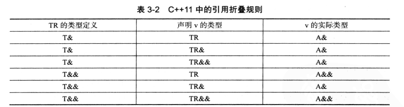

## 前置知识？？？

[现代 C++ 模板教程](https://mq-b.github.io/Modern-Cpp-templates-tutorial/)

[c++11-17 模板核心概念 - 知乎](https://www.zhihu.com/column/c_1306966457508118528)

[C++ 包管理，编译构建配置等问题？？？](https://github.com/Mq-b/Loser-HomeWork/blob/main/src/卢瑟日经/C%2B%2B 包管理，编译构建配置等问题.md)

## 函数模板

### 初识函数模板

[隐式实例化，显式实例化，显式具体化，部分具体化_基础](https://blog.csdn.net/weixin_43717839/article/details/131320956)

[隐式实例化、显式实例化_进阶](https://blog.csdn.net/Jxianxu/article/details/124359007)

[7.9 模板应用于多文件编程 - 知乎](https://zhuanlan.zhihu.com/p/628170334)

[7.10 模板的显式实例化 - 知乎](https://zhuanlan.zhihu.com/p/628172691)

```c++
using namespace std;
template<typename T>
T m_max(T a, T b)
{
	return a > b ? a : b;
}

template

int main() {
	cout << m_max<int>(1, 2) << endl;	// 隐式实例化，显式实例化后面讲

	return 1;
}
```

解析：

- 函数模板不是函数，而是一个用于生成函数的“图纸”。函数模板必须实例化，才会生成具体的函数定义**（注意实例化指的是生成定义，而非直接使用）**，所以显然，同一个函数模板生成的不同类型的模板实例，他们之间没有任何关系。当然啦，如果是同一个函数模板在同一个作用域内生成多个同类型的模板实例，那他们会被合并为一种。
- 函数模板如果没有被使用，或者没有被实例化，就不会生成实际的函数代码。
- 模板是静态的，也就是说**模板实例化的过程位于编译期，没有运行时开销**

### 模板参数推导？？？重写笔记

[先看此链接—— 理解模板参数推导规则 - 知乎？？？](https://zhuanlan.zhihu.com/p/338788455)

```c++
//using namespace std;
template<typename T>
T max(const T& a, const T& b)
{
	return a > b ? a : b;
}

int main() {
/***********************************案例一***********************************/
    
	max(1, 2);				// T推导为int
    max(1, 2.1)				// 推导失败
	max<double>(1, 2.2);	// 显式指定参数，不进行类型推导
    
/***********************************案例二***********************************/
    
	int a = 1;
	const int& b = a;
	max(a, b);				// T推导为int，a的类型为const int&
	max<const int&>(a, b);	// T被指明为const int&，但是a的类型仍然为 const int&
    
/***********************************案例三***********************************/
    
	// ADL 实参依赖查找：编译器会在函数参数（string）的命名空间（std）里面查找该函数（max）
    // ∴报错：多个max实例与参数列表匹配
	max<std::string>("lus", std::string("1"));
	// 解决方法：
	std::max<std::string>("lus", std::string("1"));	// 使用std::max
	::max<std::string>("lus", std::string("1"));	// 使用全局命名空间的max

	return 1;
}
```

补充：

- 案例二：
  - line19：当模板参数为一个指针/引用，但非万能引用时，会根据情况忽略表达式的cv限制符和&，不会忽略*，这点和decltype类似
  - line20：模板在实例化时，会忽略掉多余的cv限制符和多余的&（如果模板参数是&&的话则不会忽略）

？？？分析

```c++
template<typename T>
T max(T&& a, T b)
{
	return a > b ? a : b;
}

int main() {
	int a = 1;
	const int& b = a;
	max(a, b);				// 编译错误？？？
	max<const int&>(a, b);	// T被指明为const int&，但是a的类型仍然为 const int&

	return 1;
}
```

#### 引用折叠

```c++
typedef const int T;
typedef T& TR;
TR& v = 1;			// 该申明再C++98中导致编译错误
```

其中`TR& v=1`这样的表达式会被编译器认为是不合法的表达式，而在C++11中，一
旦出现了这样的表达式，就会发生引用折叠，即将复杂的未知表达式折叠为已知的简单表达式，具体如下图。



**右值引用的右值引用折叠成右值引用，所有其他组合均折叠成左值引用**。而模板对类型的推导规则就比较简单，当转发函数的实参是类型的一个左值引用，那么模板参数被推导为X&类型，而转发函数的实参是类型X的一个右值引用的话，那
么模板的参数被推导为X&& 类型。结合以上的引用折叠规则，就能确定出参数的实际类型。
进一步，我们可以把转发函数写成如下形式

```c++
template <class Ty>
constexpr Ty&& forward(Ty& Arg) noexcept {
    return static_cast<Ty&&>(Arg);
}

int a = 10;            // 不重要
// 如果Arg类型也定义为Ty&&，则为万能引用，Ty被推断为int&，Ty&&为int&（万能引用）
// 正因为模板参数类型中有一个为Ty&而非Ty&&，所以在推断时不会用到万能引用，而是如同普通情况一样，被推断为int
::forward(a);
::forward<int>(a);     // 返回 int&& 因为 Ty 是 int，Ty&& 就是 int&&，未发生引用折叠
::forward<int&>(a);    // 返回 int& 因为 Ty 是 int&，Ty&& 就是 int&，Ty&被折叠成int&
::forward<int&&>(a);   // 返回 int&& 因为 Ty 是 int&&，Ty&& 就是 int&&,Ty&被折叠成int&
```

#### 万能引用

万能引用（universal reference），用在模板中，表现形式通常为`T&&`。表示**接受左值表达式那形参类型就推导为左值引用，接受右值表达式，形参类型就推导为右值引用**。

注意只有模板参数全为`T&&`的形式时，才表示根据万能引用判断规则判断T的类型，否则只会用到引用折叠。

比如：

```c++
template<typename T>
void func(T&& a)
{
	
}

int main() {
	int na = 1;
	const int cnb = na;
	int& clref = na;
	int&& drref = 1;
	func(na);	// 推导为void func<int&>(int& a);	左值推导为int&
	func(cnb);	// 推导为void func<const int&>(const int& a);	万能引用推导时会带上cv限制符
	func(clref);	// 推导为void func<int&>(int& a);	引用折叠
	func(10);	// 推导为void func<int>(int&& a);	右值推导为int，模板形参被推导为int&&
	func(drref);	// 推导为void func<int&>(int& a);	有名字的右值引用算左值

	return 1;
}
```

### 有默认实参的函数模板形参

[详情看这里：函数模板 | 现代 C++ 模板教程](https://mq-b.github.io/Modern-Cpp-templates-tutorial/md/第一部分-基础知识/01函数模板#有默认实参的模板类型形参)

```c++
using namespace std::string_literals;

template<
	typename T1,
	typename T2,
	// 不求值语境，decltype中的T1{}并没有真的创建临时对象，只是用于获取类型而已
	typename RT = decltype(true ? T1{} : T2{}) >
RT max(const T1& a, const T2& b) { // RT 是 std::string
    return a > b ? a : b;
}

int main(){
    auto ret = ::max("1", "2"s);
    std::cout << ret << '\n';
}
```

解析：

- 三目表达式的类型

  `decltype(true ? T1{} : T2{})`

  `decltype`中是一个三目运算符表达式。然后外面使用了 decltype 获取这个表达式的类型，那么问题是，为什么是 true 呢？以及为什么需要 T1{}，T2{} 这种形式？

  1. 我们为什么要设置为 **true**？

     其实无所谓，设置 false 也行，**true 还是 false 不会影响三目表达式的类型。**这涉及到了一些复杂的规则，简单的说就是三目表达式要求第二项和第三项之间能够隐式转换，**整个三目表达式的类型会是 “公共”类型。**

     比如第二项是 int 第三项是 double，三目表达式当然会是 double。
  
     ```c++
     using T = decltype(true ? 1 : 1.2);
     using T2 = decltype(false ? 1 : 1.2);
     ```

     **T 和 T2 都是 double 类型**。

  2. 为什么需要 `T1{}`，`T2{}` 这种形式？

     没有办法，必须构造临时对象来写成这种形式，这里其实是[不求值语境](https://zh.cppreference.com/w/cpp/language/expressions#.E6.BD.9C.E5.9C.A8.E6.B1.82.E5.80.BC.E8.A1.A8.E8.BE.BE.E5.BC.8F)**（就是说`T1{}`，`T2{}`并没有真的创建临时对象，写在这里只是用于让 decltype 获取表达式的类型而已）**。
  
     模板的默认实参的和函数的默认实参大部分规则相同。

简化：

1. C++11后置返回类型

   ```c++
   template<typename T,typename T2>
   auto max(const T& a, const T2& b) -> decltype(true ? a : b){
       return a > b ? a : b;
   }
   int main() {
   	const int a = 1;
   	const int b = 2;
   	max(a, b);
   }
   ```

   - 相比于原始版本：

     `decltype(true ? a : b)`可以带上cv限制符。**前提是传入的两个形参类型一样，否则三目表达式的类型会忽略其中的cv限定符和引用**

     `decltype(true ? T1{} : T2{})`无法带上cv限制符和引用，因为`T1{}`是构造一个临时对象，没有cv限定符以及引用修饰

   - 注意后置返回类型中，auto仅用于占位，不是推导。decltype才是推导

2. C++20简写函数模板（了解）

   ```c++
   decltype(auto) max(const auto& a, const auto& b)  {
       return a > b ? a : b;
   }
   ```

   1. [返回类型推导](https://zh.cppreference.com/w/cpp/language/function#.E8.BF.94.E5.9B.9E.E7.B1.BB.E5.9E.8B.E6.8E.A8.E5.AF.BC)（也就是函数可以直接写 auto 或 decltype(auto) 做返回类型，而不是像 C++11 那样，只是后置返回类型。
   2. [`decltype(auto)`](https://zh.cppreference.com/w/cpp/language/auto) 如果 `max` 示例如果不使用`decltype(auto)`而是`auto`，是不会有引用和 cv 限定的，就只能推导出返回 `T` 类型。

   > 大家需要注意后置返回类型和返回类型推导的区别，它们不是一种东西，后置返回类型虽然也是写的 `auto` ，但是它根本没推导，只是占位。

### 非类型的模板形参

**类型模板实参**传的是类型

**非类型模板实参**传的是值/对象

```c++
template<std::size_t N = 100>
void f() { std::cout << N << '\n'; }

f();     // 默认      f<100>
f<66>(); // 显式指明  f<66>
```

### 重载函数模板

```c++
template<typename T>
void test(T) { std::puts("template"); }

void test(int) { std::puts("int"); }

test(1);        // 优先选择非模板的普通函数，匹配到test(int)
test(1.2);      // 隐式实例化，匹配到模板
test("1");      // 匹配到模板
// “重载决议“就是选择最”匹配“最”合适“的函数
```

### 可变参数模板

```c++
void f(const char*, int, double) { puts("值"); }
void f(const char**, int*, double*) { puts("&"); }

template<typename... Args>//  1. 表示形参包，类型形参包，传入的类型全部存入Args中
// 2. 形参包，参数形参包const char * args0, int args1, double args2
// 2. Args... args 表示展开类型形参包，并将接收到的参数存入args中
void sum(Args... args){	
    f(args...);   // 3. 相当于 f(args0, args1, args2)
    f(&args...);  // 3. 相当于 f(&args0, &args1, &args2)
}

// args 是函数形参包，							  Args 是类型形参包
// args 存储的是传入的全部参数， 				  Args 存储的是所有参数的”类型“
// args... 表示参数形参包展开，展开args中全部参数， Args...表示类型形参包展开，展开Args中所有类型

int main() {
    sum("luse", 1, 1.2);
}
```

#### 逗号运算符

在C++中，**逗号运算符用于将多个表达式连接在一起，按顺序执行每个表达式，并返回最后一个表达式的值**。这种运算符通常用于for循环中的迭代表达式或在一行代码中执行多个操作。

示例:

```c++
int a, b;
a = (b = 3, b + 2); // b被赋值为3，然后计算b+2并赋值给a
```

在这个例子中，`b`首先被赋值为3，然后计算`b+2`的结果，最终将5赋值给`a`。整个逗号表达式的值是最右边表达式的值，即`b+2`

#### 模式

- 模式定义：后随省略号且其中**至少有一个形参包的名字**的**模式**会被展开 成零个或更多个**逗号分隔**的模式实例。

- `&args...` 中 `&args` 就是模式，`Args...`中的`Args`也是一个模式。在展开的时候，模式，也就是省略号前面的一整个表达式，会被不断复制并展开，同时形参包的位置会填入形参包中的第0个元素，然后逗号分隔，直至形参包的元素被消耗完。

- 形参包展开的场景：
  - 一是使用递归的办法把形参包里面的参数一个一个的拿出来进行处理，最后以一个默认的函数或者特化模板类来结束递归；
  - 二是直接把整个形参包展开以后传递给某个适合的函数或者类型。

```c++
template<typename...Args>
// const char (&args0)[5], const int & args1, const double & args2
void print(const Args&...args){
//	(cout << arg0 << endl, 0), (cout << arg1 << endl, 0), (cout << arg2 << endl, 0)
    int _[]{ (cout << args << endl, 0)... };
    cout << sizeof...(args) << endl;	// 计算形参包args中的元素个数（Args也是一样的）
}

int main() {
    print("luse", 1, 1.2);
}
```

习题：

1. 请你分析下列代码输出结果：

   ```c++
   template<typename...Args>
   void print(const Args&...args) {
   	int _[]{ (std::cout << args << ' ' ,0)...};
   }
   
   template<typename T,  size_t N, typename... Args>
   void func(const T(&arr)[N], Args... index){
   	print(arr[index]...);
   }
   
   int main() {
   	int arr[10] = { 0,1,2,3,4,5,6,7,8,9 };
   	func(arr, 1, 3, 5);
   	
   	return 1;
   }
   ```

   分析：

   - 模板函数通用分析步骤：

     1. **先看函数名的返回值和形参列表（根据列表中的逗号区分不同参数），不要先看模板部分。**

        `void func(const T(&arr)[N], Args... index)`：返回值为void，形参列表中一共有一个逗号，也就是两个参数，第一个参数是`const T(&arr)[N]`，第二个参数是`Args... index`

     2. **逐个分析参数，并将函数参数中涉及到的模板参数分成三类（类型模板形参，非类型模板形参，形参包），并且根据情况为这些模板形参设定默认参数，带入函数参数中进行分析。**

        第0个参数：`const T(&arr)[N]`，其中T是类型模板形参，N是非类型模板形参，我们假定`T=int`，`N=5`，显然该函数形参为一个数组引用。

        第1个参数：`Args... index`，其中`Args...`为类型形参包，说明该参数可以接收任意个函数形参

   - 显然根据上面的规则，结合模式的相关知识分析可得：

     `Args`是一个类型形参包，`Args...`表示形参包展开，结果为：`int, int, int`

     `index`是一个函数参数形参包，`arr[index]...`表示形参包展开，结果为：`arr[1], arr[3], arr[5]`

     **（分析形参包的时候，先粗略了解类型形参包中的大致类型，然后重点关注函数体中 函数参数形参包 的作用，以及展开后的结果）**

2. 实现一个函数`sum`，支持`sum(1,2,3,4.5,'1'...)`，即`sum`支持任意类型，任意个数的参数进行调用。

   - 方法一：（变长模板函数递归）

     > 注意 变长模板函数递归 的使用方式以及终止条件

     ```c++
     // 空参数版本，终结模板递归
     template<typename T>
     T m_sum(T num)
     {
     	return num;
     }
     // 参数递归，common_type_t<Args...>表示求形参包中的公共类型，和之前的decltype差不多功能，但更正规。
     template<typename T, typename... Args, typename RT = common_type_t<Args...>>
     RT sum(T num, Args... args)
     {
     	RT res = 0;
     	res = num + m_sum(args...);
     	return res;
     }
     int main() {
     	cout << sum(1, 2, 3, 4) << endl;
     }
     ```

     注意：

     - 空参数版本的模板是必不可少的，原因如下：

       如果写成普通递归的形式：
   
       ```c++
       template<typename T, typename... Args, typename RT = common_type_t<Args...>>
       RT sum(T num, Args... args)
       {
           if (sizeof...(args) == 0)	// 最后一个参数传给了num
           {
               return num;
           }
       	RT res = 0;
       	res = num + m_sum(args...);
       	return res;
       }
       ```
   
       当递归进行到`args...`只剩最后一个的时候，实例化模板结果如下：
   
       ```c++
       int sum(int num)
       {
           if (0 == 0)
           {
               return num;
           }
       	RT res = 0;
       // 	m_sum()依然会被调用，被实例化，但显然无法推导，编译失败
       	res = num + m_sum();
       	return res;
       }
       ```
   
       也就是说，实例化时不会因为提前return而忽略7-10行的实例化，**实例化过程可以理解成将 推导结果/显式申明 替换掉模板中的模板参数的过程**
   
   - 方法二：（数组）
   
     > 形参包展开，正好可以用来初始化数组
   
     ```c++
     template<typename... Args, typename RT = common_type_t<Args...>>
     RT sum(Args... args)
     {
     	int arr[] = { args... };	// 形参包展开，正好可以用来初始化数组
     	int res = 0;
     	for (int i = 0; i < sizeof...(args); i++)
     	{
     		res += arr[i];
     	}
     	return res;
     }
     
     int main() {
     	cout << sum(1, 2, 3, 4,5) << endl;
     }
     ```

### 模板分文件

#### include指令

```c++
#include<iostream>

int main(){
    int arr[] = {
#include"array.txt"
    };
}
```

 `#include`指令仅仅做一个替换。`#include"array.txt"` 直接被替换为了 `1,2,3,4,5`，

#### 分文件原理（链接过程？？？）

我们通常将函数声明放在 `.h` 文件中，将函数定义放在 `.cpp` 文件中，我们只需要在需要使用的文件中 `include` 一个 `.h` 文件；我们前面也说了，`include` 就是复制，事实上是把函数声明复制到了我们当前的文件中。

```c++
//main.cpp
#include "test.h"

int main(){
    f();    // 非模板，OK
}
```

[`test.h`](https://mq-b.github.io/Modern-Cpp-templates-tutorial/code/01模板分文件/test.h) 只是存放了函数声明，函数定义在 [`test.cpp`](https://mq-b.github.io/Modern-Cpp-templates-tutorial/code/01模板分文件/test.cpp) 中，我们编译的时候是选择编译了 `main.cpp` 与 `test.cpp` 这两个文件，那么为什么程序可以成功编译运行呢？

是怎么找到函数定义的呢？明明我们的 `main.cpp` 其实预处理过后只有函数声明而没有函数定义**（∵此时test.h中的代码被复制到了main.cpp和test.cpp里面）**。

这就是链接器做的事情，如果编译器在编译一个翻译单元（如 main.cpp）的时候，如果发现找不到函数的定义，那么就会空着一个符号地址，将它编译为目标文件。期待链接器在链接的时候去其他的翻译单元找到定义来填充符号。

我们的 `test.cpp` 里面存放了 `f` 的函数定义，并且具备外部链接，在编译成目标文件之后之后，和 `main.cpp` 编译的目标文件进行链接，链接器能找到函数 `f` 的符号。

**不单单是函数，全局变量等都是这样，这是编译链接的基本原理和步骤**。

> 类会有所不同，总而言之后续视频会单独讲解的。

------

那么不能模板不能分文件[[4\]](https://mq-b.github.io/Modern-Cpp-templates-tutorial/md/第一部分-基础知识/01函数模板#fn4)的原因就显而易见了，我们在讲[使用模板](https://mq-b.github.io/Modern-Cpp-templates-tutorial/md/第一部分-基础知识/01函数模板#使用模板)的时候就说了：

- **模板，只有你“用”了它，才会生成实际的代码**。

你单纯的放在一个 `.cpp` 文件中，它不会生成任何实际的代码，自然也没有函数定义，也谈不上链接器找符号了**（就是在test.cpp中，没有模板实例化的代码；同样的，在main.cpp中，也不会有实例化的代码，因为test.h中只是申明了一个模板，并没有定义，所以main.cpp期待链接器在链接的时候去其他的翻译单元找到定义来填充符号）。**

> 所以模板通常是直接放在 `.h` 文件中，而不会分文件。或者说用 `.hpp` 这种后缀，这种约定俗成的，代表这个文件里放的是模板。

## 类模板

### 初识类模板与参数推导

[比较简单，看这里：类模板](https://mq-b.github.io/Modern-Cpp-templates-tutorial/md/第一部分-基础知识/02类模板#初识类模板)

类模板不是类

注意类模板参数推导在c++17以上可用

### 用户定义的推导指引

注意该语法在：1. C++17以上；2. 进行类模板参数推导时；这两种情况同时满足时可用

- 语法：

  `模板名称(实际被推导的类型a)->模板名称<想要让a被推导为的类型>`

- 示例：

  1. 我要让一个类模板，如果推导为 int，就让它实际成为 size_t：

     ```c++
     template<typename T>
     struct Test{
         Test(T v) :t{ v } {}
     private:
         T t;
     };
     Test(int) -> Test<std::size_t>;	// 推导指引
     
     int main(){
         Test t(1);      // t 是 Test<size_t>
     }
     ```

  2. 我要让类模板 `Test` 如果推导为指针类型，就让它实际成为数组：

     如果涉及的是类类型，那么就需要加上 `template`，然后使用它的模板形参。

     ```c++
     //接上面的test定义
     template<typename T>
     Test(T*) -> Test<T[]>;	// 推导指引
     
     int main(){
         char* p = nullptr;
     	Test t(p);      // t 是 Test<char[]>
     }
     ```

  3. 我们提一个稍微有点难度的需求：

     ```c++
     template<class Ty, std::size_t size>
     struct array {
         Ty arr[size];
     };
     
     ::array arr{1, 2, 3, 4, 5};     // Error!
     ```

     类模板 array 同时使用了类型模板形参与非类型模板形参，保有了一个成员是数组。

     它无法被我们直接推导出类型，此时就需要我们自己**定义推导指引**。

     这会用到我们之前在函数模板里学习到的形参包。

     ```c++
     template<typename T, typename ...Args>
     array(T t,Args...) -> array<T, sizeof...(Args) + 1>;
     
     ::array arr{1, 2, 3, 4, 5};		// right！
     ```

     原理很简单，我们要给出 array 的模板类型，那么就让模板形参单独写一个 T 占位，放到形参列表中，并且写一个模板类型形参包用来处理任意个参数；获取 array 的 size 也很简单，直接使用 sizeof... 获取形参包的元素个数，然后再 +1 ，因为先前我们用了一个模板形参占位。**（T是通过捕获第1个参数来进行推导的，也就是1，然后2，3，4，5被Args...捕获，所以第二个参数的结果要+1）**

     标准库的 [`std::array`](https://zh.cppreference.com/w/cpp/container/array/deduction_guides) 的推导指引，原理和这个一样。

### 有默认实参的类模板形参

[看这个就行：类模板](https://mq-b.github.io/Modern-Cpp-templates-tutorial/md/第一部分-基础知识/02类模板#有默认实参的模板形参)

不管C++标准是多少，使用类模板时最好都要带上<>

```c++
template<typename T = int>
struct X{};

int main(){
	X x;    // x 是 X<int> C++17 起 OK
	X<> x2; // x2 是 X<int>
}
```


### 模板模板形参

[类模板 | 现代 C++ 模板教程](https://mq-b.github.io/Modern-Cpp-templates-tutorial/md/第一部分-基础知识/02类模板#模板模板形参)

函数/类模板的模板类型形参可以接受一个**类模板**作为参数，我们将它称为：模板模板形参。

- 语法：

  ```c++
  template< 形参列表 >class 名字(可选)              (1)
  template< 形参列表 >class 名字(可选) = default    (2)
  template< 形参列表 >class... 名字(可选)           (3) (C++11 起)
  ```

- 示例：

  注意C表示的是一个类模板，一个没有经过实例化的类模板。class前面部分表示该类模板的模板参数，符合该模板参数的类模板都可以作为类模板Array的模板模板形参。

  也就是说：模板形参有三种类型：（当然除此之外还有形参包）

  1. 非类型模板形参：模板形参是一个变量
  2. 类型模板形参：模板形参是一个类型（或者经过实例化的模板）
  3. 模板模板形参：模板形参是一个类模板

  以上三种类型的形参可以一起使用，都可以拥有默认模板参数和形参包

  ```c++
  template<typename T>
  struct my_array{
      T arr[10] = {};
  };
  
  template<
  	typename Ty,
  	template<typename T>class C = my_array >	// 	注意C表示的是一个类模板
  struct Array {
      C<Ty> MyArr;		// 注意此时MyArr是一个实例化的类对象
  };
  
  Array<int, my_array>arr;    // arr 保有的成员是     my_array<int> 而它保有了 int arr[10]
  ```

### 成员函数模板

- 类模板中的成员函数模板

  ```c++
  template<typename T>
  struct Class_template{
      template<typename... Args>
      void f(Args&&...args) {}
  };
  ```

- 普通类中的成员函数模板

  ```c++
  struct Test{
      template<typename...Args>
      void f(Args&&...args){}		// Args&&是模式
  };
  ```

### 可变参数类模板

和可变参数函数模板一样的

```c++
template<typename... Args>
struct A
{
	A(Args... args) : tup{ args... }
	{

	}
	void m_get()
	{
		for (int i = 0; i < sizeof...(Args);i++)
		{
			// 编译报错，原因很简单：模板实例化发生在编译器，i的值产生在运行期，所以编译失败
			cout << std::get<i>(tup) << endl;
		}
	}
	tuple<Args...> tup;
};

int main() {
    // 注意字符串数组（const char[N]）在推断时会被隐式转换为const char*
	A a{ 1, 2, 3, 4, 6.5, "11213" };
	a.m_get();

	return 1;
}

```

### 类模板分文件

[很简单，看这里：类模板 | 现代 C++ 模板教程](https://mq-b.github.io/Modern-Cpp-templates-tutorial/md/第一部分-基础知识/02类模板#类模板分文件)

类模板和函数模板类似，都无法分文件

## 变量模板

### 初识变量模板和使用

[很简单，看这个：变量模板 | 现代 C++ 模板教程](https://mq-b.github.io/Modern-Cpp-templates-tutorial/md/第一部分-基础知识/03变量模板)

```c++
template<typename T, T vl>
 T v = vl;

int main() {
	v<int, 1>;
	cout << &v<int, 1> << endl;		// 00007FF649E0F04C
	cout << &v<int, 1> << endl;		// 00007FF649E0F04C
	cout << &v<double, 1.4> <<endl;	// 00007FF649E0F050

	return 1;
}
```

解析：

- 变量模板不是变量

- 变量模板实例化后相当于全局变量

- 同一个变量模板生成不同类型的模板实例时，模板实例之间没有区别；在同一作用域下生成多个同种类型的模板实例时，模板实例会被合并为一个（`v<int, 1>`和`v<int, 1>`是同一个，但`v<int, 1>`和`v<double, 1.4>`不是同一个）


### 变量模板默认实参与非类型模板形参

[很简单，看这个：变量模板](https://mq-b.github.io/Modern-Cpp-templates-tutorial/md/第一部分-基础知识/03变量模板#有默认实参的模板形参)

### 可变参数变量模板

[很简单，看这个：变量模板](https://mq-b.github.io/Modern-Cpp-templates-tutorial/md/第一部分-基础知识/03变量模板#可变参数变量模板)

### 类的静态成员模板

#### ODR规则？？？

[C/C++编程：单一定义规则ODR（不理解）_c++ ord-CSDN博客](https://blog.csdn.net/zhizhengguan/article/details/114988629)

[ODR规则](https://blog.csdn.net/m0_51165837/article/details/141463073#)

[定义与 ODR （单一定义规则） - C++中文 - API参考文档](https://www.apiref.com/cpp-zh/cpp/language/definition.html)

#### 类的静态成员

```c++
struct X{
    static int n;	// 申明
};
int X::n;		// 定义
```

或者在 C++17 以 inline 或者 constexpr 修饰。

> 因为 C++17 规定了 **inline** 修饰静态数据成员，那么这就是在类内定义，不再需要类外定义。`constexpr` 在 C++17 修饰静态数据成员的时候，蕴含了 **inline**。

```c++
struct X {
    inline static int n;
};

struct X {
    constexpr static int n = 1;      // constexpr 必须初始化，并且它还有 const 属性
};
```

#### 类的静态数据成员模板

```c++
struct limits{
    template<typename T>
    static const T min; // 静态数据成员模板的声明，如果是c++17的话，可以使用inline，constexpr，这样就变成了一个定义申明
};
 
template<typename T>
const T limits::min = {}; // 静态数据成员模板的定义
```

### 变量模板分文件

[很简单，看这个：变量模板 | 现代 C++ 模板教程](https://mq-b.github.io/Modern-Cpp-templates-tutorial/md/第一部分-基础知识/03变量模板#变量模板分文件)

## 模板全特化

> - 模板全特化相当于编译器定义了一个普通函数/类/变量，它有类似于显式实例化的效果
> - 语法：
>   1. **省略模板参数的形参列表**：`template<param_list>`改为`template<>`
>   2. **函数/变量/类名后面带上特化的类型/非类型变量**：`void f<double>( ){ } // 其他类型模板同理`

### 函数模板全特化

格式：

```c++
template<typename T,typename T2>
auto f(const T& a, const T2& b)  {		// 主函数模板
    return a + b;
}
template<>
auto f<double, int>(const double& a, const int& b) {   // 全特化，在函数名后面指明特化类型
    return a - b;
}
```

### 类模板全特化

[如果看不懂的话，看这里：类模板全特化](https://mq-b.github.io/Modern-Cpp-templates-tutorial/md/第一部分-基础知识/04模板全特化#类模板全特化)

```c++
template<typename T>
struct m_is_void				// 主模板
{
//	如果不喜欢枚举数组，也可以用 static constexpr bool value = false; 代替（C++17）
	enum : bool { value = false };	// 枚举数组是静态编译期常量 
};

template<>
struct m_is_void<void>			// 对 T = void 的显式特化
{
	enum : bool{ value = true };
};

template<typename T>			// 变量模板，可以不用太在意，下面会讲
constexpr bool m_is_void_v = m_is_void<T>::value;

int main() {
	cout << boolalpha << m_is_void_v<int> << endl;
	cout << boolalpha << m_is_void_v<void> << endl;
	return 1;
}
```

- 为什么用`enum`
  1. 早期没有`constexpr`
  2. 在c++17以前，使用静态数据成员需要类外定义，用枚举的话，就相当于直接定义了一个静态编译期常量
  3. 所以从通用性考虑，应该使用`enum`

### 变量模板全特化

语法都大差不大，不过可以对上面的代码优化一下

```c++
template<typename T>
constexpr bool m_is_void_v = false;

template<>
constexpr bool m_is_void_v<void> = true;

int main() {
	cout << boolalpha << m_is_void_v<int> << endl;
	cout << boolalpha << m_is_void_v<void> << endl;
	return 1;
}
```

### 模板全特化细节

1. **特化必须在导致隐式实例化的首次使用之前**，在每个发生这种使用的翻译单元中声明

   ```c++
   template<typename T> // 主模板
   void f(const T&){}
   
   void f2(){
       f(1);  // 使用模板 f() 隐式实例化 f<int>
   }
   
   // 错误 f<int> 的显式特化在隐式实例化之后出现
   // 编译结果相当于有两个void f(const int&){}函数
   template<> 
   void f<int>(const int&){}
   ```

2. 只有声明没有定义的模板或模板特化可以像其他不完整类型一样使用（例如可以使用到它的指针和引用）：

   [C/C++_的不完整类型详解](https://blog.csdn.net/lovely_ke/article/details/82949556)

   ```c++
   template<class T> // 主模板
   class X;
   template<>        // 特化（声明，不定义）
   class X<int>;
    
   X<int>* p;       // OK：指向不完整类型的指针
   X<int> x;        // 错误：不完整类型的对象
   X<double>* p;    // OK：指向不完整类型的指针
   X<double> p;     // 错误：不完整类型的对象
   ```

3. 函数模板和变量模板的显式特化是否为 [inline](https://zh.cppreference.com/w/cpp/language/inline)/[constexpr](https://zh.cppreference.com/w/cpp/language/constexpr)/[constinit](https://zh.cppreference.com/w/cpp/language/constinit)/[consteval](https://zh.cppreference.com/w/cpp/language/consteval) **只与显式特化自身有关**，**主模板的声明是否带有对应说明符对它没有影响**。模板声明中出现的[属性](https://zh.cppreference.com/w/cpp/language/attributes)在它的显式特化中也没有效果：

   [C++11关键字constexpr看这篇就够了-CSDN博客](https://blog.csdn.net/yao_hou/article/details/109301290)

   ```c++
   // 主模板
   template<typename T>
   int f(T) { return 6; }
   // 全特化
   template<>
   constexpr int f<int>(int) { return 6; }   // OK，f<int> 是以 constexpr 修饰的
   
   int main(){
       constexpr auto n = f<int>(0);         // OK，f<int> 是以 constexpr 修饰的，可以编译期求值
       //constexpr auto n2 = f<double>(0);   // Error! f<double> 不可编译期求值
   
   }
   ```

   其实这个很好理解吧，你只要记住：**模板在实例化的时候，只会对模板参数进行推导替换，其余的部分就是复制粘贴。**以上的注意事项就很好理解了。

### 特化的成员

[完整版看这里：模板的特化成员](https://mq-b.github.io/Modern-Cpp-templates-tutorial/md/第一部分-基础知识/04模板全特化#特化的成员)

1. **特化成员类模板**。设置 `A<int>` 情况下模板类 `C` 中有一个函数`f()`输出”hello world“。

   ```c++
   template<typename T>
   struct A {
   	struct B {};      // 成员类
   
   	template<class U> // 成员类模板
   	struct C {};
   };
   
   // 1. 只对A进行全特化
   template<>
   template<class U>
   struct A<int>::C{
       void f();               // 类内声明
   };
   // template<> 会用于定义被特化为类模板的显式特化的成员类模板的成员
   template<>
   template<class U>
   void A<int>::C<U>::f(){     // 类外定义
       cout << "hello world" << endl;
   }
   
   // 2. 当然我们也可以对A和C都进行全特化
   template<>
   template<>
   struct A<int>::C<int> {
   	void f() {
   		cout << "hello world A" << endl;
   	}
   };
   
   int main() {
   	A<int>::C<double> ad;
   	ad.f();
   
   	A<int>::C<int> ai;
   	ai.f();
   
   	return 1;
   }
   ```

2. **特化类的成员函数模板**，类内特化和类外特化都可以

   ```c++
   struct X{
       template<typename T>	// 主模板
       void f(T){}
   
       template<>              // 类内特化
       void f<int>(int){
           std::puts("int");
       }
   };
   
   template<>                  // 类外特化
   void X::f<double>(double){
       std::puts("void");
   }
   int main(){
   	X x;
   	x.f(1);     // int
   	x.f(1.2);   // double
   	x.f("");
   }
   
   ```

3. **特化类模板的成员函数模板**

   ```c++
   template<typename T>
   struct X {
       template<typename T2>
       void f(T2) {}
   
       template<>
       void f<int>(int) {            // 类内特化，对于 函数模板 f<int> 的情况，对X无要求
           std::puts("f<int>(int)"); 
       }
   };
   
   template<>
   template<>
   void X<void>::f<double>(double) { // 类外特化，对于 X<void>::f<double> 的情况
       std::puts("X<void>::f<double>");
   }
   int main(){
       X<void> x;
   	x.f(1);    // f<int>(int)
   	x.f(1.2);  // X<void>::f<double>
   	x.f("");
   }
   ```

## 模板偏特化

> - **函数模板无法进行偏特化，只有类模板，变量模板可以**
> - 偏特化的两种类型：
>   1. 偏特化模板形参类型（`T*`，`T&`）
>   2. 偏特化模板形参个数（不要求一定要按照从左至右的顺序）

模板偏特化这个语法让**模板实参具有一些相同特征**可以自定义，而不是像全特化那样，必须是**具体的**什么类型，什么值。

比如：指针类型，这是一类类型，有 `int*`、`double*`、`char*`，以及自定义类型的指针等等，它们都属于指针这一类类型；可以使用偏特化对指针这一类类型进行定制。

- ***模板偏特化使我们可以对具有相同的一类特征的类模板、变量模板进行定制行为。***

#### 变量模板偏特化

```c++
template<typename T, typename T2>				// 主模板
const char* str = "???";

template<typename T, typename T2>				// 1. 偏特化模板参数的类型
const char* str<T*, T2&> = "T = T*, T2 = T2&";

template<typename T2>					// 2.1. 偏特化模板参数个数
const char* str<int, T2> = "T = int";

template<typename T>					// 2.2. 偏特化模板参数个数（不要求偏特化顺序）
const char* str<T, int> = "T2 = int";

 // 偏特化，但是只是对 T[] 这一类类型，而不是数组类型，因为 int[] 和 int[N] 不是一个类型
template<typename T2>
const char* s<T[], T2> = "array";  

int main() {
	cout << str<void, void> << endl;
	cout << str<void*, int&> << endl;
	cout << str<int, void> << endl;
	cout << str<void, int> << endl;

	return 1;
}
```

#### 类模板偏特化

[同上，看这里：模板偏特化 ](https://mq-b.github.io/Modern-Cpp-templates-tutorial/md/第一部分-基础知识/05模板偏特化#类模板偏特化)

和变量模板差不多，也有两种偏特化的方式

### 实现`std::is_same_v`

- 实现一（借用`is_same`来实现）

  ```c++
  template <typename T, typename T2>
  struct m_is_same
  {
  	enum : bool {value = false};
  };
  
  template <typename T>
  struct m_is_same<T, T>
  {
  	enum : bool { value = true };
  };
  
  int main() {
  	cout << m_is_same<int, int>::value << endl;
  	cout << m_is_same<int, double>::value << endl;
  }
  ```

- 实现二（简单版本）

  ```c++
  template <typename T, typename T> // 主模板
  inline constexpr bool is_same_v = false; 
  template <typename Ty>     // 偏特化
  inline constexpr bool is_same_v<Ty, Ty> = true;
  ```

  这是对变量模板的偏特化，逻辑也很简单，如果两个模板类型参数的类型是一样的，就匹配到下面的偏特化，那么初始化就是 true，不然就是 false。

  声明为 inline 的是因为 内联变量 (C++17 起)可以在被多个源文件包含的头文件中定义。也就是允许多次定义。

## 显式实例化解决分文件问题

### 函数模板显式实例化

[建议先看看这里：模板显式实例化解决模板分文件问题](https://mq-b.github.io/Modern-Cpp-templates-tutorial/md/第一部分-基础知识/06模板显式实例化解决模板分文件问题#函数模板显式实例化)

- 语法：

  ```c++
  template 返回类型 名字 < 实参列表 > ( 形参列表 ) ;          (1)
  template 返回类型 名字 ( 形参列表 ) ;                      (2)
  ```

  1. 显式实例化定义（显式指定所有无默认值模板形参时不会推导模板实参）
  2. 显式实例化定义，对所有形参进行模板实参推导

- 举例：

  ```c++
  // test.h
  template<typename T>
  T m_max(T a, T b);
  
  // test.cpp
  #include "test.h"
  template<typename T>
  T m_max(T a, T b)
  {
  	return a > b ? a : b;
  }
  // 显式实例化，编译过后，test.obj中只有int m_max(int a, int b)这个函数
  template int m_max<int>(int a, int b);		
  
  // main.cpp
  int main() {
  	cout << m_max(2, 1) << endl;		// 编译通过
  	cout << m_max(2.1, 3.2) << endl;	// 编译错误：链接失败
  
  	return 1;
  }
  ```

### 类模板显式实例化

[详情看这里：模板显式实例化解决模板分文件问题](https://mq-b.github.io/Modern-Cpp-templates-tutorial/md/第一部分-基础知识/06模板显式实例化解决模板分文件问题#类模板显式实例化)

- 首先要明白什么是类的完整定义

  > 类的完整定义不包括成员函数定义，理论上只要数据成员定义都有就行了。

  ```c++
  // main.cpp
  struct A{
      int a;
      void func();	// 只有申明，没有定义
  }
  int main(){
      A a;
      a.func();		// 编译错误：链接失败，但是A的对象仍然可以创建成功。
  }
  ```

- 语法：

  ```c++
  template 类关键词 模板名 < 实参列表 > ;	        (1)	
  extern template 类关键词 模板名 < 实参列表 > ;	(2)	(C++11 起)
  ```

  类关键词 class，struct 或 union

  1. 显式实例化定义
  2. 显式实例化声明

- 举例：

  ```c++
  // test.h
  #include<iostream>
  template<typename T>
  struct X {
      int a{};
      void f();
  };
  
  // test.cpp
  #include "test.h"
  template<typename T>
  void X<T>::f(){
      cout << "111" << endl;
  }
  template struct X<int>;		// 显式实例化int版本的struct X
  //main.cpp
  #include "test.h"
  int main(){
      X<int>x;
      x.f();  
  }
  ```

### 总结

模板必须实例化才能使用，实例化就会生成实际代码；有隐式实例化和显式实例化，我们平时粗略的说的“*模板只有使用了才会生成实际代码*”，其实是指使用模板的时候，就会**隐式实例化**，生成实际代码。

分文件自然没有隐式实例化了，那我们就得显式实例化，让模板生成我们想要的代码。

模板全特化有类似模板显式实例化的作用，不过我们一般知道这件事情即可。

## 显式实例化解决模板导出.lib/.dll

[也很简单，看这里：显式实例化解决模板导出静态库动态库](https://mq-b.github.io/Modern-Cpp-templates-tutorial/md/第一部分-基础知识/07显式实例化解决模板导出静态动态库#模板生成动态库与测试)

函数模板、类模板**显式实例化**，不要放在 `.h` 文件中，因为 **一个显式实例化定义在程序中最多只能出现一次**；如果放在 `.h` 文件中，被多个翻译单元使用，就会产生问题。

> 当显式实例化函数模板、变量模板 (C++14 起)、类模板的成员函数或静态数据成员，或成员函数模板时，**只需要它的声明可见**。

> **类模板、类模板的成员类或成员类模板在显式实例化之前必须出现完整定义**，除非之前已经出现了拥有相同模板实参的显式特化

## 折叠表达式（C++17新特性）

[折叠表达式 | 现代 C++ 模板教程](https://mq-b.github.io/Modern-Cpp-templates-tutorial/md/第一部分-基础知识/08折叠表达式#折叠表达式)

《C++17完全指南》page97

> - 用于替代C++11中的模板递归处理形参包的场景
>
> - 左折叠：`...` 是在“形参包”右边
>
>   右折叠：`...` 是在“形参包”左边
>
> - 折叠表达式展开诀窍：
>
>   1. 一元折叠： (` (… op args)`，` (args op …)`) 
>
>      - 先看`...`的位置
>
>      - 将`...`左/右边的包含形参包的模式全部展开
>      - 在展开的模式中间填充运算符
>      - 如果是左折叠，则先将最左边两个模式括起来，然后递归由内向外使用括号，如果是右折叠，则正好反过来。注意`op`为` ,`时不用管括号，直接从左往右算，注意`op`为` =`时不用管括号，直接从右往左赋值（原因见：《C++17完全指南》page103）
>
>   2. 二元折叠：（`(value op … op args)`，`(args op … op value)`）
>
>      - 先看`...`的位置
>
>      - 将`...`左/右边的包含形参包的模式连着`value`一起全部展开（顺序不能错）
>      - 在展开的模式中间填充运算符（注意`...`两边的op必须一样）
>      - 如果是左折叠，则先将最左边两个模式括起来，然后递归由内向外使用括号，如果是右折叠，则正好反过来。
>
> - **除了`&&`，`||`，`,`这三个运算符，使用折叠表达式时应使用二元折叠，因为args可能为空参数包（这也是二元折叠的用途）**
>
> - 写二元折叠时的小技巧：
>
>   1. 确定`value`和`op`
>
>   2. 看`value`应该在最左边还是在最右边（左边则使用二元左折叠，右边使用二元右折叠）
>
>   3. 直接写下`(value op … op args)` 或者 `(args op … op value)`
>
>   4. 根据要求填入包含`args`的模式（可以是函数，lambda表达式，表达式等等），注意此时需要把`args`当成一个参数带入模式中去理解，
>
> 	假设现在要实现”输出形参包的值至终端“的这样一个小任务，显然此时
>
> 	1. `value`为`cout`，`op`为`<<`
> 	2. `value`应该在最左边
> 	3. 形式为`cout << ... << args`
> 	4. 并没有对形参包做多余要求，所以最终格式就为：`cout << ... << args`
> 	
> - `(...,args)`和`args...`包展开很像，但折叠表达式不要求语境，包展开要求语境

#### 语法

  ```c++
  ( args op … )              (1)
  ( … op args )              (2)	// (...,args)和args...包展开有点像
  ( args op … op value )   (3)
  ( value op … op args )   (4)
  ```

  1. 一元右折叠`( args op … )` 将会展开为：`arg1 op (arg2 op … (argN­1 op argN))`
  2. 一元左折叠`( … op args )` 将会展开为：`((arg1 op arg2) op arg3) op …`
  3. 二元右折叠`( args op … op value )` 将会展开为：`arg1 op (arg2 op … (argN op value))`
  4. 二元左折叠`( value op … op args )` 将会展开为：`(((value op arg1) op arg2) op arg3) op …`

#### 一元折叠使用

  ```c++
  // 一元左折叠
  template<typename... T>
  auto foldSumL(T... args) {
  return (... + args); // ((arg1 + arg2) + arg3)...
  }
  // 一元右折叠
  template<typename... T>
  auto foldSumR(T... args) {
  return (args + ...); // (arg1 + (arg2 + arg3))...
  ```

#### 参数包为空时的处理

  当使用折叠表达式处理空参数包时，将遵循如下规则：

  • 如果使用了 `&&` 运算符，值为 `true`。

  • 如果使用了 `||` 运算符，值为 `false`。

  • 如果使用了 `,` 运算符，值为 `void()`。

  • 使用所有其他的运算符，都会引发格式错误

  对于所有其他的情况，可以使用二元折叠解决

#### 二元折叠使用

  - 基础用法：

    ```c++
    // 二元左折叠
    template<typename... T>
    auto foldSum (T... s) {
    return (0 + ... + s); // 即 使sizeof...(s)==0也 能 工 作
    }
    // 二元右折叠
    template<typename... T>
    auto foldSum (T... s) {
    return (s + ... + 0); // 即 使sizeof...(s)==0也 能 工 作
    }
    ```

  - 进阶使用：

    ```c++
    template<typename... T>
    void print(const T&... args)
    {
    	(cout << ... << args) << '\n';
    //	cout << (args << ... << '\n');	这个就是错误的，会先进行argn<<'\n'的左移运算，可以自己分析一下
    }
    ```

    但这样使用会导致输出的参数之间没有空格，所以改进如下：

    ```c++
    template<typename T>
    const T& spaceBefore(const T& arg) {
    	std::cout << ' ';
    	return arg;
    }
    template <typename First, typename... Args>
    void print (const First& firstarg, const Args&... args) {
    	cout << firstarg;
    	(cout << ... << spaceBefore(args)) << '\n';
    }
    ```

    ```c++
    // 可读性更高的方法
    template<typename First, typename... Args>
    void print (const First& firstarg, const Args&... args) {
    	cout << firstarg;
        // 注意spaceBefore是个函数，不是lambda表达式返回值
        // 如果不指定lambda的返回值，则默认以值返回对象，所以显式指定为const auto&
    	auto spaceBefore = [](const auto& arg) -> const auto& {
    		cout << ' ';
    		return arg;
    	};
    	(cout << ... << spaceBefore(args)) << '\n';
    }
    ```

    更简单的办法：
    
    ```c++
    // 使用一个 lambda输出空格和参数，然后在一元折叠表达式里使用它：
    template<typename First, typename... Args>
    void print(First first, const Args&... args) {
    	std::cout << first;
    	auto outWithSpace = [](const auto& arg) {
    		std::cout << ' ' << arg;
    	};
    	(... , outWithSpace(args));
    	std::cout << '\n';
    }
    ```

#### 折叠表达式的复杂使用

- 折叠基类的函数调用

  ```c++
  #include <iostream>
  // 可 变 数 量 基 类 的 模 板
  template<typename... Bases>
  class MultiBase : private Bases...
  {
  public:
  	void print() {
  // 		调 用 所 有 基 类 的print()函 数
  		(... , Bases::print());
  	}
  };
  struct A {
  	void print() { std::cout << "A::print()\n"; }
  }
  struct B {
  	void print() { std::cout << "B::print()\n"; }
  }
  struct C {
  	void print() { std::cout << "C::print()\n"; }
  }
  int main()
  {
  	MultiBase<A, B, C> mb;
  	mb.print();
  }
  ```

- 折叠路径遍历

  ```c++
  // 定 义 二 叉 树 结 构 和 遍 历 帮 助 函 数
  struct Node {
  	int value;
  	Node *subLeft{nullptr};
  	Node *subRight{nullptr};
      
  	Node(int i = 0) : value{i} {}
      
  	int getValue() const {
  		return value;
  	}
      
  	...
  	// 遍 历 帮 助 函 数
  	static constexpr auto left = &Node::subLeft;
  	static constexpr auto right = &Node::subRight;
      
  	// 使 用 折 叠 表 达 式 遍 历 树
  	template<typename T, typename... TP>
  	static Node *traverse(T np, TP... paths) {
  		return (np ->* ... ->* paths); // np ->* paths1 ->* paths2
  	}
  };
  ```

- 折叠表达式处理类型

  ```c++
  #include <type_traits>
  // 检 查 是 否 所 有 类 型 都 相 同
  template<typename T1, typename... TN>
  struct IsHomogeneous {
  	static constexpr bool value = (std::is_same_v<T1, TN> && ...);
  };
  // 检 查 是 否 所 有 传 入 的 参 数 类 型 相 同
  template<typename T1, typename... TN>
  constexpr bool isHomogeneous(T1, TN...)
  {
  	return (std::is_same_v<T1, TN> && ...);
  }
  ```

  如果是C++11，则不使用类模板，而是要使用函数模板递归

  ```c++
  template<typename T1>
  bool test() {
  	return true;
  }
  template<typename T1, typename T2, typename... TN>
  constexpr bool test() {
  	//bool value = std::is_same_v<T1, T2>&& test<T1, TN...>();
  	return std::is_same_v<T1, T2>&& test<T1, TN...>();
  }
  ```

- 作业

  说出以下代码使用的折叠表达式语法，以及它的效果，详细解析，使用 Markdown 语法。

  ```c++
  template<class ...Args>
  auto Reverse(Args&&... args) {
      std::vector<std::common_type_t<Args...>> res{};
      bool tmp{ false };
      (tmp = ... = (res.push_back(args), false));
      return res;
  }
  ```

## 待决名

[详情看这里：待决名 | 现代 C++ 模板教程](https://mq-b.github.io/Modern-Cpp-templates-tutorial/md/第一部分-基础知识/09待决名#待决名)

[待决名 - cppreference.com](https://zh.cppreference.com/w/cpp/language/dependent_name)

- 定义：

  在模板（类模板和函数模板）定义中，某些构造的含义可以在不同的实例化间有所不同。特别是，类型和表达式可能会取决于类型模板形参的类型和非类型模板形参的值。

- 解析：

  1. 待决名指的是一个**表达式**，是一个等待判断，决断的名字，需要确定它到底代表什么，是指一些有歧义的情况
  2.  待决名的意思是在定义的地方，类型还不能决断，需要延后到实例化确定时。而非待决名指类型在定义的地方已经确定（这么看待决名像一个编译期的名字，应该作用于编译期的语义分析时期）。
  3. 延后将导致此时无法在定义点进行错误检查，以及消除`typename`和`template`歧义，这导致需要在调用点加上template

- 例子：

  ```c++
  template<typename T>
  struct X : B<T> // "B<T>" 取决于 T，"B<T>"不是待决名
  {
      typename T::A* pa; // "T::A" 取决于 T，"T::A"是待决名，pa是类型待决的成员变量
                         // （如果不用 "typename"，编译器会认为A是T中的成员变量）
      void f(B<T>* pb)   // 显然根据定义，B<T>* pb不是待决名，它是一个变量的申明
      {
          static int i = B<T>::i; // "B<T>::i" 取决于 T，B<T>::i是待决名
          pb->j++; // "pb->j" 取决于 T，pb->j++是待决名
      }
  };
  ```


### 待决名的 `typename` 消除歧义符

> - 注意：有歧义的地方是类型，编译器默认`::`后面跟着的是变量，`typename`的作用是告诉编译器将该变量识别成类型

- 使用规则：

  **在模板（包括别名模版）的声明或定义中，不是当前实例化的成员且取决于某个模板形参的名字不会被认为是类型，除非使用关键词 typename 或它已经被设立为类型名（例如用 typedef 声明或通过用作基类名）**。

- 例子：

  ```c++
  int p = 1;
  
  template<typename T>
  void foo(const std::vector<T>& v){
      // std::vector<T>::const_iterator 是待决名，
      typename std::vector<T>::const_iterator it = v.begin();
  
      // 下列内容因为没有 'typename' 而会被解析成
      // 类型待决的成员变量 'const_iterator' 和某变量 'p' 的乘法。
      // 因为在此处有一个可见的全局 'p'，所以此模板定义能编译。
      std::vector<T>::const_iterator* p;
  
      typedef typename std::vector<T>::const_iterator iter_t;
      iter_t* p2; // iter_t 是待决名，但已知它是类型名
  }
  
  int main(){
      std::vector<int>v;
      foo(v); // 实例化失败
  }
  ```

  注意：`typedef std::vector<T>::const_iterator iter_t;` 在 msvc 可以被解析，通过编译，这是非标准的，知道即可(g++中不行)。

### 待决名的 `template` 消除歧义符

> 判断是不是当前实例化的成员，就看该成员在编译阶段能不能确定具体类型，如果不能，就不是

- 使用规则：

  **与此相似，模板定义中不是当前实例化的成员的待决名同样不被认为是模板名，除非使用消歧义关键词 template，或它已被设立为模板名：**

- 例子：

  ```c++
  template<typename T>
  struct S {
  	template<typename U>
  	void foo() {}
  };
  
  template<typename T>
  void bar() {
  	S<T> s;					// s不是当前实例化的成员
  	s.foo<T>();				// 错误：< 被解析为小于运算符
  	s.foo<int>();			// 错误同上，编译器认为foo是s中的成员变量	
  	s.template foo<T>();	// OK
  
  	S<int> s1;				// s1是当前实例化的成员
  	s1.foo<T>();			// 此时 s.foo<T>() 不是待决名
  }
  
  template<class T>
  struct Y : X<T> {
  	void t()const {
  		x.f<T>();			// 错误
  		x1.f<T>();			// ok
  	}
  	X<T> x;					// x不是当前实例化的成员
  	X<int> x1;				// x1是当前实例化的成员
  };
  
  ```

  注意：`s.foo<T>()` 在 msvc 可以被解析，通过编译，这是非标准的，知道即可(g++中不行)。

- 注意事项：

  关键词 `template` 只能以这种方式用于运算符 `::`（作用域解析）、`->`（通过指针的成员访问）和 `.`（成员访问）之后，下列表达式都是合法示例：

  - `T::template foo<X>();`
  - `s.template foo<X>();`
  - `this->template foo<X>();`
  - `typename T::template iterator<int>::value_type v;`

  与 typename 的情况一样，即使名字并非待决或它的使用并未在模板的作用域中出现，也允许使用 template 前缀。

  ```c++
  struct X{
      template<typename T>
      void f()const {}
  };
  struct C{
      using Ctype = int;
  };
  
  X x;
  x.template f<void>();
  C::template Ctype I;
  ```

  *没有作用，但是合法*。

### 非待决名的绑定规则

> **对待决名和非待决名的名字查找和绑定有所不同**。
>
> **非待决名在模板定义点查找并绑定。即使在模板实例化点有更好的匹配，也保持此绑定**
>
> **非待决名在模板定义点的查找范围由 当前类->父类->全局逐步扩大 进行查找并绑定。在找到匹配的函数之后立即绑定，即使外面的作用域中有更匹配的函数，也不会更改绑定**

```c++
#include <iostream>

void g(double) { std::cout << "g(double)\n"; }

template<class T>
struct S{
    void f() const{
        g(1); // "g" 是非待决名，现在绑定
    }
};

void g(int) { std::cout << "g(int)\n"; }

int main(){
    g(1);  // 调用 g(int)

    S<int> s;
    s.f(); // 调用 g(double)
}
```

`s.f()` 中调用的是 `g(1);` 按照一般直觉会选择到 `void g(int)`，但是实际却不是如此，它调用了 `g(double)`。

> 非待决名在模板定义点查找并绑定。即使在模板实例化点有更好的匹配，也保持此绑定

### 查找规则

[能否从编译原理的角度详细的描述一下模板编译的过程？ - 知乎](https://www.zhihu.com/question/31845821)

[c++ template 查找规则 - 知乎](https://zhuanlan.zhihu.com/p/560852543)

两阶段名字查找（Two-phase name lookup）：

第一阶段对非待决名进行名字查找：

- 该阶段发生在模板解析时，也就是检查该模板的定义时

- 对于模板定义中的**非待决名（Nondependent Name）**，当**检查该模板的定义时将进行无限定的名字查找**。在这个位置与声明之间的绑定并不会受到在实例化点可见的声明的影响。

第二阶段对待决名进行名字查找：

- 该阶段发生在实例化点（隐式/显式实例化）之后，通过类对象调用该函数/变量时

- 对于在模板定义中所使用的**待决名（Dependent Name）**，**它的查找会推迟到得知它的模板实参之时（调用时）**。此时：
  - ADL 将同时在 模板的定义语境 和在 模板的实例化语境 中检查可见的具有外部连接的 (C++11 前)函数声明。
  - 非 ADL 的查找只会检查在 模板的定义语境 中可见的具有外部连接的 (C++11 前)函数声明。（换句话说，在模板定义之后添加新的函数声明，除非通过 ADL 否则仍是不可见的。）如果在 ADL 查找所检查的命名空间中，在某个别的翻译单元中声明了一个具有外部连接的更好的匹配声明，或者如果当同样检查这些翻译单元时其查找会导致歧义，那么行为未定义。

无论第一阶段还是第二阶段，**如果某个基类取决于某个模板形参，那么无限定名字查找不会检查它的作用域（在定义点和实例化点都不会）直到得知模板实参时**。这句话的解释如下：

- 定义点：基类模板的定义
- 实例化点：隐式/显式实例化时生成的具体的类
- 得知模板实参：指的是通过类对象调用该函数的时候

```c++
void f() { std::cout << "全局\n"; }

/*******************************模板类中的查找规则*******************************/
template<class T>
struct X {
	void f()const { std::cout << "X\n"; }
};
template<class T>
struct Y : X<T> {
	void t()const {
		this->f();	// this不是当前实例化的成员，this->f()是待决名，所以延后到得知模板实参的时候查找
	}
	void t2()const {
		f();		// 无限定的非待决名，按照 Y1->全局 的顺序逐步进行查找，找到后立刻绑定，后续不再更改
	}
};

/*******************************普通类中的查找规则*******************************/
struct X1 {
	void f()const { std::cout << "X\n"; }
};
struct Y1 : X1 {
	void t()const {
		this->f();	// 按照 Y1->X1 的顺序逐步进行查找，找到后立刻绑定，后续不再更改（虚函数例外）
	}
	void t2()const {
		f();   // 按照 Y1->X1->全局 的顺序逐步进行查找，找到后立刻绑定，后续不再更改（虚函数例外）
		::f(); // 只在全局作用域中进行查找
	}
};

int main() {
	Y<void>y;
    // 如果注释掉y.t();这句话，就算X中没有f()函数，编译器也能正常运行，
    // 所以说：如果某个基类取决于某个模板形参，那么无限定名字查找不会检查它的作用域
	y.t();		// X
	y.t2();		// 全局（老的msvc会输出X，因为之前不支持二阶段名字查找）

	Y1 y1;
	y1.t();		// X
	y1.t2();	// X\n全局 
}

```

## SFINAE
